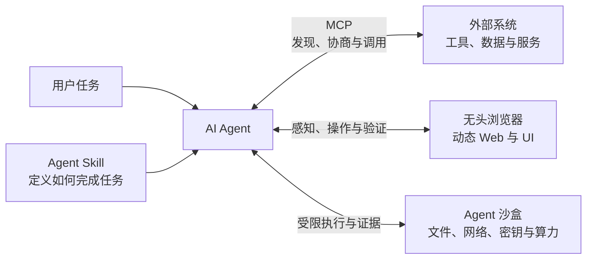

# Deep Agent

面向 AI Agent 开发者的中文工程指南，聚焦如何把模型能力从一次性的 Prompt，建设为可发现、可组合、可验证、可治理的生产系统。

这个仓库目前围绕四条互补的主线展开：

- **Agent Skill**：沉淀 Agent 完成一类任务的方法、知识与确定性工具；
- **Model Context Protocol（MCP）**：用标准协议连接 Agent 与外部数据、工具和交互能力；
- **浏览器 Agent**：让 Agent 在受控环境中感知、操作并验证真实 Web 界面；
- **Agent 沙盒**：用权限、资源、网络、密钥和生命周期边界安全执行模型生成的代码与工具调用。



## 内容导航

| 指南 | 主要内容 | 适合读者 |
| --- | --- | --- |
| [从 Prompt 到工程化能力：Agent Skill 的设计规范与实现](docs/skill-engineering-guide.md) | Skill 的触发与渐进式加载、`SKILL.md`、Scripts / References / Assets、运行时、安全、测试、发布和可观测性 | 正在设计可复用 Agent 能力，或希望规范团队 Skill 开发流程的工程师 |
| [把 AI 接口做成协议：MCP 工程规范与生产级实现](docs/mcp-engineering-guide.md) | Host / Client / Server 架构、JSON-RPC 生命周期、核心能力、Schema、传输、授权，以及 TypeScript Server 的实现、测试和部署 | 正在开发 MCP Server、MCP Client，或为 Agent 接入外部系统的工程师 |
| [Agent 为什么需要无头浏览器：作用、架构、选型与生产实践](docs/headless-browser-agent-guide.md) | 无头浏览器的感知—行动闭环、结构化与视觉交互、主流工具分层选型、安全、可靠性、成本和评测 | 正在构建浏览 Agent、前端验证 Agent，或评估 Playwright、Stagehand、Browser Use 与云浏览器的工程师 |
| [Agent 为什么需要沙盒：作用、隔离模型、选型与生产实践](docs/agent-sandbox-engineering-guide.md) | Agent 沙盒的威胁模型、权限与隔离边界、容器 / gVisor / Wasm / MicroVM 分层、主流自建与托管方案、安全架构和评测 | 正在运行模型生成代码、建设 Coding Agent 或评估 Docker Sandboxes、Firecracker、Vercel Sandbox、E2B 等方案的工程师 |

## 如何选择

- 想让 Agent **稳定掌握一套工作方法**，从 Skill 指南开始；
- 想让 Agent **安全访问工具、数据或远程服务**，从 MCP 指南开始；
- 想让 Agent **操作动态网页或验证真实 UI**，阅读无头浏览器指南；
- 想让 Agent **安全运行 Shell、代码和不可信依赖**，阅读 Agent 沙盒指南；
- 正在建设完整的 Agent 平台，建议先读 Skill 指南理解能力组织，再读 MCP 指南理解系统边界。

四者解决的是不同层面的问题：Skill 规定 Agent **应该如何做**，MCP 规定 Agent 与外部能力 **如何连接和通信**，无头浏览器提供操作真实 Web UI 的**感知与执行环境**，沙盒则限制代码与工具调用的**权限和爆炸半径**。在生产系统中，它们可以组合出现。

## 阅读方式

文档均使用 Markdown 编写，可直接在 GitHub 中阅读。部分架构图使用 Mermaid，建议使用支持 Mermaid 的 Markdown 阅读器。

如需离线阅读：

```bash
git clone https://github.com/EarthWind/deepagent.git
cd deepagent
```

仓库中的指南不依赖构建工具或运行环境。

## 仓库结构

```text
deepagent/
├── README.md
└── docs/
    ├── assets/
    │   ├── agent-sandbox-header.png
    │   ├── headless-browser-agent-header.png
    │   ├── mcp-engineering-header.png
    │   └── skill-engineering-header.png
    ├── agent-sandbox-engineering-guide.md
    ├── headless-browser-agent-guide.md
    ├── mcp-engineering-guide.md
    └── skill-engineering-guide.md
```

## 写作原则

这些指南不以最短的演示代码为终点，而是关注能力进入生产环境后必须面对的问题：

- 明确协议、版本和能力边界；
- 把安全与用户授权放在信任边界内设计；
- 用渐进式加载控制上下文成本；
- 通过测试、可观测性和发布治理建立反馈闭环；
- 区分基础约定与团队增强实践，避免把建议误写成规范。

欢迎通过 Issue 或 Pull Request 提出修正、案例和新的工程主题。
