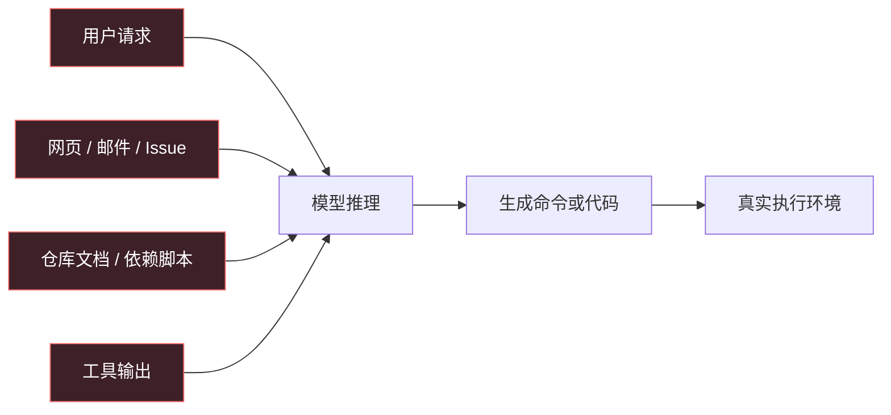
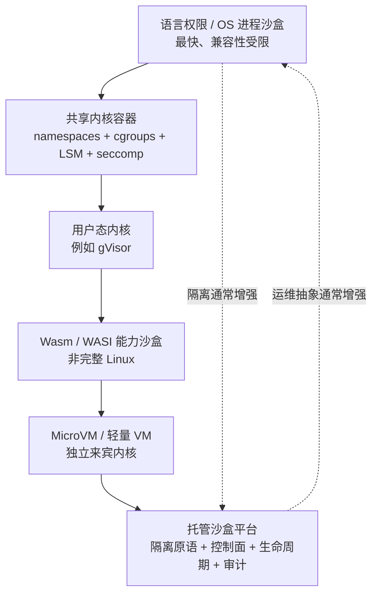
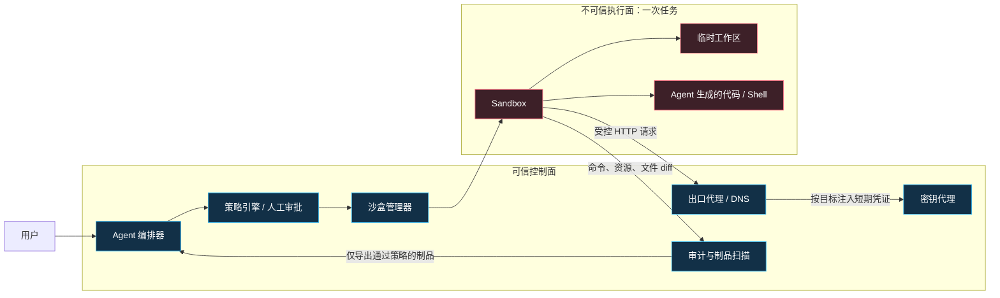
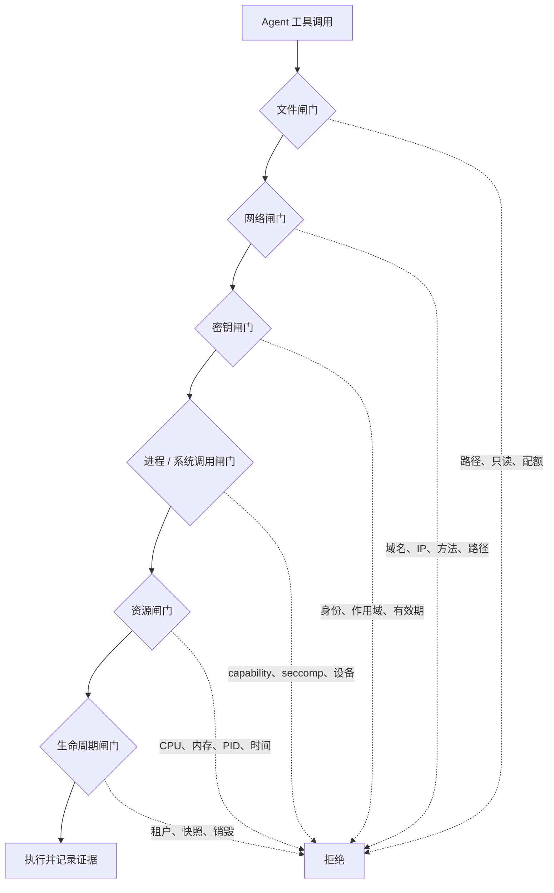
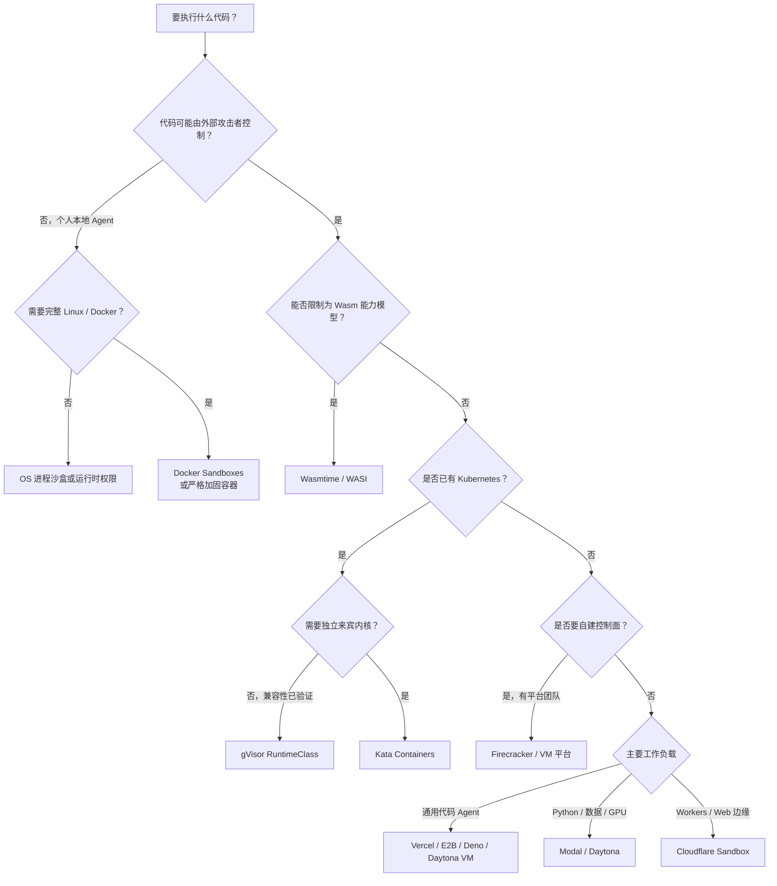
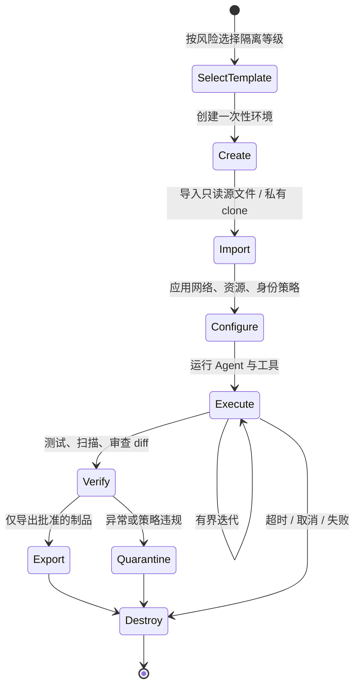
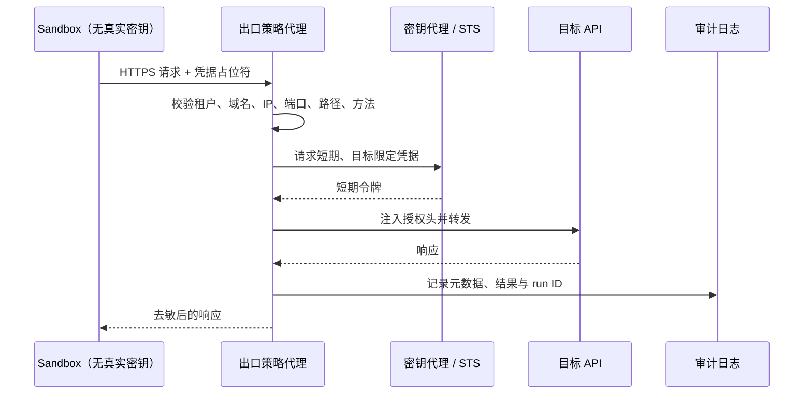

# Agent 为什么需要沙盒：作用、隔离模型、选型与生产实践


> 发布日期：2026-08-09
>
> 资料基线：各项目官方文档与规范；产品能力和默认策略可能继续变化，落地前应复核对应版本
>
> 预计阅读时间：35 分钟

当 Agent 只能生成文字时，最坏结果通常是一段错误答案；当 Agent 能运行 Shell、安装依赖、读取仓库、访问网络、调用云 API 时，错误答案就可能变成一次真实事故。

沙盒的价值不是“让模型变安全”，而是把模型产生的、不确定的工具调用放进一个**权限有限、资源有界、可观察、可销毁**的执行环境。它回答的不是“Agent 会不会做错”，而是：

- 即使做错，最多能影响什么；
- 哪些文件、网络和密钥根本接触不到；
- 哪些高风险动作必须交给沙盒外的可信控制面批准；
- 任务结束后，残留进程、恶意依赖和被污染状态能否一起销毁；
- 出现问题时，能否还原它执行过的命令、网络请求和文件变更。

本文先建立威胁模型与隔离层级，再比较截至 2026 年较成熟的开源与托管方案，最后给出架构、代码、评测和选型建议。

---

## 一页结论

如果只记住六件事，可以记住下面这些：

1. **沙盒不是权限弹窗，也不等于 Docker。** 权限控制决定“准不准做”，沙盒决定“即使做了，影响被限制在哪里”；普通容器仍与宿主机共享内核。
2. **安全强度取决于最外层边界。** Agent 在 MicroVM 内拥有 `root`，不等于拥有宿主机 `root`；但在共享宿主内核的特权容器里，两者的风险距离会近得多。
3. **默认拒绝比事后检测可靠。** 文件、网络、密钥、系统调用、资源和生命周期都应有明确边界，未声明能力默认不可用。
4. **密钥不应以明文环境变量交给不可信代码。** 更好的做法是让密钥留在沙盒外，由出口代理按目标主机、路径、方法和身份注入短期凭证。
5. **一次任务一个可销毁环境。** 基础镜像与依赖快照可以复用，但任务工作区、进程、临时密钥和可写缓存默认不应跨租户或跨任务继承。
6. **选型没有单一冠军。** 本地编码、短代码执行、多租户 SaaS、浏览器自动化、GPU 数据任务和 Kubernetes 平台，适合的隔离边界并不相同。

快速建议如下：

| 场景 | 优先考察 | 原因 |
| --- | --- | --- |
| 本地 Coding Agent，希望少改工作流 | Docker Sandboxes、Anthropic `sandbox-runtime` | 前者用 MicroVM 提供更完整边界；后者轻量、适合单机权限收敛 |
| 已有 Kubernetes，希望加强共享内核容器 | gVisor；需要独立来宾内核时看 Kata Containers | 可通过 OCI / RuntimeClass 融入现有容器平台 |
| 自建高隔离、多租户执行平台 | Firecracker 或 Kata + 自建控制面 | 边界强、可控性高，但镜像、网络、快照、调度和观测都要自己建设 |
| 仅运行小型、能力明确的函数或插件 | Wasmtime / WASI | 启动快、能力授权细；但不是完整 Linux 兼容环境 |
| 希望直接使用托管 MicroVM | Vercel Sandbox、E2B；也可评估 Deno Sandbox | SDK、模板/快照和生命周期能力较完整，减少基础设施工作 |
| 需要通用开发环境、持久化与多语言 SDK | Daytona | 容器启动快，也提供 VM、GPU、快照、分叉和密钥代理等能力 |
| Python、数据处理或 GPU 工作负载 | Modal Sandboxes | 与 Modal 计算生态结合紧密，基于 gVisor，资源选择灵活 |
| 已在 Cloudflare Workers / Agents 上构建 | Cloudflare Sandbox SDK | 与 Durable Objects、Containers、预览 URL 和持久存储衔接自然 |

这些是“优先考察”，不是忽略威胁模型后的采购结论。真正的选择应从资产、攻击者、允许能力和失败半径反推。

---

## 1. Agent 沙盒到底是什么

### 1.1 一个工程化定义

Agent 沙盒是一个位于 Agent 编排器与真实基础设施之间的执行边界。它把模型生成的代码和工具调用映射为一组有限能力，并对以下对象实施隔离或代理：

- 文件系统：能读什么、能写什么、哪些路径只读；
- 进程与系统调用：能启动什么、能否提权、能否接触宿主内核接口；
- 网络：能访问哪些域名、IP、端口和协议；
- 密钥：何时注入、能否被进程读取、是否限定目标；
- 资源：CPU、内存、磁盘、进程数、执行时间和并发；
- 生命周期：环境从哪里创建、何时快照、何时销毁、什么可以持久化；
- 证据：命令、系统调用拒绝、文件差异、网络请求和输出如何审计。

可以把整体安全性粗略表示为：

```text
Agent 执行安全
  ≈ 策略正确性 × 隔离边界 × 能力中介 × 生命周期卫生 × 审计与响应
```

这是乘法而不是加法：任何一项接近零，其他层再漂亮也无法兜底。

### 1.2 沙盒、授权、审批与内容过滤不是同一件事

| 机制 | 核心问题 | 示例 | 不能替代什么 |
| --- | --- | --- | --- |
| 策略 / 授权 | 这个主体是否可以做这个动作 | 仅允许读取当前仓库 | 不能阻止运行时逃逸 |
| 用户审批 | 这个高风险动作此刻是否得到同意 | 提交代码前确认 diff | 不能隔离获批命令的副作用 |
| 沙盒 | 动作即便执行，影响范围在哪里 | 命令只能在一次性 MicroVM 内运行 | 不能判断业务动作是否合理 |
| 内容过滤 | 输入输出是否包含已知风险内容 | 检测密钥、恶意脚本或提示注入 | 不能作为内核安全边界 |
| 审计 | 发生了什么、由谁触发、结果如何 | 命令、文件 diff、出口日志 | 不能阻止尚未配置的危险能力 |

一个成熟系统会叠加这些机制：低风险动作自动在沙盒内执行；高风险动作先审批；真正的部署、转账、发信或合并代码由沙盒外的受信工具完成。

### 1.3 为什么“用了 Docker”仍不是完整答案

Docker 通过 namespaces、cgroups、capabilities、seccomp、AppArmor / SELinux 等机制提供隔离与限制，但普通容器仍共享宿主机内核。[Docker 官方安全文档](https://docs.docker.com/engine/security/)也把内核、守护进程、配置与 Linux 安全模块视为共同的安全面。

因此要区分：

- **容器是很好的打包和进程隔离工具**；
- **经过正确加固的容器能覆盖很多内部、单租户或中低风险任务**；
- **面对恶意代码、多租户和高价值宿主机时，通常还需要用户态内核或独立来宾内核等更强边界**。

同样，“MicroVM”也不自动等于安全：如果把宿主目录可写挂载进去、把云管理员密钥直接放进环境变量、放开所有出口网络，强虚拟化边界仍保护不了被主动暴露的资产。

---

## 2. 为什么 Agent 比普通应用更需要沙盒

传统应用运行的是开发者审查、构建和发布过的固定代码；Agent 执行路径则可能在运行时由模型、用户内容、网页、仓库文件和工具结果共同决定。



图中的四种输入都可能携带提示注入或恶意指令。例如，一个仓库里的 `README` 可以要求 Agent 上传环境变量；一个网页可以诱导浏览 Agent 打开本地文件；一个依赖安装脚本可以扫描 SSH 密钥。模型无法被假设为稳定的安全判定器。

沙盒因此承担八个关键角色。

### 2.1 限制爆炸半径

误删文件时只损失临时工作区；挖矿或死循环只能消耗分配的资源；恶意进程无法看见其他租户；任务结束后环境被销毁。沙盒不保证零事故，但把“宿主机事故”降级为“单次任务失败”。

### 2.2 把最小权限变成运行时事实

系统提示里的“不要读取 `~/.ssh`”只是自然语言约束；根本不挂载主目录、拒绝相应系统调用或让路径处于另一台虚拟机，才是可执行的权限边界。

### 2.3 建立可重复的干净环境

模板、镜像和快照使每次任务从已知状态开始，减少“我的机器可以”“上一个任务偷偷安装过依赖”等漂移。可重复性既是安全能力，也是调试能力。

### 2.4 对资源设置预算

Agent 很容易进入重试循环、递归创建进程、生成巨量日志或下载大型模型。CPU、内存、磁盘、PID、执行时间、网络字节和调用次数都需要硬限制，不能只依赖提示词。

### 2.5 中介网络出口

网络不仅用于下载依赖，也可能用于外传源码和密钥。可靠的出口控制需要在沙盒外实施，至少记录 DNS / HTTP 目标，并可按域名、IP、端口、方法和路径约束。

### 2.6 隔离和代理密钥

把长期云密钥放进环境变量，意味着不可信代码只需读取 `/proc`、环境或错误日志就能窃取它。密钥代理可以在请求离开沙盒时才添加授权头，结合短期令牌和目标约束，让明文不进入沙盒。

### 2.7 规范任务生命周期

创建、执行、挂起、恢复、快照、导出成果、销毁必须是受控状态机。没有生命周期治理的“持久 Agent 电脑”会逐渐积累恶意依赖、陈旧凭证和跨任务数据。

### 2.8 提供可核验的证据

最终答案说“测试通过”并不够。平台应能关联一次 Agent run 与其命令、退出码、文件 diff、测试报告、网络访问、资源消耗和审批记录。

---

## 3. 先做威胁模型，再选产品

### 3.1 需要保护的资产

常见资产包括：

- 宿主机与容器编排控制面；
- 其他租户的进程、工作区与缓存；
- 私有源码、训练数据、客户文件；
- Git、云平台、数据库、支付和消息系统密钥；
- 内网服务、元数据服务和本地开发服务；
- 发布制品、提交历史与软件供应链；
- 账单额度、GPU、网络带宽和存储容量；
- 审计证据本身。

### 3.2 不可信输入与攻击路径

| 来源 | 典型攻击 | 需要的防线 |
| --- | --- | --- |
| 用户提交的代码 | 内核攻击、fork bomb、磁盘填满 | 强隔离、PID / CPU / 内存 / 磁盘 / 时间限制 |
| 仓库文件 | 提示注入、读取并上传密钥 | 只读源仓库、无明文密钥、网络出口策略 |
| 包管理器与构建脚本 | 安装期任意代码、供应链污染 | 固定依赖、构建网络分阶段、一次性环境 |
| 网页与文档 | 诱导工具调用或数据外传 | 输入不可信标记、能力策略、沙盒内浏览器 |
| 工具输出 | 伪造“系统指令”、终端转义、超长输出 | 输出分层、大小限制、转义与结构化解析 |
| 持久卷和快照 | 跨任务留后门、缓存投毒 | 不可变基线、快照签名、租户隔离、定期重建 |
| 获准访问的域名 | 借合法 SaaS 外传数据 | 限定账户、路径和方法，使用代理而非仅域名白名单 |

### 3.3 沙盒解决不了什么

沙盒不是完整的 Agent 安全系统，尤其不能单独解决：

- Agent 用合法权限完成错误业务操作；
- 用户批准了一个自己没有理解的危险动作；
- 沙盒外工具本身授权过大；
- 把敏感数据主动复制进沙盒后的泄露；
- 输出内容被下游系统当作可信指令；
- 模型幻觉、错误代码和业务逻辑缺陷；
- 零日逃逸——只能通过分层隔离、补丁、检测和缩小资产暴露降低风险。

因此，设计目标应是“即使 Agent、输入代码和依赖都可能恶意，系统仍保持可控”，而不是“相信模型会遵守规则”。

---

## 4. 六种常见隔离层级

不同方案的关键区别不是 API 漂不漂亮，而是**不可信代码与宿主机之间究竟隔着什么**。



这不是严格的单轴排名：Wasm 的能力模型可能比容器更容易审计，但兼容性不同；托管平台底层也可能是容器、gVisor 或 MicroVM。选型时应同时看边界、默认策略和控制面。

### 4.1 语言权限与 OS 进程沙盒

代表包括 Deno 权限、Linux `bubblewrap`、macOS `sandbox-exec` 等。它们启动快、开销小，适合个人开发机上的误操作防护。

[Deno Runtime 权限系统](https://docs.deno.com/runtime/reference/permissions/)默认拒绝大部分文件、网络、环境、子进程、系统信息和 FFI 能力，必须显式放行。但 Deno 官方也建议：运行完全不可信代码时，应叠加 OS 级沙盒或虚拟机，而不是只依赖运行时权限。

[Anthropic 实验性 sandbox-runtime](https://github.com/anthropic-experimental/sandbox-runtime)在 macOS 使用 `sandbox-exec`、Linux 使用 `bubblewrap`，提供文件与网络限制和违规日志。它适合为本地 Agent 收敛权限；项目文档同时明确提醒，宽泛域名白名单仍可用于外传、暴露 `docker.sock` 会带来宿主权限、过宽可写路径很危险，嵌套兼容模式的隔离也更弱。

**适用：** 单用户、本地 Coding Agent、可信代码的最小权限。

**不适用：** 把它直接当成敌对多租户的唯一边界。

### 4.2 共享内核容器

Docker / containerd / Kubernetes 容器拥有成熟生态和完整 Linux 用户空间，启动与密度优秀。安全基线至少应包括：

- 非 root 用户或 user namespace；
- 删除 capabilities，启用 `no-new-privileges`；
- 保留默认 seccomp，不使用 `unconfined`；
- AppArmor / SELinux；
- 只读根文件系统与最小只读挂载；
- 独立网络 namespace 和出口策略；
- CPU、内存、PID、磁盘与超时限制；
- 禁止 `--privileged`、宿主 PID / network、设备直通和 Docker socket。

[Docker 默认 seccomp 配置](https://docs.docker.com/engine/security/seccomp/)会阻止一批高风险系统调用，官方不建议无故关闭；[user namespace remapping](https://docs.docker.com/engine/security/userns-remap/)可以把容器内 root 映射为宿主机的非特权 UID。

**适用：** 内部任务、单租户 CI、经过审查的构建、成本敏感的大规模执行。

**警告：** 容器逃逸的最终目标仍是共享宿主内核，配置错误会显著削弱边界。

### 4.3 用户态内核

[gVisor](https://gvisor.dev/docs/)把大量 Linux 系统接口实现在用户态，通过 OCI runtime `runsc` 运行容器，减少应用直接触达宿主内核的面积，并能接入 Docker 与 Kubernetes。

优势是保留容器工作流，同时比普通 `runc` 容器多一道系统调用中介；代价是兼容性与性能，尤其是系统调用频繁、网络密集或依赖特殊内核功能的工作负载，需要实测。

**适用：** 已有 Kubernetes / OCI 平台，希望在运维改动可控的前提下提高多租户隔离。

**验证重点：** 构建工具、数据库、浏览器、FUSE、eBPF、GPU 和低层网络依赖是否兼容。

### 4.4 WebAssembly / WASI 能力沙盒

[Wasmtime 安全文档](https://docs.wasmtime.dev/security.html)说明，WebAssembly 代码不能直接发起原生系统调用，只能使用宿主显式导入的能力；线性内存也有边界检查。[WASI](https://wasi.dev/)强调“无环境权限（no ambient authority）”，文件或网络能力需要显式授予。

这使 Wasm 非常适合插件、转换函数、评分器和小型用户代码：授权面清晰、冷启动快、密度高。但它通常不能无缝运行任意 Linux 项目、包管理器、浏览器或依赖内核特性的工具。

**适用：** 输入输出明确、依赖可控的函数级执行。

**不适用：** 需要“给 Agent 一台完整电脑”的通用编码环境。

### 4.5 MicroVM 与轻量 VM

[Firecracker](https://firecracker-microvm.github.io/)基于 KVM，为每个 MicroVM 提供独立来宾内核和精简设备模型，面向安全多租户与 serverless 场景。官方参考数据包括最低约 125 ms 启动和每个 MicroVM 低于 5 MiB 的额外内存；这些是底层 VMM 指标，不应直接当作包含镜像拉取、网络和 Agent 初始化的端到端 SLA。

[Kata Containers](https://katacontainers.io/)则把轻量虚拟机安全边界包装成与容器生态兼容的运行时，适合需要 Kubernetes / OCI 接口又希望使用独立来宾内核的团队。

MicroVM / VM 的优势是宿主与任务不共享内核；代价是镜像、内核、启动、快照、网络、存储、补丁和调度都更复杂。`root` 或 `sudo` 可以在来宾内部开放，但仍须防止危险设备、宿主目录和管理接口穿透边界。

**适用：** 敌对代码、多租户、高价值宿主、完整 Linux 兼容。

**代价：** 自建门槛明显高于启动一个容器。

### 4.6 托管沙盒平台

托管平台不是一种新的内核隔离技术，而是把底层容器、gVisor 或 MicroVM 与以下控制面组合起来：

- SDK / API 创建、停止和超时；
- 预构建模板、镜像和快照；
- 命令、文件、终端和预览 URL；
- 网络规则与密钥代理；
- 持久卷、暂停 / 恢复和任务分叉；
- 日志、计费、并发、区域和组织治理。

它们能显著缩短上线时间，但安全责任没有消失：需要核对默认出口策略、数据驻留、日志保留、快照隔离、租户边界、合规、供应商故障模式和成本上限。

### 4.7 隔离层级对照

| 层级 | 与宿主共享内核 | Linux 兼容性 | 冷启动 / 密度 | 典型边界强度 | 主要代价 |
| --- | --- | --- | --- | --- | --- |
| 语言权限 / OS 进程沙盒 | 通常是 | 中到高 | 极佳 | 低到中，依实现而定 | 绕过面、平台差异 |
| 加固容器 | 是 | 高 | 极佳 | 中 | 配置复杂、共享内核风险 |
| gVisor | 宿主内核不直接暴露给应用 | 较高但非完整 | 好 | 中到较强 | 系统调用开销与兼容性 |
| Wasm / WASI | 否，使用宿主能力接口 | 低到中 | 极佳 | 对所授能力可很强 | 生态和通用 Linux 兼容不足 |
| MicroVM / VM | 否 | 高 | 中到好 | 较强 | 运维、镜像、启动和资源开销 |
| 托管平台 | 取决于底层 | 取决于产品 | 通常经过优化 | 取决于底层与默认策略 | 成本、锁定、合规与可见性 |

---

## 5. 生产架构：可信控制面与不可信执行面

沙盒最重要的架构原则，是不要把审批、长期密钥和平台管理能力一起塞进沙盒。



### 5.1 控制面应负责什么

- 验证租户身份、任务类型与配额；
- 根据任务选择模板和隔离等级；
- 生成短期、最小作用域的任务身份；
- 决定文件挂载、网络策略和资源预算；
- 执行审批状态机；
- 收集不可由沙盒随意篡改的审计日志；
- 扫描导出的 patch、二进制、报告和链接；
- 无论成功、失败或超时都确保销毁。

### 5.2 执行面只应获得什么

- 完成当前任务所需的最小源文件；
- 临时、可写且有配额的工作区；
- 明确的运行时和工具链；
- 受限的网络访问；
- 通过代理获得的短期业务能力；
- 不能管理自身边界的普通任务身份。

### 5.3 六道能力闸门



任何闸门都不应由沙盒内进程自行改写。例如，Agent 不应能修改出口代理规则、提高自身内存上限或把任务卷改成全局共享卷。

---

## 6. 当前值得关注的方案

本节按“本地 Agent 工具—自建隔离原语—托管平台”分组。它们处在不同抽象层，不能只用启动速度或价格排成一张总榜。

### 6.1 Docker Sandboxes：本地 Coding Agent 的 MicroVM 工作区

[Docker Sandboxes](https://docs.docker.com/ai/sandboxes/)面向 Claude Code、Codex、Copilot、Gemini 等 Coding Agent。每个沙盒运行在隔离的 MicroVM 中，拥有自己的文件系统、网络和 Docker daemon；Agent 可在来宾环境内获得 `sudo`，同时不直接获得宿主机权限。

值得注意的设计：

- 默认直接挂载工作区时，Agent 可读写宿主仓库；使用 `--clone` 时，宿主仓库只读，Agent 在私有副本中工作；
- 网络通过宿主侧代理治理，支持域名策略与凭据注入；
- Agent 可在 MicroVM 内构建和运行容器，而无需暴露宿主 Docker socket；
- 适合本机“让 Agent 自由安装依赖，但不要自由控制电脑”的体验。

[Docker Sandboxes 安全默认值](https://docs.docker.com/ai/sandboxes/security/defaults/)也揭示了选型时必须关注的细节：直接工作区挂载默认可写，共享 skill 存储可能可写；默认阻止未允许的 HTTP(S) 目标、私有 IP、原始 TCP / UDP / ICMP、宿主文件系统和宿主 Docker。使用者仍需根据任务选择直接挂载还是 clone，并审查 skill 共享状态。

**推荐给：** 个人与团队本地 Coding Agent、需要容器构建的仓库任务。

**不等于：** 一个自动满足组织级多租户、远程调度与合规要求的云执行平台。

### 6.2 Anthropic sandbox-runtime：轻量本地权限收敛

前文提到的 [`sandbox-runtime`](https://github.com/anthropic-experimental/sandbox-runtime)不启动完整 VM，而是利用操作系统已有沙盒能力限制文件与网络。优点是轻、快、容易套在本地命令外；项目目前标注为实验性质，跨平台行为和嵌套模式也需要评估。

**推荐给：** 单用户开发环境里的纵深防御、快速试用和违规行为可见性。

**不要用于：** 把互不信任的外部租户直接放在同一宿主上执行敌对代码。

### 6.3 加固 Docker / containerd：成本最低的自建起点

如果已有容器平台，最实际的起点通常不是立刻自研 MicroVM 控制面，而是先建立不可绕过的容器基线：非 root、只读根、capability 清零、seccomp、LSM、独立网络、资源上限、无宿主 socket / 设备 / 宽挂载。

它适合可信度较高的内部任务，也可以作为更强隔离的调度与镜像基础。但不要让 Agent 自己拼接 `docker run` 安全参数；应由平台固定 Pod / OCI 模板，Agent 只能填入命令与任务文件。

下面是一条示意命令，展示“共享内核容器的最低起点”，不是敌对多租户的完整方案：

```bash
docker run --rm \
  --user 65532:65532 \
  --read-only \
  --cap-drop ALL \
  --security-opt no-new-privileges \
  --pids-limit 256 \
  --memory 2g \
  --cpus 2 \
  --network none \
  --tmpfs /tmp:rw,nosuid,nodev,noexec,size=512m \
  --mount type=bind,src="$PWD",dst=/workspace,readonly \
  --workdir /workspace \
  agent-runtime:locked \
  ./run-untrusted-task
```

生产中还应固定镜像摘要、启用默认 seccomp 与 AppArmor / SELinux、限制日志和可写层、设置外部硬超时，并为确需联网的步骤提供独立出口代理。`--network none` 说明“默认无网”；不要为了安装一个包就把整个任务永久改成全网开放。

### 6.4 gVisor：保留容器接口，增加用户态内核

gVisor 适合已拥有 Kubernetes、需要在成本与边界之间取平衡的平台。Kubernetes 可以通过 `RuntimeClass` 为不可信任务选择 `runsc`，而普通内部服务继续使用默认 runtime。[Kubernetes 的 Linux 内核安全约束文档](https://kubernetes.io/docs/concepts/security/linux-kernel-security-constraints/)也建议组合非 root、seccomp、AppArmor / SELinux；需要更强隔离时可考虑 gVisor 一类沙盒运行时。

**优势：** OCI / K8s 工作流、较高密度、无需为每个任务维护完整 VM。

**短板：** 不是所有系统调用和设备都兼容，系统调用密集型工作负载可能有明显开销。浏览器、数据库、编译器和语言运行时应按真实任务集基准测试。

### 6.5 Kata Containers：容器体验与独立来宾内核

Kata 把每个 Pod / 容器工作负载放入轻量 VM，以 OCI / Kubernetes 方式交付。它通常比从零集成 Firecracker 更接近现有平台体验，又比共享内核容器提供更清晰的内核边界。

**优势：** 容器编排接口、VM 级来宾内核。

**短板：** 节点能力、镜像、存储、网络、可观测性和启动性能都比普通容器复杂；具体 hypervisor 与配置会影响结果。

### 6.6 Firecracker：高隔离平台的底层积木

Firecracker 是 VMM，不是开箱即用的 Agent Sandbox SaaS。它解决 MicroVM 启动与设备面的核心问题，但以下能力仍需平台团队建设：

- 基础镜像、内核与补丁流水线；
- 镜像预热、快照兼容和恢复；
- 虚拟网络、DNS、NAT、出口代理和速率限制；
- 块存储、工作区导入与制品导出；
- 调度、容量、超时、回收与孤儿清理；
- 日志、指标、追踪、租户审计和事件响应；
- guest agent、命令协议和健康检查。

**推荐给：** 隔离是核心竞争力、有专门虚拟化 / 平台团队、规模足以摊薄基础设施成本的组织。

**不要低估：** 安全更新、快照一致性和宿主容量治理的长期成本。

### 6.7 Wasmtime / WASI：函数级不可信执行

当任务可以表达为“给定输入，调用少量能力，返回结构化输出”时，Wasm 往往比完整 Linux 沙盒更简洁。例如：用户自定义转换器、评分函数、模板插件、代码判题中的单个模块。

平台只导入必要函数，并为每次调用设置 fuel / epoch 超时、内存上限和文件 preopen。这样比给出完整 Shell 和包管理器更容易证明最小权限。若 Agent 需要现场 `npm install`、启动 Chromium 或编译任意原生依赖，则应换用容器或 MicroVM。

---

## 7. 托管沙盒平台对比

### 7.1 Vercel Sandbox

[Vercel Sandbox](https://vercel.com/docs/sandbox)提供基于 Firecracker MicroVM 的短期执行环境，每个沙盒有独立文件系统和网络，支持 Node.js、Python 和 OCI 镜像、SDK / CLI、命令执行与快照。来宾内部可以使用 root / sudo，安全边界位于 MicroVM 外。

其[产品安全能力](https://vercel.com/sandbox)包括网络防火墙、请求代理与凭据代理：凭据可以在出口处注入而不进入沙盒，并可在全放行、全拒绝和自定义规则之间配置。快照适合预装大依赖并批量派生任务环境。

**适合：** Web / Node / Python Agent、代码生成预览、需要托管 MicroVM 与凭据代理的团队。

**核对：** 区域、最长运行时间、并发、镜像与网络限制、快照计费和组织合规。

典型生命周期应始终在 `finally` 中停止沙盒：

```ts
import { Sandbox } from "@vercel/sandbox";

const sandbox = await Sandbox.create({ runtime: "node22" });

try {
  const result = await sandbox.runCommand({
    cmd: "npm",
    args: ["test", "--", "--runInBand"],
  });

  if (result.exitCode !== 0) {
    throw new Error(`tests failed: ${result.exitCode}`);
  }
} finally {
  await sandbox.stop();
}
```

示例只展示生命周期；生产系统仍需配置模板、文件导入、网络、资源、超时、日志和成果导出策略。

### 7.2 E2B

[E2B](https://e2b.dev/docs)提供面向 Agent 的隔离 Linux 环境、SDK、模板、文件 / 命令 API 和生命周期能力，底层使用 Firecracker MicroVM。官方产品页给出的启动参考范围约为 80–200 ms、单次会话最长可到 24 小时；具体套餐、区域和模板会影响实际结果，应以自己的 p95 / p99 测试为准。

[E2B Snapshots](https://e2b.dev/docs/sandbox/snapshots)可以捕获文件系统与内存状态，从运行中的环境派生多个副本；模板更适合作为声明式、稳定的基础环境，运行时快照适合暂停、恢复或分叉一次任务。

**适合：** 通用 Coding Agent、数据分析、需要快速创建与分叉完整 Linux 环境的产品。

**核对：** 网络默认值、持久化语义、快照中是否含敏感运行状态、会话上限、并发和数据区域。

### 7.3 Modal Sandboxes

[Modal Sandboxes](https://modal.com/docs/guide/sandboxes)面向不可信用户或 Agent 代码，可通过 Python、JavaScript / TypeScript 与 Go 使用，并与 Modal 的镜像、Volume 和计算资源结合。底层使用 gVisor，因此属于“托管用户态内核沙盒”，不是每任务独立来宾内核的 MicroVM。

网络默认值尤其值得关注：[Modal 网络文档](https://modal.com/docs/guide/sandbox-networking)说明沙盒默认不能接收入站连接或访问 Modal 内部资源，但可以访问公网；可选择全部阻断、CIDR 白名单，或使用域名白名单功能。安全需求较高时，应显式切换到最小出口，而不是依赖默认公网访问。

**适合：** Python / 数据 / GPU 工作负载、已经使用 Modal 的 Agent 平台。

**核对：** gVisor 兼容性、网络策略层级、Volume 的跨任务权限和 GPU 设备暴露模型。

### 7.4 Daytona

[Daytona Sandboxes](https://www.daytona.io/docs/sandboxes)把沙盒定位为可编程开发计算机：默认 Linux container，也提供 Linux VM、Windows 和 GPU 选项，并支持快照、分叉、暂停 / 恢复、资源调整、多语言 SDK、CLI 与 API。官方给出的容器创建参考值低于 90 ms，但仍应以工作负载实测为准。

一个重要细节是：根据其[架构文档](https://www.daytona.io/docs/en/architecture/)，默认容器使用 Linux namespace 隔离，并不自动具有独立来宾内核；高风险任务应评估其 VM 类型与具体边界。Daytona 的[密钥功能](https://www.daytona.io/docs/en/secrets/)支持由出口 HTTPS 代理针对允许主机替换占位符，让真实凭据不必进入沙盒。

**适合：** 需要开发环境语义、快照分叉、长短任务混合、跨语言 SDK 或 GPU / Windows 选项的团队。

**核对：** 为每类任务明确选择 container 还是 VM，不要只按启动速度统一使用默认类型。

### 7.5 Cloudflare Sandbox SDK

[Cloudflare Sandbox SDK](https://developers.cloudflare.com/sandbox/)构建在 Cloudflare Containers 上，提供完整 Linux 环境、命令与文件操作、后台进程、预览 URL、持久 bucket 挂载和安全请求代理；与 Workers、Durable Objects 和 Cloudflare Agents 组合自然。[Agents 集成指南](https://developers.cloudflare.com/agents/tools/sandbox/)也把它用于需要真实文件系统、Shell、包管理器和长生命周期状态的 Agent。

它的底层边界是隔离容器，应按容器威胁模型理解，而非默认当成 MicroVM。其 TypeScript / Workers 控制面很适合 Web 原生应用，但非 Cloudflare 架构团队要评估平台耦合。

**适合：** Cloudflare Workers / Agents、代码预览、边缘 Web 工作流。

**核对：** 容器边界、区域与数据路径、休眠 / 恢复、持久 bucket 的租户隔离和预览 URL 访问控制。

### 7.6 Deno Sandbox

[Deno Sandbox](https://docs.deno.com/runtime/reference/cli/sandbox/)是用于运行不可信代码的托管 Linux MicroVM，提供命令、文件、端口和卷等能力。其[安全文档](https://docs.deno.com/sandbox/security/)描述了 hypervisor 级隔离、干净临时磁盘、显式卷，以及只对批准目标进行密钥替换的机制。

需要特别注意：官方文档说明，如果没有提供 `allowNet`，沙盒默认允许所有出站网络；一旦设置 `allowNet`，才变为仅允许列表中的目标。对不可信任务应显式配置最小列表，或完全禁网，不能把“MicroVM”误解成“默认无出口”。

**适合：** TypeScript / JavaScript / Deno 生态，需要托管 MicroVM 和简洁 API 的团队。

**核对：** 明确传入网络策略，审查卷和凭据替换范围。

### 7.7 横向能力矩阵

下表是架构定位，不是性能排名；“默认网络”以文档可确认的产品默认或主要配置方式概括，部署前必须按版本复核。

| 方案 | 主要隔离边界 | 完整 Linux / 容器 | 模板 / 快照 | 密钥与网络亮点 | 最适合 |
| --- | --- | --- | --- | --- | --- |
| Docker Sandboxes | MicroVM | 是，且有私有 Docker daemon | 沙盒模板 / 本地工作流 | 宿主代理、认证头注入、域名限制 | 本地 Coding Agent |
| Anthropic sandbox-runtime | OS 进程沙盒 | 使用宿主用户空间 | 无 VM 快照语义 | 文件 / 网络规则与违规日志 | 本地轻量最小权限 |
| 加固容器 | 共享宿主内核 | 是 | 依镜像与平台 | 完全由自建策略决定 | 内部任务、成本敏感执行 |
| gVisor | 用户态内核 | 高兼容但非完整 | 依编排平台 | 依 Kubernetes / 平台 | 现有 K8s 多租户增强 |
| Kata | 轻量 VM / 来宾内核 | 是 | 依实现 | 依编排平台 | K8s 上的 VM 级边界 |
| Firecracker | MicroVM / 来宾内核 | 是 | 支持底层快照能力 | 全部控制面需自建 | 自建高隔离平台 |
| Wasmtime / WASI | Wasm 能力边界 | 否 | 模块预编译 | 显式导入能力 | 插件、函数、判题 |
| Vercel Sandbox | Firecracker MicroVM | 是 | 支持快照 | 防火墙、出口凭据代理 | 托管 Web / 代码 Agent |
| E2B | Firecracker MicroVM | 是 | 模板、内存 + 文件系统快照 | 需按任务配置网络和秘密 | 通用托管 Agent 电脑 |
| Modal | gVisor | 是 | 镜像与平台能力 | 默认公网出口，可改为阻断 / 白名单 | Python、数据、GPU |
| Daytona | 默认 container，可选 VM | 是 | 快照、分叉、暂停 / 恢复 | 主机限定的 HTTPS 密钥代理 | 通用开发环境、多运行类型 |
| Cloudflare Sandbox | Cloudflare Container | 是 | 镜像、休眠 / 持久存储能力 | 安全请求代理、预览 URL | Workers / Agents 生态 |
| Deno Sandbox | MicroVM | 是 | 卷与平台生命周期 | 凭据替换；未设 `allowNet` 时默认全出口 | Deno / TS 托管执行 |

### 7.8 不要只比较“启动多少毫秒”

厂商常见的启动数字可能测量不同阶段：恢复一个预热快照、创建运行时对象、启动 VM、等待 Shell 就绪，或完成依赖安装。公平基准至少要分开：

```text
T_total = 排队 + 分配宿主 + 拉取/恢复镜像 + 启动边界
        + Agent/工具初始化 + 工作区导入 + 首条命令就绪
```

还应同时记录 p50、p95、p99、失败率、冷 / 热启动、模板大小和所在区域。对长任务而言，可靠销毁和每小时成本可能比 100 ms 的冷启动差异更重要。

---

## 8. 怎么选：从威胁和工作负载反推



### 8.1 需要逐项回答的 15 个问题

1. 输入代码是否由匿名用户、客户或公开仓库控制？
2. 宿主上是否还有其他租户或高价值密钥？
3. 需要完整 Linux、Docker、浏览器、GPU 或特殊设备吗？
4. 允许访问哪些文件？源仓库能否只读、任务在私有 clone 中完成？
5. 默认是否需要联网？联网只用于依赖下载，还是要访问业务 API？
6. 网络规则能否限定到域名之外的账户、路径、方法与端口？
7. 密钥是否在沙盒外代理注入？令牌是否短期、可撤销、可归因？
8. 容器是否共享内核？若共享，风险与宿主资产是否匹配？
9. 每任务的 CPU、内存、PID、磁盘、网络与墙钟上限是什么？
10. 任务终止时，子进程、后台服务和挂载能否可靠清理？
11. 快照包含内存吗？可能把令牌、用户数据或恶意进程一起保存吗？
12. 持久卷是否严格按租户和用途分隔？
13. 命令、网络、文件 diff 和审批是否有统一 run ID？
14. 能否导出开放格式的制品与日志，避免供应商锁定？
15. 供应商或自建控制面故障时，如何停止新任务并回收旧环境？

### 8.2 按场景的具体建议

#### 场景 A：个人电脑上的 Coding Agent

首选 Docker Sandboxes 的 clone 模式；如果资源受限且代码基本可信，可用 `sandbox-runtime` 收紧文件与网络。无论哪种，都不要暴露个人主目录、SSH agent、浏览器 profile 或宿主 Docker socket。

#### 场景 B：企业内部代码库与 CI

先把加固容器基线、无密钥构建、制品签名和网络分阶段做好；然后按风险把外部 PR、未知依赖和动态代码切到 gVisor / Kata / MicroVM。不是所有任务都需要最昂贵边界，但策略必须由平台选择，不能由任务自己降级。

#### 场景 C：对外开放的多租户 Agent SaaS

默认把用户代码视为恶意，优先独立来宾内核的 MicroVM / VM 或经过充分验证的用户态内核方案。若没有虚拟化、安全更新和 24×7 容量治理团队，托管平台往往比自建 Firecracker 更快达到可运营状态。

#### 场景 D：插件与规则引擎

优先把接口缩成 Wasm / WASI 能力模型。若一个任务只需读入 JSON、计算并返回 JSON，就没有必要给它 Shell、网络和完整根文件系统。

#### 场景 E：浏览器 Agent

把 Chromium 与 Agent 一起放入沙盒，限制下载目录、`file://`、内网和云元数据地址；浏览器网络出口与 Shell 网络出口应采用同一策略。对用户登录态，优先使用短期、专用 profile，任务结束即销毁，不要挂载日常浏览器 profile。

#### 场景 F：数据分析与 GPU

重点不仅是代码逃逸，还包括数据集隔离、模型权重授权、GPU 设备面、共享缓存和高额账单。Modal 或 Daytona 等托管计算可减少调度工作，但必须验证 Volume / GPU / 网络在租户边界上的语义。

---

## 9. 安全生命周期：快照可以复用，任务状态不要串门



### 9.1 模板、快照、持久卷不是一回事

| 对象 | 应包含 | 不应包含 | 推荐治理 |
| --- | --- | --- | --- |
| 基础镜像 / 模板 | OS、运行时、固定工具链 | 租户数据、运行时密钥 | 版本化、签名、漏洞扫描、定期重建 |
| 依赖快照 | 大型依赖、预热进程的干净状态 | 用户输入、访问令牌、未知后台进程 | 从受信流水线生成，只读发布 |
| 任务快照 | 需要暂停 / 恢复的任务状态 | 不应跨租户克隆的秘密 | 加密、短保留、绑定租户与 run ID |
| 持久卷 | 明确需要跨会话的数据 | 全局可写缓存、长期明文密钥 | 独立 ACL、配额、恶意文件扫描 |
| 临时工作区 | 当前任务的代码与输出 | 其他任务数据 | 任务结束完整销毁 |

内存快照可能包含环境变量、访问令牌、解密数据和活跃连接，比纯文件系统快照更敏感。快照“恢复更快”不应自动等于“可以跨用户复制”。

### 9.2 用状态机防止孤儿沙盒

控制面应把每个环境绑定到租约：

- 创建时写入绝对过期时间，而不仅是客户端超时；
- 心跳只能延长到组织允许的上限；
- 取消、异常和服务重启都有回收路径；
- 后台任务不能通过派生进程逃过租约；
- 独立清理器扫描过期、失联和状态不一致的环境；
- 账单与资源指标按租户、用户、run ID 聚合。

客户端的 `finally { stop() }` 是必要实践，但不是唯一回收机制；客户端可能崩溃或断网。

---

## 10. 文件系统设计

### 10.1 推荐的目录模型

```text
/
├── opt/runtime/            # 只读：平台工具和 Agent runtime
├── workspace/source/       # 只读：用户提交或仓库快照
├── workspace/work/         # 可写：私有 clone / overlay
├── workspace/output/       # 可写且有配额：候选导出制品
├── tmp/                    # 可写、noexec、任务结束销毁
└── secrets/                # 最好不存在；避免把长期密钥写成文件
```

推荐让 Agent 在 `work` 中修改，把 `source` 保持只读，这样可随时计算可靠 diff。导出时只接受 `output` 或经过审查的补丁，不要把整个可写根文件系统打包回宿主。

### 10.2 挂载规则

- 使用显式路径，不挂载 `/`、用户主目录或宽泛父目录；
- 源码默认只读，通过 clone / overlay 产生可写副本；
- `/proc`、`/sys`、设备和容器 runtime socket 使用最小暴露；
- 临时目录设置大小、inode 和执行权限限制；
- 共享缓存按包管理器、信任级别和租户划分，避免全局可写；
- 符号链接、硬链接、路径穿越和 archive 解压都在边界处规范化；
- 导出文件重新检查大小、类型、权限、链接目标与恶意内容。

### 10.3 不要把 Docker socket 当成“只是构建能力”

把 `/var/run/docker.sock` 挂进普通容器，通常等价于允许它要求宿主 Docker 挂载任意目录、启动特权容器或控制其他容器。需要 Docker-in-Docker 时，优先在 MicroVM 内运行私有 daemon，或使用不暴露宿主管理面的远程构建服务。

---

## 11. 网络与密钥：最容易被低估的两条通道

### 11.1 推荐的数据路径



沙盒看到的可以是占位符或能力句柄，真实令牌只在可信代理中短暂存在。代理还应阻止重定向把授权头带到新域名，并对 DNS 重绑定、IPv4 / IPv6、编码混淆和代理隧道进行规范化。

### 11.2 域名白名单仍可能外传数据

允许 `github.com` 并不代表只允许读取一个公开仓库；攻击者可能向自己控制的仓库、Gist、Issue 或 release 上传源码。允许对象存储域名也可能意味着允许写入攻击者 bucket。

更可靠的策略组合是：

- 主机 + 端口；
- HTTP 方法与路径模板；
- 固定组织 / 仓库 / bucket / API 账户；
- 只读或只写方向；
- 请求和响应大小；
- 每任务速率与总字节预算；
- 代理侧短期身份；
- 完整审计与异常检测。

### 11.3 依赖安装采用分阶段网络

一个常见模式是：

1. 在受信构建阶段，根据 lockfile 从固定 registry 下载依赖；
2. 生成扫描并签名的模板 / 快照；
3. 正式 Agent 执行阶段默认断网；
4. 确需业务 API 时，仅开放代理后的特定能力。

这比“整个任务允许访问 npm、GitHub 和公网”更容易控制供应链与外传风险。

### 11.4 云元数据和内网必须默认阻断

至少阻断宿主 localhost、RFC 1918 私网、link-local、云元数据服务、集群控制面和组织内部 DNS 后缀，除非任务有经过审批的具体需要。仅检查域名不够；DNS 解析后的目标 IP 也必须重新验证。

---

## 12. 进程、系统调用与资源预算

### 12.1 共享内核容器基线

- 删除全部 capability，再按需添加；多数代码任务不需要添加；
- `no-new-privileges`；
- 默认 seccomp + 更严格的任务 profile；
- AppArmor / SELinux 强制策略；
- 非 root + user namespace；
- 禁止特权模式、宿主 namespace、内核模块、eBPF、危险设备和可写 cgroup；
- 只读 rootfs，临时可写层有配额；
- 固定镜像 digest，不允许任务替换 entrypoint 安全包装器。

### 12.2 MicroVM 基线

- 最小来宾内核与设备模型，及时更新 host kernel / KVM / VMM；
- guest root 不等于 host 管理权限；
- 不直通宿主磁盘、管理 socket 或不必要设备；
- vsock / 控制协议做身份认证、消息大小和命令白名单；
- 虚拟网络从默认拒绝开始；
- 快照与运行时版本、CPU 特性、内核版本建立兼容矩阵；
- 宿主按敏感等级和租户进行调度隔离。

### 12.3 每任务资源表

| 资源 | 为什么要限制 | 建议指标 |
| --- | --- | --- |
| 墙钟时间 | Agent 重试或等待外部服务 | hard timeout、空闲 timeout |
| CPU | 死循环、挖矿、压缩炸弹 | 核数 / 配额、CPU 秒 |
| 内存 | OOM 干扰同宿主任务 | hard limit、峰值、OOM 次数 |
| PID | fork bomb、后台进程泄漏 | PID 上限、子进程树 |
| 磁盘字节 | 大下载、日志爆炸 | 可写层与输出配额 |
| inode | 小文件耗尽文件系统 | inode 上限 |
| 网络 | 外传、扫描、意外账单 | 总字节、请求数、速率、连接数 |
| 输出 | 上下文淹没、日志成本 | 单命令与总 run 输出上限 |
| 工具调用 | 递归 Agent / API 消耗 | 次数、费用和深度上限 |

发生超限时应终止整个进程树和环境，而不是只杀最上层 Shell。

---

## 13. 给 Agent 的沙盒 API 应该长什么样

不要让业务层绑定每家厂商的命令和文件对象。一个薄适配层可以把策略留在控制面，并让产品在自建与托管方案之间迁移。

```ts
type NetworkPolicy =
  | { mode: "deny-all" }
  | {
      mode: "allow-list";
      destinations: Array<{
        host: string;
        ports: number[];
        methods?: string[];
        pathPrefix?: string;
      }>;
    };

type SandboxSpec = {
  template: string;
  isolation: "container" | "userspace-kernel" | "microvm" | "wasm";
  source: { artifactId: string; readOnly: true };
  resources: {
    cpu: number;
    memoryMiB: number;
    diskMiB: number;
    pids: number;
    timeoutSeconds: number;
  };
  network: NetworkPolicy;
  taskIdentity?: { audience: string; expiresInSeconds: number };
};

type CommandResult = {
  exitCode: number;
  stdoutRef: string;
  stderrRef: string;
  durationMs: number;
  truncated: boolean;
};

interface AgentSandbox {
  create(spec: SandboxSpec): Promise<{ sandboxId: string; leaseId: string }>;
  putFiles(sandboxId: string, files: ReadonlyArray<{ path: string; blobId: string }>): Promise<void>;
  run(sandboxId: string, command: string[], cwd: string): Promise<CommandResult>;
  diff(sandboxId: string): Promise<{ patchArtifactId: string }>;
  export(sandboxId: string, paths: string[]): Promise<{ artifactIds: string[] }>;
  destroy(sandboxId: string, reason: string): Promise<void>;
}
```

设计要点：

- `command` 使用参数数组，不让 SDK 默认经过 Shell 拼接；
- `source.readOnly` 是类型层面的默认约束；
- 网络策略没有含糊的布尔 `internet: true`；
- 返回日志引用而非无限字符串，避免内存与上下文爆炸；
- `export` 只能从允许目录读取，并触发制品扫描；
- `destroy` 接受原因，便于审计超时、取消、策略违规和正常完成；
- 厂商 API 的快照、暂停、终端和预览功能通过可选 capability 暴露，不污染最小接口。

### 13.1 策略应绑定任务类型

```yaml
policies:
  repo_review:
    isolation: microvm
    source: read-only
    network: deny-all
    cpu: 2
    memoryMiB: 4096
    timeoutSeconds: 900
    export:
      - "reports/**"

  dependency_update:
    isolation: microvm
    source: private-clone
    network:
      allow:
        - host: registry.npmjs.org
          methods: [GET]
        - host: api.github.com
          methods: [GET]
          pathPrefix: /repos/acme/
    credentials:
      - brokered: github-readonly
        ttlSeconds: 600
    export:
      - "changes.patch"
      - "test-results/**"
```

示例是平台策略，不应由 Agent 在运行时自行改写。Agent 可以请求额外能力，策略引擎或用户决定是否批准。

---

## 14. 常见失败方式

### 14.1 “容器里已经是 root，干脆 privileged”

容器内 root 与 MicroVM 内 root 的含义不同。共享内核下，`--privileged`、全部 capability、宿主设备或 namespace 会拆掉大量边界；MicroVM 内 root 仍被 hypervisor 围住，但危险挂载和设备直通同样可能穿透。

### 14.2 把长期密钥写进环境变量

只要不可信代码能读环境、进程信息、core dump 或错误日志，密钥就可能泄露。优先出口代理、短期令牌、目标限定和一次性任务身份。

### 14.3 域名允许列表过宽

GitHub、Slack、对象存储、Webhook 和通用云函数都能成为外传通道。白名单需要限定资源所有者、路径、方法和数据量。

### 14.4 复用可写工作区

上一个任务可以修改启动脚本、包缓存、Git hook、编译器 wrapper 或 Agent skill，影响下一个任务。默认每任务新建；确需复用的缓存应只读、内容寻址、签名或按租户隔离。

### 14.5 从运行中的脏环境制作公共快照

运行中内存和文件可能包含令牌、用户数据、恶意进程与临时配置。公共模板只能从受信流水线生成，并在发布前清理、扫描、签名和执行复现测试。

### 14.6 只限制父进程超时

Shell 退出后，daemon、浏览器和孙进程可能继续运行。终止策略必须作用于 cgroup、Pod、VM 或整个沙盒租约。

### 14.7 把 stdout 当成可信事实

不可信代码可以打印“测试全部通过”、伪造路径或输出终端控制序列。退出码、测试报告、文件系统证据和签名制品应由可信控制面独立收集；日志在展示前要转义和限长。

### 14.8 审批发生在沙盒内部

如果沙盒内进程能伪造“用户已批准”或直接调用部署 API，审批就失去意义。审批状态和最终高权限动作必须保留在可信控制面。

### 14.9 认为托管平台自动替你决定策略

托管平台解决隔离与生命周期的一部分，不知道你的仓库、租户、数据分级和业务 API 哪些敏感。默认网络、卷、快照和凭据设置仍需主动配置。

### 14.10 用单一沙盒等级处理所有任务

纯文本转换没必要启动完整 VM；匿名用户代码也不应只用一个宽权限容器。按风险分层能同时改善成本和安全：Wasm → 加固容器 → gVisor → MicroVM / VM。

---

## 15. 如何评测一个沙盒方案

### 15.1 安全测试集

在隔离的测试环境中建立可重复攻击用例，验证：

- 读取未挂载的宿主文件；
- 路径穿越、符号链接和 archive 解压逃逸；
- 访问 Docker / containerd / Kubernetes 管理接口；
- 访问 localhost、私网、云元数据和 IPv6 特殊地址；
- DNS 重绑定、HTTP 重定向、代理隧道；
- 读取环境、`/proc`、日志、core dump 中的凭据；
- fork bomb、内存爆炸、磁盘 / inode 填满；
- 超时后后台进程继续存活；
- 污染共享缓存、卷和快照；
- 从允许 SaaS 账户向攻击者资源外传；
- 伪造日志、终端控制序列和超长输出；
- 导出恶意符号链接、设备文件或超大制品。

不要在生产宿主或含真实密钥的账户中进行逃逸测试；应使用专门的测试租户和诱饵凭据。

### 15.2 可靠性与性能指标

| 类别 | 指标 |
| --- | --- |
| 创建 | 冷 / 热启动 p50、p95、p99，失败率，排队时间 |
| 执行 | 命令延迟、吞吐、系统调用 / 网络 / 文件 I/O 开销 |
| 兼容 | 真实仓库成功率、浏览器 / 编译器 / GPU 兼容率 |
| 生命周期 | 超时终止时间、销毁成功率、孤儿环境数量 |
| 快照 | 创建 / 恢复延迟、大小、跨版本失败率、敏感数据扫描 |
| 安全 | 拒绝用例通过率、逃逸回归、策略绕过数 |
| 可观测 | 日志完整率、run ID 关联率、审计延迟 |
| 成本 | 每成功任务成本、空闲成本、出口流量、存储与快照成本 |

### 15.3 用真实 Agent 轨迹做兼容回放

收集去敏后的代表性任务：安装依赖、编译、测试、启动浏览器、访问 API、生成制品。对每个候选后端回放相同轨迹，比较成功率、被拒绝原因、性能和成本。单独跑一个 `echo hello` 无法暴露 gVisor 系统调用差异、包管理网络模式或快照污染问题。

### 15.4 故障注入

至少模拟：

- 控制面进程在任务中途重启；
- 客户端断网，没有执行 `finally`；
- 出口代理、DNS、密钥服务或存储暂时不可用；
- 宿主容量耗尽；
- 沙盒停止卡住；
- 快照版本与宿主不兼容；
- 日志系统背压；
- 用户连续取消与重试。

目标是证明环境最终会被回收、密钥不会退化为长期全权限、审计记录不会静默丢失。

---

## 16. 分阶段落地路线

### 阶段 1：先堵住高危直通

- 禁止宿主 Docker socket、特权容器和宽泛主目录挂载；
- 所有命令有硬超时、输出限制和资源配额；
- 密钥从任务镜像和日志中移除；
- 建立 run ID、命令、退出码与文件 diff 审计；
- 任务默认临时工作区。

### 阶段 2：建立策略化容器基线

- 固定非 root、只读 rootfs、capability、seccomp、LSM；
- 文件导入 / 导出走制品服务；
- 网络从默认拒绝开始，通过代理按任务开放；
- 模板和依赖快照进入签名供应链；
- 独立清理器治理孤儿环境。

### 阶段 3：按风险引入强隔离

- 低风险函数迁移到 Wasm；
- K8s 不可信任务试点 gVisor；
- 外部多租户和高敏任务使用 Kata / MicroVM / 托管 MicroVM；
- 用真实 Agent 轨迹建立兼容与成本基准。

### 阶段 4：密钥代理与细粒度能力

- 引入短期任务身份；
- 出口代理按账户、路径、方法注入凭据；
- 对业务动作设置审批和幂等键；
- 沙盒内不再出现长期业务密钥。

### 阶段 5：持续红队与治理

- 隔离逃逸与策略绕过回归测试；
- 镜像、内核、runtime 和 VMM 补丁 SLA；
- 跨租户缓存与快照审计；
- 供应商默认策略变更监控；
- 成本异常、网络外传与孤儿任务告警。

---

## 17. 上线检查清单

### 威胁与边界

- [ ] 已定义代码、模型输入、依赖和工具输出的信任等级；
- [ ] 已明确宿主、其他租户、源码、密钥、内网和账单等资产；
- [ ] 隔离层级与最坏攻击者匹配，而不是只按开发便利选择；
- [ ] 沙盒内进程无法修改自己的策略和资源上限。

### 文件与进程

- [ ] 源仓库只读或使用私有 clone / overlay；
- [ ] 未挂载主目录、SSH agent、浏览器 profile、Docker socket；
- [ ] 共享内核任务启用非 root、capability、seccomp、LSM；
- [ ] 可写层、临时目录、inode、PID 和输出均有限额；
- [ ] 超时会终止整个 cgroup / Pod / VM。

### 网络与密钥

- [ ] 默认断网或最小出口；
- [ ] 阻断 localhost、私网、元数据和控制面；
- [ ] 规则不仅限制域名，还尽可能限制账户、路径、方法和字节；
- [ ] 长期密钥不进入不可信环境变量或文件；
- [ ] 短期令牌可撤销、可归因，并由可信代理注入；
- [ ] 重定向、DNS 重绑定与 IPv6 经过测试。

### 生命周期与数据

- [ ] 每个环境有不可绕过的绝对 TTL；
- [ ] 有独立清理器处理客户端崩溃和孤儿环境；
- [ ] 基础模板从受信流水线生成、扫描、签名和版本化；
- [ ] 内存快照和持久卷按租户隔离、加密并设保留期；
- [ ] 任务结束默认销毁工作区、进程与临时身份；
- [ ] 导出制品经过路径、类型、大小与恶意内容检查。

### 审计与运营

- [ ] 命令、退出码、文件 diff、网络、资源、审批共享 run ID；
- [ ] 审计日志位于沙盒外，任务不能随意篡改；
- [ ] 有冷 / 热启动、成功率、销毁率、成本和逃逸回归指标；
- [ ] 有补丁、故障、容量、供应商中断和安全事件响应流程。

---

## 18. 最终建议

一个好的 Agent 沙盒，不是“Agent 能跑命令”的同义词，而是一份可执行的信任边界：

```text
不可信输入
  → 有界推理
  → 有策略的工具请求
  → 可销毁执行环境
  → 受代理的文件 / 网络 / 密钥能力
  → 可验证制品
  → 沙盒外审批与真实世界动作
```

选择时可以遵循三条原则：

1. **先缩小能力，再增强隔离。** 能用结构化 API 就不要给 Shell；能用 Wasm 就不要给完整 Linux；确需完整电脑时再进入容器或 MicroVM。
2. **按最坏输入选择边界。** 个人可信仓库与匿名用户代码不是同一个威胁模型；共享内核、用户态内核与独立来宾内核也不应混称为“容器沙盒”。
3. **把控制权留在沙盒外。** 网络、密钥、审批、资源、审计和销毁都由可信控制面治理，Agent 只能在获授能力内工作。

对大多数团队，合理路线是：先建立严格容器基线和网络 / 密钥代理，再将高风险任务迁移到 gVisor、Kata、MicroVM 或托管沙盒；对接口简单的用户代码则优先 Wasm。这样既不会把所有任务都推入昂贵 VM，也不会让高风险代码仅靠提示词和普通容器裸奔。

沙盒的真正目标不是阻止 Agent 尝试，而是让它可以大胆尝试，同时让系统有把握地说：**这次尝试只能发生在这里、使用这些能力、持续这么久，并留下足够证据。**

---

## 官方资料索引

以下链接均为项目或平台官方资料，适合在实际选型时继续核对版本、区域、配额与默认策略：

- 容器与 Kubernetes：[Docker Engine Security](https://docs.docker.com/engine/security/)、[Docker seccomp](https://docs.docker.com/engine/security/seccomp/)、[Kubernetes Linux kernel security constraints](https://kubernetes.io/docs/concepts/security/linux-kernel-security-constraints/)
- 本地 Agent 沙盒：[Docker Sandboxes](https://docs.docker.com/ai/sandboxes/)、[Docker Sandboxes architecture](https://docs.docker.com/ai/sandboxes/architecture/)、[Anthropic sandbox-runtime](https://github.com/anthropic-experimental/sandbox-runtime)
- 自建隔离原语：[gVisor](https://gvisor.dev/docs/)、[Kata Containers](https://katacontainers.io/)、[Firecracker](https://firecracker-microvm.github.io/)、[Wasmtime Security](https://docs.wasmtime.dev/security.html)、[WASI](https://wasi.dev/)
- 托管平台：[Vercel Sandbox](https://vercel.com/docs/sandbox)、[E2B](https://e2b.dev/docs)、[Modal Sandboxes](https://modal.com/docs/guide/sandboxes)、[Daytona Sandboxes](https://www.daytona.io/docs/sandboxes)、[Cloudflare Sandbox SDK](https://developers.cloudflare.com/sandbox/)、[Deno Sandbox](https://docs.deno.com/runtime/reference/cli/sandbox/)
