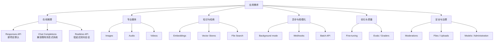
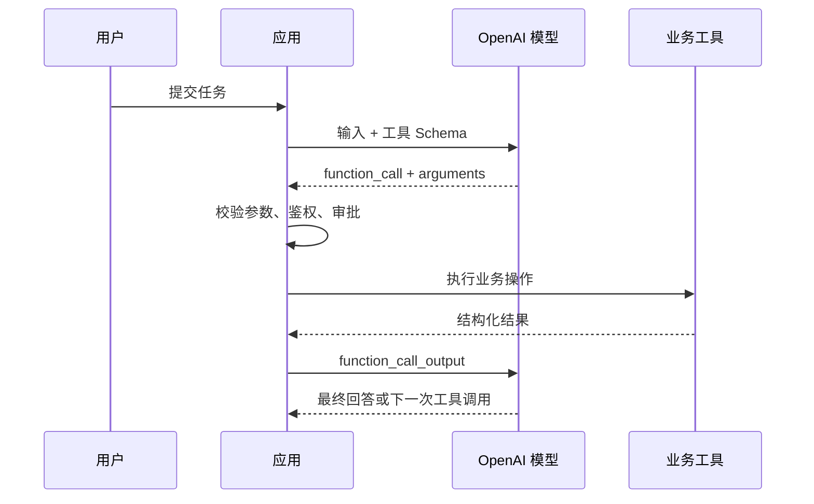

# 一张图读懂 OpenAI 大模型接口：分类、选型与组合方式

> 从 Responses、Chat Completions 和 Realtime 三类核心推理接口出发，理解图像、音频、视频、Embedding、检索、批处理、微调、评测与治理接口之间的边界。
>
> 发布日期：2026-08-02 · 资料基线：OpenAI 官方 API 文档 · 预计阅读时间：18 分钟

## 摘要

“OpenAI 大模型接口”并不是一个单独的聊天接口，而是一组用途不同、可以组合的 API：

- **在线通用推理**：Responses API、Chat Completions API；
- **低延迟实时交互**：Realtime API；
- **专业媒体生成与理解**：Images、Audio、Videos；
- **语义表示与知识检索**：Embeddings、Vector Stores、File Search；
- **异步与规模化处理**：Background mode、Webhooks、Batch API；
- **模型优化与质量验证**：Fine-tuning、Evals、Graders；
- **安全与平台治理**：Moderations、Models、Files、Administration。

对新项目最重要的结论是：

1. 普通文本、代码、视觉理解、结构化输出和 Agent 工具调用，默认从 **Responses API** 开始。
2. 已经围绕 `messages` / `choices` 建成的系统可以继续使用 **Chat Completions API**，但不宜把它作为新 Agent 项目的首选。
3. 浏览器、移动端、电话或服务器媒体管线中的低延迟语音交互使用 **Realtime API**。
4. 单次图像、语音、转录或视频任务，优先使用对应的专业接口；需要把它们放进多轮推理流程时，再与 Responses API 组合。

OpenAI 官方将 Responses 定位为新的核心 API 原语，并明确说明 Chat Completions 仍受支持、但新项目推荐使用 Responses：[Migrate to the Responses API](https://developers.openai.com/api/docs/guides/migrate-to-responses)。

---

## 0. 先分清三个概念：模型、接口与能力

很多选型争论来自把以下三个维度混在了一起。

| 维度 | 回答的问题 | 示例 |
| --- | --- | --- |
| 模型（Model） | 由哪个模型完成推理或生成？ | 通用推理模型、Realtime 模型、Embedding 模型、图像模型、转录模型 |
| 接口（API surface） | 应用通过什么资源和协议调用？ | `/v1/responses`、`/v1/realtime`、`/v1/images/generations` |
| 能力（Capability） | 一次请求可以要求模型做什么？ | 视觉输入、结构化输出、函数调用、Web Search、File Search |

它们不是一一对应关系：

- 同一个模型可能支持多个接口；
- 同一个接口可以接入多个模型；
- 同一个能力可能通过不同接口实现；
- 每个模型只支持接口参数和工具集合的一个子集。

例如，“视觉理解”通常不是单独的 Vision Endpoint，而是把图片作为多模态输入交给 Responses API；“结构化输出”也不是独立接口，而是 Responses 或 Chat Completions 上的输出约束能力。模型与端点支持关系必须以具体模型页面为准，不能根据模型名称推测：[Model catalog](https://developers.openai.com/api/docs/models)。

> 工程规则：先按交互形态选择接口，再按质量、延迟、成本和能力选择模型，最后核对该模型是否支持所需输入、输出、工具和参数。

---

## 1. OpenAI API 的分类地图



可以进一步把这些接口分为三层：

| 层级 | 主要接口 | 作用 |
| --- | --- | --- |
| 推理入口 | Responses、Chat Completions、Realtime、Images、Audio、Videos、Embeddings | 真正执行模型推理或内容生成 |
| 工作流资源 | Conversations、Vector Stores、Files、Uploads、Batches、Fine-tuning Jobs、Evals | 管理状态、数据和异步任务 |
| 平台控制 | Models、Moderations、Administration、Usage、Audit Logs | 管理可用模型、安全、组织和成本 |

“核心推理接口”和“配套资源接口”需要组合使用。例如，知识库问答并不是只调用 Vector Store：通常先用 Files 上传资料、用 Vector Stores 建索引，再通过 Responses 的 `file_search` 工具完成回答。

---

## 2. 在线通用推理接口

### 2.1 Responses API：新项目的默认入口

**核心端点：** `POST /v1/responses`

Responses API 是统一的模型调用入口，适合：

- 文本与代码生成；
- 图片、文件等多模态输入；
- 推理模型；
- JSON Schema 约束的结构化输出；
- 自定义函数调用；
- Web Search、File Search、Code Interpreter、Image Generation、Computer Use、远程 MCP 等托管工具；
- 多轮对话、长任务和 Agent 工作流；
- 流式输出、后台执行和 Webhook 通知。

Responses 的输入和输出基本单元是 **Item**，而不是只有聊天消息。`message`、`function_call`、`function_call_output`、工具结果等都可以成为独立 Item，因此它更适合表达多步骤模型行为。

最小请求：

```bash
curl https://api.openai.com/v1/responses \
  -H "Authorization: Bearer $OPENAI_API_KEY" \
  -H "Content-Type: application/json" \
  -d '{
    "model": "gpt-5.6",
    "input": "用三句话解释什么是向量检索。"
  }'
```

这里的 `gpt-5.6` 只是撰写本文时的官方示例模型，不应被硬编码成永久的“最新模型”。生产项目应从[模型目录](https://developers.openai.com/api/docs/models)选择并通过评测确定模型或固定快照。

#### Responses 如何维护多轮状态

常见方式有三种：

| 方式 | 特点 | 适用场景 |
| --- | --- | --- |
| 应用重放历史 Item | 应用完全控制上下文 | 无状态服务、合规或自定义裁剪 |
| `previous_response_id` | 把本轮链接到上一轮响应 | 简单连续会话 |
| Conversations API | 使用持久 Conversation 与 Item 资源 | 跨会话、跨设备或长期线程 |

Conversations 是 Responses 的状态资源，不是另一个模型。应用仍通过 Responses 触发推理。状态策略详见：[Conversation state](https://developers.openai.com/api/docs/guides/conversation-state)。

#### Responses 为什么适合 Agent

Responses 可以在一次逻辑响应中表达：

```text
用户输入
  → 模型判断需要工具
  → 托管工具执行，或应用执行自定义函数
  → 工具结果进入上下文
  → 模型继续推理
  → 返回最终消息或结构化结果
```

托管工具可以由 OpenAI 平台在响应过程中执行；自定义函数则由你的应用负责鉴权、执行、重试和把结果交还模型。两者都不意味着模型自动获得业务系统权限。

### 2.2 Chat Completions API：继续支持的消息式接口

**核心端点：** `POST /v1/chat/completions`

Chat Completions 使用熟悉的 `messages → choices` 结构。它适合：

- 已有大量生产代码围绕 `messages`、`choices` 和 `tool_calls` 构建；
- 只需要较传统的聊天补全流程；
- 所选模型、能力和 SDK 对该接口有明确支持；
- 暂时不需要迁移到 Responses 的 Item、托管工具或状态机制。

它不是“已经不可用的旧接口”。OpenAI 仍支持 Chat Completions，但新项目推荐 Responses。迁移不只是改 URL，还需要处理：

- `messages` / `choices` 与 `input` / `output Items` 的差异；
- 函数调用 Schema 的差异；
- Structured Outputs 从 `response_format` 到 `text.format` 的变化；
- 会话历史由手工管理改为 `previous_response_id` 或 Conversations；
- 存储、流事件和输出读取方式的差异。

官方迁移指南明确建议将迁移视为三件事：切换到 `/v1/responses`、读取类型化 `output`、决定如何传递多轮状态：[Migrate to Responses](https://developers.openai.com/api/docs/guides/migrate-to-responses)。

### 2.3 Realtime API：低延迟、双向、多模态会话

Realtime API 面向持续连接和低延迟交互，典型场景包括：

- 浏览器或移动端语音助手；
- 呼叫中心和电话 Agent；
- 服务器端实时音频管线；
- 实时转录；
- 实时翻译；
- 需要打断、语音活动检测和工具调用的自然对话。

它支持三类连接方式：

| 连接方式 | 推荐场景 | 关键考虑 |
| --- | --- | --- |
| WebRTC | 浏览器、移动端直接采集和播放媒体 | 网络抖动处理、媒体轨道、客户端临时凭证 |
| WebSocket | 服务器、媒体管线、后端 Worker | 服务端保管长期凭证并处理音频帧 |
| SIP | 电话语音 Agent | 来电、接听、挂断、转接与电话基础设施 |

浏览器或移动端不应持有普通 API Key。服务端应通过 `POST /v1/realtime/client_secrets` 生成短期客户端凭证；GA WebRTC 流程使用 `/v1/realtime/calls` 建立会话。连接方式和事件协议见：[Realtime and audio](https://developers.openai.com/api/docs/guides/realtime)。

### 2.4 Responses 流式输出不等于 Realtime

两者都能“边生成边返回”，但架构目标不同：

| 对比项 | Responses Streaming | Realtime API |
| --- | --- | --- |
| 连接生命周期 | 通常一请求一响应 | 长连接会话 |
| 常见传输 | HTTP + SSE，或 Responses WebSocket 模式 | WebRTC、WebSocket、SIP |
| 主要输出 | 文本、Item 和工具事件 | 双向音频、文本和会话事件 |
| 打断与 VAD | 不是核心抽象 | 核心能力 |
| 典型场景 | 聊天逐字输出、Agent 进度 | 自然语音对话、电话、直播音频 |

不要因为界面需要“打字机效果”就选择 Realtime；普通文本流式输出使用 Responses Streaming 即可。

### 2.5 三类在线接口对比

| 接口 | 新项目定位 | 状态模型 | 工具能力 | 最典型场景 |
| --- | --- | --- | --- | --- |
| Responses | **默认推荐** | `previous_response_id`、Conversations 或手工上下文 | 托管工具 + 自定义函数 | 通用 AI、Agent、多模态、推理 |
| Chat Completions | 兼容与渐进迁移 | 主要由应用维护消息历史 | 自定义函数等，取决于模型 | 既有聊天系统 |
| Realtime | 实时媒体专用 | 长连接 Session 与事件 | 实时会话中的工具调用 | 语音助手、电话、实时翻译 |

---

## 3. 图像、音频和视频接口

### 3.1 Images：单次生成/编辑与对话式生成

**主要端点：**

- `POST /v1/images/generations`：从文本生成图片；
- `POST /v1/images/edits`：基于输入图片和 Prompt 编辑；
- Images API 中的 variations 属于模型相关能力，不应假设所有图像模型都支持。

OpenAI 提供两种图像工作流：

| 工作流 | 选择 | 原因 |
| --- | --- | --- |
| 一条 Prompt 生成或编辑一次 | Images API | 请求直接、资源和成本边界清楚 |
| 多轮对话中连续改图 | Responses + `image_generation` 工具 | 能保留对话、图片输入和编辑上下文 |
| Agent 调研后自动制作配图 | Responses + 搜索/文件工具 + 图像工具 | 推理、取材和生成处于同一工作流 |

两条路径并不等价：通过 Responses 使用图像工具时，还会产生主模型的 Token 使用；直接 Images API 则主要围绕图像任务本身。选择方法见：[Image generation](https://developers.openai.com/api/docs/guides/image-generation)。

“看懂图片”通常不走 Images API。图片理解属于通用多模态模型的输入能力，通常通过 Responses 传入图片 URL、文件或 Base64 内容。

### 3.2 Audio：语音合成、文件转录与翻译

**主要端点：**

- `POST /v1/audio/speech`：文本转语音；
- `POST /v1/audio/transcriptions`：音频转写；
- `POST /v1/audio/translations`：音频翻译，具体语言和模型支持以参考文档为准。

它们适合相对独立的媒体任务：生成旁白、转写会议录音、生成字幕、离线处理播客等。文件转录还可以使用流事件渐进返回已录制音频的转写结果：[File transcription](https://developers.openai.com/api/docs/guides/speech-to-text)。语音生成的音色、格式和流式播放方式见：[Text to speech](https://developers.openai.com/api/docs/guides/text-to-speech)。

选择原则：

- 已经有完整录音文件，使用 Audio Transcriptions；
- 文本生成一段语音，使用 Audio Speech；
- 持续采集、边说边转写，使用 Realtime Transcription；
- 需要用户与模型双向自然对话，使用完整 Realtime 会话。

### 3.3 Videos：异步视频生成任务

**主要端点：**

- `POST /v1/videos`：创建视频生成任务；
- `GET /v1/videos/{video_id}`：查询任务状态；
- 视频内容下载、删除、编辑、延长或 Remix 等能力取决于当前 API 和模型支持。

视频生成不是普通的同步请求。创建任务后，应用会获得包含 `id` 和 `status` 的 Job，随后应：

1. 使用 Webhook 等待完成事件，或按退避策略轮询；
2. 成功后下载并持久化需要保留的产物；
3. 对失败、超时、取消和重复通知设计幂等处理。

官方流程见：[Video generation with Sora](https://developers.openai.com/api/docs/guides/video-generation)。

---

## 4. Embeddings、Vector Stores 与 File Search

这三者都与“知识库”有关，但抽象层次不同。

### 4.1 Embeddings API：只生成向量表示

**核心端点：** `POST /v1/embeddings`

Embedding 把文本转换为浮点数向量。向量距离可以衡量语义相关性，常用于：

- 语义搜索；
- 聚类和分类特征；
- 相似内容推荐；
- 去重与异常检测；
- 自建 RAG 的召回阶段。

Embeddings API 不负责：

- 保存向量；
- 切分文档；
- 建立数据库索引；
- 根据检索结果生成答案；
- 为答案提供业务权限控制。

这些需要你的向量数据库、检索服务和生成模型共同完成。基础概念见：[Vector embeddings](https://developers.openai.com/api/docs/guides/embeddings)。

### 4.2 Vector Stores：托管的文档索引资源

**主要资源：** `/v1/vector_stores`

Vector Store 用于上传、处理、切分和索引文档，并提供搜索能力。它减少了自建切分、Embedding、索引和检索基础设施的工作量，适合：

- 产品文档问答；
- 内部知识库；
- 合同、报告和研究资料检索；
- 与 Responses File Search 组合的托管 RAG。

Vector Store 是持久资源。生产系统需要明确：

- 每个租户或权限域如何隔离；
- 文件变更后何时重新索引；
- 过期策略与删除流程；
- 元数据过滤如何映射业务权限；
- 召回数量、分块策略和质量如何评测。

### 4.3 File Search：Responses 中的托管检索工具

File Search 是 Responses 可调用的托管工具。模型可以针对指定 Vector Store 检索，并把结果用于生成回答。它和直接搜索 Vector Store 的区别是：

| 方式 | 谁决定检索时机 | 谁组织最终回答 | 适用场景 |
| --- | --- | --- | --- |
| Responses + File Search | 模型/工作流 | Responses 中的模型 | 快速构建文档问答和 Agent |
| Vector Store Search API | 应用代码 | 应用或后续模型调用 | 需要控制召回、排序、权限和展示 |
| Embeddings + 自建向量库 | 应用代码 | 完全自定义 | 高度定制、跨数据源或自有基础设施 |

托管 File Search 的配置与结果结构见：[File search](https://developers.openai.com/api/docs/guides/tools-file-search)；直接检索与属性过滤见：[Retrieval](https://developers.openai.com/api/docs/guides/retrieval)。

### 4.4 Files 与 Uploads：数据入口，不是模型

**主要资源：**

- `/v1/files`：上传和管理常规文件；
- `/v1/uploads`：通过多个 Part 完成较大的分片上传。

文件可以服务于不同目的，例如 Responses 输入、Vector Store、Batch、Fine-tuning 或 Evals。上传时必须设置正确的 `purpose`，并为文件生命周期、敏感数据和删除策略负责。

> 常见误区：拿到 `file_id` 并不代表模型已经“学会”文件内容。文件必须被请求引用、加入 Vector Store，或进入明确的数据处理工作流才会发挥作用。

---

## 5. 工具调用与结构化输出：能力，不是新的模型接口

### 5.1 自定义函数调用

函数调用的基本闭环是：



模型只是提出调用意图和参数；应用仍然必须负责：

- JSON Schema 校验；
- 用户和租户鉴权；
- 高风险操作确认；
- 超时、重试、幂等和补偿；
- 限制可调用工具与参数范围；
- 过滤工具结果中的不可信指令。

详细调用结构见：[Function calling](https://developers.openai.com/api/docs/guides/function-calling)。

### 5.2 托管工具

Responses 可以根据模型支持情况使用平台托管工具，例如：

- Web Search；
- File Search；
- Code Interpreter；
- Image Generation；
- Computer Use；
- 远程 MCP；
- 其他随平台演进提供的工具。

这些工具通过 Responses 请求中的 `tools` 配置，不是每个工具都对应一个独立的“模型接口”。工具可用性、费用、地域、数据处理和模型支持需要逐项核对。

### 5.3 Structured Outputs

Structured Outputs 让模型输出满足指定 JSON Schema，适合：

- API 数据提取；
- 表单解析；
- 工作流路由；
- 前端组件或数据库记录生成；
- 多 Agent 间的确定性数据契约。

它约束输出结构，不保证字段内容在业务上真实、完整或安全。应用仍需执行语义校验、权限校验和领域规则检查。

Responses 与 Chat Completions 的配置差异见：[Structured model outputs](https://developers.openai.com/api/docs/guides/structured-outputs)。

### 5.4 Reasoning、Vision、Deep Research 也不是端点

- **Reasoning**：模型与请求参数层面的推理能力；
- **Vision**：模型处理图片输入的多模态能力；
- **Deep Research**：模型结合搜索、文件或 MCP 等工具执行长流程研究的工作方式；
- **Prompt caching**：降低重复前缀成本与延迟的缓存能力；
- **Streaming**：输出交付方式。

当需求中出现这些词时，仍要回到“使用什么推理入口、什么模型、什么工具和什么状态策略”来设计请求。

---

## 6. 异步、长任务和高吞吐接口

### 6.1 Responses Background mode：单个长任务

Background mode 让一次 Responses 请求在后台运行。它适合：

- 深度研究；
- 长时间工具链；
- 较复杂的推理；
- HTTP 请求无法一直保持连接的任务。

应用提交任务后保存 Response ID，再查询状态、取消任务，或结合 Webhook 等待完成通知。它仍然是一个 Responses 任务，不等于 Batch。

启用方式、轮询与数据保留限制见：[Background mode](https://developers.openai.com/api/docs/guides/background)。

### 6.2 Webhooks：接收异步事件

Webhook 是 OpenAI 主动向你的服务发送事件，不是模型推理接口。它适合接收：

- 后台 Response 完成或失败；
- Batch 完成；
- Fine-tuning Job 状态变化；
- 视频生成完成等异步事件。

Webhook 处理器必须：

- 验证签名；
- 使用原始请求体完成验证；
- 快速返回成功状态，把耗时工作放入队列；
- 按事件 ID 或资源 ID 去重；
- 容忍重复、乱序和延迟；
- 需要最新状态时重新查询资源。

事件配置、签名验证与 SDK 示例见：[Webhooks](https://developers.openai.com/api/docs/guides/webhooks)。

### 6.3 Batch API：大量离线请求

**核心资源：** `/v1/batches`

Batch API 把一批预先准备的 API 请求作为异步作业处理，适合：

- 离线分类和标注；
- 大规模内容摘要；
- 批量生成 Embedding；
- 回填历史数据；
- 不需要即时响应的评测或数据处理。

典型流程：

```text
生成 JSONL 请求文件
  → 上传为 Batch 输入文件
  → 创建 Batch
  → 查询状态或等待 Webhook
  → 下载输出文件与错误文件
  → 按 custom_id 对账
```

Batch 与后台 Responses 的区别：

| 对比项 | Background mode | Batch API |
| --- | --- | --- |
| 工作单位 | 一个可能很长的响应任务 | 大量相互独立的请求 |
| 目标 | 避免单请求超时 | 提高离线吞吐并使用批处理计费 |
| 输入 | 普通 Responses 请求 | JSONL 批量文件 |
| 返回顺序 | 单资源状态 | 输出顺序不保证与输入一致，应靠 ID 对账 |

支持的端点、时间窗口和限制可能变化，应在实现前核对：[Batch API](https://developers.openai.com/api/docs/guides/batch)。

---

## 7. Fine-tuning、Evals 与 Graders

### 7.1 Fine-tuning：优化模型行为

**核心资源：** `/v1/fine_tuning/jobs`

微调适合解决可被高质量样本稳定表达的问题，例如：

- 固定格式和风格；
- 领域分类或抽取；
- 反复出现、Prompt 很难稳定覆盖的行为模式；
- 用较小模型学习特定任务，优化规模化成本和延迟。

它通常不适合：

- 注入频繁变化的事实知识——更适合检索；
- 修复上游脏数据；
- 替代权限与安全控制；
- 在没有基线评测时盲目追求“更聪明”。

官方推荐把模型优化看成循环：建立评测 → Prompt 工程 → 必要时微调 → 再评测，而不是直接上传数据训练：[Model optimization](https://developers.openai.com/api/docs/guides/model-optimization)。

具体可用方法可能包括监督微调、视觉微调、直接偏好优化和强化微调；并非所有模型都支持所有方法。

### 7.2 Evals API：把质量标准变成可重复实验

**核心资源：** `/v1/evals`

Evals 用于定义测试数据、运行实验并记录结果。它应覆盖：

- 任务成功率；
- 格式和 Schema 合规；
- 检索命中与引用质量；
- 工具选择、参数和停止条件；
- 安全拒绝与越权行为；
- 延迟、Token 和成本；
- 模型或 Prompt 升级回归。

### 7.3 Graders：如何判定“做对了”

Grader 可以是字符串检查、结构化规则、评分模型或自定义逻辑。可靠评测通常混合：

- 可确定计算的规则；
- 与参考答案的比较；
- 模型评分；
- 人工抽检和争议复核。

不要只以“输出看起来不错”决定模型升级或微调上线。评测数据集与运行方式见：[Getting started with evals](https://developers.openai.com/api/docs/guides/evaluation-getting-started)。

---

## 8. 安全、发现与平台治理接口

### 8.1 Moderations API

**核心端点：** `POST /v1/moderations`

Moderations 用于识别可能有害的文本或图片内容。常见接入点包括：

- 用户输入进入生成模型之前；
- 模型输出展示或执行之前；
- 图片、社区内容和批量数据审核；
- 高风险工具调用的附加信号。

Moderation 结果是安全决策的一个信号，不应直接替代业务策略、年龄分层、人工审核、申诉和审计。类别与分数的含义见：[Moderation](https://developers.openai.com/api/docs/guides/moderation)。

### 8.2 Models API

**主要资源：** `/v1/models`

Models API 可以列出当前凭证可访问的模型，或获取特定模型的基本信息。它适合：

- 启动检查和管理后台；
- 验证模型 ID 是否对当前项目可见；
- 构建受控模型选择器。

它不能替代模型目录、定价页和应用自己的能力注册表。仅仅能列出一个模型，不代表该模型支持应用所需接口、工具和参数。

### 8.3 Administration API

Administration 资源面向组织治理，例如：

- 组织、项目、用户、群组和角色；
- Service Accounts 与 API Keys；
- 项目模型、工具和速率限制；
- 使用量、成本和 Spend Limits；
- Audit Logs、证书和数据保留策略。

管理接口通常需要 **Admin API Key**，不能用普通项目 Key 代替，也不应把 Admin Key 放进业务推理服务。官方概览见：[Admin APIs](https://developers.openai.com/api/docs/guides/admin-apis)。

---

## 9. Legacy 接口与迁移边界

### 9.1 Assistants API

Assistants API 使用 Assistants、Threads、Messages、Runs 和 Run Steps 等资源构建 Agent。其关键设计已经被吸收到 Responses 与 Conversations 中。

截至本文资料基线：

- Assistants API 已于 2025-08-26 进入弃用；
- 官方公布的停止日期是 **2026-08-26**；
- 新项目不应继续基于 Assistants API 建设；
- 既有系统应迁移到 Responses、Conversations 和对应工具。

日期与迁移方向见：[Migrate to the Responses API](https://developers.openai.com/api/docs/guides/migrate-to-responses#assistants-api)。

### 9.2 Completions API

`/v1/completions` 是早期的文本补全接口，使用单段 Prompt 续写文本。除非维护明确依赖它的历史系统，否则应选择 Responses；不要把 Completions 与 Chat Completions 混为一谈。

### 9.3 Realtime Beta

旧版 Realtime Beta 的 Sessions、事件或请求头与 GA 接口存在差异。维护旧实现时应对照 GA 迁移说明，而不是继续复制带 `OpenAI-Beta: realtime=v1` 的历史示例。

### 9.4 Legacy 不等于立即失效

成熟系统的迁移应以风险为中心：

1. 先建立现有行为与成本基线；
2. 对照新旧请求和响应 Schema；
3. 用相同评测集验证模型、Prompt、工具和状态；
4. 双写或小流量灰度；
5. 观察错误率、延迟、工具成功率和答案质量；
6. 再移除旧路径。

但如果官方已经公布停止日期，评估不能无限期替代迁移。

---

## 10. 如何选接口：一张决策表

| 需求 | 首选接口或组合 | 不要误选 |
| --- | --- | --- |
| 新建文本/代码应用 | Responses | 不必为了 `messages` 习惯新建 Chat Completions 项目 |
| 新建 Agent、工具调用、多步任务 | Responses + Tools | Assistants API |
| 现有稳定聊天系统小改 | 继续 Chat Completions，规划评测后迁移 | 没有收益验证就一次性重写 |
| 图片理解 | Responses + 图片输入 | Images API |
| 单次图片生成或编辑 | Images API | 为单次任务搭建完整 Agent |
| 多轮对话式改图 | Responses + Image Generation | 手工串联大量无状态图片请求 |
| 文件录音转文字 | Audio Transcriptions | 完整 Realtime 会话 |
| 浏览器实时语音助手 | Realtime + WebRTC | 在客户端暴露普通 API Key |
| 服务端音频流 | Realtime + WebSocket | 把音频帧伪装成普通文本 Streaming |
| 电话 Agent | Realtime + SIP | 自己用普通 HTTP 模拟电话信令 |
| 视频生成 | Videos + Webhook | 长时间阻塞 HTTP 请求 |
| 自建语义检索 | Embeddings + 自有向量库 | 以为 Embeddings 会保存和搜索数据 |
| 托管知识库问答 | Files + Vector Stores + Responses File Search | 把全部文档直接塞进 Prompt |
| 单个长推理任务 | Responses Background + Webhook | Batch |
| 大量离线独立请求 | Batch API | 循环发同步请求 |
| 稳定改变任务行为 | Evals → Prompt → Fine-tuning → Evals | 直接用微调注入动态知识 |
| 输入/输出内容安全 | Moderations + 业务策略 | 只看单个分数自动封禁 |
| 组织与成本治理 | Administration / Usage | 用业务项目 Key 承担管理员职责 |

也可以用下面的简化决策树：

```text
需要持续、低延迟的双向音频吗？
  是 → Realtime
  否 → 是单次专业媒体任务吗？
         图像 → Images
         音频 → Audio
         视频 → Videos
         否 → 是离线大批量任务吗？
                是 → Batch
                否 → Responses

在 Responses 之上再决定：
  需要长期会话？→ Conversations
  需要知识库？→ Files + Vector Stores + File Search
  需要外部系统？→ 自定义函数或 MCP
  需要长时间执行？→ Background + Webhook
```

---

## 11. 四种典型组合架构

### 11.1 企业知识助手

```text
Files → Vector Stores → Responses + File Search
                         ├─ Structured Outputs
                         ├─ 自定义权限工具
                         └─ Evals
```

重点不是“接上知识库”就结束，而是把租户隔离、引用、权限过滤、更新时效和检索评测一起设计。

### 11.2 客服语音 Agent

```text
浏览器 / 电话
  → Realtime（WebRTC / SIP）
  → 自定义函数（订单、工单、退款）
  → 用户确认与业务鉴权
  → Webhook / 日志 / Evals
```

语音模型不应直接拥有退款权限。模型生成调用意图，业务服务执行授权和风险控制。

### 11.3 内容生产流水线

```text
Responses 生成结构化脚本
  → Images 生成素材
  → Audio Speech 生成旁白
  → Videos 创建异步视频任务
  → Webhook 驱动后处理与发布审核
```

每个阶段都应保存输入、模型版本、资源 ID 和审核状态，以支持追踪、重试和回滚。

### 11.4 大规模离线分类

```text
历史数据 → 生成 JSONL → Batch
                       → 输出/错误文件
                       → Evals 抽样验证
                       → 回填业务数据库
```

以稳定 `custom_id` 关联源数据，不要依赖输出文件的行顺序。

---

## 12. 所有接口共有的生产工程要求

### 12.1 凭证必须留在可信服务端

普通 API Key 和 Admin API Key 都是秘密：

- 不提交到 Git；
- 不写入前端 JavaScript、移动端包或日志；
- 通过服务端环境变量或密钥管理系统加载；
- 按项目、环境和服务拆分；
- 浏览器 Realtime 使用服务端签发的短期凭证；
- 管理接口与业务推理使用不同权限和密钥。

### 12.2 记录请求 ID 与业务 Trace

生产服务至少记录：

- OpenAI 返回的 `x-request-id`；
- 应用自定义的 `X-Client-Request-Id`；
- 模型或快照；
- 接口、状态码、延迟和重试次数；
- 输入/输出 Token 或媒体计量；
- 工具名、调用状态和资源 ID；
- 在不泄露敏感内容前提下的业务 Trace ID。

请求头与调试建议见：[API Overview](https://developers.openai.com/api/reference/overview#debugging-requests)。

### 12.3 重试必须区分错误类型

- `429`、部分 `5xx` 和网络失败：使用带抖动的指数退避；
- `400`：通常是参数或 Schema 错误，原样重试无效；
- `401` / `403`：检查凭证、项目、组织和权限；
- 超时后：先利用请求 ID、幂等键或资源查询确认服务端是否已接收；
- 创建外部副作用前：由业务工具层提供幂等与去重。

### 12.4 不要假设响应 Schema 永远只含当前字段

OpenAI 的 `v1` API 可能增加可选参数、响应字段或流事件类型。解析器应：

- 忽略不认识的附加字段；
- 按 `type` 分派 Item 和事件；
- 为未知事件保留日志与兼容分支；
- 不依赖 JSON 字段顺序或不透明 ID 的格式；
- 对真正需要稳定行为的模型使用固定快照并持续运行 Evals。

兼容性范围见：[API Overview](https://developers.openai.com/api/reference/overview#backwards-compatibility)。

### 12.5 成本与延迟要分层测量

一次 Agent 请求可能同时产生：

- 主模型输入、缓存输入和输出 Token；
- 推理 Token；
- 搜索、文件检索或 Code Interpreter 费用；
- 图像、音频或视频计量；
- 多次工具往返和重试；
- Vector Store 等持久资源费用。

只看“单次模型价格”无法代表完整工作流成本。应按任务成功率、端到端延迟和每个成功任务的总成本做比较。

### 12.6 数据与安全边界必须显式设计

- 把用户输入、网页、文件、MCP Server 描述和工具输出视为不可信内容；
- 不让 Prompt Injection 自动扩大工具权限；
- 为终端用户发送稳定、保护隐私的 Safety Identifier（在模型和接口支持时）；
- 对高风险操作增加人工确认或策略审批；
- 明确存储设置、保留时间、删除和 Zero Data Retention 要求；
- 在上线前核对当前数据控制文档和组织政策。

---

## 13. 端点速查表

下表只列常用入口，不替代完整 API Reference；具体模型、参数和资源方法会持续演进。

| 分类 | 常用入口 | 作用 |
| --- | --- | --- |
| 通用推理 | `POST /v1/responses` | 文本、多模态、推理、工具和 Agent |
| 持久对话 | `/v1/conversations` | 管理 Conversation 与 Item |
| 消息式补全 | `POST /v1/chat/completions` | 兼容既有 Chat Completions 系统 |
| 实时交互 | `/v1/realtime/*` | WebRTC、WebSocket、SIP、转录和翻译会话 |
| 图像生成 | `POST /v1/images/generations` | 文本生成图片 |
| 图像编辑 | `POST /v1/images/edits` | 编辑输入图片 |
| 语音生成 | `POST /v1/audio/speech` | 文本转语音 |
| 音频转录 | `POST /v1/audio/transcriptions` | 语音转文字 |
| 音频翻译 | `POST /v1/audio/translations` | 音频翻译 |
| 视频 | `/v1/videos` | 创建、查询和管理异步视频任务 |
| 向量 | `POST /v1/embeddings` | 生成文本向量 |
| 托管索引 | `/v1/vector_stores` | 文档索引、文件与搜索 |
| 文件 | `/v1/files`、`/v1/uploads` | 上传和管理各工作流数据 |
| 批处理 | `/v1/batches` | 大量离线异步请求 |
| 微调 | `/v1/fine_tuning/jobs` | 创建和管理微调任务 |
| 评测 | `/v1/evals` | 定义和运行质量评测 |
| 安全分类 | `POST /v1/moderations` | 文本和图片内容安全信号 |
| 模型发现 | `/v1/models` | 列出或查询当前可访问模型 |
| 组织管理 | `/v1/organization/*` | 项目、用户、Key、Usage 和审计等 |

完整、实时的端点目录以官方 [API Reference](https://developers.openai.com/api/reference/overview) 为准。

---

## 14. 最后的选型原则

用一句话概括各类接口：

- **Responses**：大多数新 AI 应用的主入口；
- **Chat Completions**：既有消息式集成的兼容接口；
- **Realtime**：持续、双向、低延迟的音频与实时会话；
- **Images / Audio / Videos**：专业媒体任务；
- **Embeddings / Vector Stores / File Search**：从自建到托管的语义检索层；
- **Background / Webhooks / Batch**：从单个长任务到海量离线任务；
- **Fine-tuning / Evals**：模型行为优化与质量证明；
- **Moderations / Models / Administration**：安全、发现和平台治理。

真正可靠的架构不是“选一个最强模型然后到处调用”，而是：

1. 用最合适的接口承载交互形态；
2. 用受控工具连接外部世界；
3. 用状态和检索管理上下文；
4. 用异步资源处理长任务和规模；
5. 用 Evals 证明升级有效；
6. 用权限、Moderation、审计和成本控制守住生产边界。

## 官方资料索引

- [API Overview](https://developers.openai.com/api/reference/overview)
- [Model catalog](https://developers.openai.com/api/docs/models)
- [Migrate to the Responses API](https://developers.openai.com/api/docs/guides/migrate-to-responses)
- [Conversation state](https://developers.openai.com/api/docs/guides/conversation-state)
- [Realtime and audio](https://developers.openai.com/api/docs/guides/realtime)
- [Image generation](https://developers.openai.com/api/docs/guides/image-generation)
- [Video generation](https://developers.openai.com/api/docs/guides/video-generation)
- [File transcription](https://developers.openai.com/api/docs/guides/speech-to-text)
- [Text to speech](https://developers.openai.com/api/docs/guides/text-to-speech)
- [Vector embeddings](https://developers.openai.com/api/docs/guides/embeddings)
- [File search](https://developers.openai.com/api/docs/guides/tools-file-search)
- [Retrieval](https://developers.openai.com/api/docs/guides/retrieval)
- [Function calling](https://developers.openai.com/api/docs/guides/function-calling)
- [Structured model outputs](https://developers.openai.com/api/docs/guides/structured-outputs)
- [Background mode](https://developers.openai.com/api/docs/guides/background)
- [Webhooks](https://developers.openai.com/api/docs/guides/webhooks)
- [Batch API](https://developers.openai.com/api/docs/guides/batch)
- [Model optimization](https://developers.openai.com/api/docs/guides/model-optimization)
- [Evals](https://developers.openai.com/api/docs/guides/evaluation-getting-started)
- [Moderation](https://developers.openai.com/api/docs/guides/moderation)
- [Safety best practices](https://developers.openai.com/api/docs/guides/safety-best-practices)
- [Data controls](https://developers.openai.com/api/docs/guides/your-data)
- [Admin APIs](https://developers.openai.com/api/docs/guides/admin-apis)

> 维护提示：模型名称、模型支持矩阵、价格、限额和 Beta/GA 状态变化较快。本文将它们视为动态配置，不做静态完整清单；每次上线或升级前都应重新核对官方模型页、API Reference、Changelog 和 Deprecations。
