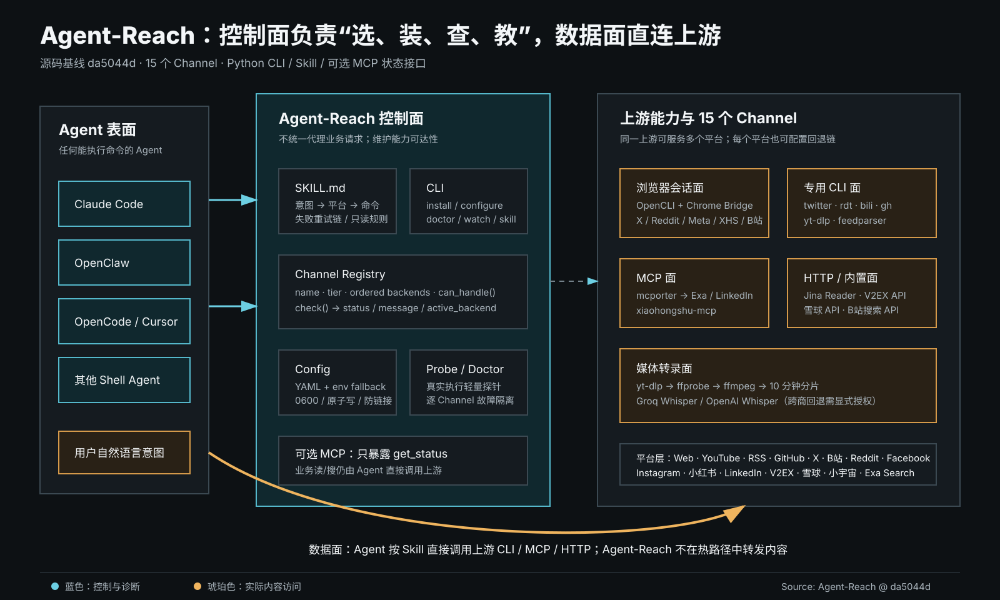
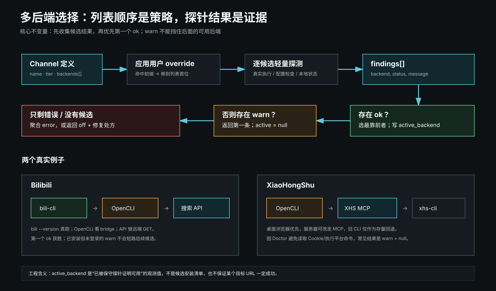
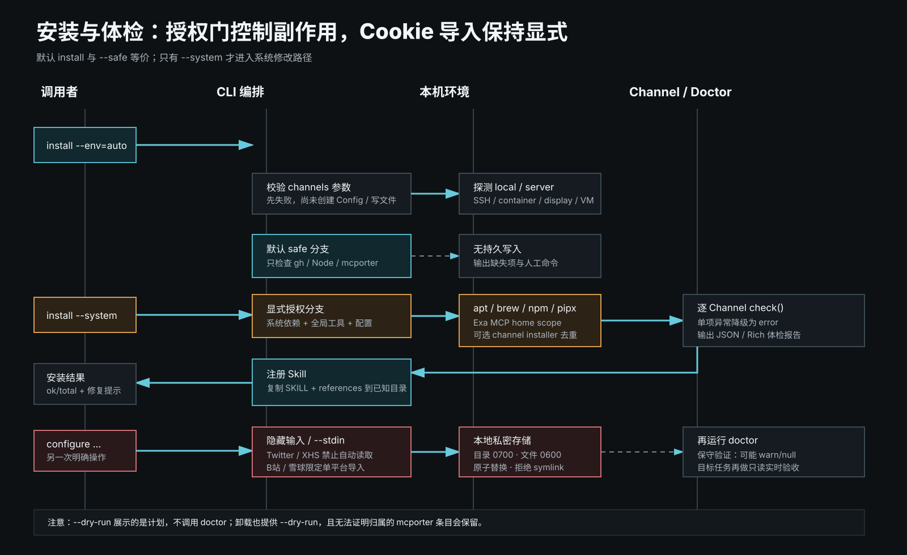
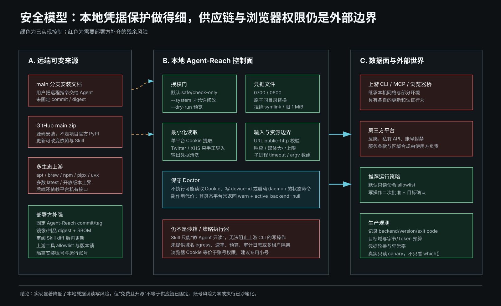
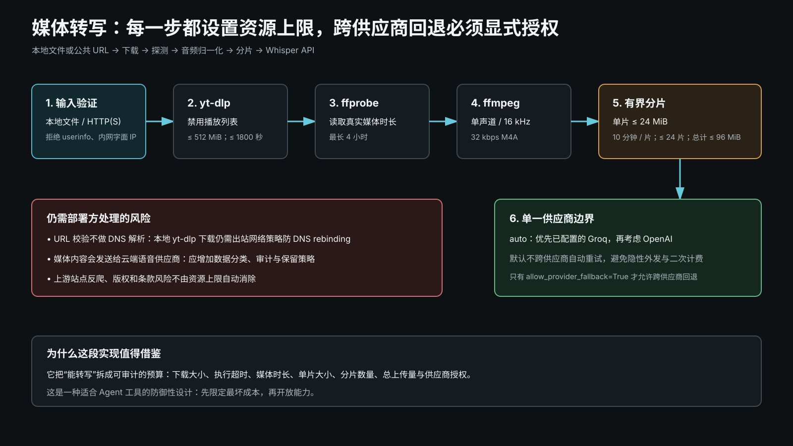

# Agent-Reach 源码解剖：把互联网接入做成 Agent 的能力控制面

> 面向读者：大模型 Agent、工具链与平台工程师
>
> 调研日期：2026-09-12
>
> 源码基线：`da5044d26fc6adddb6554d5679c94ac22e76e428`（`main`，2026-09-01）
>
> 项目版本：`1.5.0`；许可证：MIT


Agent-Reach 最容易被误解成“又一个统一搜索 API”。读完当前源码后，我的结论恰好相反：**它的核心产品不是内容转发，而是 Agent 的互联网能力控制面**——负责发现依赖、安装工具、管理最少量配置、做保守健康检查，并把“什么任务该调用什么工具”写进 Agent Skill；真正读取网页、搜索帖子或抓取字幕时，Agent 直接调用 `gh`、`yt-dlp`、OpenCLI、MCP server、Jina Reader 等上游工具。

这项设计让 Agent-Reach 很轻，也规避了重复封装十五个平台的维护成本。但代价同样清晰：统一的是“能力发现与路由知识”，不是调用协议、输出 schema、权限执行或可观测性。把它用于个人研究非常顺手；要进入企业生产环境，还需要在它外面补供应链锁定、运行时权限、出站网络、凭据隔离、审计与稳定输出契约。

## 结论先行

| 维度 | 源码事实 | 工程判断 |
|---|---|---|
| 定位 | 2026-02-26 的重构删除了统一 `read/search` wrapper；核心类只包装 Doctor | 它是能力控制面，不是内容数据面 |
| 覆盖 | 当前注册 15 个 Channel，按零配置、需免费 key/登录、复杂可选配置分三层 | 平台广度高，但可用性受上游和账号状态影响 |
| 路由 | Channel 保存有序 backend；配置覆盖可提到队首；首个 `ok` 胜出 | 小而有效，适合处理同一平台多种接入方式 |
| 诊断 | Doctor 尽量执行真实轻量探测，但拒绝可能写盘、启动守护进程或访问远端的检查 | `warn`/`active_backend=null` 经常代表“未无副作用验证”，不等于不可用 |
| 安全 | 配置原子写入、`0600`、防 symlink、输入隐藏、URL/输出脱敏、下载预算 | 本地安全细节扎实；供应链和上游工具权限仍需外部治理 |
| Agent 集成 | Skill 给出强触发规则、平台路由、重试链与命令模板 | 本质是 context engineering；提示词约束不是强制安全边界 |
| MCP | 内置 server 只暴露 `get_status` | 在本次最新可解析依赖 `mcp==2.2.0` 下可复现启动失败，CI 未覆盖该 extra |
| 质量 | 120 个跟踪文件；Python 约 16,979 SLOC；本地 `586 passed + 16 subtests`，Ruff 通过 | 测试密度不错，真实平台契约、macOS 与可选 MCP 仍是缺口 |

## 1. 我如何调研：固定快照，而不是阅读会漂移的 `main`

本文结论来自官方仓库的固定提交，而不是只看 README：

- 拉取 [Agent-Reach 官方仓库][repo]，固定到 [`da5044d…` 快照][snapshot]；
- 逐层阅读 `cli.py`、Channel、backend、Doctor、配置、Cookie、转写、Skill、MCP 与测试；
- 检查提交历史，确认项目从 wrapper 转向 installer + doctor + docs 的架构拐点；
- 在隔离虚拟环境执行全量测试、Ruff、mypy，并实际构造 MCP server；
- 与 OpenCLI、Jina Reader、yt-dlp、mcporter 及各平台 CLI 的官方资料交叉验证；
- 对时间敏感结论标注调研日期，不把 Star 数或短期可达性当作架构事实。

复核得到：仓库共 375 个提交、120 个跟踪文件，Python 代码约 16,979 行，其中产品代码约 6,874 行，测试约 10,105 行。`cli.py` 单文件约 2,350 行，是当前最集中的复杂度热点。项目元数据声明 Python ≥ 3.10、Beta 状态、MIT 许可证，并以 lower-bound 形式声明依赖。[^1]

## 2. 最关键的架构认知：控制面与数据面分离



一次典型任务实际经过两条不同链路：

1. **控制链路**：Agent 读取 `SKILL.md` → 调用 `agent-reach doctor` → 得到每个平台的状态与候选 backend → 决定调用路径。
2. **数据链路**：Agent 直接执行上游 CLI/MCP/HTTP 工具 → 内容直接从平台返回给 Agent。

这里没有一个长期驻留的 Agent-Reach 网关替所有请求做转发，也没有统一的 `read(url) -> Document` schema。源码中的 `AgentReach` facade 只有 `doctor()` 与 `report()` 两个方法；内置 MCP 同样只提供 `get_status`。[^2]

这不是实现没做完，而是明确的架构选择。提交历史中 2026-02-26 的重构说明直接写明：保留 installer、doctor 与 docs，移除 read/search wrapper layer。于是项目获得了三个优势：

- **复用上游最佳工具**：GitHub 交给 `gh`，视频交给 `yt-dlp`，动态网站交给真实浏览器桥。
- **故障域变小**：Agent-Reach 不需要吞吐所有正文，也不需要为十五个平台维护统一解析器。
- **模型可见性更高**：Skill 中的命令模板让 Agent 知道实际调用哪个工具，便于交互式排错。

但它也留下四个生产化成本：

- 各 backend 的参数、错误码、输出结构与分页语义泄漏给 Agent；
- 重试、超时、限流、缓存和链路追踪没有统一中间层；
- “只读”主要由 Skill 文本约定，上游 CLI 可能同时具备发帖、点赞或写仓库能力；
- backend 改版会直接改变 Agent 的上下文质量与 token 成本。

所以更准确的类比是：**Agent-Reach 像一个面向 Agent 的包管理器 + 驱动探测器 + 路由手册，而不是互联网 API Gateway。**

## 3. 代码骨架：Channel、Registry、Doctor、Skill

### 3.1 Channel 是最小可扩展单元

`Channel` 抽象基类只有少数关键字段：`name`、`description`、有序 `backends`、`tier` 和运行时 `active_backend`。`tier` 的含义是：

- `0`：设计为零配置；
- `1`：需要免费 key、账号或登录态；
- `2`：需要更复杂的可选配置。

每个 Channel 实现 `can_handle(url)`，并通过 `check(config) -> tuple[status, message]` 汇报状态；Doctor 再补齐 tier、backend 列表和 active backend，组装为结构化字典。安装编排并不是 Channel 接口的一部分，而是集中在 `cli.py` 的 installer 映射中。基类的 `ordered_backends()` 会读取 `<channel>_backend` 配置或同名大写环境变量；若值合法，就把对应 backend 移到队首，未知值则忽略。[^3]

伪代码可压缩为：

```python
class Channel:
    backends: tuple[str, ...]
    active_backend: str | None

    def ordered_backends(self, config):
        override = config.get(f"{self.name}_backend")
        return move_to_front(self.backends, override)

    def check(self, config) -> tuple[str, str]:
        ...  # 返回 status/message，并设置 active_backend
```

Registry 把 15 个 Channel 实例注册到全局 `ALL_CHANNELS`。这对短生命周期 CLI 足够简单；但这些实例带可变的 `active_backend`，若未来扩展为并发、长驻的异步服务，建议改为“每次检查返回不可变结果”，不要让全局单例承载请求态。[^4]

### 3.2 多 backend 不是“找到可执行文件就结束”



Twitter、Reddit、Bilibili、小红书等 Channel 不只支持一种 backend。当前实现的正确之处是：**先收集候选结果，再选择首个真正 `ok` 的 backend；如果都不 `ok`，才返回第一个 `warn`。**

这避免了一个常见路由 bug：排在前面的工具虽然已安装但未登录，不能阻断后面真正可用的工具。只有 `ok` 才写入 `active_backend`；`warn` 不会被错误宣传成“当前已激活”。

状态可理解为：

| 状态 | 语义 | Agent 下一步 |
|---|---|---|
| `ok` | 已通过当前探测，具备该检查所覆盖的能力 | 可按 Skill 模板调用 |
| `warn` | 工具可能存在，但认证/守护进程/远端状态未被无副作用确认 | 执行一次任务级只读验证 |
| `off` | 未安装、未配置或明确不可用 | 安装/配置，或尝试替代 backend |
| `error` | 检查本身异常 | 保留异常摘要并降级，不让全局 Doctor 崩溃 |

### 3.3 Doctor 的“保守”是有意设计

`Doctor.check_all()` 逐个 Channel 调用 `check`，捕获单个平台异常，最后对消息做 URL 凭据脱敏。报告按 tier 分组，并且只有 `ok` 才计入“可用”数量。[^5]

一个非常重要、也最容易造成误判的细节是：Doctor 不会为了好看的绿灯去运行有副作用的状态命令。例如：

- `gh auth status` 在某些版本中会写 device id；
- `opencli doctor` 可能启动 daemon 并修改 `~/.opencli`；
- 某些 CLI 的 status 会自动读取浏览器 Cookie、刷新凭据或访问远端。

因此 GitHub CLI 即使存在配置也可能只报告 `warn`；OpenCLI 安装存在但 loopback daemon/扩展未安全确认时也不会成为 active backend。**`active_backend=null` 不总是“坏了”，可能只是“Doctor 拒绝越权验证”。**

这是一种值得保留的设计取舍。生产系统应在 UI/API 中把 `warn` 拆成结构化 reason code，例如 `installed_unverified`、`auth_unverified`、`daemon_not_ready`，否则模型或人会把“未知”误读成“失败”。

## 4. OpenCLI 为什么是跨平台关键 backend

OpenCLI 通过真实 Chrome 扩展与本地 loopback daemon，把动态网页中的已登录会话暴露给命令行适配器。它承担 Reddit、Facebook、Instagram、小红书、Bilibili 等多个 Channel 的浏览器数据面，是 Agent-Reach 覆盖动态、强登录站点的关键。其官方实现也将 Chrome bridge、daemon 与站点 adapter 作为核心组件。[^6]

Agent-Reach 没有直接运行副作用较大的 `opencli doctor`，而是：

1. 执行 `opencli --version` 判断二进制是否工作；
2. 以 no-proxy 方式访问 `http://127.0.0.1:19825/status`；
3. 将响应上限限定为 64 KiB；
4. 只有安装正常且扩展实际连接时才判定 ready；
5. 仅看到磁盘上的扩展文件不算“已连接”。[^7]

这个实现体现了“健康检查也属于攻击面”的意识：探针要有超时、大小限制、明确地址，还要避免隐式启动服务。

## 5. 安装生命周期：默认安全，系统修改必须显式



CLI 暴露 `setup`、`install`、`configure`、`doctor`、`uninstall`、`skill`、`format xhs`、`transcribe`、`check-update`、`watch`、`version`。其中最关键的一行逻辑是：

```python
safe_mode = args.safe or not args.system
```

也就是说，普通 `agent-reach install` 默认只检查和报告；只有用户明确加 `--system` 才进入 apt/brew/npm/pipx/uvx 等系统安装路径。Channel 名称会先校验，避免未知输入在配置落盘后才失败。环境探测综合 SSH、容器、显示服务、云环境和虚拟化信号；无 GUI 的 server 环境会跳过只适用于浏览器的路径。[^8]

Cookie 导入也不与“大包安装”混在一起，而是单独的显式步骤。当前策略尤其谨慎：

- Twitter 与小红书禁用自动浏览器提取，只接受 Cookie-Editor 手工导出；
- Bilibili、雪球仅对选定平台尝试受限的浏览器导入；
- 提取后再次核对 Cookie 域名；
- secret 可用隐藏输入或 `--stdin` 提供；位置参数会警告；
- 卸载时，对无法证明由本项目创建的 mcporter 配置和遗留凭据采取保守保留。

这比很多“一键配置所有浏览器账号”的 Agent 工具更符合最小权限。不过系统模式仍会安装多个外部项目，部署时不能把“必须显式授权”误当成“供应链已经锁定”。

## 6. Skill 才是真正的 Agent 运行时

Agent-Reach 的 Skill frontmatter 采用很强的触发语义：涉及互联网搜索、读取 URL、视频字幕、社交媒体、GitHub、RSS 等任务时，Agent 应优先使用它。正文再提供平台路由、命令示例、重试链、研究工作流和更新检查。[^9]

从 Agent 工程角度看，这个 Skill 同时承担四种职责：

| 职责 | 例子 | 价值 |
|---|---|---|
| 能力发现 | 先跑 Doctor，查看有哪些 backend | 避免模型凭记忆幻想工具 |
| 路由策略 | GitHub→`gh`，YouTube→`yt-dlp`，网页→Jina | 把工具选择从模型参数移到可更新文本 |
| 操作模板 | 给出搜索、阅读、字幕等命令 | 降低参数错误与探索 token |
| 降级策略 | 首选失败后换 backend 或公共路径 | 提高任务完成率 |

这是一种典型的 **context engineering**：不重写工具，把“何时、为何、怎样调用”做成可版本化知识。

但 Skill 里的“只做读取，不做写操作”属于提示层策略，不是 capability enforcement。`gh`、Twitter/Reddit/Bilibili 等上游工具可能拥有写权限；如果 Agent 进程能调用整个二进制，恶意网页提示或模型误判仍可能触发写动作。生产环境需要在运行时补上：

- 命令 allowlist 和参数 schema；
- 只读 OAuth scope / 专用低权限账号；
- 网络与文件系统 sandbox；
- 高风险动作的独立审批；
- 把网页内容标记为不可信数据，而不是新指令。

## 7. 十五个平台如何接入

下表以当前 Registry 与 Channel 源码为准。Tier 是配置复杂度，不是可用性 SLA；“零配置”也不代表目标站点此刻一定可达。

| Channel | Tier | 当前 backend 顺序/实现 | 认证与工程备注 |
|---|---:|---|---|
| GitHub | 0 | `gh` CLI | Doctor 避免执行可能写 device id 的 auth 检查，常为保守 `warn` |
| Twitter/X | 1 | `twitter-cli → OpenCLI → bird` | 首选 CLI；浏览器 Cookie 自动提取禁用 |
| YouTube | 0 | `yt-dlp` | 搜索、元数据、字幕；YouTube 当前常需外部 JS runtime，yt-dlp 官方推荐 Deno，Node 需显式配置[^10] |
| Reddit | 1 | `OpenCLI → rdt-cli` | 两者均依赖已登录会话/Cookie；rdt-cli 自身也可能具备写动作 |
| Facebook | 1 | OpenCLI | 真实浏览器会话与扩展 |
| Instagram | 1 | OpenCLI | 真实浏览器会话与扩展 |
| Bilibili | 1 | `bili-cli → OpenCLI → search API` | 公共搜索可降级，登录态增强；上游 CLI 能力变化快 |
| 小红书 | 1 | `OpenCLI → xiaohongshu-mcp → xhs-cli` | 手工 Cookie 路径优先考虑账号安全；MCP 通常需本地服务 |
| LinkedIn | 2 | LinkedIn MCP → Jina Reader | MCP 提供更强能力；Jina 是公开页面降级路径 |
| 小宇宙 | 1 | 专用 `transcribe.sh` + Groq Whisper + ffmpeg | 走独立播客脚本；另有通用 `agent-reach transcribe` 管线，音频都会发送到语音供应商 |
| V2EX | 0 | 公共 API | 实时可达性仍受网络、限流影响 |
| 雪球 | 1 | HTTP API + Cookie | 金融内容不应被当作投资建议；Cookie 有账号权限 |
| RSS | 0 | `feedparser` | 最稳定、最可控的数据源之一 |
| Exa | 0 | `mcporter` 调 Exa MCP | Doctor 不主动启动远端/本地服务，因此配置存在也可能 `warn` |
| 通用网页 | 0 | Jina Reader | 本地无依赖，Channel 会报 `ok`；这只代表调用路径存在，不代表任意 URL 可成功读取 |

这里有两个值得警惕的语义差异。

第一，README 所说“六项零配置能力”对应 Tier 0 的分类，但 GitHub 的保守认证检查、Exa 的服务状态和通用网页的远端可达性并不都能在 Doctor 中得到强验证。第二，README 的目录树、CHANGELOG 与当前 Registry 曾出现更新节奏不一致；工程集成应以固定提交下的代码和自动生成能力清单为准，而不是手工列表。

## 8. 配置与凭据：细节比功能数量更值得看



`~/.agent-reach/config.yaml` 是主要配置文件。读取配置不会顺便创建目录或文件；写入流程采用同目录临时文件、`fsync`、`os.replace` 的原子替换，文件权限设为 `0600`、目录 `0700`。路径检查拒绝 symlink 组件，读取只接受普通文件并限制为 1 MiB；YAML 使用 `safe_load` 且必须得到 mapping。配置转字典时，会按 credential 关键词遮蔽 secret。[^11]

配置优先级是“配置文件优先，再看环境变量”，这与不少十二要素应用的 env-over-file 习惯相反。好处是行为可复现；风险是操作者以为临时环境变量已覆盖，实际仍在使用旧凭据。生产封装应把最终来源写进不含 secret 的诊断字段，例如：

```json
{
  "twitter_cookie": {
    "configured": true,
    "source": "config_file",
    "value": "[REDACTED]"
  }
}
```

URL 防护方面，通用网页入口只接受公共 HTTP(S)，拒绝 userinfo、localhost/内部域后缀、非 global 的字面 IP、反斜线与控制字符；Jina 响应限制为 5 MiB，并识别高置信度反爬页面。转写 URL 进一步识别 `127.1`、整数/十六进制等缩写 IPv4 表达。[^12]

仍有一个边界要说清：校验刻意不做 DNS 解析。Jina 路径由外部服务抓取，主要风险在其边界；而 `yt-dlp` 是本机出站下载，若域名解析在校验后变化，仍存在 DNS rebinding 的残余风险。部署方应通过 egress proxy、DNS policy 或网络 namespace 阻断私网目的地址，不能只依赖字符串校验。

输出端也有防泄漏处理：Doctor 在最终返回前清理 URL userinfo 与常见 secret query 参数。这很有价值，因为日志往往比配置文件传播更远。

## 9. 媒体转写：用资源预算约束工具调用



仓库里并存两条路径：小宇宙 Channel 安装的是专用 `transcribe_xiaoyuzhou.sh`（只走 Groq，还可选用 LLM 润色）；`agent-reach transcribe` 与 YouTube Channel 则调用较新的 Python 通用管线。下面分析的是后者，二者不应被误认为同一套限制。

`transcribe.py` 是仓库中安全工程味道最浓的一段实现：

1. 输入可为本地文件或公共 URL；
2. URL 经校验后交给 `yt-dlp`，禁用播放列表，下载上限 512 MiB、超时 1,800 秒；
3. `ffprobe` 读取真实时长，最多 4 小时；
4. `ffmpeg` 归一化为单声道、16 kHz、32 kbps M4A；
5. 超过 24 MiB 时按最多 10 分钟切片，最多 24 片，累计最多 96 MiB；
6. 交给 Groq `whisper-large-v3` 或 OpenAI `whisper-1`。[^13]

`provider=auto` 会优先选择已配置的 Groq，再考虑 OpenAI，但默认不会在一次失败后偷偷切到第二家。只有 `allow_provider_fallback=True` 才允许跨供应商回退。这避免了两个常被忽略的问题：用户数据未经同意发给另一供应商，以及同一任务产生第二笔成本。

更通用的启发是：Agent 工具的预算不应只有“最大 token”。对媒体、浏览器和 shell 工具，还应显式设置输入大小、执行时间、展开数量、分片总量、远端供应商和重试次数。

## 10. 内置 MCP：接口很小，但当前有可复现兼容性缺口

内置 MCP server 的设计很克制：只注册一个 `get_status` tool，参数可指定 Channel，返回 Doctor JSON；它不代理任何平台内容。[^14]

不过在本次快照的声明方式下：

```toml
mcp = ["mcp[cli]>=1.0"]
```

没有上界或锁文件约束。`uv sync --all-extras` 在本次调研环境中解析到 `mcp==2.2.0`，随后：

```text
AttributeError: 'Server' object has no attribute 'list_tools'
```

mypy 同时报告三个相关错误：`Server.list_tools`、`Tool(inputSchema=...)`、`Server.call_tool` 与当前 SDK API 不匹配。实际 `create_server()` 也会立刻失败。

为什么 586 个测试仍全绿？`tests/test_mcp_server.py` 用一个自建 `_FakeServer` 替代真实 SDK，而这个 fake 恰好实现旧式 `list_tools/call_tool` 装饰器；CI 安装的是 `.[dev]`，没有安装 `all`/`mcp` extra，`constraints.txt` 也没约束 MCP。[^15]

这不是说所有历史安装都会坏，而是一个**固定日期、固定快照、最新可解析依赖下可复现的兼容性缺口**。修复建议：

1. 按 MCP 当前 stable API 改造 server；
2. 在 CI 增加 `uv sync --extra mcp` 与真实 `create_server()` smoke test；
3. 为可选依赖设经过验证的上界，或提交 lock/constraints；
4. Fake 只用于隔离业务逻辑，再加一层真实 SDK contract test；
5. 打包测试同时覆盖 wheel + optional extra。

## 11. 测试与质量：覆盖广，但“全绿”边界要读懂

本地复核结果：

```text
pytest -q
586 passed, 16 subtests passed in 1.20s

ruff check agent_reach tests
All checks passed!

mypy agent_reach
Found 3 errors in 1 file (agent_reach/integrations/mcp_server.py)
```

官方 CI 覆盖 Linux Python 3.10–3.13、Windows 3.12、wheel 构建，并有单独 Windows 行为测试；这是一个不错的基础。[^16] 但测试矩阵未覆盖：

- `mcp` optional extra 的真实版本；
- macOS；
- OpenCLI 浏览器扩展的端到端握手；
- 各第三方平台的 live contract；
- 真实代理、限流、验证码、账号风控；
- 多请求并发时全局 Channel 单例的状态隔离。

这里不建议把 live platform test 塞进每次 PR——它脆弱且可能触发账号风险。更合理的是三层测试：

| 层 | 频率 | 内容 |
|---|---|---|
| 单元/契约 | 每次 PR | parser、路由、脱敏、边界、真实 SDK 构造 |
| 受控集成 | 每日或每周 | 本地 daemon、固定夹具、录制响应、代理故障 |
| 合规 live canary | 低频、专用账号 | 只读最小请求，检测上游契约漂移 |

## 12. 我认为实现得最好的地方

### 12.1 把“可执行文件存在”与“能力可用”分开

代码注释明确要求 backend 做真实轻量执行，而不是只用 `shutil.which`。多 backend 又以首个 `ok` 为准，避免“装了但没登录”的伪可用。这比许多工具注册表成熟。

### 12.2 默认无副作用

安装默认 safe、Doctor 避免写盘式探测、Cookie 导入按平台显式授权、配置读取不自动创建文件。Agent 工具往往在“自动化”名义下扩大副作用，Agent-Reach 在这里保持了克制。

### 12.3 本地 secret 处理有完整链条

从隐藏输入、原子落盘、权限、symlink 防护、读取大小限制，到最终日志脱敏，处理的是凭据生命周期而不是单一函数。

### 12.4 资源上限贯穿媒体管线

下载、时长、转码、单片、片数、总量、供应商切换都有限制。它把最坏情况成本变成代码中的常量和决策点。

### 12.5 把工具路由放进可更新 Skill

当平台工具变化比模型参数更新更快时，用 Skill 维护命令与降级路径是务实方案。Agent 可以读 Doctor 的现实状态，而不是依赖预训练记忆。

## 13. 主要限制与风险

### 13.1 “只读”没有被运行时强制

Skill 明确排除写操作，但 Agent 仍能接触具有写能力的完整上游 CLI。文档策略不能替代最小 scope、命令代理与审批。

### 13.2 供应链默认路径可漂移

官方 README 明确提醒：PyPI 上同名 `agent-reach` 是无关项目，不能直接 `pip install agent-reach`。截至调研日，PyPI 的同名包确实显示为另一位作者发布的不同项目。[^17] 官方安装示例又指向 GitHub `main`/`main.zip`，系统模式会继续安装多个外部工具，其中不少版本未固定。这意味着名称混淆风险解决了一半，构建可复现性仍需部署方补齐。

推荐做法是从已审计 commit 构建内部 wheel，生成哈希和 SBOM，锁定所有 transitive dependencies，并为 OpenCLI 扩展/daemon、npm CLI、MCP server 分别做来源与版本准入。

### 13.3 Status 语义不够结构化

`ok/warn/off/error + 文本消息` 适合 CLI，但不够适合自治 Agent。Agent 需要区分未安装、未登录、为避免副作用而未验证、网络不可达、上游限流、代理缺失等机器可操作原因。

### 13.4 数据面没有统一契约

同一“搜索”任务可能返回 JSON、YAML、Markdown 或自由文本。缺少统一 provenance、分页、时间戳、截断、错误分类与去重。研究型 Agent 如果跨平台汇总，必须自己做证据标准化。

### 13.5 文档与代码存在自然漂移

Channel 增删和 backend 顺序变化较快，手写支持表、Skill、README、CHANGELOG 容易不同步。Registry 应成为单一事实源，由它生成能力表、Skill 片段和文档测试。

### 13.6 平台合规与账号风险在项目边界之外

Cookie 本质上等同账号权限。浏览器自动化、非官方 API、反爬绕行可能受站点条款、版权、隐私和地区法律约束；“能调用”不是“允许调用”。企业使用需要数据分类、目的限制、保留周期、账号隔离与法务评估。

## 14. 如果把它做成生产级 Agent 基础设施

我会保留当前“轻控制面、直连数据面”的主架构，但增加六个薄层：

1. **能力清单编译器**：从 Registry 生成机器可读 manifest，包含 backend、版本、读写动作、认证类型、数据去向与风险等级。
2. **只读执行代理**：Agent 不直接拿完整 shell；由代理把高层动作映射到固定二进制与参数 schema。
3. **结构化 HealthResult**：加入 `reason_code`、`verified_at`、`probe_scope`、`side_effects_avoided`、`next_action`。
4. **标准结果信封**：不强求正文同 schema，但统一 `source_url`、`fetched_at`、`backend`、`content_type`、`truncated`、`evidence_id` 和错误分类。
5. **供应链锁与准入**：固定 commit/digest，生成 SBOM，校验扩展与 npm/pip 产物，在内部镜像发布。
6. **策略与审计**：域名 egress、只读 scope、Cookie vault、敏感数据外发策略、调用日志和预算。

一个更适合模型消费的探测结果可长这样：

```json
{
  "channel": "twitter",
  "status": "warn",
  "active_backend": null,
  "candidates": [
    {
      "name": "twitter-cli",
      "installed": true,
      "auth": "unverified",
      "reason_code": "SIDE_EFFECTFUL_AUTH_PROBE_SKIPPED"
    },
    {
      "name": "opencli",
      "installed": true,
      "daemon": "reachable",
      "extension": "disconnected"
    }
  ],
  "next_action": "run a read-only profile lookup with explicit approval"
}
```

这会把当前藏在自然语言消息里的判断变成可规划状态，同时不牺牲 Doctor 的无副作用原则。

## 15. 安全复现

不要执行 `pip install agent-reach`；同名 PyPI 包不是本项目。最稳妥的研究方式是固定源码提交：

```bash
git clone https://github.com/Panniantong/Agent-Reach.git
cd Agent-Reach
git checkout da5044d26fc6adddb6554d5679c94ac22e76e428

# 推荐在隔离环境中安装；先查看计划，不修改系统
uv sync --all-extras
uv run agent-reach install --env=auto --dry-run
uv run agent-reach doctor

# 代码质量复核
uv run pytest -q
uv run ruff check agent_reach tests
uv run mypy agent_reach
```

如果只是使用而不是调研，建议内部先把这个 commit 构建成经过审计的 wheel，再由 pipx/uv tool 安装。只有确认安装计划、外部包来源和目标机器后，才使用 `--system`。账号 Cookie 应使用专用低权限账号，不要把日常主账号浏览器配置交给自动化工具。

## 16. 最终评价

Agent-Reach 的价值不在于发明了新的爬虫或搜索协议，而在于把互联网能力的碎片化现实整理成一个 Agent 能理解的系统：**安装是显式生命周期，Channel 是能力抽象，Doctor 是保守事实探针，Skill 是路由策略，真正的数据读取则交给最合适的上游工具。**

从开源 Agent 工程的角度，它展示了三个很好的原则：

- 让诊断尊重副作用边界；
- 让资源消耗在调用前可计算；
- 让模型根据真实环境选工具，而不是凭记忆猜工具。

它还不是企业级互联网工具网关：没有强制只读权限、统一数据契约、完整供应链锁和全链路可观测性，当前 MCP extra 也有真实兼容性缺口。但正因为边界足够清晰，它很适合作为个人/研究 Agent 的“能力启动器”，也适合作为更严格控制面的原型底座。

---

## 注释与证据

[^1]: Agent-Reach [`pyproject.toml`（固定快照）](https://github.com/Panniantong/Agent-Reach/blob/da5044d26fc6adddb6554d5679c94ac22e76e428/pyproject.toml#L1-L53)；规模数据由该快照的 `git ls-files` 与物理行统计得到。
[^2]: Agent-Reach [`core.py`](https://github.com/Panniantong/Agent-Reach/blob/da5044d26fc6adddb6554d5679c94ac22e76e428/agent_reach/core.py)、[`integrations/mcp_server.py`](https://github.com/Panniantong/Agent-Reach/blob/da5044d26fc6adddb6554d5679c94ac22e76e428/agent_reach/integrations/mcp_server.py#L1-L79)，以及删除 wrapper layer 的 [`a37e9aa` 重构提交](https://github.com/Panniantong/Agent-Reach/commit/a37e9aa190f8d9e1bba665ba9e1dc9aff6c2a885)。
[^3]: Agent-Reach [`channels/base.py`](https://github.com/Panniantong/Agent-Reach/blob/da5044d26fc6adddb6554d5679c94ac22e76e428/agent_reach/channels/base.py#L1-L70)。
[^4]: Agent-Reach [Channel Registry](https://github.com/Panniantong/Agent-Reach/blob/da5044d26fc6adddb6554d5679c94ac22e76e428/agent_reach/channels/__init__.py#L8-L55)。
[^5]: Agent-Reach [`doctor.py`](https://github.com/Panniantong/Agent-Reach/blob/da5044d26fc6adddb6554d5679c94ac22e76e428/agent_reach/doctor.py#L16-L129) 与 [README 安全说明](https://github.com/Panniantong/Agent-Reach/blob/da5044d26fc6adddb6554d5679c94ac22e76e428/README.md#L248-L275)。
[^6]: OpenCLI 官方仓库，[Chrome extension、daemon 与 adapter 架构](https://github.com/jackwener/opencli)。
[^7]: Agent-Reach [`backends/opencli.py`](https://github.com/Panniantong/Agent-Reach/blob/da5044d26fc6adddb6554d5679c94ac22e76e428/agent_reach/backends/opencli.py#L1-L179)。
[^8]: Agent-Reach [CLI 参数与安装流程](https://github.com/Panniantong/Agent-Reach/blob/da5044d26fc6adddb6554d5679c94ac22e76e428/agent_reach/cli.py#L59-L466)。
[^9]: Agent-Reach [`SKILL.md`](https://github.com/Panniantong/Agent-Reach/blob/da5044d26fc6adddb6554d5679c94ac22e76e428/agent_reach/skill/SKILL.md#L1-L119)。
[^10]: yt-dlp 官方 [EJS 与 JavaScript runtime 说明](https://github.com/yt-dlp/yt-dlp/wiki/EJS)。
[^11]: Agent-Reach [`config.py`](https://github.com/Panniantong/Agent-Reach/blob/da5044d26fc6adddb6554d5679c94ac22e76e428/agent_reach/config.py#L1-L233)。
[^12]: Agent-Reach [`probe.py`](https://github.com/Panniantong/Agent-Reach/blob/da5044d26fc6adddb6554d5679c94ac22e76e428/agent_reach/probe.py#L1-L120) 与 [通用网页 Channel](https://github.com/Panniantong/Agent-Reach/blob/da5044d26fc6adddb6554d5679c94ac22e76e428/agent_reach/channels/web.py)。
[^13]: Agent-Reach [`transcribe.py`](https://github.com/Panniantong/Agent-Reach/blob/da5044d26fc6adddb6554d5679c94ac22e76e428/agent_reach/transcribe.py#L37-L499)。
[^14]: Agent-Reach [MCP server 实现](https://github.com/Panniantong/Agent-Reach/blob/da5044d26fc6adddb6554d5679c94ac22e76e428/agent_reach/integrations/mcp_server.py#L1-L79)。
[^15]: Agent-Reach [MCP fake 测试](https://github.com/Panniantong/Agent-Reach/blob/da5044d26fc6adddb6554d5679c94ac22e76e428/tests/test_mcp_server.py#L1-L101)、[CI workflow](https://github.com/Panniantong/Agent-Reach/blob/da5044d26fc6adddb6554d5679c94ac22e76e428/.github/workflows/pytest.yml#L7-L92) 与 [constraints](https://github.com/Panniantong/Agent-Reach/blob/da5044d26fc6adddb6554d5679c94ac22e76e428/constraints.txt)。
[^16]: Agent-Reach [pytest CI matrix](https://github.com/Panniantong/Agent-Reach/blob/da5044d26fc6adddb6554d5679c94ac22e76e428/.github/workflows/pytest.yml#L7-L92)。
[^17]: Agent-Reach [官方安装警告](https://github.com/Panniantong/Agent-Reach/blob/da5044d26fc6adddb6554d5679c94ac22e76e428/README.md#L160-L176)；PyPI [同名但无关的 `agent-reach` 项目](https://pypi.org/project/agent-reach/)。

## 参考资料

1. [Agent-Reach 官方仓库][repo]
2. [本文固定的源码快照][snapshot]
3. [Agent-Reach README：支持范围与安全模型](https://github.com/Panniantong/Agent-Reach/blob/da5044d26fc6adddb6554d5679c94ac22e76e428/README.md#L104-L275)
4. [OpenCLI 官方仓库](https://github.com/jackwener/opencli)
5. [Jina Reader 官方仓库](https://github.com/jina-ai/reader)
6. [yt-dlp 官方 EJS 文档](https://github.com/yt-dlp/yt-dlp/wiki/EJS)
7. [mcporter 官方仓库](https://github.com/nicobailon/mcporter)
8. [public-clis/twitter-cli](https://github.com/public-clis/twitter-cli)
9. [public-clis/rdt-cli](https://github.com/public-clis/rdt-cli)
10. [public-clis/bilibili-cli](https://github.com/public-clis/bilibili-cli)
11. [xiaohongshu-mcp](https://github.com/xpzouying/xiaohongshu-mcp)
12. [linkedin-mcp-server](https://github.com/stickerdaniel/linkedin-mcp-server)
13. [PyPI 同名项目页](https://pypi.org/project/agent-reach/)

[repo]: https://github.com/Panniantong/Agent-Reach
[snapshot]: https://github.com/Panniantong/Agent-Reach/tree/da5044d26fc6adddb6554d5679c94ac22e76e428
