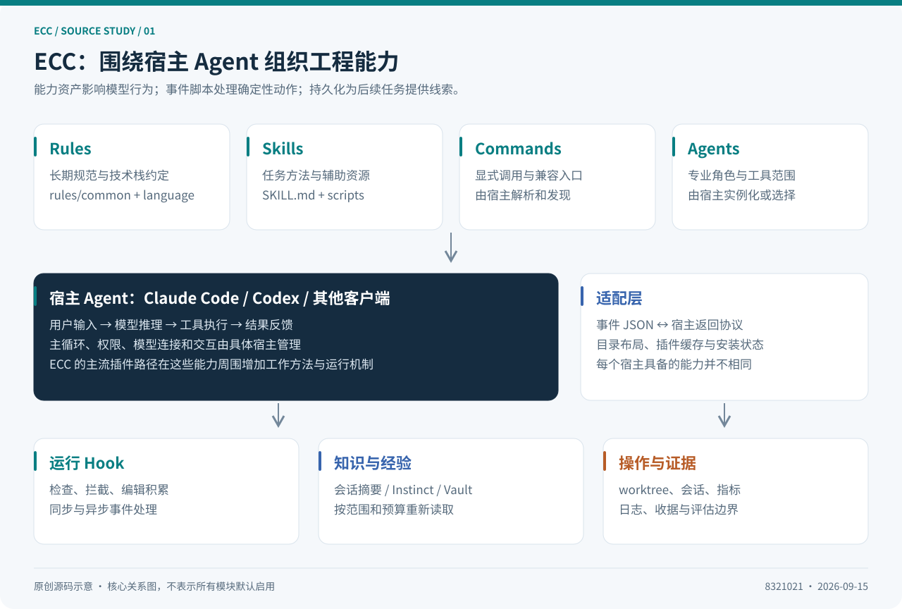
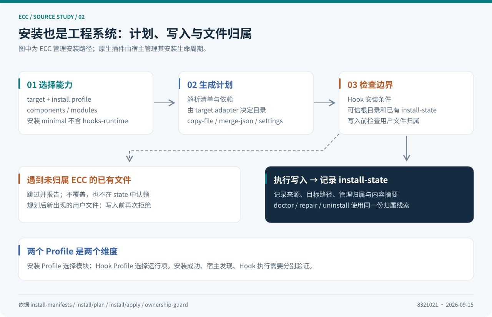
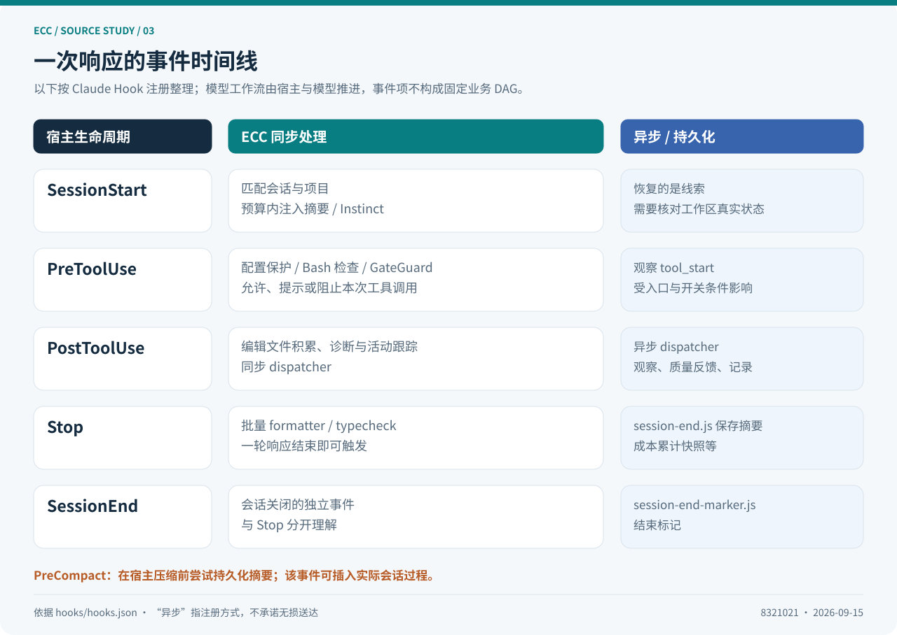
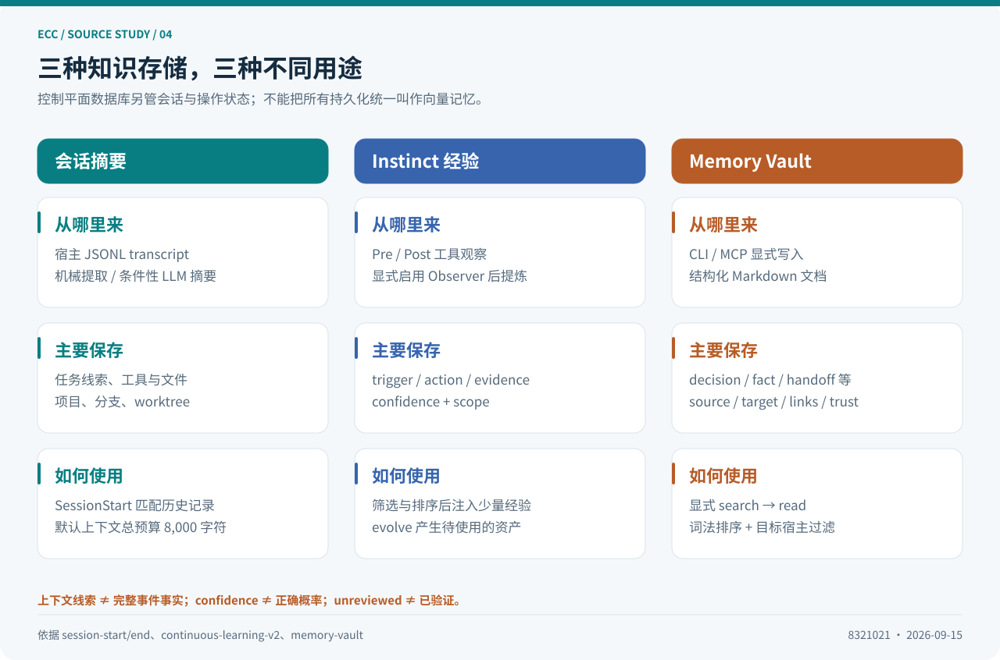
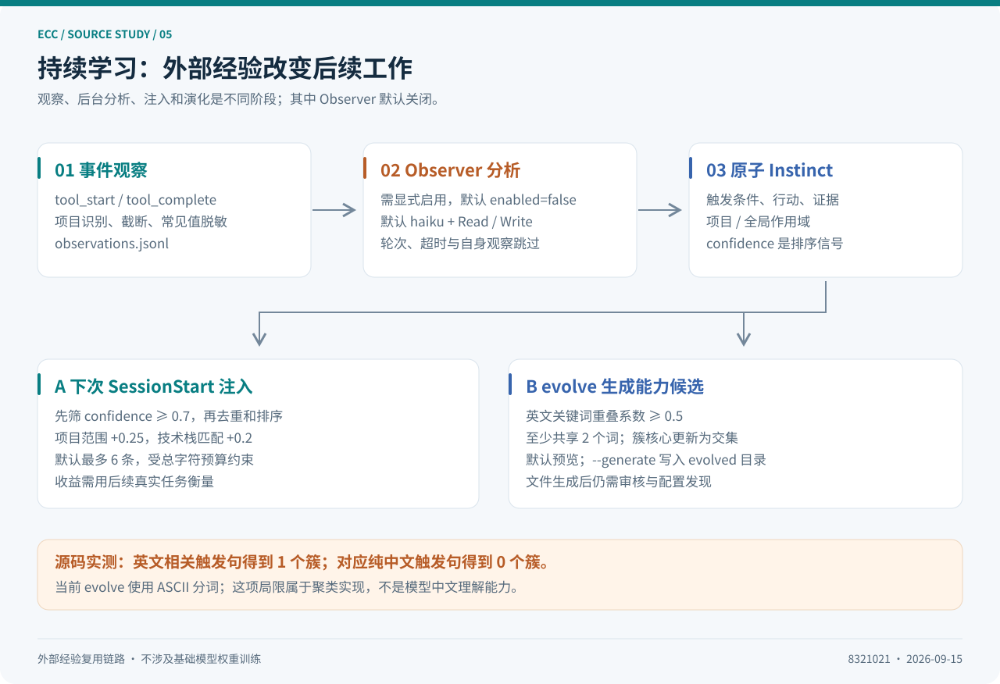
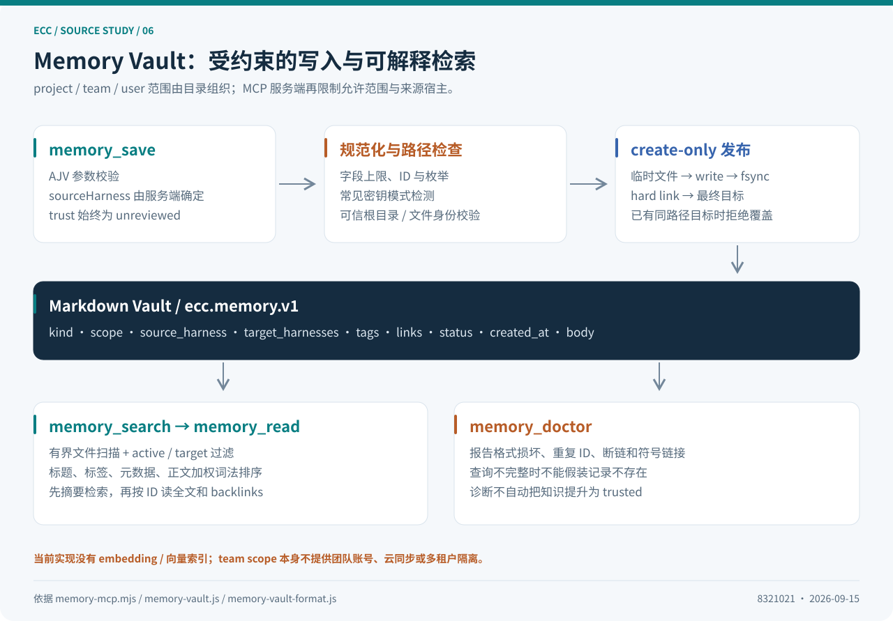
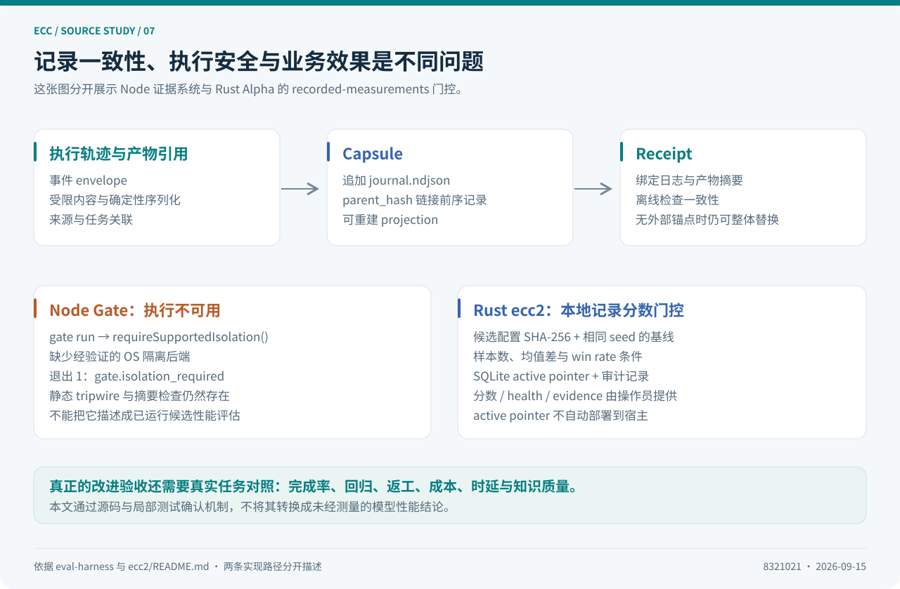

# ECC 源码深度解读：把 Coding Agent 的工作方法做成可安装、可执行、可积累的工程系统

> 调研日期：2026-09-15（Asia/Shanghai）  
> 源码基线：[`8321021c54d670126ce3b2969d5deb880b4b0c2a`][tree]，提交时间 2026-09-12，`ecc-universal` 版本 `2.2.1`。  
> 本文沿真实源码调用链展开，区分已经执行的机制、交给模型遵循的约定、尚未完成的方向。架构图均为本次调研原创；配套实验直接调用固定提交中的实现。



## 阅读导航

| 想了解的问题 | 对应章节 |
| --- | --- |
| ECC 到底提供什么，与 Agent Runtime 有何关系？ | [1. 定位](#position)、[2. 源码地图](#source-map) |
| Rules、Skills、Agents 如何成为可用能力？ | [3. 能力资产](#assets)、[4. 安装系统](#installation) |
| 一次工具调用被怎样处理？ | [5. 执行流程](#lifecycle)、[6. Hook 实现](#hooks)、[7. 质量机制](#quality) |
| 记忆、上下文与“持续学习”如何落地？ | [8. 会话记忆](#sessions)、[9. Instinct](#learning)、[10. Memory Vault](#vault) |
| 多客户端、多 Agent 和评估能做到什么？ | [11. 适配](#adapters)、[12. 编排](#orchestration)、[13. 评估](#evaluation) |
| 如何验证和借鉴？ | [14. 安全边界](#security)、[15. 实验](#experiments)、[16. 落地建议](#adoption)、[17. 总结](#conclusion) |

配套文件：[离线网页版](index.html) · [可运行源码实验](examples/README.md) · [验证记录](research/verification.md) · [源码索引](research/sources.md)。

<a id="position"></a>
## 1. 先建立正确的理解：ECC 在 Agent 的哪一层？

ECC 的历史名称是 Everything Claude Code，当前仓库使用 `affaan-m/ECC`，npm 包名仍是 `ecc-universal`。从专业 Agent 工程的角度，我把它概括为：**部署在 Coding Agent 周围的工程工作流、运行时扩展和经验资产管理系统。** [项目说明][readme] · [包入口][package]

一个基础 Coding Agent 通常负责模型调用、工具执行、对话历史、权限询问与交互界面。ECC 在这些能力之上补充：

1. **工作方法**：如何调研、拆任务、写测试、审查代码和验证结果。
2. **运行干预**：在工具调用前检查，在调用后记录，在响应结束后批量处理。
3. **经验积累**：保存会话摘要、记录工具轨迹、提炼 Instinct，再将经验写成可复用文件。
4. **配置工程**：将这些资产安装到不同宿主，记录文件归属，提供检查、修复和卸载入口。
5. **操作与证据**：跟踪会话、worktree、工作项、成本，以及可验证的执行记录。

这里的 **harness** 可以理解为模型的“运行支架”：模型能看什么、能调用什么、何时收到反馈、如何保留状态，都由它决定。ECC 很大一部分工作是增强现有 harness，而主流插件使用路径中的 LLM 主循环仍由 Claude Code、Codex 等宿主掌握。

这一边界也解释了为什么不能用“有没有一个 `while tool_calls` 循环”衡量 ECC：它的主线是扩展现有 Agent。仓库另有 Python `src/llm/` Provider 抽象、Node 操作工具和 Rust `ecc2/` 控制台，但不能因此把所有入口画成共同经过一个自研 ECC 推理内核。[Python Provider 接口][llm-interface] · [Rust 子项目说明][ecc2-readme]

### 1.1 本文的核心判断

| 判断 | 工程含义 |
| --- | --- |
| 能力资产与运行脚本共同组成 ECC | 只看 Markdown 会低估实现；只看脚本也会漏掉模型的工作约定 |
| Hook 是确定性控制的重要落点 | 提示词可以要求先检查，Hook 可以在特定调用入口真正阻止动作 |
| 跨会话能力有多套存储 | 会话摘要、Instinct、Memory Vault、控制平面数据库不能混为一个“记忆库” |
| 持续学习主要改变外部知识与工作方法 | 当前研究路径没有更新基础模型权重 |
| 跨宿主支持存在显著差异 | 文件能安装、Skill 能发现、Hook 能触发，是三个不同的验收条件 |
| 产品版本与子系统成熟度应分开 | `ecc-universal 2.2.1` 与仍标为 Alpha 的 Rust `ecc2/` 同时存在 |

这些判断来自后文的源码拆解；它们不是对模型完成率或性能提升的实测结论。

<a id="source-map"></a>
## 2. 源码地图：先找职责，再看数量

在固定提交上，以**顶层标准资产路径**计数：

| 内容 | 文件数 | 统计口径 |
| --- | ---: | --- |
| Agent 定义 | 68 | `agents/*.md` |
| Skill 定义 | 292 | `skills/*/SKILL.md` |
| 活跃 commands 目录 | 94 | `commands/*.md` |
| 归档命令兼容文件 | 12 | `legacy-command-shims/commands/*.md`，与上一项分开 |
| Rules | 121 | `rules/*/*.md` |
| 顶层 Hook 脚本 | 51 | `scripts/hooks/*.js` |
| JavaScript 测试文件 | 286 | `tests/**/*.test.js`，文件数不等于测试用例数 |

这些数字由本地源码统计，不能与翻译镜像、`.agents` 等适配目录重复相加。[快照清单](research/snapshot.json)

```text
ECC/
├── agents/                         专业角色、工具范围、模型建议
├── skills/                         方法论与可执行辅助资源
├── commands/                       当前命令入口
├── legacy-command-shims/            已迁移入口的兼容材料
├── rules/                          通用规范与语言/框架规范
├── contexts/                       工作模式上下文
├── hooks/                          宿主事件注册、元数据
├── scripts/
│   ├── hooks/                      Hook 的真实实现
│   ├── lib/install*/               选择、规划、写入和生命周期
│   ├── lib/memory-vault*.js         文件化记忆与检索
│   ├── lib/observer-sessions.js     观察进程的项目与会话状态
│   ├── lib/eval-harness/            执行证据、哈希链、收据与静态检查
│   ├── lib/state-store/             控制平面状态库
│   ├── memory-mcp.mjs              记忆的 MCP 服务
│   └── orchestrate-worktrees.js     worktree / tmux 编排入口
├── manifests/                      安装组件、模块与 Profile 清单
├── .claude-plugin/ .codex-plugin/   原生插件声明
├── .cursor/ .opencode/ ...          宿主适配
├── src/llm/                        Python Provider 与工具相关模块
└── ecc2/                           Rust 控制平面 Alpha
```

建议的阅读顺序是：**插件声明 → 事件注册 → 调度器 → 具体 Hook → 存储 → 测试**。这样可以持续回答“这个文件在真实安装中是否会执行”，避免把存在于仓库中的材料都当成默认生效功能。

<a id="assets"></a>
## 3. 能力资产：Rules、Skills、Commands、Agents 各自解决什么？

### 3.1 四种文件承担不同职责

| 资产 | 回答的问题 | 典型形式 | 执行者 |
| --- | --- | --- | --- |
| Rule | 长期遵循哪些工程原则？ | `rules/common/` 加语言规则 | 宿主加载后由模型遵循 |
| Skill | 完成一类任务的方法是什么？ | `SKILL.md`，可附脚本和资料 | 模型解释步骤，工具执行具体动作 |
| Command | 用户如何显式触发流程？ | `commands/plan.md` | 宿主命令解析和模型 |
| Agent | 哪种角色、上下文和工具范围适合任务？ | `agents/planner.md` | 宿主创建或选择角色 |

例如 `planner.md` 的元数据声明 `tools: Read, Grep, Glob` 和 `model: opus`，正文定义需求分析、架构调查、步骤与验收标准。这提供了一个偏只读的规划角色。**角色定义本身不负责进程调度，也不等于另一个独立模型权重。** 工具范围及模型字段如何落实，还要看宿主如何解释。[Planner 定义][planner]

下面是本文原创的结构示意，字段形式参考 ECC：

```yaml
---
name: api-change-reviewer
description: Review API changes and their compatibility impact.
tools: Read, Grep, Glob
model: opus
---

先找调用方，再检查公开接口、错误语义和迁移测试。
输出文件位置、影响范围、证据与修复建议。
```

### 3.2 Skill 的价值在于“行为契约”

`search-first` 将编码前调研分成工具可用性检查、需求分析、寻找现成实现、评估和选择。`verification-loop` 则组织验证流程。模型依靠这些材料调整工作顺序，但它们不会仅因被安装就自动启动一个后台工作流引擎。`search-first` 正文也明确指出工具预检查属于 Agent 指导。[Search First][search-first] · [Verification Loop][verification]

因此，工程上要把两件事分别验收：

- **可发现性**：宿主是否发现该 Skill，描述是否能准确匹配任务。
- **执行有效性**：模型是否选中它、是否完成步骤、是否产生了可核验的证据。

增加 Skill 数量只直接扩大能力目录，不直接证明任务质量提高。

### 3.3 命令与 Skill 正在迁移，不能机械地一一对应

这个快照里有 `commands/plan.md`，但没有 `skills/plan/SKILL.md`。`plan` 命令要求先分析并呈现计划，默认在当前上下文运行，明确不默认调用子 Agent。这和“`/plan` 一定创建 planner 子 Agent”的常见理解不同。[Plan 命令][plan]

`orchestrate` 则已经位于 `legacy-command-shims/commands/`，兼容文件将用户引向 `dmux-workflows` 和 `autonomous-agent-harness`。与此同时，`plan-orchestrate` Skill 仍描述生成 `/orchestrate custom` 调用。这是应当核对安装表面的迁移差异：**源码中一段命令示例存在，不足以保证当前安装就有那个命令。** [兼容入口][orchestrate-shim] · [Plan Orchestrate][plan-orchestrate]

对大型 Prompt/Skill 仓库，这种“入口—文档—目录”的一致性维护，是实实在在的产品工程问题。

<a id="installation"></a>
## 4. 安装系统：将能力目录编译成宿主可以使用的文件



### 4.1 两条主要分发路径

**原生插件路径**依赖宿主的 marketplace、插件缓存与启用状态。Claude 插件声明暴露 Skills 和 Commands，并提供 Hook 开关及档位选项；事件注册位于 `hooks/hooks.json`。Codex 插件声明则显式引用 `skills/`、`.mcp.json` 和 `hooks/codex-hooks.json`。[Claude 插件][claude-plugin] · [Codex 插件][codex-plugin]

**选择性安装路径**由 ECC 自己规划文件放置：用户选择 target、profile、组件，再由适配器转换成复制、JSON 合并、Claude settings 更新等操作。核心路径可以按以下顺序阅读：

```text
用户安装参数
  → install request / config
  → install-manifests：解析组件、模块、依赖与 target
  → install/plan：物化文件与配置操作
  → target adapter：确定宿主目录与安装策略
  → install/apply：执行归属检查和写入
  → install-state：记录安装来源、目标与内容摘要
  → doctor / repair / uninstall
```

这套结构的价值是：能力资产不必分别维护十几套完整副本；差异主要落到 target adapter 和内容变换中。[清单解析][install-manifests] · [操作计划][install-plan] · [写入实现][install-apply]

### 4.2 最容易混淆的两个 Profile

| 名称 | 控制对象 | 示例 |
| --- | --- | --- |
| 安装 Profile | 安装哪些模块 | `minimal / core / developer / security / research / full`，另有 `opencode` |
| Hook Profile | 已安装 Hook 中哪些执行 | `minimal / standard / strict` |

`manifests/install-profiles.json` 中的安装 `minimal` **不包含 `hooks-runtime`**；但运行时 Hook `minimal` 是一份允许列表，一些基本 Hook 仍可在该档位运行。两者恰好同名，却处在不同阶段。安装 `core` 包含 Hook 模块；是否实际配置并启用，还受 target 支持与 Hook consent 控制。[安装 Profile][profiles] · [Hook 开关][hook-flags] · [Hook 安装检查][hook-consent]

### 4.3 文件归属比“成功复制”更重要

假设用户已有一个自定义 Skill，安装器恰好要写到同一路径。简单 `cp -r` 会造成两个问题：覆盖用户内容；将该文件错误记录成 ECC 所有，卸载时再误删它。

`prepareUserOwnedFileGuard()` 因此读取上次 install-state：

1. 校验 state 中的 target 和根目录与本次计划一致。
2. 收集此前明确记录为 ECC 管理的目标文件。
3. 对已经存在、却没有被记录为 ECC 管理的 `copy-file` 目标，跳过并报告。
4. 将跳过的目标从最终 state 中剔除，防止“没有写过，却认领了所有权”。
5. 写入前再检查是否出现新用户文件，处理规划与执行之间的竞争。

这里提供的是明确的**文件所有权边界**。它不意味着所有已管理文件的手工修改都会在重装时保留；源码明确允许此前管理的文件由重装、修复更新。也不应将多文件安装描述为一个整体 ACID 事务。[归属保护实现][ownership] · [安装状态][install-state]

### 4.4 上下文成本从安装阶段就开始了

安装整个目录后，宿主至少可能把能力名称和描述暴露给模型。Skill 正文按需读取，并不意味着目录广告零成本。ECC 支持选择性安装，正是为了按任务和团队技术栈收缩能力面。

我的建议是先确定能力组合：通用规则、当前语言、测试和审查，再增加确实使用的能力。是否省 Token、是否改善选择准确率，应通过同任务对照验证；本文没有把目录缩减换算成未经实测的百分比收益。

<a id="lifecycle"></a>
## 5. 从一次任务看执行流程



以“给项目补一个 API 并验证”为例，可以拆成两条同时存在的线。

**模型工作线**：理解需求 → 读取相关 Skill/Rule → 调查 → 写测试和代码 → 审查 → 验证。具体步骤由模型和用户交互推进。

**Hook 事件线**：由宿主在生命周期节点发送 JSON，ECC 脚本处理后返回上下文、诊断或拦截结果。以下是固定提交的 Claude 注册内容摘要，而不是所有宿主的统一事件协议。[Claude Hook 注册][hooks-json]

| 事件 | ECC 代表行为 | 应注意的语义 |
| --- | --- | --- |
| `SessionStart` | 项目识别、历史上下文、Instinct 注入、计划会话状态 | 通过宿主接受的 additional context 返回 |
| `PreToolUse` | Bash 检查、配置保护、GateGuard、压缩提醒、观察 | 同步检查可影响本次调用；观察项有异步配置 |
| `PostToolUse` | 编辑积累、诊断、活动跟踪、指标与观察 | 固定提交分成一个同步 dispatcher 和一个异步 dispatcher |
| `PostToolUseFailure` | MCP 健康检查、Skill 失败跟踪 | 失败路径也有记录入口 |
| `PreCompact` | 压缩前尝试持久化摘要 | 压缩动作由宿主执行 |
| `Stop` | 批量格式化/类型检查、会话摘要、成本记录、通知 | 一次响应结束就可能触发，不能等同于退出进程 |
| `SessionEnd` | 会话结束标记 | 与名叫 `session-end.js` 的脚本不是同一概念 |

最后一点尤其容易读错：**`scripts/hooks/session-end.js` 实际注册在 `Stop` 上。** 它在活跃会话中持续更新摘要；真正 `SessionEnd` 事件注册的是 `session-end-marker.js`。

<a id="hooks"></a>
## 6. Hook 的实现：协议适配、调度、开销和失败语义

### 6.1 从配置字符串到脚本执行

许多 Hook 的配置最终经过：

```text
hooks.json 中的根目录解析
  → plugin-hook-bootstrap.js
  → run-with-flags.js hookId relativeScript profiles
  → hook.run(raw, context) 或 legacy 子进程
  → 输出转换
  → 宿主读取 stdout / stderr / exit code
```

实际注册存在专用路径，例如 Bash dispatcher 和 PostToolUse dispatcher，不能把每个事件都强行套进同一个 wrapper。`plugin-hook-bootstrap.js` 处理路径和运行环境，并抑制原始输入回显；`run-with-flags.js` 负责开关判断、目标脚本检查和新旧脚本执行方式兼容。[Bootstrap][bootstrap] · [通用 Runner][runner]

### 6.2 开关是明确的布尔逻辑

Hook 的配置优先级是：相关 `ECC_*` 环境变量 → Claude 插件选项 → 管理安装的 `ecc/setup.json` → 默认值。默认总开关开启，Hook Profile 为 `standard`，非法 Profile 回退到 `standard`。[开关解析][hook-flags]

以下为等价逻辑示意：

```javascript
enabled = globalSwitch
  && !disabledHookIds.has(hookId)
  && hookAllowedProfiles.includes(selectedProfile);
```

注意它是**每个 Hook 的允许列表**，并不是代码里一个自动递进的安全等级体系。某 Hook 是否在 `strict` 执行，要看自己的 profiles。

### 6.3 内部返回值不等于宿主协议

脚本内部可以返回字符串或对象，例如：

```javascript
// 结构示意，不是直接发送给所有宿主的通用协议
return { additionalContext: '请先检查调用方', exitCode: 0 };
return { stderr: 'BLOCKED: ...', exitCode: 2 };
```

Runner 再将 `additionalContext` 编码成带 `hookSpecificOutput` 的宿主结果。Bash dispatcher 将多个提示合并；PostToolUse dispatcher 会合并合法的 additional context，多段无法合并的原始 stdout 则保留最后一段并记录诊断。[Bash 调度器][bash-dispatcher] · [PostToolUse 调度器][post-dispatcher]

设计经验是：**内部 Hook 接口可以统一，面向宿主的线协议必须单独适配。** 否则把输入事件原封不动写回 stdout，可能产生 schema 错误，也可能让工具大结果重复进入 transcript。

### 6.4 如何减少高频 Hook 的开销？

ECC 使用了三种具体手段：

- **函数调用替代部分子进程**：脚本导出 `run` 时，通用 Runner 尝试 `require()` 后执行，也支持 `async run()`；旧脚本仍通过 `spawnSync` 兼容。
- **事件处理合并**：多个 Bash 前置检查合在一个 dispatcher；PostToolUse 组织为同步、异步两组。
- **把昂贵工作移到批次**：编辑阶段记下文件集合，响应结束时按项目和 tsconfig 批量执行格式化、类型检查。

异步组的含义是宿主可异步调度该命令；组内源码仍然按 Hook 列表迭代，不能据此声称每个 Hook 都并行执行。直接 `require()` 也不代表所有进程开销消失：外层 bootstrap、旧脚本和 Shell/Python 观察路径仍有启动成本。[Runner][runner] · [PostToolUse 调度][post-dispatcher] · [批量检查][stop-format]

### 6.5 “失败放行”与“失败拒绝”应逐段分析

| 路径 | 当前表现 | 工程解读 |
| --- | --- | --- |
| Hook 被禁用、目标脚本缺失、Runner 拒绝越出插件根目录 | 多数为诊断后退出 0 | 可用性优先；不代表检查完成 |
| 直接调用 `run()` 抛错 | 通用 Runner 捕获后放行 | 不能把通用 Runner 本身当作强安全门 |
| Legacy 子进程启动失败、信号终止、缺失退出状态 | Runner 返回非零 | 与直接调用分支的失败语义不同 |
| 配置保护发现输入被截断 | 返回 2 | 该安全 Hook 选择拒绝不完整输入 |
| Bash 前置子 Hook 返回非零 | 提前结束后续检查 | 拦截优先 |
| PostToolUse 某个子 Hook 返回非零 | 记录并继续其他项，保留错误码 | 调用已发生，主要用于后续反馈 |

通用 Runner 设有约一百万字符量级的输入限制；其实现按 JavaScript 字符串长度截取，而 PostToolUse dispatcher 使用字节计数及 `StringDecoder`。因此，不应将所有代码中的 `MAX_STDIN = 1024 * 1024` 一概描述为严格相同的 UTF-8 字节上限。[Runner][runner] · [配置保护][config-protection] · [PostToolUse][post-dispatcher]

更重要的是：系统应让“已检查并通过”“被配置禁用”“运行失败而放行”在日志中可区分。退出 0 单独无法表达这三种状态。

<a id="quality"></a>
## 7. 质量机制：把反馈放在最合适的时间点

### 7.1 阻止“为了通过检查而修改检查器”

`config-protection.js` 维护一组 linter/formatter 配置文件名。对于已存在的 ESLint、Prettier、Biome、Ruff 等配置，Edit/Write/MultiEdit 路径上的检查可以返回 2，要求修复源代码；首次创建配置则允许。

细节包括大小写不敏感文件名匹配、用 `lstat` 识别悬空符号链接、只将 `ENOENT` 视为不存在，以及输入截断时拒绝执行。`pyproject.toml` 被有意排除，因为它混合项目元数据和工具配置。[配置保护源码][config-protection]

这是很实际的防止目标偏移措施：任务要求“让代码符合规则”，模型却可能走向“让规则接受代码”。但这个 Hook 只覆盖其注册的工具入口，不能阻止一个拥有通用 Shell 写权限的进程从其他通道修改文件。

### 7.2 保护已有 Git 检查流程

`block-no-verify.js` 检测 Git 检查绕过选项。它包含 Shell 单词解析和 Git 参数语义处理，区分真实选项与提交消息中的文本；Bash dispatcher 将它列为 `minimal,standard,strict` 都执行的项目。[Git 检查保护][block-no-verify] · [注册顺序][bash-dispatcher]

这里值得借鉴的是把常见绕过方式写成可测试的确定性规则，而不是仅在系统提示词里写“不要跳过检查”。

### 7.3 GateGuard 要求具体事实

GateGuard 针对文件变更要求先调查调用方、公开接口和数据约束；针对破坏性命令要求明确目标与回退计划，并保存会话状态。它通过将动作变成“先提供事实，再执行”来减少盲改。[GateGuard][gateguard]

事实要求和状态记录仍不能自动证明回答正确。团队应观察误拦截、额外轮次和跳过率，在明确范围内调整豁免；把“提示更长”当作“风险更低”同样需要证据。

### 7.4 格式化与类型检查为什么放到 Stop？

`post-edit-accumulator.js` 记录本轮改过的文件。`stop-format-typecheck.js` 读取后去重，按项目根目录聚合 formatter，按 tsconfig 聚合 TypeScript 检查。读取后清理 accumulator，以免重复 Stop 再处理同一批。[编辑积累][accumulator] · [Stop 批量处理][stop-format]

这比每次改动都完整运行一遍类型检查更符合高频编辑场景。与此同时，`quality-gate.js` 在工具缺失时允许跳过，`ECC_QUALITY_GATE_STRICT=true` 的若干分支主要输出诊断；批量 formatter 失败也有非阻塞处理。**这些反馈机制应与真实 CI 验收并用，不能把脚本名称中的 Gate 当作已经通过的强制质量保证。** [Quality Gate][quality-gate]

<a id="sessions"></a>
## 8. 上下文与会话记忆：把短期对话变成下次可用的线索



### 8.1 会话摘要是一种有损投影

`session-end.js` 读取宿主的 JSONL transcript，机械提取：

- 最近 10 条有效用户消息，每条保留前 200 个字符。
- 最多 20 个工具名称。
- 最多 30 个通过 Edit/Write 识别出的文件路径。
- 用户消息数、项目、分支和 worktree 元信息。

它过滤 tool-result 载体和部分宿主噪声，兼容直接字段与嵌套 `message.content`，并只更新 Markdown 中被标记的摘要块，保留手工补充部分。[会话写入][session-end]

这份记录擅长回答“用户做过什么、涉及哪些文件”。它不能完整表示 Shell 所有副作用，也没有保留每次工具结果。因此，恢复摘要应触发核对当前 Git/工作区状态，不能把它直接当成事实数据库。

### 8.2 可选的 LLM 摘要有真实调用成本

同一脚本在上下文剩余低于默认 20%，或用户消息数达到默认 50 的倍数时，尝试调用 `generateSessionSummary()`。辅助模块通过 `claude --model <model> -p` 调用已配置的 Claude CLI，默认模型标识为 `haiku`；失败则回退机械摘要。压缩前 Hook 也会尝试生成更丰富的摘要。[摘要触发][session-end] · [LLM 摘要模块][llm-summary] · [PreCompact][pre-compact]

辅助模块最多选择最近 25 个用户/助手 turn，并将输入控制在约 7,000 字符量级；`ECC_SKIP_LLM_SUMMARY` 用来防止摘要子进程再次触发摘要。这里存在多层时间预算：辅助模块内部允许的等待时间与外层 Hook、Runner 的超时并不相同，不能仅看内部的 90 秒就认为宿主一定会等满。

工程结论是：**自动摘要属于另一次推理任务**，会引入延迟、成本、失败以及递归控制问题；没有单独 API Key 不等于没有模型调用成本。

### 8.3 新会话只恢复有限上下文

`session-start.js` 负责匹配历史记录与注入：

1. 默认清理超过 30 天的旧会话文件，可配置保留策略。
2. 在最近 7 天的候选中，依据当前 worktree / 项目选择匹配会话。
3. 对明确的 resume、clear、compact 等非 startup 场景，避免再次注入上一会话摘要。
4. 选择高置信度 Instinct，并补充有限数量的 learned skill 摘要。
5. 对合成的 additional context 应用默认 **8,000 字符**预算。

这个预算不是 Token 预算。中文、代码、英文的字符与 Token 比例不同，生产实现若对上下文成本敏感，应结合宿主实际 usage 统计。[SessionStart][session-start]

`suggest-compact.js` 则依据工具调用次数和 transcript usage 提醒在合适时机压缩，`pre-compact.js` 按 worktree 选择要更新的摘要文件。它们围绕宿主压缩工作，未替换宿主自己的压缩算法。[压缩建议][suggest-compact] · [压缩前持久化][pre-compact]

<a id="learning"></a>
## 9. Continuous Learning v2：观察、提炼、筛选，再演化



### 9.1 “学习”的对象是什么？

在这条实现中，学习对象是 **Instinct：带触发条件、行动建议、证据、置信度与作用域的原子经验文件**。例如本文原创的示意：

```yaml
---
id: migration-tests-first
trigger: when changing database migration scripts
confidence: 0.85
domain: testing
scope: project
source: session-observation
---

## Action
先覆盖升级和回退路径，再修改迁移脚本。

## Evidence
两次相关任务的缺陷都来自遗漏回退检查。
```

模型下次读到它后，可能采用更合适的做法。这是一条 **外部记忆影响后续推理** 的链路，不涉及基础模型梯度更新。[CLv2 设计材料][clv2-skill]

### 9.2 第一步：工具事件观察

注册的 Node `observe-runner.js` 探测可用 Shell，再调用 `observe.sh pre|post`。Shell 脚本使用 Python 解析事件，记录 `tool_start` 或 `tool_complete`，保存 session、tool、项目与相应输入/输出。一个值得留意的细节是：中间解析结果提取了 `tool_use_id`，但最终构造的 observation 没有写入它；需要精确关联并发工具的开始和结束时，这条信息链还不完整。[观察桥接][observe-runner] · [事件记录][observe]

实现中的关键控制包括：

- 默认只接受所列交互入口；`ECC_SKIP_OBSERVE=1`、minimal Profile、子 Agent 标识和排除路径可跳过。
- 输入和输出字符串各截取最多约 5,000 字符；解析失败的调试记录另有较小上限。
- 对常见 `api_key/token/password/authorization` 等值做正则脱敏。
- observation 文件约达到 10 MB 时归档，旧归档有清理逻辑。
- 通过锁和计数节流观察进程的启动、唤醒，避免每个工具事件都触发一次分析。

这已经超过“写一行 JSONL”的简单实现。但 Skill 文档中的“100% reliable”不能按字面当成可靠性承诺：实际代码有主动跳过、运行时缺失、超时、截断和异步退出路径。

### 9.3 项目隔离：减少经验串用

CLv2 的默认数据根目录按以下顺序解析：绝对路径的 `CLV2_HOMUNCULUS_DIR`、`XDG_DATA_HOME/ecc-homunculus`、`~/.local/share/ecc-homunculus`。历史版本的 `~/.claude/homunculus` 有迁移路径。[CLv2 目录约定][clv2-skill] · [会话/项目工具][observer-sessions]

项目标识优先利用明确项目上下文、Git remote 或仓库路径等信息，形成短哈希。项目内目录存放 observations 和 personal/inherited instincts，全局目录存放通用经验。实际入口会先规范化事件中的 cwd；例如 observe 对非 Git cwd 的处理与文档中的显式 override 描述存在入口条件差异，排障时应跟到调用处。

这套设计把“React 项目偏好”和“全局工程习惯”分开。但项目 ID 是检索与归类标识，不是身份认证或访问控制机制。

### 9.4 第二步：Observer 默认关闭，需要单独启用

仓库 `skills/continuous-learning-v2/config.json` 的实际默认值是：

```json
{
  "version": "2.1",
  "observer": {
    "enabled": false,
    "run_interval_minutes": 5,
    "min_observations_to_analyze": 20
  }
}
```

**有 observation 文件，不能证明后台正在生成 Instinct。** Hook 的事件捕获和后台 Observer 的 enabled 开关是分开的。[默认配置][clv2-config]

启用后，`start-observer.sh`、`observer-loop.sh` 管理后台循环。分析使用默认 `haiku`，带最大轮次、超时监督和 `Read,Write` 工具列表；子进程设置 `ECC_SKIP_OBSERVE=1` 与 minimal Profile，避免观察自身。会话 lease、空闲退出、启动失败诊断也在这条路径里。[Observer 启动][observer-start] · [Observer 循环][observer-loop]

`Read,Write` 是能力限制的一部分，具体哪些路径可写仍要由宿主权限约束。后台分析也不能天然判断输入中的指令可信：工具输出可能携带提示注入，写入的经验需要保留来源和复核途径。

### 9.5 第三步：SessionStart 选择哪些经验注入？

当前实现先筛选 `confidence >= 0.7`，默认最多注入 6 条。同 ID 的项目经验优先于全局经验。默认开启位置/技术栈相关性排序：项目作用域加 `0.25`，技术栈匹配加 `0.2`，与 confidence 相加排序；最后用作用域和 ID 稳定打破平局。[注入选择][session-start] · [相关性实现][instinct-relevance]

```text
注入排序分数 = confidence + 项目范围加分 + 技术栈匹配加分
```

这里的分数只用于排序，甚至可以大于 1；它不是校准过的成功概率。SessionStart 还没有完整的新用户任务，所以这里的“相关”主要表示当前位置和技术栈相关，不能描述成对当前需求做了语义检索。

### 9.6 第四步：`evolve` 的聚类算法很具体

Python CLI 要求至少有 3 条 Instinct 才开始分析。对每条 trigger：

1. 用 `[a-z0-9]+` 取单词。
2. 去除短词和一组英文停用词。
3. 贪心寻找与当前词集合最接近的已有簇。
4. 使用重叠系数：`共享关键词数 / 两个集合中较小的大小`。
5. 达到 `0.5` 且至少共享 2 个关键词才归并；簇的核心关键词更新为交集。

```python
# 本文对实际算法的简化，不是 ECC 原文件的完整复制
overlap = len(words & cluster_words) / min(len(words), len(cluster_words))
if overlap >= 0.5 and len(words & cluster_words) >= 2:
    cluster.append(instinct)
    cluster_words &= words
```

至少 2 条经验的簇成为 Skill 候选；workflow 域且 confidence 至少 `0.7` 的经验可成为 Command 候选；至少 3 条且平均 confidence 至少 `0.75` 的簇可成为 Agent 候选。默认 `evolve` 预览，`--generate` 才写入 evolved 目录。项目到全局的 promotion 另有至少 2 个项目和 `0.8` 置信度阈值等逻辑。[Instinct CLI][instinct-cli]

**生成文件与安装启用是两个步骤。** 不能把 evolved 目录写出文件等同于宿主已经发现并使用它。

### 9.7 一个实际验证的中文局限

本文使用同样各 3 条经验的两个 fixture：英文组包含两个相关的数据库迁移测试 trigger 和一个无关 trigger；中文组使用对应的纯中文句子。

| 输入 | 实际得到的 Skill 簇 |
| --- | ---: |
| 英文 trigger | 1 |
| 纯中文 trigger | 0 |

原因是当前 ASCII 分词正则无法提取纯中文关键词。这并不意味着 ECC 的所有功能不支持中文，也不意味着模型无法理解中文；它只揭示 **`evolve` 这段确定性聚类代码的语言边界**。[实验源码](examples/probe.cjs) · [实测输出](research/probe-results.json)

此外，贪心聚类受输入顺序影响；共享通用词可能误聚类；confidence 依赖经验生成和维护过程。生产演化应加入稳定性测试、质量审核和回归任务，不能仅凭阈值把文件自动提升为团队规则。

<a id="vault"></a>
## 10. Memory Vault：面向跨宿主的文件化记忆服务

### 10.1 为什么还需要一套 Vault？

会话摘要偏向连续工作，Instinct 偏向行为经验；Memory Vault 提供更显式的知识对象：context、decision、fact、handoff、lesson、note、preference、runbook。它通过 CLI 和 MCP 提供写入、查询、读取与诊断，不依赖某一次 Claude transcript 的结构。[Vault 核心][memory-vault] · [格式定义][memory-format] · [CLI][memory-cli]

默认目录如下：

```text
仓库根目录/.ecc/memory/
├── project/       本项目私有记录；写入器维护忽略规则
└── team/          项目中的团队记录位置

~/.ecc/memory/     user 范围；跨项目的用户记录
```

`team` 是作用域与目录组织方式，本身不包含团队账号体系、云同步或多租户授权。默认召回作用域为 project 和 team，user 范围在 MCP 服务中需要额外启用。

### 10.2 数据对象具有显式来源与信任状态

Markdown frontmatter 保存 `ecc.memory.v1` schema、稳定 ID、kind、scope、来源宿主、目标宿主、tags、links、时间等元数据，正文保存内容。

特别重要的是：当前 `MEMORY_TRUST_STATES` **只允许 `unreviewed`**。保存接口创建的记忆始终处于这一状态；没有实现一套“自动分析后变成 verified”的信任提升流程。status 的 `active / rejected / superseded` 也不能与 trust 混淆。[格式与枚举][memory-format]

### 10.3 写入：验证后以 create-only 发布



真实写入路径包含：

1. 规范化对象、限制字段、验证 ID、kind、scope。
2. 检测常见密钥格式，发现可疑值就拒绝保存。
3. 检查目标根目录和中间目录，拒绝不符合可信根边界的符号链接路径。
4. 使用随机临时文件、`O_EXCL`、可用时的 `O_NOFOLLOW`，并核对文件描述符与路径的身份。
5. 完成写入并 `fsync` 后，通过 `linkSync(temporary, destination)` 发布目标。
6. 删除临时文件；如果目标已存在则拒绝覆盖。

**这里的发布操作是硬链接，不是通常示例里的 rename 覆盖。** 好处是目标路径已存在时自然失败。代价是依赖文件系统对相关操作的支持；本次没有覆盖 Windows、网络文件系统等平台。[create-only 写入][memory-vault]

create-only 直接约束的是目标文件路径。底层库若显式指定相同 ID、不同 kind，会产生不同目录下的文件；全局 ID 冲突需要读取与 doctor 进一步识别。MCP 保存接口不允许调用者指定 ID，正常路径使用生成的 ID，但手工编辑仍可能引入重复。

### 10.4 检索：确定性词法排序

当前 Vault 每次读取有限范围的 Markdown 文件并计算词法分数，没有向量索引或 embedding 请求。源码给出的扫描边界包括最多 5,000 个遍历项、16 MiB 扫描文本以及有限的诊断数量；单次结果最多 100 条。发生截断时会返回 diagnostics。[扫描与检索][memory-vault]

对去重后的 query token，评分可以写成：

```text
score = phraseScore
      + Σtoken [8 × 标题含 token
                + 6 × tags 精确含 token
                + 3 × 元数据文本含 token
                + min(正文出现次数, 5)]

phraseScore：完整 query 命中标题为 20；否则命中正文为 5；否则为 0。
```

先过滤 active、kind、trust（若调用方指定）、targetHarness，再按分数、更新时间、ID 排序。检索结果提供摘要；`memory_read` 按 ID 读取正文和派生 backlinks。这里的 targetHarness 是可见性过滤，不能替代操作系统隔离。[评分、查询与读取][memory-vault]

这一实现部署成本低、排序可解释、无需额外推理请求，适合规模有限的团队知识文件；代价是每次扫描成本、同义改写召回较弱，以及中文分词质量需要单独评估。Vault 使用 Unicode 字母/数字分组，和上一章的 ASCII Instinct 分词器不同，不能把两者的语言限制完全等同。

### 10.5 MCP：用协议给不同 Agent 同一套记忆入口

`memory-mcp.mjs` 直接实现标准输入输出上的 JSON-RPC 服务，使用 AJV 验证 Tool 参数，包含初始化、协议版本协商、工具列举、工具调用以及消息/输出/排队上限处理。它暴露四个工具：[Memory MCP][memory-mcp]

| 工具 | 职责 | 关键约束 |
| --- | --- | --- |
| `memory_save` | 创建记忆 | create-only；来源宿主由服务端决定；trust 为 unreviewed |
| `memory_search` | 检索知识 | 作用域授权、目标宿主过滤、有界结果 |
| `memory_read` | 按 ID 取正文与反向链接 | 区分完整查询与不可完成的查询 |
| `memory_doctor` | 检查损坏、重复、断链和符号链接 | 诊断结果有界，不直接改写知识 |

服务要求设置 `ECC_MEMORY_HARNESS`；默认禁止 user scope，只有服务端 `ECC_MEMORY_ALLOW_USER_SCOPE=1` 才允许。Tool 参数使用 `additionalProperties: false`，模型不能通过增加一个自称 trusted 或 sourceHarness 的字段获得更高信任。

还要核对是否配置了这个 MCP：**这份快照的 Claude 插件 `mcpServers` 是空对象，Codex 所引用的根 `.mcp.json` 只有 Chrome DevTools 配置。** Memory MCP 文件和二进制入口存在，不代表两个原生插件默认都已经连接它。[Claude 插件][claude-plugin] · [Codex 插件][codex-plugin] · [根 MCP 配置][root-mcp]

这也揭示了一条通用工程原则：服务代码、安装产物、客户端连接和模型调用，必须分别验证。

<a id="adapters"></a>
## 11. 跨宿主适配：迁移知识容易，迁移执行语义更难

### 11.1 固定提交中的支持情况

下面结合官方支持矩阵和实际注册文件整理；它描述 ECC 的这份快照，不代表对各宿主最新版本能力上限的判断。[官方支持矩阵][support]

| 宿主 | ECC 的定位 | 当前需要特别核对的边界 |
| --- | --- | --- |
| Claude Code | 主要稳定路径 | 插件目录、事件钩子、规则选择，以及不同安装方法是否重复叠加 |
| Codex | 支持原生插件 | 此快照的 `codex-hooks.json` **只注册 SessionStart**；不是 Claude 全套 Hook |
| Cursor | Beta 项目适配 | 发现行为与版本相关；输入映射和安装路径影响可用 Hook |
| OpenCode | Beta 构建插件 | TypeScript 插件需构建，能力目录和宿主模型配置均有独立条件 |
| GitHub Copilot | Instruction-only | 主要是 instructions/prompts，不能默认获得 ECC 的运行钩子与角色调度 |
| Gemini、Zed、Kimi、Hermes 等 | Experimental/minimal adapter | 文件放置和指令可移植性，不等于功能完全对齐 |

这里最有代表性的是 Codex：旧架构文档仍出现“instruction-backed”的表述，但当前原生插件已引用一个只含 SessionStart 的 Hook 文件。准确结论应同时包含“已经有原生 Hook 注册”和“范围很窄”。[Codex Hook 文件][codex-hooks] · [跨宿主架构文档][cross-harness]

### 11.2 Cursor：事件字段转换与已有脚本复用

`.cursor/hooks/adapter.js` 将 Cursor 的 `command / args.command`、`path / file / args.filePath` 等字段变成 ECC 已有脚本使用的 `tool_input`，并转交执行。它会传播特定拦截退出码。这个方案复用了实现，但 adapter 自身仍有输出转发、超时、开关语义等独立细节。[Cursor Adapter][cursor-adapter]

这意味着“同一个检查脚本”并不保证“同一个最终用户体验”。要测试的是完整的事件转换与结果返回链。

### 11.3 OpenCode：插件事件映射

`.opencode/plugins/ecc-hooks.ts` 在 OpenCode 插件系统中接收 `tool.execute.before / after`、会话等事件，维护自身运行状态并组合检查。它是需要构建的 TypeScript 插件，实现方式和 Claude 的外部命令 Hook 不完全相同。[OpenCode 插件][opencode-hooks]

从平台工程角度，适配层至少要保存四项契约：

1. **事件契约**：什么时候触发，是否可能重放或漏发。
2. **字段契约**：工具名称、参数、输出、session ID、cwd 如何映射。
3. **控制契约**：什么结果能阻止执行，什么只显示提示。
4. **状态契约**：数据写在哪里，怎样避免跨项目串用和重复记录。

Skill Markdown 可以大体复用，以上四项通常需要逐宿主验证。

<a id="orchestration"></a>
## 12. 多 Agent 与控制平面：流程约定、执行脚本、Alpha 控制台

### 12.1 三个层次不要混在一起

| 层次 | 当前实现 | 能证明什么 |
| --- | --- | --- |
| 团队工作方法 | `team-agent-orchestration`、`dynamic-workflow-mode` 等 Skill | 定义 owner、scope、状态、验收、handoff 的操作约定 |
| 确定性执行工具 | `orchestrate-worktrees.js`、tmux/worktree 库 | 将明确计划变成工作目录、任务文件与启动命令 |
| 控制台与状态管理 | Node state-store、操作脚本、Rust `ecc2/` | 提供会话和工作可视化、持久状态及更多操作入口，成熟度各异 |

不能因为有一个“团队编排” Skill 就推断存在完整的分布式任务调度器；也不能因为它以 Markdown 开始，就忽视真实的启动与状态代码。[团队约定][team-orchestration] · [动态工作流][dynamic-workflow] · [worktree 执行入口][orchestrate-worktrees]

### 12.2 worktree 编排的真实流程

`orchestrate-worktrees.js` 读取一个 JSON plan，再调用 `buildOrchestrationPlan()`。计划包含仓库根、协调目录、worker 名、分支、worktree、任务文件和启动命令等信息：

```text
计划配置
  → workerPlans
  → 为每个 worker 生成任务 / handoff / 状态路径
  → 生成 git worktree 与 tmux 命令
  → 默认打印 dry-run
  → --write-only 只生成协调材料
  → --execute 才实际执行计划
```

实现提供 Shell 引用辅助和模板变量，检查 seedPaths 不越出 repoRoot。模板仍是操作员提供的可执行启动指令；worktree 分离的是工作副本和分支，无法隔离网络、凭证或系统进程。[编排库][tmux-orchestrator]

工作流的难点常常不在同时启动几个 Agent，而在集成：谁拥有哪部分修改，依赖何时完成，哪些证据足以通过审查，冲突由谁解决。ECC 的团队 Skill 将这些问题放在工作项和 handoff 契约中，这部分很值得团队直接借鉴。

### 12.3 Node 状态库与 Rust 控制台

Node `scripts/lib/state-store/` 使用 `sql.js`，默认数据库位置在 `.claude/ecc/state.db`。迁移包含 sessions、skill_runs、skill_versions、decisions、install_state、governance_events 等表。它服务于操作状态与治理记录，不能与 Markdown Memory Vault 混为一套存储引擎。[状态库][state-store] · [表结构迁移][state-migrations]

Rust `ecc2/` 的包名是 `ecc-tui`，包版本 `0.1.0`，依赖 Ratatui、Tokio、rusqlite、git2 等，提供终端 dashboard、session start/stop/resume 和 daemon。其 README 明确标注 Alpha，尚缺更丰富的团队调度、审查界面、深层记忆和发布包装等能力。[Rust 依赖][ecc2-cargo] · [Alpha 边界][ecc2-readme]

**主 npm 包的 `2.2.1` 版本号，不能用来证明 Rust 控制平面已经正式完成。**

<a id="evaluation"></a>
## 13. 评估与可观测性：先证明发生了什么，再谈有没有改进



### 13.1 成本记录：累积值不能直接再次累加

`cost-tracker.js` 从 transcript 解析 usage，处理输入、输出和缓存 Token，并对可能重复的消息记录去重。若存在足够新的宿主成本缓存，会优先采用宿主值，否则使用本地价格表估算。[成本记录][cost-tracker]

这个 Hook 在 Stop 时写入会话累计快照，所以计算每个 session 的成本应取相应最后一条记录，再进行跨会话聚合；直接求和每次 Stop 的累计值会重复计费。价格表与宿主计费语义都会变化，本地估算不应当作账单核对依据。

本文不引用源码中的具体模型单价作为当前价格建议，也未实际进行模型付费调用。

### 13.2 执行胶囊：可重建的事实记录

Node `eval-harness` 包含 envelope、capsule、replay、receipt、retrospective 等模块。Capsule 使用追加的 `journal.ndjson`，每条记录带前一条的哈希；投影可以从日志确定性重建，验证检测篡改、乱序和尾部截断。[模块入口][eval-index] · [Capsule 实现][capsule]

这适合保存一次尝试的轨迹、产物引用与验证证据。收据将相关摘要绑定起来，支持离线核验；回顾模块可以对选定 capsule 进行报告式分组。[Receipt][receipt]

不过，哈希链主要提供内容一致性和局部篡改可见性。如果攻击者能替换整个日志与所有摘要，又没有外部可信锚点，它无法独立证明历史真实发生过。产物哈希也不能证明业务需求正确。

### 13.3 一个必须如实写出的状态：Node Gate 执行已禁用

`scripts/eval-harness.js` 的 `gate run` 在读取配置前调用 `requireSupportedIsolation()`。当前实现没有经过验证的 OS containment backend，因此返回 `gate.isolation_required`，拒绝候选代码执行。[Gate CLI][eval-cli] · [Gate 实现][eval-gate]

本文对一个根本不存在的 config 路径执行这条命令，得到退出码 1 和同样的 isolation 错误，验证了它确实先拒绝执行。这不是“跑评估失败的一次偶然环境问题”，而是这份源码的明确行为。[实验结果](research/probe-results.json)

源码仍保留静态检查、variant digest、tripwire 等能力。静态扫描没发现风险，不代表候选代码已被安全沙盒约束，也不代表性能改进通过实测。

### 13.4 Rust 的评估注册表是另一条路径

`ecc2` 提供配置 SHA-256 注册、使用相同 seed 比较候选与基线、按样本数/均值差/win rate 做门控，以及在记录的 health 不满足时恢复先前 active pointer。CLI 当前使用本地提供的 recorded measurements；证据引用与分数是操作员输入，active pointer 也不是自动部署到正在运行的宿主。[Rust 评估说明][ecc2-readme] · [Rust 评估代码][ecc2-eval]

因此，Node 的禁用执行 Gate、Rust 的记录分数门控、Skill 中的验证流程，是三个有交集但不同的东西。它们不能合并描述成“ECC 已经自动搜索、评估并在线部署最优 Agent 策略”。

<a id="security"></a>
## 14. 安全边界：哪些真的执行，哪些仍然依赖宿主？

### 14.1 三层措施

| 层 | 例子 | 能力与边界 |
| --- | --- | --- |
| 模型指导 | Agent 的提示防御、Skill 的来源检查 | 改善模型行为，执行仍有概率性 |
| 确定性检查 | Git 检查保护、配置保护、Vault 参数和路径校验 | 对实际覆盖的入口和模式有效 |
| 宿主/OS 边界 | 文件权限、审批、沙盒、网络限制 | 决定进程最终能访问什么；ECC 文本不能替代 |

一个可以访问文件系统的恶意进程，不会因为 `trust: unreviewed` 就失去写权限；一个拥有通用 Shell 的 Agent，也可能通过 Hook 未覆盖的通道产生副作用。所以安全评估要沿真实调用入口做覆盖分析。

### 14.2 AgentShield 是关联工具，需分清仓库范围

`security-scan` Skill 指导使用独立的 `ecc-agentshield` 包，检查 CLAUDE.md、settings、MCP 配置、Hook 和 Agent 文件等。ECC 的 `package.json` 运行依赖中没有把 AgentShield 扫描内核作为本包依赖。[安全扫描 Skill][security-scan] · [运行依赖][package]

因此，本文将它视为 ECC 的安全集成入口，而没有把另一个仓库的扫描算法或模型对抗评估当作本次已经审计和执行的功能。

### 14.3 记忆污染需要跨整条链控制

风险链可以很具体：不可信工具输出 → observation → Observer 提炼 → 高 confidence Instinct → 下次 SessionStart 注入。如果来源中的错误要求被概括成“团队偏好”，它就获得了跨会话影响。

ECC 有观察跳过、脱敏、项目范围、信任标签等措施，但这些不能统一保证所有持久化内容安全。例如 Vault 的常见密钥检测与 observe 的键值脱敏是不同实现；session 摘要主要过滤宿主噪声和 ANSI 字符，不能继承 Vault 的全部拒绝规则。[Observation][observe] · [会话摘要][session-end] · [Vault 格式检查][memory-format]

如果将 ECC 用于团队项目，我建议把“新增团队知识”的审核、来源记录、失效处理和回归样例作为独立流程。这里是基于源码边界的工程建议，不是声称 ECC 已经内置完整审批系统。

<a id="experiments"></a>
## 15. 我实际验证了什么？

### 15.1 可复现研究方法

本次对公开仓库做浅克隆并固定 commit，在临时目录安装锁文件对应的生产依赖，禁用 npm lifecycle scripts。之后运行选定上游测试，并编写直接调用上游实现的实验脚本。依赖下载和 Node 子进程因环境沙箱限制经过了执行权限提升；这属于研究环境要求，不是 ECC 的产品功能。

没有安装 ECC 到日常 Claude/Codex 配置，也没有启动真实 Observer、模型任务或外部 AgentShield 服务。测试和示例的边界在 [verification.md](research/verification.md) 中逐项记录。

### 15.2 16 组上游测试全部通过

| 验证主题 | 所选测试文件 |
| --- | --- |
| Hook 开关与调度 | hook-flags、bash-hook-dispatcher、posttooluse-dispatcher |
| 输入与拦截 | run-with-flags-truncation、config-protection |
| 会话记忆 | session-end、pre-compact、observer-memory |
| 显式记忆服务 | memory-vault、memory-mcp |
| 经验演化 | instinct-cli-evolve、instinct-cli-evolve-generate |
| 安装与多工作区 | install-plan、tmux-worktree-orchestrator |
| 证据与执行边界 | eval-harness/gate、eval-harness/receipt |

这是 **16 个测试文件的退出码均为 0**，不是整个 `npm test` 全通过，也不是 16 次真实模型任务成功。原始日志和每个文件的输出计数均已保留。[结果 JSON](research/test-results.json) · [执行器](research/run_upstream_checks.py)

### 15.3 五组直接源码实验

| 实验 | 实际结果 | 证明范围 |
| --- | --- | --- |
| Hook Profile | 默认 standard；所测 Hook 在 minimal 关闭、strict 开启；总开关可关闭 | 开关解析行为 |
| 真实 Hook Runner | 新建配置退出 0；修改已有配置退出 2；禁用后退出 0 | config-protection 与 runner 的组合 |
| Memory Vault | unreviewed、目标宿主过滤、拒绝同路径覆盖、拒绝模拟密钥；示例词法分数 35 | 所列固定输入的库行为 |
| Instinct 聚类 | 英文 fixture 1 个簇，纯中文 fixture 0 个簇 | 当前分词和聚类路径 |
| Eval Gate | 在读取不存在的配置前返回 `gate.isolation_required` | 当前执行禁用策略 |

示例脚本使用真实 ECC 模块，不以重新实现一份算法来“验证”原实现。它创建隔离临时目录并清理，完整结果见 [probe-results.json](research/probe-results.json)。

```bash
# 在自己的研究目录准备源码；完整 SHA 才是本文的实现基线。
git clone https://github.com/affaan-m/ECC.git ecc-source
git -C ecc-source checkout 8321021c54d670126ce3b2969d5deb880b4b0c2a
npm ci --prefix ecc-source --ignore-scripts --omit=dev

# 从 deepagent 仓库根目录执行；将路径替换为自己的源码目录。
node project/ECC/examples/probe.cjs /absolute/path/to/ecc-source
python3 project/ECC/research/run_upstream_checks.py /absolute/path/to/ecc-source \
  --output /tmp/ecc-reproduced-checks
```

示例按本文 commit 做校验，避免将未来实现的输出与本文结论混用。最小实验只依赖 Node、Python 和 Git；Memory MCP 等完整选定测试还需要上游生产依赖。

<a id="adoption"></a>
## 16. 从 Agent 工程师视角，怎样落地和借鉴？

### 16.1 使用 ECC：分层启用并定义验收

下面是一条基于已读源码的采用顺序，适合先在试验项目验证：

| 阶段 | 具体工作 | 应收集的证据 |
| --- | --- | --- |
| 1. 能力目录 | 确定宿主和安装路径，选择当前语言与必要 Skills | 宿主发现列表、实际选中记录 |
| 2. 工具反馈 | 检查真实事件与 Hook Profile，运行已知通过/拒绝样例 | 触发日志、退出码、误拦截率 |
| 3. 会话连续性 | 用含明确未完成事项的任务验证保存与恢复 | 下一会话能找到正确项目记录，且能核对真实状态 |
| 4. 经验学习 | 先审查 observations，再显式启用 Observer | 生成经验质量、错误经验率、额外调用成本 |
| 5. 团队知识 | 显式接入 Vault，并安排共享记录审核 | 作用域过滤、错误召回、重复与失效记录诊断 |
| 6. 多 Agent | 先规定 owner、文件范围、handoff 和合并验收 | 可集成产物、冲突次数、等待与返工时间 |

官方在这个版本中提供 `npx ecc-universal@2.2.1 setup` 作为 Claude 配置入口，以及 `install --guided` 的多宿主流程。不同路径写入的缓存、项目文件与配置不同，操作前应先查看其 dry-run 或预览。一个宿主选择一种安装方式，避免原生插件与完整手动复制重复叠加。[安装说明][readme]

这里保留的是版本基线下的入口说明。npm 发布版本与 `main` 上任意 commit 不必一一对应；要研究本文行为，应使用前一章的 SHA 固定源码。

### 16.2 自己实现一套类似系统，优先复用哪些设计？

**第一，区分行为建议和确定性动作。** 将“要先调查”写进 Skill，将字段校验、边界检查、文件发布等实现成代码；每段结果都记录是通过、拒绝、跳过还是失败。

**第二，制定内部事件契约。** 包括 `event_id / session_id / tool_call_id / project / tool / input / result / timestamp`，然后逐宿主转换。ECC 多种入口和数据路径说明，没有共同契约时，字段差异会慢慢侵入核心逻辑。

**第三，将记忆用途拆开。** 会话工作状态、稳定知识、行为偏好具有不同生命周期。先用结构化文件做有界检索，达到规模和召回要求后再考虑索引或向量化；无需先把所有内容塞进一个 embedding store。

**第四，把上下文预算变成可测参数。** 常驻规则、能力描述、自动注入和工具输出都计入总成本。除上限外，还应度量“每条被注入知识是否被使用、是否帮助完成任务”。

**第五，配置变更同样需要归属与版本。** 安装器的用户文件保护、内容摘要、修复和卸载路径，应该和主能力同时设计。

**第六，经验演化必须经过质量验收。** 生成候选 → 检查来源和作用域 → 运行回归任务 → 人工或受控发布 → 保留回退。这是本文建议的完整闭环，不能误写成 ECC 每条路径都已自动完成。

### 16.3 怎样评价“ECC 是否让 Agent 更好”？

应在固定宿主、模型、代码快照和任务集下做对照：基础配置、精选 Skills/Rules、再加入 Hook、再加入记忆。不要一次打开所有功能后只看体感。

| 维度 | 建议观测指标 |
| --- | --- |
| 完成质量 | 任务验收通过率、隐藏回归、人工返工量 |
| 成本与时延 | 总 Token、模型调用次数、Hook 延迟分位数、端到端时间 |
| 稳定性 | Hook 错误/跳过、重复记录、恢复错误项目、后台进程异常 |
| 知识质量 | 错误记忆率、无关注入率、经验冲突、过期记录比例 |
| 团队效率 | 集成冲突、handoff 缺失、重复实现、审查等待时间 |

指标只是测量框架，本文没有用上游单元测试通过率代替这些业务结果。即使代码行为正确，额外检查也可能增加延迟，经验注入也可能占用上下文；最终价值要在真实工作负载中衡量。

<a id="conclusion"></a>
## 17. 总结：ECC 最值得研究的是什么？

ECC 展示了一种可行的 Agent 产品建设路线：**将人的工程经验组织成可发现资产，再用事件脚本、持久化和验证工具，补足只靠模型遵循流程的薄弱环节。**

它最值得借鉴的实现包括：

- 选择性安装与文件归属检查，让能力目录可以持续维护。
- Hook 协议适配、进程复用和批量检查，控制高频运行成本。
- 会话摘要、Instinct 和 Vault 的不同用途，使“记住什么”更具体。
- 可解释的筛选、词法检索和聚类，让经验复用有可检查的中间状态。
- 证据记录与明确的执行禁用边界，避免把“存在评估接口”误说成“已具备安全自动优化”。

它当前的主要工程挑战也同样具体：文档与入口迁移存在差异；Hook 的失败和输出语义仍需逐路径理解；记忆治理和语言适配有限；跨宿主能力不一致；Rust 控制平面仍在 Alpha 阶段。

所以，从专业 Agent 工程师的角度，理解 ECC 的关键是持续追问四件事：**由谁执行、在哪个入口执行、什么证据被保存、失败时系统究竟怎样继续。** 沿着这四个问题读源码，才能把一套庞大的 Agent 工程资源，变成自己系统中可验证的设计。

---

## 资料与复现文件

本文的外部依据以官方仓库固定提交为主，正文链接均对应具体源码或文档。完整分类索引见 [sources.md](research/sources.md)，文件哈希和统计见 [snapshot.json](research/snapshot.json)。引用的 ECC 源码遵循上游 [MIT License][license]；本文图示和实验脚本为研究配套原创，不是 ECC 官方图或官方性能测试。

```text
project/ECC/
├── README.md                       博客正文
├── index.html                      离线可读网页，图像嵌入其中
├── assets/                         7 张 SVG 架构与流程图
├── examples/
│   ├── README.md                   源码实验说明
│   └── probe.cjs                   五组直接调用源码的实验
├── research/
│   ├── sources.md                  按主题分类的固定提交链接
│   ├── snapshot.json               版本、计数、源码文件哈希
│   ├── verification.md             验证方法、结果和边界
│   ├── probe-results.json          实验输出
│   ├── test-results.json           16 组测试结果
│   ├── artifact-checks.json        图像、页面与交互检查结果
│   ├── logs/                       原始测试日志
│   └── run_upstream_checks.py      可复现的测试执行器
└── tools/
    ├── build_assets.py             SVG 生成脚本
    └── build_html.py               离线网页生成脚本
```

[tree]: https://github.com/affaan-m/ECC/tree/8321021c54d670126ce3b2969d5deb880b4b0c2a
[readme]: https://github.com/affaan-m/ECC/blob/8321021c54d670126ce3b2969d5deb880b4b0c2a/README.md
[package]: https://github.com/affaan-m/ECC/blob/8321021c54d670126ce3b2969d5deb880b4b0c2a/package.json
[license]: https://github.com/affaan-m/ECC/blob/8321021c54d670126ce3b2969d5deb880b4b0c2a/LICENSE
[support]: https://github.com/affaan-m/ECC/blob/8321021c54d670126ce3b2969d5deb880b4b0c2a/README.md#platform-support
[llm-interface]: https://github.com/affaan-m/ECC/blob/8321021c54d670126ce3b2969d5deb880b4b0c2a/src/llm/core/interface.py
[planner]: https://github.com/affaan-m/ECC/blob/8321021c54d670126ce3b2969d5deb880b4b0c2a/agents/planner.md
[plan]: https://github.com/affaan-m/ECC/blob/8321021c54d670126ce3b2969d5deb880b4b0c2a/commands/plan.md
[search-first]: https://github.com/affaan-m/ECC/blob/8321021c54d670126ce3b2969d5deb880b4b0c2a/skills/search-first/SKILL.md
[verification]: https://github.com/affaan-m/ECC/blob/8321021c54d670126ce3b2969d5deb880b4b0c2a/skills/verification-loop/SKILL.md
[plan-orchestrate]: https://github.com/affaan-m/ECC/blob/8321021c54d670126ce3b2969d5deb880b4b0c2a/skills/plan-orchestrate/SKILL.md
[orchestrate-shim]: https://github.com/affaan-m/ECC/blob/8321021c54d670126ce3b2969d5deb880b4b0c2a/legacy-command-shims/commands/orchestrate.md
[claude-plugin]: https://github.com/affaan-m/ECC/blob/8321021c54d670126ce3b2969d5deb880b4b0c2a/.claude-plugin/plugin.json
[codex-plugin]: https://github.com/affaan-m/ECC/blob/8321021c54d670126ce3b2969d5deb880b4b0c2a/.codex-plugin/plugin.json
[install-manifests]: https://github.com/affaan-m/ECC/blob/8321021c54d670126ce3b2969d5deb880b4b0c2a/scripts/lib/install-manifests.js
[install-plan]: https://github.com/affaan-m/ECC/blob/8321021c54d670126ce3b2969d5deb880b4b0c2a/scripts/lib/install/plan.js
[install-apply]: https://github.com/affaan-m/ECC/blob/8321021c54d670126ce3b2969d5deb880b4b0c2a/scripts/lib/install/apply.js
[ownership]: https://github.com/affaan-m/ECC/blob/8321021c54d670126ce3b2969d5deb880b4b0c2a/scripts/lib/install/ownership-guard.js
[install-state]: https://github.com/affaan-m/ECC/blob/8321021c54d670126ce3b2969d5deb880b4b0c2a/scripts/lib/install-state.js
[profiles]: https://github.com/affaan-m/ECC/blob/8321021c54d670126ce3b2969d5deb880b4b0c2a/manifests/install-profiles.json
[hook-consent]: https://github.com/affaan-m/ECC/blob/8321021c54d670126ce3b2969d5deb880b4b0c2a/scripts/lib/install/hook-consent.js
[hooks-json]: https://github.com/affaan-m/ECC/blob/8321021c54d670126ce3b2969d5deb880b4b0c2a/hooks/hooks.json
[codex-hooks]: https://github.com/affaan-m/ECC/blob/8321021c54d670126ce3b2969d5deb880b4b0c2a/hooks/codex-hooks.json
[hook-flags]: https://github.com/affaan-m/ECC/blob/8321021c54d670126ce3b2969d5deb880b4b0c2a/scripts/lib/hook-flags.js
[bootstrap]: https://github.com/affaan-m/ECC/blob/8321021c54d670126ce3b2969d5deb880b4b0c2a/scripts/hooks/plugin-hook-bootstrap.js
[runner]: https://github.com/affaan-m/ECC/blob/8321021c54d670126ce3b2969d5deb880b4b0c2a/scripts/hooks/run-with-flags.js
[bash-dispatcher]: https://github.com/affaan-m/ECC/blob/8321021c54d670126ce3b2969d5deb880b4b0c2a/scripts/hooks/bash-hook-dispatcher.js
[post-dispatcher]: https://github.com/affaan-m/ECC/blob/8321021c54d670126ce3b2969d5deb880b4b0c2a/scripts/hooks/posttooluse-dispatcher.js
[config-protection]: https://github.com/affaan-m/ECC/blob/8321021c54d670126ce3b2969d5deb880b4b0c2a/scripts/hooks/config-protection.js
[block-no-verify]: https://github.com/affaan-m/ECC/blob/8321021c54d670126ce3b2969d5deb880b4b0c2a/scripts/hooks/block-no-verify.js
[gateguard]: https://github.com/affaan-m/ECC/blob/8321021c54d670126ce3b2969d5deb880b4b0c2a/scripts/hooks/gateguard-fact-force.js
[quality-gate]: https://github.com/affaan-m/ECC/blob/8321021c54d670126ce3b2969d5deb880b4b0c2a/scripts/hooks/quality-gate.js
[accumulator]: https://github.com/affaan-m/ECC/blob/8321021c54d670126ce3b2969d5deb880b4b0c2a/scripts/hooks/post-edit-accumulator.js
[stop-format]: https://github.com/affaan-m/ECC/blob/8321021c54d670126ce3b2969d5deb880b4b0c2a/scripts/hooks/stop-format-typecheck.js
[session-start]: https://github.com/affaan-m/ECC/blob/8321021c54d670126ce3b2969d5deb880b4b0c2a/scripts/hooks/session-start.js
[session-end]: https://github.com/affaan-m/ECC/blob/8321021c54d670126ce3b2969d5deb880b4b0c2a/scripts/hooks/session-end.js
[llm-summary]: https://github.com/affaan-m/ECC/blob/8321021c54d670126ce3b2969d5deb880b4b0c2a/scripts/lib/llm-summary.js
[pre-compact]: https://github.com/affaan-m/ECC/blob/8321021c54d670126ce3b2969d5deb880b4b0c2a/scripts/hooks/pre-compact.js
[suggest-compact]: https://github.com/affaan-m/ECC/blob/8321021c54d670126ce3b2969d5deb880b4b0c2a/scripts/hooks/suggest-compact.js
[observer-sessions]: https://github.com/affaan-m/ECC/blob/8321021c54d670126ce3b2969d5deb880b4b0c2a/scripts/lib/observer-sessions.js
[clv2-skill]: https://github.com/affaan-m/ECC/blob/8321021c54d670126ce3b2969d5deb880b4b0c2a/skills/continuous-learning-v2/SKILL.md
[clv2-config]: https://github.com/affaan-m/ECC/blob/8321021c54d670126ce3b2969d5deb880b4b0c2a/skills/continuous-learning-v2/config.json
[observe-runner]: https://github.com/affaan-m/ECC/blob/8321021c54d670126ce3b2969d5deb880b4b0c2a/scripts/hooks/observe-runner.js
[observe]: https://github.com/affaan-m/ECC/blob/8321021c54d670126ce3b2969d5deb880b4b0c2a/skills/continuous-learning-v2/hooks/observe.sh
[observer-start]: https://github.com/affaan-m/ECC/blob/8321021c54d670126ce3b2969d5deb880b4b0c2a/skills/continuous-learning-v2/agents/start-observer.sh
[observer-loop]: https://github.com/affaan-m/ECC/blob/8321021c54d670126ce3b2969d5deb880b4b0c2a/skills/continuous-learning-v2/agents/observer-loop.sh
[instinct-cli]: https://github.com/affaan-m/ECC/blob/8321021c54d670126ce3b2969d5deb880b4b0c2a/skills/continuous-learning-v2/scripts/instinct-cli.py
[instinct-relevance]: https://github.com/affaan-m/ECC/blob/8321021c54d670126ce3b2969d5deb880b4b0c2a/scripts/lib/instinct-relevance.js
[memory-vault]: https://github.com/affaan-m/ECC/blob/8321021c54d670126ce3b2969d5deb880b4b0c2a/scripts/lib/memory-vault.js
[memory-format]: https://github.com/affaan-m/ECC/blob/8321021c54d670126ce3b2969d5deb880b4b0c2a/scripts/lib/memory-vault-format.js
[memory-cli]: https://github.com/affaan-m/ECC/blob/8321021c54d670126ce3b2969d5deb880b4b0c2a/scripts/memory.js
[memory-mcp]: https://github.com/affaan-m/ECC/blob/8321021c54d670126ce3b2969d5deb880b4b0c2a/scripts/memory-mcp.mjs
[root-mcp]: https://github.com/affaan-m/ECC/blob/8321021c54d670126ce3b2969d5deb880b4b0c2a/.mcp.json
[cross-harness]: https://github.com/affaan-m/ECC/blob/8321021c54d670126ce3b2969d5deb880b4b0c2a/docs/architecture/cross-harness.md
[cursor-adapter]: https://github.com/affaan-m/ECC/blob/8321021c54d670126ce3b2969d5deb880b4b0c2a/.cursor/hooks/adapter.js
[opencode-hooks]: https://github.com/affaan-m/ECC/blob/8321021c54d670126ce3b2969d5deb880b4b0c2a/.opencode/plugins/ecc-hooks.ts
[team-orchestration]: https://github.com/affaan-m/ECC/blob/8321021c54d670126ce3b2969d5deb880b4b0c2a/skills/team-agent-orchestration/SKILL.md
[dynamic-workflow]: https://github.com/affaan-m/ECC/blob/8321021c54d670126ce3b2969d5deb880b4b0c2a/skills/dynamic-workflow-mode/SKILL.md
[orchestrate-worktrees]: https://github.com/affaan-m/ECC/blob/8321021c54d670126ce3b2969d5deb880b4b0c2a/scripts/orchestrate-worktrees.js
[tmux-orchestrator]: https://github.com/affaan-m/ECC/blob/8321021c54d670126ce3b2969d5deb880b4b0c2a/scripts/lib/tmux-worktree-orchestrator.js
[state-store]: https://github.com/affaan-m/ECC/blob/8321021c54d670126ce3b2969d5deb880b4b0c2a/scripts/lib/state-store/index.js
[state-migrations]: https://github.com/affaan-m/ECC/blob/8321021c54d670126ce3b2969d5deb880b4b0c2a/scripts/lib/state-store/migrations.js
[cost-tracker]: https://github.com/affaan-m/ECC/blob/8321021c54d670126ce3b2969d5deb880b4b0c2a/scripts/hooks/cost-tracker.js
[eval-index]: https://github.com/affaan-m/ECC/blob/8321021c54d670126ce3b2969d5deb880b4b0c2a/scripts/lib/eval-harness/index.js
[capsule]: https://github.com/affaan-m/ECC/blob/8321021c54d670126ce3b2969d5deb880b4b0c2a/scripts/lib/eval-harness/capsule.js
[receipt]: https://github.com/affaan-m/ECC/blob/8321021c54d670126ce3b2969d5deb880b4b0c2a/scripts/lib/eval-harness/receipt.js
[eval-cli]: https://github.com/affaan-m/ECC/blob/8321021c54d670126ce3b2969d5deb880b4b0c2a/scripts/eval-harness.js
[eval-gate]: https://github.com/affaan-m/ECC/blob/8321021c54d670126ce3b2969d5deb880b4b0c2a/scripts/lib/eval-harness/gate.js
[ecc2-cargo]: https://github.com/affaan-m/ECC/blob/8321021c54d670126ce3b2969d5deb880b4b0c2a/ecc2/Cargo.toml
[ecc2-readme]: https://github.com/affaan-m/ECC/blob/8321021c54d670126ce3b2969d5deb880b4b0c2a/ecc2/README.md
[ecc2-eval]: https://github.com/affaan-m/ECC/blob/8321021c54d670126ce3b2969d5deb880b4b0c2a/ecc2/src/harness_eval.rs
[security-scan]: https://github.com/affaan-m/ECC/blob/8321021c54d670126ce3b2969d5deb880b4b0c2a/skills/security-scan/SKILL.md
