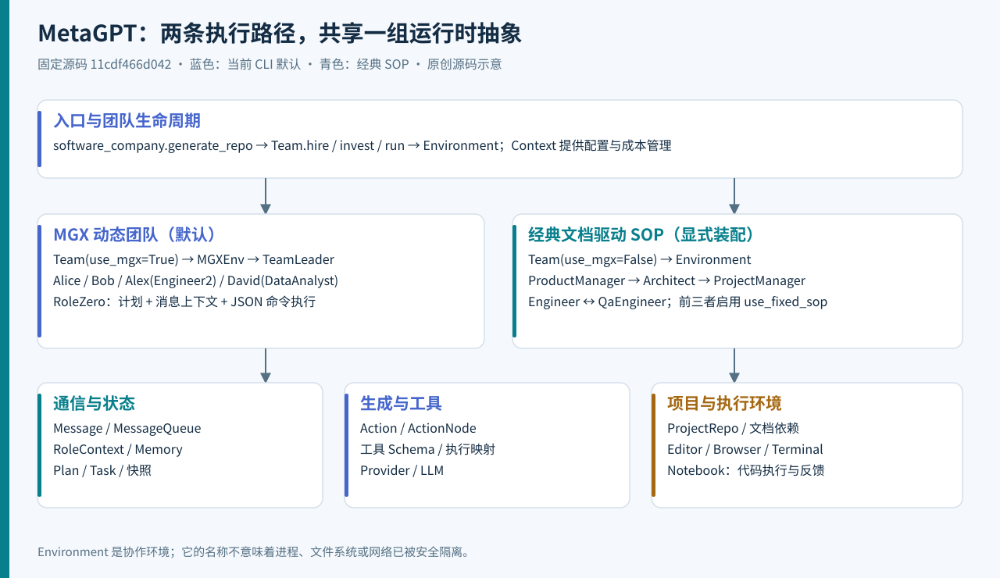
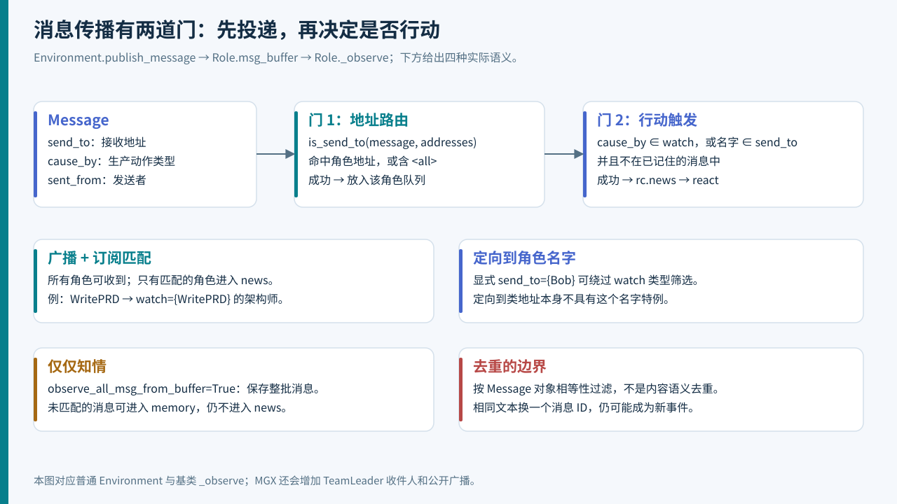
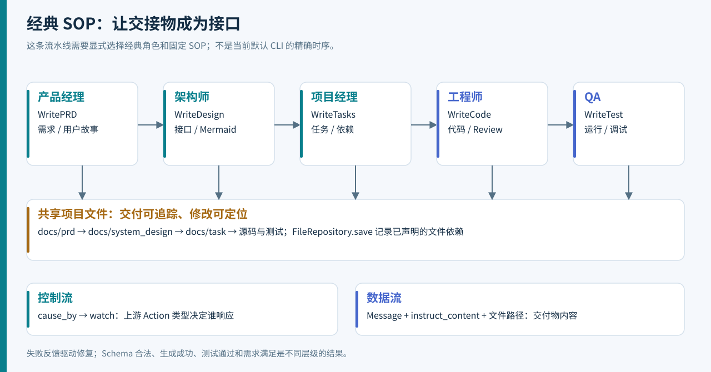
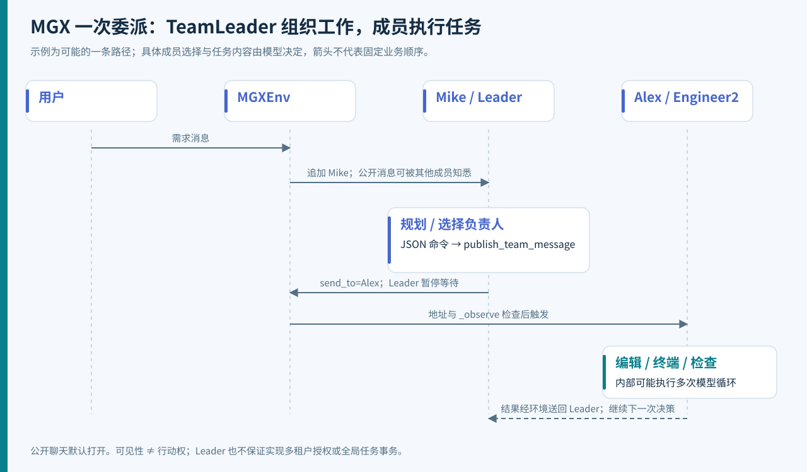
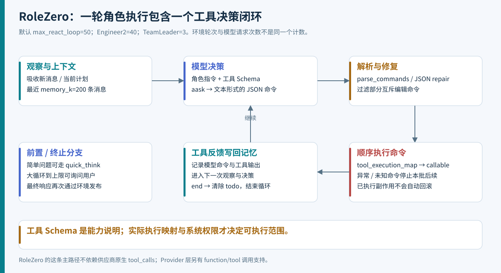
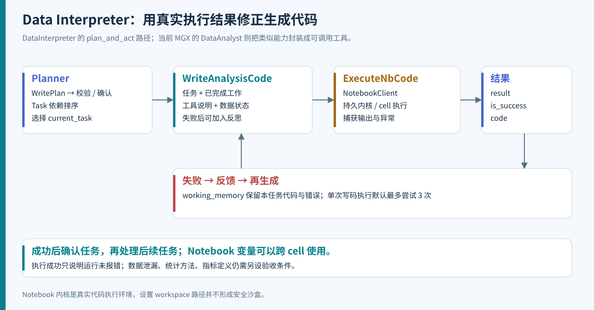
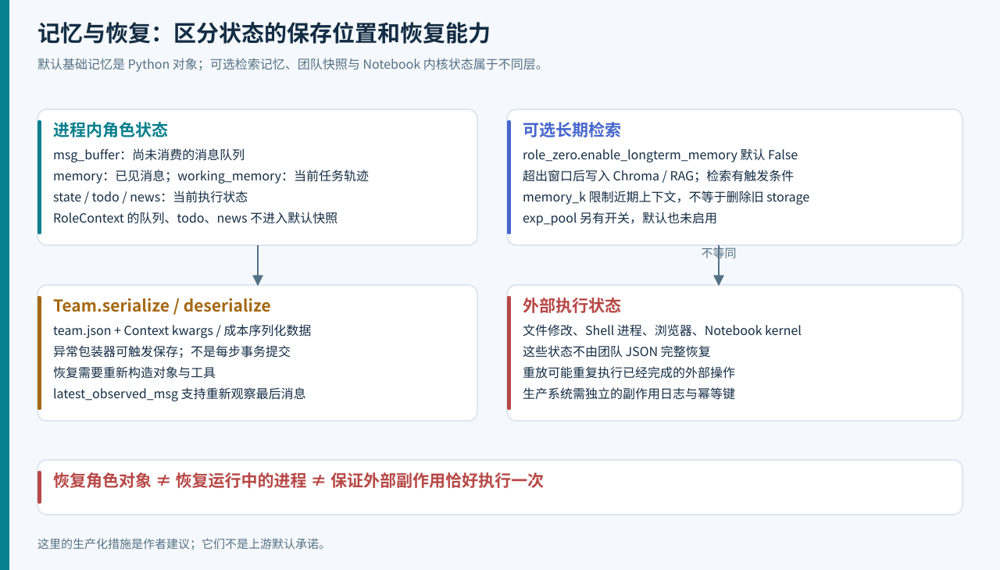

# MetaGPT 源码深读：从 SOP 软件团队到动态工具型 Agent

> 从大模型 Agent 工程师的视角，理解角色分工如何落成代码、消息如何驱动协作，以及一个“能完成任务的团队”距离可运营系统还有哪些工程环节。

[离线 HTML 阅读版](index.html) · [示例代码](examples/README.md) · [源码地图](research/source-map.md) · [验证记录](research/verification.md)

| 调研项 | 本文基线 |
| --- | --- |
| 官方仓库 | [FoundationAgents/MetaGPT](https://github.com/FoundationAgents/MetaGPT) |
| 调研日期 | 2026-09-21 |
| 固定提交 | [`11cdf466d042aece04fc6cfd13b28e1a70341b1f`](https://github.com/FoundationAgents/MetaGPT/tree/11cdf466d042aece04fc6cfd13b28e1a70341b1f)；调研时远端 `HEAD/main` 指向该提交 |
| 提交时间 | 2026-01-21 18:12:32 +08:00；提交时间与调研时间是不同概念 |
| 包声明 | `metagpt 1.0.0`，Python `>=3.9,<3.12`；不据此假定 PyPI 包与本提交完全相同 |
| 方法 | 官方论文与文档、固定源码调用链、上游测试阅读、15 项方法体隔离实验、原创离线协作示例 |
| 验证边界 | 未安装运行完整 MetaGPT，未调用收费模型，未复现论文基准；详见[验证记录](research/verification.md) |

**MetaGPT 值得研究的核心，是把“如何协作”变成可执行结构：角色职责、交付物格式、消息路由、行动策略与执行反馈。** 它把一部分流程决策写进程序，一部分交给模型，最终由运行时把结果连接起来。

但阅读当前仓库有一个前提：**经典 SOP 流水线与当前默认 MGX 团队并存。** 当前 CLI 默认由 TeamLeader 协调，成员使用 RoleZero 动态选择工具；许多教程里固定的五角色软件公司，需要显式装配。这一变化影响入口参数、消息触发、模型调用数量和产物形式。[入口实现][entry]、[Team][team]

本文将可核对的实现称为“源码事实”；从这些事实推导的代价与适用性称为“工程判断”；新增的生产化设计明确标注为“建议”。七幅图均为原创 SVG，可直接离线阅读。它们表达结构和控制流，不是性能测量。



## 阅读导航

1. [思想：把协作变成接口](#sec-1)
2. [版本辨析：当前 CLI 实际启动了什么](#sec-2)
3. [核心对象与源码地图](#sec-3)
4. [Team 与 Environment：调度到底怎么运行](#sec-4)
5. [消息机制：投递与触发是两道门](#sec-5)
6. [Role：观察、决策与行动](#sec-6)
7. [经典软件 SOP：从需求到代码](#sec-7)
8. [ActionNode：结构化生成的实现](#sec-8)
9. [MGX 与 RoleZero：动态团队的执行链](#sec-9)
10. [工具系统：Schema、推荐与执行](#sec-10)
11. [Data Interpreter：计划与代码执行反馈](#sec-11)
12. [上下文、记忆与经验池](#sec-12)
13. [文件依赖、持久化与恢复](#sec-13)
14. [模型适配、配置与成本](#sec-14)
15. [生产化评估与改进建议](#sec-15)
16. [可运行示例与复现方式](#sec-16)
17. [验证结论与源码阅读路线](#sec-17)

<a id="sec-1"></a>
## 1. 思想：把协作变成接口

### 1.1 SOP 的价值是降低交接歧义

MetaGPT 原论文提出：用标准操作流程组织多个专门角色，要求角色交付结构化中间结果，并引入代码执行反馈。软件工程场景中的典型中间结果包括需求文档、系统设计、接口和任务清单。[MetaGPT 论文，固定 v7](https://arxiv.org/html/2308.00352v7)

从工程角度，可以把这套设计理解成下面的映射：

| 团队协作概念 | 程序中的对应物 | 解决的问题 |
| --- | --- | --- |
| 职责 | Role 的 profile、goal、指令与能力集合 | 谁应该处理某类工作 |
| 工序 | Action 或动态工具命令 | 下一步具体执行什么 |
| 交接标准 | ActionNode、Pydantic 模型、文档结构 | 下游如何消费上游结果 |
| 工作通知 | Message、cause_by、send_to、watch | 谁看到结果，谁需要行动 |
| 工作现场 | Environment、项目文件、执行工具 | 协作与副作用发生在哪里 |
| 验收反馈 | 测试输出、TaskResult、审查结果 | 生成之后如何判断与修正 |

这是一种**应用层协议设计**。例如，“完成系统设计”必须落为文件列表、类接口和调用关系，工程师才可能据此实现；如果只传递“架构设计好了”，下游仍需重新推断需求。结构化交付物因此同时承担信息压缩、契约表达和责任划分的作用。

### 1.2 多角色不自动带来更高质量

以下是工程判断，而非论文保证：

- 角色拆分有利于限定上下文和专业职责，但每次交接都可能丢失约束。
- 结构化输出能验证字段存在、类型正确，却不能证明需求理解正确。
- Review 可以增加一个判断视角；真正能执行的测试提供另一类证据。
- 角色越多，协调调用、重复上下文和失败组合也越多。

因此评估一个多 Agent 系统时，应看“错误在何处被发现、由谁修复、如何终止”，而不只看有多少个角色名称。

### 1.3 论文成绩与本次调研的关系

原论文报告了特定模型、数据集和评价协议下的实验结果；本次没有复跑这些实验，也不把历史分数外推成当前提交、当前模型或任意业务需求的成功率。本文关注实现机制及其边界；若做产品选型，应以自己的任务集重新测量成功率、成本和人工修正量。[论文实验章节](https://arxiv.org/html/2308.00352v7#S4)

<a id="sec-2"></a>
## 2. 版本辨析：当前 CLI 实际启动了什么

### 2.1 从入口开始追踪，避免被类名误导

`setup.py` 将命令行 `metagpt` 指向 `metagpt.software_company:app`。调用链为：

```text
metagpt "需求"
  → Typer startup()
  → generate_repo()
  → Config.update_via_cli()
  → Context(config)
  → Team(context)                  # use_mgx 默认 True
  → hire([TeamLeader, ProductManager, Architect, Engineer2, DataAnalyst])
  → invest(investment)
  → asyncio.run(company.run(...))
```

五个成员分别是 Mike、Alice、Bob、Alex、David。这里的工程师是 `Engineer2`，数据角色是 `DataAnalyst`；不要与经典 `Engineer`、独立 `DataInterpreter` 混为一谈。[包入口][setup]、[默认团队装配][entry]

### 2.2 同一个仓库中的三种形态

| 形态 | 主要入口 / 对象 | 控制方式 | 本提交中的位置 |
| --- | --- | --- | --- |
| 经典软件团队 | 普通 Environment + 固定 SOP 角色 | Action 类型订阅、文档交接 | 实现仍在，需要显式装配 |
| MGX 动态团队 | MGXEnv + TeamLeader + RoleZero 子类 | Leader 分派，成员动态工具循环 | CLI 默认装配 |
| 数据任务 Agent | DataInterpreter | 默认 plan_and_act，Notebook 执行反馈 | 可独立调用的角色 |

当前 `ProductManager`、`Architect`、`ProjectManager` 已继承 RoleZero，固定 SOP 兼容分支受 `use_fixed_sop` 控制；RoleZero 的默认值是 `False`。恢复经典示例时，通常需要同时处理**环境选择和角色模式选择**，仅改 `Team(use_mgx=False)` 还不够。[ProductManager][pm]、[Architect][architect]、[ProjectManager][project_manager]、[RoleZero][rz]

### 2.3 CLI 参数存在兼容痕迹

`generate_repo()` 保留 `code_review`、`run_tests`、`implement` 参数，但根据这些参数聘用经典 Engineer / QaEngineer 的代码已经被注释。当前活动代码没有用这三个参数控制该团队的对应行为。

这意味着 `--run-tests` 的帮助文字不能当成“必然启动 QA 角色”的证据；`--no-implement` 也不能据此认定工程师不执行实现。Engineer2 仍可能通过工具和模型决策执行测试或 Review，那是另一条路径。[具体装配代码][entry]

还有一个接口差异：README 示例将 `generate_repo()` 的结果标为 `ProjectRepo`，本提交实际返回 `ctx.kwargs.get("project_path")`。调用方应按真实返回值处理，并允许它在未设置路径时为 `None`。[返回语句][entry]、[ProjectRepo][project_repo]

这些差异不需要猜测发布历史，直接固定提交即可复核。二次开发时，建议给自己使用的入口建立小型契约测试。

<a id="sec-3"></a>
## 3. 核心对象与源码地图

| 对象 | 责任 | 关键实现 |
| --- | --- | --- |
| Team | 团队装配、预算、外层轮次、归档与序列化 | [team.py][team] |
| Environment | 角色地址登记、消息分发、并发调用角色 | [base_env.py][env] |
| MGXEnv | Leader 路由、公开聊天、直接对话处理 | [mgx_env.py][mgx] |
| Role / RoleContext | 收件箱、记忆、观察、行动策略与当前状态 | [role.py][role] |
| RoleZero | JSON 命令决策、工具执行、计划操作与新消息吸收 | [role_zero.py][rz] |
| Action | 一个领域操作；可调用 LLM，也可调用确定性代码 | [action.py][action] |
| ActionNode | 声明输出字段、生成提示、解析与类型校验 | [action_node.py][node] |
| Message | 内容、结构化内容、发送者、接收者和事件来源 | [schema.py][schema] |
| Plan / Task / Planner | 任务依赖、当前任务、执行结果、计划更新和确认 | [schema.py][schema]、[planner.py][planner] |
| Context / ContextMixin | 配置、模型和成本管理的共享与覆盖 | [context.py][context]、[context_mixin.py][context_mixin] |
| ProjectRepo / FileRepository | 项目文件分区、读写和依赖记录 | [项目仓库][project_repo]、[文件仓库][file_repo] |

一个重要的建模区别：`Context` 主要提供配置与共享服务；`RoleContext` 保存角色运行时状态。它们都叫上下文，却不直接等于“下一次发给模型的 prompt”。真正的模型上下文要经过角色、记忆选择、工具输出处理与 Provider 格式化后才形成。

源码整体还包含 RAG、经验池、其他环境和实验扩展。本文以软件协作内核和数据执行路径为主，不把仓库中的所有研究子目录都视为当前 CLI 的一部分。完整取证文件与哈希见[源码索引](research/source-map.md)。

<a id="sec-4"></a>
## 4. Team 与 Environment：调度到底怎么运行

### 4.1 Team 管理的是外层生命周期

`Team.hire()` 把角色交给环境；`invest()` 设置成本管理器的 `max_budget`；`run_project()` 发布需求；`run()` 在预算与轮数约束下调用环境。

用等价流程说明其主要顺序：

```python
# 说明性伪代码，省略异常装饰器与日志。
if idea:
    publish_user_requirement(idea)
while remaining_rounds > 0:
    if env.is_idle:
        break
    check_recorded_cost()
    await env.run()
    remaining_rounds -= 1
archive_if_configured()
return env.history
```

空闲意味着没有需要继续处理的角色状态，并不意味着业务验收通过。轮次用尽也只是停止条件，不能直接翻译为“任务成功”。[Team.run][team]

### 4.2 Environment 使用协程并发

普通 `Environment.run()` 遍历当前非空闲角色，收集它们的 `run()` 协程，再 `await asyncio.gather(*futures)`。这是同一 Python 进程中的异步调度，适合重叠网络等待；它本身没有创建分布式 Actor、独立进程或持久化消息代理。[Environment.run][env]

一个容易遗漏的时序细节：**参与当前轮次的角色集合，在协程开始执行前就选定了。** 如果 Bob 在选定时为空闲，Alice 本轮运行过程中才向 Bob 发消息，Bob 会在下一轮被调度。反之，Bob 如果已被纳入本轮，它的观察时机又可能受协程执行顺序影响。

因此不要用“每轮恰好推进一个工序”或“每轮所有新消息都会处理完”描述这个调度器。我们的隔离实验验证了“本轮唤醒原本空闲角色，下一轮才运行”的情况。[实验脚本](research/source_probes.py)、[结果](research/probe-results.json)

### 4.3 需要区分四种计数

| 计数 | 代表什么 | 是否等于模型请求数 |
| --- | --- | --- |
| `Team.run(n_round)` | 环境调度轮数上限 | 否 |
| `Role.rc.max_react_loop` | 一次角色反应中的决策—行动循环数 | 否 |
| 命令列表长度 | 一次 RoleZero 模型决策产生的工具命令数 | 否 |
| Provider 请求与重试 | 实际模型交互次数 | 更接近，但要单独统计重试 |

一次 Engineer2 的角色执行可以经历多轮模型决策，每次决策又可能执行多个命令；语言检测、快速意图判断、JSON 修复等还可能增加模型调用。性能估算必须沿真实执行链累加。[RoleZero][rz]、[命令解析][rz_utils]

<a id="sec-5"></a>
## 5. 消息机制：投递与触发是两道门



### 5.1 Message 是控制信息与业务信息的组合

`Message` 的关键字段如下：

| 字段 | 作用 | 常见误解 |
| --- | --- | --- |
| `id` | 默认生成唯一标识 | 有 ID 不代表有持久化确认协议 |
| `content` | 文本内容 | 不是全部业务数据的唯一载体 |
| `instruct_content` | Pydantic 结构化对象 | 不是每条消息都必须具备 |
| `role` | 模型消息角色，默认 user | 不等同于 ProductManager 等业务职位 |
| `cause_by` | 产生消息的 Action 类型标签，缺省为 UserRequirement | 不是发送者名字 |
| `sent_from` | 发送方标签 | 不等于接收路由 |
| `send_to` | 接收地址集合，默认包含 `<all>` | 不单独决定收到之后是否行动 |
| `metadata` | 图片、Agent 展示信息等扩展数据 | 不保证直接进入模型输入 |

类或对象形式的 Action 标签通过 `any_to_str()` 规范化为字符串。`Message.to_dict()` 只返回 `role` 与 `content`；业务路由字段要影响模型理解，必须通过其他上下文装配方式体现。MGX 为此将发送者和接收者写入内容前缀。[Message][schema]、[标签与地址辅助函数][common]、[MGX 消息转换][mgx]

### 5.2 第一层：环境按接收地址投递

`Environment.publish_message()` 遍历 `member_addrs`，通过 `is_send_to()` 判断地址是否匹配：消息含 `<all>` 则广播，否则需要与角色地址集合有交集。成功投递调用 `role.put_message()`，进入角色私有 `MessageQueue`。

这段环境逻辑**没有按 `cause_by/watch` 过滤**。教程中“订阅发布”的说法描述整体效果；在这份源码中，类型订阅发生在后面的角色观察阶段。[环境发布][env]、[is_send_to][common]

### 5.3 第二层：角色选择需要反应的消息

基类 `_observe()` 弹出整批缓冲消息，然后按下列条件筛选 `rc.news`：

```python
# 对应源码核心谓词，变量名为说明而简化。
(message.cause_by in watch or role.name in message.send_to) \
    and message not in old_messages
```

由此得到几条实用规则：

1. 广播使角色收到消息；Action 标签匹配才会触发普通订阅者。
2. 明确发送到角色**名字**，可以触发没有订阅该 Action 的角色。
3. 发送到角色**类地址**只保证第一层投递，不自动满足第二层的名字特例。
4. `observe_all_msg_from_buffer=True` 会保存未匹配消息，让角色知悉环境，但不会因此把它们全部变成 `news`。
5. 去重依赖 Message 的相等性；相同内容使用不同 ID，仍可能被处理。

`enable_memory=False` 在这里会令 `old_messages=[]`，跳过去重检查；它并没有让整个 `_observe()` 完全停止向 Memory 写入消息。名字表达的意图与具体分支行为要分开阅读。[Role._observe][role]

### 5.4 不要把广播理解成共享一个无差别 prompt

环境保有历史，角色也有自己的 Memory；角色可能收到很多消息，但是否反应、是否记住、是否放入当前模型上下文，是三个不同的决定。这个区分可以帮助诊断：

- “角色没收到”查地址路由和收件箱。
- “收到了但没工作”查 `watch`、`send_to`、去重和 `rc.news`。
- “工作了却不知道约束”查 Memory 选择、窗口截取和 prompt 装配。

另一个本提交特有细节：`Team.run_project(idea, send_to=...)` 接收 `send_to` 参数，却只发布 `Message(content=idea)`。需要精确路由时，直接构造 Message 并调用环境发布；不要依赖这个未被使用的参数。[Team][team]、[隔离实验](research/probe-results.json)

<a id="sec-6"></a>
## 6. Role：观察、决策与行动

### 6.1 基类的一次运行

Role 的主路径可写成：

```text
run(with_message)
  → 可选：把传入参数转换为 Message，放入 msg_buffer
  → _observe()：读取、筛选、记录消息
  → 无 news：等待
  → react()：选择角色行动策略
  → _think() / _act()，或 _plan_and_act()
  → 清理 todo，发布最后结果
```

Role 同时持有静态描述与运行状态：`name/profile/goal/constraints` 用于角色提示，`actions/states` 描述可用行动，`rc` 保存执行时的消息与动作状态。`set_actions()` 还负责为 Action 注入 Context、LLM 和角色前缀。[Role][role]

### 6.2 三种行动策略的设计意图

| 模式 | 主要控制方式 | 阅读时需要注意 |
| --- | --- | --- |
| `react` | 交替 `_think → _act`，动态决定后续工作 | 基类默认循环上限为 1；RoleZero 有自己的覆盖实现 |
| `by_order` | 按已有 Action 状态推进 | 具体角色常重写 `_think`，不能只凭枚举名推断完整工作流 |
| `plan_and_act` | 先生成计划，再执行 current_task 并处理结果 | 子类必须实现 `_act_on_task` |

基类只有一个 Action 时，`_think()` 直接选它，不需要再请模型选择动作；多个 Action 才可能进入模型选择状态的分支。经典工程师和 QA 又进一步通过重写方法控制各阶段。[Role._think / react][role]

### 6.3 Action 不等于一次模型请求

Action 是领域工作单元。它可以调用 LLM、解析输出、读写多个文件、生成 Mermaid 图，甚至调用其他 Action。因此必须为 Action 定义好输入、输出和失败边界。

基类 `_act()` 会将 Action 的结果统一包装：`ActionOutput/ActionNode` 转成包含结构化内容的消息，已经是 Message 则直接使用，其余一般作为文本。结果写入角色记忆，再由 `run()` 发布。对于多个内部步骤，默认自动发布的是最后返回的结果；需要逐步对外通知时，应显式设计消息发布。[Action][action]、[Role._act][role]

<a id="sec-7"></a>
## 7. 经典软件 SOP：从需求到代码



这部分解释仍保留的经典实现，而非承诺当前 CLI 一定按此顺序执行。

### 7.1 产品经理：将需求转成可交接的 PRD

固定 SOP 分支中的 ProductManager 设置 `PrepareDocuments` 与 `WritePRD`，订阅用户需求和文档准备事件。PrepareDocuments 负责工作区、项目材料等前置处理；WritePRD 再依据需求判断新功能、更新或修复等路径。

WritePRD 使用声明式节点生成 PRD，将结构化内容保存到项目文档中。已有需求更新时，代码会判断相关 PRD，合并修订；这说明它并非每次都从空白项目生成。[产品经理][pm]、[文档准备][prepare]、[WritePRD][prd]

从工程角度，PRD 应成为需求边界：验收条件、明确约束和未决问题应留在产物中。否则模型在后续阶段补全空白时，容易把自己的选择当作用户要求。

### 7.2 架构师：将 PRD 转成模块接口

Architect 的经典配置订阅 WritePRD，执行 WriteDesign。设计节点组织实现思路、文件列表、数据结构与接口、程序调用流程等内容；实现还会把 Mermaid 类图和时序图保存为资源。

设计文档保存时声明对 PRD 文件的依赖。以后哪个 PRD 改了，至少可以追踪到与之关联的系统设计产物。[Architect][architect]、[WriteDesign][design]、[设计节点声明][design_nodes]

这里的图是模型生成的设计产物，是否准确仍需要代码或架构审查来验证。Mermaid 能渲染，不能单独证明模块关系已正确实现。

### 7.3 项目经理：任务清单成为实现上下文

ProjectManager 订阅 WriteDesign，通过 WriteTasks 形成任务清单和包依赖等信息，并将任务文档与系统设计文件关联。任务分解的价值在于让后续代码生成面对一个明确的局部问题。[ProjectManager][project_manager]、[WriteTasks][tasks]

要区分两类“依赖”：文档中的软件实现依赖、Plan 对象中的 `dependent_task_ids`。它们在代码中属于不同机制，不应都笼统叫一个全局 DAG 调度器。

### 7.4 工程师：围绕 CodingContext 生成与修订

经典 Engineer 观察 WriteTasks、WriteCode、WriteCodeReview、SummarizeCode、FixBug 等事件。它构造 CodingContext，将设计文档、任务文档和相关代码交给 WriteCode；若 `use_code_review=True`，还会调用 WriteCodeReview，再保存代码与文件依赖。

`_act_sp_with_cr()` 中使用 `for todo in self.code_todos` 顺序处理文件。字段 `n_borg` 的存在，不足以证明这里把每个文件交给一个并行工程师；判断并发必须找到实际调度语句。[Engineer][engineer]、[WriteCode][write_code]

SummarizeCode 路径会检查实现与设计、任务的关系，产生继续修改或后续交接的信号。这提供了一种对中间产物进行审查的机制，但审查结论依旧可能来自模型，不能替代运行测试。

### 7.5 QA：执行反馈构成修复闭环

QaEngineer 观察代码总结、测试生成、代码运行和调试事件。其 `_act()` 按消息来源分派到写测试、运行代码、调试错误等处理，并受测试轮数限制。

这是一条**事件驱动的反馈回路**：新代码触发测试，测试执行产生结果，结果再触发修复或继续推进。它不是无限自动修复承诺，也不保证生成测试已经覆盖全部需求。[QaEngineer][qa]、[RunCode][run_code]

实际使用时，应额外保存“在哪个代码版本上运行了哪组测试”。仅保留一条“测试已通过”的自然语言消息，无法支撑后续变更的可靠验收。

<a id="sec-8"></a>
## 8. ActionNode：结构化生成的实现

### 8.1 用字段声明组织 prompt 与输出契约

ActionNode 的主要信息包括 `key`、`expected_type`、`instruction`、`example` 和子节点。若干子节点可以组合成 PRD、系统设计、任务清单等文档的根节点。

例如以下是说明性定义，不是对完整上游节点的复制：

```python
ActionNode(
    key="Acceptance Criteria",
    expected_type=list[str],
    instruction="列出可以被自动测试验证的验收条件",
    example=["空标题返回明确错误", "完成状态可以持久保存"],
)
```

节点树在这里主要表示**输出结构与生成组织方式**，不是通用的分布式任务图。[ActionNode][node]、[PRD 节点][prd_nodes]

### 8.2 从 fill 到 Pydantic 校验

常见 JSON 路径可以展开为：

```text
fill(req, llm, schema="json")
  → 设置上下文与模型
  → compile：拼接上下文、指令、格式样例
  → llm.aask
  → 输出后处理 / JSON 或 Markdown 解析
  → create_model_class：按字段动态构造 Pydantic 模型
  → output_class(**parsed_data)
  → content + instruct_content
```

`create_model_class()` 明确检查缺失必需字段；对于不认识的字段会记录警告。通过类型构造后，调用方可以用字段名访问结构化结果，而不用让每个下游角色重新猜测文本格式。[动态模型与解析实现][node]

`simple` 策略主要一次填充当前结构；`complex` 策略遍历子节点分别填充，再合并结果。后者可能增加调用次数，但允许分解更复杂的文档生成任务。不要把函数注释中的“一次”当成底层请求绝对只有一次，因为 `_aask_v1()` 还有重试。

### 8.3 格式容错的成本与正确性边界

`_aask_v1()` 的 Tenacity 装饰器最多尝试 6 次；失败可能来自调用、解析或模型校验。Provider 层还可能有自己的重试，因此应该记录每次真实请求，而不只统计 Action 次数。[ActionNode 重试][node]、[Provider][openai_provider]

类型检查只能回答“输出是否符合声明的形状”。比如 `File list` 是合法的字符串列表，却可能列出错误文件；接口字段齐全，也可能与 PRD 相矛盾。

建议将验收分成四层：格式校验 → 文档间约束校验 → 可执行测试 → 业务验收。ActionNode 主要帮助前一层，并为后续校验提供结构化输入。

<a id="sec-9"></a>
## 9. MGX 与 RoleZero：动态团队的执行链



### 9.1 MGXEnv 在普通环境之上加入 Leader 路由

MGXEnv 继承 Environment。普通成员发布消息时，环境给收件人集合加入 TeamLeader 的名字 Mike；由 Leader 发布的消息可以按其指定收件人继续分发。Leader 的占位结束消息若发往 `no one`，会被跳过。

默认 `is_public_chat=True`，`_publish_message()` 会追加 `<all>`；同时 `move_message_info_to_content()` 将发送者和实际行动接收者写进内容前缀，帮助模型理解团队消息。

所以“消息经过 Leader”不意味着只有 Leader 能看到它，也不意味着所有成员收到广播就会执行任务。最终是否反应，仍受 `_observe()` 的谓词影响。[MGXEnv][mgx]

直接对话另有分支：用户显式指定成员时，环境记录 `direct_chat_roles` 并处理对应回复。这是聊天路由机制；它不是私有通道加密或跨租户信息隔离机制。

### 9.2 TeamLeader 把协作本身变成工具

TeamLeader 继承 RoleZero，其工具集合主要是 Plan、RoleZero 与 TeamLeader 自身。它将团队成员的名字、职责和目标加入提示，模型可以通过 `TeamLeader.publish_team_message(content, send_to)` 给具体成员布置工作。

该方法发布消息时还会 `_set_state(-1)`，让 Leader 暂停当前循环、等待后续回复。给成员的消息使用 `RunCommand` 作为来源，并明确设置接收者名字，因此可以触发名字定向的观察规则。[TeamLeader][leader]

这体现了一种分层控制：Leader 决定“交给谁”，成员决定“用什么工具完成”。它的代价是调度也可能消耗模型请求，而且下游得到的任务质量依赖 Leader 是否准确保留需求、路径和约束。

### 9.3 RoleZero 从 Action 选择转为命令生成



动态模式中的 RoleZero 把 Action 设为 RunCommand，用自定义 `_think()` 和 `_act()` 完成工具闭环：

1. 检查是否还有 todo；首次设置计划目标并检测响应语言。
2. 取经验示例、计划状态、当前任务与工具说明。
3. 从 Memory 选择近期消息，处理浏览器观察、编辑器结果和图片。
4. 构造角色 system prompt 与当前决策提示，调用 `llm.aask()`。
5. 检查重复输出，解析和必要时修复命令 JSON。
6. 依次执行命令，将结果作为后续观察写回 Memory。
7. 继续循环，直到 `end` 清除 todo、没有后续工作或达到限制。

以下是本文自拟的协议示例：

```json
[
  {"command_name": "Editor.read", "args": {"path": "/workspace/spec.md"}},
  {"command_name": "Plan.finish_current_task", "args": {}}
]
```

命令名与参数必须以实际工具 Schema 为准；这个示例用于说明命令列表结构，不是建议读完文件就将任务标为完成。[RoleZero][rz]、[命令解析与重复处理][rz_utils]

### 9.4 这条主路径是文本 JSON 协议

RoleZero 的主决策调用是 `aask()`，再从文本中解析命令，并不是要求供应商必须返回原生 `tool_calls`。Provider 里确实另有 function/tool 调用支持，但不能据此说所有 RoleZero 工具执行都走该协议。[RoleZero 决策][rz]、[OpenAI 适配器][openai_provider]

这种设计使框架能够在普通文本模型接口上工作；代价是模型有时输出不完整 JSON、错误参数或不支持的命令，需要在运行时处理。JSON 修复解决语法问题，并不自动解决参数的权限与业务合法性。

### 9.5 一次角色反应中还会继续观察

RoleZero `_react()` 每轮会再次 `_observe()`，因此运行中的成员有机会吸收新消息。简单问题可能通过 `_quick_think()` 的快速分支处理，不必完成正式的多步计划。

默认最大循环是 50，Engineer2 为 40，TeamLeader 为 3。对于较大的循环上限，耗尽后代码会询问用户是否继续；用户肯定答复可重置计数。它是交互式继续机制，不是全局绝对执行上限。[RoleZero][rz]、[Engineer2][engineer2]、[TeamLeader][leader]

自动化服务如果不具备交互输入，需要明确如何处理这类询问、截止时间与取消请求。否则看似耗尽预算的任务，可能其实停在等待人工输入。

<a id="sec-10"></a>
## 10. 工具系统：Schema、推荐与执行

### 10.1 工具注册解决“模型知道什么”

`@register_tool` 把函数或类登记到全局 ToolRegistry。注册过程收集名称、路径、说明、参数信息及标签；类工具还可通过 `include_functions` 指定公开方法。角色可以使用 `Editor:read,write` 这样的配置限制展示的方法集合。[注册表][registry]、[工具 Schema 转换][tool_convert]

登记成功并不自动意味着一个方法已经接入某个角色的执行器。RoleZero 的 `tool_execution_map` 单独把命令名映射到具体 Python callable，子类用 `_update_tool_execution()` 扩展它。[RoleZero 执行映射][rz]

| 层次 | 回答的问题 | 不能替代的能力 |
| --- | --- | --- |
| ToolRegistry / Schema | 有哪些工具，怎么描述参数 | 不等同于授权策略 |
| 工具推荐 | 当前上下文应该展示哪些工具 | 不等同于执行时拒绝其他工具 |
| `tool_execution_map` | 命令名实际调用哪个函数 | 不等同于文件和网络隔离 |
| 工具实现 | 具体如何访问浏览器、终端、文件 | 不自动限制宿主机权限 |

这四层需要分别核对。仅删掉 prompt 中的一项工具说明，并不足以作为安全控制。

### 10.2 BM25ToolRecommender 并非总会运行检索

一般工具推荐路径可以先用 BM25 召回，再让模型排序。但 `ToolRecommender.recommend_tools()` 在 `force=True` 或没有可用上下文与计划时，会直接返回已配置工具集合。

RoleZero 默认创建推荐器时使用 `force=True`，动态 `_think()` 中也调用无额外参数的推荐方法。因此不能因为类名包含 BM25，就描述成“RoleZero 每一步都从全部工具中进行语义检索”。DataInterpreter 的配置与调用方式又有所不同。[工具推荐][recommender]、[RoleZero 初始化][rz]、[DataInterpreter][di]

工程上，工具少时全部展示简单直接；工具多时可以引入分阶段披露。但能力筛选应与执行授权分离：前者控制模型上下文，后者决定哪些操作真的可以发生。

### 10.3 命令批次按顺序执行，不是事务

`_run_commands()` 对命令列表顺序遍历。普通命令根据 callable 是否为协程来 `await` 或直接调用；未知命令会记录错误并停止剩余命令；普通工具抛异常后会记录 traceback，再中断本批后续执行。

假设命令列表为“写文件 A → 执行失败的工具 → 写文件 B”，实际可能是 A 已经写入，B 未执行。没有自动回滚，也不能因为整批失败就无条件重跑所有命令。特殊命令有独立分派分支，其异常边界也不能完全等同于普通 callable 分支。[命令执行][rz]、[失败行为实验](research/probe-results.json)

### 10.4 Engineer2 扩展了软件执行能力

Engineer2 为 RoleZero 增加持久 Terminal、代码生成、CodeReview、图片获取和 Deployer 等能力。`write_new_code()` 会根据当前计划、文件描述和历史上下文请求模型生成代码，再写入文件。`_format_instruction()` 则读取终端当前目录并同步到编辑器状态。[Engineer2][engineer2]

Terminal 在本提交中用 `asyncio.create_subprocess_exec()` 启动持久 bash 或 Windows cmd，保留目录等 shell 状态，并继承进程环境。它通过输出标记判断命令结束；少量禁用命令字符串主要引导工作方式，不构成完整的命令安全策略。[Terminal][terminal]

使用这些能力时，应把生成代码视为真实程序：它访问的是实际文件、网络和进程资源。部署工具也是真实副作用，应按业务授权设置独立入口。

<a id="sec-11"></a>
## 11. Data Interpreter：计划与代码执行反馈



Data Interpreter 的研究目标是支持具有依赖关系和中间数据变化的数据科学任务。本文仅简要引入这一背景，具体机制以下述源码为准。[Data Interpreter 论文](https://arxiv.org/abs/2402.18679)

### 11.1 独立 DataInterpreter 的默认策略

`DataInterpreter` 直接继承 Role，默认 `react_mode="plan_and_act"`、`auto_run=True`、`use_reflection=False`。初始化设置 WriteAnalysisCode 和 ExecuteNbCode。

Planner 的 `update_plan()` 调用 WritePlan，检查生成计划，经过确认后更新 Plan；随后基类 `_plan_and_act()` 反复取 `current_task`，交给角色 `_act_on_task()` 执行，再处理 TaskResult。[DataInterpreter][di]、[Planner][planner]

### 11.2 Plan 描述依赖，但当前任务处理是顺序推进

Task 包含 `task_id`、`dependent_task_ids`、`instruction`、`assignee`、代码、结果以及完成和成功标记。Plan 会对任务按依赖进行排序，并维护当前未完成任务。

这里可以用依赖图描述工作关系，但基类 plan-and-act 循环每次处理的是一个 current_task；它不是把全部就绪节点自动并行调度的通用 DAG 执行平台。[Task / Plan][schema]、[Role._plan_and_act][role]

### 11.3 Notebook 保存执行状态

`ExecuteNbCode` 基于 NotebookClient，按工作区创建或连接内核，将代码作为 cell 执行。变量可以跨 cell 保留；执行结果经过处理后得到文本、图片或错误。代码生成失败时，错误会进入 working_memory，后续尝试可以利用这些反馈。

单次 `_write_and_exec_code()` 默认最多尝试 3 次；这是这层方法的局部重试上限，不代表整个任务最多只执行 3 次。Planner 的确认、重做或重新规划可能引入更多执行。[代码生成执行循环][di]、[Notebook 执行器][notebook]

`ExecuteNbCode` 的默认超时是 600 秒。DataInterpreter 的 plan-and-act 包装在正常和异常退出时都尝试终止内核。注意：把 Notebook 工作目录设为 workspace 只影响相对路径，不限制 Python 读取其他路径或访问网络。[Notebook 生命周期][notebook]、[DI 清理][di]

### 11.4 auto_run 的确认语义

Planner 在自动模式下，以 `TaskResult.is_success` 决定执行结果是否确认；人工模式可以允许用户判断是否接受，包括运行成功但业务目标错误的情况。执行成功与业务正确之间的距离，需要领域验收补齐。[Planner.ask_review][planner]

对于机器学习任务，至少应检查训练/验证划分、数据泄漏、评价指标、随机性、基线和产物可重跑性。它们属于应用层评价要求，不能从“Notebook 没报错”推导出来。

### 11.5 当前 MGX 使用的是 DataAnalyst

`DataAnalyst` 继承 RoleZero，通过 `DataAnalyst.write_and_exec_code` 工具完成类似的代码执行工作，默认 `use_reflection=True`。外层是动态命令循环，内层写码与执行最多尝试 3 次，成功后把结果更新到当前任务。[DataAnalyst][analyst]

因此应区分：DataInterpreter 是以计划执行为中心的独立角色；DataAnalyst 是 MGX 动态角色里的数据执行能力。两者共用了一些基础设施，但入口、默认策略和结束方式不同。

<a id="sec-12"></a>
## 12. 上下文、记忆与经验池



### 12.1 基础 Memory 是列表加索引

`Memory.storage` 保存消息列表，`index` 以 `cause_by` 为键聚合消息；`get(k)` 返回最近 k 条，`get_by_actions()` 根据 Action 标签检索。默认实现不是向量数据库，也不是跨进程长期日志。[Memory][memory]

RoleContext 同时有 `memory` 和 `working_memory`。后者适合当前任务的尝试代码、错误与审查反馈；Planner 确认任务后会清空工作记忆，并通过计划保存阶段结果。[RoleContext][role]、[Planner][planner]

### 12.2 上下文窗口与内存容量不是一回事

RoleZero 的 `memory_k=200` 用于选择最近消息进入决策上下文，单位是**消息条数**。200 条长文件输出可能远远大于 200 条短消息，不能当成固定 token 预算。

`parse_editor_result()` 对较早的编辑器结果保留命令摘要，以减少重复大段内容；浏览器处理则可能补入较新的页面观察。Provider 的 `compress_messages()` 另有基于消息或 token 预算的截断策略，但 `LLMConfig.compress_type` 默认 `NO_COMPRESS`。[RoleZero][rz]、[上下文处理][rz_utils]、[BaseLLM][base_llm]、[模型配置][llm_config]

从工程角度，这些策略需要保护几类信息：用户约束、当前文件版本、待完成目标、工具调用结果与对应关系。任意截断容易留下“结论还在，产生结论的前提消失”的上下文。

### 12.3 长期检索记忆是可选能力

`role_zero.enable_longterm_memory` 默认关闭。启用后，角色使用 RoleZeroLongTermMemory，按配置加载 Chroma/RAG 检索，允许可选 LLM reranker。

写入超过 `memory_k` 后，旧窗口边界处的消息被写入长期存储。读取时还要满足条件：请求 k 不为零、消息数超过阈值、最后一条消息符合用户需求或 Leader 请求等要求，才会把检索结果与近期消息组合。[长期记忆实现][long_memory]、[RoleZero 记忆配置][memory_config]

值得注意的是，写入长期存储的方法没有同时删除基础 `storage` 中的旧消息。因此这里的“长期转存”不能直接解读为 RAM 已被控制在 `memory_k` 条以内。这是阅读实际方法体后得到的容量判断。

### 12.4 经验示例、经验池和记忆是三种用途

RoleZero 可以获取经验示例，部分子类提供固定任务示例；`llm_cached_aask()` 也挂有经验缓存装饰器。但 ExperiencePool 的总开关、读开关、写开关默认均关闭。

因此“代码带有 exp_cache”不意味着每次调用都会检索、复用或持续学习经验，更不意味着模型权重在更新。记忆主要描述发生过什么，经验内容用于帮助决策，缓存又涉及响应复用；这些目的不应混为一个“长期学习”功能。[经验配置][exp_config]、[RoleZero 缓存入口][rz]、[经验装饰器][exp_decorator]

<a id="sec-13"></a>
## 13. 文件依赖、持久化与恢复

### 13.1 项目文件构成第二条信息通道

ProjectRepo 组织 PRD、系统设计、任务、代码总结、源码、测试和图表等文件区域。经典 Action 不只通过消息传递自然语言，也会保存文档，再把结构化内容或路径交给下游读取。[ProjectRepo][project_repo]

`FileRepository.save()` 写文件后，可以登记该文件的依赖。WriteDesign 记录设计依赖 PRD，WriteTasks 记录任务依赖设计，Engineer 记录代码依赖设计和任务。在增量开发时，Git 变更与这些依赖关系一起帮助决定要更新哪些产物。[FileRepository][file_repo]、[DependencyFile][dependency]、[Engineer][engineer]

这是一种声明式文件关联，不能自动保证依赖完备：如果某个隐含约束没有登记，系统就没有凭空推导完整影响范围的保证。建议给交付物附加版本和内容哈希，明确下游究竟消费了哪个版本。

### 13.2 Team 快照保存什么

`Team.serialize()` 写出 `team.json`，包含团队模型数据和 Context 序列化结果。Context 的定制序列化主要保存运行参数与成本数据；配置和运行时对象需要结合新构造的 Context 等对象恢复。[Team 序列化][team]、[Context][context]

RoleContext 明确排除了 `env`、`msg_buffer`、`todo`、`news` 等字段；Role 的 `latest_observed_msg` 则用于支持中断后的重新观察。虽然 MessageQueue 自己有 dump/load 方法，不能据此假定 Team 默认就持久化了全部待处理队列。[RoleContext][role]、[MessageQueue][schema]

这类快照能支持部分对象状态恢复，却不等于恢复当时的整个运行世界。Shell 进程、Notebook 内核中的变量、浏览器连接和已执行的外部动作，需要各自的恢复策略。

### 13.3 异常保存不是每步事务提交

`Team.run()` 外面的 `serialize_decorator` 捕获中断或异常后调用 serialize；角色异常装饰器会尝试从记忆中删除最近观察消息，让恢复时有机会再次处理它。Team 的异常包装器保存后不再次抛出原异常，调用方可能得到 `None`。[异常装饰器][common]

因此服务端封装不能把“协程没有抛到最外层”当成任务完成。应检查返回结果、最终状态、日志和业务产物。

恢复还会遇到副作用重放问题：如果文件已经写入，但完成消息还没保存，恢复后可能再次写文件或调用外部服务。源码中的快照机制没有给所有工具提供通用 exactly-once 保证。

### 13.4 建议如何补强恢复

以下均是生产化建议：

1. 为 run、task、message 和 tool invocation 建立独立 ID 与关联关系。
2. 执行工具前记录意图，执行后记录结果、退出码与产物哈希。
3. 恢复时识别“未执行、已完成、结果未知”，对未知副作用先查询。
4. 对发消息、创建工单、发布和支付等操作提供业务幂等键。
5. 对进程与 Notebook 的恢复明确选择：重建后重放、保存专门 checkpoint，或让任务重新运行。

这能把“重新调用角色”提升为可审计的任务恢复，但需要应用层和执行基础设施共同实现。

<a id="sec-14"></a>
## 14. 模型适配、配置与成本

### 14.1 配置可以按上下文、角色、Action 覆盖

Config 从仓库配置与用户 `~/.metagpt/config2.yaml` 等来源合并参数；在 `default()` 的代码中，后面的配置覆盖前面的同名数据。ContextMixin 又提供 private config、private context 和 private LLM，用于局部覆盖。

Action 支持 `llm_name_or_type`，可从 ModelsConfig 选择单独模型配置。这允许把不同工作分配给不同成本或能力级别的模型，但模型能力是否足够仍要用实际任务验证。[Config][config]、[ContextMixin][context_mixin]、[Action 模型覆盖][action]

配置覆盖与模型实例创建有缓存和初始化时机，不能随意假设改了一个全局字典，已初始化角色的模型就全部替换。建议在团队装配时固定配置，并把有效模型配置的非敏感部分记录到运行元数据。

### 14.2 BaseLLM 负责统一调用形态

BaseLLM 处理用户、系统、历史消息以及图片输入的格式化，`aask()` 装配消息后进入具体 Provider 的 `acompletion_text()`。Provider 注册表把 `LLMType` 映射到各家实现。

仓库包含 OpenAI、Azure、Anthropic、Ollama 等适配代码。这证明存在实现入口，不等于每个厂商当前全部模型、参数、图片和工具能力都已测试兼容。[BaseLLM][base_llm]、[Provider 注册表][provider_registry]、[LLMType][llm_config]

OpenAI 适配器的文本请求在该提交中对 APIConnectionError 配置最多 6 次指数退避重试，并更新 usage 成本。不要把它概括成“所有错误都会自动重试六次”；具体异常条件和接口路径需要逐项看。[OpenAI Provider][openai_provider]

### 14.3 预算是已记账成本上的轮次检查

CostManager 根据 prompt/completion token 与内置模型价格表累计费用；模型没有出现在价格表时，会警告并跳过金额增加。因此成本表是否覆盖实际模型，是预算是否有意义的前提。[CostManager][cost]

Team 在每轮环境运行前 `_check_balance()`，并没有给这一轮里每个角色的未来请求预留配额。若一轮内部执行很多模型请求，实际金额可能在轮次结束前已经越过预算。

```text
环境轮开始：账面成本低于预算 → 允许进入
    角色 A：多次模型决策 + 修复请求
    角色 B：若干模型请求
环境轮结束：累计成本可能已超预算
下一轮开始：才再次检查 Team 的预算条件
```

所以 `investment=3.0` 适合理解成外层记账约束，不能承诺美元意义上的硬上限。要做硬预算，建议在 Provider 请求前统一预留配额，完成后结算，并为并发、重试、工具支出分别计费。[Team 预算位置][team]、[成本更新][cost]

### 14.4 性能应按实际任务测量

一次任务的延迟可以近似拆为：关键路径上的模型延迟 + 工具运行时间 + 调度等待 + 重试与交接成本。并发能重叠某些独立等待，但有依赖的 PRD、设计与代码生成仍存在串行路径。

对于已知流程，固定 SOP 通常更便于给每个阶段设置输入输出检查；对于探索性任务，RoleZero 更灵活，但决策调用和执行不确定性也更高。这是基于控制方式的判断，不是本文测量出的性能排名。

<a id="sec-15"></a>
## 15. 生产化评估与改进建议

### 15.1 可以直接借鉴什么

MetaGPT 的几项设计适合提炼到自己的 Agent 系统：

- 用结构化交付物约束跨角色接口，降低重复理解成本。
- 把消息路由、角色决策和工具执行分开，便于定位责任。
- 将真实执行结果反馈给生成器，而非只靠第二次语言判断。
- 同时维护任务层结果与当前尝试轨迹，避免所有历史都堆进 prompt。
- 允许固定流程与动态执行器共存，让不同问题使用不同控制方式。

### 15.2 哪些机制需要部署层补齐

| 关注点 | 本文追踪到的机制 | 建议增加的生产控制 |
| --- | --- | --- |
| 执行隔离 | 本地 Terminal、Notebook、文件和浏览器工具 | 每任务容器或 VM、资源与网络限制、最小密钥暴露 |
| 工具授权 | 工具 Schema、角色能力配置、执行映射 | 执行时校验身份、目标路径、数据范围和副作用级别 |
| 可靠消息 | 进程内队列、角色 Memory、环境 history | 需要跨进程可靠性时引入持久日志、ACK 和重投协议 |
| 状态恢复 | 对象序列化与最近消息重观察 | 工具执行账本、幂等、外部资源重连与一致性检查 |
| 成本控制 | usage 记账、环境轮次前检查 | 请求前配额预留、并发上限、超时与取消 |
| 任务完成 | 空闲、循环上限、计划完成字段 | 与产物绑定的机器验收，区分成功、失败、待人工 |
| 可观测性 | 日志、Reporter、环境与角色历史 | 持久 trace、关联 ID、输入输出脱敏、版本追踪 |
| 并行写文件 | 共享项目文件与协程运行 | 文件所有权、分支或 worktree、冲突检测与合并门禁 |

这些建议基于所分析的路径，不是对上游所有模块的“全项目安全审计”结论。[Terminal][terminal]、[Notebook][notebook]、[环境][env]、[报告接口][report]

### 15.3 角色协作不能充当信任边界

浏览器网页、仓库文件、用户附件和工具输出，都可能把不可信内容带入模型上下文。角色分工不会自动防止某个成员将外部文本误当成操作指令。

建议在执行器而非只在 prompt 中实施边界：哪些目录可写、哪些服务可访问、哪些凭据可用、哪些操作需要人工批准，都应由确定性策略检查。公开团队消息还需要明确数据可见范围，不能通过 `send_to` 的业务语义推导安全隔离。

### 15.4 一套可执行的评估设计

不要只问“模型能不能生成一个小游戏”。更有用的是为真实业务构建分层任务集：

| 任务组 | 要测的问题 | 建议指标 |
| --- | --- | --- |
| 清晰、短需求 | 增加角色是否有收益 | 验收成功率、总成本、P50/P95 延迟 |
| 长约束、多文件需求 | 交接是否丢失约束 | 接口一致率、需求覆盖率、人工修正量 |
| 现有项目增量修改 | 是否理解依赖与回归 | 回归通过率、无关改动量、冲突数 |
| 工具失败、断网、超时 | 能否正确恢复与报告失败 | 重试次数、重复副作用、恢复成功率 |
| 数据分析任务 | 代码运行是否等于分析正确 | 泄漏检查、方法正确性、结果复现率 |
| 有敌意的工具文本 | 执行器是否遵守权限 | 越权操作拦截率、错误放行率 |

固定基础模型、提示版本和任务输入，分别运行单角色、固定 SOP 与动态团队，才能判断收益来自角色结构、工具能力还是单纯多消耗了推理预算。本文不提供未经实测的胜率或成本数字。

<a id="sec-16"></a>
## 16. 可运行示例与复现方式

本目录提供两种示例，以及一组独立的源码方法实验。它们的用途与验证级别不同。

### 16.1 零依赖教学示例：看清反馈回路

[`examples/mini_sop.py`](examples/mini_sop.py) 使用 Python 标准库实现一个小型消息协作模型：产品角色给出规范，工程角色第一版故意写错加法，QA 用真实 Python 断言发现失败，工程角色根据失败事件输出正确版本，再由 QA 验收。

它是原创教学实现，**没有导入 MetaGPT，也没有调用 LLM**。故意使用确定性生成器，让读者把注意力放在订阅、交付和反馈上。生成代码仅来自示例内部固定模板，不接收外部任意程序。

从本仓库根目录运行：

```bash
python3 project/MetaGPT/examples/mini_sop.py --output /tmp/metagpt-blog-demo
```

成功轨迹应是：

```text
01 User     → UserRequirement
02 PM       → WriteSpec
03 Engineer → WriteCode
04 QA       → TestFailed
05 Engineer → WriteCode
06 QA       → Accepted
stop=idle; accepted=True
```

输出目录包含 `spec.json`、`candidate.py` 与 `trace.json`。这里专门区分 `stop_reason` 与 `accepted`：系统安静下来并不能自行证明需求满足，必须有明确的验收事件。

与上游的区别也明确写在代码里：教学 Role 逐条处理感兴趣的消息；上游基类把整批 `news` 交给一次反应。示例只表达核心思想，不应复制为完整兼容实现。

### 16.2 真正使用 MetaGPT API 的最小团队

[`examples/metagpt_custom_team.py`](examples/metagpt_custom_team.py) 定义 Draft 和 Review 两个 Action，使用普通 Role 构造“计划编写→计划评审”的小团队。关键装配是：

```python
team = Team(context=context, use_mgx=False)
team.hire([
    Role(name="Writer", actions=[Draft], watch=[UserRequirement], context=context),
    Role(name="Reviewer", actions=[Review], watch=[Draft], context=context),
])
```

这个例子使用真实 MetaGPT API，示范自定义 Action 与订阅链。它没有采用 RoleZero，所以不需要额外设置 `use_fixed_sop`；与直接实例化当前 ProductManager 等角色的情况不同。

**本次对该文件做了语法解析和源码接口核对，未运行真实模型调用。** 运行前需要安装下述固定源码与兼容 Python，配置可用模型；执行会产生模型费用。示例中的评审是模型评审，不是应用测试。

### 16.3 安装与配置固定源码

下面是供读者复现的安装步骤，本次调研没有执行安装。版本要求来自本提交 `setup.py`，使用独立 Python 3.11 环境可落在声明支持范围内。[安装元数据][setup]

```bash
git clone https://github.com/FoundationAgents/MetaGPT.git
cd MetaGPT
git checkout 11cdf466d042aece04fc6cfd13b28e1a70341b1f
python3.11 -m venv .venv
source .venv/bin/activate
python -m pip install -e .
metagpt --init-config
```

按照自己选择的 Provider 设置 `~/.metagpt/config2.yaml`。以下只是形状示例；占位值需要替换，不能原样调用：

```yaml
llm:
  api_type: "openai"
  model: "YOUR_COMPATIBLE_MODEL"
  base_url: "YOUR_PROVIDER_BASE_URL"
  api_key: "YOUR_API_KEY"

role_zero:
  enable_longterm_memory: false
```

这里的 `openai` 表示适配器协议示例，不限定必须使用某一模型。模型与平台兼容性应按实际供应商验证；密钥不要提交到仓库。浏览器、Mermaid、Node/pnpm、检索模块等依赖按实际使用路径另行配置。[配置实现][config]、[官方配置说明](https://docs.deepwisdom.ai/main/en/guide/get_started/configuration.html)

安装完成后，可以运行本目录的自定义团队文件，或在受限的独立工作区运行默认软件团队：

```bash
metagpt "创建一个本地待办事项应用，提供自动测试与运行说明" --n-round 5 --investment 3
```

这条命令选择的是本提交的默认 MGX 路径；测试是否真正被执行，应检查工具轨迹和产物，而不是仅凭需求文本或某个旧 CLI 开关判断。

### 16.4 如何显式装配经典角色

以下代码仅用于说明配置组合，未做完整框架运行验证：

```python
team = Team(context=context, use_mgx=False)
team.hire([
    ProductManager(context=context, use_fixed_sop=True),
    Architect(context=context, use_fixed_sop=True),
    ProjectManager(context=context, use_fixed_sop=True),
    Engineer(context=context, use_code_review=True),
    QaEngineer(context=context),
])
```

随后按应用需要设置预算、发送需求并驱动团队。经典与动态类并存的提交值得额外做启动及端到端验证；此处不承诺用这几行装配代码就能在任意依赖环境、任意模型上复现早期版本行为。

<a id="sec-17"></a>
## 17. 验证结论与源码阅读路线

### 17.1 本次验证到了什么

| 项目 | 方式 | 可以得出的结论 |
| --- | --- | --- |
| 默认入口、团队与参数 | 固定提交静态追踪 | 明确本提交实际装配与活动分支 |
| 消息、调度与命令行为 | 15 项真实方法体隔离实验 | 所测方法在给定输入和外围替身下符合记录行为 |
| 反馈协作教学实现 | 独立标准库示例 | 可复现“错误代码→失败反馈→修复→验收”轨迹 |
| 自定义 MetaGPT 团队示例 | Python 语法检查、源码接口核对 | 示例与所读接口一致；不代表模型端到端成功 |
| 全框架与论文实验 | 未执行 | 不报告上游测试通过率、模型成功率或基准提升 |

隔离实验直接从指定 checkout 的 AST 提取 `_observe`、`Environment.run`、`is_send_to` 等方法体，移除装饰器并用外围替身提供对象。它没有验证完整 Pydantic 初始化、Provider、浏览器或 Notebook 集成。这样可以对关键控制流做可复现检查，又不混淆测试范围。[实验实现](research/source_probes.py)、[机器可读结果](research/probe-results.json)

### 17.2 推荐源码阅读顺序

1. `software_company.py → team.py`：确认入口、模式、成员与结束条件。
2. `environment/base_env.py → schema.py → roles/role.py`：理解地址、消息与观察。
3. `roles/product_manager.py → actions/write_prd.py → actions/action_node.py`：理解经典结构化交接。
4. `environment/mgx/mgx_env.py → roles/di/team_leader.py`：理解当前团队协调。
5. `roles/di/role_zero.py → tools/tool_registry.py → utils/role_zero_utils.py`：理解模型命令与执行器。
6. `roles/di/data_interpreter.py → strategy/planner.py → actions/di/execute_nb_code.py`：理解计划和执行反馈。
7. `memory/ → context.py → utils/common.py → provider/`：核对上下文、恢复和费用的边界。

可点击的固定提交文件锚点与 SHA-256 清单见[源码地图](research/source-map.md)；调研方法、版本差异及未覆盖项见[研究记录](research/verification.md)。

MetaGPT 提供了一份很有价值的多 Agent 工程样本：经典 SOP 把任务交接显式化，RoleZero 把成员的局部执行变得灵活，执行反馈则给生成过程接上外部证据。构建自己的系统时，最值得保留的是这些清晰的责任边界，再为实际任务补上可靠性、权限和验收。

<!-- SOURCE REFERENCES -->
[setup]: https://github.com/FoundationAgents/MetaGPT/blob/11cdf466d042aece04fc6cfd13b28e1a70341b1f/setup.py
[entry]: https://github.com/FoundationAgents/MetaGPT/blob/11cdf466d042aece04fc6cfd13b28e1a70341b1f/metagpt/software_company.py
[team]: https://github.com/FoundationAgents/MetaGPT/blob/11cdf466d042aece04fc6cfd13b28e1a70341b1f/metagpt/team.py
[env]: https://github.com/FoundationAgents/MetaGPT/blob/11cdf466d042aece04fc6cfd13b28e1a70341b1f/metagpt/environment/base_env.py
[mgx]: https://github.com/FoundationAgents/MetaGPT/blob/11cdf466d042aece04fc6cfd13b28e1a70341b1f/metagpt/environment/mgx/mgx_env.py
[role]: https://github.com/FoundationAgents/MetaGPT/blob/11cdf466d042aece04fc6cfd13b28e1a70341b1f/metagpt/roles/role.py
[schema]: https://github.com/FoundationAgents/MetaGPT/blob/11cdf466d042aece04fc6cfd13b28e1a70341b1f/metagpt/schema.py
[action]: https://github.com/FoundationAgents/MetaGPT/blob/11cdf466d042aece04fc6cfd13b28e1a70341b1f/metagpt/actions/action.py
[node]: https://github.com/FoundationAgents/MetaGPT/blob/11cdf466d042aece04fc6cfd13b28e1a70341b1f/metagpt/actions/action_node.py
[context]: https://github.com/FoundationAgents/MetaGPT/blob/11cdf466d042aece04fc6cfd13b28e1a70341b1f/metagpt/context.py
[context_mixin]: https://github.com/FoundationAgents/MetaGPT/blob/11cdf466d042aece04fc6cfd13b28e1a70341b1f/metagpt/context_mixin.py
[pm]: https://github.com/FoundationAgents/MetaGPT/blob/11cdf466d042aece04fc6cfd13b28e1a70341b1f/metagpt/roles/product_manager.py
[architect]: https://github.com/FoundationAgents/MetaGPT/blob/11cdf466d042aece04fc6cfd13b28e1a70341b1f/metagpt/roles/architect.py
[project_manager]: https://github.com/FoundationAgents/MetaGPT/blob/11cdf466d042aece04fc6cfd13b28e1a70341b1f/metagpt/roles/project_manager.py
[engineer]: https://github.com/FoundationAgents/MetaGPT/blob/11cdf466d042aece04fc6cfd13b28e1a70341b1f/metagpt/roles/engineer.py
[qa]: https://github.com/FoundationAgents/MetaGPT/blob/11cdf466d042aece04fc6cfd13b28e1a70341b1f/metagpt/roles/qa_engineer.py
[prepare]: https://github.com/FoundationAgents/MetaGPT/blob/11cdf466d042aece04fc6cfd13b28e1a70341b1f/metagpt/actions/prepare_documents.py
[prd]: https://github.com/FoundationAgents/MetaGPT/blob/11cdf466d042aece04fc6cfd13b28e1a70341b1f/metagpt/actions/write_prd.py
[prd_nodes]: https://github.com/FoundationAgents/MetaGPT/blob/11cdf466d042aece04fc6cfd13b28e1a70341b1f/metagpt/actions/write_prd_an.py
[design]: https://github.com/FoundationAgents/MetaGPT/blob/11cdf466d042aece04fc6cfd13b28e1a70341b1f/metagpt/actions/design_api.py
[design_nodes]: https://github.com/FoundationAgents/MetaGPT/blob/11cdf466d042aece04fc6cfd13b28e1a70341b1f/metagpt/actions/design_api_an.py
[tasks]: https://github.com/FoundationAgents/MetaGPT/blob/11cdf466d042aece04fc6cfd13b28e1a70341b1f/metagpt/actions/project_management.py
[write_code]: https://github.com/FoundationAgents/MetaGPT/blob/11cdf466d042aece04fc6cfd13b28e1a70341b1f/metagpt/actions/write_code.py
[run_code]: https://github.com/FoundationAgents/MetaGPT/blob/11cdf466d042aece04fc6cfd13b28e1a70341b1f/metagpt/actions/run_code.py
[rz]: https://github.com/FoundationAgents/MetaGPT/blob/11cdf466d042aece04fc6cfd13b28e1a70341b1f/metagpt/roles/di/role_zero.py
[leader]: https://github.com/FoundationAgents/MetaGPT/blob/11cdf466d042aece04fc6cfd13b28e1a70341b1f/metagpt/roles/di/team_leader.py
[engineer2]: https://github.com/FoundationAgents/MetaGPT/blob/11cdf466d042aece04fc6cfd13b28e1a70341b1f/metagpt/roles/di/engineer2.py
[analyst]: https://github.com/FoundationAgents/MetaGPT/blob/11cdf466d042aece04fc6cfd13b28e1a70341b1f/metagpt/roles/di/data_analyst.py
[di]: https://github.com/FoundationAgents/MetaGPT/blob/11cdf466d042aece04fc6cfd13b28e1a70341b1f/metagpt/roles/di/data_interpreter.py
[planner]: https://github.com/FoundationAgents/MetaGPT/blob/11cdf466d042aece04fc6cfd13b28e1a70341b1f/metagpt/strategy/planner.py
[notebook]: https://github.com/FoundationAgents/MetaGPT/blob/11cdf466d042aece04fc6cfd13b28e1a70341b1f/metagpt/actions/di/execute_nb_code.py
[registry]: https://github.com/FoundationAgents/MetaGPT/blob/11cdf466d042aece04fc6cfd13b28e1a70341b1f/metagpt/tools/tool_registry.py
[tool_convert]: https://github.com/FoundationAgents/MetaGPT/blob/11cdf466d042aece04fc6cfd13b28e1a70341b1f/metagpt/tools/tool_convert.py
[recommender]: https://github.com/FoundationAgents/MetaGPT/blob/11cdf466d042aece04fc6cfd13b28e1a70341b1f/metagpt/tools/tool_recommend.py
[terminal]: https://github.com/FoundationAgents/MetaGPT/blob/11cdf466d042aece04fc6cfd13b28e1a70341b1f/metagpt/tools/libs/terminal.py
[editor]: https://github.com/FoundationAgents/MetaGPT/blob/11cdf466d042aece04fc6cfd13b28e1a70341b1f/metagpt/tools/libs/editor.py
[rz_utils]: https://github.com/FoundationAgents/MetaGPT/blob/11cdf466d042aece04fc6cfd13b28e1a70341b1f/metagpt/utils/role_zero_utils.py
[memory]: https://github.com/FoundationAgents/MetaGPT/blob/11cdf466d042aece04fc6cfd13b28e1a70341b1f/metagpt/memory/memory.py
[long_memory]: https://github.com/FoundationAgents/MetaGPT/blob/11cdf466d042aece04fc6cfd13b28e1a70341b1f/metagpt/memory/role_zero_memory.py
[memory_config]: https://github.com/FoundationAgents/MetaGPT/blob/11cdf466d042aece04fc6cfd13b28e1a70341b1f/metagpt/configs/role_zero_config.py
[exp_config]: https://github.com/FoundationAgents/MetaGPT/blob/11cdf466d042aece04fc6cfd13b28e1a70341b1f/metagpt/configs/exp_pool_config.py
[exp_decorator]: https://github.com/FoundationAgents/MetaGPT/blob/11cdf466d042aece04fc6cfd13b28e1a70341b1f/metagpt/exp_pool/decorator.py
[project_repo]: https://github.com/FoundationAgents/MetaGPT/blob/11cdf466d042aece04fc6cfd13b28e1a70341b1f/metagpt/utils/project_repo.py
[file_repo]: https://github.com/FoundationAgents/MetaGPT/blob/11cdf466d042aece04fc6cfd13b28e1a70341b1f/metagpt/utils/file_repository.py
[dependency]: https://github.com/FoundationAgents/MetaGPT/blob/11cdf466d042aece04fc6cfd13b28e1a70341b1f/metagpt/utils/dependency_file.py
[common]: https://github.com/FoundationAgents/MetaGPT/blob/11cdf466d042aece04fc6cfd13b28e1a70341b1f/metagpt/utils/common.py
[config]: https://github.com/FoundationAgents/MetaGPT/blob/11cdf466d042aece04fc6cfd13b28e1a70341b1f/metagpt/config2.py
[llm_config]: https://github.com/FoundationAgents/MetaGPT/blob/11cdf466d042aece04fc6cfd13b28e1a70341b1f/metagpt/configs/llm_config.py
[base_llm]: https://github.com/FoundationAgents/MetaGPT/blob/11cdf466d042aece04fc6cfd13b28e1a70341b1f/metagpt/provider/base_llm.py
[provider_registry]: https://github.com/FoundationAgents/MetaGPT/blob/11cdf466d042aece04fc6cfd13b28e1a70341b1f/metagpt/provider/llm_provider_registry.py
[openai_provider]: https://github.com/FoundationAgents/MetaGPT/blob/11cdf466d042aece04fc6cfd13b28e1a70341b1f/metagpt/provider/openai_api.py
[cost]: https://github.com/FoundationAgents/MetaGPT/blob/11cdf466d042aece04fc6cfd13b28e1a70341b1f/metagpt/utils/cost_manager.py
[report]: https://github.com/FoundationAgents/MetaGPT/blob/11cdf466d042aece04fc6cfd13b28e1a70341b1f/metagpt/utils/report.py
[tests_env]: https://github.com/FoundationAgents/MetaGPT/blob/11cdf466d042aece04fc6cfd13b28e1a70341b1f/tests/metagpt/test_environment.py
[tests_team]: https://github.com/FoundationAgents/MetaGPT/blob/11cdf466d042aece04fc6cfd13b28e1a70341b1f/tests/metagpt/test_team.py
[tests_leader]: https://github.com/FoundationAgents/MetaGPT/blob/11cdf466d042aece04fc6cfd13b28e1a70341b1f/tests/metagpt/roles/di/test_team_leader.py
[tests_recovery]: https://github.com/FoundationAgents/MetaGPT/blob/11cdf466d042aece04fc6cfd13b28e1a70341b1f/tests/metagpt/serialize_deserialize/test_team.py
