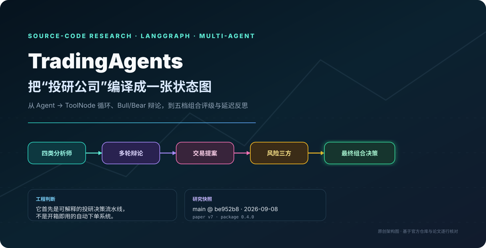
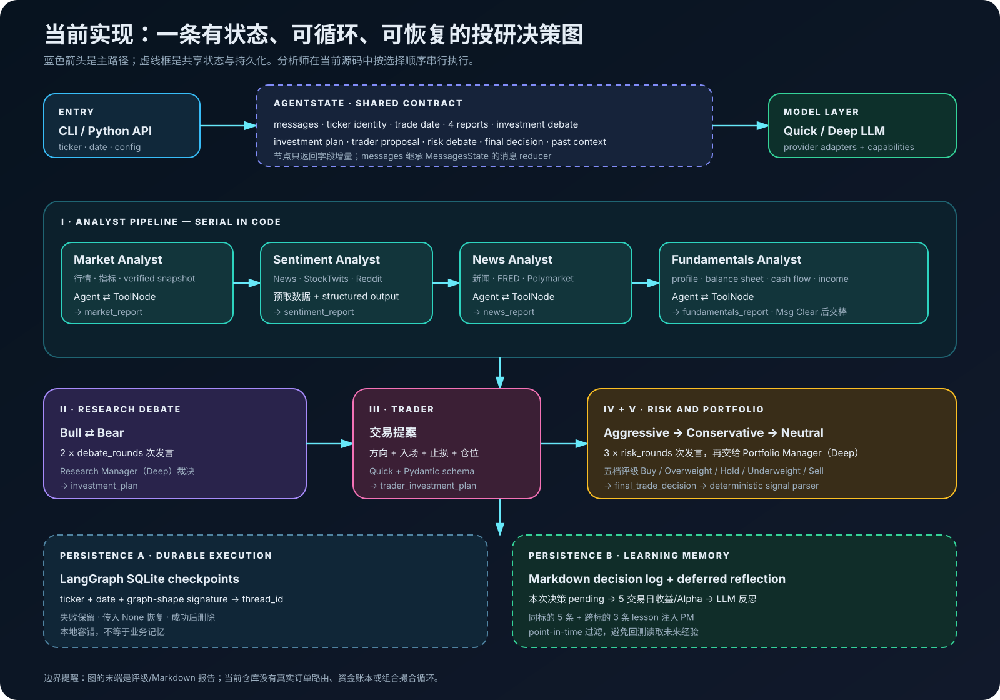
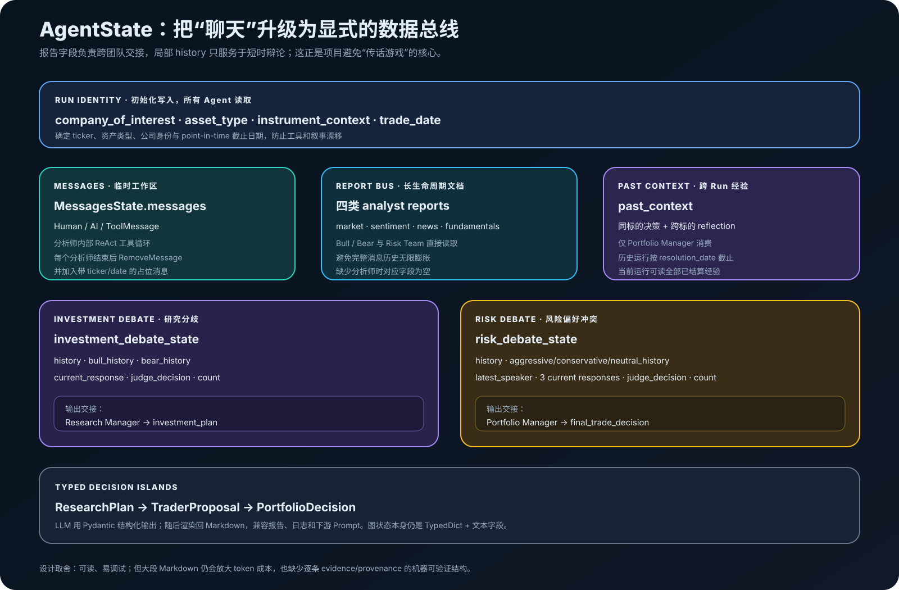
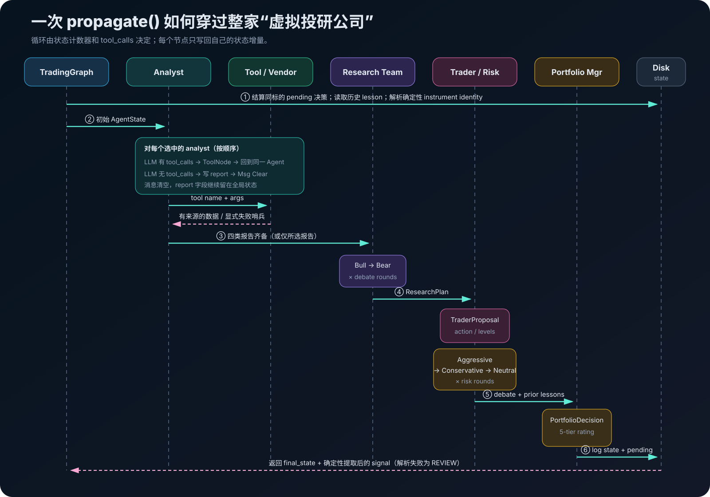
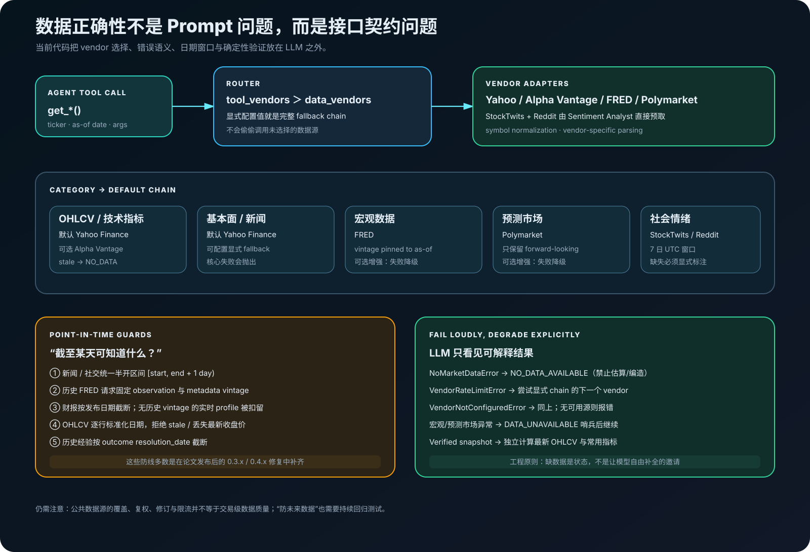
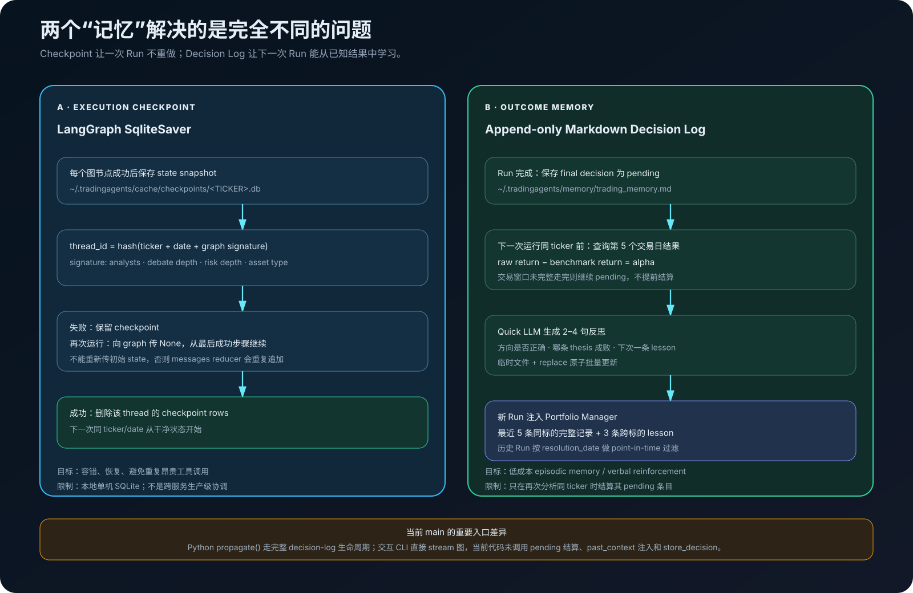
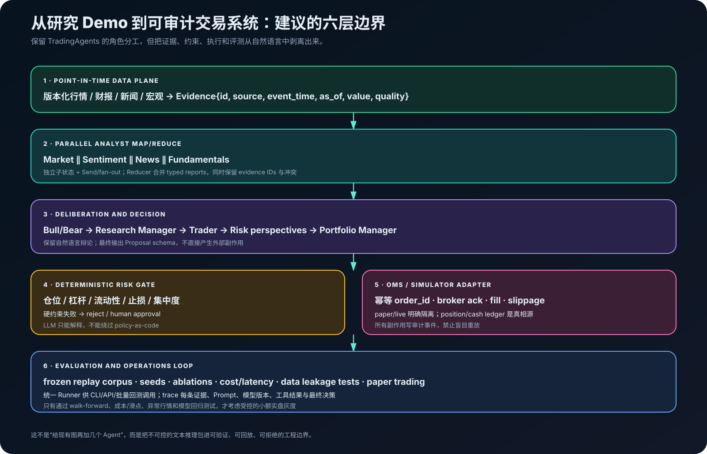

# TradingAgents 源码剖析：把“投研公司”编译成一张多智能体状态图



> **一句话结论**：TradingAgents 的工程价值，不在于“让一群 Agent 猜涨跌”，而在于把多源取证、观点对抗、风险复核和最终裁决组织成一张显式状态图。就当前开源代码而言，它首先是一个**单标的、可解释、可恢复的投研决策与报告流水线**；它会产出五档组合评级，但还不是带资金账本、确定性风控、撮合和订单路由的自动交易系统。

## 调研说明

本文从大模型 Agent 工程视角阅读官方论文、README、变更记录和关键源码，不把项目介绍页当作实现事实。

| 项目 | 本文采用的口径 |
|---|---|
| 调研日期 | 2026-09-08 |
| 源码快照 | 官方 `main` 分支 [`be952b8`](https://github.com/TauricResearch/TradingAgents/commit/be952b8eccb49720509af544c6675233bc1f10d0)，提交于 2026-09-07 |
| 发布状态 | GitHub 最新正式 tag 为 [`v0.4.0`](https://github.com/TauricResearch/TradingAgents/releases/tag/v0.4.0)；本文快照比该 tag 多 17 个提交，合入了 `v0.4.1/v0.4.2` 分支，但 [`pyproject.toml`](https://github.com/TauricResearch/TradingAgents/blob/be952b8eccb49720509af544c6675233bc1f10d0/pyproject.toml) 仍标记 `0.4.0` |
| 论文 | arXiv [`2412.20138v7`](https://arxiv.org/pdf/2412.20138)，2025-06-03 修订版 |
| 许可证 | [Apache License 2.0](https://github.com/TauricResearch/TradingAgents/blob/be952b8eccb49720509af544c6675233bc1f10d0/LICENSE) |
| 讨论范围 | 当前 Python/LangGraph 实现、数据与模型适配、状态/记忆/恢复、实验可信度和生产化路径 |

文中“论文声称”与“源码显示”会被严格分开。所有源码链接固定到上述 commit，避免 `main` 后续变化导致行文与代码对不上。

> 本文是软件架构研究，不构成投资建议。项目官方也明确声明其用途是研究，结果会受模型、温度、数据、交易时段和随机性影响，参见[官方 README](https://github.com/TauricResearch/TradingAgents/tree/be952b8eccb49720509af544c6675233bc1f10d0#tradingagents-framework)。

## 1. 它究竟解决什么问题？

金融决策有两个天然难点：信息是异构的，判断又充满冲突。价格与成交量是时间序列，财报是结构化表格，新闻和社交媒体是文本；同一份材料还可以同时支持多头与空头。把所有内容一次性塞给一个大模型，通常会遇到三个问题：

1. 上下文污染：事实、观点和历史对话混在一起，越传越失真；
2. 责任模糊：模型既查数据又做决策，错误很难定位到数据、推理还是执行；
3. 确认偏误：单一路径很容易围绕先入为主的结论组织证据。

TradingAgents 的答案是模拟投研机构的组织分工：四类分析师先形成专题报告，多空研究员再进行对抗式审议，Trader 把方向变成交易提案，三种风险偏好继续质询，最后由 Portfolio Manager 裁决。论文把这种通信设计描述为“结构化报告负责团队交接、自然语言只留给局部辩论”，目的是减轻长对话中的“传话游戏”效应。[论文第 4.1–4.2 节](https://arxiv.org/pdf/2412.20138#page=8)

这一点比“Agent 数量”更重要：**Agent 不是类名，而是角色约束、可见状态、可用工具和输出契约的组合。**

## 2. 先看全局：源码中的真实架构



入口类 [`TradingAgentsGraph`](https://github.com/TauricResearch/TradingAgents/blob/be952b8eccb49720509af544c6675233bc1f10d0/tradingagents/graph/trading_graph.py#L79-L166) 负责装配两类 LLM、工具节点、条件路由、状态初始化、反思器、信号解析器和持久化组件；[`GraphSetup.setup_graph()`](https://github.com/TauricResearch/TradingAgents/blob/be952b8eccb49720509af544c6675233bc1f10d0/tradingagents/graph/setup.py#L61-L156) 则把它们注册为 LangGraph 的节点与边。

默认图包含 12 个会调用 LLM 的角色节点：

| 阶段 | 角色 | 当前模型分配 | 核心输入 | 核心输出 |
|---|---|---|---|---|
| 分析 | Market Analyst | Quick | OHLCV、技术指标、确定性快照 | `market_report` |
| 分析 | Sentiment Analyst | Quick | 新闻、StockTwits、Reddit | `sentiment_report` |
| 分析 | News Analyst | Quick | 标的/全球新闻、FRED、Polymarket | `news_report` |
| 分析 | Fundamentals Analyst | Quick | 公司资料、三张财务报表 | `fundamentals_report` |
| 研究 | Bull / Bear Researcher | Quick | 四份报告、对方观点、辩论历史 | `investment_debate_state` |
| 研究管理 | Research Manager | **Deep** | 完整多空辩论 | `ResearchPlan` / `investment_plan` |
| 交易 | Trader | Quick | 研究计划；若有则附技术报告 | `TraderProposal` |
| 风险 | Aggressive / Conservative / Neutral | Quick | 交易提案、四份报告、风险辩论 | `risk_debate_state` |
| 组合管理 | Portfolio Manager | **Deep** | 两级计划、风险辩论、历史经验 | `PortfolioDecision` / `final_trade_decision` |

这张表揭示了两个容易被宣传图遮住的事实。

第一，当前代码将 Deep 模型只用于两个“裁决”节点，其他角色都使用 Quick 模型，见[节点工厂的实际绑定](https://github.com/TauricResearch/TradingAgents/blob/be952b8eccb49720509af544c6675233bc1f10d0/tradingagents/graph/setup.py#L75-L92)。论文第 4.3 节曾描述分析师、研究员和 Trader 使用 deep-thinking 模型，因此论文是设计与实验背景，**不能代替当前代码配置说明**。[论文第 4.3 节](https://arxiv.org/pdf/2412.20138#page=9)

第二，论文 Figure 1 写的是四类分析师“concurrently”取数，但当前图从 `START` 只连接第一个分析师，随后由每个 `Msg Clear` 节点连接下一个分析师，明确是**串行链**。[论文 Figure 1](https://arxiv.org/pdf/2412.20138#page=3)；[当前边定义](https://github.com/TauricResearch/TradingAgents/blob/be952b8eccb49720509af544c6675233bc1f10d0/tradingagents/graph/setup.py#L113-L135)

## 3. AgentState：整个系统真正的“通信总线”



LangGraph 把图抽象为 `State + Nodes + Edges`：节点读取共享状态并返回字段增量，边决定下一步执行谁；没有自定义 reducer 的字段默认覆盖，有 reducer 的字段按规则合并。[LangGraph Graph API](https://docs.langchain.com/oss/python/langgraph/graph-api)

TradingAgents 的 [`AgentState`](https://github.com/TauricResearch/TradingAgents/blob/be952b8eccb49720509af544c6675233bc1f10d0/tradingagents/agents/utils/agent_states.py#L47-L76) 继承 `MessagesState`，再增加四组业务字段：

- **运行身份**：ticker、资产类型、确定性解析后的公司/交易所身份、分析日期；
- **专题报告**：市场、情绪、新闻、基本面四个 Markdown 文本；
- **局部讨论状态**：多空辩论和风险辩论各自维护完整历史、分角色历史、最新发言、裁决与轮次计数；
- **决策交接**：研究计划、Trader 提案、最终组合决策，以及跨 Run 的历史经验。

这里有一个很实用的上下文治理技巧：每个工具型分析师完成报告后，[`create_msg_delete()`](https://github.com/TauricResearch/TradingAgents/blob/be952b8eccb49720509af544c6675233bc1f10d0/tradingagents/agents/utils/agent_utils.py#L191-L217) 使用 `RemoveMessage` 清除当前消息记录，再放入一条携带 ticker 与日期的锚定消息。于是：

- 工具原始返回不会无限堆积到下一位分析师的上下文；
- 专题结论通过独立 report 字段保留下来；
- 下一个模型不会把一个裸 `Continue` 误解成新的用户任务；
- 团队交接依赖显式文档，而不是让后续 Agent 在长聊天里“考古”。

这是一个值得迁移到其他复杂 Agent 的模式：**把 messages 当短期 scratchpad，把 typed fields 当长期工作产品。** 不过当前 report 仍是大段 Markdown，并没有拆成带来源 ID、时间戳和置信度的证据对象；可读性不错，机器验证能力仍然有限。

## 4. 一次运行到底发生了什么？



### 4.1 运行前：先固定身份、时间和经验边界

`propagate(ticker, trade_date, asset_type)` 并不是直接 `graph.invoke()`。它先做三件事：

1. 尝试结算该 ticker 以前的 pending 决策；
2. 读取截至本次分析日已经可知的历史经验；
3. 通过 yfinance 一次性解析公司名称、行业、交易所和标准化 symbol，写入 `instrument_context`。

这能阻止一个典型级联错误：技术图形让模型“联想”出错误公司，后续所有 Agent 又围绕错误身份继续论证。身份解析失败时系统选择 fail-open，仅保留 ticker，而不是在图启动前整体失败。[身份解析与上下文构造](https://github.com/TauricResearch/TradingAgents/blob/be952b8eccb49720509af544c6675233bc1f10d0/tradingagents/agents/utils/agent_utils.py#L93-L185)；[`propagate()` 生命周期](https://github.com/TauricResearch/TradingAgents/blob/be952b8eccb49720509af544c6675233bc1f10d0/tradingagents/graph/trading_graph.py#L404-L429)

### 4.2 分析师：典型的 Agent → ToolNode → Agent 循环

Market、News、Fundamentals 三个分析师采用同一种模式：

```python
workflow.add_conditional_edges(
    analyst_node,
    should_continue,
    [tool_node, clear_node],
)
workflow.add_edge(tool_node, analyst_node)
```

模型回复里有 `tool_calls`，路由就进入对应 `ToolNode`；工具结果作为 `ToolMessage` 返回同一个 Agent。直到模型不给工具调用，节点才把 `result.content` 写入专题报告并进入清理节点。[四个分析师的条件路由](https://github.com/TauricResearch/TradingAgents/blob/be952b8eccb49720509af544c6675233bc1f10d0/tradingagents/graph/conditional_logic.py#L14-L50)

Market Analyst 还有一道很有价值的硬要求：写最终报告前必须调用 `get_verified_market_snapshot`。这个工具在 LLM 外重新计算截止分析日的最新 OHLCV、11 个常用指标和近期收盘价，并要求任何精确数值以它为准；冲突必须暴露，不能让模型自行“调和”。[Market prompt](https://github.com/TauricResearch/TradingAgents/blob/be952b8eccb49720509af544c6675233bc1f10d0/tradingagents/agents/analysts/market_analyst.py)；[确定性快照实现](https://github.com/TauricResearch/TradingAgents/blob/be952b8eccb49720509af544c6675233bc1f10d0/tradingagents/dataflows/market_data_validator.py)

Sentiment Analyst 是例外。它在节点函数里先直接预取过去七天的新闻、StockTwits 与 Reddit，再用 `SentimentReport` 结构化输出；正常路径不会发出 tool call。图中保留的 `tools_social` 因此更像兼容遗留，而不是当前情绪分析的真实数据入口。[Sentiment Analyst 实现](https://github.com/TauricResearch/TradingAgents/blob/be952b8eccb49720509af544c6675233bc1f10d0/tradingagents/agents/analysts/sentiment_analyst.py#L51-L126)；[仍被注册的 social ToolNode](https://github.com/TauricResearch/TradingAgents/blob/be952b8eccb49720509af544c6675233bc1f10d0/tradingagents/graph/trading_graph.py#L225-L229)

### 4.3 Research Debate：用计数器实现有限轮对抗

图总是从 Bull 开始。每次发言将 `count + 1`，并把带角色前缀的自然语言追加到 `history`。条件路由规则是：

- `count < 2 × max_debate_rounds`：按最近发言者切换 Bull/Bear；
- 达到上限：转给 Research Manager；
- 默认 `max_debate_rounds = 1`，因此实际是 Bull 一次、Bear 一次，共两次 LLM 调用。

第一位发言者没有对手文本时，`opponent_argument_or_opening()` 会明确告诉模型“对方尚未发言，请先提出自己的论点”，避免 Prompt 要求“反驳空内容”时模型捏造对手观点。[辩论路由](https://github.com/TauricResearch/TradingAgents/blob/be952b8eccb49720509af544c6675233bc1f10d0/tradingagents/graph/conditional_logic.py#L52-L61)；[Bull 状态更新](https://github.com/TauricResearch/TradingAgents/blob/be952b8eccb49720509af544c6675233bc1f10d0/tradingagents/agents/researchers/bull_researcher.py)

Research Manager 不再调用外部工具，而是只基于辩论历史产出 `ResearchPlan`：五档建议、理由和策略动作。它被要求在证据冲突或不足时选择 Hold，不能为了“看起来果断”强行给方向。[Research Manager](https://github.com/TauricResearch/TradingAgents/blob/be952b8eccb49720509af544c6675233bc1f10d0/tradingagents/agents/managers/research_manager.py)

### 4.4 Trader：把观点变成有结构的提案

Trader 读取研究计划；如果用户选了 Market Analyst，它还会读取技术报告，用实际价格结构约束入场价、止损和仓位。`TraderProposal` 将输出限制为：

```text
action: Buy | Hold | Sell
reasoning: str
entry_price: float | null
stop_loss: float | null
position_sizing: str | null
```

价格字段会清理货币符号和千分位；若模型把 `15%` 写进绝对价格字段，校验器选择置空，而不是错误地把它解释成价格 15。[Trader schema](https://github.com/TauricResearch/TradingAgents/blob/be952b8eccb49720509af544c6675233bc1f10d0/tradingagents/agents/schemas.py#L137-L203)；[Trader prompt](https://github.com/TauricResearch/TradingAgents/blob/be952b8eccb49720509af544c6675233bc1f10d0/tradingagents/agents/trader/trader.py)

注意，“交易提案”仍然只是 Markdown 与结构化字段。代码没有创建订单，也没有检查当前持仓是否允许 Sell。

### 4.5 Risk Debate 与最终组合决策

Risk Team 按固定顺序循环：Aggressive → Conservative → Neutral。三者读同一份 Trader 提案和四份分析报告，却被赋予不同优化目标：追求高回报、保护本金、平衡两端。达到 `3 × max_risk_discuss_rounds` 次发言后，Portfolio Manager 综合以下内容：

- Research Manager 的研究计划；
- Trader 的交易提案；
- 三方风险辩论；
- 若存在，过去决策及事后反思。

最终 `PortfolioDecision` 使用 Buy / Overweight / Hold / Underweight / Sell 五档评级，并包含执行摘要、投资论点、可选目标价和时间范围。[风险路由](https://github.com/TauricResearch/TradingAgents/blob/be952b8eccb49720509af544c6675233bc1f10d0/tradingagents/graph/conditional_logic.py#L63-L75)；[Portfolio Manager](https://github.com/TauricResearch/TradingAgents/blob/be952b8eccb49720509af544c6675233bc1f10d0/tradingagents/agents/managers/portfolio_manager.py)

最后的 [`SignalProcessor`](https://github.com/TauricResearch/TradingAgents/blob/be952b8eccb49720509af544c6675233bc1f10d0/tradingagents/graph/signal_processing.py) 不再额外调用 LLM，而是确定性提取 `**Rating**:`。无法解析时返回 `REVIEW`，而不是静默伪装成可交易的 Hold。这是一个小但非常正确的安全设计：**解析失败与业务中性不是一回事。**

## 5. 结构化输出：类型安全的“小岛”，不是全链路类型化

当前代码对 Sentiment Analyst、Research Manager、Trader 和 Portfolio Manager 使用 Pydantic Schema。公共封装 [`invoke_structured_or_freetext()`](https://github.com/TauricResearch/TradingAgents/blob/be952b8eccb49720509af544c6675233bc1f10d0/tradingagents/agents/utils/structured.py) 的行为是：

1. 创建节点时尝试 `llm.with_structured_output(Schema)`；
2. 调用成功后得到 Pydantic 对象；
3. renderer 将对象重新渲染成稳定的 Markdown；
4. provider 不支持、返回空结果或校验失败时，记录 warning，并重试一次普通自由文本调用。

这样既保住了机器可读字段，又没有破坏 CLI、报告和旧解析器消费 Markdown 的方式。代价是 fallback 会失去 schema 保证；下游必须像最终 signal 一样，对自由文本失败建立显式状态，而不能只相信日志中出现过 warning。

从 Agent 工程角度看，这属于“typed decision islands”：关键裁决被类型化，但四份分析报告、辩论证据和来源仍是自由文本。下一步应该把每条事实拆成 `Evidence`，至少包含 `source_url/source_id`、`event_time`、`as_of`、`value`、`unit`、`quality` 和冲突标记。

## 6. 数据层：当前项目最值得研究的演进部分



早期金融 Agent 常把数据访问写成 Prompt 里的“请搜索最新信息”。当前 TradingAgents 已经把这部分显著工程化：工具只暴露统一函数，底层由 [`route_to_vendor()`](https://github.com/TauricResearch/TradingAgents/blob/be952b8eccb49720509af544c6675233bc1f10d0/tradingagents/dataflows/interface.py#L168-L249) 根据配置选择 vendor。

### 6.1 Vendor 路由不是“随便 fallback”

`tool_vendors` 优先于 `data_vendors`。配置 `"yfinance,alpha_vantage"` 才会按这个顺序回退；如果只写 `yfinance`，系统不会在失败后偷偷改用 Alpha Vantage。这避免同一 Run 中价格、财报和新闻来自意外数据源，导致口径不一致。

| 数据类别 | 默认 vendor | 可选/补充 | 失败策略 |
|---|---|---|---|
| OHLCV | yfinance | Alpha Vantage | 核心数据，真实异常最终抛出；无数据返回明确哨兵 |
| 技术指标 | yfinance + stockstats | Alpha Vantage | 同上 |
| 基本面 | yfinance | Alpha Vantage | 同上 |
| 新闻/内部人交易 | yfinance | Alpha Vantage | 同上 |
| 宏观指标 | FRED | — | 可选增强，失败降级为 `DATA_UNAVAILABLE` |
| 预测市场 | Polymarket | — | 可选增强，失败降级 |
| 社会情绪 | StockTwits、Reddit、ticker news | Sentiment 节点直连 | 缺失/异常以占位文本进入 Prompt |

错误分类不是按 vendor 数量扩张，而是按路由动作定义：`NoMarketDataError`、`VendorRateLimitError`、`VendorNotConfiguredError`。这种“错误语义决定控制流”的设计比捕获裸 `Exception` 后返回空字符串可靠得多。[错误层级](https://github.com/TauricResearch/TradingAgents/blob/be952b8eccb49720509af544c6675233bc1f10d0/tradingagents/dataflows/errors.py)

### 6.2 防止 look-ahead bias 是持续维护，不是一次性声明

论文称回测中每个交易日只使用当时可知数据。[论文实验设置](https://arxiv.org/pdf/2412.20138#page=10) 但当前仓库的变更历史显示，之后仍持续修复多类未来数据泄漏：Alpha Vantage 基本面日期过滤、FRED 数据 vintage、历史社交情绪、决策记忆、实时公司 profile 等。[`CHANGELOG.md` 0.3.1 与 0.4.0](https://github.com/TauricResearch/TradingAgents/blob/be952b8eccb49720509af544c6675233bc1f10d0/CHANGELOG.md)

这并不意味着项目“不可信”，而是说明金融回测的 point-in-time 正确性必须通过逐数据源回归测试来建立，不能靠一句 Prompt 或论文声明保证。当前 main 已加入这些防线：

- 新闻、Reddit、StockTwits 共用 UTC 半开时间窗；没有日期的内容仅能进入覆盖当前时点的 live 窗口；
- FRED 历史请求把 observation 和 metadata vintage 都固定到 as-of date；
- 财报按披露日期过滤；只有现值、没有历史 vintage 的公司 profile 在历史分析中直接扣留；
- OHLCV 在验证前再次按日期截断，且过期数据和缺失最新收盘价不会伪装成当前行情；
- 历史 lesson 只有在其收益结算日不晚于本次 trade date 时才能注入。

其中共享时间规则见 [`date_window.py`](https://github.com/TauricResearch/TradingAgents/blob/be952b8eccb49720509af544c6675233bc1f10d0/tradingagents/dataflows/date_window.py)，数据快照见 [`market_data_validator.py`](https://github.com/TauricResearch/TradingAgents/blob/be952b8eccb49720509af544c6675233bc1f10d0/tradingagents/dataflows/market_data_validator.py)。

## 7. 模型层：统一工厂之下仍要尊重 provider 差异

[`create_llm_client()`](https://github.com/TauricResearch/TradingAgents/blob/be952b8eccb49720509af544c6675233bc1f10d0/tradingagents/llm_clients/factory.py) 把 Anthropic、Google、Azure、Bedrock 分到原生客户端，其余 OpenAI、xAI、DeepSeek、Qwen、GLM、MiniMax、OpenRouter、Ollama、NVIDIA、Kimi、Groq、Mistral 和任意 OpenAI-compatible endpoint 通过统一注册表适配。模型目录与 CLI 选项集中在 [`model_catalog.py`](https://github.com/TauricResearch/TradingAgents/blob/be952b8eccb49720509af544c6675233bc1f10d0/tradingagents/llm_clients/model_catalog.py)。

真正棘手的不是 base URL，而是能力差异。比如某些 reasoning 模型接受 `tools` 却拒绝对象形式的 `tool_choice`，有些模型要求把上一轮 `reasoning_content` 原样带回，有些结构化输出只支持 function calling。项目将这些特征集中到 [`ModelCapabilities`](https://github.com/TauricResearch/TradingAgents/blob/be952b8eccb49720509af544c6675233bc1f10d0/tradingagents/llm_clients/capabilities.py)，避免在 Agent prompt 或客户端里散落型号判断。

全局可配置项包括温度、SDK 重试次数、输出 token 上限，以及 Google thinking level、OpenAI reasoning effort、Anthropic effort。内容标准化层会把 provider 返回的 typed content blocks 提取成普通字符串，保持下游节点契约稳定。[`normalize_content()`](https://github.com/TauricResearch/TradingAgents/blob/be952b8eccb49720509af544c6675233bc1f10d0/tradingagents/llm_clients/base_client.py#L6-L22)

这套设计体现了一个通用原则：**模型可替换不等于参数完全兼容；可替换性来自显式能力矩阵，而不是假装所有 API 一样。**

## 8. 两种持久化：恢复一次 Run，与学习下一次 Run



### 8.1 Checkpoint：解决运行中断

开启 `checkpoint_enabled` 后，图会用每 ticker 一个 SQLite 文件重新编译。`thread_id` 由 ticker、日期和图形签名散列而成；签名包含分析师集合、研究轮数、风险轮数和资产类型，因此改变图形后不会误接旧状态。[`checkpointer.py`](https://github.com/TauricResearch/TradingAgents/blob/be952b8eccb49720509af544c6675233bc1f10d0/tradingagents/graph/checkpointer.py)

恢复时必须向 LangGraph 传 `None`，让它从 thread 的最后成功 checkpoint 继续；若重新传初始 state，`messages` reducer 会把初始消息重复追加。成功结束后对应 checkpoint 被清除，失败则保留。[恢复生命周期](https://github.com/TauricResearch/TradingAgents/blob/be952b8eccb49720509af544c6675233bc1f10d0/tradingagents/graph/trading_graph.py#L431-L492) 这与 LangGraph 官方的 thread/checkpointer 语义一致。[LangGraph Persistence](https://docs.langchain.com/oss/python/langgraph/persistence)

### 8.2 Decision Log：解决事后学习

[`TradingMemoryLog`](https://github.com/TauricResearch/TradingAgents/blob/be952b8eccb49720509af544c6675233bc1f10d0/tradingagents/agents/utils/memory.py) 是一个追加式 Markdown 日志：

1. Run 完成时把最终决策写成 `pending`；
2. 下次分析同一 ticker 前，检查从决策日开始的第 5 个交易日是否已经结束；
3. 计算标的原始收益和相对区域基准的 Alpha；
4. Quick LLM 生成 2–4 句复盘：方向是否正确、哪条 thesis 成败、下次应记住什么；
5. 原子更新日志；把最近 5 条同标的完整记录和 3 条跨标的经验注入 Portfolio Manager。

非美国 ticker 会按后缀选择区域基准，例如 `.HK → ^HSI`、`.T → ^N225`、`.NS → ^NSEI`；显式 `benchmark_ticker` 可以覆盖。[默认配置](https://github.com/TauricResearch/TradingAgents/blob/be952b8eccb49720509af544c6675233bc1f10d0/tradingagents/default_config.py#L151-L175)

它不是向量数据库，而是很轻量的 episodic memory / verbal reinforcement。优点是透明、低成本、可手工审阅；限制是只有再次运行同 ticker 时才结算该 ticker 的 pending 条目，而且反思质量仍取决于模型。

### 8.3 一个当前入口不一致问题

代码审阅发现，Python API 的 [`propagate()` / `_run_graph()`](https://github.com/TauricResearch/TradingAgents/blob/be952b8eccb49720509af544c6675233bc1f10d0/tradingagents/graph/trading_graph.py#L404-L574) 会执行 pending 结算、`past_context` 注入、状态日志和 `store_decision`。但交互 CLI 的 [`run_analysis()`](https://github.com/TauricResearch/TradingAgents/blob/be952b8eccb49720509af544c6675233bc1f10d0/cli/main.py#L1004-L1299) 直接构造初始状态并 `graph.stream()`，当前路径没有调用上述 decision-log 生命周期。

因此“decision log 永远开启”对 `propagate()` 路径成立，对当前 CLI 路径并不完整。这是根据两个入口的控制流作出的源码推断，建议项目把初始化、stream/invoke、完成后副作用收敛到一个统一 Runner，避免入口继续漂移。

## 9. 输出、CLI 与最小复现

### 9.1 安装

官方包要求 Python 3.10+；当前 CI 覆盖 3.10–3.13，并运行 pytest、严格 ruff 和干净安装 smoke test。[`pyproject.toml`](https://github.com/TauricResearch/TradingAgents/blob/be952b8eccb49720509af544c6675233bc1f10d0/pyproject.toml)；[CI workflow](https://github.com/TauricResearch/TradingAgents/blob/be952b8eccb49720509af544c6675233bc1f10d0/.github/workflows/ci.yml)

```bash
git clone https://github.com/TauricResearch/TradingAgents.git
cd TradingAgents
python -m venv .venv
source .venv/bin/activate
pip install .
```

至少配置所选模型 provider 的 API key。默认数据源大多走 yfinance；需要 FRED 或 Alpha Vantage 时再增加对应 key。

```bash
export OPENAI_API_KEY="..."
export FRED_API_KEY="..."          # 可选：宏观数据
export ALPHA_VANTAGE_API_KEY="..." # 可选：显式选择该 vendor 时需要
```

### 9.2 Python API

建议使用 `deepcopy`。官方示例使用 `DEFAULT_CONFIG.copy()`，但它是浅拷贝；如果直接修改嵌套的 `data_vendors` 或 `benchmark_map`，会连带修改全局默认对象。

```python
from copy import deepcopy

from tradingagents.default_config import DEFAULT_CONFIG
from tradingagents.graph.trading_graph import TradingAgentsGraph

config = deepcopy(DEFAULT_CONFIG)
config.update({
    "llm_provider": "openai",
    "quick_think_llm": "<your-fast-model>",
    "deep_think_llm": "<your-reasoning-model>",
    "max_debate_rounds": 1,
    "max_risk_discuss_rounds": 1,
    "checkpoint_enabled": True,
    "output_language": "Chinese",
    "temperature": 0.1,
    "max_tokens": 4096,
})

graph = TradingAgentsGraph(
    selected_analysts=("market", "social", "news", "fundamentals"),
    config=config,
)

final_state, signal = graph.propagate("NVDA", "2026-08-28")
print(signal)  # Buy / Overweight / Hold / Underweight / Sell / REVIEW

report_path = graph.save_reports(final_state, "NVDA")
print(report_path)
```

### 9.3 CLI 与 Docker

```bash
tradingagents analyze --checkpoint
tradingagents analyze --clear-checkpoints

cp .env.example .env
docker compose run --rm tradingagents
```

CLI 会选择 ticker、日期、语言、分析师、研究深度、provider、Quick/Deep 模型及 provider 特定 reasoning 参数，并用 Rich 流式展示 Agent 状态、工具调用、token 统计和当前报告。报告写入五级目录：分析师、研究、交易、风险、组合管理，并额外合并成 `complete_report.md`。[报告树实现](https://github.com/TauricResearch/TradingAgents/blob/be952b8eccb49720509af544c6675233bc1f10d0/tradingagents/reporting.py)

运行成本不是固定的。默认至少包含所选分析师的最终调用、`2 × debate_rounds` 次多空发言、Research Manager、Trader、`3 × risk_rounds` 次风险发言和 Portfolio Manager；Market/News/Fundamentals 每多一轮工具调用，还会再增加一次模型往返。分析师当前串行，端到端延迟近似各节点耗时之和。

## 10. 论文实验：结果亮眼，但不能直接外推

论文在 2024-01-01 至 2024-03-29 的历史区间测试科技股，数据包括价格、新闻、社交情绪、内部人信息、财报和 60 个技术指标，并与 Buy & Hold、MACD、KDJ+RSI、ZMR、SMA 比较。[论文第 5 节](https://arxiv.org/pdf/2412.20138#page=10)

论文 Table 1 报告的三只股票结果如下；这些是**作者报告值**，本文没有将其当作当前仓库的复现实验：

| 标的 | TradingAgents 累计收益 CR | 年化收益 ARR | Sharpe | 最大回撤 MDD |
|---|---:|---:|---:|---:|
| AAPL | 26.62% | 30.50% | 8.21 | 0.91% |
| GOOGL | 24.36% | 27.58% | 6.39 | 1.69% |
| AMZN | 23.21% | 24.90% | 5.60 | 2.11% |

来源：[论文 Table 1](https://arxiv.org/pdf/2412.20138#page=11)。论文自己也在脚注中提醒：只测试了约三个月，因为每次预测需要 11 次 LLM 调用与 20+ 次工具调用；作者认为异常高的 Sharpe 来自期间回撤很少，并计划在预算允许时做更长回测。[论文结果说明](https://arxiv.org/pdf/2412.20138#page=12)

从专业回测标准看，至少还有这些证据缺口：

- 结果表只展示 AAPL、GOOGL、AMZN，样本期短且集中于美国大型科技股；
- 论文没有报告多随机种子/多次模型采样的分布或统计显著性；
- 没有组件消融，无法区分“多 Agent”“多轮辩论”“更多 token/工具调用”各自的增益；
- 文中没有清晰给出手续费、滑点、成交约束和市场冲击的统一设置；
- 基线以简单规则策略为主，没有对齐同等数据、同等推理预算的强 LLM 基线；
- 当前仓库在论文之后仍修复了多项 look-ahead 问题，所以旧实验的数据时间边界不能由当前测试套件追溯担保；
- 当前开源源码没有论文回测执行器或决策序列，无法仅凭仓库一键复现 Table 1。

因此最稳妥的结论是：论文证明了这个组织结构**值得继续研究**，没有证明它已经形成稳定、可泛化、扣除成本后可实盘的 Alpha。

## 11. 工程评价：哪些地方做得好？

### 11.1 显式图与显式状态，可定位、可恢复

角色和控制流不是隐藏在一个超级 Prompt 里。节点、边、状态字段和轮次计数器都可以单独测试；ToolNode 循环、debate 路由和结束条件清楚。LangGraph 的 checkpoint 又为昂贵长链路提供节点级容错。

### 11.2 “确定性外壳 + 概率性内核”方向正确

ticker 标准化、日期截断、stale 检查、verified snapshot、Pydantic 决策、评级解析和错误哨兵都放在 LLM 外。模型负责解释和权衡，代码负责事实边界与控制流。这比只在 Prompt 里写“不要幻觉”可靠。

### 11.3 多层审议比单 Agent 更适合暴露冲突

Bull/Bear 负责方向对抗，风险三方负责风险偏好对抗，两个 Manager 负责收敛。它不会自动保证正确，但会产生可检查的中间工件，使人能看见哪个阶段忽视了证据或被叙事带偏。

### 11.4 Provider 与数据 vendor 都具备扩展点

模型层有工厂、注册表和能力矩阵；数据层有统一工具名、类别配置、显式 vendor chain 和错误分类。新增 provider/vendor 不需要修改每个 Agent。

### 11.5 维护重点已经转向正确性

当前仓库约有 1.8 万行 Python（含 CLI 与 tests）和 500+ 个测试函数定义；测试主题覆盖 checkpoint、结构化输出、provider quirks、symbol normalization、stale data、look-ahead、point-in-time memory 和路径安全。行数不是质量证明，但变更历史显示维护者已经从“能跑”进入“时间一致性和失败语义”阶段。

## 12. 工程短板：离生产交易还差什么？

### 12.1 没有真正的交易执行与组合状态

当前主路径的终点是 `final_trade_decision` 和一个评级字符串。[`_run_graph()` 返回值](https://github.com/TauricResearch/TradingAgents/blob/be952b8eccb49720509af544c6675233bc1f10d0/tradingagents/graph/trading_graph.py#L509-L574) 源码里没有 broker client、订单生命周期、成交回报、现金/持仓账本、幂等 order ID 或交易所适配。`backtrader` 被列为依赖，但非测试 Python 源码没有导入或调用它。

这意味着 README/论文中的“发送到模拟交易所并执行”是框架愿景或实验系统描述，不是当前开源运行图已经实现的能力。若接实盘，必须另建 OMS/EMS 与强制风控层，不能把 Markdown 评级直接映射成订单。

### 12.2 风险管理仍是 Prompt 辩论，不是硬约束

Aggressive、Conservative、Neutral 都是自然语言角色。代码没有验证最大仓位、杠杆、集中度、流动性、最大日损、禁买名单或止损相对当前价是否合法。真正的风险系统需要 policy-as-code：模型可以提出和解释，但不能绕过确定性规则。

### 12.3 分析师串行导致延迟和共享消息耦合

四类分析互相没有数据依赖，却被串行连接。它简化了报告写入和 CLI 展示，却浪费了最明显的并行机会。更好的实现是给每个分析师独立输入子状态，通过 LangGraph `Send` 或多出边 fan-out 并行，再用 reducer 合并 typed reports。LangGraph 官方文档明确说明同一 super-step 的多目标节点可并行执行。[Graph API 的 edges 与 `Send`](https://docs.langchain.com/oss/python/langgraph/graph-api#send)

### 12.4 自由文本仍是主要证据载体

下游 Agent 只能读取上游生成的 Markdown，无法确定某个数字对应哪个工具响应、发布时间和原始字段。报告一旦摘要错了，后续辩论可能在错误摘要上非常认真地“达成共识”。需要将事实与叙事分离：事实以 typed evidence 存储，叙事只引用 evidence ID。

### 12.5 入口生命周期重复，已经出现行为漂移

CLI 自己负责 streaming、checkpoint、状态合并和报告落盘；Python API 由 `TradingAgentsGraph` 负责。前文提到的 decision-log 差异就是重复编排的直接结果。统一 Runner 应提供 `invoke()`、`stream()` 两种呈现方式，却共享同一 pre-run/post-run 生命周期。

### 12.6 评测闭环不足

当前 tests 擅长验证软件行为，却没有冻结的 point-in-time 研究语料、Agent 输出质量 golden set、模型版本回归、辩论消融或成本—质量 Pareto。对这种非确定系统，单元测试之外还需要：

- 固定数据快照与 source checksum；
- 多 seed、多模型、多市场制度的 walk-forward；
- 单 Agent、无辩论、无风险组、并行/串行等消融；
- 手续费、滑点、无法成交、停牌和公司行动；
- token、延迟、失败率、观点多样性和事实一致性指标；
- 先长期 paper trading，再进行有人审批的小额灰度。

## 13. 如果由我做生产化改造



优先级不会是“再增加几个 Agent”，而是收紧边界：

1. **统一 Runner**：CLI、API、批量回测共用一次 pre/post 生命周期；
2. **证据对象化**：所有报告引用可追溯的 `Evidence`，冲突和缺失是一等状态；
3. **并行分析**：四类分析师独立 fan-out，结果通过 reducer 汇总；
4. **确定性风控**：在 Proposal 与 Order 之间加入不可绕过的 exposure/liquidity/compliance gate；
5. **执行适配器**：独立 paper/live 环境、幂等订单、成交事件和 position/cash ledger；
6. **审计与评测**：保存数据版本、Prompt、模型 ID、参数、工具原始响应、结构化决策和实际成交结果。

一个生产化的最小输出契约可以是：

```python
class TradeProposal(BaseModel):
    instrument_id: str
    as_of: datetime
    action: Literal["BUY", "HOLD", "SELL"]
    target_weight: Decimal
    entry: Decimal | None
    stop: Decimal | None
    horizon: str
    evidence_ids: list[str]
    uncertainty: float

class RiskDecision(BaseModel):
    approved: bool
    adjusted_target_weight: Decimal
    violated_rules: list[str]
    human_approval_required: bool
```

LLM 生成 `TradeProposal`，确定性风控生成 `RiskDecision`，OMS 只接受 `approved=True` 且通过人机审批策略的请求。三者之间绝不能靠一行 `FINAL TRANSACTION PROPOSAL: **BUY**` 粘接。

## 14. 最终判断

TradingAgents 是一个很好的多智能体金融工程样本，因为它同时展示了三件事：

- 如何用组织分工拆解复杂决策；
- 如何用 LangGraph 把工具循环、有限辩论、状态交接和恢复机制显式化；
- 为什么金融 Agent 的难点最终会落到 point-in-time 数据、失败语义、审计和确定性风险边界，而不只是 Prompt。

它目前最适合：投研辅助原型、Agent 编排研究、结构化输出/provider 适配实验，以及人工复核下的报告生成。它不适合被描述成无需改造即可实盘的全自动交易平台。

如果只带走一个设计原则，应当是：

> **让 LLM 负责提出、反驳和解释；让代码负责事实边界、状态迁移、硬约束、恢复和副作用。**

## 主要资料

- [TradingAgents 官方仓库（固定到本文源码快照）](https://github.com/TauricResearch/TradingAgents/tree/be952b8eccb49720509af544c6675233bc1f10d0)
- [TradingAgents 论文，arXiv:2412.20138v7](https://arxiv.org/pdf/2412.20138)
- [官方 Changelog](https://github.com/TauricResearch/TradingAgents/blob/be952b8eccb49720509af544c6675233bc1f10d0/CHANGELOG.md)
- [LangGraph Graph API](https://docs.langchain.com/oss/python/langgraph/graph-api)
- [LangGraph Persistence](https://docs.langchain.com/oss/python/langgraph/persistence)

---

*本文全部架构图均为基于官方源码重新绘制的原创 SVG，可离线查看；定量结果仅转录论文 Table 1，并已在正文中标注其证据边界。*
