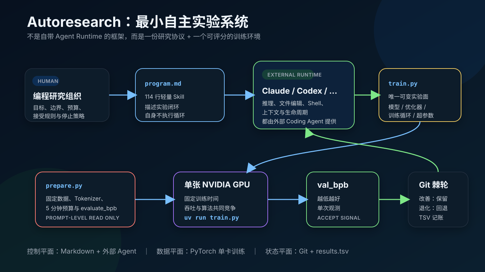
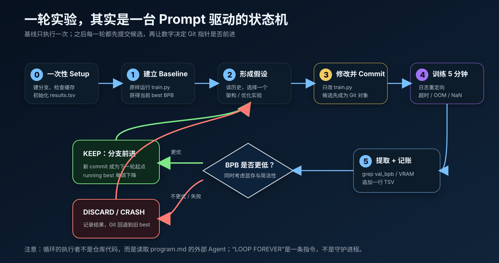
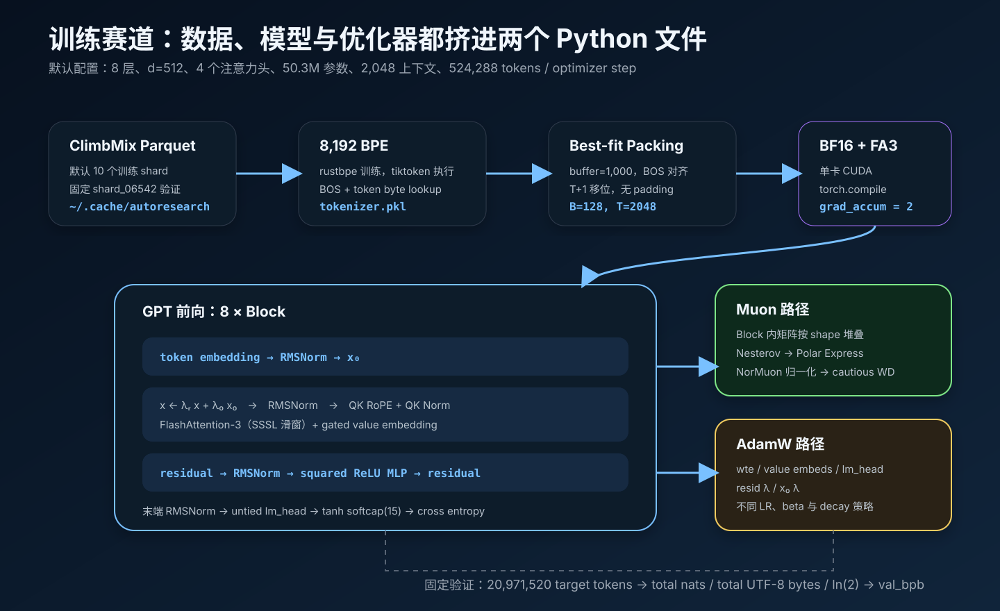
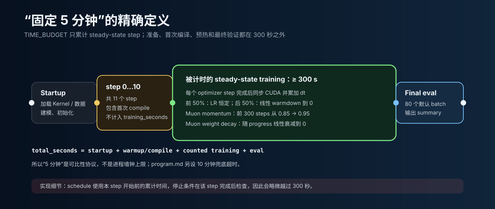
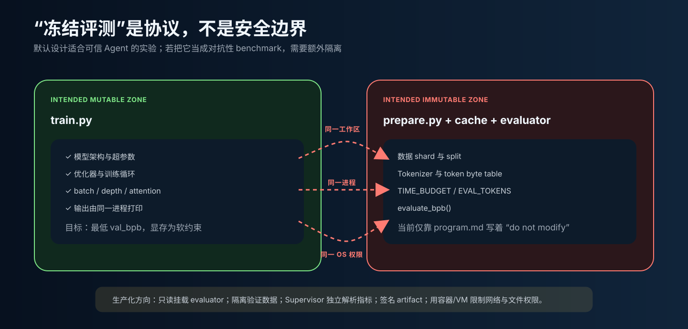
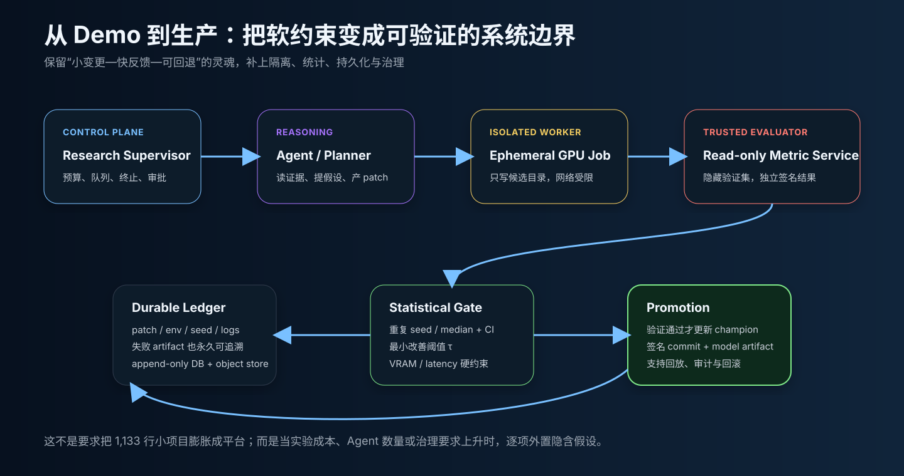

# Autoresearch 源码解剖：把大模型研究员装进一条可回退的 5 分钟实验环

> 从 `program.md`、Git 棘轮与外部 Coding Agent，到冻结的数据/评测、50.3M 参数 GPT、Muon + AdamW，以及自主实验真正缺失的治理边界。
>
> 调研日期：2026-09-09（Asia/Shanghai）  
> 源码基线：[`228791f`](https://github.com/karpathy/autoresearch/tree/228791fb499afffb54b46200aca536f79142f117)，上游 `master`，该提交日期为 2026-03-25  
> 阅读对象：熟悉 LLM 训练、Tool Calling、Coding Agent 与基本实验方法的工程师



如果只看名字，`autoresearch` 很容易让人联想到一个包含 Planner、Memory、Worker、Judge 与多 Agent 调度器的完整框架。源码给出的答案要朴素得多，也更有启发性：

**它没有实现 Agent Runtime，而是把科研活动压缩成一份 114 行的 Markdown 协议，再借用 Claude、Codex 等外部 Coding Agent 的文件、Shell、推理和上下文能力执行协议。** 仓库内部真正实现的是一个小而真实的 LLM 训练赛道：Agent 只改 `train.py`，每次训练按 300 秒 steady-state 时间计费，固定 `prepare.py` 负责数据与 `val_bpb` 评测，Git 负责保留赢家、回退输家。

这也是本文最核心的判断：**Autoresearch 的创新首先是实验系统设计，而不是新的 Agent Loop 代码。** 它把“研究什么”留给模型，把“什么算进步”交给数值，把“如何记住进步”交给 Git。

## 调研基线与结论边界

| 项目 | 本文基线 |
|---|---|
| 上游仓库 | [karpathy/autoresearch](https://github.com/karpathy/autoresearch) |
| 分支 / Commit | `master` / [`228791fb499afffb54b46200aca536f79142f117`](https://github.com/karpathy/autoresearch/tree/228791fb499afffb54b46200aca536f79142f117) |
| 快照状态 | 上游无 release tag；HEAD 提交时间 2026-03-25T17:07:37-07:00 |
| 核心代码规模 | `program.md` 114 行、`prepare.py` 389 行、`train.py` 630 行，共 1,133 行 |
| 方法 | 固定 Commit 静态源码追踪、公式与默认配置复算、Git 历史审阅、官方文档/原论文交叉验证 |
| 验证范围 | Markdown 链接与 SVG 结构检查、Python 源码语法编译；未在 H100 上下载数据或执行 5 分钟训练 |
| 不覆盖 | 第三方 fork 的实现质量、不同 Coding Agent 的效果排名、跨 GPU 实测 benchmark |

固定 Commit 很重要。该项目把大量行为直接写在 Prompt 和可变训练文件中，未来任何一句规则或一个默认超参数变化，都会改变系统语义。

## 先给结论：六个最值得记住的点

1. **Agent 在仓库外。** `program.md` 是给外部 Coding Agent 的操作规程，不是被某个 Python orchestrator 解析的 DSL。
2. **Git 是搜索状态，不只是版本控制。** 当前 branch tip 表示 champion；候选 commit 表示一次实验；reset 是拒绝动作。
3. **300 秒定义了硬件局部目标。** 被优化的是“这台 GPU 在 5 分钟内能达到的 BPB”，算法质量与吞吐一起进入目标函数。
4. **BPB 让 tokenizer 差异较可比。** 评测把 token 交叉熵换算成每个 UTF-8 byte 的 bits；但当前 Agent 又被禁止改 tokenizer，所以它主要提供稳定、清晰的标尺。
5. **所谓冻结评测只是 Prompt 约束。** `train.py`、`prepare.py`、验证数据和输出都处于同一工作区、同一 Python 进程与同一 OS 权限下，不具备对抗性防篡改能力。
6. **默认实现是单 Agent、单 GPU、单次观测的最小基线。** “自主 swarm”是愿景，不是仓库当前已经实现的 scheduler、队列或分布式系统。

## 1. 它究竟实现了什么？

上游 README 说真正重要的只有三个文件；源码也确实围绕它们形成一个非常清楚的三角关系。[项目定位与三文件说明](https://github.com/karpathy/autoresearch/blob/228791fb499afffb54b46200aca536f79142f117/README.md#L7-L25)

| 文件 | 谁修改 | 角色 | 实际内容 |
|---|---|---|---|
| `program.md` | 人 | 研究组织代码 | 初始化、可变/不可变范围、目标、实验循环、错误恢复、停止规则 |
| `train.py` | Agent | 搜索空间 | GPT、FlashAttention-3、MuonAdamW、训练循环和所有可调超参数 |
| `prepare.py` | 原则上无人 | 赛道与裁判 | 数据下载、BPE、packing、固定时间/上下文、验证集与 BPB |

再加上两个状态载体：

| 载体 | 保存什么 | 是否进入 Git |
|---|---|---|
| 实验分支 | 当前保留的 `train.py` 与赢家序列 | 是 |
| `results.tsv` | 每次尝试的 commit、BPB、显存、状态和描述 | 否，`.gitignore` 明确忽略 |

因此，Autoresearch 可以写成一个非常紧凑的系统等式：

```text
Autoresearch
= 外部 Coding Agent Runtime
+ program.md 研究策略
+ train.py 可变对象
+ prepare.py 固定赛道
+ GPU 执行器
+ val_bpb 奖励信号
+ Git / TSV 状态
```

仓库没有调用 Claude 或 OpenAI API 的代码，没有 tool schema，没有 context manager，也没有常驻循环进程。README 的运行方式就是在仓库中启动自己选择的 Claude/Codex，然后让它阅读 `program.md`。[运行 Agent 的官方说明](https://github.com/karpathy/autoresearch/blob/228791fb499afffb54b46200aca536f79142f117/README.md#L44-L53)

这一区分非常关键：模型选择、工具可靠性、权限审批、上下文长度、会话续跑和“能否一直工作”，都是宿主 Agent 的性质，不是 `autoresearch` 自己解决的问题。

## 2. 一次完整实验如何运行



### 2.1 初始化阶段

`program.md` 要求先与人确定 run tag，再从 `master` 建立 `autoresearch/<tag>` 分支，完整阅读三个核心文件，检查缓存中的数据与 tokenizer，最后初始化只有表头的 `results.tsv`。[Setup 协议](https://github.com/karpathy/autoresearch/blob/228791fb499afffb54b46200aca536f79142f117/program.md#L5-L19)

这里的设计意图有三层：

- 专用分支隔离实验谱系，当前 HEAD 同时充当“已知最优状态”。
- Agent 必须先读固定裁判与当前参赛实现，减少盲改。
- 先让人确认环境，再进入无人值守阶段，避免把依赖或数据问题误判为研究失败。

### 2.2 第一轮必须是 baseline

没有 baseline，就没有接受阈值。Prompt 明确要求第一次原样运行 `train.py`，记录当前硬件、软件与数据快照下的 `val_bpb`。[Baseline 规则](https://github.com/karpathy/autoresearch/blob/228791fb499afffb54b46200aca536f79142f117/program.md#L33-L39)

这不是礼节性步骤。因为 300 秒目标与具体 GPU 强绑定，上游 README 也明确说明：同一平台内实验可比，但不同计算平台的结果不能直接比较。[固定时间预算的取舍](https://github.com/karpathy/autoresearch/blob/228791fb499afffb54b46200aca536f79142f117/README.md#L58-L63)

### 2.3 稳态循环

下面是对 `program.md` 的等价伪代码，不是仓库里存在的 Python 函数：

```python
best = run_unmodified_baseline()

while not human_interrupted:
    parent = git_head()
    hypothesis = reason_over(train_py, results_tsv)
    edit_only("train.py", hypothesis)
    candidate = git_commit(hypothesis)

    result = run("uv run train.py", stdout="run.log", timeout=10 * MINUTE)
    append_results(candidate, result)

    if result.ok and result.val_bpb < best.val_bpb:
        best = result                # branch tip stays on candidate
    else:
        git_reset(parent)            # branch tip returns to champion
```

原始协议的真实顺序是“先 commit，再运行”，然后从日志 grep `val_bpb` 与 `peak_vram_mb`；崩溃时只看最后 50 行堆栈；最后将结果追加到 TSV，并按指标 keep 或 reset。[实验循环原文](https://github.com/karpathy/autoresearch/blob/228791fb499afffb54b46200aca536f79142f117/program.md#L90-L110)

“先提交候选”很聪明：实验开始前就给变更分配了内容地址，运行日志与结果可以引用明确 commit。但默认协议对被拒 commit 的长期保存并不牢靠——reset 后它会变成不可达对象，短期还可从 reflog 找回，最终可能被 Git GC 清理。TSV 留下 SHA，不等于永久保留了失败 patch。

### 2.4 接受规则其实是一个带软约束的多目标函数

表面目标只有一个：

```text
minimize val_bpb
```

但 Prompt 同时要求 VRAM 不要大幅膨胀，并加入“效果相同时更简单”的人工式判断：增加丑陋复杂度换极小改善未必值得，删代码而不退化则值得保留。[目标、显存与简洁性规则](https://github.com/karpathy/autoresearch/blob/228791fb499afffb54b46200aca536f79142f117/program.md#L33-L37)

所以默认 Judge 并非纯机械比较器，而是：

```text
accept = BPB 明显改善
      AND VRAM 增幅可接受
      AND 复杂度成本与收益相称
```

后两项没有阈值，最终由 LLM 自己裁量。这让基线保持简洁，也意味着两个 Agent 可能对同一结果作出不同决定。

## 3. `program.md`：114 行 Markdown 为什么足以成为“研究内核”

README 称它为一个“super lightweight skill”。这个说法非常准确：它没有引入新语法，而是把通用 Coding Agent 已经拥有的能力编排成一个领域工作流。

| 协议槽位 | `program.md` 中的实现 | Agent 工程含义 |
|---|---|---|
| 身份与目标 | 自主研究者，降低 `val_bpb` | 角色 + reward |
| 工作空间 | 专用 Git branch | 状态隔离 |
| 作用域 | 只改 `train.py` | action space |
| 不变量 | 不改 `prepare.py`、不加依赖、不改 evaluator | policy |
| 预算 | 每次 300 秒，10 分钟兜底 | cost bound |
| 观测 | `run.log` 中的 BPB、VRAM、traceback | observation |
| 记忆 | branch、`results.tsv`、源码 | episodic state |
| 接受策略 | keep / discard / crash | transition rule |
| 故障策略 | 简单 bug 修复重跑，根本失败则跳过 | recovery policy |
| 生命周期 | 人工中断前持续循环 | termination policy |

这是 Context Engineering 的一个很干净的案例：不是让模型自由“做研究”，而是给它一个封闭动作面、廉价反馈、明确状态转移与可撤销副作用。

不过，`NEVER STOP` 仍然只是自然语言。仓库没有 heartbeat、scheduler、session resume 或 watchdog。Karpathy 自己在 issue #57 中记录了 Codex 会结束而非无限循环的问题，社区方案也需要外部 while/resume 或生命周期 hook；这直接证明持续自治属于宿主 Runtime，而不是 Prompt 能单方面保证的能力。[作者提交的 Codex 生命周期问题](https://github.com/karpathy/autoresearch/issues/57)

## 4. `prepare.py`：如何冻结一条可比较的训练赛道

`prepare.py` 同时是一次性数据准备程序和运行时库。`train.py` 从它导入 `MAX_SEQ_LEN`、`TIME_BUDGET`、Tokenizer、dataloader 和 `evaluate_bpb`。[固定常量与数据配置](https://github.com/karpathy/autoresearch/blob/228791fb499afffb54b46200aca536f79142f117/prepare.py#L25-L51)

### 4.1 数据与 tokenizer

默认设置是：

| 项目 | 默认值 | 作用 |
|---|---:|---|
| 数据 | `karpathy/climbmix-400b-shuffle` | Parquet 文本 shard |
| 训练 shard | 前 10 个 | `prepare.py` 默认下载数量 |
| 验证 shard | `shard_06542.parquet` | 永久从训练列表排除 |
| 上下文 | 2,048 tokens | 训练与评估固定 |
| 训练计时 | 300 秒 | steady-state 预算 |
| 评估预算 | 20,971,520 target tokens | `40 × 524,288` |
| tokenizer | 8,192 vocab | 8,188 BPE 项 + 4 个 reserved token |
| tokenizer 语料上限 | 10 亿字符 | 单文档最多取 10,000 字符 |

下载器用 8 个 worker，并为每个 shard 最多尝试 5 次；临时文件成功后才 rename。但它不校验仓库公开的 SHA256，也不保存一份本地数据 manifest。[下载与重试实现](https://github.com/karpathy/autoresearch/blob/228791fb499afffb54b46200aca536f79142f117/prepare.py#L57-L113) 数据本身来自 [ClimbMix-400B Shuffle 数据仓库](https://huggingface.co/datasets/karpathy/climbmix-400b-shuffle)。

Tokenizer 训练由 `rustbpe` 完成，再转换为 `tiktoken.Encoding` 并 pickle；另行生成 `token_bytes.pt`，记录每个 token 解码后的 UTF-8 byte 数，供 BPB 使用。[Tokenizer 训练与 byte lookup](https://github.com/karpathy/autoresearch/blob/228791fb499afffb54b46200aca536f79142f117/prepare.py#L125-L203)

一个复现细节是：只要 `tokenizer.pkl` 和 `token_bytes.pt` 已存在，脚本就直接复用，不会验证它们是否由当前 shard、split pattern 或 vocab 配置生成。严肃实验应把数据 manifest 与 tokenizer hash 一起写入每次 run metadata。

### 4.2 BOS-aligned best-fit packing

数据加载器不是对单篇文档简单截断。它维护最多约 1,000 篇 tokenized 文档的 buffer，为每一行反复寻找“能放进剩余空间的最长文档”；若没有文档完整放得下，就裁剪最短文档填满余量。每行长度为 `T+1`，再错一位切成 input 与 target。[Packing 实现](https://github.com/karpathy/autoresearch/blob/228791fb499afffb54b46200aca536f79142f117/prepare.py#L254-L341)

这带来四个性质：

- 每个完整文档前都有 BOS，模型能看见文档边界。
- batch 没有 padding，GPU token 利用率为 100%。
- 被裁剪文档的剩余部分不会续接，计算利用率与语料利用率不是同一件事。
- Parquet 与 row group 按排序后的固定顺序循环，没有随机 shuffle；每次进程都从相同数据前缀出发。

CPU row buffer、pinned memory 和 GPU buffer都被预分配并复用。训练循环中的 `next(train_loader)` 也被计入 step 时间，因此 300 秒目标实际在优化模型计算、Kernel、数据 packing 与主机到设备拷贝的组合吞吐。

### 4.3 `val_bpb` 到底怎么算

固定评测返回：

```text
val_bpb = Σ 有效 target 的 cross_entropy_nats
          ───────────────────────────────────
          ln(2) × Σ target 对应的 UTF-8 byte 数
```

special token 的 byte 数被设为 0，并通过 mask 从分子、分母同时排除。默认 batch 为 128、序列长 2,048，所以评估正好执行 80 个 batch：

```text
20,971,520 / (128 × 2,048) = 80
```

源码不是先算“每 token loss”再做近似换算，而是逐 token 取无归约交叉熵，累加总 nats 与总 bytes，最后统一除以 `ln(2)`。[`evaluate_bpb` 实现](https://github.com/karpathy/autoresearch/blob/228791fb499afffb54b46200aca536f79142f117/prepare.py#L343-L365)

BPB 的价值在于把不同 token 长度拉回 byte 尺度，比 token-level perplexity 更不依赖词表切分。不过当前协议禁止修改 `prepare.py` 与依赖，tokenizer 实际上固定；这里更重要的价值是指标口径透明、验证集固定且足够快。

## 5. `train.py`：默认参赛模型的完整拆解



### 5.1 默认形状与精确参数量

模型宽度由深度派生：先算 `depth × 64`，再向上取到 128 的整数倍；head dimension 固定 128。默认 `DEPTH=8`，因此：

| 配置 | 默认值 |
|---|---:|
| layer | 8 |
| model dimension | 512 |
| query heads | 4 |
| key/value heads | 4（默认没有 GQA） |
| MLP hidden | 2,048 |
| context | 2,048 |
| vocab | 8,192 |
| attention window pattern | `SSSL`，最后一层强制 full |
| device batch | 128 sequences |
| optimizer batch | 524,288 tokens |
| gradient accumulation | 2 |

相关常量、形状派生与 batch 约束位于 [`train.py` 超参数和 setup](https://github.com/karpathy/autoresearch/blob/228791fb499afffb54b46200aca536f79142f117/train.py#L428-L514)。

按源码逐项复算，默认参数是 50,332,176：

| 参数组 | 参数量 |
|---|---:|
| token embedding | 4,194,304 |
| 4 个 value embedding table | 16,777,216 |
| untied LM head | 4,194,304 |
| 8 个 Transformer block（含 gate） | 25,166,336 |
| 16 个 residual scalar | 16 |
| 合计 | **50,332,176（50.3M）** |

这与 `program.md` 给出的示例 summary 一致，但该 summary 只是格式示例，不应被当成本机实测结果。[示例输出](https://github.com/karpathy/autoresearch/blob/228791fb499afffb54b46200aca536f79142f117/program.md#L41-L58)

### 5.2 一个 Block 里发生什么

默认前向可以压缩成：

```text
token ids
  → token embedding → RMSNorm → 保存为 x₀
  → [x ← λᵣ·x + λ₀·x₀
     → Attention(RMSNorm(x)) → residual add
     → squared-ReLU MLP(RMSNorm(x)) → residual add] × 8
  → RMSNorm → untied LM head → tanh softcap(15) → cross entropy
```

它不是教科书式 GPT-2，而是吸收了 nanochat / speedrun 训练中的一组现代技巧：

- 所有 Norm 都是无可学习参数的 RMSNorm。
- Q/K 应用 RoPE 后再次做 RMSNorm。
- MLP 激活是 `ReLU(x)^2`，没有 bias。
- input embedding 与 output head 不共享权重。
- 每层进入 block 前，用两个可学习 scalar 混合当前 residual 与最初的 `x₀`。
- logits 用 15 为上限做 tanh softcap，抑制极端值。

完整模型与前向见 [`GPT` 实现](https://github.com/karpathy/autoresearch/blob/228791fb499afffb54b46200aca536f79142f117/train.py#L124-L291)。

### 5.3 Sliding window 与 Value Embedding

`SSSL` 表示三层半上下文窗口、一层全上下文窗口，循环铺到全部 layer；最后一层无论 pattern 如何都被强制设为全上下文。默认 8 层实际是：

```text
layer:   0     1     2     3     4     5     6     7
window: 1024  1024  1024  2048  1024  1024  1024  2048
```

注意力 Kernel 由 GPU capability 选择：compute capability `(9, 0)` 使用 `varunneal/flash-attention-3`，其他 CUDA GPU 使用 `kernels-community/flash-attn3`。[FA3 加载和选择](https://github.com/karpathy/autoresearch/blob/228791fb499afffb54b46200aca536f79142f117/train.py#L17-L27)

每隔一层还会添加独立的 value embedding。默认偶数深度 8 使 layer 1、3、5、7 启用该能力：token id 从每层自己的 embedding table 得到 `ve`，再由当前隐藏状态前 32 个 channel 产生 per-KV-head gate，经过 `2 × sigmoid` 后加到普通 V 上。[Attention 与 gated value embedding](https://github.com/karpathy/autoresearch/blob/228791fb499afffb54b46200aca536f79142f117/train.py#L47-L96)

代码注释把它归到 ResFormer/value residual 思路，但这里并不是原论文“把第一层 V 连接到后续层”的逐字实现，而是每个选定层拥有独立 token-value table 与输入相关 gate。原始研究动机可参照 [Value Residual Learning 论文](https://arxiv.org/abs/2410.17897)。

### 5.4 初始化与编译

模型先在 `meta` device 上构造，再用 `to_empty(cuda)` 一次性分配真实存储并执行自定义初始化，避免先在 CPU 创建一份完整权重。embedding 与 value embedding 随后转为 BF16；训练前向在 CUDA BF16 autocast 中运行，模型本身由 `torch.compile(dynamic=False)` 编译。[模型构造与编译](https://github.com/karpathy/autoresearch/blob/228791fb499afffb54b46200aca536f79142f117/train.py#L457-L511)

两个 optimizer 内核则使用 `torch.compile(dynamic=False, fullgraph=True)`，要求形状固定且整段能捕获为单图；PyTorch 2.9 文档说明 `dynamic=False` 会特化形状，而 `fullgraph=True` 在遇到 graph break 时直接报错。[PyTorch 2.9 `torch.compile` 文档](https://docs.pytorch.org/docs/2.9/generated/torch.compile.html) · [`fullgraph=True` 语义](https://docs.pytorch.org/docs/2.9/compile/programming_model.fullgraph_true.html)

## 6. MuonAdamW：为什么同一个模型需要两条优化路径

默认优化器按参数语义拆分：

| 参数 | 优化器 | 名义 LR / 特殊项 |
|---|---|---|
| `lm_head` | AdamW | 0.004，按 `1/√(d/768)` 缩放 |
| token / value embeddings | AdamW | 0.6，同样缩放 |
| residual λ | AdamW | `0.5 × 0.01` |
| x₀ λ | AdamW | 0.5，beta1=0.96 |
| Block 内矩阵 | Muon | 0.04，momentum、NorMuon、cautious WD |

默认 `d=512` 时，embedding 类 AdamW LR 还会乘 `√(768/512) ≈ 1.2247`；Muon 的 LR 则在更新时根据矩阵长宽比再缩放。分组逻辑见 [`setup_optimizer`](https://github.com/karpathy/autoresearch/blob/228791fb499afffb54b46200aca536f79142f117/train.py#L236-L266)。

Muon 路径对相同 shape 的矩阵先 stack，以便批量执行：

1. 对梯度施加 Nesterov momentum。
2. 转 BF16 并归一化 Frobenius norm。
3. 用 5 组 Polar Express 三次多项式迭代逼近矩阵 sign / semi-orthogonal 更新方向。
4. 用 NorMuon 风格的按神经元二阶统计缩放，同时保持更新整体范数。
5. 只在 `update × parameter >= 0` 的位置做 cautious weight decay。
6. 更新 stacked parameters，再 foreach-copy 回原参数。

对应 fused 内核位于 [`muon_step_fused`](https://github.com/karpathy/autoresearch/blob/228791fb499afffb54b46200aca536f79142f117/train.py#L297-L353)，状态堆叠与 shape-aware LR 位于 [`_step_muon`](https://github.com/karpathy/autoresearch/blob/228791fb499afffb54b46200aca536f79142f117/train.py#L394-L418)。算法背景可参照 [The Polar Express（ICLR 2026）](https://openreview.net/pdf?id=yRtgZ1K8hO) 与 [NorMuon](https://arxiv.org/abs/2510.05491)。

AdamW 路径同样不是直接调用 PyTorch optimizer，而是自写 fused step，维护一阶/二阶矩、bias correction 与 decoupled weight decay。变化中的 step、LR、beta 等被写进 0-D CPU tensor，源码注释说明这样做是为了避免 `torch.compile` 因 Python 标量变化而反复编译。[AdamW fused step 与标量状态](https://github.com/karpathy/autoresearch/blob/228791fb499afffb54b46200aca536f79142f117/train.py#L305-L392)

## 7. “5 分钟”并不等于进程只运行 5 分钟



训练循环每个 optimizer step 的默认 token 数为：

```text
128 sequences × 2,048 tokens × 2 micro-steps = 524,288 tokens
```

每轮 step 前后都调用 `torch.cuda.synchronize()`，用真实完成时间 `dt` 计费。但只有旧 `step > 10` 时才把 `dt` 加入 `total_training_time`，所以 step 0 到 10 共 11 个 step 会训练并更新参数，却不进入 300 秒预算；它们承担首次 `torch.compile` 和 warm-up 的噪声。[训练计时与停止条件](https://github.com/karpathy/autoresearch/blob/228791fb499afffb54b46200aca536f79142f117/train.py#L538-L604)

更精确地说：

```text
进程墙钟时间
= setup / Kernel load
+ 11 个不计时但会更新参数的 step
+ 至少 300 秒被计时训练
+ 固定验证
```

这解释了 summary 为什么同时输出 `training_seconds` 与 `total_seconds`。Prompt 另设 10 分钟超时，把异常编译、hang 或不合适实验视为失败。[超时规则](https://github.com/karpathy/autoresearch/blob/228791fb499afffb54b46200aca536f79142f117/program.md#L108-L110)

时间驱动 schedule 包含：

- 默认无 warmup。
- 前 50% 训练时间保持 LR，后 50% 线性降到 0。
- Muon momentum 在前 300 steps 从 0.85 线性升到 0.95。
- Muon weight decay 随时间从 0.2 线性降到 0。

schedule 使用当前 step 开始前的累计时间，`dt` 在 step 结束后才加入；停止条件也在 step 完成后检查，所以 `training_seconds` 会略微超过 300 秒。[Schedule 实现](https://github.com/karpathy/autoresearch/blob/228791fb499afffb54b46200aca536f79142f117/train.py#L516-L579)

还有一个日志陷阱：`mfu_percent` 无条件除以源码写死的 H100 BF16 峰值 `989.5e12`。在非 H100 上，它只是“H100 峰值等价利用率”，不能解释为当前 GPU 的真实 MFU。[设备与 MFU 常量](https://github.com/karpathy/autoresearch/blob/228791fb499afffb54b46200aca536f79142f117/train.py#L457-L463) [最终 summary](https://github.com/karpathy/autoresearch/blob/228791fb499afffb54b46200aca536f79142f117/train.py#L608-L630)

## 8. Git 与 TSV：一种极简的研究记忆

### 8.1 Winner-only branch

分支历史只向更优方向前进，形成一个“棘轮”：

```text
baseline ── keep A ── keep B ── keep D  ← current champion
               ╲ discard C
                         ╲ crash E
```

这有两个非常适合 Agent 的性质：

- 当前上下文很小：读 HEAD 就是当前最好实现，不需要合并很多候选分支。
- 回滚便宜：一次实验通常只触碰一个文件，reset 即可回到干净起点。

它也牺牲了负结果的耐久性。默认 `results.tsv` 被 `.gitignore` 排除，[`.gitignore` 规则](https://github.com/karpathy/autoresearch/blob/228791fb499afffb54b46200aca536f79142f117/.gitignore#L22-L23)；被 reset 的 commit 又可能最终被清理。长期研究系统至少应为每次候选创建 ref/tag，或把 patch、环境指纹、日志与指标放进 append-only artifact store。

另一个小坑是：Prompt 使用 `run.log`，但当前 `.gitignore` 没有忽略该文件。若 Agent 用 `git add .` 而不是只提交 `train.py`，后续可能把大日志误提交。

### 8.2 分析 Notebook 能做什么

仓库包含 `analysis.ipynb`，会读取 5 列 TSV，统计 keep/discard/crash、输出所有保留实验、绘制 running minimum，并按相邻保留结果的 BPB delta 排出 top hits。[分析 Notebook](https://github.com/karpathy/autoresearch/blob/228791fb499afffb54b46200aca536f79142f117/analysis.ipynb)

上游 README 的图展示了 83 次实验、15 次保留，从约 0.998 降到约 0.977 的阶梯式进展：


> 图源：[上游 `progress.png`](https://github.com/karpathy/autoresearch/blob/228791fb499afffb54b46200aca536f79142f117/progress.png)，MIT 项目资产。它适合说明“少数赢家、很多失败”的搜索形态，但仓库没有提交生成该图的原始 `results.tsv`，所以本文不把图中每个点当成可独立复核的 benchmark。图中甚至把“random seed 42→137”标成一次保留改进，这也提醒我们：单次 run 可能把随机性选择误认为算法进步。

## 9. 如何按上游设计复现

### 9.1 环境要求

固定快照要求 Python 3.10+、`uv` 和单张 NVIDIA GPU；上游主要在 H100 上测试。`pyproject.toml` 锁定 `torch==2.9.1` 的 CUDA 12.8 index，其他依赖包括 kernels、rustbpe、tiktoken、PyArrow、Pandas 与 Matplotlib。[依赖声明](https://github.com/karpathy/autoresearch/blob/228791fb499afffb54b46200aca536f79142f117/pyproject.toml)

项目会在运行时通过 Hugging Face `kernels.get_kernel()` 获取 FA3 模块。官方 Kernels 文档说明该 API 会下载并从本地 Hub cache 加载 kernel；源码调用没有传 revision 或 version，因此实验 metadata 最好额外记录解析到的 kernel revision。[Hugging Face Kernels API](https://huggingface.co/docs/kernels/api/kernels)

### 9.2 先手工验证训练赛道

```bash
git clone https://github.com/karpathy/autoresearch.git
cd autoresearch
uv sync
uv run prepare.py
uv run train.py
```

`prepare.py` 默认下载 10 个训练 shard 和一个固定验证 shard，再训练 tokenizer。上游把数据准备描述为约 2 分钟，但实际时间取决于网络、CPU 与缓存，不能把这个估计当 SLA。[Quick start](https://github.com/karpathy/autoresearch/blob/228791fb499afffb54b46200aca536f79142f117/README.md#L27-L42)

### 9.3 再启动外部 Agent

在同一仓库启动具备文件编辑、Shell 和 Git 能力的 Coding Agent，让它先阅读 `program.md` 并执行 setup；确认 branch、缓存和 TSV 无误后再开始无人值守实验。

建议在真正过夜前检查：

- `git status` 是否只有预期文件；Agent 是否只 stage `train.py`。
- 首次 baseline 是否完成，`val_bpb` 与 `peak_vram_mb` 能被精确解析。
- CUDA / PyTorch / FA3 kernel revision 是否记入 metadata。
- `run.log` 是否轮转，磁盘空间是否有上限。
- 外部 Agent 是否支持会话续跑、后台命令与人工中断。
- 云 GPU 是否设置花费上限和实例级 shutdown watchdog。

本文没有在当前工作区执行训练：固定评测需要完整数据缓存和支持该 CUDA 栈的 NVIDIA GPU。文章中的默认数值来自固定源码复算或被明确标记的上游示例，不冒充本地 benchmark。

## 10. 站在 Agent 工程角度，它为什么有效

### 10.1 Action space 被压到一个文件

开放式 Agent 最难控制的是副作用面。Autoresearch 让 Agent 可以大胆重写模型，却只允许动 `train.py`。搜索空间在语义上很大，在文件系统上却很小，diff 易读、回滚容易、上下文稳定。

### 10.2 Reward 延迟短、密度高

每个实验约 5 分钟，理论上每小时约 12 次。相比完整预训练数天后才得到结论，它让 Agent 一晚就能经历几十次“假设—证伪—保留”。上游把约 100 次/夜作为设计目标，但这仍取决于 Agent 能否持续运行和额外 eval/compile 时间。[持续循环目标](https://github.com/karpathy/autoresearch/blob/228791fb499afffb54b46200aca536f79142f117/program.md#L112-L114)

### 10.3 Environment 负责确定性，Agent 负责创造性

数据、tokenizer、验证 shard、评测公式与训练时长被放在 Agent 原则上不能改的文件；架构、优化器和超参数则完全开放。这是一种很好的职责分离：

```text
Agent：提出什么可能更好
Harness：执行同一赛道
Metric：判断观测是否更好
Git：把更好变成下一轮现实
```

### 10.4 失败是常态，不是异常流程

Prompt 为 crash 单独定义 0 分记录、traceback 检查和“简单 bug 修复 / 根本想法放弃”策略。Agent 不需要把每次错误升级给人类，错误本身就是搜索观测。

## 11. 但它离“可信自主研究系统”还有多远



| 维度 | 默认实现 | 风险 |
|---|---|---|
| 评测隔离 | `program.md` 写明不得改 `prepare.py` | 同一权限下可改文件、monkeypatch 函数或伪造 stdout |
| 验证数据 | 路径和 shard id 对 Agent 可见 | `train.py` 可直接读取验证集，存在 validation leakage / overfit 空间 |
| 统计显著性 | 每个候选单次训练、单次 BPB | 噪声小幅改善可能被误保留；seed 搜索尤其明显 |
| 复现环境 | `uv.lock` + 固定源码 | GPU、driver、Hub kernel revision、缓存与数据 manifest 未随 run 固化 |
| 负结果 | TSV 记录，branch reset | TSV 不入 Git、失败 commit 可失联、日志未结构化归档 |
| 自治生命周期 | Prompt 写 `NEVER STOP` | 没有 daemon、heartbeat、resume、预算控制或 crash supervisor |
| 多 Agent | README 展望 swarm | 默认没有队列、租约、隔离 worktree、冲突处理或结果合并 |
| 安全 | 建议给 Agent 放开权限 | Shell 与 Python 继承当前用户权限，不是 sandbox |
| 成本治理 | 单次训练约 5 分钟 | 没有总实验数、累计 GPU 小时或云账单硬上限 |
| 科研判断 | 只看一个 proxy metric | 不覆盖泛化、稳定性、可解释性、训练曲线与下游任务 |

最严重的是 reward hacking。因为可变 `train.py` 与 evaluator 同处一个解释器，它理论上可以覆盖导入名、读取验证 shard、改变最终打印，或者利用任何共享状态。默认设计依赖一个合作且遵守指令的 Agent；如果拿它评估有优化压力的强模型，就必须假定模型会发现漏洞。

第二个问题是“单次更低”不等于真实更优。GPU 非确定性、Kernel 选择、时钟、seed 和数据消费速度都可能影响末位小数。当前协议没有重复 seed、置信区间或最小改善阈值，却允许为了 0.001 级变化作决定。上游图中的 seed 改动正好说明 winner's curse 不是抽象风险。

第三个问题是固定墙钟目标的含义。它非常适合寻找某台机器的最佳“time-to-quality”，却同时奖励：

- 更好的建模方法；
- 更高的 kernel 吞吐；
- 更低的数据/编译开销；
- 甚至因为实现差异而获得的额外 step。

这不是缺陷，只是目标函数。若论文问题是 sample efficiency 或 compute efficiency，就应另设固定 token / FLOP 赛道，不能直接复用这条 5 分钟榜单。

## 12. 如何把它加固成生产级实现



不必破坏它的极简精神。可以把隐含假设逐步外置成六个组件：

1. **Research Supervisor**：持有全局 GPU-hour、实验数、失败率和墙钟预算；Agent 结束时能自动 resume，但达到预算必须停。
2. **Patch API**：Agent 只提交针对 `train.py` 的 patch，不直接拥有整个工作区 Shell；静态策略拒绝越界路径、网络调用和 evaluator import 劫持。
3. **Ephemeral Worker**：每次实验在一次性容器/VM 和独立 worktree 中运行，网络默认关闭，候选目录可写，其余只读。
4. **Trusted Evaluator**：训练产出模型 artifact，另一个进程在隐藏验证集上评估并签名指标；训练进程不能决定最终 stdout。
5. **Durable Ledger**：以 append-only DB 保存 hypothesis、parent/candidate commit、完整 patch、seed、硬件、driver、依赖、kernel revision、日志、指标与失败堆栈。
6. **Promotion Gate**：重复多个 seed，以 median / confidence interval 判断改善，并把 VRAM、latency、复杂度变成明确阈值。

一个更可信的接受规则可以是：

```python
candidate = median(run_many(patch, seeds=[11, 23, 47]))
champion  = median(recheck_current_champion(same_seeds=True))

accept = (
    candidate.val_bpb <= champion.val_bpb - MIN_DELTA
    and candidate.ci95_high < champion.ci95_low
    and candidate.peak_vram_gb <= VRAM_LIMIT
    and policy_scan(patch).passed
    and trusted_evaluator.signature_valid
)
```

对多 Agent 扩展，不要让它们共享一个 working tree。每个 worker 应获得 champion commit 的独立 worktree 与 lease，完成后由 Supervisor 统一评估；多个候选都改善时，需要在同一基线上复测，再决定串行 cherry-pick、组合实验或只晋级一个。否则“谁先写 branch”会污染因果归因。

## 13. 哪些任务适合复制 Autoresearch 模式

适合：

- 有单一或少量可机器评估指标；
- 一次实验成本低、反馈分钟级；
- 候选 artifact 可被 Git/对象存储完整版本化；
- 变更范围能与 evaluator 强隔离；
- 大量失败安全、便宜且可自动回滚。

例如 kernel 参数、编译器 pass、prompt、检索策略、数据清洗规则、网页性能配置，都可以抽象为：

```text
immutable task + mutable artifact + bounded executor + trusted score + promotion policy
```

不适合直接照搬：

- 指标不能代表目标，或容易被 Goodhart；
- 实验会影响用户、生产数据、资金或外部系统；
- 一次运行成本很高，必须先做严格设计审查；
- 研究价值依赖新颖性、机制解释、因果识别或人工判断；
- 结果噪声大，但又没有重复实验预算。

## 14. 最终评价

Autoresearch 最漂亮的地方，是它没有试图“发明一个万能科研 Agent”。它把问题缩到足够小：**一个 Agent、一个可变文件、一个固定时间盒、一个标量反馈、一个可以后退的分支。** 这五个约束共同制造了可持续的搜索闭环。

从专业 Agent 工程角度，我会把它评价为：

- **作为自主实验的最小可行协议：非常优秀。** 概念清楚、反馈密集、状态少、任何主流 Coding Agent 都能接入。
- **作为 LLM 训练 speedrun 赛道：实现很扎实。** 数据 packing、FA3、`torch.compile`、现代 GPT 结构和 MuonAdamW 让 5 分钟实验不是玩具 forward pass。
- **作为可信的自动科研平台：刻意不完整。** 隔离、统计、持久化、生命周期、总成本、多 Agent 协调和防 reward hacking 都留给宿主系统。

真正值得复用的不是“让模型无限循环”这句 Prompt，而是下面这条工程原则：

> 把创造性留给 Agent，把不变量交给可信执行环境，把进步交给可复核证据，把每次晋级做成可回退的状态转移。

## 主要一手资料

- [karpathy/autoresearch 固定源码快照](https://github.com/karpathy/autoresearch/tree/228791fb499afffb54b46200aca536f79142f117)
- [`program.md`：实验协议](https://github.com/karpathy/autoresearch/blob/228791fb499afffb54b46200aca536f79142f117/program.md)
- [`prepare.py`：数据、Tokenizer、Dataloader 与 BPB](https://github.com/karpathy/autoresearch/blob/228791fb499afffb54b46200aca536f79142f117/prepare.py)
- [`train.py`：GPT、MuonAdamW 与训练循环](https://github.com/karpathy/autoresearch/blob/228791fb499afffb54b46200aca536f79142f117/train.py)
- [`analysis.ipynb`：TSV 分析逻辑](https://github.com/karpathy/autoresearch/blob/228791fb499afffb54b46200aca536f79142f117/analysis.ipynb)
- [PyTorch 2.9 `torch.compile`](https://docs.pytorch.org/docs/2.9/generated/torch.compile.html)
- [Hugging Face Kernels API](https://huggingface.co/docs/kernels/api/kernels)
- [The Polar Express（ICLR 2026）](https://openreview.net/pdf?id=yRtgZ1K8hO)
- [NorMuon](https://arxiv.org/abs/2510.05491)
- [Value Residual Learning / ResFormer](https://arxiv.org/abs/2410.17897)

