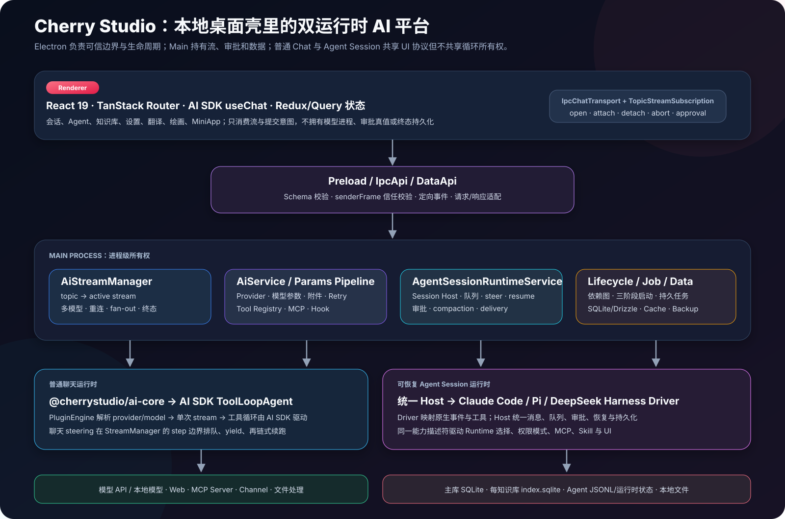
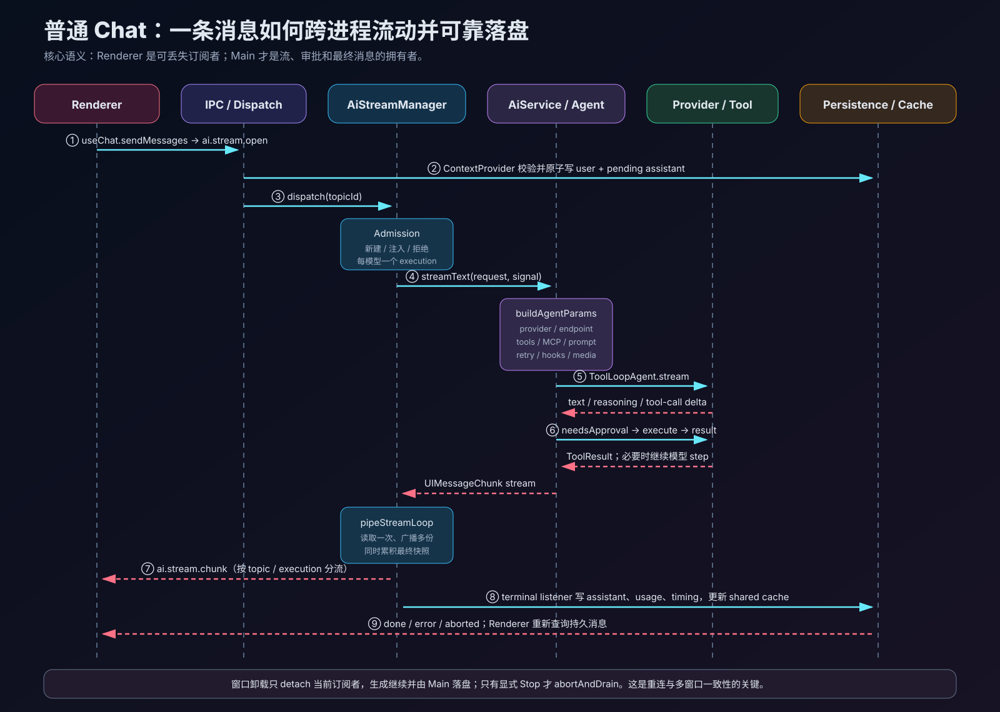
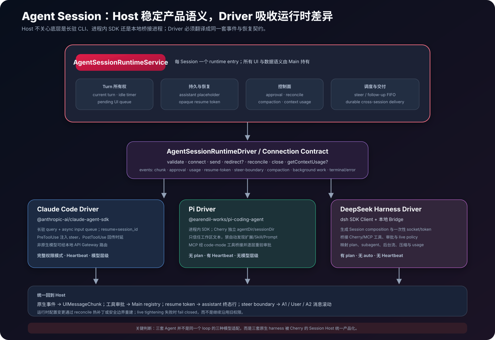
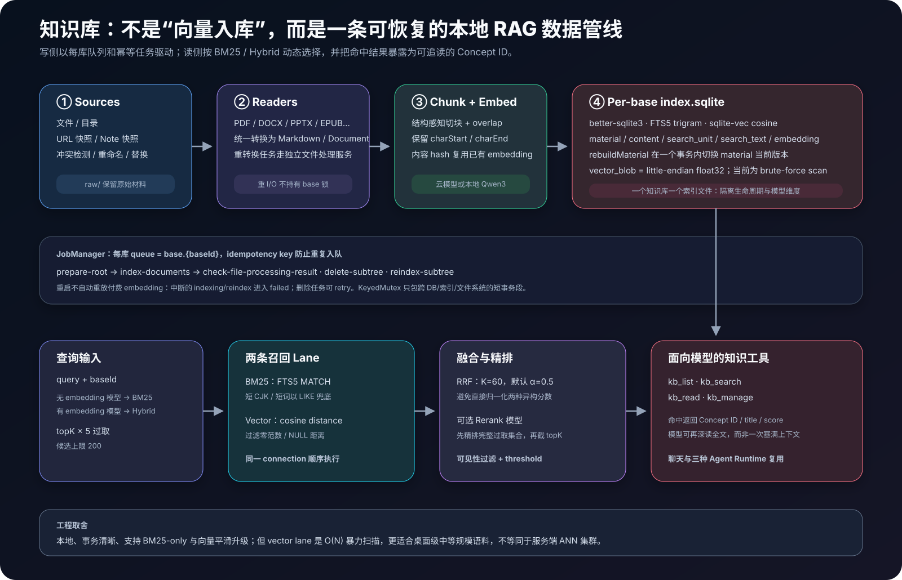

# Cherry Studio 源码解剖：从多模型桌面客户端到可恢复 Agent Runtime

> 站在大模型 Agent 工程师视角，对 [CherryHQ/cherry-studio](https://github.com/CherryHQ/cherry-studio) 的实现做一次端到端拆解。

<p align="center">
  
</p>

| 调研项 | 信息 |
| --- | --- |
| 调研日期 | 2026-08-27 |
| 源码基线 | `main` · [`17390753e32e1083eb01574152842e0f2c29a500`](https://github.com/CherryHQ/cherry-studio/tree/17390753e32e1083eb01574152842e0f2c29a500) |
| 根包版本 | `2.0.9`；这是 `main` 快照，不冒充某个已发布 tag |
| 调研方法 | 源码调用链阅读、仓库内设计文档交叉核验、关键测试与数据约束抽查、官方资料核验 |
| 适合读者 | Agent 平台工程师、Electron/TypeScript 开发者、准备二次开发 Cherry Studio 的团队 |

Cherry Studio 的 README 把它描述成支持多家 LLM、跨 Windows/macOS/Linux 的桌面客户端，这个描述没有错，但已经不足以概括当前 2.0 主线。[项目 README](https://github.com/CherryHQ/cherry-studio/blob/17390753e32e1083eb01574152842e0f2c29a500/README.md)

当前实现同时包含：多模型并行聊天、统一 Provider 层、Vercel AI SDK 工具循环、MCP、知识库/RAG、长期记忆、Skill、外部消息渠道、定时任务，以及 Claude Code、Pi、DeepSeek Harness 三种可恢复 Agent runtime。它更接近一台**运行在本地桌面上的 AI 控制平面**。

本文不会逐页介绍 UI，也不会把存在于依赖中的能力都算成 Cherry 自研。重点是回答四个工程问题：

1. 一条消息如何跨 Renderer/Main/Provider 流动，并在窗口关闭后继续生成、可靠落盘？
2. 普通聊天的工具循环，与 Claude/Pi/DSH Agent Session 到底是什么关系？
3. MCP、知识库、审批、记忆和 Skill 如何进入模型可见的能力面？
4. 哪些设计值得借鉴，哪些边界仍需谨慎？

---

## 先说结论

从 Agent 工程角度，我对 Cherry Studio 的核心判断是：

> **它用 Main Process 建立了一层产品级 Host，把模型、工具、流、数据和多种第三方 Agent harness 统一到同一种桌面会话体验中。**

最值得关注的十点是：

1. **Renderer 是订阅者，不是执行所有者。** 模型流、终态持久化、工具审批和后台继续生成都在 Main。窗口卸载只 `detach`，用户显式 Stop 才 `abort`。
2. **普通 Chat 与 Agent Session 是两条不同运行时。** 普通聊天进入 AI SDK `ToolLoopAgent`；Agent Session 则绕过通用 `Agent`，交给 Claude Code、Pi 或 DSH Driver。
3. **`AiStreamManager` 是整个实时系统的轴。** 它用 `topicId` 管一条活跃流，每个模型对应一个 execution，同时服务多模型、多窗口、重连、审批暂停和终态落盘。
4. **Provider 统一不靠模型名猜测。** `provider.id`、`endpointType`、`adapterFamily` 各司其职，最终由后者确定实际 `@ai-sdk/*` 适配器。
5. **工具不是一次全部塞进提示词。** Tool Registry 可按请求过滤能力，并把大工具集延迟为 `tool_search → tool_inspect → tool_invoke`；需要审批的工具永不延迟，防止绕过原生审批门。
6. **MCP 的热路径只读缓存。** Agent 启动不会等待一个已宕机的 MCP Server；后台刷新换来最终一致性，而不是让每次对话都探测网络。
7. **Agent Session 用 Host/Driver 隔离第三方 harness。** Host 拥有消息、队列、恢复、审批和持久化；Driver 只负责原生连接与事件翻译。
8. **RAG 是独立的写侧流水线和读侧检索系统。** 每个知识库使用自己的 `index.sqlite`，支持 BM25-only、向量检索、RRF 混合召回和可选重排。
9. **可靠性设计普遍采用“短事务 + 持久意图 + 幂等恢复”。** 典型例子包括知识库任务、Agent 跨 Session delivery、pending assistant placeholder 和终态 listener。
10. **安全性不是一句“本地优先”可以概括。** IPC caller 校验、路径 canonicalization、MCP 包校验和审批做得很细；但主窗口仍关闭 Chromium `webSecurity`、未启用 sandbox，Pi `tool_exec` 的 worker 也不是安全沙箱，这些都必须纳入威胁模型。



---

## 1. 项目定位：三个产品叠在一起

从代码所有权看，Cherry Studio 至少包含三个彼此相连的产品：

| 产品面 | 用户看到的能力 | 核心实现 |
| --- | --- | --- |
| 多模型桌面工作台 | 对话、翻译、绘画、文件、并排模型回复、MiniApp | Electron + React Renderer + Main 服务 |
| AI 能力中台 | Provider 解析、模型参数、流式传输、MCP、工具、RAG、用量与追踪 | `src/main/ai` + `packages/aiCore` + Provider Registry |
| Agent 平台 | Workspace、Agent persona/memory、Skill、计划/心跳、外部 Channel、跨 Session 协作 | `AgentSessionRuntimeService` + 三个 Runtime Driver |

因此不能用“Electron 套壳调用 OpenAI API”理解它。真正困难的部分并不是发出 HTTP 请求，而是：

- 在多窗口和页面卸载下维持一个唯一的 topic 流；
- 在模型、工具和人工审批之间保存闭合的事件序列；
- 让完全不同的 Agent SDK 共享消息与恢复语义；
- 在 SQLite、文件系统、外部进程和远端 API 之间建立可恢复边界；
- 避免模型看到的工具数量、历史消息和附件无限膨胀。

### 1.1 仓库规模与技术栈

本次基线中，`src/main` 有 1,963 个 TypeScript/TSX 文件，`src/renderer` 有 2,783 个，仓库内测试/spec 文件约 2,047 个。这个数字包含大量细粒度模块和测试，不代表有效代码行，但足以说明它已是大型桌面应用，而不是示例项目。

关键栈如下：

| 层 | 技术选择 | 工程含义 |
| --- | --- | --- |
| 桌面运行时 | Electron + electron-vite | Main/Preload/Renderer 三构建目标，跨平台打包 |
| UI | React 19、TanStack Router、Tailwind、Tiptap、AI SDK React | 复杂多窗口、富文本、流式对话 |
| 通用 AI | Vercel AI SDK 6、各家 `@ai-sdk/*` Provider | `ToolLoopAgent`、统一 stream/message/tool 类型 |
| Agent SDK | Claude Agent SDK、Pi Coding Agent、DeepSeek Harness | 三条原生 harness 路径，由 Driver 统一接入 |
| 本地数据 | better-sqlite3 + Drizzle ORM + FTS5 | 单连接同步事务、迁移、全文检索 |
| RAG | sqlite-vec、Transformers.js/ONNX、本地/远端 embedding 与 rerank | 每库本地索引、混合检索 |
| 协议与观测 | MCP SDK、OpenTelemetry | 外部工具生态、调用链/用量记录 |
| 工程质量 | Vitest、Playwright、oxlint、ESLint、Biome、Changesets | 多 project 测试与包发布 |

根包要求 Node `>=24.11.1 <24.16.0`，工作区使用 pnpm。具体版本和依赖应以基线 [`package.json`](https://github.com/CherryHQ/cherry-studio/blob/17390753e32e1083eb01574152842e0f2c29a500/package.json) 与 [`pnpm-workspace.yaml`](https://github.com/CherryHQ/cherry-studio/blob/17390753e32e1083eb01574152842e0f2c29a500/pnpm-workspace.yaml) 为准。

### 1.2 目录不是简单的 MVC

```text
src/
├── main/
│   ├── ai/                    # Chat、Agent Session、Provider、MCP、工具、观测
│   ├── core/                  # 生命周期、依赖注入、窗口、任务、路径、安全
│   ├── data/                  # SQLite/Drizzle、DataApi、迁移、服务
│   ├── features/knowledge/    # 完整 RAG 子系统
│   ├── features/apiGateway/   # 本地模型网关/Agent 兼容路由
│   └── services/              # 文件、OCR、备份、本地模型、网络等
├── preload/                   # 受控桥接 Electron API
├── renderer/                  # 页面、组件、hook、transport、窗口入口
└── shared/                    # 跨进程 schema、能力描述符与 DTO

packages/
├── aiCore/                    # 可独立发布的 AI Core
├── ai-sdk-provider/           # CherryIN 等 provider bundle
├── provider-registry/         # Provider/Model 目录与生成器
├── dsh-bridge/                # DSH 控制面插件
└── ui/                        # UI 组件与主题
```

这里有一个明显的架构倾向：**跨进程契约放 `shared`，具体编排留在 Main，可复用但不依赖 Electron 的能力再下沉到 package。**

---

## 2. Electron 壳：生命周期、窗口与数据边界

### 2.1 Main 不是一堆随意初始化的单例

`Application` + `ServiceContainer` + `LifecycleManager` 组成了自研的服务生命周期系统。服务通过装饰器声明名称、依赖、阶段、优先级和失败策略，启动分成：

1. `Background`：可与其他启动过程并行；
2. `BeforeReady`：不依赖 Electron ready 的服务，例如主数据库；
3. `WhenReady`：窗口、AI、知识库等依赖 Electron API 的服务。

停止时按反向初始化顺序执行 `onStop()` / `onDestroy()`，每个服务有独立超时上限。这样做的价值不只是“依赖注入更漂亮”：Agent runtime、MCP client、子进程、数据库和窗口都需要有序收尾，否则一次退出会留下 CLI、WAL 或半写入状态。[源码：`Application.ts`](https://github.com/CherryHQ/cherry-studio/blob/17390753e32e1083eb01574152842e0f2c29a500/src/main/core/application/Application.ts) [源码：lifecycle](https://github.com/CherryHQ/cherry-studio/tree/17390753e32e1083eb01574152842e0f2c29a500/src/main/core/lifecycle)

### 2.2 Main Window、Preload 与 caller 校验

默认窗口配置使用 `nodeIntegration: false` 和 `contextIsolation: true`。Renderer 通过 Preload 暴露的 API 访问 Main，新的请求面统一进入带 schema 的 IpcApi/DataApi。

更重要的是 `validateSender()` 不只检查 URL 字符串：

- 拒绝 `webview` 类型 sender；
- 只允许顶层 frame，iframe 不能借宿主权限调用 Main；
- 打包环境只信任应用根目录内部的 `file:` 页面，并做 `realpath`/路径边界判断；
- 开发环境只信任精确的 dev-server origin。

这是因为主窗口启用了 `<webview>` 和远程 MiniApp；任何 web frame 都可能尝试发 IPC，Preload 并不是唯一入口。[源码：`validateSender.ts`](https://github.com/CherryHQ/cherry-studio/blob/17390753e32e1083eb01574152842e0f2c29a500/src/main/core/security/validateSender.ts)

### 2.3 SQLite 是应用事实源，不是简单缓存

主数据库由 `DbService` 使用单个持久的 better-sqlite3 connection，Drizzle 提供 schema/query：

- WAL 模式；
- `synchronous=NORMAL`；
- `foreign_keys=ON`；
- `busy_timeout=5000`；
- 多语句写通过同步 `BEGIN IMMEDIATE` 事务组合。

单连接、同步执行意味着写操作天然串行；业务层的 `KeyedMutex` 只用于跨 SQLite、索引文件和文件系统的复合不变量，不是再给 SQLite 加一把全局锁。[源码：`DbService.ts`](https://github.com/CherryHQ/cherry-studio/blob/17390753e32e1083eb01574152842e0f2c29a500/src/main/data/db/DbService.ts)

聊天和 Agent Session 都有 FTS5 external-content 索引。实现没有使用会被 `VACUUM`/重建打乱的隐式 `rowid`，而是维护稳定 `fts_rowid`；虚表和 trigger 在每次启动后重放幂等 DDL。这类细节很“数据库工程”，也说明本地优先产品依然需要严肃的数据一致性设计。[设计：Database Construction](https://github.com/CherryHQ/cherry-studio/blob/17390753e32e1083eb01574152842e0f2c29a500/docs/references/data/database-construction.md)

---

## 3. 普通聊天：Main 持有的一条可重连流



### 3.1 Renderer：`useChat` 只是一层消费协议

Renderer 把 `IpcChatTransport` 交给 AI SDK `useChat`。Transport 用以下 IPC route 对应一条 topic 流：

| Route | 语义 |
| --- | --- |
| `ai.stream.open` | 提交/重新生成，并打开或注入 topic 流 |
| `ai.stream.attach` | 新订阅者重连，获得 compact replay 或终态 |
| `ai.stream.detach` | 只移除当前窗口订阅者，不停止生成 |
| `ai.stream.abort` | 用户显式 Stop，等待 Main 完成 teardown/persistence barrier |
| `ai.tool.respond_approval` | 把审批决定交给 Main |

`detach ≠ abort` 是整套体验的基础。组件卸载、Tab 切换或窗口关闭不再意外终止上游请求；Main 继续生成并写入数据库，Renderer 回来后通过 attach/query 恢复。[设计：IPC Transport](https://github.com/CherryHQ/cherry-studio/blob/17390753e32e1083eb01574152842e0f2c29a500/docs/references/ai/ipc-transport.md)

每条 chunk 由 `(topicId, executionId)` 标识。一个 topic 同时询问多个模型时，`TopicStreamSubscription` 把 Main 的复用流拆成多个 execution 分支；UI overlay 与 Main 都用同一类 `readUIMessageStream` 累积算法，降低“流式看起来一种结构、刷新后又是另一种结构”的风险。

### 3.2 Dispatch：按 topic namespace 选择上下文提供者

`dispatchStreamRequest` 不直接假设所有流都是聊天。它遍历 `ChatContextProvider`：

- 普通持久聊天；
- 临时聊天；
- 翻译/内部 prompt；
- `agent-session:<sessionId>`。

Provider 负责把“UI 请求”变成 `PreparedDispatch`：验证 topic、读取模型和 Assistant、构造历史、持久化 user/pending assistant、创建 listener。然后 `AiStreamManager.send()` 才决定：

- **start**：没有活跃流，新建 `ActiveStream` 并为每个模型启动 execution；
- **inject**：已经有活跃 Agent Session，只把新 subscriber 接入，消息已由 Session Host 入队；
- **chat steer continuation**：普通聊天在 step 边界 yield，当前行完成后链式启动续跑。

这是一种很实用的分层：ContextProvider 拥有不同 topic 的业务语义，StreamManager 只拥有流的并发与生命周期。

### 3.3 `AiStreamManager`：topic 级 actor

可以把 `AiStreamManager` 理解为一个进程内、以 `topicId` 分区的 actor registry：

```ts
activeStreams: Map<topicId, {
  status,
  listeners,
  executions: Map<modelId, StreamExecution>,
  pendingSteer,
  graceTimer
}>
```

一个 topic 最多有一个 active stream，但其内部可以有 N 个模型 execution。每个 execution 保存：

- 独立 `AbortController`、attempt id 和 anchor message id；
- 有界 replay buffer；
- 当前累积的 `CherryUIMessage`；
- usage、provider/tool timing、OTel root span；
- 终态与错误投影。

`pipeStreamLoop` 只读取 provider stream 一次，然后把 chunk fan-out 给：

- `WebContentsListener`：某个 Renderer 窗口；
- `PersistenceListener`：数据库/临时/翻译等不同 backend；
- `SseListener`：本地 API Gateway；
- `ChannelAdapterListener`：Telegram/Slack 等外部渠道；
- 内部终态和 trace listener。

订阅者地位平等，没有“拥有流的窗口”。因此 Renderer crash 不会把模型响应和数据库写一起带走。[源码：`AiStreamManager.ts`](https://github.com/CherryHQ/cherry-studio/blob/17390753e32e1083eb01574152842e0f2c29a500/src/main/ai/streamManager/AiStreamManager.ts) [设计：Stream Manager](https://github.com/CherryHQ/cherry-studio/blob/17390753e32e1083eb01574152842e0f2c29a500/docs/references/ai/stream-manager.md)

### 3.4 `AiService.buildAgentParamsFor()`：一次请求的组装根

普通 Chat 进入 `AiService.streamText()` 后，最重的工作不是 `fetch`，而是组装一次不可变的 request scope：

```text
provider + model + assistant + request
  → endpoint / adapter / credential
  → attachment routing + context budget
  → active tools + MCP sync + deferred exposition
  → model capabilities + reasoning profile
  → internal feature plugins + hooks
  → system prompt + parameters + retry wrapper
  → Agent.stream()
```

内部 `RequestFeature` 顺序是有意义的。例如 reasoning extraction 必须早于 simulated streaming；provider-native web search、URL context、Anthropic cache/header、DeepSeek DSML、Qwen thinking 等都通过插件或 hook 组合，而不是在主循环里铺满供应商 `if/else`。[设计：Params Pipeline](https://github.com/CherryHQ/cherry-studio/blob/17390753e32e1083eb01574152842e0f2c29a500/docs/references/ai/params-pipeline.md)

`RequestScope` 在 feature 间共享但约定只读。这个约束很重要：如果 feature 可以随手修改 provider、tool 或 signal，插件顺序会变成不可测试的隐式状态机。

### 3.5 真正的 Chat Agent loop 在哪里

Main 的 `Agent` 是 Cherry 对通用 loop 的薄而重要的包装：

1. 把 Cherry UI message 转为模型消息；
2. 根据模型能力路由图片/音频/工具结果 media；
3. 合并工具执行 hook、usage observer 和 feature hook；
4. 调用 `@cherrystudio/ai-core.createAgent()`；
5. 后者用 PluginEngine 解析模型和 middleware，创建 AI SDK `ToolLoopAgent`；
6. 把 AI SDK 流转为带稳定 message id 的 `UIMessageChunk`；
7. 区分工具参数错误、工具执行错误、provider 终态错误和用户 abort。

所以普通 Chat 的循环所有权属于 Vercel AI SDK `ToolLoopAgent`，Cherry 负责它前后的产品协议，并没有在这里再手写一个 ReAct `while`。[源码：Main `Agent.ts`](https://github.com/CherryHQ/cherry-studio/blob/17390753e32e1083eb01574152842e0f2c29a500/src/main/ai/runtime/aiSdk/Agent.ts) [源码：`createAgent.ts`](https://github.com/CherryHQ/cherry-studio/blob/17390753e32e1083eb01574152842e0f2c29a500/packages/aiCore/src/core/agents/createAgent.ts)

### 3.6 错误、重试与 fallback

模型 retry 包在最终 resolved model 外层：

- 同模型重试与有序 fallback 共享一个策略；
- fallback 惰性解析，成功解析会 memoize；
- retry 只允许发生在第一个内容 chunk 提交前；
- abort 不重试；
- request 显式 `maxRetries: 0` 能覆盖全局设置；
- wrapper 启用时把 AI SDK 原生 `maxRetries` 设为 0，避免重试次数相乘。

Fallback 可以换模型和调用参数，但不能在同一个 loop 中途替换已组装的 system/tools。因此实现会先做能力 gate，排除无法处理当前原生文件或工具形状的候选。Embedding 不做跨模型 fallback，因为不同向量空间混用会直接污染索引；rerank 也不走同一个 wrapper。[设计：Model Retry](https://github.com/CherryHQ/cherry-studio/blob/17390753e32e1083eb01574152842e0f2c29a500/docs/references/ai/model-retry.md)

### 3.7 附件与上下文不是无界字符串拼接

每个附件按 provider/model 能力单独路由：

- 原生支持的 PDF/文件作为 provider file part；
- 不支持的文件先转换文本，并受共享字符/token budget 限制；
- 截断后给模型 `read_file(filename, offset)` 继续读取；
- 工具只能读取当前请求白名单中的附件，不接受任意路径。

长工具输出也可离线持久化为受请求 allow-list 限制的文件，再由 `fs_read` 分页读回。上下文压缩、最大消息数、截断阈值和压缩模型由 global preference 与 Assistant override 合并。这里体现出一个成熟原则：**把长内容变成可寻址资源，不要把一切塞进每轮 prompt。**

---

## 4. Provider：身份、协议与 SDK 适配器分离

多 Provider 项目最容易掉进两个坑：按 `provider.id` 写巨大 switch，或者根据模型名猜协议。Cherry Studio 2.0 把三个概念拆开：

| 维度 | 示例 | 作用 |
| --- | --- | --- |
| `provider.id` | `silicon`、`minimax`、`my-relay` | 用户可见身份、配置和路由 key |
| `endpointType` | `openai-chat-completions`、`anthropic-messages` | URL/线协议族 |
| `adapterFamily` | `openai-compatible`、`anthropic`、`google` | 实际使用哪个 `@ai-sdk/*` 包 |

运行时热路径大致是：

```ts
endpoint = resolveEffectiveEndpoint(provider, model)
adapter = resolveAiSdkProviderId(provider, endpoint.endpointType)
sdkConfig = await providerToAiSdkConfig(provider, model, endpoint)
```

如果 endpoint 没有 `adapterFamily`，总 fallback 是 `openai-compatible`。多协议 relay 可以在同一个 provider 下给不同 endpoint 配不同 adapter，而无需复制 provider 实体。[设计：Provider Resolution](https://github.com/CherryHQ/cherry-studio/blob/17390753e32e1083eb01574152842e0f2c29a500/docs/references/ai/provider-resolution.md)

### 4.1 Provider Registry 与运行时配置是两层

`packages/provider-registry` 保存 provider/model catalog 与 capability schema，新安装时由 seeder 写入主库；用户配置和迁移结果保存在 DB。Catalog 负责“默认知道什么”，运行时配置负责“这个用户实际启用了什么”。

`packages/aiCore` 再把 ProviderExtension 注册到 PluginEngine。一个 extension 可声明：

- base id、alias、variant；
- provider factory；
- web search / URL context 等原生 tool factory；
- image generation 能力；
- middleware 和参数转换。

这种拆法比把一切放进 React model selector 更稳：Renderer 不需要理解 SDK package，数据库也不保存可执行 factory。

### 4.2 Variant 解决同厂多协议

同一厂商可能同时提供 Responses、Chat Completions、Anthropic Messages。Cherry 用少量 variant 表达同一 base 的协议实现，例如 `openai-chat`、`azure-responses`、`azure-anthropic`、`xai-responses`、`cherryin-chat`。

值得注意的是，它没有把“OpenAI Responses”视为只有一个实现：完整兼容端点走 `@ai-sdk/openai`，只实现协议子集的本地/中转服务可走更克制的 `@ai-sdk/open-responses`。这说明所谓兼容并不是 URL 一样，而是请求字段和事件语义的能力集合。[设计：Adapter Family](https://github.com/CherryHQ/cherry-studio/blob/17390753e32e1083eb01574152842e0f2c29a500/docs/references/ai/adapter-family.md)

---

## 5. 工具与 MCP：按请求组装能力面

### 5.1 AI SDK Tool Registry

普通 Chat 使用进程级 `ToolRegistry`，每个 `ToolEntry` 带：

```ts
interface ToolEntry {
  name: string
  namespace: string
  description: string
  defer: 'never' | 'always' | 'auto'
  tool: Tool
  applies?(scope): boolean
}
```

当前内建 11 个工具：

| Namespace | 工具 |
| --- | --- |
| Web | `web_search`、`web_fetch` |
| Knowledge | `kb_list`、`kb_search`、`kb_read`、`kb_manage` |
| Attachment/File | `read_file`、`fs_read` |
| MCP Resource | `mcp_resource_list`、`mcp_resource_read` |
| Image | `generate_image` |

它们不是始终可见。`applies(scope)` 会检查当前 Assistant、请求知识库、附件、模型能力和设置。例如没有可读附件时不暴露 `read_file`，没有 in-scope 知识库时不暴露 KB 工具。[源码：built-in registration](https://github.com/CherryHQ/cherry-studio/blob/17390753e32e1083eb01574152842e0f2c29a500/src/main/ai/tools/adapters/aiSdk/builtin/registerBuiltinTools.ts)

### 5.2 大工具集的 deferred exposition

当工具池足够大，且预估节省的 token 超过 meta-tool 固定开销时，部分工具不会直接进入模型 schema，而是注入：

- `tool_search`：按 namespace/query 搜索工具；
- `tool_inspect`：返回单个工具的完整说明和类型声明；
- `tool_invoke`：按 name + JSON 参数调用工具。

这样模型采用“先发现、再调用”，避免几十个 MCP schema 常驻上下文。延迟策略有两个关键安全约束：

1. 强制审批工具 `defer: never`，必须作为原生 AI SDK tool 留在当前 tool set；
2. `tool_invoke` 执行时再次拒绝 approval-gated target，避免通过名称间接绕过审批。

代码里还存在 `tool_exec`（worker + `new Function`），但普通 AI SDK 路径**故意不注入**，因为它会让模型编写的代码持有 Node 权限。[设计：Tool Registry](https://github.com/CherryHQ/cherry-studio/blob/17390753e32e1083eb01574152842e0f2c29a500/docs/references/ai/tool-registry.md)

### 5.3 MCP Runtime 与 Catalog 分离

MCP 子系统把“连接”与“列目录”拆成两个服务：

- `McpRuntimeService`：连接生命周期、OAuth、transport、client 复用、状态；
- `McpCatalogService`：工具目录缓存、后台 warm/refresh、变更通知。

Agent/Chat 的热路径调用 `listTools(serverId)` 时只读 shared cache，绝不现场连接 MCP。首次冷缓存会异步 kick refresh；启用 server、手动刷新、`tools/list_changed` 和启动 prewarm 才走 live path。

收益是坏掉的 MCP Server 不会卡住每一次 Agent 启动；代价是工具目录最终一致：冷启动的第一次 Session 可能暂时看不到工具，缓存更新后再通过通知或下一次构建补齐。

MCP wire name 使用稳定 server id + 原始 tool name 的 digest，而不是只靠可变 display name，避免同名 server/tool 发生审批和路由歧义。[源码：`McpCatalogService.ts`](https://github.com/CherryHQ/cherry-studio/blob/17390753e32e1083eb01574152842e0f2c29a500/src/main/ai/mcp/McpCatalogService.ts) [源码：`McpRuntimeService.ts`](https://github.com/CherryHQ/cherry-studio/blob/17390753e32e1083eb01574152842e0f2c29a500/src/main/ai/mcp/McpRuntimeService.ts)

### 5.4 审批的事实源在 Main

工具需要审批时，Main 把 `approval-requested` part 写入正在累积的 message，并把 topic 状态切为 `awaiting-approval`。Renderer 只显示卡片并提交决定；Main 才：

- 校验 live approval registry 或 DB anchor；
- 应用 approved/reason/updatedInput；
- 在需要时持久化 MCP 的长期自动批准设置；
- 恢复原 stream 或 dispatch continuation。

这一设计专门处理 overlay 与 DB 的时间差：UI 可能已看到审批卡，而 anchor row 尚未终态落盘。Main 只有在 DB 里真的找到目标 part 时才条件写，避免用旧快照覆盖并发中的完整 message。[设计：Tool Approval](https://github.com/CherryHQ/cherry-studio/blob/17390753e32e1083eb01574152842e0f2c29a500/docs/references/ai/tool-approval.md)

---

## 6. Agent Session：真正的产品级 Agent Host

普通 Chat 的目标是完成一轮带工具的对话；Agent Session 还必须处理 workspace、长期 persona/memory、原生 Session、实时 steering、后台任务、跨 Session 交付和重启恢复。因此 `AiService.streamText()` 看到：

```ts
request.runtime.kind === 'agent-session'
```

就直接调用 `AgentSessionRuntimeService.openTurnStream()`，不会再构建普通 AI SDK `Agent`。



### 6.1 Host/Driver 的所有权边界

| Owner | 责任 |
| --- | --- |
| `AgentChatContextProvider` | 验证 Session/Workspace/Agent/Model，原子写 user 与 pending assistant |
| `AgentSessionRuntimeService` | 每 Session runtime entry、当前 turn、pending queue、connection、resume token、审批、终态和 idle timer |
| `AgentSessionDeliveryService` | 跨 Session durable delivery、FIFO 调度、恢复、删除协调 |
| `AgentSessionRuntimeDriver` | 连接一个具体 runtime，发送/redirect/reconcile/close，翻译 native event |
| `AiStreamManager` | 继续提供 topic stream、listener、暂停/续跑与持久化协议 |

Driver 合约不要求底层 transport 形态一致。它只要求对 Host 输出统一事件：`chunk`、`usage`、`resume-token`、`turn-complete`、`tool-approval-request`、`steer-boundary`、`compaction-*`、`context-usage`、后台 flow 与 `error` 等。[源码：runtime types](https://github.com/CherryHQ/cherry-studio/blob/17390753e32e1083eb01574152842e0f2c29a500/src/main/ai/runtime/types.ts)

### 6.2 Fresh turn

一次新的 Agent turn：

1. Renderer 打开 `agent-session:<sessionId>`；
2. ContextProvider 验证 workspace、agent、driver、model；
3. 一个短事务写入 user row 与 pending assistant placeholder；
4. `beginTurn()` 创建 `turnId`、persistence/terminal/trace listener；
5. StreamManager 启动 execution；
6. `openTurnStream()` 确保 connection 存在，调用 `connection.send()`；
7. Driver 把原生事件翻译成 `UIMessageChunk`；
8. Host/StreamManager 写终态 assistant，并把最新 resume token 绑定到该行。

Pending assistant 很重要：它在运行开始前就给这次工作一个 durable identity。崩溃恢复、delivery claim、usage 和错误都能引用同一个 turn，而不是在模型完成以后才补一条“可能属于谁”的消息。

### 6.3 Follow-up 不是统一 abort 重跑

用户在 Agent 正工作时发送新消息，Host 根据 Driver 能力处理：

- Driver 支持 `redirect()` 且当前是可交互 normal turn：把消息 stash 到正在运行的 runtime；
- Claude Code 在下一个 `PreToolUse` 之前以 `additionalContext` 注入 steer；
- 如果 turn 没再调用工具就结束，Driver 发 `steer-undelivered`，Host 把它放入下一 turn 队列；
- 不支持 native steering 的 Driver，直接把 follow-up 放入 `pendingTurns`，等当前 turn 终态持久化后再启动。

当 steer 真正注入，Driver 发 `steer-boundary`。Host 把一个物理 assistant row 滚成：

```text
A1：steer 前的输出（终态 row-roll）
U2：用户 follow-up
A2：steer 后继续输出的新 assistant row
```

否则 UI 排序会变成 `U1 → A1全部输出 → U2`，看起来像模型忽略了 U2。这个“消息滚动”是产品语义，不应该塞进任何一个第三方 SDK Driver。

### 6.4 Prompt、Persona 与 Memory 的统一权威顺序

三种 runtime 共用 `buildAgentRuntimePrompt()`。当 Agent 配置了 System Prompt 时，模型收到显式优先级：

1. 平台与 runtime 安全约束；
2. Agent System Prompt（DB 中 `agent.instructions`）；
3. Workspace instruction（`system.md`、`CLAUDE.md`、scoped `AGENTS.md`）；
4. Agent persona（`SOUL.md`）。

`USER.md`、`memory/FACT.md`、journal 和检索知识是上下文，不是更高优先级的行为指令。具体文件分工：

| 文件 | 作用 |
| --- | --- |
| `SOUL.md` | 名称、人格、表达风格；没有 Agent System Prompt 时兼容承担角色发现 |
| `USER.md` | 用户画像、偏好、时区和长期上下文 |
| `memory/FACT.md` | 长期事实、项目决策、纠错经验；启动时读入 |
| `memory/JOURNAL.jsonl` | 追加式事件日志；通过 memory tool 搜索/追加，不常驻 prompt |

`system.md` 的存在本身表示“替换 native base”，即使文件为空；Cherry 自有的记忆、安全、引用、artifact reporting 和语言规则仍追加在后面。不同 Driver 只负责把 `{base, append}` 映射到自己的 SDK 表示。[源码：`agentPrompt.ts`](https://github.com/CherryHQ/cherry-studio/blob/17390753e32e1083eb01574152842e0f2c29a500/src/main/ai/runtime/agentPrompt.ts) [源码：`PromptBuilder`](https://github.com/CherryHQ/cherry-studio/blob/17390753e32e1083eb01574152842e0f2c29a500/src/main/ai/agents/prompt.ts)

### 6.5 三种 Driver 的差异

| 维度 | Claude Code | Pi | DeepSeek Harness |
| --- | --- | --- | --- |
| 接入方式 | Claude Agent SDK query + input queue | 进程内 Pi SDK | DSH 子进程 + 本地 Bridge |
| Resume | SDK `session_id` | Cherry session 目录内的 Pi session id | Driver 验证的 opaque token |
| Native steer | 有，借 PreToolUse 注入 | 依 Pi connection 能力映射 | 由 DSH 事件/Bridge 映射 |
| Tool surface | Claude 内建 + MCP bridge | 直接 `read/write/edit/bash` + code-mode MCP | DSH 内建 + Cherry Bridge |
| Prompt carrier | preset/custom + append | system/append override | 生成 composition persona |
| 当前能力描述符默认权限 | `auto` | `auto` | `acceptEdits` |
| Plan | 支持 | 不支持 | 支持 |
| Heartbeat | 支持 | 支持 | 当前不支持 |

当前矩阵以 [`agentRuntimeCapabilities.ts`](https://github.com/CherryHQ/cherry-studio/blob/17390753e32e1083eb01574152842e0f2c29a500/src/shared/ai/agentRuntimeCapabilities.ts) 为准。它同时驱动 Runtime selector、模型过滤、权限选项、Skill/MCP/知识库开关和内建工具列表；UI 不需要为每个 Driver 到处写分支。

#### Claude Code

Claude Driver 可以消费 prewarmed query；优先使用 Host 给的 resume token，其次查最后一条带 token 的 assistant row。它把 `system/init` 映射成 resume token，把 `result` 映射成 usage/context/turn-complete，并用 `PostToolUse` hook 采集工具时延。

非 Anthropic 原生模型可以通过 Cherry 本地 API Gateway 路由；Driver 仍使用 Claude SDK 的 harness，但 provider call 可能由 Cherry 的普通 AI 层转发。恢复时对“session 不存在”或重复 tool-use id 有一次重建预算；对可能重复副作用的错误，只有在当前 turn 尚未输出非 metadata chunk 时才允许 replay。

#### Pi

Pi 在 Main 进程内运行。Cherry 明确隔离独立用户的 `~/.pi/agent`：

- 使用 Cherry 自有 `agentDir` 与 `sessionDir`；
- 关闭 Pi 自身对 extension、skill、prompt template、theme 的泛化磁盘发现；
- 允许用户主动选中的 workspace 里 `AGENTS.md`/`CLAUDE.md` 文本；
- Cherry 管理的 Skill，以及经 Cherry 筛选出的 workspace `.claude/skills`、`.agents/skills`，通过 `additionalSkillPaths` 显式注入；
- Prompt 通过 override 注入，不读取 Pi home 的 `SYSTEM.md`。

Pi 的 MCP/Cherry 工具通过 code-mode 暴露：`tool_search`、`tool_describe`、`tool_call`、`tool_exec`。其中 `tool_exec` 在 worker thread 中运行 JavaScript，外层和每个嵌套调用都会再次进入 live approval/policy gate；但 worker thread 仍有应用 Node 权限，**它是调度隔离，不是安全沙箱**。[设计：Pi resource boundary](https://github.com/CherryHQ/cherry-studio/blob/17390753e32e1083eb01574152842e0f2c29a500/docs/references/ai/agent-session-runtime.md#pi-driver-resource-boundary)

#### DSH

DSH Driver 通过 `@deepseek-ai/dsh-sdk-client` 启动 bundled Harness，为每个 Session 生成 composition，并使用 generation-specific socket/token 连接本地 `DshBridgeServer`。Bridge 是 Cherry 的 capability boundary：工具命名、disabled policy、审批、MCP 转发和子 Agent/后台事件都在这里转换。

DSH 原生支持 plan、goal、compaction、subagent 和后台 flow，因此它的 stream adapter 需要映射的事件面比普通 Chat 更宽。Driver materialize connection 前后各抓一次 provider/model/tool 签名，若启动期间事实变化则清理连接并 fail closed。

### 6.6 Cross-Session delivery：把 Agent 协作做成持久队列

Agent 可以通过 Cherry 工具发现和委托另一个 Session，但两个 provider process 不直接互连。`session_send`/`session_create` 先写一条带 delivery metadata 的普通 `agent_session_message`：

```text
accepted → delivering → consumed
                    └→ failed
```

`accepted` 数据库行就是唯一队列，内存不再保存第二份真值。调度时一个短事务完成：

1. 再校验 sender/target 授权；
2. 写 target user row 和 assistant placeholder；
3. CAS `accepted → delivering` 并记录 `delivery_turn_ref`；
4. 提交后才启动 Agent。

终态先持久化 assistant，再由幂等 finalizer 复制安全结果回 caller Session。只复制最终文本与受管文件引用，不复制 reasoning、tool call、审批状态和不受管本地路径。`delivery_in_reply_to` 唯一索引保证一次请求最多一个结果。

安全上目前刻意只允许一跳：`session_send` 与 `session_create` 每次都需要 live user approval；channel、schedule、delivery 等 headless turn 不能继续委托，避免无人值守 A→B→A 循环或 prompt injection 借高权限 Agent 充当 confused deputy。[设计：Cross-Session delivery](https://github.com/CherryHQ/cherry-studio/blob/17390753e32e1083eb01574152842e0f2c29a500/docs/references/ai/agent-session-runtime.md#cross-session-delivery)

---

## 7. 知识库/RAG：写侧任务化，读侧混合召回



知识库实现集中在 `src/main/features/knowledge`，目录本身按数据管线分层：`sources → readers → indexing → vectorstore`，`ingestion/tasks` 管编排，`query` 管读取。这比在一个 `KnowledgeService` 中混合所有 I/O 清晰得多。[知识库实现说明](https://github.com/CherryHQ/cherry-studio/blob/17390753e32e1083eb01574152842e0f2c29a500/src/main/features/knowledge/README.md)

### 7.1 写侧：从 source 到 material

支持的 source 包括文件、目录、URL 和 Note snapshot。流程是：

1. `KnowledgeIngestionService` 做 admission、同名冲突处理、item row 与文件路径预留；
2. 需要重转换的 PDF/Office/OCR 交给独立 `FileProcessingService`；
3. Reader 产出统一 `Document[]`；
4. structured splitter 优先在 Markdown 标题、段落、列表等结构边界切块，并避免在 fenced code 内切断；
5. 每个 chunk 保留 `charStart/charEnd`，满足 `contentText.slice(start,end) === chunk.text`；
6. 以 embedding text hash 查询已有向量，只对缺失 hash 调 embedding API；
7. `rebuildMaterial()` 在一个 index transaction 中写 content/unit/text/vector，并切换 material 当前版本。

同一文本出现在多个文件或重建后未变化时，可以复用 embedding。若读取到“hash 已存在”后、正式写事务前被并发垃圾回收，`assertEmbeddingCoverage()` 会让整个 rebuild 回滚，任务重试后重新嵌入，避免出现悄悄缺向量的半索引。

### 7.2 每个知识库一个 `index.sqlite`

主 DB 保存知识库和 item 元数据，检索内容放在每库独立索引：

- `material`：材料与当前 content hash；
- `content`：去重后的完整文本；
- `search_unit`：chunk 的 material、序号和 offset；
- `search_text` + FTS5：检索文本；
- `embedding`：hash → little-endian float32 BLOB。

每库独立带来三个好处：删除/恢复/迁移的影响面小；一个库的 embedding 维度天然一致；大文件索引不会让主业务库 schema 过度复杂。代价是跨库检索需要上层 fan-out，而不是一个 SQL 全局查询。

### 7.3 读侧：BM25、向量与 RRF

查询模式不是一个容易漂移的数据库 preference，而是每次根据知识库事实计算：

- 没有 embedding model：`bm25`，不浪费一次 query embedding；
- 有完整向量能力：`hybrid`。

BM25 使用 FTS5 trigram；全是 1–2 字符的短 CJK 查询无法 MATCH 时用 `LIKE` 兜底。有可索引词但同时包含短词时，短词先作为 `LIKE` filter，若过滤掉全部候选则放宽，避免一个 filler word 让搜索归零。

Vector lane 使用 sqlite-vec 的 `vec_distance_cosine` 对 BLOB 做暴力扫描。Hybrid 各预取 `topK × 5`，通过 Reciprocal Rank Fusion 合并：

```text
score(doc) = α / (60 + vector_rank)
           + (1 - α) / (60 + bm25_rank)
```

默认 `α=0.5`。RRF 用 rank 而不是原始分数，绕开 cosine similarity 与 BM25 score 不可直接归一化的问题。上层再做 item 可见性过滤、可选 rerank、topK 截断与 relevance threshold。[源码：`KnowledgeIndexStore.ts`](https://github.com/CherryHQ/cherry-studio/blob/17390753e32e1083eb01574152842e0f2c29a500/src/main/features/knowledge/pipeline/vectorstore/indexStore/KnowledgeIndexStore.ts) [源码：`KnowledgeQueryService.ts`](https://github.com/CherryHQ/cherry-studio/blob/17390753e32e1083eb01574152842e0f2c29a500/src/main/features/knowledge/query/KnowledgeQueryService.ts)

### 7.4 为什么有 `kb_search` 还要 `kb_read`

`kb_search` 返回 chunk、score/rank、title 和 Concept ID；`kb_read` 再按 Concept ID 读取完整材料或局部内容。这是 progressive retrieval：第一步只给模型足够判断相关性的证据，第二步才深读目标，降低无关 token 常驻上下文。

Concept ID 来自材料的相对路径，但每次 read/manage 都要回主 DB 重新验证 item 是否属于当前 base、是否可见、是否 completed。索引命中不是授权本身。

### 7.5 后台任务与付费副作用

所有知识库 job 都进入 `base.{baseId}` 队列，并使用幂等 key。索引和 reindex 在应用重启后采用 `recovery: abandon`，中断 item 进入 failed，不会默默重放付费 embedding；delete 才允许 retry。

这是一个值得借鉴的产品判断：**“可以恢复”不等于“任何工作都自动重做”。** 一旦操作会花钱或重复外部副作用，恢复策略必须由领域语义决定。

---

## 8. Skill、Channel、Job 与可观测性

### 8.1 Skill 是受控发现，不是无边界目录扫描

Cherry 同时处理两类 Skill：一类是具有数据库实体、文件夹、启用关系和安装流程的全局受管 Skill；另一类是当前 workspace 的 `.claude/skills` 与 `.agents/skills`。2.0.9 会发现后者，但 `SkillService` 会限定根目录、校验条目与 `SKILL.md`，再把解析后的路径交给 runtime，而不是让各 SDK 任意扫描用户目录。[源码：SkillService](https://github.com/CherryHQ/cherry-studio/blob/17390753e32e1083eb01574152842e0f2c29a500/src/main/ai/skills/SkillService.ts)

Agent Driver 获得的是受管 Skill 与当前 workspace Skill 的 canonical path 合集：

- Claude 映射为 SDK plugin/config，并建立 workspace Skill whitelist；
- Pi 在保持 `noSkills: true` 的同时显式传入 `additionalSkillPaths`；
- DSH 把同一批路径写入 composition 的 `skillDirs`。

这里的关键区别是：`noSkills` 关闭的是 Pi SDK 自己的发现面，不会阻止 Cherry 显式提供的路径。于是全局受管 Skill 仍经过“数据库授权 → canonical path”，workspace Skill 则经过“固定根目录发现 → 条目校验 → canonical path”，最后统一进入 Driver materialization；独立用户目录如 `~/.agents/skills` 不会被顺手纳入。[源码：Pi connection signature](https://github.com/CherryHQ/cherry-studio/blob/17390753e32e1083eb01574152842e0f2c29a500/src/main/ai/runtime/pi/piConnectionSignature.ts) · [源码：Pi resource loader](https://github.com/CherryHQ/cherry-studio/blob/17390753e32e1083eb01574152842e0f2c29a500/src/main/ai/runtime/pi/PiRuntimeConnection.ts)

### 8.2 外部 Channel 复用同一 Host

Discord、飞书、QQ、Slack、Telegram、微信等 adapter 将外部消息转换成 Agent Session 输入，最终仍走 Host、StreamManager 和 persistence listener。Channel 输出会移除内部 citation marker，并尝试遮蔽 PEM、常见 API key、Bearer token 等 secret pattern。

但代码也明确承认正则遮蔽追求低误报，不覆盖所有 secret；Workspace 文件 guard 也只是防 traversal/误路径，不是对拥有 shell/code execution Agent 的沙箱。这种注释很诚实：防御层要说明**能防什么、不能防什么**。[源码：Channel security](https://github.com/CherryHQ/cherry-studio/tree/17390753e32e1083eb01574152842e0f2c29a500/src/main/ai/channels/security)

### 8.3 Usage 与 OTel 不是一个总数

普通 Chat 通过 AI Core plugin 捕获每次 provider call；Agent Driver 根据自己的 transport 决定由 SDK 事件还是本地 gateway middleware 捕获。记录会冻结：provider/model、credential 的非秘密 receipt、定价快照、message association、cache read/write token 和 TTFT/completion/thinking 时间。

OpenTelemetry root span 以 turn 为边界，provider、tool、compaction、DSH child runtime 等作为子 span。敏感 payload 的本地 trace 受 developer-mode 和 redaction 策略约束。更重要的是 tool timing 与 model usage 不硬拼成一个来源不明的 aggregate，而是在 UI 读模型中关联。[设计：Observability](https://github.com/CherryHQ/cherry-studio/blob/17390753e32e1083eb01574152842e0f2c29a500/docs/references/ai/observability.md) [设计：AI Usage Records](https://github.com/CherryHQ/cherry-studio/blob/17390753e32e1083eb01574152842e0f2c29a500/docs/references/ai/ai-usage-records.md)

---

## 9. 安全评估：已有纵深防御，但不能把审批当沙箱

### 9.1 做得好的部分

| 面 | 具体措施 |
| --- | --- |
| IPC | schema 校验、顶层 frame、app-root realpath、拒绝 webview sender |
| URL/窗口 | 外链交给系统浏览器，非 Web scheme 导航默认拒绝 |
| Agent prompt 文件 | 拒绝 symlink，realpath 确认仍在 expected root，POSIX 使用 `O_NOFOLLOW` |
| Workspace 文件 | canonical path containment、symlink escape 防护、读取前后 size cap |
| MCP package | 上传大小/扩展名、zip entry containment、command/arg/null-byte 校验、拒绝 `NODE_OPTIONS`/`LD_PRELOAD`/`DYLD_*` |
| Tool | disabled policy、按调用审批、Main 为审批唯一 writer、headless delegation 拒绝 |
| Runtime materialization | 启动前后配置签名，live tightening 失败时关闭连接 |
| 数据恢复 | 短事务、CAS、唯一索引、终态先落盘再 finalization |

项目的官方 Security Policy 支持最新版本与前一个 minor，并要求通过 GitHub Security Advisory 私下报告漏洞。[Security Policy](https://github.com/CherryHQ/cherry-studio/security)

### 9.2 必须看到的边界

#### 主窗口是高风险兼容配置

当前 `WindowType.Main` 明确配置：

```ts
contextIsolation: true
nodeIntegration: false
sandbox: false
webSecurity: false
webviewTag: true
allowRunningInsecureContent: true
```

新的 IpcApi/DataApi 有 `validateSender()` 补偿，但该文件的注释也写明：仍在使用旧 `BaseService.ipcHandle/ipcOn` 的 legacy channel 尚未全部迁移到这道 caller gate。[源码：`windowRegistry.ts`](https://github.com/CherryHQ/cherry-studio/blob/17390753e32e1083eb01574152842e0f2c29a500/src/main/core/window/windowRegistry.ts) [源码：`validateSender.ts`](https://github.com/CherryHQ/cherry-studio/blob/17390753e32e1083eb01574152842e0f2c29a500/src/main/core/security/validateSender.ts)

这不代表“一定可利用”，但代表每一个新 IPC、webview 能力和导航入口都必须按高风险审计。项目历史上也发布过多条 RCE/命令注入安全公告，包括恶意 MCP OAuth redirect 与自定义 URL 处理，因此二次开发不应绕过现有 guard，也不应把旧版本用于安全敏感环境。[GitHub Security Advisories](https://github.com/CherryHQ/cherry-studio/security/advisories)

#### Tool approval 不等于 OS isolation

- 一个被批准的 stdio MCP server 是以当前用户权限运行的进程；
- Pi code-mode worker 保留 Node authority；
- shell/file tool 若运行时策略允许，能力上限仍是应用进程/用户权限；
- prompt instruction hierarchy 是给模型的行为契约，不是确定性访问控制。

审批能阻止未经同意的调用，不能把恶意代码变成无害代码。对不可信 MCP、Skill、workspace executable resource 或模型生成代码，应使用 OS sandbox、容器/VM 或 capability-isolated executor。

#### “本地存储”不等于“数据不离机”

历史、设置、知识库和 API key 默认本地存储；但使用用户配置的第三方模型时，请求会直接发送给对应 Provider，使用内建模型服务时会经官方 relay。官方隐私政策也明确区分了这两条路径。[Privacy Policy](https://github.com/CherryHQ/cherry-studio/blob/17390753e32e1083eb01574152842e0f2c29a500/PRIVACY.md)

---

## 10. 工程上的优点、成本与适用边界

### 10.1 最值得借鉴的设计

**第一，执行所有权与 UI 生命周期分离。** 这是 Electron AI 客户端从 demo 走向可靠产品的分水岭。只要模型流仍绑在 React component 上，多窗口、重连、审批和后台生成就会互相打架。

**第二，Host/Driver 而不是“统一所有 Agent loop”。** Claude、Pi、DSH 的优势来自各自 harness。Cherry 没有强迫它们改造成同一个内部 loop，而是统一用户可感知的会话与控制面。

**第三，策略事实有单一 owner。** Main 写审批、DB 写 durable delivery、runtime capability descriptor 驱动 UI、common prompt materializer 驱动三种 Driver。减少“双端都觉得自己是事实源”的竞态。

**第四，缓存只用于可重建视图。** MCP catalog 可以最终一致，delivery intent 不可以；前者放 shared cache，后者放 SQLite。这是对一致性等级的正确分类。

**第五，长上下文通过寻址与渐进披露治理。** 附件分页、持久化工具输出、deferred tools、KB search/read、Skill path 都在做同一件事：常驻上下文只保留索引和协议，正文按需加载。

### 10.2 复杂度成本

**工具策略有多套适配器。** AI SDK、Claude Code、Pi、DSH 各有 native tool identity 和事件格式。虽然 Host 统一审批，仍需要维护多套桥接、命名、metadata 和 UI card transport。新增一个“全 runtime 通用工具”并不是注册一次就结束。

**Main Process 很重。** SQLite 同步查询、RAG brute-force vector scan、MCP、文件处理编排和 Agent runtime 都集中在 Main。项目已有 slow-query diagnostics、worker/子进程和 candidate cap，但大知识库或长同步查询仍可能阻塞 Electron event loop。

**文档与高速演进可能短暂错位。** 例如 runtime capability 的默认权限以当前代码描述符为准，不应只读较早设计文字。二次开发要 pin commit，并让设计文档、schema 和测试一起成为证据。

**跨层改动验证成本高。** 一次 runtime 新增会触及 shared type/descriptor、Main driver、stream adapter、i18n、工具 card 和多组集成测试；架构扩展点清楚，不代表改动便宜。

### 10.3 适用边界

Cherry Studio 当前设计很适合：

- 单用户或桌面端团队成员的本地 AI 工作台；
- 多 Provider、多 Agent harness 的统一体验；
- 中等规模本地知识库；
- 需要人工在环工具审批和本地文件协作的 Agent。

它不天然等价于：

- 多租户服务端 Agent 平台；
- 强隔离的恶意代码执行环境；
- 亿级向量/高并发 ANN 检索系统；
- 仅凭 prompt 就能提供强权限边界的企业零信任系统。

---

## 11. 二次开发：从哪里扩展

### 11.1 新增 Provider

建议顺序：

1. 在 Provider Registry 定义 catalog/provider/model；
2. 明确 endpoint protocol 与 `adapterFamily`，不要只按品牌名路由；
3. 在 `src/main/ai/provider/extensions.ts` 注册 ProviderExtension/factory；
4. 如果是多协议 gateway，在 `provider/custom` 实现 model-id router；
5. 为 endpoint resolution、参数映射、stream/tool/media 能力补测试。

### 11.2 新增普通 Chat 工具

1. 在 `tools/adapters/aiSdk/builtin` 实现 `ToolEntry`；
2. 在唯一入口 `registerBuiltinTools()` 注册；
3. 写纯 `applies(scope)`，不要在 selection 热路径产生副作用；
4. 明确 `defer` 与 `needsApproval`；
5. 若 Agent Session 也要使用，再通过 runtime-neutral MCP/Cherry tool surface 或各 Driver adapter 接入，不能假设 AI SDK registry 自动覆盖三种 Agent。

### 11.3 新增 Agent Runtime

核心只需要两处注册，但实现责任不少：

1. 扩展 `AGENT_TYPES`；
2. 在 `AGENT_RUNTIME_CAPABILITIES` 加完整描述符；
3. 实现 `AgentSessionRuntimeDriver` 与 `AgentRuntimeConnection`；
4. 使用统一 `buildAgentRuntimePrompt()`；
5. 把 native event 映射为 runtime event/UI chunk；
6. 定义 resume token、steer、reconcile、权限 tightening 与工具审批语义；
7. 在 `registerDrivers.ts` 显式注册；
8. 验证 fresh turn、工具审批、follow-up、重启 resume 和 Stop teardown。

仓库已经提供一份非常实用的清单：[Adding an Agent Runtime](https://github.com/CherryHQ/cherry-studio/blob/17390753e32e1083eb01574152842e0f2c29a500/docs/references/ai/adding-a-runtime.md)。

### 11.4 新增知识源/Reader

- source planning 只负责把输入变成可调度 item；
- reader 只负责材料到 `Document[]`；
- indexing 不应自行 enqueue job 或改 item status；
- 跨主 DB/索引/文件系统的 mutation 要走每库 lock；
- 慢 I/O 和付费 embedding 不应持锁；
- 明确重启 recovery 是否允许重做外部副作用。

---

## 12. 本地构建与阅读路径

### 12.1 构建

以基线脚本为准，最小流程是：

```bash
git clone https://github.com/CherryHQ/cherry-studio.git
cd cherry-studio
corepack enable
pnpm install
pnpm dev
```

常用验证：

```bash
pnpm typecheck
pnpm test
pnpm build:check
```

better-sqlite3 不是 N-API 模块，开发 Electron 和用系统 Node 跑测试时 ABI 不同；仓库脚本会在 `pnpm dev` 前 `rebuild:electron`，在主进程测试前 `rebuild:node`。绕过脚本直接运行 IDE 测试时遇到 native module ABI 错误，应先按仓库说明切回 Node ABI。

### 12.2 推荐源码阅读顺序

如果只想快速抓住 Agent 主线，按这个顺序：

1. [`core-architecture.md`](https://github.com/CherryHQ/cherry-studio/blob/17390753e32e1083eb01574152842e0f2c29a500/docs/references/ai/core-architecture.md)
2. [`IpcChatTransport.ts`](https://github.com/CherryHQ/cherry-studio/blob/17390753e32e1083eb01574152842e0f2c29a500/src/renderer/services/aiTransport/IpcChatTransport.ts)
3. [`AiStreamManager.ts`](https://github.com/CherryHQ/cherry-studio/blob/17390753e32e1083eb01574152842e0f2c29a500/src/main/ai/streamManager/AiStreamManager.ts)
4. [`AiService.ts`](https://github.com/CherryHQ/cherry-studio/blob/17390753e32e1083eb01574152842e0f2c29a500/src/main/ai/AiService.ts)
5. [`buildAgentParams.ts`](https://github.com/CherryHQ/cherry-studio/blob/17390753e32e1083eb01574152842e0f2c29a500/src/main/ai/runtime/aiSdk/params/buildAgentParams.ts)
6. [`Agent.ts`](https://github.com/CherryHQ/cherry-studio/blob/17390753e32e1083eb01574152842e0f2c29a500/src/main/ai/runtime/aiSdk/Agent.ts)
7. [`AgentSessionRuntimeService.ts`](https://github.com/CherryHQ/cherry-studio/blob/17390753e32e1083eb01574152842e0f2c29a500/src/main/ai/agentSession/AgentSessionRuntimeService.ts)
8. [`runtime/types.ts`](https://github.com/CherryHQ/cherry-studio/blob/17390753e32e1083eb01574152842e0f2c29a500/src/main/ai/runtime/types.ts)
9. [`registerDrivers.ts`](https://github.com/CherryHQ/cherry-studio/blob/17390753e32e1083eb01574152842e0f2c29a500/src/main/ai/runtime/registerDrivers.ts)
10. [`features/knowledge/README.md`](https://github.com/CherryHQ/cherry-studio/blob/17390753e32e1083eb01574152842e0f2c29a500/src/main/features/knowledge/README.md)

---

## 结语

Cherry Studio 最有研究价值的地方，不是它接了多少模型，也不是页面上有多少按钮，而是它如何把桌面应用的脆弱生命周期，改造成一条 Main-owned、可重连、可暂停、可恢复的 AI 执行协议。

普通聊天通过 `IpcChatTransport → AiStreamManager → AiService → ToolLoopAgent` 获得统一的 provider/tool 体验；Agent Session 再通过 Host/Driver 把 Claude Code、Pi 和 DSH 的原生能力产品化；MCP、RAG、Skill、长期记忆和外部 Channel 则围绕同一控制面接入。

如果要从中提炼一条最通用的 Agent 工程经验，我会选择：

> **不要先问“循环怎么写”，先明确谁拥有运行、消息、审批、副作用和恢复。所有权清晰以后，Agent loop 反而只是其中相对小的一部分。**

---

## 主要资料

- [Cherry Studio 源码基线](https://github.com/CherryHQ/cherry-studio/tree/17390753e32e1083eb01574152842e0f2c29a500)
- [仓库 AI 架构索引](https://github.com/CherryHQ/cherry-studio/blob/17390753e32e1083eb01574152842e0f2c29a500/docs/references/ai/README.md)
- [Agent Session Runtime 设计](https://github.com/CherryHQ/cherry-studio/blob/17390753e32e1083eb01574152842e0f2c29a500/docs/references/ai/agent-session-runtime.md)
- [知识库实现说明](https://github.com/CherryHQ/cherry-studio/blob/17390753e32e1083eb01574152842e0f2c29a500/src/main/features/knowledge/README.md)
- [Data Architecture 文档](https://github.com/CherryHQ/cherry-studio/tree/17390753e32e1083eb01574152842e0f2c29a500/docs/references/data)
- [官方 Security Policy 与 Advisories](https://github.com/CherryHQ/cherry-studio/security)
- [GNU AGPL v3 License](https://github.com/CherryHQ/cherry-studio/blob/17390753e32e1083eb01574152842e0f2c29a500/LICENSE)

> 许可提醒：本基线 Community Edition 使用标准 GNU AGPL v3；README 表示商业使用可以在完整遵守 AGPL-3.0 的前提下进行，如需豁免其要求可联系项目方获取商业许可。二次分发或 SaaS 化前应由法务基于实际改动和交付方式复核，本文不构成法律意见。
