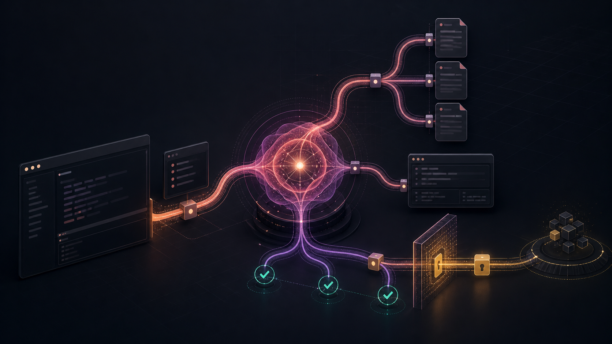
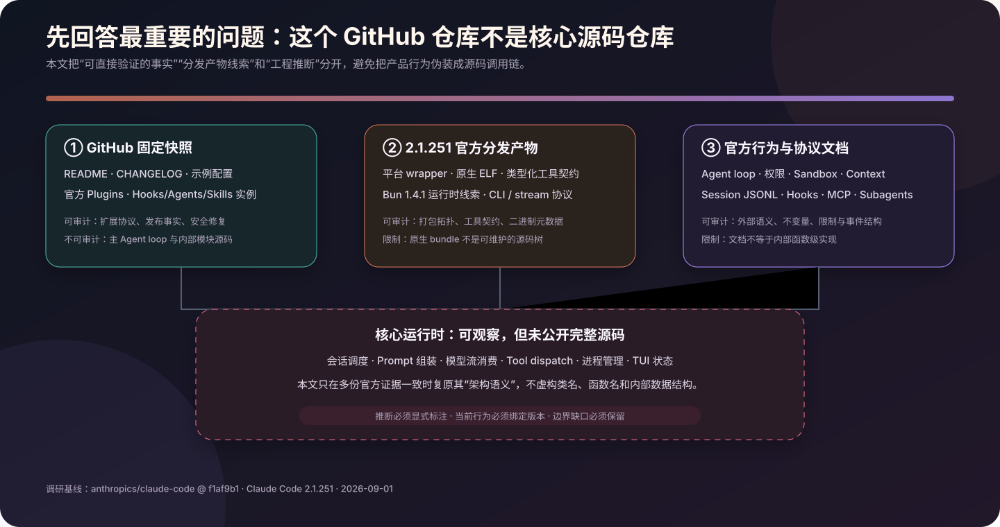
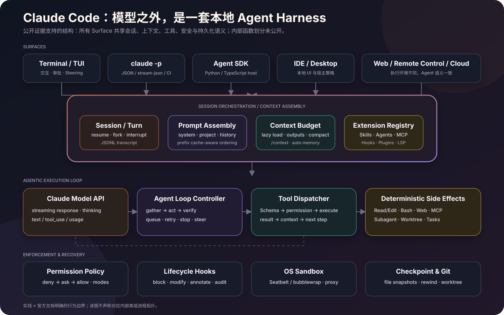
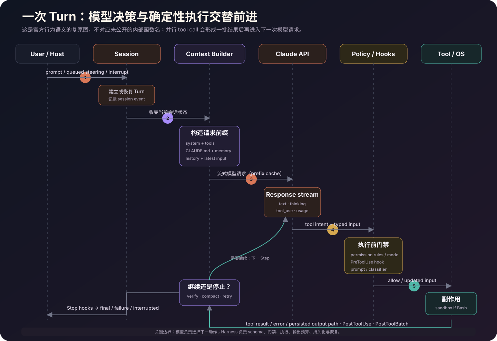
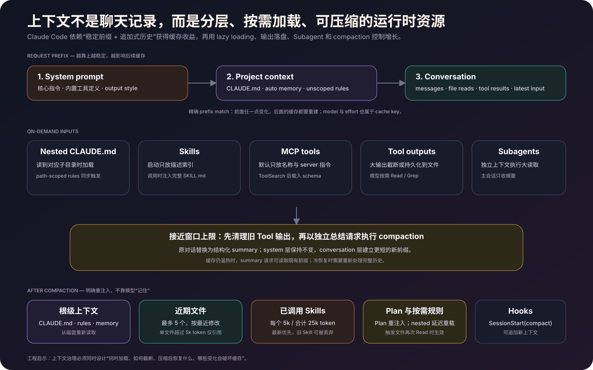
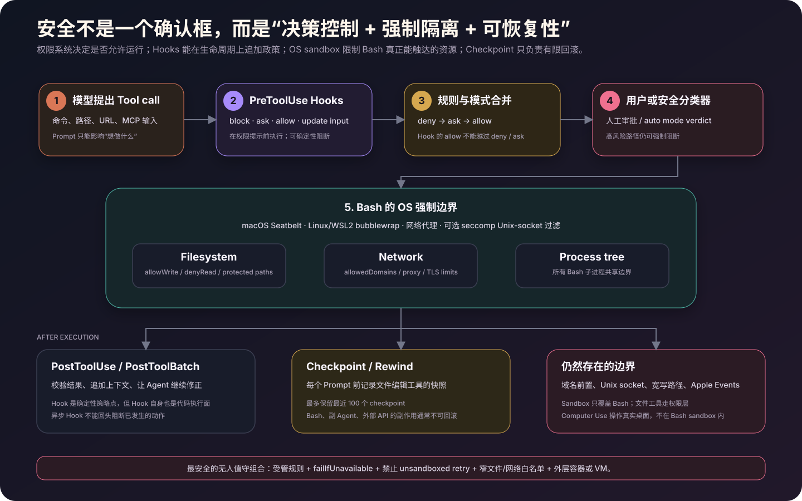
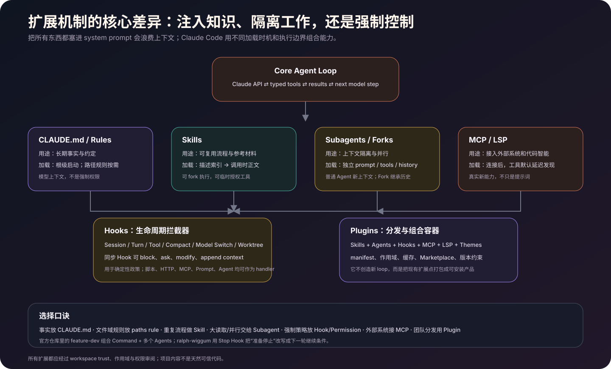

# 解剖 Claude Code：一个本地 Agent Harness 如何把模型变成工程系统

> 从发行形态、Agent Loop、工具调度、上下文工程与 Prompt Cache，到权限、OS 沙箱、会话恢复、多 Agent 和插件扩展的实现级调研。



Claude Code 的核心价值并不是“在终端里接入 Claude”。如果只做一次模型请求，再把 `git diff` 粘进 Prompt，几十行代码就够了。真正困难的是把一个概率模型包进一套能够长期运行的确定性外壳：它要组装上下文、声明工具、消费流式响应、执行副作用、处理权限与取消、控制输出体积、保存会话、压缩历史、恢复现场，还要允许团队把自己的规则和工具接进来。

站在大模型 Agent 工程师的角度，Claude Code 更准确的定义是：**以 Claude 为决策器、以本机工具和文件系统为执行环境、以权限与 Hook 为控制面、以 JSONL 会话和 Checkpoint 为恢复面的 Agent Harness。**

本文重点回答十个实现问题：

1. GitHub 仓库里究竟有没有 Claude Code 的核心源码？
2. 一条用户请求怎样演化成多轮模型调用和工具调用？
3. 工具为什么不是简单的 `function calling`，并行和串行如何划分？
4. CLAUDE.md、Memory、Skill 和工具输出怎样进入上下文？
5. Prompt Cache 为什么反过来约束了系统架构？
6. Permission、Hook、Sandbox 和 Checkpoint 各自解决哪一层风险？
7. Session、Resume、Fork、Rewind 和 Worktree 的状态语义有何不同？
8. Skill、Subagent、MCP、LSP、Plugin 如何组合而不污染核心循环？
9. `claude -p` 和 Agent SDK 如何把同一个运行时嵌入自动化系统？
10. 如果自己实现一个同类 Coding Agent，最值得复用哪些设计？

---

## 调研基线与证据边界

| 项目 | 本文基线 |
| --- | --- |
| 官方仓库 | [`anthropics/claude-code`](https://github.com/anthropics/claude-code) |
| 固定 Commit | [`f1af9b1f4b1fd4c776135381606edada82ef638e`](https://github.com/anthropics/claude-code/tree/f1af9b1f4b1fd4c776135381606edada82ef638e) |
| 仓库快照时间 | 2026-08-28 |
| Claude Code 版本 | `2.1.251` |
| 调研日期 | 2026-09-01 |
| 实物检查 | Linux x86-64 原生 ELF，约 205 MiB；内嵌 Bun `1.4.1` 运行时线索 |
| 方法 | 固定 Commit 静态检查、官方文档交叉验证、CLI 契约检查、公开 Plugin/Hook 源码追踪、分发产物元数据检查 |
| 不覆盖 | Claude 模型权重与服务端内部实现、未公开的运行时函数/类、云端控制面的私有代码 |



这里必须先澄清一个很容易导致整篇分析失真的事实：**这个 GitHub 仓库是公开仓库，但不是 Claude Code 核心运行时的源码仓库。** 固定快照中能看到 README、超过六千行的 CHANGELOG、安装与安全示例、官方 Plugin、Skill、Agent 和 Hook；看不到主 Agent Loop、TUI、模型流消费器、内置工具执行器等核心实现源码。仓库的 [`LICENSE.md`](https://github.com/anthropics/claude-code/blob/f1af9b1f4b1fd4c776135381606edada82ef638e/LICENSE.md) 也是 “All rights reserved”，不能把“代码可见”误写成“核心开源”。

官方 README 已将 npm 安装标为 deprecated，并推荐原生安装方式；本次环境中的 `~/.local/bin/claude` 也确实指向版本化原生 ELF。这个 ELF 含 Bun `1.4.1` 运行时字符串，说明当前 Linux 发行产物采用了 Bun 原生打包路线；它不等于一棵可维护、可逐函数引用的源码树。[README 安装说明](https://github.com/anthropics/claude-code/blob/f1af9b1f4b1fd4c776135381606edada82ef638e/README.md#L13-L50)

因此，本文使用三种证据等级：

- **直接事实**：官方文档、固定 Commit 中的公开源码、CLI 帮助、分发产物元数据。
- **架构复原**：多份官方契约共同支持的运行时语义，例如 Tool call 必须经过 Hook、权限和执行边界。
- **参考实现**：为了帮助工程落地而写的接口和伪代码；它们不声称是 Anthropic 内部真实类名或源文件。

---

## 先说结论：Claude Code 最值得研究的七个设计

**第一，模型只是策略层，Harness 才是产品。** 模型选择“下一步做什么”，Claude Code 负责工具 Schema、权限、执行、取消、流式事件、输出预算、持久化和恢复。把这两层混在一起，Agent 很快会变成不可测试的 Prompt 脚本。

**第二，Agent Loop 是“模型 step 与确定性副作用交替”的状态机。** 一轮模型响应可以带文本和一个或多个 Tool call；运行时执行工具，把结果作为新的消息交回模型，直到模型不再请求工具。Agent SDK 文档明确把这一循环描述为 Claude Code 同源运行时。[Agent Loop](https://code.claude.com/docs/en/agent-sdk/agent-loop)

**第三，上下文是资源，不是无限聊天记录。** 系统提示、项目上下文、对话与工具结果分层组织；Skill 和 MCP Schema 渐进加载；Subagent 隔离高吞吐读取；接近窗口上限时先清理旧 Tool 输出，再压缩历史。[Context Window](https://code.claude.com/docs/en/context-window)

**第四，Prompt Cache 是架构约束。** 稳定内容放在前缀前方，动态内容追加在后方。模型、effort、工具集合或系统提示变化会带来不同程度的 cache miss，所以“工具注册表稳定性”和“上下文装配顺序”直接影响成本与延迟。[Prompt Caching](https://code.claude.com/docs/en/prompt-caching)

**第五，安全是多层合取，不是一个确认框。** Permission 是应用策略，PreToolUse Hook 是可编程门禁，Sandbox 是 Bash 进程树的 OS 强制边界，Checkpoint 是有限恢复。任一层都不能替代其他层。[Permissions](https://code.claude.com/docs/en/permissions) · [Sandboxing](https://code.claude.com/docs/en/sandboxing)

**第六，扩展点按“知识、执行、控制、分发”正交拆分。** CLAUDE.md/Rules 注入长期知识，Skill 注入按需工作流，Subagent 隔离上下文，MCP/LSP 增加真实能力，Hook 强制生命周期策略，Plugin 负责组合和分发。

**第七，持久化的是事件与材料，不是模型记忆。** 会话持续写入本地 JSONL；Resume 恢复历史，Fork 复制历史生成新 ID，Checkpoint 保存文件编辑工具的快照，Worktree 隔离并行写入。每种机制都有不同的一致性边界。



---

## 一、产品形态：同一个 Agent Runtime，多种 Surface

Claude Code 已经不只是一个 TUI。官方把终端、IDE、Desktop、Web、Remote Control、CI/CD 与 Agent SDK 视为不同交互面或执行环境；本地、Cloud 和 Remote Control 的代码执行位置不同，但底层 Agentic Loop、工具与会话语义保持一致。[How Claude Code Works](https://code.claude.com/docs/en/how-claude-code-works)

从工程职责看，可以把公开行为还原为以下分层：

| 层 | 代表能力 | 核心职责 |
| --- | --- | --- |
| Surface | TUI、IDE、Desktop、`claude -p`、Web、Remote Control | 输入、展示、审批、Steering、流式事件消费 |
| Session Orchestrator | session、turn、resume、fork、background | 生命周期、队列、取消、恢复、跨轮状态 |
| Context Builder | system、CLAUDE.md、memory、skills、history | 构造稳定前缀和动态后缀，控制 token 预算 |
| Model Adapter | Claude API、Bedrock、Vertex、Foundry、Gateway | 流式请求、模型/effort、cache、usage、重试语义 |
| Agent Loop Controller | message → tool calls → results → next step | 决定循环、并发批次、停止和结果协议 |
| Tool Runtime | Read/Edit/Bash/Web/MCP/LSP/Agent | Schema 校验、执行、输出控制、错误归一化 |
| Policy Plane | permissions、modes、hooks、managed settings | `deny/ask/allow`、人工或分类器审批、组织策略 |
| Isolation & Recovery | sandbox、checkpoint、worktree、JSONL | OS 边界、撤销、隔离并行、崩溃恢复 |
| Extension Registry | skills、agents、plugins、MCP、LSP | 发现、作用域、按需加载、版本和分发 |

这套分层解释了为什么 TypeScript/Python Agent SDK 会捆绑原生 Claude Code binary：SDK 不是重写一份简化循环，而是把同一套 Harness 作为子进程运行，再把强类型消息流暴露给宿主程序。[Agent SDK Agent Loop](https://code.claude.com/docs/en/agent-sdk/agent-loop)

---

## 二、一次请求的完整生命线



### 2.1 Turn 不是“一问一答”，而是一次工具往返

Agent SDK 给出了最清晰的外部协议。一次 Session 启动后，宿主会依次观察到：

- `SystemMessage(init)`：session id、模型、工具等初始化元数据；
- `AssistantMessage`：Claude 的文本、thinking 和 Tool call；
- `UserMessage`：工具执行结果，语义上作为下一次模型输入；
- `StreamEvent`：开启 partial messages 后的原始 delta；
- `ResultMessage`：最终文本、token、成本、session id 和结束原因。

一个 **turn** 是一次“Claude 输出工具调用 → Harness 执行 → 工具结果回填”的完整往返。模型输出不含 Tool call 时，循环才自然停止。复杂任务可以有几十个 turn；生产环境可用 `maxTurns` 和 `maxBudgetUsd` 给循环设置硬边界，Subagent 开销也计入总预算。[消息与预算契约](https://code.claude.com/docs/en/agent-sdk/agent-loop)

用不带内部类名的伪代码表示：

```ts
async function runTurn(session: Session, userInput: Input) {
  session.append(userInput)

  while (!session.cancelled) {
    const request = await contextBuilder.build(session)
    const response = await model.stream(request)

    await eventSink.publish(response.textAndThinking)
    session.append(response.assistantMessage)

    if (response.toolCalls.length === 0) {
      await hooks.run("Stop", session.snapshot())
      return resultFrom(response, session.usage)
    }

    const results = await toolRuntime.executeBatch(response.toolCalls, {
      permissions,
      hooks,
      sandbox,
      cancellation: session.signal,
    })

    session.append(asToolResultMessage(results))
    await maybeCompact(session)
  }
}
```

这段代码最重要的不是 `while`，而是循环两侧的职责边界：

```text
模型：从当前世界状态中选择下一动作
Harness：验证动作 → 决策权限 → 执行副作用 → 记录真实结果
```

工具失败不是 JavaScript 异常直接冒泡到终端，而是需要归一化成模型能理解的 Tool result。被权限拒绝同样要进入模型上下文，使 Claude 能换一种方案或明确报告阻塞。

### 2.2 流式输出不只是 UI 优化

`stream-json` 会把每个事件作为一行 JSON 输出；最后一行是带结果、成本和会话元数据的 `result`。开启 partial messages 后还能拿到 token delta 和 Tool input chunk。当前实现还处理慢消费者：退出前等待输出队列排空，等待上限会随剩余数据量增长，最高 30 秒。[Non-interactive Mode](https://code.claude.com/docs/en/headless)

这意味着流协议至少承担四个工程职责：

1. TUI/IDE 能即时显示 reasoning、文本和工具进度；
2. 宿主能用 `parent_tool_use_id` 重建 Subagent 嵌套树；
3. 取消、API 错误、预算耗尽能成为显式 terminal event；
4. CI 或上层 Agent 平台不必解析人类终端文本。

### 2.3 并行不是“所有 Tool call 一起 Promise.all”

官方 SDK 语义规定：`Read`、`Glob`、`Grep` 等只读工具可以并发；`Edit`、`Write`、`Bash` 等修改状态的工具串行执行，避免竞态。自定义工具默认串行，只有通过 MCP annotation 的 `readOnlyHint` 明确标注只读后才进入并行组。[Parallel Tool Execution](https://code.claude.com/docs/en/agent-sdk/agent-loop)

一个合理的调度器不是按工具名写死全部规则，而是按 capability 做屏障：

```ts
for (const call of modelOrder) {
  if (registry.get(call.name).effects === "read-only") {
    pendingReads.push(run(call))
    continue
  }

  await flushReadsInModelOrder()
  results.push(await run(call))
}
await flushReadsInModelOrder()
```

真实完成顺序可以不同，但回填顺序最好稳定。否则相同模型输出可能因 I/O 时序不同形成不同历史，降低可复现性。

### 2.4 “验证完成”不是 Harness 天然保证

当模型输出不再包含工具调用，Agent Loop 的协议意义是“模型决定停止”，不是“测试一定通过”。Claude Code 用三种机制提高完成可信度：

- System/Skill/CLAUDE.md 提醒模型在结束前验证；
- Stop Hook 可以检查条件，不满足时把原因反馈给 Claude 继续工作；
- 外层 SDK/CI 根据结构化结果、测试日志或自定义 Hook 再做独立验收。

这一区分很关键：**LLM 的 self-report 不是完成证明；确定性验收应该位于模型循环之外或 Hook 控制点。**

---

## 三、工具运行时：Function Calling 之后还有半个操作系统

Claude Code 的内置工具大体分为：文件操作、代码搜索、命令执行、Web、工具发现、LSP、任务/监控和 Agent 编排。完整清单与每个工具的审批需求见官方 [Tools Reference](https://code.claude.com/docs/en/tools-reference)。

一条 Tool call 的实际路径可以复原为：

```text
tool_use block
  → tool name / input schema 校验
  → PreToolUse hooks（可阻断、要求审批、改写输入）
  → deny / ask / allow 与 permission mode 合并
  → 人工审批或 auto classifier（如需要）
  → 选择直接执行或 Bash sandbox
  → 收集 stdout / stderr / exit / structured content
  → PostToolUse / PostToolBatch
  → 规范化 Tool result
  → 追加进 Session 与下一次模型请求
```

### 3.1 Bash 是有状态体验、无状态进程

每次 Bash Tool call 都在独立进程中运行。主会话中的 `cd` 可以由 Harness 记录并带到后续命令，但 `export` 的环境变量不会自然保留；Shell 启动文件中的 alias、function 和 option 会在 Session 启动时捕获并应用。Subagent 不继承 `cd` 的目录变化。[Bash Tool Behavior](https://code.claude.com/docs/en/tools-reference)

这是一个典型的 Harness 抽象：用户感觉自己在使用连续 Shell，底层却用短生命周期进程换取取消、超时和隔离的可控性。

### 3.2 输出必须预算化

命令输出会先流入工作文件。成功结果大约 30,000 字符以内联方式返回；更大时返回 session 目录中的文件路径与开头预览，模型需要时再 Read/Grep。失败结果只给更小的 head/tail 摘要。命令总输出超过 5 GB 会被终止。[Bash Output Limits](https://code.claude.com/docs/en/tools-reference)

这是优秀 Agent Runtime 必须具备的“反上下文爆炸”设计：

- 完整证据落盘，避免信息永久丢失；
- 小预览进入上下文，帮助模型判断下一步；
- 后续访问通过文件工具按需完成；
- 成功与失败使用不同截断策略，因为错误末尾通常更有价值。

### 3.3 Read-before-edit 是局部一致性检查

Edit 使用精确 `old_string → new_string` 替换，不做 fuzzy match；文件在当前对话中被读取、旧字符串精确匹配、替换歧义等条件必须通过。较新模型在无需额外权限且 Read 可用时可以跳过部分 read-before-edit 限制，但 Jupyter Notebook 和 partial read 仍有更严格规则。[Edit Tool Behavior](https://code.claude.com/docs/en/tools-reference)

这个约束不能解决所有并发问题，却能显著降低“模型基于旧版本文件盲写”的概率。它是乐观并发控制在 Agent 文件编辑中的轻量版本。

### 3.4 MCP 的关键不只是接工具，而是延迟 Tool Schema

MCP 可通过本地 stdio、HTTP、SSE 或 WebSocket 接入服务。更值得关注的是 Tool Search：默认只把工具名和 Server instructions 放入初始上下文，完整 Tool Schema 在 Claude 判断相关后才加载。`ENABLE_TOOL_SEARCH=auto:N` 还能按上下文比例决定何时预加载。[MCP Tool Search](https://code.claude.com/docs/en/mcp)

这解决了“大工具宇宙”中的两个问题：

- 一百个外部工具的 JSON Schema 不再永久挤占每个请求；
- 工具集合更稳定时，System prefix 更容易复用 Prompt Cache。

但工具发现并非零成本：名称和 server instructions 仍占上下文，命名质量直接影响召回。MCP Server 应把“何时搜索我”和核心能力放在 instructions 前部，而不是写成长篇产品介绍。

---

## 四、上下文工程：把 Prompt 变成可治理的 World State



### 4.1 请求按稳定性排序

官方 Prompt Cache 文档把一次请求分成三层：

1. **System prompt**：核心指令、内置工具定义、output style；
2. **Project context**：CLAUDE.md、auto memory、无路径范围的 Rules；
3. **Conversation**：用户消息、Claude 响应、Tool call 与 Tool result。

Claude API 使用精确 prefix match，没有“按文件缓存”或“按段落缓存”。前面任一点变化，后方缓存都会重算。因此 Claude Code 把最稳定内容放在前面，把 Plan、Skill 调用等作为对话消息追加在后方。[Cache Layering](https://code.claude.com/docs/en/prompt-caching)

模型和 effort 虽不属于 Prompt 文本，却属于 cache key；切换任一项都会让下一次请求重读完整历史。Fast mode、工具定义集合、版本升级也可能影响缓存。相反，普通文件编辑不会改写旧的 File Read，而是追加“文件已变化”的提醒，所以不会破坏之前的 prefix。

### 4.2 CLAUDE.md 不是强制策略

CLAUDE.md 是人写的长期指令，Auto Memory 是 Claude 自己维护的项目经验。根级文件在 Session 启动时加载；子目录 CLAUDE.md 在 Claude 第一次读取对应目录文件时按需加载；`.claude/rules/` 可用 `paths:` 将规则限定到文件类型或目录。[Memory and CLAUDE.md](https://code.claude.com/docs/en/memory)

Auto Memory 的 `MEMORY.md` 只在启动时注入前 200 行或 25 KB，详细信息放进主题文件后按需读取。所有 worktree 和仓库子目录共享同一个 repository memory；不同机器和云环境不自动共享。

需要牢记：CLAUDE.md 与 Memory 都是模型上下文，不是安全边界。模型可能因冲突、模糊或长上下文而不遵守它们。必须执行的政策要写成 Permission、Hook 或 OS Sandbox。

### 4.3 Skill 使用 progressive disclosure

常规 Skill 在 Session 启动时只注入 `name + description`，完整 `SKILL.md` 在 Claude 或用户真正调用时才进入上下文。设置 `disable-model-invocation: true` 后，连描述都不会放进常规上下文，只能由用户显式调用；`context: fork` 则把 Skill 放到独立 Subagent 中运行。[Skills](https://code.claude.com/docs/en/skills)

这相当于两级索引：

```text
Level 1：短描述，解决“有没有这种能力”
Level 2：完整说明与参考文件，解决“具体怎样做”
```

调用后的 Skill 正文会留在对话中，仍然产生持续 token 成本；同一渲染内容再次调用时只追加“已经加载”的短提示。Skill 所以应该短、强约束、把大篇参考材料拆成按需文件。

### 4.4 Compaction 不是普通摘要

接近上下文上限时，Claude Code 先清理较老的 Tool 输出，再用摘要替换早期历史。压缩会打断 conversation prefix，却保留 system 层，并从磁盘重注入项目级材料。官方给出了非常具体的压缩后规则：

| 内容 | Compaction 后 |
| --- | --- |
| System prompt / output style | 保持不变 |
| 根级 CLAUDE.md / 无作用域 Rules | 从磁盘重新注入 |
| Auto Memory | 从磁盘重新注入 |
| Plan mode 计划 | 从磁盘重新注入 |
| 最近读写文件 | 最多重读 5 个，最近修改优先；单文件超过 5,000 tokens 只给路径引用 |
| 已调用 Skill | 每个最多 5,000 tokens、合计 25,000；旧 Skill 先淘汰 |
| Nested CLAUDE.md / path Rules | 重读触发文件时重新加载 |
| Hook 旧上下文 | 随历史被总结；`SessionStart(compact)` 可注入新上下文 |

详见官方 [Context Window](https://code.claude.com/docs/en/context-window) 与 [Skills 生命周期](https://code.claude.com/docs/en/skills)。

这说明 Compaction 的本质是一次 **状态重建协议**：摘要保存工作状态，确定性文件重新读取权威信息，近期文件恢复局部工作集。不能只做一句“请总结对话”，否则压缩后会丢掉权限约定、计划、文件版本和可执行流程。

---

## 五、安全模型：决策控制、强制隔离与有限恢复



### 5.1 Permission：由 Harness 执行的策略语言

规则格式是 `Tool` 或 `Tool(specifier)`，结果分为 `deny`、`ask`、`allow`，固定优先级是：

```text
deny → ask → allow
```

优先级高于 specificity。`Bash(aws *)` 的 deny 不会被更具体的 `Bash(aws s3 ls)` allow 推翻；ask 也优先于 allow。裸工具 deny 会直接从模型可见工具集合中移除该工具，带参数的 deny 则保留工具，只在调用匹配时阻断。[Permission Evaluation](https://code.claude.com/docs/en/permissions)

常见 mode 的语义是：

| Mode | 行为 |
| --- | --- |
| Manual / `default` | 未被 allow 覆盖的敏感操作向用户询问 |
| `acceptEdits` | 自动接受工作目录内文件编辑和常见文件操作，其他 Bash 仍走规则 |
| `plan` | 以探索和规划为主，不直接修改源文件 |
| `auto` | 由后台安全分类器判断大部分待审批动作是否符合用户请求 |
| `dontAsk` | 永不弹窗；预先 allow 的执行，其余硬拒绝 |
| `bypassPermissions` | 跳过大部分审批，只应在容器或 VM 等外层隔离环境使用 |

组织级 Managed Settings 优先级最高；CLI、local project、shared project、user 依次降低。数组通常跨 scope 合并，但 deny 从任何 scope 都能压过 allow。项目中的 capability-granting allow 和 additionalDirectories 只有在 workspace trust 后才生效。[Settings Precedence](https://code.claude.com/docs/en/configuration)

### 5.2 PreToolUse Hook：可编程策略点

PreToolUse 在权限提示前执行，可以阻断、强制询问、允许或改写 Tool input；但 Hook 的 allow 不能越过现有 deny/ask。返回 code 2 的 command hook 会在权限规则求值前直接阻断。[Hooks](https://code.claude.com/docs/en/hooks) · [Permissions and Hooks](https://code.claude.com/docs/en/permissions)

官方仓库中的 [`bash_command_validator_example.py`](https://github.com/anthropics/claude-code/blob/f1af9b1f4b1fd4c776135381606edada82ef638e/examples/hooks/bash_command_validator_example.py#L31-L83) 展示了最小实现：从 stdin 读取 JSON，检查 `tool_name` 和 `tool_input.command`，发现不合规命令时向 stderr 写原因并以 code 2 退出。

Hook handler 不只可以是 Shell：当前协议还支持 HTTP、MCP Tool、单次 Prompt 判断以及实验性的 Agent verifier。它们适合不同强度的策略：

- 正则/Schema/签名校验：command hook；
- 集中审计服务：HTTP hook；
- 外部策略引擎：MCP hook；
- 只需语义判断：prompt hook；
- 必须读代码或运行测试：agent hook。

Hook 自身也是代码执行面。来自仓库或 Plugin 的 Hook 必须进入供应链审计，而不能因为名字叫“安全 Hook”就默认可信。

### 5.3 Sandbox：只对 Bash 进程树提供 OS 强制边界

Claude Code 的 Sandbox 在 macOS 使用 Seatbelt，在 Linux/WSL2 使用 bubblewrap；网络经 Sandbox 外的 proxy 转发，所有 Bash 子进程继承相同文件系统与网络边界。默认写权限限于工作目录，读权限较宽但排除配置的敏感路径。[Sandboxing](https://code.claude.com/docs/en/sandboxing)

Permission 与 Sandbox 的区别是：

```text
Permission：Harness 决定“这次调用应不应该执行”
Sandbox：OS 决定“即使执行了，进程实际能触达什么”
```

Read/Edit 等内置文件工具主要受 Permission 控制；Sandbox 针对 Bash 及其子进程。仅配置 `Read(.env)` deny 并不能阻止任意 Python 子进程自行打开 `.env`，需要 Sandbox filesystem deny 才能覆盖进程级访问。

无人值守环境至少应设置：

```json
{
  "sandbox": {
    "enabled": true,
    "failIfUnavailable": true,
    "allowUnsandboxedCommands": false
  }
}
```

官方仓库也提供了 [`settings-bash-sandbox.json`](https://github.com/anthropics/claude-code/blob/f1af9b1f4b1fd4c776135381606edada82ef638e/examples/settings/settings-bash-sandbox.json) 与 [`settings-strict.json`](https://github.com/anthropics/claude-code/blob/f1af9b1f4b1fd4c776135381606edada82ef638e/examples/settings/settings-strict.json) 作为策略样例。

Sandbox 仍有明确边界：默认 proxy 根据客户端提供的 hostname 做 allowlist 且不检查 TLS 内容；宽域名可能带来 domain fronting 风险；Docker socket 等 Unix socket 等价于宿主高权限；允许写 `$PATH`、Shell profile 或系统配置可形成权限提升；Apple Events 与 weaker nested sandbox 都会降低隔离强度。高风险生产场景仍应增加外层 container/VM、最小凭据与 egress proxy。

### 5.4 Symlink 与 TOCTOU 是文件 Agent 的高频漏洞

权限检查必须同时看 symlink 路径和真实 target：allow 要求两者都满足，deny 任一满足就阻断；文件真正打开时还要重新确认路径仍解析到审批时的位置，防止“审批后交换 symlink”的 TOCTOU。[Symlink Permission Rules](https://code.claude.com/docs/en/permissions)

`2.1.251` 的 CHANGELOG 正好包含多项相关修复：Read/Write/Edit 的 symlink swap、Plugin command path traversal、Workflow `scriptPath` 越界、Grep/Glob 经 symlink 绕过 Read deny。[2.1.251 Changelog](https://github.com/anthropics/claude-code/blob/f1af9b1f4b1fd4c776135381606edada82ef638e/CHANGELOG.md#L3-L15)

这说明路径安全不能只做一次 `startsWith(workspace)`：至少要 canonicalize、检查每个 hop、在 open 时抵御交换，并把 search root 与返回结果都纳入策略。

### 5.5 Checkpoint 是“有限撤销”，不是事务回滚

每个用户 Prompt 创建 Checkpoint，Session 最近保留 100 个文件快照，并随会话恢复。它只覆盖 Claude 文件编辑工具的修改；Bash 中的 `rm/mv/cp`、外部 API、数据库、部署、绝大多数 Subagent 编辑、symlink/hardlink 文件都不能靠 Rewind 恢复。[Checkpointing](https://code.claude.com/docs/en/checkpointing)

因此安全工程上应该这样理解：

- Checkpoint 降低误编辑成本；
- Git 提供长期版本历史；
- Worktree 隔离并行文件副作用；
- 外部副作用仍需要幂等 API、dry-run、审批和补偿事务。

---

## 六、Session：JSONL Event Log、Resume、Fork 与 Rewind

Session 与项目目录绑定，并持续写入：

```text
~/.claude/projects/<project>/<session-id>.jsonl
```

每行是 message、tool use 或 metadata JSON 对象；默认按 30 天清理，可用 `cleanupPeriodDays` 调整，也可在 print mode 用 `--no-session-persistence` 禁用。[Manage Sessions](https://code.claude.com/docs/en/sessions)

几种常被混用的状态操作实际语义不同：

| 操作 | 对话历史 | Session ID | 文件状态 | 主要用途 |
| --- | --- | --- | --- | --- |
| Resume | 恢复并继续追加 | 不变 | 使用当前磁盘状态 | 继续同一工作 |
| Fork / Branch | 复制到分叉点 | 新 ID | 共享当前磁盘，除非另加 worktree | 尝试另一思路 |
| `/clear` | 新上下文，旧会话仍可恢复 | 当前交互语义重置 | 不改文件 | 完全换任务 |
| `/compact` | 用摘要替换模型可见旧历史 | 不变 | 不改文件 | 节省上下文 |
| Rewind conversation | 截断到旧 turn | 不变 | 可选不恢复文件 | 回到旧推理分支 |
| Restore code | 对话可保留 | 不变 | 恢复受 Checkpoint 覆盖的编辑 | 撤销直接文件修改 |
| Worktree | 独立 Session | 独立 | 独立 Git 工作目录/分支 | 真正隔离并行写入 |

JSONL 的价值不只是 Resume。官方 `ralph-wiggum` Plugin 的 Stop Hook 会从 hook input 取得 `transcript_path`，再读取最后一条 assistant message，检查 completion promise；若未完成，则返回 `decision: block` 和原 Prompt，驱动下一轮。[Ralph Stop Hook](https://github.com/anthropics/claude-code/blob/f1af9b1f4b1fd4c776135381606edada82ef638e/plugins/ralph-wiggum/hooks/stop-hook.sh#L57-L174)

这段公开源码证明 Session log 已成为稳定的扩展协议，而不仅是 UI 私有缓存。它也展示了 event-log 架构的优势：Hook 可以审计已经发生的消息，崩溃后能恢复，外部程序也能做导出与分析。

但 JSONL 不是数据库事务。两终端同时 Resume 同一个 Session 时，消息可能交错；Fork 也不会自动隔离工作树。需要并行编辑时应同时使用独立 Session 和 Git Worktree。`claude --worktree <name>` 默认在仓库 `.claude/worktrees/<name>/` 创建新 worktree 与分支。[Worktrees](https://code.claude.com/docs/en/worktrees)

---

## 七、扩展系统：按职责选择，而不是全写进 Prompt



| 机制 | 本质 | 何时进入上下文/执行 | 适合 | 不适合 |
| --- | --- | --- | --- | --- |
| CLAUDE.md | 长期项目说明 | 根级启动，nested 按目录读取 | 构建命令、架构、团队约定 | 强制安全策略 |
| Rules | 带 paths 的说明 | 匹配文件被读取时 | 语言/目录专属规范 | 跨工具编排 |
| Skill | 可调用知识与工作流 | 描述先加载，正文调用时加载 | 重复流程、参考材料、手工命令 | 创建全新外部能力 |
| Subagent | 独立 Agent Loop | 单独上下文与工具集合 | 大量读取、专项研究、并行任务 | 需要完整主对话细节的微小操作 |
| Hook | 生命周期拦截器 | 事件触发 | 审批、审计、自动格式化、Stop gate | 大量常驻知识 |
| MCP | 外部工具/资源协议 | 连接后按需发现工具 | SaaS、数据库、浏览器、内部 API | 纯文字规范 |
| LSP | 语言服务能力 | Plugin/配置启用后 | definition、references、diagnostics | 业务外部系统 |
| Plugin | 安装与分发容器 | 启用后发现组件 | 团队复用和版本管理 | 替代核心 Agent Loop |

Plugin 可以组合 Skills、Agents、Hooks、MCP、LSP、Monitors、可执行文件和有限默认设置；Manifest 位于 `.claude-plugin/plugin.json`，其他组件位于 Plugin 根目录，而不是塞进 `.claude-plugin/`。[Plugins Reference](https://code.claude.com/docs/en/plugins-reference)

### 7.1 `feature-dev`：Prompt 工作流 + 专项 Subagent

官方 [`feature-dev`](https://github.com/anthropics/claude-code/tree/f1af9b1f4b1fd4c776135381606edada82ef638e/plugins/feature-dev) Plugin 没有修改核心 Loop。它用一个 command 定义 Discovery、探索、澄清、架构、实现、Review、总结七阶段，再用 `code-explorer`、`code-architect`、`code-reviewer` 三类 Agent 承接独立上下文工作。[Command 工作流](https://github.com/anthropics/claude-code/blob/f1af9b1f4b1fd4c776135381606edada82ef638e/plugins/feature-dev/commands/feature-dev.md#L20-L123)

工程模式是：

```text
Skill / Command：编排阶段与交付契约
Subagent：隔离高吞吐探索或独立评审
主 Agent：读回关键证据、与用户决策、综合与执行
```

### 7.2 `code-review`：冗余发现 + 独立验证降低假阳性

官方 Code Review Plugin 会并行启动多个 Agent，用不同视角检查 CLAUDE.md 合规和明确 Bug；对候选问题再启动验证 Agent，过滤未被确认的问题，最后才决定是否发布评论。[Code Review Command](https://github.com/anthropics/claude-code/blob/f1af9b1f4b1fd4c776135381606edada82ef638e/plugins/code-review/commands/code-review.md)

这比“让一个模型给自己打置信分”更可靠：候选生成与证据验证分离，不同上下文降低锚定偏差，外部副作用（发评论）放在最后一步。

### 7.3 `ralph-wiggum`：用 Stop Hook 改写停止条件

Ralph Plugin 初始化一个本地状态文件，Stop Hook 读取迭代次数和会话最后输出；达到最大迭代或 completion promise 才允许停止，否则返回 block，把同一 Prompt 注入下一轮。[Command](https://github.com/anthropics/claude-code/blob/f1af9b1f4b1fd4c776135381606edada82ef638e/plugins/ralph-wiggum/commands/ralph-loop.md#L1-L18) · [Stop Hook](https://github.com/anthropics/claude-code/blob/f1af9b1f4b1fd4c776135381606edada82ef638e/plugins/ralph-wiggum/hooks/stop-hook.sh#L114-L174)

它揭示了 Hook 的强大之处：不必 fork 核心循环，就能把“模型想结束”变成一个可编程状态转移。不过 completion promise 仍是模型自报，生产系统应把它替换为测试、Schema、监控指标或人工审批。

---

## 八、Subagent、Fork、Agent Team 与 Worktree

### 8.1 Subagent 是上下文隔离，不等于文件隔离

普通 Subagent 有自己的 context window、system prompt、工具集和权限。它看不到主会话的完整历史、已读文件或已调用 Skill；主 Agent 会生成一条 delegation message，最终只接收摘要。Fork 是例外：它从父对话副本开始。[Subagents](https://code.claude.com/docs/en/sub-agents)

默认最多三层嵌套；同一 Session 默认运行到 20 个并发 Subagent 后会拒绝继续 spawn。这些是资源和递归护栏，不是总数限制。后台 Subagent 可并行运行，权限请求会回到主 Session；其 Tool call 仍按自己的权限规则检查。

Subagent 与主 Agent 默认共享工作目录，所以两个写入 Agent 仍可能改到同一文件。需要副作用隔离时，在 Agent definition 中使用 `isolation: worktree`，或让外层 Session 从一开始就运行在独立 worktree。

### 8.2 Agent Team 是多个独立 Session 的协作协议

Agent Team 当前仍是实验功能。Team lead 与 Teammate 各有独立上下文；Teammate 加载项目 CLAUDE.md、MCP 和 Skills，只收到 lead 的 spawn prompt，不继承 lead 历史。它们通过直接消息和共享 task list 协作，token 成本随活跃实例数增长。[Agent Teams](https://code.claude.com/docs/en/agent-teams)

选择标准可以简化为：

| 需求 | 选择 |
| --- | --- |
| 大量搜索，只要最终摘要 | Subagent |
| 需要父上下文，但不污染父历史 | Fork |
| 多个角色要相互质疑、动态分工 | Agent Team |
| 多个 Agent 要同时修改仓库 | 每个 Session/Agent 配独立 Worktree |
| 顺序强依赖或修改同一文件 | 单 Agent 更稳妥 |

多 Agent 的主要收益来自 wall-clock 并行和认知多样性，代价是 token、协调、文件冲突和完成状态判断。只有任务能被真正独立切分时，增加 Agent 才会带来净收益。

---

## 九、Headless 与 Agent SDK：把 CLI 变成可嵌入 Runtime

`claude -p` 支持三种输出：纯文本、单个 JSON、逐行 `stream-json`；`--json-schema` 可约束最终 structured output。输入也可用 `stream-json` 持续注入消息，Session 可用 ID Resume 或 Fork。[Run Programmatically](https://code.claude.com/docs/en/headless)

典型 CI 命令：

```bash
claude -p "Review this change" \
  --permission-mode dontAsk \
  --allowedTools "Read,Grep,Glob,Bash(git diff *)" \
  --max-budget-usd 2 \
  --output-format json \
  --json-schema '{"type":"object","properties":{"ok":{"type":"boolean"},"findings":{"type":"array","items":{"type":"string"}}},"required":["ok","findings"]}'
```

Agent SDK 在此基础上增加：

- TypeScript/Python 的 message union；
- async iterator 流式消费；
- `canUseTool` 人工审批回调；
- custom MCP tools；
- Session store adapter；
- max turns、budget、effort、model、permission mode；
- Hook 和 Subagent 定义。

生产宿主应把 SDK 看成一个长运行、会产生副作用的 worker，而不是普通 RPC：

- 读取流直到真正结束，不要看到 `ResultMessage` 就立即断管道，因为可能有尾随系统事件；
- 取消时同时终止模型流、Bash 子进程、Subagent 和后台任务；
- 将 budget、tool allowlist 和 wall-clock timeout 分开设置；
- 把 Session 文件同步到持久化存储时，保留单写者或版本控制；
- 结构化输出只约束最终结果，不自动约束中间 Tool 副作用。

---

## 十、一个可复用的参考实现蓝图

下面是根据公开契约抽象出的模块接口，不是 Claude Code 私有源码：

```ts
interface SessionStore {
  append(sessionId: string, event: SessionEvent): Promise<void>
  load(sessionId: string): Promise<SessionState>
  fork(sessionId: string, at?: EventId): Promise<string>
}

interface ContextBuilder {
  build(state: SessionState): Promise<ModelRequest>
  compact(state: SessionState, focus?: string): Promise<CompactionResult>
}

interface ToolDefinition<I, O> {
  name: string
  inputSchema: JsonSchema<I>
  effects: "read-only" | "workspace-write" | "external"
  execute(input: I, ctx: ToolContext): Promise<O>
}

interface PolicyEngine {
  decide(call: ToolCall, state: SessionState): Promise<
    | { kind: "allow"; input: unknown }
    | { kind: "ask"; reason: string }
    | { kind: "deny"; reason: string }
  >
}

interface EventSink {
  publish(event: RuntimeEvent): Promise<void>
}
```

### 10.1 上下文装配器

```ts
async function buildRequest(s: SessionState): Promise<ModelRequest> {
  return {
    model: s.model,
    system: [
      coreInstructions,
      stableBuiltinToolDefinitions(s.visibleTools),
      s.outputStyle,
    ],
    messages: [
      projectContextCache.get(s.project),
      ...s.compactedPrefix,
      ...s.events.toModelMessages(),
      ...s.pendingUserInputs,
    ],
    tools: toolSearch.materializeSelectedSchemas(s),
  }
}
```

实现重点不是字符串拼接，而是：稳定排序、来源标记、去重、作用域、token 计数、cache invalidation 原因和 compaction 后重注入。

### 10.2 权限流水线

```ts
async function authorize(call: ToolCall, ctx: ToolContext) {
  const rewritten = await hooks.preToolUse(call, ctx)
  if (rewritten.blocked) return denied(rewritten.reason)

  const rule = permissions.firstMatch(
    ["deny", "ask", "allow"],
    rewritten.call,
  )

  if (rule?.kind === "deny") return denied(rule.reason)
  if (rule?.kind === "ask" || !rule) {
    return permissionMode.resolve(rewritten.call, ctx)
  }
  return allowed(rewritten.call)
}
```

实际系统还必须处理 managed policy、workspace trust、protected paths、MCP interaction annotations、compound shell parser、重定向、symlink 与 TOCTOU。

### 10.3 Compaction 协议

```ts
async function compact(s: SessionState) {
  await hooks.preCompact(s)

  const summary = await summarizer.run({
    immutableGoal: s.goal,
    decisions: s.decisions,
    modifiedFiles: s.modifiedFiles,
    testEvidence: s.testEvidence,
    unresolvedRisks: s.unresolvedRisks,
    recentEvents: s.events,
  })

  s.replaceModelHistory(summary)
  s.inject(await projectContext.reloadFromDisk())
  s.inject(await recentFiles.reload({ limit: 5 }))
  s.inject(await skills.restoreWithinBudget())
  await hooks.postCompact(s)
}
```

### 10.4 最小可用开发顺序

如果从零实现同类产品，建议按以下顺序推进：

1. **单模型、单 Session、只读工具**：先跑通 typed tool loop 和 event stream。
2. **可取消副作用工具**：加入 Bash/Edit、timeout、process group、输出落盘。
3. **权限与路径安全**：deny/ask/allow、workspace roots、symlink canonicalization。
4. **持久化与恢复**：append-only event log、resume、fork、幂等 terminal event。
5. **上下文预算**：token accounting、Tool output truncation、compaction 与 stable prefix。
6. **OS sandbox**：文件系统、网络代理、fail-closed 配置。
7. **扩展系统**：Skill、Hook、MCP，再到 Subagent 与 Plugin。
8. **多 Agent**：最后做，先解决 worktree、消息和任务所有权。

这个顺序的原则是：先让单 Agent 的副作用可观察、可限制、可恢复，再增加自治和并行。

---

## 十一、工程评价：优势、代价与可改进处

### 值得复用

1. **把 Agent Loop 做成协议，而不是 UI 回调。** TUI、headless 和 SDK 都能消费同一类消息与结果。
2. **渐进披露贯穿系统。** Nested CLAUDE.md、Skill body、MCP Schema、Subagent summary 都只在需要时进入主上下文。
3. **Prompt Cache 与 Context Budget 联合设计。** 很多 Agent 只做截断，却没有管理前缀稳定性，结果成本与延迟仍然失控。
4. **安全层彼此独立。** Model guidance、permission、hook、sandbox、checkpoint 都有清晰边界。
5. **扩展机制正交。** 知识、外部能力、生命周期控制、上下文隔离和分发没有挤进一个万能 Plugin API。
6. **公开 Plugin 是可运行的架构文档。** `feature-dev`、`code-review`、`ralph-wiggum` 展示了组合式 Agent 工作流，而不是只给概念说明。

### 需要警惕

1. **核心 Runtime 闭源。** 外部只能验证行为契约与分发产物，无法独立审计内部 Prompt、调度器和所有安全实现。
2. **版本变化极快。** `2.1.251` 单个版本就包含模型切换 Hook、cache 指标、Subagent streaming 和大量路径安全修复；任何内部行为分析都必须绑定版本。[Changelog](https://github.com/anthropics/claude-code/blob/f1af9b1f4b1fd4c776135381606edada82ef638e/CHANGELOG.md)
3. **Compaction 仍然有损。** 早期细节会被摘要，旧 Skill 可能因预算淘汰；真正持久的规则必须放回文件。
4. **Permission 不是完整 sandbox。** 它需要理解 shell compound command、redirect、wrapper 和路径解析；任一 parser gap 都可能扩大能力。
5. **Checkpoint 覆盖不完整。** Bash、外部系统和多数 Subagent 编辑都不在事务内，不能把 Rewind 当作万能保险。
6. **Plugin 与 Hook 扩大供应链面。** 项目目录可以携带会执行的 Hook、Skill shell command、MCP 配置和 Plugin binary，workspace trust 与组织策略不可省略。
7. **多 Agent 默认共享物理世界。** Context 隔离容易，文件、端口、数据库和部署目标的隔离更难；需要显式 ownership 和 worktree。

---

## 十二、最终判断

Claude Code 的实现思想可以浓缩为一句话：

> **让模型在一个不断更新的世界状态上做下一步决策，让 Harness 用确定性机制执行、约束、记录并恢复这个决策。**

它最成熟的地方，不是某个神秘 System Prompt，而是围绕模型构建的工程闭环：

```text
Context Assembly
  → Model Decision
  → Typed Tool Intent
  → Policy / Hook / Sandbox
  → Deterministic Side Effect
  → Persisted Evidence
  → Verification or Compaction
  → Next Decision
```

对于自研 Agent 平台，真正应该复制的也不是 Claude Code 的界面，而是这些不变量：

- 每个副作用都有结构化意图、策略判定和真实结果；
- 每个长任务都有预算、取消、输出上限和恢复点；
- 每份上下文都知道来源、加载时机、token 成本与压缩命运；
- 每种扩展能力都有作用域、信任边界和生命周期；
- 每个“完成”都尽可能落到可验证证据，而非模型自述。

当这些基础设施齐备后，更强的模型会自然转化为更强的 Agent；如果这些基础设施缺失，模型越能行动，系统反而越难控制。

---

## 主要资料

### 固定仓库证据

- [Claude Code 固定快照 `f1af9b1`](https://github.com/anthropics/claude-code/tree/f1af9b1f4b1fd4c776135381606edada82ef638e)
- [README 与发行方式](https://github.com/anthropics/claude-code/blob/f1af9b1f4b1fd4c776135381606edada82ef638e/README.md)
- [2.1.251 CHANGELOG](https://github.com/anthropics/claude-code/blob/f1af9b1f4b1fd4c776135381606edada82ef638e/CHANGELOG.md#L3-L75)
- [官方 Plugin 目录](https://github.com/anthropics/claude-code/tree/f1af9b1f4b1fd4c776135381606edada82ef638e/plugins)
- [Hook 校验示例](https://github.com/anthropics/claude-code/blob/f1af9b1f4b1fd4c776135381606edada82ef638e/examples/hooks/bash_command_validator_example.py)
- [严格权限与 Sandbox 示例](https://github.com/anthropics/claude-code/tree/f1af9b1f4b1fd4c776135381606edada82ef638e/examples/settings)

### 官方行为与协议文档

- [How Claude Code Works](https://code.claude.com/docs/en/how-claude-code-works)
- [Agent SDK: Agent Loop](https://code.claude.com/docs/en/agent-sdk/agent-loop)
- [Tools Reference](https://code.claude.com/docs/en/tools-reference)
- [Context Window](https://code.claude.com/docs/en/context-window)
- [Prompt Caching](https://code.claude.com/docs/en/prompt-caching)
- [Memory and CLAUDE.md](https://code.claude.com/docs/en/memory)
- [Permissions](https://code.claude.com/docs/en/permissions)
- [Sandboxing](https://code.claude.com/docs/en/sandboxing)
- [Hooks](https://code.claude.com/docs/en/hooks)
- [Sessions](https://code.claude.com/docs/en/sessions)
- [Checkpointing](https://code.claude.com/docs/en/checkpointing)
- [Skills](https://code.claude.com/docs/en/skills)
- [Subagents](https://code.claude.com/docs/en/sub-agents)
- [Agent Teams](https://code.claude.com/docs/en/agent-teams)
- [MCP](https://code.claude.com/docs/en/mcp)
- [Plugins Reference](https://code.claude.com/docs/en/plugins-reference)
- [Non-interactive Mode](https://code.claude.com/docs/en/headless)
- [Worktrees](https://code.claude.com/docs/en/worktrees)
