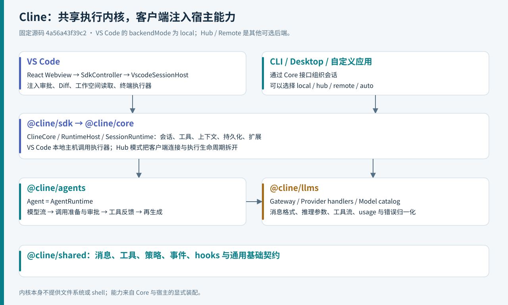
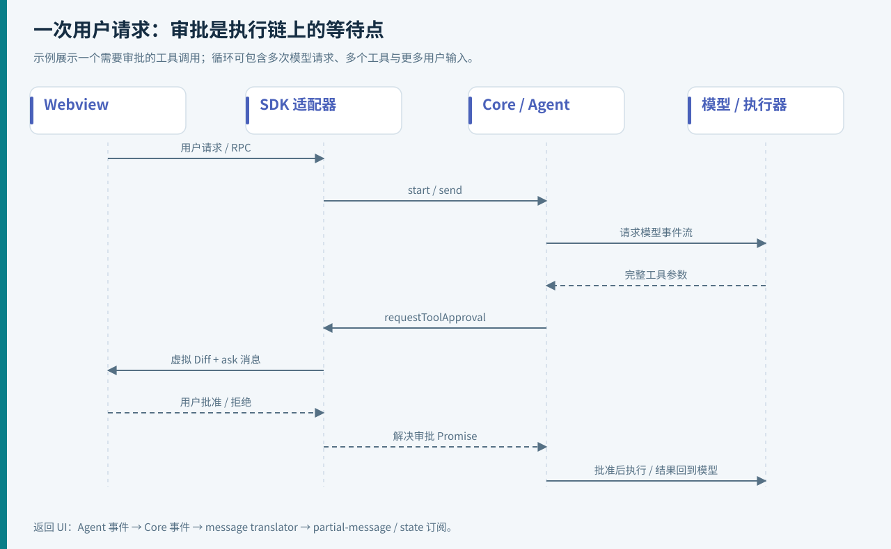
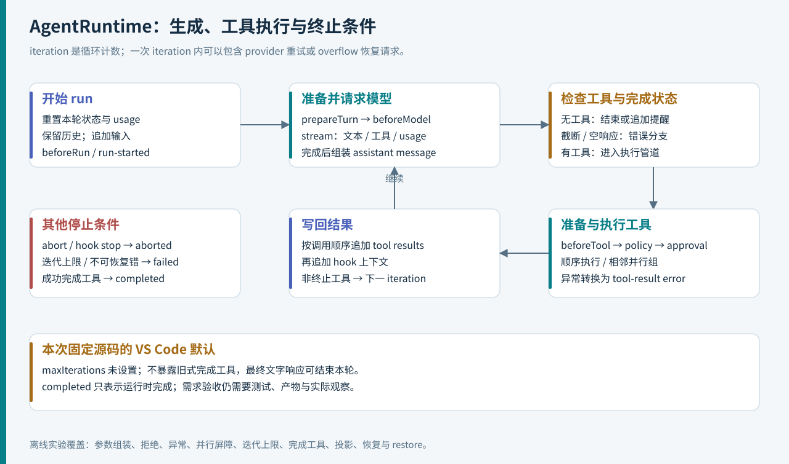
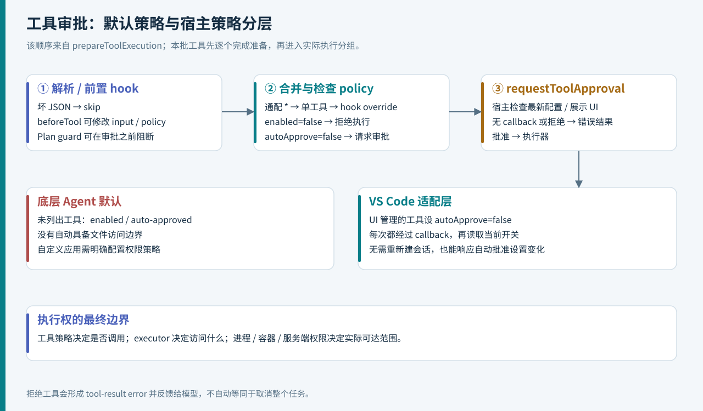
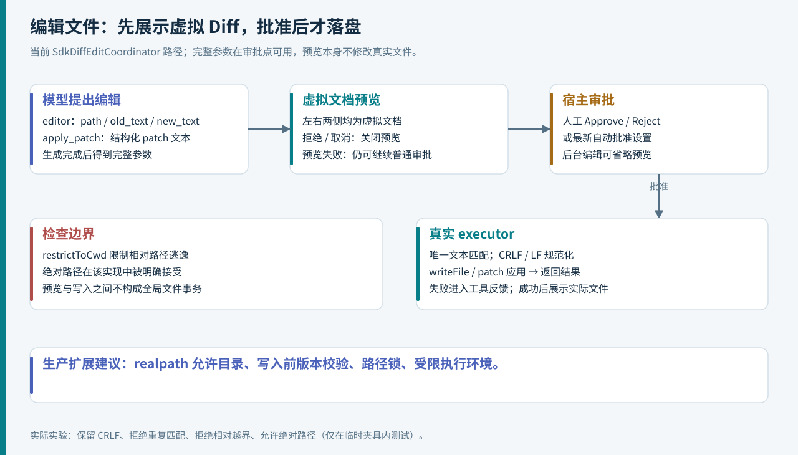
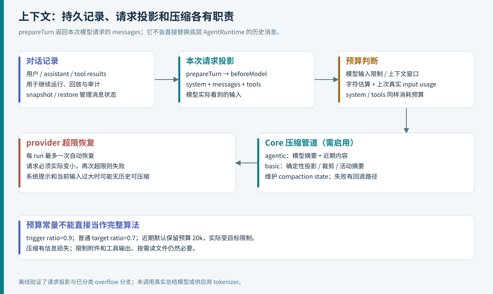
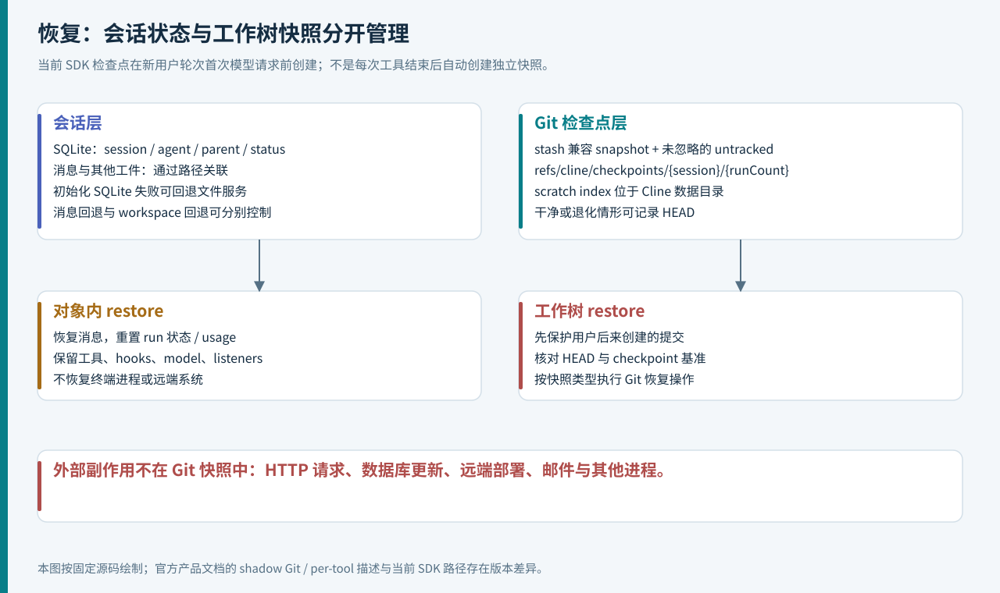
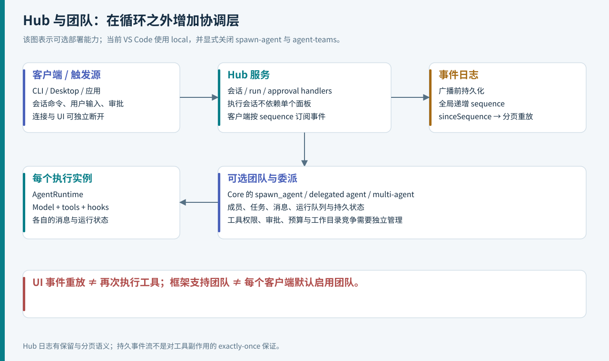

# Cline 源码深读：一个编程 Agent 如何连接模型、编辑器与可恢复的执行环境

> 面向大模型 Agent 工程师的实现调研。调研日期：**2026-09-22**；官方仓库：[cline/cline](https://github.com/cline/cline)。源码基线：[`4a56a43f39c2`](https://github.com/cline/cline/tree/4a56a43f39c2c75f941220989d4c65db006ee531)，提交时间 2026-09-21。文中的默认行为均针对该提交，不能直接套用于旧版扩展。

阅读入口：[离线图文版](index.html) · [源码地图](research/source-map.md) · [实验说明](examples/README.md) · [验证记录](research/verification.md)

Cline 最值得研究的部分，是它怎样把“模型建议修改代码”变成一条可执行、可审批、可反馈的工程链路：用户输入穿过 IDE 的消息桥，进入共享运行时；模型输出流被组装为工具调用；宿主审批、编辑器预览、终端进程和文件执行器把调用变成实际操作；结果再回到模型，继续下一次决策。

**这个版本的架构重点已经从早期 VS Code 中的大型 Task 类，转向共享 SDK 加宿主适配器。** 分析当前实现，应同时沿着两条线走：一条是 `AgentRuntime` 的模型—工具循环，另一条是 `ClineCore` 和各客户端对会话、权限、持久化、上下文、交互的装配。只研究提示词，看不到执行边界；只研究 UI，又会错过多个产品共同使用的运行机制。

本文包含 8 张原创工程图与 13 组离线源码实验。图示表达代码关系，不是产品截图；实验使用脚本化模型，不消耗 API 额度。源码事实、实验观察与作者的工程建议会分别注明。

<a id="sec-01"></a>
## 01｜先确定研究对象：现在的 Cline 是一个 monorepo

官方仓库已经包含 CLI、VS Code、Desktop 相关应用及 SDK。根目录 `package.json` 声明了 `sdk/packages/*`、`apps/*` 和 webview 等 workspaces，开发工具链指定 **Bun 1.3.13、Node ≥ 22**。下表是源码内的 package version，不代表各发布渠道同时上线的版本。[S01]

| 层次 | 源码位置 | 本次关注点 |
| --- | --- | --- |
| VS Code 扩展，4.1.19 | `apps/vscode` | IDE 激活、React webview、审批、Diff、终端适配 |
| CLI，3.0.62 | `apps/cli` | 命令行入口及共享会话基础设施 |
| Desktop / Hub 应用 | `apps/cline-hub` | 桌面应用与共享服务集成；应用名和 SDK 内 Hub 模块须区分 |
| `@cline/sdk`，0.0.83 | `sdk/packages/sdk` | 对外 SDK 名称，入口直接重导出 `@cline/core` |
| `@cline/core`，0.0.83 | `sdk/packages/core` | 会话、宿主、工具、上下文、存储、团队及自动化 |
| `@cline/agents`，0.0.83 | `sdk/packages/agents` | 可嵌入的 Agent 循环 |
| `@cline/llms`、`@cline/shared` | `sdk/packages/llms`、`shared` | 模型适配与共享契约 |

本文深挖 **VS Code → Core → AgentRuntime** 主链，同时解释 Hub 和团队能力的边界。JetBrains 不在本次开源源码分析范围。CLI/桌面 UI 的全部操作路径、每一家模型供应商和全部插件也没有逐一集成运行。

### 阅读旧资料时，先核对五个变化

| 常见旧印象或概括 | 本次固定源码的实际情况 |
| --- | --- |
| 主循环在 `src/core/task/index.ts` | 当前 Controller 入口转发到 `SdkController`；共享主循环在 `sdk/packages/agents/src/agent-runtime.ts` |
| 工具调用都靠文本里的 XML 标签 | 当前主链消费统一模型事件，组装结构化 `tool-call`；提示词中出现 XML 不代表执行协议也是 XML |
| 结束必须调用 `attempt_completion` | 当前 VS Code extra-tools 明确不暴露完成工具，最终文字可结束本轮 |
| 所有客户端都经 Hub 执行 | VS Code 的 `VscodeSessionHost` 显式选择 `backendMode: "local"` |
| 检查点是每次工具调用后的 shadow Git | 当前内建 SDK 路径是新用户轮次首次模型请求前，保存 stash 兼容对象及项目 Git 的私有 refs |

这些结论来自入口和调用链，而不是目录中“存在某个旧类”。迁移中的仓库可能保留兼容层、注释或旧实现，**有文件不等于当前入口会执行它**。[S03][S04][S28][S41]

<a id="sec-02"></a>
## 02｜总体架构：把循环内核和有副作用的宿主拆开



`@cline/agents` 的职责相对集中：接收模型接口、工具和 hooks，维护消息与运行状态，驱动生成和执行。它不自带文件系统、终端、数据库、Hub 连接，也不会因为创建了 `Agent` 就具备编码能力。`Agent` 是 `AgentRuntime` 的别名。[S07]

`@cline/core` 把通用循环接到实际环境：准备模型 handler，生成内建工具集，加载 rules/skills/MCP，建立上下文管道，将底层事件转换为宿主事件，并管理会话存储。VS Code 再注入编辑器、终端和交互回调，使同一个逻辑工具拥有 IDE 中的执行体验。[S05][S09]

模型层 `@cline/llms` 将供应商特有的调用方式、消息格式、推理参数与 usage 转换为统一接口。`@cline/shared` 提供 `AgentMessage`、`AgentTool`、`ToolPolicy`、hooks 等契约。依赖关系整体向下：Core 依赖 agents/llms/shared；agents 依赖 llms/shared；shared 不依赖宿主。[S10]

**工程含义：编程 Agent 的可移植性，来自执行器和交互能力可被注入。** 将 VS Code API 直接塞进模型循环，会让 CLI、后台任务和服务端复用变得困难；Cline 的新结构把这类宿主差异放到适配层。

<a id="sec-03"></a>
## 03｜一次用户请求怎样从 Webview 到达 Agent

`apps/vscode/src/extension.ts` 的 `activate()` 设置宿主能力，初始化 webview provider，注册命令、URI 处理和 Diff 文档 provider。它还包含旧存储向共享文件目录的迁移逻辑。这说明扩展激活不仅是“显示一个聊天面板”，也承担运行环境初始化。[S02]

Webview 的请求经过协议定义与 `grpc-handler` 分发到 Controller；当前 Controller 入口只是对 `@/sdk/SdkController` 的导出。这里的 gRPC 风格接口借助 webview 消息通道传递，不能仅因名称而断言浏览器与扩展之间启动了一个 HTTP/2 gRPC 服务。[S03][S42]



关键路径可以压缩成：

```text
React Webview → 消息 / RPC handler → SdkController
  → 会话配置与生命周期协调器
  → VscodeSessionHost → ClineCore.start / send
  → LocalRuntimeHost → SessionRuntime 装配
  → AgentRuntime → AgentModel.stream → tools

AgentRuntimeEvent → CoreSessionEvent
  → message translator → ClineMessage → Proto message
  → WebviewGrpcBridge → partial-message / state 订阅 → UI
```

`WebviewGrpcBridge` 刻意不重复翻译已经转换的事件。第二次翻译可能重复发送消息，或再次重置流式状态，导致界面损坏。文字增量和完整状态也走不同通道：前者负责流畅显示，后者在结束等关键事件时让 UI 与完整会话状态重新对齐。[S35]

审批位于这条调用链中，而不是悬浮在运行时外部。工具调用触发交互协调器，后者产生 ask 消息并保存一个待解决的 Promise；用户的批准或拒绝最终解决这个 Promise，工具执行才继续。**审批等待时间属于一次 Agent 执行的生命周期。**[S13]

<a id="sec-04"></a>
## 04｜ClineCore 与运行宿主：统一接口，不同部署位置

`ClineCore.create()` 调用 `createRuntimeHost()`；`start()` 先执行可选 `prepare`，让宿主补充配置，然后规范化输入并调用 `host.startSession()`。`send` 则直接委托给 `host.runTurn`。因此会话输入、消息继续、取消和恢复可以通过稳定的应用接口暴露。[S05]

运行后端有 `local`、`hub`、`remote`、`auto` 等模式：[S06]

| 模式 | 核心行为 | 应用工程意义 |
| --- | --- | --- |
| local | 进程内创建 LocalRuntimeHost | 可以传递函数型执行器和回调，适合直接嵌入 |
| hub | 连接兼容的 Hub | 客户端与实际会话运行解耦 |
| remote | 要求明确配置远端 endpoint | 运行地点及工作空间由远端服务决定 |
| auto | 尝试发现并连接兼容 Hub，失败时回退 local；可能预热 Hub | 会话在哪里执行取决于发现、连接和选项，不能默认为远端 |

**当前 VS Code 强制 local。** `VscodeSessionHost.create()` 注入 `editorExecutor`、`applyPatchExecutor`、工作空间文件读取器与审批回调；有 VS Code terminal manager 时，还用支持前后台任务的自定义 `run_commands` 替换 SDK 内建版本。其配置也排除 SDK 自带 file-hooks 扩展，由 VS Code 自己的适配器处理，以免同一 hook 执行两次。[S04]

这种设计同时暴露了一个实现上的真实问题：跨进程配置只能传可序列化数据，函数回调需要留在宿主侧。因此 `RuntimeSessionConfig` 会剥离 hooks、logger、extraTools 等本地对象，另有 `localRuntime` 保存本地 bootstrap 能力。读接口时要分清“可跨传输的会话配置”和“宿主本地服务”。

<a id="sec-05"></a>
## 05｜AgentRuntime：一个有状态、可中断的执行循环



状态包括 `agentId`、`runId`、`status`、`iteration`、`messages`、`pendingToolCalls`、`usage` 和错误信息。`run(input)` 与 `continue()` 共用内部 `execute()`；前者提供新输入，后者接着已有消息继续。一次 run 开始时会重置本轮计数、usage 和错误字段，但历史消息仍可保留。[S07]

下面是按源码整理的伪代码，省略了遥测和部分错误分支：

```typescript
beforeRun(); appendInput();
while (iteration < configuredLimit || configuredLimit === undefined) {
  checkAbort(); iteration++;
  const assistant = await generateWithRecoveryAndRetry();
  appendAssistantMessage(assistant);
  const calls = collectToolCalls(assistant);

  if (calls.length === 0) {
    if (completionPolicyNeedsReminder()) { appendReminder(); continue; }
    return completed();
  }

  const prepared = await prepareAllCalls(calls); // hook、policy、approval
  const results = await executeInOrderedGroups(prepared);
  appendToolResults(results);
  appendHookContextAfterResults();
  if (successfulCompletingTool(results)) return completed();
}
return failed("exceeded maxIterations");
```

几个细节值得单独强调：

1. **iteration 不等于 API 请求数。** 同一次 iteration 内可能因瞬时错误重试，或因上下文溢出压缩后重试。
2. **没有工具调用并不无条件完成。** completion policy 可以追加提醒，要求继续；命中输出上限且无工具调用时，会作为不完整响应报错。
3. **达到 maxIterations 是 failed。** 它不是“已经完成了足够多步骤”。当前 VS Code 配置设为 `undefined`，上层仍可通过取消和错误追踪管理运行。[S34]
4. **工具异常通常成为模型可见的错误结果。** 单个工具失败不必直接终止 run；模型可以据此修正参数或调整方案。
5. **run 返回 completed 是运行时终止状态。** 它不证明需求完成、测试通过或代码正确，这些需要执行证据。

`restore(messages)` 恢复的是消息状态，重置 run 标记、usage 和待执行调用，同时保留当前 Agent 的模型、工具、hooks、身份和订阅者。它不会重新启动被杀死的终端，也不会恢复外部服务。这种“对象内恢复”与后面的 Git 文件恢复是两套机制。[S07]

<a id="sec-06"></a>
## 06｜流式输出：工具调用需要组装，不能见到半段 JSON 就执行

`AgentModel.stream(request)` 暴露异步事件流。运行时分别处理文字、推理、工具参数增量、usage 和 finish。工具参数可能横跨多个网络 chunk，例如先收到 `{"path":`，再收到 `"main.ts"}`；`toolAssemblies` 按 toolCallId 或索引聚合，保留 toolName、inputText、inputValue 与 metadata。[S07]

生成结束后，运行时把增量转成完整 `AgentToolCallPart`。缺名称、缺参数或非法 JSON 会产生错误信息；带解析错误的调用在准备阶段被跳过，不能进入 executor。正常参数还经过按 schema 的 JSON-like 字符串规范化，帮助处理供应商把嵌套结构包装成字符串的情况。**这与任意修复被截断的程序文本不同。**

这里还区分两种工具活动：

| 类型 | 谁执行 | 如何进入运行时 |
| --- | --- | --- |
| 本地 Agent tool | Cline 注册的 executor | 组成 tool-call → 审批/执行 → tool-result |
| Provider 执行的工具 | 模型供应商侧 | 活动与结果保存在相应 metadata 和事件中，避免在本地再次执行 |

这一区分影响重试安全性。供应商已经执行过搜索等工具后，盲目重发请求可能重复副作用；把供应商工具伪装成本地 tool-use 历史，也可能让下一次请求出现找不到对应结果的调用。源码对此有专门分支，而不是把所有东西拼成一串文本。

实验中的第一组测试将 JSON 分成两段发送，检查批准后 executor 收到完整 `{path: "main.ts"}`，以及下一次模型请求包含对应工具结果。另一个测试验证坏 JSON 不会调用 executor，工具异常则进入错误反馈。[实验报告](research/runtime-results.json)

<a id="sec-07"></a>
## 07｜模型适配：统一循环之下仍然需要处理供应商差异

`GatewayModelAdapter` 把 AgentModelRequest 里的 messages、tools、modelTools、推理配置、metadata 和 AbortSignal 映射成 Gateway 请求。Gateway 负责 provider/model 选择与能力判断；AI SDK 适配实现再处理具体的流、消息和 usage 形态。[S10][S11]

因此，“支持很多模型”不只是 endpoint 和 API key 两个变量。至少还有以下兼容面：

- **消息编码**：多模态内容、工具请求与响应配对、推理内容是否能重放。
- **参数映射**：reasoning effort、thinking budget、温度及输出 token 限额；同名设置未必对应同一种供应商语义。
- **能力注册**：模型是否支持 tool calling、图像、供应商内建工具；不支持工具时，Core 会调整可用工具与 completion policy。[S09]
- **usage 与成本**：输入、输出、cache read/write 和推理 token 需要归一化；缺失字段不能自动解释成实际零消耗。

运行时对瞬时 provider 错误最多追加 **3 次重试**，即最多 4 次尝试；基础退避为 1 秒，随后指数增长。但它只对没有留下可见内容、没有供应商已执行工具活动的可重试错误这样做。认证失败、上下文超限等需要不同处理。[S07]

这个策略体现了可靠性设计中的一个要点：**是否值得重试，与是否能够安全重试，要同时成立。** 网络错误并不天然意味着远端没有做过任何事情。本文离线实验验证了已分类 overflow 的恢复分支，没有验证真实供应商 SDK 的错误分类与网络重试。

<a id="sec-08"></a>
## 08｜工具契约与调度：顺序是默认，并行只跨相邻调用

`AgentTool` 至少有 name、description、inputSchema、execute；执行上下文包含 session/agent/run/toolCall 标识、signal、snapshot 和 `emitUpdate`。这些字段让工具输出可以和 UI、日志、取消动作关联起来。[S07][S38]

`createTool` 支持 schema 封装，并保留 timeoutMs、retryable、maxRetries 等元数据。读到这些字段时不要直接推断通用循环会自动限时和重试：**当前 AgentRuntime 的 executePreparedTool 直接 await tool.execute，具体内建工具还有自身 timeout 包装及进程生命周期控制。** 自定义工具作者应在实际执行层实现取消、超时和输入校验，不能仅依赖类型上的声明。[S19][S38]

默认 `toolExecution` 是 `sequential`；单个工具的 executionMode 可以覆盖全局配置。执行器会将相邻 parallel 调用合并成 `Promise.all`，遇到 sequential 调用就先等待前一组，再执行该调用。[S07]

```text
模型发出：read_A(parallel), read_B(parallel), edit(sequential), check(parallel)
实际执行：[ read_A || read_B ] → edit → [ check ]
结果入消息历史：read_A, read_B, edit, check（仍按调用顺序）
```

还有两个容易漏掉的事实。其一，本批调用的 `prepareToolExecution` 先逐个执行，因此可能先完成多次审批，再启动实际工具。其二，`maxParallelToolCalls` 在 runtime config builder 中被映射成 parallel/sequential 两态，**这一层没有据数值 N 创建 N 个并发槽**。数值看似是上限，并不意味着底层 Promise.all 真的限流到 N。[S08]

工程建议：读操作的并行通常有收益，写同一文件、同一终端或共享数据库状态的工具则应明确排序。若要控制 API 限速和资源峰值，需要在 host/executor 中加入真实 semaphore；若要保障文件一致性，还需要路径级锁或写入前版本校验。

<a id="sec-09"></a>
## 09｜权限与审批：SDK 默认值不等于 VS Code 默认体验



运行时对工具调用的处理顺序是：解析检查 → beforeTool hooks → 合并策略 → enabled 判断 → 必要时请求批准 → execute。通配策略 `"*"` 与单工具策略合并，后者覆盖前者，hook 还可以返回 policy override。因此 hooks 是可信执行面的一部分，不应把不可信插件当成纯文本资料。[S07]

**底层默认是未列出的工具可执行，并且无需审批。** 只有 `autoApprove === false` 才走审批回调；要求审批但没有 callback 时，会拒绝执行并返回模型可见错误。[S07][S12]

适合自主应用的起点通常是显式配置，例如：

```typescript
toolPolicies: {
  "*": { autoApprove: false },
  read_files: { autoApprove: true },
}
```

这仍是工具级策略，不能表达 read_files 中“只许读某个目录”之类细粒度约束，后者需要检查规范化路径或在执行环境中限制访问。对于自定义底层 Agent，policy 的执行拒绝和“从模型 schema 中隐藏工具”也要分开：Core 有可用工具过滤，底层循环还保留执行时检查。[S09]

VS Code 的 `buildToolPolicies()` 会把读取、编辑、命令、Web 和已发现的 MCP 工具都设置为 `autoApprove: false`。看起来与 UI 的自动批准矛盾，实际是为了**每次都到达宿主 callback**，由 callback 读取最新开关，决定直接放行还是显示 UI；任务中途修改设置也能生效。[S12][S13]

被拒绝的调用返回带 `isError` 的 tool-result，后续模型可以调整行动。它不是抛弃本次工具消息，也不等于整个任务终止。不过源码机制并不保证模型不会再次请求相似动作；次数控制与用户体验仍需要上层策略。

<a id="sec-10"></a>
## 10｜Plan / Act：工具集和运行时 hook 共同约束行为

Plan 并非只换一句“请先规划”。工具 preset 禁用 editor 与 apply_patch，保留 read/search/Web、问答和用于调查的 shell。Core 为 Plan 模式注册 command guard，以 beforeTool hook 检查 `run_commands` 的常见文件修改命令、重定向及部分 Git 操作。[S14][S15]

这个 hook 位于审批之前。即使用户开启命令自动批准，被 guard 识别的调用也会先被拒绝；拒绝以 skip 返回给模型，允许继续调查。共享 hook 还覆盖 VS Code 替换后的同名 terminal 工具，不需要每个宿主复制一套规则。[S15]

但上游注释明确说明：它是经过轻量预处理的**命令黑名单，不是 shell 解释器**，无法捕捉所有潜在写入路径。Plan 是产品工作模式和部分运行时防线，不能当成操作系统层面的只读环境。对于严格的只读分析，应实际提供只读挂载或只读工具，而不是仅依赖自然语言与字符串匹配。[S45]

VS Code 还有专门差异：当前配置不暴露 `switch_to_act_mode`，提示词要求模型让用户切换 Plan/Act。该界面下“谁可以转换模式”的控制权，与其他可能提供模式切换工具的客户端不能混为一谈。[S34][S43]

<a id="sec-11"></a>
## 11｜编辑代码：只读预览、批准与真实落盘分离



`SdkDiffEditCoordinator` 的当前实现使用两侧虚拟文档做只读 Diff 预览；打开预览不会修改真实文件。手动审批时，预览出现在批准按钮前；自动批准的编辑可以在执行时短暂显示预览；后台编辑设置则可以省略预览。[S16]

它与一些旧文章描述的“先在真实编辑缓冲区流式写入，拒绝再回滚”不同。当前 SDK 适配器在审批时取得完整工具参数，注释明确说明这一点限制了生成期间的逐 token 编辑预览。预览失败或超时也不会阻断审批流程，后续由实际 executor 决定编辑是否成功。

基础 editor 的输入使用 `path`、`old_text`、`new_text`，插入时还可用 `insert_line`。不存在的文件可以创建；已有文件缺失 old_text 会给出明确错误。字符串替换要求唯一匹配，零次或多次都失败，避免模型凭模糊片段改错位置。读写会保留现有 CRLF/LF 风格，并用 replacement function 防止 `$&` 等内容触发 JavaScript 替换语义。[S17]

`apply_patch` 则有独立解析器，支持明确的 patch grammar、添加/更新/删除/移动及相应错误反馈。它和 editor 是不同 executor；运行时是否暴露该工具，还受到工具 preset 和模型路由影响，不能把“仓库里有 apply_patch”理解为每个会话都会提供它。[S18][S14]

需要注意路径选项的精确语义：`restrictToCwd: true` 限制相对路径逃逸，但该版本 editor 和 apply_patch **明确接受绝对路径**。这不是一个完整文件系统沙盒，也没有仅靠该选项实现 realpath/symlink 隔离。[S17][S18]

实验在一次性临时目录实际验证了 CRLF 保留、重复匹配拒绝、相对越界拒绝与绝对路径接受。由此可见，Agent 工程不能根据一个名为 restrict 的选项推断完整权限保证。对严格环境，建议在执行器外加允许目录检查，并由容器或受控文件系统落实边界。

<a id="sec-12"></a>
## 12｜终端、Web 与 MCP：把外部能力收束到同一反馈接口

SDK 的 shell executor 基于 Node `spawn`；工具定义负责超时、输出处理等。VS Code 还提供前台/后台终端协调，以及命令运行期间继续交互的路径。一个命令的启动成功、shell exit code 为零、测试通过和用户目标达成都不是同一个状态。[S19][S20][S41]

长输出必须经过裁剪，否则一次构建日志就可能占据大部分上下文。实现中有集中输出上限及工具专属反馈；生产应用还应该保存完整日志工件，在模型上下文只返回摘要、失败位置和可回查引用。后者是本文建议，不能从“输出被截断”推断上游已经为所有工具自动完成工件化。

当前内建工具路径可看到 `fetch_web_content` 与 provider-native web search 路由。不能把旧版 `browser_action` 的截图点击循环直接画进当前默认 SDK 主链。若要接入浏览器自动化，应先确认使用的是具体 MCP 服务、插件、宿主扩展工具还是供应商工具，分别核对其运行地点和授权范围。[S19][S44]

MCP 集成将 server 描述的每个工具转成 AgentTool，保留 inputSchema，默认通过名称变换区分 server/tool。VS Code 下使用 McpHub provider 调用既有连接，并把取消信号传下去；受 UI 控制的 MCP 工具进入同一审批链。[S21][S41]

MCP 提供发现与调用协议，不自动赋予业务授权。一个看起来是“查询”的远端工具也可能写入状态，工具说明也可能包含误导性内容。工程边界应放在注册策略、审批、服务端权限与凭据范围上，不能仅按工具名推断无副作用。

`SubprocessSandbox` 是另一个容易误读的名字。该类使用子进程和 IPC 隔离执行生命周期，处理 pending request、超时、子进程退出和空闲回收；所读实现不是容器或 microVM，也没有仅凭该类建立文件系统/网络权限隔离。[S37]

<a id="sec-13"></a>
## 13｜上下文管理：区分对话记录、模型请求与压缩状态



低层 `prepareTurn` 在每次模型请求前得到 messages、systemPrompt、tools、iteration 及前一请求输入 token 数，可以返回用于本次请求的消息与系统提示词。**它修改的是请求投影，不直接重写 AgentRuntime 的消息数组。** beforeModel hook 随后还可修改请求。本次实验明确检查了模型看到 compact，而 run result 中仍是原始文本。[S07]

Core 在上层接入上下文管道，并维护会话级 compaction 状态和显示投影。需要减少模型输入，不代表要把用户可读的历史和审计工件一起删除；这正是上下文工程需要分层建模的原因。[S24]

该提交的一些预算规则：[S25]

| 项目 | 源码行为 | 解读 |
| --- | --- | --- |
| 输入预算 | 优先模型 maxInputTokens；只有 contextWindow 时保留余量 | 上下文窗不能全部当输入使用 |
| 输入估算 | 基础工具使用约 3 字符/token 的估计 | 不是供应商 tokenizer 的精确计数 [S46] |
| 自动触发比例 | 可用请求输入预算的 0.9 | 还要扣除 system prompt、tools 等开销 |
| 普通目标比例 | `DEFAULT_TARGET_RATIO = 0.7` | 具体目标受模式及消息预算影响，不等于永久保留 70% 历史 |
| 最近内容保留预算 | 默认 20,000 tokens，受当前目标预算限制 | 不能保证每次固定保留 20k |

此外，代码使用供应商返回的真实 input tokens 校正估算偏差，限制高估修正因子，并针对不同压缩模式选择目标预算。因此不能把全部行为简写为“token 达到窗口 90% 后删一半”。

### Basic 和 Agentic 是两种不同机制

`basic` 用确定性的预算投影、裁剪和工具活动摘要减少历史；`agentic` 调用模型生成总结，并尽量保留近期必要内容。后者会增加模型请求，也可能失败。实现提供 agentic 失败后回退 basic 的路径；最新用户请求、工具配对和任务信息需要在压缩中受到特别处理。[S26][S27]

`compaction.enabled` 需要显式开启才能建立这条管道。VS Code 的 auto-condense 设置决定是否注入配置；“SDK 有压缩能力”和“某个会话启用了自动压缩”应分开说明。[S24][S34]

### 供应商拒绝请求时还有一次恢复机会

AgentRuntime 检测已分类的 context-window 错误，且没有待保留的工具调用时，可以要求 prepareTurn 以 overflowRecovery 模式压缩后重试；每个 run 只做一次自动 overflow 恢复。Core 内建路径使用确定性的 basic 恢复，避免总结请求自身再次超限；自定义压缩器可先尝试，但结果仍需满足有效缩减要求。[S07][S24]

如果 system prompt、工具和当前输入本身就太大，或者压缩没有让消息实际变小，运行时会明确失败。压缩是有信息损失的恢复手段，不是无限上下文；工程上还应限制工具输出、按需读取文件、缩减工具 schema 和附件大小。

<a id="sec-14"></a>
## 14｜Rules、Skills、Hooks 与 Plugins：四种扩展各有位置

| 机制 | 主要解决的问题 | 当前实现线索 |
| --- | --- | --- |
| Rules / AGENTS.md | 项目长期约束和工作准则 | 配置路径解析、规则加载、系统提示词构建 |
| Skills | 按需加载任务方法和相关资源 | SKILL.md 元信息、skills tool、命令展开 |
| Hooks | 在生命周期边界观察、补充或阻止行为 | beforeRun / beforeModel / beforeTool / afterTool 等 |
| Plugins / MCP | 打包并提供执行能力或外部服务 | plugin manifest、贡献注册、MCP 工具转换 |

路径解析支持 workspace `AGENTS.md`，兼容 `.clinerules` 和 `.cline/rules`；skills 的 workspace 与全局目录由 shared 路径模块统一决定。文件发现后，配置服务和 watcher 负责跟踪启用状态与更新。直接在某个客户端硬编码一个目录，容易造成跨客户端行为不一致。[S22][S39]

Skills 的核心收益是渐进加载：先让模型知道可用技能及描述，需要时通过工具获取方法内容，而不是启动即把所有技能全文塞进上下文。`formatSkillInvocation` 会组织 command-name、参数、说明与正文；Agent Plugin 格式的技能还有单独的严格 frontmatter 校验，不能假设所有历史 Cline skill 都走完全相同的验证器。[S23][S40]

Hook 可以返回修改后的 input、policy、skip、stop 或追加上下文等结果。工具前后 hook 产生的上下文被运行时先暂存，再放到工具结果之后，避免破坏部分供应商要求的 tool-result 邻接关系。[S07]

工程上应把四类能力分别管理：rules/skill 主要贡献指令，hook/plugin 可能直接执行代码，MCP 请求可能越过进程与网络边界。读取到一份文档，并不意味着它应该获得任意执行权限。文件型“Memory Bank”工作流也应按项目文档与加载约定理解，不能据名称推断框架默认具备向量长期记忆。

<a id="sec-15"></a>
## 15｜持久化与检查点：恢复消息和恢复文件是两件事



默认本地 backend 尝试建立 `SqliteSessionStore`；SQLite 初始化失败会回退 file-based session service。会话表保存 session/agent/conversation 标识、状态、时间、parent 信息和 messages 等工件路径。它不是把所有状态都装进一张表：会话索引、消息工件、压缩状态、执行中进程和工作目录文件具有不同生命周期。[S06][S30]

### 当前检查点不是旧版 shadow Git 路径

本文调研当天，[官方检查点说明](https://docs.cline.bot/core-workflows/checkpoints)仍描述 shadow Git 与每次工具调用后快照；当前 SDK `createCheckpointHooks()` 的主逻辑则是：[S28]

1. 根 Agent 的 beforeRun 记录消息边界。
2. beforeModel 只在 iteration 为 1 时检查是否引入新用户轮次，结合持久化历史避免 continuation 覆盖原来的运行前快照。
3. 工作目录需要已处于 Git 仓库；不满足时跳过，后续轮次仍可重新探测。
4. 创建 stash 兼容 snapshot；未跟踪且未忽略的文件可通过附加父提交保存，scratch index 存在 Cline 数据目录。
5. 对象由 `refs/cline/checkpoints/{sessionId}/{runCount}` 保持可达，不进入普通 stash list。干净工作树可记录 HEAD，部分失败路径也可能退化为 HEAD，并报告相应结果。

这里的关键区别是**用户轮次边界、项目 Git 私有 refs、可降级的捕获结果**。不能从 UI 的“检查点”三个字推导出每个工具动作都有完整独立文件快照，更不能说 Git 元数据完全没被写入。

### 恢复还要防止误删用户后来提交的工作

当前 workspace restore 先核对 checkpoint 的基准提交与当前 HEAD；如果用户后来提交、rebase 或切换了分支，会拒绝直接把分支倒退。恢复还包含捕获恢复前工作树的安全措施，并通过 Git compare-and-swap 保护检查与更新之间的竞争窗口。真正落盘恢复会涉及 reset、部分情形的 clean 以及 stash apply，所以它是有副作用的操作。[S29]

消息回退和 workspace 回退由不同选项控制。即使都回退，也不会撤销已发送的 HTTP 请求、远端数据库更新或后台进程对外部系统的修改。源码恢复逻辑提供的是确定范围内的恢复能力，不能扩展解释成整个 Agent 世界的事务回滚。

本次没有对真实工作区执行恢复，也没有实际运行完整 checkpoint 集成测试；这一节基于源码审查。可验证记录中会把它与已实际运行的 editor/AgentRuntime 实验区分开。

<a id="sec-16"></a>
## 16｜Hub、子 Agent 与自动化：复用执行内核，增加协调层



Hub 使执行会话不再依赖某个 UI 面板的连接寿命。SDK 有会话、run、审批等 handlers；持久事件日志在广播前为事件分配全局递增 sequence，客户端可通过 `sinceSequence` 重放遗漏的事件，再接 live stream。[S31]

**事件重放不是工具重做。** 重放 UI 看漏的 tool-finished 消息通常安全；重新执行相同 shell 命令则可能重复副作用。两者在架构里应保持不同入口和状态。持久日志还有保留与分页语义，也不能理解成无限历史永久可重放。

团队能力位于 Core：`spawn_agent` 将 task 和 systemPrompt 交给 delegated agent，传递工具、hooks、策略及审批能力；multi-agent 层另有成员、任务、消息、运行队列与持久存储。其默认并发配置与父循环的工具并行模式属于不同机制。[S32][S33]

这里有一个对产品判断很重要的默认值：**当前 VS Code session factory 显式设置 `enableSpawnAgent: false` 和 `enableAgentTeams: false`。** 因而 SDK 支持团队，并不意味着当前 VS Code 默认在后台创建多个 Agent。[S34]

Cron、connectors 等自动化目录说明共享内核可以被更多触发源调用，但本文只作结构定位，没有把所有调度、第三方连接器或多 Agent 路径逐一运行。部署时需要独立考虑会话归属、预算继承、工作目录竞争、后台审批以及恢复后的重复执行。

<a id="sec-17"></a>
## 17｜从这些实现中提炼的工程取舍

以下是根据所读实现形成的工程判断，不是上游的性能或安全承诺。

| 设计 | 收益 | 要付出的工程代价 |
| --- | --- | --- |
| 小型通用循环 + Core + 宿主适配 | 同一个内核覆盖 IDE、CLI 与服务 | 配置传递链变长，需要明确每个默认值来自哪一层 |
| 统一结构化模型事件 | UI、工具与供应商适配分离 | 增量 JSON、工具配对、推理重放等细节复杂 |
| 工具错误回传模型 | 可自我修正，局部失败不必中断任务 | 需要识别重复失败和无进展循环 |
| 审批 callback | 可接 UI、策略服务或后台审批 | 挂起、取消、断线、迟到回答必须有状态管理 |
| 只读虚拟 Diff | 展示阶段不提前修改文件 | 展示与实际写入之间仍可能有竞争，需要重新校验 |
| 上下文投影与压缩 | 降低请求成本并支撑长任务 | 丢失细节、摘要错误、预算估算偏差需要处理 |
| Git 检查点 | 可定位和恢复部分文件状态 | Git 依赖、存储开销、忽略规则与外部副作用边界 |
| 可选 Hub | UI 断连与执行生命周期解耦 | 版本兼容、身份、传输、安全和重放状态更复杂 |

如果把 Cline 思路用于团队级 Agent 平台，我会优先补齐三组契约：

- **执行契约**：工具输入校验、真实权限范围、取消完成语义、超时后进程是否仍存活、幂等键与可审计的副作用记录。
- **完成契约**：目标验收条件、测试结果、产物路径、未完成项；不要把模型自然语言总结或 `completed` 枚举当成验收证据。
- **预算契约**：每次请求和整个任务分别统计 token、成本、用时与工具次数，对子任务继承预算，并对无进展循环做限制。

Core 中已经有 mistake-tracker 与 loop-detection 模块，可用于识别连续工具失败和重复调用；这体现了“run 仍在继续”与“任务正在进展”需要分别监测。上层如何提示用户、是否终止，仍取决于配置和宿主回调。[S36][S47]

<a id="sec-18"></a>
## 18｜可复现实验：直接运行固定提交的循环源码

本文没有把伪代码循环包装成“Cline 实测”。[runtime-lab.mjs](examples/runtime-lab.mjs) 通过 [source-loader.mjs](examples/source-loader.mjs) 读取固定提交的实际文件，校验 Git HEAD 与工作树内容，使用 Node 的 TypeScript 擦除功能加载模块，然后注入脚本化 AgentModel 和简单工具。

运行时可执行主体保持原样；为了不安装整个 monorepo，导入边界做了明确替换：遥测为空操作、nanoid 换为 randomUUID、嵌套 JSON-like 规范化为 identity；live gateway 和未分类错误处理一旦被调用就报错。token 估算、model-options、字符串和对象工具使用真实上游源码。实验不用真实 provider，因此不能覆盖 AI SDK 或服务端行为。

```bash
git clone https://github.com/cline/cline.git /tmp/cline-research
git -C /tmp/cline-research checkout 4a56a43f39c2c75f941220989d4c65db006ee531

# 在本仓库根目录，使用 Node 24+
node project/cline/examples/runtime-lab.mjs /tmp/cline-research \
  project/cline/research/runtime-results.json
```

**本次结果：13/13 组通过，Node v24.18.0，无模型网络请求。** [完整结果及源码哈希](research/runtime-results.json)

| 实验组 | 验证结果 |
| --- | --- |
| 增量 JSON 与完整循环 | 两段参数合并，审批后执行，工具结果进入下一次模型请求 |
| 未列出的工具策略 | 无 approval callback 也可执行 |
| 缺失 / 拒绝审批 | executor 不调用，错误反馈给模型 |
| hook 与 enabled | 前置阻断先于审批；禁用工具不会执行 |
| 并行分组 | 相邻读取重叠，顺序写入构成屏障，结果保持调用顺序 |
| 迭代上限与完成工具 | 上限耗尽失败，成功 terminal tool 无需下一次模型请求 |
| 非法参数与工具异常 | 不完整 JSON 不执行；异常转成 tool-result error |
| 上下文投影 | 请求内容变化，底层历史不被直接覆盖 |
| overflow 恢复 | 已分类超限在同一 iteration 内缩小消息并重试一次 |
| restore | 清理运行状态，保留工具和事件订阅 |
| VS Code policy | 受控工具强制进入 callback，最新开关决定自动批准 |
| Plan guard | 常见写入命令与重定向被识别，只做解析未执行命令 |
| 真实 editor | CRLF 保留，重复匹配失败，相对越界拒绝，绝对路径可用 |

若要通过公开 npm 包跑相同风格的最小 Agent，另见 [sdk-agent.mjs](examples/sdk-agent.mjs)。它直接 import `@cline/sdk`，依赖脚本显式传入的目录安装，不访问真实模型。本文对该示例做了语法与接口审查，没有安装 SDK 后声称完成集成验证。

<a id="sec-19"></a>
## 19｜如何复用本文资料，继续做源码研究

```text
project/cline/
├── README.md                    # 本文与固定提交链接
├── index.html                   # 离线图文博客，无外部字体/CDN
├── assets/                      # 8 张原创 SVG 与生成脚本
├── examples/                    # 真实源码实验、loader、公开 SDK 示例
└── research/
    ├── sources.json             # 提交号、文件 SHA-256、关键符号定位
    ├── source-map.md            # 按模块阅读的源码地图
    ├── runtime-results.json     # 离线实验结果与事件轨迹
    ├── verification.md          # 验证范围和未验证部分
    └── build_*.py / verify_*.py # 可重建、可检查的文档工件
```

继续研究时，建议以一个具体问题切入调用链：例如“拒绝编辑后有没有落盘”“取消命令后子进程是否退出”“压缩后是否仍保留 tool-call/result 配对”。先写可观察的断言，再决定需要替换哪一层依赖，最后才扩展到真实模型和完整应用。单看提示词或从源码里搜到一个函数，不足以回答这些问题。

本文的核心证据是固定提交的源文件；官方文档用于核对产品语义和发现版本差异。图表、解释、测试脚本为本目录整理的研究工件；上游 Cline 使用 Apache-2.0 许可，完整源码与许可保留在官方仓库。这里不复制供应商实现或打包整个上游项目。

### 官方资料

- [Cline 官方仓库及固定源码](https://github.com/cline/cline/tree/4a56a43f39c2c75f941220989d4c65db006ee531)
- [SDK 架构说明](https://docs.cline.bot/sdk/architecture/overview)：用于核对包职责，具体默认值以固定源码为准。
- [SDK 权限说明](https://docs.cline.bot/sdk/guides/permission-handling)：说明未列出工具默认可执行；应用示例仍需结合实际输入和权限设计审查。
- [检查点产品说明](https://docs.cline.bot/core-workflows/checkpoints)：恢复功能的产品语义；其 shadow Git / per-tool 描述与本次 SDK 路径有差异，详见第 15 节。

<!-- SOURCE_LINKS: generated by research/build_sources.py -->
[S01]: https://github.com/cline/cline/blob/4a56a43f39c2c75f941220989d4c65db006ee531/package.json#L4
[S02]: https://github.com/cline/cline/blob/4a56a43f39c2c75f941220989d4c65db006ee531/apps/vscode/src/extension.ts#L67
[S03]: https://github.com/cline/cline/blob/4a56a43f39c2c75f941220989d4c65db006ee531/apps/vscode/src/core/controller/index.ts#L7
[S04]: https://github.com/cline/cline/blob/4a56a43f39c2c75f941220989d4c65db006ee531/apps/vscode/src/sdk/vscode-session-host.ts#L115
[S05]: https://github.com/cline/cline/blob/4a56a43f39c2c75f941220989d4c65db006ee531/sdk/packages/core/src/ClineCore.ts#L285
[S06]: https://github.com/cline/cline/blob/4a56a43f39c2c75f941220989d4c65db006ee531/sdk/packages/core/src/runtime/host/host.ts#L137
[S07]: https://github.com/cline/cline/blob/4a56a43f39c2c75f941220989d4c65db006ee531/sdk/packages/agents/src/agent-runtime.ts#L724
[S08]: https://github.com/cline/cline/blob/4a56a43f39c2c75f941220989d4c65db006ee531/sdk/packages/core/src/runtime/config/agent-runtime-config-builder.ts#L191
[S09]: https://github.com/cline/cline/blob/4a56a43f39c2c75f941220989d4c65db006ee531/sdk/packages/core/src/runtime/orchestration/session-runtime-orchestrator.ts#L305
[S10]: https://github.com/cline/cline/blob/4a56a43f39c2c75f941220989d4c65db006ee531/sdk/packages/llms/src/providers/gateway.ts#L115
[S11]: https://github.com/cline/cline/blob/4a56a43f39c2c75f941220989d4c65db006ee531/sdk/packages/llms/src/providers/ai-sdk.ts#L41
[S12]: https://github.com/cline/cline/blob/4a56a43f39c2c75f941220989d4c65db006ee531/apps/vscode/src/sdk/sdk-tool-policies.ts#L13
[S13]: https://github.com/cline/cline/blob/4a56a43f39c2c75f941220989d4c65db006ee531/apps/vscode/src/sdk/sdk-interaction-coordinator.ts#L94
[S14]: https://github.com/cline/cline/blob/4a56a43f39c2c75f941220989d4c65db006ee531/sdk/packages/core/src/extensions/tools/presets.ts#L20
[S15]: https://github.com/cline/cline/blob/4a56a43f39c2c75f941220989d4c65db006ee531/sdk/packages/core/src/extensions/tools/command-guard-extension.ts#L39
[S16]: https://github.com/cline/cline/blob/4a56a43f39c2c75f941220989d4c65db006ee531/apps/vscode/src/sdk/sdk-diff-edit-coordinator.ts#L78
[S17]: https://github.com/cline/cline/blob/4a56a43f39c2c75f941220989d4c65db006ee531/sdk/packages/core/src/extensions/tools/executors/editor.ts#L42
[S18]: https://github.com/cline/cline/blob/4a56a43f39c2c75f941220989d4c65db006ee531/sdk/packages/core/src/extensions/tools/executors/apply-patch.ts#L59
[S19]: https://github.com/cline/cline/blob/4a56a43f39c2c75f941220989d4c65db006ee531/sdk/packages/core/src/extensions/tools/definitions.ts#L265
[S20]: https://github.com/cline/cline/blob/4a56a43f39c2c75f941220989d4c65db006ee531/sdk/packages/core/src/extensions/tools/executors/bash.ts#L4
[S21]: https://github.com/cline/cline/blob/4a56a43f39c2c75f941220989d4c65db006ee531/sdk/packages/core/src/extensions/mcp/tools.ts#L16
[S22]: https://github.com/cline/cline/blob/4a56a43f39c2c75f941220989d4c65db006ee531/sdk/packages/core/src/extensions/config/user-instruction-config-loader.ts#L36
[S23]: https://github.com/cline/cline/blob/4a56a43f39c2c75f941220989d4c65db006ee531/sdk/packages/core/src/extensions/agent-plugin/agent-skill.ts#L126
[S24]: https://github.com/cline/cline/blob/4a56a43f39c2c75f941220989d4c65db006ee531/sdk/packages/core/src/extensions/context/compaction.ts#L281
[S25]: https://github.com/cline/cline/blob/4a56a43f39c2c75f941220989d4c65db006ee531/sdk/packages/core/src/extensions/context/compaction-shared.ts#L13
[S26]: https://github.com/cline/cline/blob/4a56a43f39c2c75f941220989d4c65db006ee531/sdk/packages/core/src/extensions/context/basic-compaction.ts#L452
[S27]: https://github.com/cline/cline/blob/4a56a43f39c2c75f941220989d4c65db006ee531/sdk/packages/core/src/extensions/context/agentic-compaction.ts#L116
[S28]: https://github.com/cline/cline/blob/4a56a43f39c2c75f941220989d4c65db006ee531/sdk/packages/core/src/hooks/checkpoint-hooks.ts#L497
[S29]: https://github.com/cline/cline/blob/4a56a43f39c2c75f941220989d4c65db006ee531/sdk/packages/core/src/session/checkpoint-restore.ts#L409
[S30]: https://github.com/cline/cline/blob/4a56a43f39c2c75f941220989d4c65db006ee531/sdk/packages/core/src/services/storage/sqlite-session-store.ts#L25
[S31]: https://github.com/cline/cline/blob/4a56a43f39c2c75f941220989d4c65db006ee531/sdk/packages/core/src/hub/server/hub-event-log.ts#L80
[S32]: https://github.com/cline/cline/blob/4a56a43f39c2c75f941220989d4c65db006ee531/sdk/packages/core/src/extensions/tools/team/multi-agent.ts#L135
[S33]: https://github.com/cline/cline/blob/4a56a43f39c2c75f941220989d4c65db006ee531/sdk/packages/core/src/extensions/tools/team/spawn-agent-tool.ts#L117
[S34]: https://github.com/cline/cline/blob/4a56a43f39c2c75f941220989d4c65db006ee531/apps/vscode/src/sdk/cline-session-factory.ts#L1070
[S35]: https://github.com/cline/cline/blob/4a56a43f39c2c75f941220989d4c65db006ee531/apps/vscode/src/sdk/webview-grpc-bridge.ts#L33
[S36]: https://github.com/cline/cline/blob/4a56a43f39c2c75f941220989d4c65db006ee531/sdk/packages/core/src/runtime/safety/mistake-tracker.ts#L33
[S37]: https://github.com/cline/cline/blob/4a56a43f39c2c75f941220989d4c65db006ee531/sdk/packages/core/src/runtime/tools/subprocess-sandbox.ts#L265
[S38]: https://github.com/cline/cline/blob/4a56a43f39c2c75f941220989d4c65db006ee531/sdk/packages/shared/src/tools/create.ts#L81
[S39]: https://github.com/cline/cline/blob/4a56a43f39c2c75f941220989d4c65db006ee531/sdk/packages/shared/src/storage/paths.ts#L578
[S40]: https://github.com/cline/cline/blob/4a56a43f39c2c75f941220989d4c65db006ee531/sdk/packages/core/src/extensions/config/user-instruction-plugin.ts#L32
[S41]: https://github.com/cline/cline/blob/4a56a43f39c2c75f941220989d4c65db006ee531/apps/vscode/src/sdk/vscode-runtime-builder.ts#L62
[S42]: https://github.com/cline/cline/blob/4a56a43f39c2c75f941220989d4c65db006ee531/apps/vscode/src/core/controller/grpc-handler.ts#L53
[S43]: https://github.com/cline/cline/blob/4a56a43f39c2c75f941220989d4c65db006ee531/apps/vscode/src/sdk/sdk-session-config-builder.ts#L19
[S44]: https://github.com/cline/cline/blob/4a56a43f39c2c75f941220989d4c65db006ee531/sdk/packages/core/src/extensions/tools/runtime.ts#L12
[S45]: https://github.com/cline/cline/blob/4a56a43f39c2c75f941220989d4c65db006ee531/sdk/packages/core/src/extensions/tools/command-guard.ts#L10
[S46]: https://github.com/cline/cline/blob/4a56a43f39c2c75f941220989d4c65db006ee531/sdk/packages/shared/src/llms/tokens.ts#L8
[S47]: https://github.com/cline/cline/blob/4a56a43f39c2c75f941220989d4c65db006ee531/sdk/packages/core/src/runtime/safety/loop-detection.ts#L20
[S48]: https://github.com/cline/cline/blob/4a56a43f39c2c75f941220989d4c65db006ee531/sdk/packages/agents/src/agent-runtime.test.ts#L28
