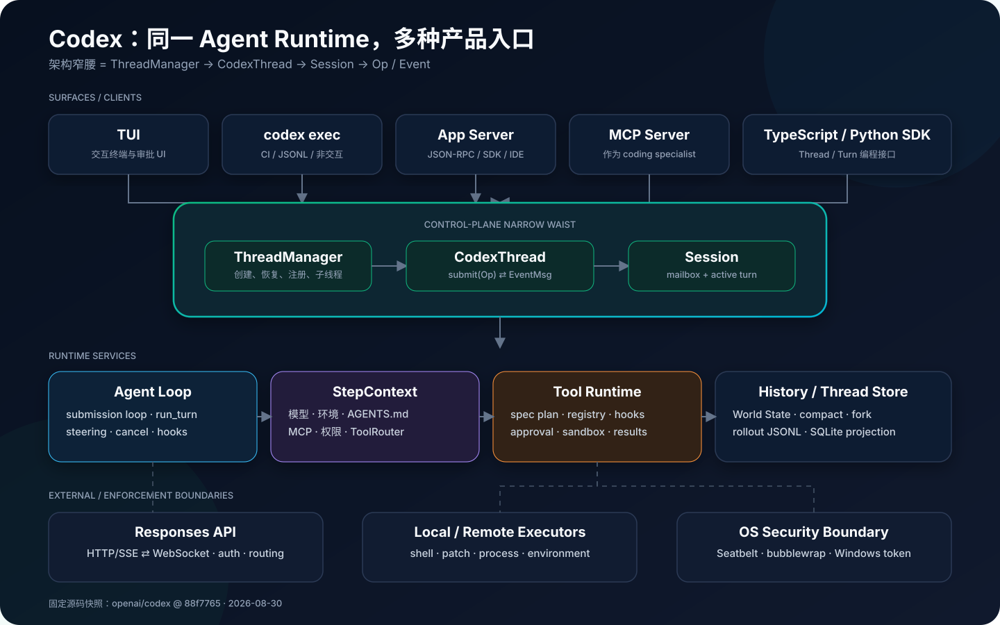
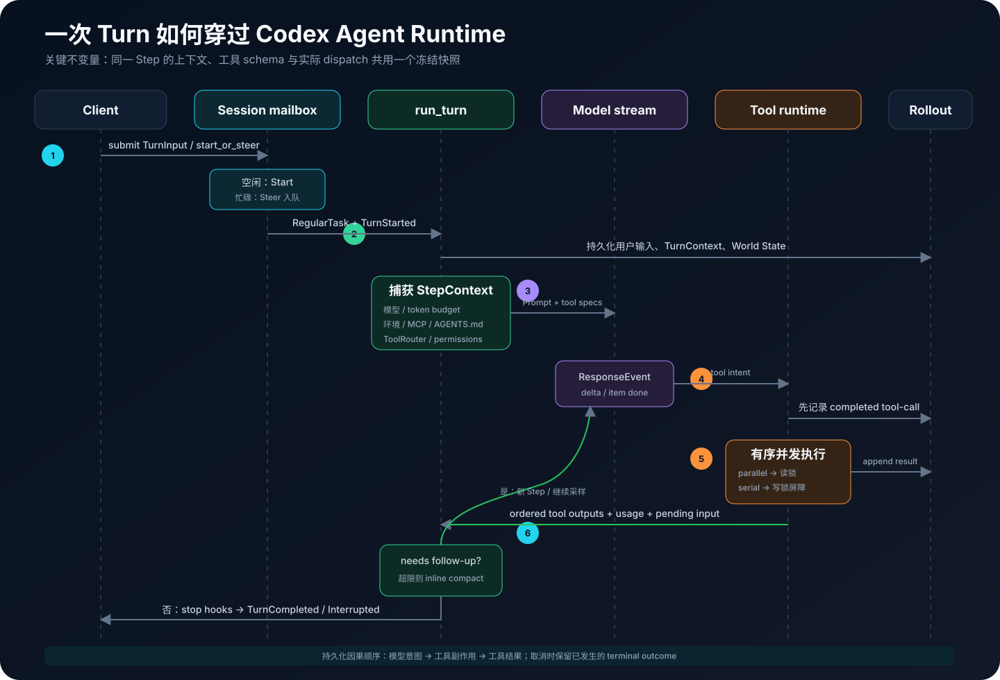
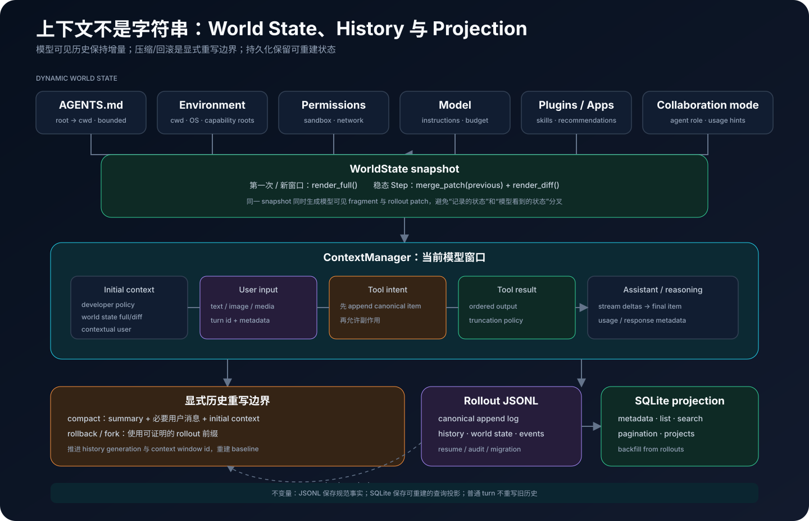
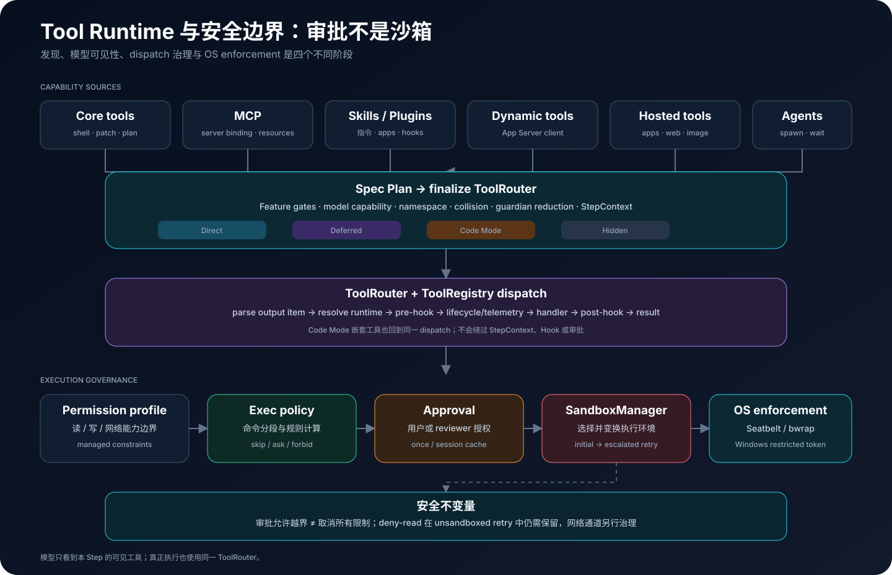

# 拆解 OpenAI Codex：从 CLI 到 Agent Runtime 的生产级实现

> 从专业大模型 Agent 工程师的视角看，Codex 最值得研究的不是“模型会写代码”，而是一个本地 Agent Runtime 如何把流式推理、工具副作用、动态上下文、审批、OS 沙箱、会话恢复和多种客户端压进同一套一致的执行语义。



## 调研基线与结论边界

本文基于 OpenAI 的 [Codex 官方仓库][repo]、[CLI 文档][docs-cli]、[App Server 文档][docs-app-server]、[安全与审批文档][docs-security]，以及 `main` 分支在 **2026-08-30** 的源码快照 [`88f7765`][snapshot] 完成。该快照使用 Rust 2024 edition，`codex-rs` workspace 有 **138 个成员 crate**，仓库内约有 3,450 个 Rust 源文件；这些数字只用于说明工程规模，不代表发布版本号或长期稳定指标。

| 项目 | 本文采用的边界 |
| --- | --- |
| 重点 | Codex CLI、`codex-rs/core`、Protocol、Tool Runtime、Sandbox、Thread Store、App Server、SDK 接入边界 |
| 方法 | 固定 commit 静态源码追踪、模块间调用链交叉检查、官方文档对照、源码内测试语义审阅 |
| 不覆盖 | IDE Extension 和 Codex Cloud 的私有实现、服务端模型训练与路由细节、模型能力评测 |
| 验证口径 | 对架构与代码路径做源码级验证；未把需要真实账号、远端服务或付费模型的调用冒充为本地端到端测试 |

仓库变化非常快。本文所有“当前实现”都指向固定 commit；读者若在未来的 `main` 上阅读，文件拆分、Feature Gate、协议字段和默认策略都可能已经变化。

## 结论先行

我的核心判断有八条：

1. **Codex CLI 不是 TUI 加一个 ReAct 循环，而是一套可嵌入的 Agent Runtime。** TUI、`codex exec`、App Server、MCP Server 和 SDK 只是不同入口，真正共享的是 Thread、Session、Op/Event、工具路由与持久化内核。
2. **它的架构“窄腰”是 `ThreadManager → CodexThread → Session → Op/Event`。** 上层客户端不用知道模型流和工具实现，下层核心也不依赖某一种 UI。
3. **Agent loop 是事件驱动、可转向、可取消的异步状态机。** 模型流、多个工具 Future、用户中途追加输入、审批答复和停止 Hook 都能在同一 turn 中交错发生。
4. **`StepContext` 是最值得借鉴的正确性设计。** 每次模型采样前冻结模型设置、环境、权限根、MCP 快照、AGENTS.md 与工具路由，保证“模型看到的工具”和“随后真正执行的工具”属于同一能力快照。
5. **安全不是一个 `confirm()`。** Codex 把权限 Profile、命令策略、审批、网络规则与 OS 沙箱分层；审批决定是否允许越界，沙箱决定进程技术上能碰到什么。
6. **会话历史采用“规范 JSONL 日志 + SQLite 查询投影”。** JSONL 保留可恢复的 canonical rollout，SQLite 服务列表、搜索、元数据和回填，而不是让核心 Session 直接耦合某个数据库。
7. **上下文被当成可版本化的世界状态，而不是每轮重拼的大字符串。** AGENTS.md、环境、权限、模型、插件等状态可以做 full snapshot 和 diff；历史重写只发生在压缩、回滚等显式边界。
8. **代价是高复杂度。** 138 个 workspace crate、庞大的 `core/session`、新旧协议兼容和大量 Feature Gate 带来很高的阅读与变更成本。仓库自己的 `AGENTS.md` 也明确要求避免继续膨胀 `codex-core`。

---

## 1. Codex 到底开源了什么

官方将 Codex CLI 定义为运行在本机、能够读取、修改和执行代码的 coding agent。[官方文档][docs-cli]同时说明，Codex CLI、Codex SDK 与 App Server 的源码位于本仓库，而 IDE Extension 和 Codex Cloud 并未随仓库开源。[开源组件清单][docs-open-source]

因此，阅读这个仓库时应采用下面的分层：

- **开源客户端/运行时**：命令行入口、TUI、非交互执行、认证客户端、Agent loop、工具、MCP、Skills、App Server、SDK；
- **本地执行边界**：命令策略、审批、bubblewrap/Seatbelt/Windows sandbox、rollout 与 SQLite；
- **远端依赖**：Responses API、模型目录、账号服务，以及某些托管工具或能力；
- **未开源产品面**：IDE UI 和 Codex Cloud 的服务实现。

这也是为什么不能简单把“Codex 的实现”等同于“某个模型的 system prompt”。模型负责生成下一步，仓库负责把下一步变成一个可控制、可审计、可恢复的真实软件工程过程。

---

## 2. 仓库地图：Rust Workspace 是真正的产品内核

根目录仍保留少量 Node 包装与多语言 SDK，但主要运行时位于 `codex-rs/`。其 138 个 workspace 成员大致可归入下表：

| 分层 | 代表 crate / 目录 | 职责 |
| --- | --- | --- |
| 产品入口 | `cli`、`tui`、`exec`、`app-server`、`mcp-server` | 交互、自动化、协议服务与分发 |
| Agent 内核 | `core`、`protocol`、`history`、`thread-store` | Thread/Turn、Op/Event、Agent loop、上下文与状态 |
| 模型通信 | `codex-api`、`http-client`、`login` | Responses API、SSE/WebSocket、认证、重试与遥测 |
| 工具能力 | `tools`、`unified-exec`、`apply-patch`、`mcp-*`、`skills` | Schema、工具执行、MCP/Skills、补丁和进程控制 |
| 安全执行 | `sandboxing`、`linux-sandbox`、`windows-sandbox`、`execpolicy` | OS 隔离、权限计算、命令规则与网络约束 |
| 状态设施 | `rollout`、`state`、`sqlite` | JSONL、SQLite 投影、搜索、回填和迁移 |
| 可嵌入接口 | `app-server-protocol`、`sdk/typescript`、`sdk/python` | JSON-RPC 协议、类型生成和 SDK |

这种拆分不是纯粹的目录美学。仓库级 [`AGENTS.md`][src-agents-root]明确要求：不要继续随意增长 `codex-core`，上下文注入必须有硬上限，公开协议和 rollout resume 都属于需要额外审查的兼容面。换言之，团队已经把 **上下文成本、状态恢复和协议兼容** 当成与普通 API 一样严肃的工程约束。

---

## 3. 总体架构：一条窄腰连接所有 Surface

把 Codex 理解为下面这条链路最准确：

```text
TUI / codex exec / App Server / SDK / MCP Server
                       │
                 ThreadManager
                       │
                  CodexThread
              submit(Op) / next Event
                       │
                    Session
       submission_loop + active turn + services
              ┌────────┼─────────┐
          Model API  Tool Runtime  Thread Store
```

[`CodexThread`][src-codex-thread]的注释直接称其为 Thread 的双向 conduit：客户端提交 `Op`，再从事件通道消费 `EventMsg`。`CodexThread` 自身很薄，真正的生命周期由 [`ThreadManager`][src-thread-manager] 管理，状态机由 [`Session`][src-session-spawn] 执行。

### 3.1 为什么 Op/Event 是关键抽象

[`Op`][src-op] 覆盖了用户输入、打断、审批结果、配置更新、压缩、回滚、评审、MCP 刷新、动态工具返回和关闭等控制动作；[`EventMsg`][src-event] 则覆盖 Session 配置、Turn 生命周期、消息流、命令执行、文件修改、审批请求、用量、错误等观察事件。

这形成了一个稳定的双向协议：

- UI 不需要直接持有 shell 进程或模型 SSE；
- App Server 可以把 JSON-RPC 请求翻译成 `Op`，再把 `EventMsg` 翻译成通知；
- `codex exec --json` 可以把同一事件流编码成 JSONL；
- Session 可以在完全不知道前端形态的情况下请求审批或用户输入。

它很像 actor 的 mailbox，但并非教科书式单 actor：一个 Session 内仍有模型流、工具 Future、Hook、MCP 与持久化等并发任务。Op/Event 更准确地说是 **控制面窄腰**。

### 3.2 Thread、Turn、Step 不要混淆

| 概念 | 生命周期 | 主要状态 |
| --- | --- | --- |
| Thread | 一段可恢复的长期会话 | 历史、配置、rollout、子 Agent 树 |
| Turn | 一次用户请求到完成/中断 | active task、turn id、用量、pending input |
| Step | Turn 内一次模型采样请求 | 冻结的模型/环境/MCP/工具快照 |
| Tool call | 一个模型输出项触发的动作 | call id、审批、执行、结果与事件 |

这个三层时间尺度解释了很多看似“多余”的对象：`ModelClient` 是 Thread/Session 级，`ModelClientSession` 是 Turn 级，`StepContext` 是采样级。把状态放错层，最常见的后果就是把上一轮 sticky routing token 带入下一轮，或让模型看到的工具定义和实际 dispatch 不是同一版本。

---

## 4. 从 `main()` 到 Session：入口如何归一化

CLI 入口位于 [`codex-rs/cli/src/main.rs`][src-cli-main]。它首先执行 arg0 多路分发，使同一个二进制还能扮演 sandbox helper 或 `apply_patch` 入口；随后由 clap 解析子命令：

- 无子命令或 `agents`：进入 TUI；
- `exec` / `review`：进入非交互 runner；
- `app-server`：启动 JSON-RPC 服务；
- `mcp-server`：把 Codex 暴露为 MCP server；
- `sandbox`：显式进入平台 sandbox helper；
- 还包括登录、补全、远程控制等运维入口。

这些入口最终都不会实现另一份 Agent loop。以 App Server 为例，`thread/start` 加载分层配置后调用 [`ThreadManager::start_thread()`][src-start-thread]；`turn/start` 将 V2 输入、cwd、sandbox、模型和本轮覆盖项整理为 `TurnInputRequest`，再调用 [`CodexThread::start_or_steer_turn()`][src-app-turn-start]。

### 4.1 Session 启动：先建立 mailbox，再宣布可用

[`Session::spawn()`][src-session-spawn]创建容量 512 的 submission channel、event channel、Session 服务集合和初始配置，然后用 Tokio 启动 `submission_loop`。`ThreadManager` 要求新 Thread 收到的第一个事件必须是 `SessionConfigured`，验证后才把它加入 live thread registry。[源码][src-finalize-spawn]

这相当于一个初始化屏障：客户端拿到 Thread 时，关键模型、配置、rollout 路径和能力元数据已经可观察；半初始化 Session 不会静默混入活动列表。

---

## 5. Agent Loop：不是 while 循环，而是可转向的异步事务链



### 5.1 外层：`submission_loop` 处理控制事件

[`submission_loop()`][src-submission-loop]持续从 mailbox 接收 `Submission { id, op }`。它不是只处理 prompt，还处理：

- `TurnInput` / `RecoverTurn`；
- `Interrupt`；
- 命令与 patch 审批答复；
- `request_user_input` 和动态工具答复；
- MCP 刷新；
- Compact、Rollback、Review、Memory 模式；
- Session 配置更新与 Shutdown。

Protocol enum 被标记为可扩展，未知 Op 会被忽略而不是让旧客户端崩溃。这是一种面向长期协议演进的处理方式。

### 5.2 Start or steer：新输入不一定创建新 Turn

[`turn_input::handle()`][src-turn-input]先判断当前是否已有 active turn：

- 空闲：原子占用 active turn，创建 `TurnContext`，启动 `RegularTask`；
- 忙碌：把新用户输入追加到当前 turn 的 pending queue，成为 steering；
- 显式要求 steer 但没有活动 turn，或 expected turn id 不匹配：拒绝。

因此用户可以在模型思考或工具执行期间补充条件，而不必等待整轮结束。`RegularTask` 在一次 `run_turn()` 返回后，如果发现队列中还有 pending input，会继续同一 turn 的采样循环。[源码][src-regular-task]

取消也不是简单丢弃 Tokio handle。[`spawn_task()`][src-spawn-task]用 cancellation token、active task 元数据和 execution guard 管理替换、完成和 rollout flush，尽量让 UI 状态、持久化和实际任务生命周期一致。

### 5.3 StepContext：模型能力的不可变快照

每次准备采样时，[`capture_step_context()`][src-step-capture]会冻结：

- 当前模型及 reasoning/service tier 设置；
- token budget 与对应模型遥测；
- 已选执行环境及 readiness；
- capability roots 和 executor 发现结果；
- 当前 MCP binding；
- 当前 AGENTS.md；
- 最终 `ToolRouter`。

这是整套实现里最重要的正确性边界之一。异步准备工具期间，配置、MCP 或环境可能发生变化；如果 prompt 使用新 schema，而 dispatch 使用旧 registry，模型就可能调用一个“看得见但不可执行”的工具，甚至在权限变化后使用旧能力。Codex 让 prompt、工具 schema 和随后执行都持有同一份 `Arc<StepContext>`。

可以把 StepContext 看成一次模型请求的 **capability transaction snapshot**。它不是数据库事务，但解决的是同类问题：本次决策所依据的世界和本次决策可施加的能力必须一致。

### 5.4 `run_turn()` 的真实主线

[`run_turn()`][src-run-turn]的执行可以压缩成下面的伪代码：

```rust
run_start_hooks_and_record_user_input();
let mut world_state = current_world_state();

loop {
    drain_steering_and_agent_mailbox();
    let step = capture_step_context();
    world_state = record_world_state_diff(world_state, step);
    let prompt = history + step.tool_router.specs();

    let outcome = run_sampling_request(prompt, step).await?;

    if outcome.needs_follow_up {
        if context_near_limit() {
            inline_auto_compact().await?;
        }
        continue;
    }
    break run_stop_hooks_or_finish();
}
```

这里的 `needs_follow_up` 不只表示“模型调用了工具”。新的 steering input、Hook 追加上下文、异步 Agent 消息等也可能要求继续采样。

### 5.5 流式模型输出与工具 Future

[`run_sampling_request()`][src-sampling]构造 `Prompt`：历史、工具 specs、base instructions、输出 schema，并显式允许 `parallel_tool_calls`。随后 [`try_run_sampling_request()`][src-try-sampling]消费 Responses 流：

1. delta 事件立即转换为 UI/Protocol 事件；
2. 一个 output item 完成后交给 `handle_output_item_done()`；
3. 普通 assistant/reasoning item 完成并落入历史；
4. tool call 被解析为执行 Future，放入 `FuturesOrdered`；
5. 收到 response completed 后记录 usage；
6. 有序 drain 所有在途工具结果，再决定是否继续模型采样。

这里有一个非常强的事务语义：[`handle_output_item_done()`][src-output-item]会 **先记录模型已完成的 tool-call item，再启动工具 Future**。即使随后取消或崩溃，rollout 至少保留“模型打算做什么”，不会只留下难以解释的文件副作用。

### 5.6 并行工具不是无条件 `join_all`

[`ToolCallRuntime`][src-parallel-tools]使用读写锁建立并行屏障：

- 声明支持并行的工具拿读锁，可与其他并行工具一起执行；
- 需要串行的工具拿写锁，等待之前并行调用结束，并阻挡后续调用；
- `FuturesOrdered` 让结果以模型输出顺序回填，即使真实完成顺序不同。

取消发生时，如果工具已经产生 terminal outcome，运行时尽量保留真实结果；否则终止任务并给模型生成可见的 aborted response。这个细节避免“副作用已经发生，但结果被取消逻辑抹掉”的危险错觉。

---

## 6. 上下文工程：从 Prompt 字符串升级为 World State



### 6.1 Base instructions、Developer 与 Contextual User

Codex 并不把所有运行时信息拼成一个 system prompt。源码把模型可见片段建模为不同 fragment，并按 developer/user role、独立消息要求和 marker 合并。[`build_initial_context_with_world_state()`][src-initial-context]会组合：

- base/model instructions；
- managed 与普通 developer instructions；
- AGENTS.md；
- 当前环境、cwd 与平台；
- sandbox/permissions；
- collaboration/multi-agent 模式；
- 插件与 app 指令；
- token budget、模型切换和其他受控运行时提示。

仓库自身的上下文规范强调三件事：不频繁改写历史、避免无意义的前缀 cache miss、所有注入项必须有硬上限；单个注入项不得超过 10K tokens，超过 1K tokens 就需要高优先级审查。[源码规范][src-agents-root]

### 6.2 AGENTS.md 的发现与作用域

[`agents_md.rs`][src-agents-md]从 cwd 向上找到项目根（默认以 `.git` 等 marker 判断），再从根到 cwd 顺序收集每层 `AGENTS.md`；同一目录中 `AGENTS.override.md` 优先。结果受总字节预算约束，也会经过当前环境文件系统和 sandbox context 读取。

几个容易被忽略的安全点：

- 不越过项目根；
- 不信任项目时，不加载项目级指令，只保留宿主提供的用户指令；
- 远端/多环境场景不假设文件一定来自本地磁盘；
- 发现结果随 StepContext 捕获，而不是进程启动时永久缓存。

### 6.3 World State：只注入变化

Codex 为环境、权限、模型、AGENTS.md、插件、multi-agent 模式等建立 [`WorldState`][src-world-state]。第一次或新上下文窗口写 full snapshot；稳态 turn 比较前后 snapshot，向模型历史注入 diff，同时把 patch 写入 rollout。[源码][src-world-state-diff]

这样做有三重收益：

1. 动态状态发生变化时，模型能得到更新；
2. 没变化的长指令不会每轮重复注入；
3. rollout 可以重建当时模型看见的世界，而不是用“今天的配置”解释昨天的决策。

### 6.4 ContextManager 与规范化

[`ContextManager`][src-context-manager]保存带 metadata 的 response item 历史，并维护 history generation、用户输入 revision、world-state baseline 和 token 估算。它不是简单 `Vec<Message>`：工具调用/结果必须配对，模型不支持的内容要规范化，过长工具输出按模型 truncation policy 截断。

### 6.5 压缩：显式历史重写边界

Codex 支持本地 summary 压缩和远端 compact endpoint。自动压缩既可发生在 turn 前，也可在工具跟进导致上下文超限时发生在 turn 中。[`compact.rs`][src-compact]会：

- 运行 pre/post compact hooks；
- 请求压缩摘要，遇到上下文超限时逐步移除最旧项重试；
- 保留必要用户消息和 summary；
- 推进 context window id；
- 安装 replacement history，重建 initial context 与 world-state baseline；
- 重新计算 token usage，并发出 compaction item 生命周期事件。

中途压缩对消息位置有严格语义：initial context 要插在最后一条真实用户消息/summary 之前，使训练约定要求保留在末尾的 compaction item 仍处于正确位置。[源码][src-compact-insert]

这说明 Codex 不是“让 LLM 总结一下然后清空数组”，而是把压缩当作一个可持久化、可追踪、会改变历史 generation 的事务边界。

---

## 7. Tool Runtime：规划、暴露、路由、治理、执行



### 7.1 工具不是一张静态表

每个 Step 的 [`build_tool_router()`][src-tool-plan]会汇总：

- 内建工具：shell、write stdin、apply patch、plan、用户询问、时间、图片等；
- MCP 工具与资源；
- Skills/Plugins/Extensions 贡献的能力；
- App/Connector 与托管工具；
- 客户端通过 App Server 注入的 dynamic tools；
- multi-agent 控制工具。

[`finalize_tool_router()`][src-finalize-tools]再解决命名冲突、Feature Gate、模型能力、guardian 限权、tool namespace、deferred tool search 和 Code Mode，最终同时产出 **模型可见 specs** 与 **执行用 registry**。

工具暴露至少有四种语义：

- Hidden：不向本轮模型开放；
- Direct：schema 直接放进模型请求；
- Deferred：先通过 tool search 发现，再按需加载；
- Code Mode only / mixed：由一个代码执行工具在受控运行时里间接组合调用。

这是一种渐进披露策略：工具越多，越不能把全部 schema 永久平铺到上下文。

### 7.2 ToolRouter 与 Registry 的职责不同

[`ToolRouter`][src-tool-router]负责把 Responses output item 解析成内部 `ToolCall`，并将本次调用交给正确 runtime；[`ToolRegistry`][src-tool-registry]负责注册执行器、阻止外部能力覆盖保留名称，以及实施统一的执行治理。

Registry dispatch 的顺序大致是：

```text
解析 payload
  → 找 runtime / readiness
  → pre-tool hooks（允许阻断或改写）
  → lifecycle started + telemetry
  → handler
  → post-tool hooks（可改写结果、追加反馈/上下文）
  → lifecycle completed
```

把 Hook、遥测和 lifecycle 放在 handler 外层非常重要：第三方工具不必各自正确实现审计语义，阻断也不会绕过公共事件流。

### 7.3 Unified Exec：命令工具不是 `Command::spawn()`

`exec_command` handler 会先解析目标环境、cwd、远端 OS shell 和追加权限；识别伪装成 shell 的 apply-patch；再建立可恢复进程请求。[源码][src-exec-handler]

真正的安全状态机位于 [`ToolOrchestrator`][src-orchestrator]：

1. 依据命令、exec policy、permission profile 和 approval policy 计算要求；
2. 选择初始 sandbox；
3. 在 sandbox 中尝试；
4. 若失败被识别为 sandbox denial，且策略允许越界，则申请审批；
5. 审批通过后使用更高权限重试；
6. 合并网络审批与最终输出。

这种“先受限执行，确认是边界问题后再升级”的路径减少不必要的审批，也避免一开始就把每个命令都放到宿主权限下。

### 7.4 Code Mode：让模型用代码组合工具

当前仓库还包含一条较新的 Code Mode 路径。工具计划可以不把所有工具直接暴露给模型，而是提供公共 `exec`/`wait`；[`CodeModeExecuteHandler`][src-code-mode]把代码交给独立 host session，并只向该 cell 提供允许的嵌套工具定义。嵌套调用仍通过 Core 的 dispatch broker 回到同一 ToolRouter，因此审批、Hook、遥测与 StepContext 权限不会因为“在代码里调用”而消失。

这里应避免一个误读：仓库中的 `v8-poc` 明确只是未来 V8 实验的 proof of concept；当前 Code Mode 的正式抽象是独立 `CodeModeSessionProvider`，可由进程 host 或 gRPC host 实现，并不等于“核心直接在内嵌 V8 中运行任意 JS”。[源码][src-code-mode-provider]

---

## 8. 安全模型：五层控制，而不是一次确认框

官方文档明确区分 **sandbox** 与 **approval policy**：sandbox 是技术边界，approval 决定何时需要用户授权跨越边界。[官方说明][docs-security]从源码看，还需要再加上 permission profile、exec policy 和网络控制。

| 层 | 解决的问题 | 不解决的问题 |
| --- | --- | --- |
| Permission profile | 当前会话理论上允许读写哪些路径、网络和能力 | 不直接启动 OS 隔离 |
| Exec policy | 解析命令段并按规则标记 allow/ask/forbid | 不能单独阻止恶意进程访问系统调用 |
| Approval policy/store | 是否询问、一次/会话范围缓存何种授权 | 用户同意不等于执行必然安全 |
| OS sandbox | 内核/平台实际限制文件、网络和进程能力 | 不理解命令业务语义 |
| Network proxy/policy | 对已启用的命令网络访问实施目的地域规则 | 不覆盖模型 API、Web Search、MCP 等独立通道 |

### 8.1 审批计算会 fail closed

[`ExecApprovalRequirement`][src-approval]只有 Skip、NeedsApproval 和 Forbidden 等明确结果。尤其是 `deny_read` 约束不会因为用户同意 unsandboxed retry 就消失；升级路径仍保留禁止读取的边界。这防止把“允许执行这个命令”错误解释成“允许读取机器上的一切”。

### 8.2 平台 sandbox

[`SandboxManager`][src-sandbox-manager]抽象了：

- macOS：Seatbelt；
- Linux/WSL2：当前默认是 bubblewrap 文件系统 sandbox；内部某些 legacy enum 名仍保留 `LinuxSeccomp`；
- Windows：restricted token / Windows sandbox 路径；
- None：明确的无 sandbox 执行。

官方部署说明指出 Linux 优先使用系统 `bwrap`，否则尝试 bundled helper；macOS 使用系统 Seatbelt。[Sandbox 文档][docs-sandbox]因此，源码里的抽象名和用户实际看到的平台实现不应机械一一对应。

### 8.3 审批不是安全证明

一个生产 Agent 必须承认：用户也可能误批，模型也可能低估风险，shell 命令还可能间接触发网络或任意二进制。Codex 的正确方向是让策略判断、审批与 OS enforcement 相互独立；任何一层都不被宣传为完整安全证明。

---

## 9. 模型传输：Turn 级会话、流式 Responses 与降级

[`ModelClient`][src-model-client]在 Codex Session 生命周期内持有 provider、auth、conversation id、HTTP 工厂和 transport fallback 状态；每个 Turn 创建新的 [`ModelClientSession`][src-model-session]。

Turn 级对象会缓存：

- 懒建立并复用的 Responses WebSocket；
- 上一次完整请求，用于判断能否发送增量 extension；
- `previous_response_id`；
- 服务端返回的 `x-codex-turn-state` sticky-routing token。

源码明确警告不能跨 Turn 复用 `ModelClientSession`，否则会把上一轮 sticky token 带入下一轮并破坏客户端/服务端契约。[源码][src-model-session]

[`stream()`][src-model-stream]根据 provider capability 选择 Responses over WebSocket 或 HTTP/SSE；WebSocket 不健康时激活 session 级 HTTP fallback，后续请求继续使用稳定的降级路径，而不是每一步反复抖动。

构造请求时，Codex 还要处理普通 Responses 与 Responses Lite 的差异、工具 namespacing、reasoning/verbosity、prompt cache key、service tier、输出 schema、身份与遥测头。也就是说 Provider 适配不是一个 base URL，而是一个有状态的协议层。

---

## 10. 持久化：JSONL 是事实，SQLite 是查询投影

Thread Store 是值得单独学习的边界。其 README 明确规定：[`ThreadStore::append_items()`][src-thread-store]只追加 canonical history，不从内容偷偷推断元数据；元数据更新必须走显式 API。活动 Session 则优先持有 [`LiveThread`][src-live-thread]，由它管理初始化保护、追加、flush、shutdown 和元数据同步。

### 10.1 Rollout JSONL

本地实现用 [`RolloutRecorder`][src-rollout]通过后台 channel 顺序写 JSONL。文件名带时间与 thread id，内容包括 ResponseItem、Event、TurnContext、WorldState snapshot/patch、compaction metadata 等可恢复项。

JSONL 的优势是：

- 追加友好，Agent 崩溃时损坏面小；
- 便于人工审计和兼容迁移；
- fork、resume、rollback 可以围绕不可变 rollout id 组织；
- 核心不需要把所有历史先转换成关系表。

### 10.2 SQLite State Runtime

[`state_db.rs`][src-state-db]初始化 SQLite runtime、执行 rollout metadata backfill，并为列表、搜索、分页、归档、项目与查询投影提供加速。如果 SQLite 不可用，部分本地读取可回退到 rollout/兼容索引；启动回填未完成则有明确 gate 和超时。

因此最准确的描述是：

```text
canonical conversation history  → rollout JSONL
queryable metadata / projections → SQLite state runtime
```

而不是“Codex 把聊天消息存在 SQLite”。这种 event-log + projection 模式特别适合快速演进的 Agent 协议：新字段可以从旧 rollout 回填，规范历史不会被某次数据库 schema 设计永久锁死。

### 10.3 为什么先写 tool intent 再执行很重要

这套持久化与 Agent loop 形成一个近似 write-ahead 的语义：模型完成的 tool-call item 先进入历史，副作用后发生，结果再追加。它不能原子回滚网络或文件系统，但至少让恢复与审计遵循因果顺序：**意图 → 执行 → 结果**。

---

## 11. App Server：把 Agent Runtime 变成平台

Codex App Server 是 JSON-RPC API，支持 stdio、WebSocket 和 Unix socket transport。[官方文档][docs-app-server]客户端连接后必须先发送 `initialize`，再发送 `initialized`；核心对象是 Thread、Turn、Item。

典型调用链是：

```json
{"method":"initialize","id":0,"params":{"clientInfo":{"name":"my_client","version":"0.1"}}}
{"method":"initialized","params":{}}
{"method":"thread/start","id":1,"params":{"cwd":"/repo"}}
{"method":"turn/start","id":2,"params":{"threadId":"...","input":[{"type":"text","text":"修复测试"}]}}
```

### 11.1 App Server 不实现另一套 Loop

[`thread_start_inner()`][src-app-thread-start]负责配置 layering、项目信任、环境选择、dynamic tools、history mode，并最终调用 `ThreadManager::start_thread()`。它自动附着 Event listener，然后把 Core Event 转为 `thread/started`、`turn/started`、`item/*`、`turn/completed` 等通知。

[`turn_start_inner()`][src-app-turn-start]验证输入大小和互斥字段，整理 Turn 级 model/sandbox/permission/cwd 覆盖，再调用 `start_or_steer_turn()`。因此 App Server 是 **协议适配与生命周期投影层**，不是第二个 Agent 内核。

### 11.2 协议演进

App Server 的活跃开发面是 v2，wire field 默认 camelCase；仓库能从当前二进制生成 TypeScript 和 JSON Schema：

```bash
codex app-server generate-ts --out ./schemas
codex app-server generate-json-schema --out ./schemas
```

实验字段需客户端在 initialize capabilities 中显式 opt in。这个设计把“随源码生成的强类型协议”和“稳定/实验能力协商”结合起来，比让 IDE 直接依赖内部 Rust struct 更可维护。

### 11.3 SDK 的位置

TypeScript SDK 可启动/继续本地 Codex thread；Python SDK 则控制本地 App Server JSON-RPC，并随发布包固定 CLI runtime 依赖。[SDK 文档][docs-sdk]也就是说 SDK 的抽象仍然建立在 Thread/Turn 上，而不是把内部 Session 暴露给应用。

---

## 12. MCP、Skills、Plugins 与 Multi-Agent

### 12.1 MCP 是 Step 级能力输入

MCP server 的连接、配置和工具目录通过 `McpBinding` 进入 StepContext。Turn 输入可以声明 required servers；准备采样时等待所需 server readiness，再构建工具计划。这比全局单例连接更适合：不同 Thread、插件或远端执行环境可能有不同 MCP 集合。

Codex 同时能作为 MCP client 使用外部能力，也能用 `codex mcp-server` 把自身作为 coding specialist 暴露给其他编排器。官方也建议：当 Codex 是更大工作流中的一个专家时，可由 Agents SDK 通过 MCP 编排。[SDK 文档][docs-sdk]

### 12.2 Skills 与 Plugins 是渐进披露层

Skills 把可复用指令、脚本和资源打包，按任务选择后才进入上下文；Plugins 进一步组合 Skills、Hooks、Apps 和 MCP。它们最终不绕过核心：提示片段进入 World State/initial context，工具进入 ToolRouter，外部调用仍经过权限与 lifecycle。

这类扩展系统的价值不是“多一个目录扫描”，而是把以下三件事分离：

1. 能力如何被发现；
2. 何时向模型披露；
3. 真正执行时如何治理。

### 12.3 Subagent 是 Thread 树，不是同一历史里的角色标签

[`AgentControl`][src-agent-control]由一个 root thread tree 共享，内部包含 Agent registry、并发 limiter、rollout budget 和 root service tier。`spawn_agent` 通过 ThreadManager 创建新的 CodexThread，可选择新鲜上下文、完整 fork 或最近 N 个 turn；子 Agent 有自己的 Session、历史和状态，但受同一树级资源限制。

控制面提供 spawn、message、interrupt、wait/list 等工具。通信被记录为明确的 inter-agent item，完成消息回传父 Agent，而不是偷偷把多个模型输出混入同一 transcript。

这是一个成熟的多 Agent 边界：

- 并发槽限制防止无限递归；
- rollout budget 限制整棵树消耗；
- fork 前 flush 父 rollout，确保子 Agent 看到可证明的历史前缀；
- `Weak<ThreadManagerState>` 避免 `manager → thread → session → services → manager` 引用环。

---

## 13. 配置、Hook 与可观测性

### 13.1 配置是分层合并，不是一份 TOML

Codex 配置来源包括 packaged defaults、system/enterprise、user config、项目 `.codex`、profile、CLI/session override 和 `requirements.toml` 约束。项目级配置只有在信任条件满足时才可启用会启动宿主进程的能力；App Server 在接收 cwd 时也会显式处理 project trust。[源码][src-app-thread-start]

企业要求不是普通的“高优先级默认值”：allowed sandbox modes、approval policies、permission profiles、Hooks、网络和 feature requirements 等会作为约束校验最终配置，避免用户低层配置将管理员安全要求覆盖掉。

### 13.2 Hook 是可阻断的生命周期扩展

Session start、user prompt、pre/post tool、pre/post compact、stop 等生命周期均可挂 Hook。Hook 不只是通知：pre-tool 可以阻断或改写参数，post-tool 可以阻断结果或追加反馈；stop hook 甚至可以要求模型继续一轮。

生产实现需要防止 Hook 自己制造无限循环或超大上下文，所以仓库对 hook additional context 和 managed hook 有配置上限与锁定策略。Hook 输出最终仍通过 Contextual Fragment 和历史记录进入模型，而不是直接改内部 prompt 字符串。

### 13.3 遥测与 trace 贯穿边界

从 App Server JSON-RPC request、Core turn、模型 inference、tool call、sandbox retry 到 compaction 都有 trace/telemetry context。`submit_with_trace` 能把入口 W3C trace 传入 Session；Thread/Turn/Item id 则贯穿协议事件和 rollout。

对 Agent 系统而言，这不是锦上添花。一次“模型似乎卡住”的现象可能实际发生在 MCP startup、审批等待、tool output drain、WebSocket fallback、SQLite flush 或 stop hook，只有跨层 trace 才能区分。

---

## 14. 一个最小实现应该抄什么，而不该抄什么

如果要从零实现一个较小的 coding agent，我不会复制 138 个 crate，而会保留 Codex 的六个关键边界：

```rust
struct AgentThread {
    submissions: Receiver<Op>,
    events: Sender<Event>,
    history: CanonicalLog,
    active_turn: Option<ActiveTurn>,
}

async fn run_step(thread: &mut AgentThread, turn: &TurnContext) {
    let step = StepContext::capture(turn).await; // 冻结模型、权限、工具
    let request = build_request(&thread.history, &step);
    let mut stream = model.stream(request).await;

    while let Some(item) = stream.next().await {
        match item {
            ToolIntent(call) => {
                thread.history.append(call.clone()).await; // intent first
                schedule_ordered(step.tools.dispatch(call));
            }
            Message(msg) => thread.history.append(msg).await,
            _ => emit_progress(item),
        }
    }
    append_ordered_tool_results().await;
}
```

配套原则是：

1. UI 只提交操作和消费事件；
2. 每个采样冻结 capability snapshot；
3. 工具意图先持久化，副作用后执行；
4. approval 与 sandbox 分离；
5. canonical log 与查询投影分离；
6. 压缩是显式历史重写，不在普通 turn 中随意改旧消息。

不应直接复制的部分则包括：大量产品专属 Feature Gate、新旧协议兼容层、企业配置面和所有平台 sandbox。小系统更需要先把不变量写清楚，而不是提前继承大项目的偶然复杂度。

---

## 15. 工程评价：Codex 做对了什么

### 15.1 把一致性放在“聪明”前面

StepContext、先写 tool intent、ordered tool output、SessionConfigured 屏障、rollout flush、WorldState diff 都不是让 demo 更炫的功能，它们让并发与崩溃下的系统仍能解释。这是生产 Agent 与脚本 demo 的本质差异。

### 15.2 把能力暴露视为上下文预算问题

Direct、Deferred、Code Mode、Skills 按需加载说明工具数量已经大到不能平铺。Agent 平台真正的扩展瓶颈往往不是 handler 数量，而是每轮 schema token、缓存稳定性和模型选错工具的概率。

### 15.3 安全边界落到 OS

应用层规则和审批只是意图治理；最终用 Seatbelt、bubblewrap 和 Windows token 落实限制，才让“自动执行”有可信边界。即便如此，源码仍保留 Forbidden、deny-read 和网络分通道控制，没有把用户一次点击当成万能豁免。

### 15.4 把 CLI 内核产品化

App Server + 生成协议 + SDK 让同一 Runtime 能服务 TUI、IDE、桌面或内部系统。对类似项目而言，这是比“再写一个 Web UI”更有杠杆的架构投资。

---

## 16. 代价、风险与仍在演进的区域

### 16.1 `codex-core` 仍然很大

虽然仓库已经拆出大量 crate，Session、Turn、上下文和工具的交叉逻辑仍集中在 `core`。仓库规则要求新功能优先建新 crate，也侧面说明核心耦合是已知风险。

### 16.2 Feature Gate 与新旧路径增加认知负担

Responses/Responses Lite、HTTP/WebSocket、直接工具/Deferred/Code Mode、local/remote compaction、旧/新 multi-agent、legacy protocol/v2 App Server 都可能同时存在。阅读单个函数很容易把实验路径误判为默认热路径，必须沿 Feature 选择与调用点交叉验证。

### 16.3 本地副作用无法成为真正 ACID 事务

先记录 tool intent 改善了因果审计，但文件、命令、网络服务和 MCP 的副作用仍无法与 rollout 原子提交。命令可能成功而进程在记录结果前崩溃；恢复逻辑必须把这类状态视为“不确定”，不能盲目重放。

### 16.4 沙箱行为依赖平台

同一个策略在 macOS、Linux、WSL2 和原生 Windows 上的实现细节不同；远端 executor 还可能运行在另一种 OS。仓库规则专门要求不要假设 App Server 与 exec-server 同平台。跨平台 Agent 测试必须验证语义，不应只测试命令字符串。

### 16.5 开源仓库不是完整 Codex 产品

模型服务端、IDE 和 Cloud 未开源，因而仓库能回答的是“本地 Agent harness 如何实现”，不能仅凭客户端代码推断服务端模型训练、完整策略或云执行架构。

---

## 17. 给 Agent 工程师的十条可复用经验

1. **先设计 Thread/Turn/Step 的状态作用域，再写 loop。**
2. **用 Op/Event 隔离 UI 与核心，别让终端组件直接控制模型流。**
3. **每次采样冻结 capability snapshot，保证可见能力与执行能力一致。**
4. **模型的工具意图先落盘，再允许副作用开始。**
5. **并行工具要有读写屏障，并保持结果回填顺序。**
6. **把权限、审批、命令策略和 OS 沙箱拆成不同层。**
7. **canonical log 与查询索引分离，迁移和恢复会轻松很多。**
8. **动态环境用 snapshot + diff 注入，不要每轮重复大段 prompt。**
9. **工具和 Skills 必须渐进披露；schema 也是上下文成本。**
10. **把压缩、回滚、fork 当一等历史事务，而不是数组技巧。**

---

## 18. 源码阅读路线

若只想用两小时抓住主线，建议按下面顺序阅读：

1. [`cli/src/main.rs`][src-cli-main]：产品入口；
2. [`core/src/codex_thread.rs`][src-codex-thread]：上层窄腰；
3. [`protocol/src/protocol.rs`][src-op]：Op/Event 词汇表；
4. [`core/src/session/mod.rs`][src-session-spawn] 与 [`session/handlers.rs`][src-submission-loop]：Session 生命周期；
5. [`session/turn_input.rs`][src-turn-input]：start/steer；
6. [`session/turn.rs`][src-run-turn]：主 Agent loop；
7. [`tools/spec_plan.rs`][src-tool-plan]、[`tools/registry.rs`][src-tool-registry]、[`tools/orchestrator.rs`][src-orchestrator]：工具与安全；
8. [`client.rs`][src-model-client]：模型传输；
9. [`thread-store/README.md`][src-thread-store-readme] 与 [`rollout/src/recorder.rs`][src-rollout]：持久化；
10. [`app-server/README.md`][src-app-readme] 与 request processors：平台接口。

## 结语

Codex 的核心价值可以概括为一句话：**它把一个概率模型的流式输出，转换成一个有权限边界、有因果记录、有恢复路径、可由多种客户端驱动的软件执行系统。**

模型决定“下一步可能做什么”，Agent Runtime 决定这一步是否可见、是否允许、在哪里执行、如何记录、失败后如何解释、何时继续。真正难的工程恰恰都在后半句。

如果只从 Codex 抄一个设计，我会选 `StepContext`；如果抄两个，再加上 `Op/Event + canonical rollout`。前者保证一次决策内部一致，后者保证一次决策在时间上可观察、可恢复。二者共同构成了生产级 Agent 的骨架。

---

## 参考资料与源码锚点

### 官方资料

- [Codex CLI][docs-cli]
- [Agent approvals & security][docs-security]
- [Sandbox][docs-sandbox]
- [Codex App Server][docs-app-server]
- [Codex SDK][docs-sdk]
- [Codex 开源组件][docs-open-source]

### 固定源码快照

本文源码链接均固定到 commit [`88f776588f5e73467e7659c268f8358a9a2378b6`][snapshot]。

[repo]: https://github.com/openai/codex
[snapshot]: https://github.com/openai/codex/tree/88f776588f5e73467e7659c268f8358a9a2378b6
[docs-cli]: https://learn.chatgpt.com/docs/codex/cli
[docs-security]: https://learn.chatgpt.com/docs/agent-approvals-security
[docs-sandbox]: https://learn.chatgpt.com/docs/sandboxing
[docs-app-server]: https://learn.chatgpt.com/docs/codex-app-server
[docs-sdk]: https://learn.chatgpt.com/docs/codex-sdk
[docs-open-source]: https://learn.chatgpt.com/docs/open-source
[src-agents-root]: https://github.com/openai/codex/blob/88f776588f5e73467e7659c268f8358a9a2378b6/AGENTS.md
[src-cli-main]: https://github.com/openai/codex/blob/88f776588f5e73467e7659c268f8358a9a2378b6/codex-rs/cli/src/main.rs#L1038
[src-codex-thread]: https://github.com/openai/codex/blob/88f776588f5e73467e7659c268f8358a9a2378b6/codex-rs/core/src/codex_thread.rs#L206
[src-thread-manager]: https://github.com/openai/codex/blob/88f776588f5e73467e7659c268f8358a9a2378b6/codex-rs/core/src/thread_manager.rs#L224
[src-start-thread]: https://github.com/openai/codex/blob/88f776588f5e73467e7659c268f8358a9a2378b6/codex-rs/core/src/thread_manager.rs#L947
[src-finalize-spawn]: https://github.com/openai/codex/blob/88f776588f5e73467e7659c268f8358a9a2378b6/codex-rs/core/src/thread_manager.rs#L2054
[src-op]: https://github.com/openai/codex/blob/88f776588f5e73467e7659c268f8358a9a2378b6/codex-rs/protocol/src/protocol.rs#L573
[src-event]: https://github.com/openai/codex/blob/88f776588f5e73467e7659c268f8358a9a2378b6/codex-rs/protocol/src/protocol.rs#L1337
[src-session-spawn]: https://github.com/openai/codex/blob/88f776588f5e73467e7659c268f8358a9a2378b6/codex-rs/core/src/session/mod.rs#L481
[src-submission-loop]: https://github.com/openai/codex/blob/88f776588f5e73467e7659c268f8358a9a2378b6/codex-rs/core/src/session/handlers.rs#L530
[src-turn-input]: https://github.com/openai/codex/blob/88f776588f5e73467e7659c268f8358a9a2378b6/codex-rs/core/src/session/turn_input.rs#L197
[src-regular-task]: https://github.com/openai/codex/blob/88f776588f5e73467e7659c268f8358a9a2378b6/codex-rs/core/src/tasks/regular.rs#L22
[src-spawn-task]: https://github.com/openai/codex/blob/88f776588f5e73467e7659c268f8358a9a2378b6/codex-rs/core/src/tasks/mod.rs#L271
[src-step-capture]: https://github.com/openai/codex/blob/88f776588f5e73467e7659c268f8358a9a2378b6/codex-rs/core/src/session/mod.rs#L3335
[src-run-turn]: https://github.com/openai/codex/blob/88f776588f5e73467e7659c268f8358a9a2378b6/codex-rs/core/src/session/turn.rs#L156
[src-sampling]: https://github.com/openai/codex/blob/88f776588f5e73467e7659c268f8358a9a2378b6/codex-rs/core/src/session/turn.rs#L1362
[src-try-sampling]: https://github.com/openai/codex/blob/88f776588f5e73467e7659c268f8358a9a2378b6/codex-rs/core/src/session/turn.rs#L2207
[src-output-item]: https://github.com/openai/codex/blob/88f776588f5e73467e7659c268f8358a9a2378b6/codex-rs/core/src/stream_events_utils.rs#L290
[src-parallel-tools]: https://github.com/openai/codex/blob/88f776588f5e73467e7659c268f8358a9a2378b6/codex-rs/core/src/tools/parallel.rs#L42
[src-initial-context]: https://github.com/openai/codex/blob/88f776588f5e73467e7659c268f8358a9a2378b6/codex-rs/core/src/session/mod.rs#L3762
[src-agents-md]: https://github.com/openai/codex/blob/88f776588f5e73467e7659c268f8358a9a2378b6/codex-rs/core/src/agents_md.rs#L1
[src-world-state]: https://github.com/openai/codex/blob/88f776588f5e73467e7659c268f8358a9a2378b6/codex-rs/core/src/context/world_state/mod.rs
[src-world-state-diff]: https://github.com/openai/codex/blob/88f776588f5e73467e7659c268f8358a9a2378b6/codex-rs/core/src/session/mod.rs#L3280
[src-context-manager]: https://github.com/openai/codex/blob/88f776588f5e73467e7659c268f8358a9a2378b6/codex-rs/core/src/context_manager/history.rs#L47
[src-compact]: https://github.com/openai/codex/blob/88f776588f5e73467e7659c268f8358a9a2378b6/codex-rs/core/src/compact.rs#L116
[src-compact-insert]: https://github.com/openai/codex/blob/88f776588f5e73467e7659c268f8358a9a2378b6/codex-rs/core/src/compact.rs#L576
[src-tool-plan]: https://github.com/openai/codex/blob/88f776588f5e73467e7659c268f8358a9a2378b6/codex-rs/core/src/tools/spec_plan.rs#L124
[src-finalize-tools]: https://github.com/openai/codex/blob/88f776588f5e73467e7659c268f8358a9a2378b6/codex-rs/core/src/tools/spec_plan.rs#L363
[src-tool-router]: https://github.com/openai/codex/blob/88f776588f5e73467e7659c268f8358a9a2378b6/codex-rs/core/src/tools/router.rs#L74
[src-tool-registry]: https://github.com/openai/codex/blob/88f776588f5e73467e7659c268f8358a9a2378b6/codex-rs/core/src/tools/registry.rs#L285
[src-exec-handler]: https://github.com/openai/codex/blob/88f776588f5e73467e7659c268f8358a9a2378b6/codex-rs/core/src/tools/handlers/unified_exec/exec_command.rs
[src-orchestrator]: https://github.com/openai/codex/blob/88f776588f5e73467e7659c268f8358a9a2378b6/codex-rs/core/src/tools/orchestrator.rs#L40
[src-approval]: https://github.com/openai/codex/blob/88f776588f5e73467e7659c268f8358a9a2378b6/codex-rs/core/src/tools/sandboxing.rs#L152
[src-sandbox-manager]: https://github.com/openai/codex/blob/88f776588f5e73467e7659c268f8358a9a2378b6/codex-rs/sandboxing/src/manager.rs#L37
[src-code-mode]: https://github.com/openai/codex/blob/88f776588f5e73467e7659c268f8358a9a2378b6/codex-rs/core/src/tools/code_mode/execute_handler.rs
[src-code-mode-provider]: https://github.com/openai/codex/blob/88f776588f5e73467e7659c268f8358a9a2378b6/codex-rs/code-mode/src/remote_session.rs
[src-model-client]: https://github.com/openai/codex/blob/88f776588f5e73467e7659c268f8358a9a2378b6/codex-rs/core/src/client.rs#L293
[src-model-session]: https://github.com/openai/codex/blob/88f776588f5e73467e7659c268f8358a9a2378b6/codex-rs/core/src/client.rs#L304
[src-model-stream]: https://github.com/openai/codex/blob/88f776588f5e73467e7659c268f8358a9a2378b6/codex-rs/core/src/client.rs#L2016
[src-thread-store]: https://github.com/openai/codex/blob/88f776588f5e73467e7659c268f8358a9a2378b6/codex-rs/thread-store/src/store.rs#L68
[src-thread-store-readme]: https://github.com/openai/codex/blob/88f776588f5e73467e7659c268f8358a9a2378b6/codex-rs/thread-store/README.md
[src-live-thread]: https://github.com/openai/codex/blob/88f776588f5e73467e7659c268f8358a9a2378b6/codex-rs/thread-store/src/live_thread.rs#L36
[src-rollout]: https://github.com/openai/codex/blob/88f776588f5e73467e7659c268f8358a9a2378b6/codex-rs/rollout/src/recorder.rs#L86
[src-state-db]: https://github.com/openai/codex/blob/88f776588f5e73467e7659c268f8358a9a2378b6/codex-rs/rollout/src/state_db.rs#L25
[src-app-thread-start]: https://github.com/openai/codex/blob/88f776588f5e73467e7659c268f8358a9a2378b6/codex-rs/app-server/src/request_processors/thread_processor.rs#L1107
[src-app-turn-start]: https://github.com/openai/codex/blob/88f776588f5e73467e7659c268f8358a9a2378b6/codex-rs/app-server/src/request_processors/turn_processor.rs#L499
[src-app-readme]: https://github.com/openai/codex/blob/88f776588f5e73467e7659c268f8358a9a2378b6/codex-rs/app-server/README.md
[src-agent-control]: https://github.com/openai/codex/blob/88f776588f5e73467e7659c268f8358a9a2378b6/codex-rs/core/src/agent/control.rs#L113
