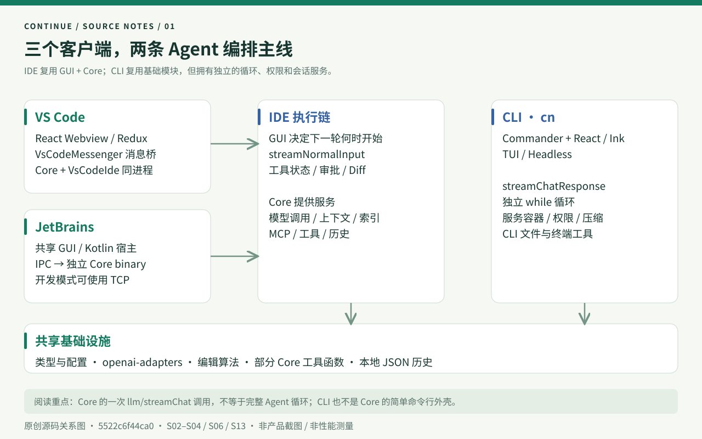
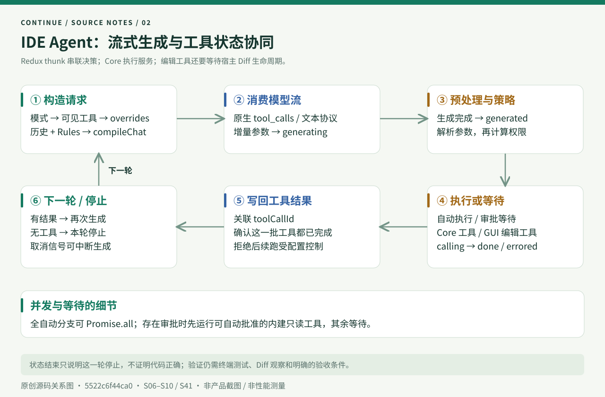
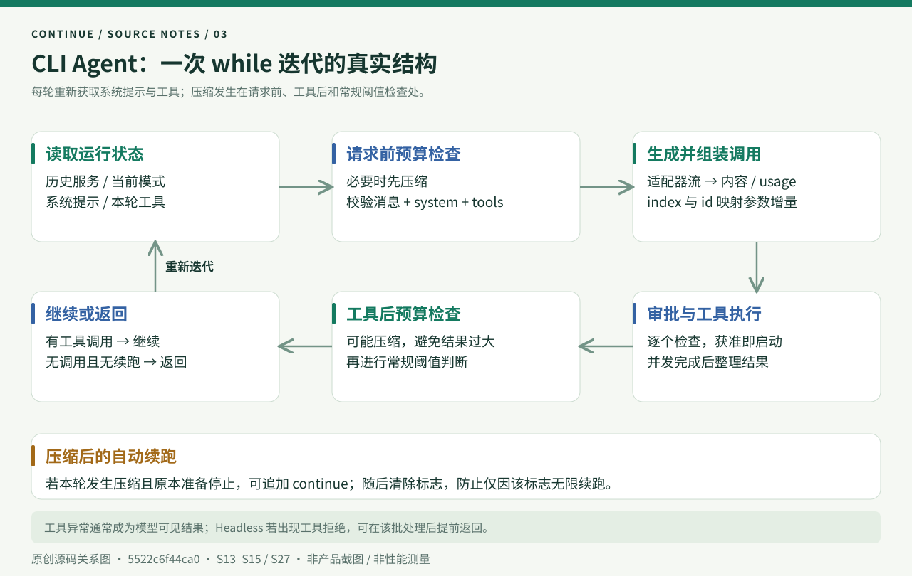
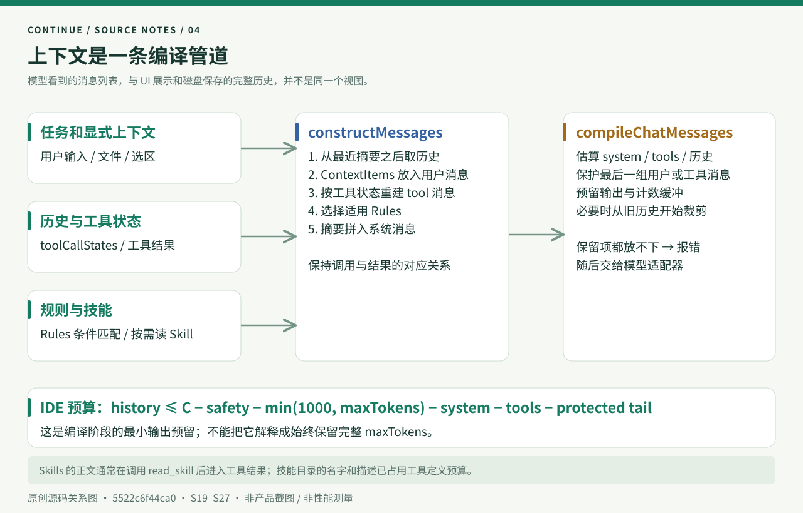
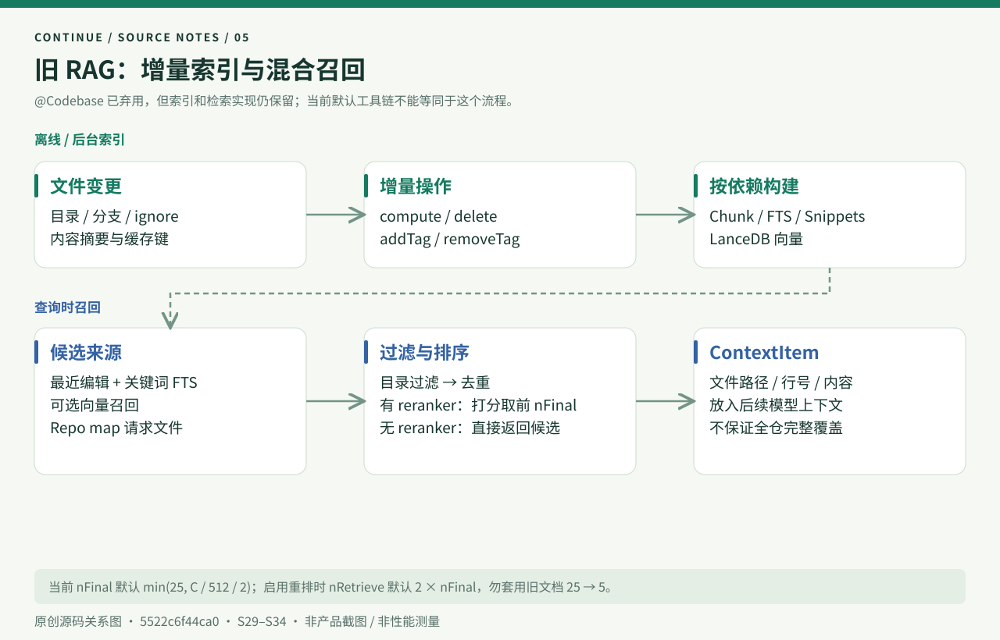
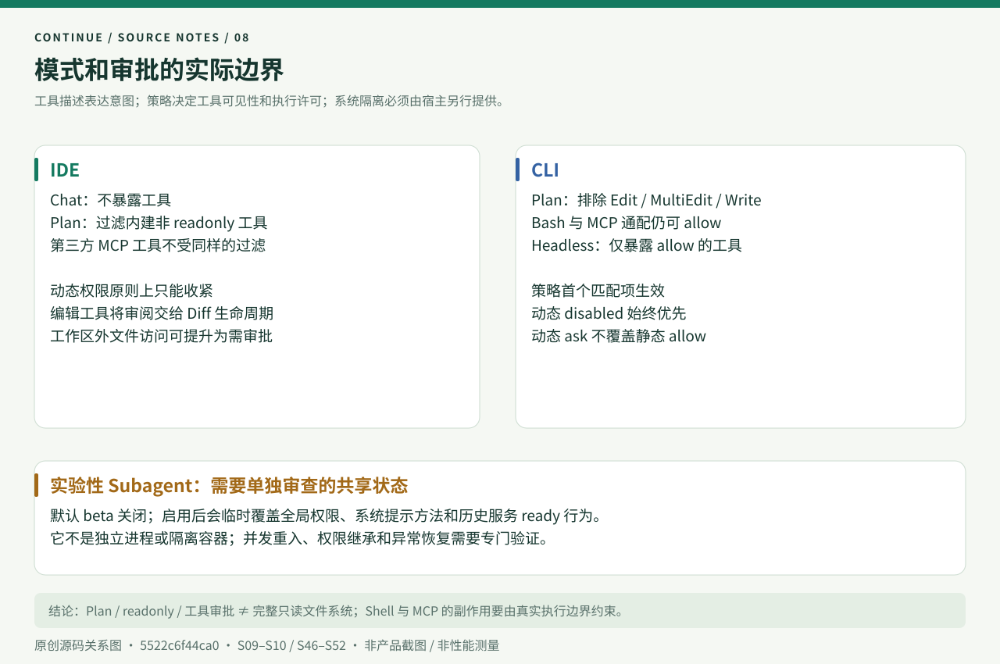
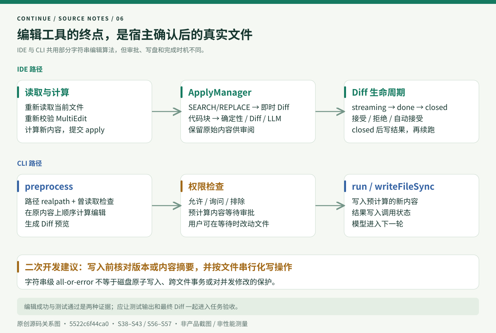
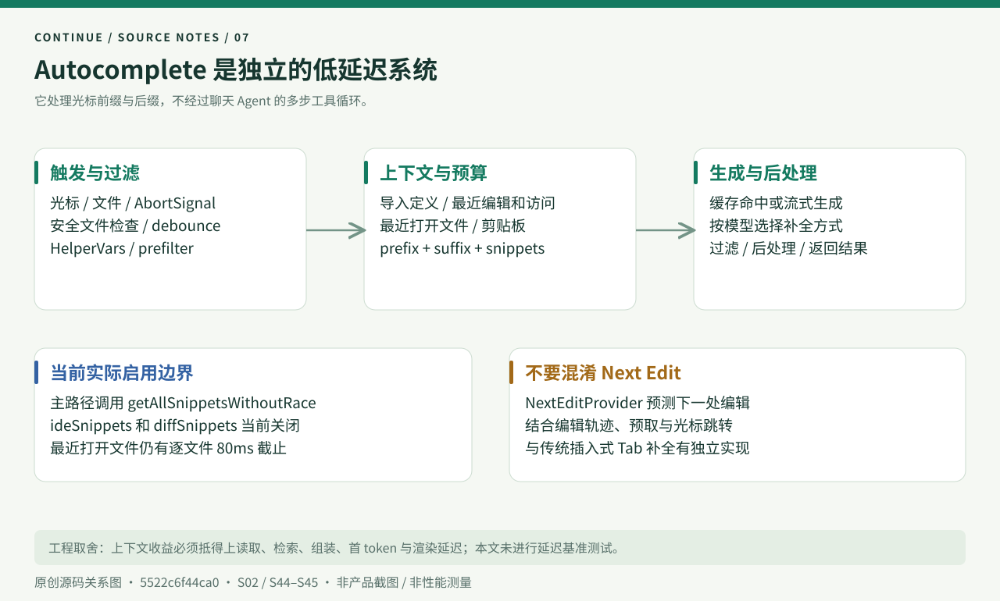
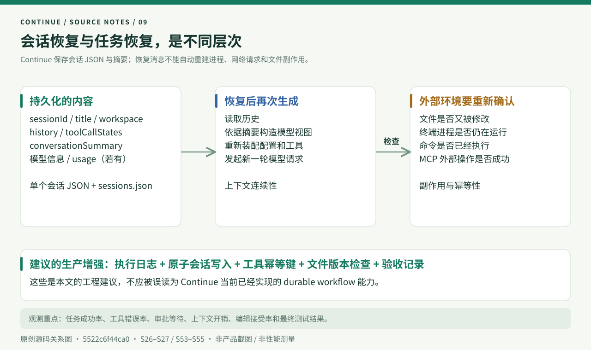

# Continue 源码深读：从 IDE 助手到可配置 Coding Agent 的工程实现

> 一次面向大模型 Agent 工程师的源码调研。调研日期：**2026-09-23**。官方仓库：[continuedev/continue](https://github.com/continuedev/continue)。源码基线：[`5522c6f44ca0ac3528b37244818fbfa39b5af470`](https://github.com/continuedev/continue/tree/5522c6f44ca0ac3528b37244818fbfa39b5af470)，提交时间为 2026-07-20 21:00:09 −07:00，即北京时间 2026-07-21 12:00:09。

阅读入口：[离线图文博客](index.html) · [源码地图](research/source-map.md) · [源码行为实验](examples/README.md) · [验证与边界](research/verification.md)

Continue 值得研究的地方，是它如何把模型输出变成开发者能控制、审阅和继续推进的工作流：配置加载出模型与工具，编辑器输入变成上下文，模型流变成工具状态，文件修改变成可接受或拒绝的 Diff，执行结果再回到下一轮请求。

从这一视角看，它包含三种不同的工程系统：**多步 Agent、低延迟补全、面向编辑器的代码修改**。三者共享模型和宿主能力，却有不同的时延目标、状态机和错误处理方式。如果只用“开源 Copilot”或“一个 ReAct 循环”概括 Continue，都会漏掉实现的主要部分。

本文包含 **9 张原创源码关系图、69 个固定提交源码入口、13 组已运行的隔离源码实验**。图中表达调用关系和控制边界，不是产品截图。代码事实、实验观察和工程建议分别注明；没有将静态阅读包装成全产品实测。

<a id="sec-01"></a>
## 01｜先确定研究对象：最终发布声明与源码快照要分开

官方 README 已声明：仓库不再积极维护，对用户只读，并说明为 VS Code、CLI、JetBrains 做了最终的 **2.0.0** 发布，移除了匿名遥测和登录认证等集成。README 同时建议使用 CLI 替代 JetBrains 插件。这是本次调研必须放在开头的背景，而不是沿用项目早期“快速迭代中的 AI IDE”叙述。[S01]

不过，**最终发布说明不等于当前源码里每个 package.json 都写着 2.0.0**。本次快照中，VS Code 包版本仍为 `1.3.40`，CLI 包版本为 `0.0.0-dev`，开发环境 `.nvmrc` 指向 `v20.20.1`。这三个数字描述不同对象；本文不据此推断各商店当前安装包的内部版本。[S64] [S65] [S66]

在线文档也存在时间差。例如 CLI 快速开始仍介绍 Continue 登录流程，而固定源码的入口已经没有相应的 `login` 命令。本文以固定源码解释实现，把文档作为交叉核对材料。[CLI 文档](https://docs.continue.dev/cli/quickstart) [S59]

| 常见理解 | 本次源码显示的情况 |
| --- | --- |
| IDE 和 CLI 共享一个完整 Agent 运行时 | 共享基础模块，但循环和权限编排分开实现 |
| Core 包含 IDE 的整个 Agent 循环 | IDE 循环的重要部分位于 GUI Redux thunks |
| Plan 模式意味着所有操作只读 | 工具筛选存在明确例外，不能当作系统隔离 |
| Agent 必须先建立向量索引 | 默认工具支持读文件、目录和搜索，索引不是每轮执行前提 |
| RAG 默认召回 25 条，再取 5 条 | 这是旧文档口径；本次源码的默认计算已经不同 |
| 搜索替换只做严格字符串匹配 | 还尝试去边缘空白、忽略大小写和忽略空白 |
| 保存会话就能恢复整个任务执行 | 保存消息状态，不等于恢复进程与外部副作用 |

本文的重点是 VS Code / 共享 GUI 与 CLI。JetBrains 讲清宿主和 Core 的连接方式；所有供应商、远端部署、历史云服务和发布渠道不逐一运行验证。

<a id="sec-02"></a>
## 02｜总体架构：共享能力之上，有两条 Agent 编排主线



Continue 是一个多包仓库，重要目录如下。

| 目录 | 主要职责 | 阅读时应关注的边界 |
| --- | --- | --- |
| `extensions/vscode` | VS Code 激活、IDE API、消息桥、补全、Diff | 编辑器能力如何注入通用逻辑 |
| `extensions/intellij` | Kotlin 插件、嵌入 GUI、Core 进程通信 | IDE 与 Node/TypeScript Core 的进程边界 |
| `gui` | React 界面、输入、Redux、工具审批与状态 | 同时承担 IDE Agent 的控制流 |
| `core` | 模型、配置、上下文、索引、MCP、工具、编辑算法 | 大量服务能力与类型契约 |
| `binary` | 把 Core 放入独立进程 | IPC；开发场景可用 TCP |
| `extensions/cli` | `cn` 命令、TUI、Headless、服务容器、循环 | 独立的 Agent 产品编排 |
| `packages/config-yaml` | 配置定义、校验、配置块与转换 | 声明式配置和运行时对象之间的边界 |
| `packages/openai-adapters` | 统一模型 API 外观 | 将不同供应商映射到共同的请求／响应类型 |
| `packages/terminal-security` | 命令分析与策略判断 | 只生成策略，不提供 OS 沙盒 |

VS Code 的 `VsCodeExtension` 创建 `InProcessMessenger`、`VsCodeMessenger` 和 `Core`，把 `VsCodeIde` 传入 Core。这里的 Core 与扩展宿主在同一个运行进程内；Webview 和扩展仍通过消息通信。[S02] [S04]

JetBrains 使用另一种部署：`binary/src/index.ts` 创建 `IpcIde` 和 `Core`，正常路径用 `IpcMessenger`，开发模式用 `TcpMessenger`。**同一份 Core 可以换宿主和传输，但这并不表示每个 IDE 的能力完全一致。**例如默认上下文加载会在 JetBrains 中过滤 terminal 和 problems 两个 provider。[S03] [S28]

CLI 没有简单地调用上述 Core 的“runAgent”。它的 `streamChatResponse()` 自己维护循环，配套 CLI 工具、权限服务、系统提示服务、历史服务与压缩逻辑。因此跨客户端复用更接近“共享组件和数据契约”，而不是“同一个 AgentRuntime，换一层 UI”。[S13] [S14] [S15]

**工程判断：**这种架构适合在产品演进中复用已有能力，但权限规则、上下文策略和错误语义可能逐渐分叉。二次开发时，不能修好 IDE 的一个分支，就假设 CLI 自动获得相同行为。

<a id="sec-03"></a>
## 03｜四类契约，把模型、上下文和宿主连接起来

在读循环之前，先建立数据模型。`core/index.d.ts` 中的类型把产品内部的对象分成几个关键层次。[S63]

| 契约 | 表达什么 | 为什么需要单独存在 |
| --- | --- | --- |
| `IDE` | 读写文件、工作区、打开文件、终端及编辑器能力 | 业务逻辑不应直接依赖 VS Code API |
| `ILLM` / `BaseLLM` | 对话、补全、FIM、嵌入、重排等模型能力 | 供应商差异不能扩散到每个业务调用点 |
| `ContextItem` | 内容、名称、描述、URI、图标等 | 同时服务界面展示、规则匹配和模型输入 |
| `ChatHistoryItem` | 消息、上下文、工具状态、摘要等 | 产品历史比模型 API 的消息更丰富 |
| `Tool` / `ToolCallState` | 工具定义、参数、策略、实现定位、调用状态 | 工具 schema 只是执行生命周期的一部分 |

消息桥的信封由 `messageType`、`messageId` 和 `data` 组成。协议类型描述请求和响应，`request()`、`send()`、`on()`、`invoke()` 提供不同方向的调用。[S04]

这里最重要的区分是：**内部历史不是可以直接原样提交给模型的 messages 数组。**界面需要知道工具是否等待审批、编辑是否完成、哪些上下文应显示；模型则需要合法的角色顺序、完整的调用与结果、受限的 token 数量。两者之间要有明确的转换层。

这样的分层还有一个实际收益：工具结果可以携带结构化文件 URI。后续规则选择不仅看字符串，还能识别“模型刚读过某目录下的文件”，从而应用与该文件相关的项目规则。[S19] [S20]

<a id="sec-04"></a>
## 04｜IDE 的一次请求：Agent 循环为何在前端状态机里



用户输入首先进入 `streamResponseThunk()`。它解析 TipTap 编辑器内容，通过 `resolveEditorContent()` 得到文本、选区代码、上下文项和兼容的 slash command 信息，创建用户历史项，再调用 `streamNormalInput()`。[S05]

`streamNormalInput()` 是 IDE Agent 的关键控制点。它依次完成以下工作：[S06]

1. 选择聊天模型，按 Chat / Plan / Agent 模式取得工具，再应用模型级 tool overrides。
2. 判断使用原生工具调用，还是系统提示中的文本工具协议。
3. 调用 `constructMessages()`，把历史、上下文和规则组装成模型消息。
4. 经 `llm/compileChat` 预编译并检查预算，更新 UI 的上下文占用和裁剪状态。
5. 经 `llm/streamChat` 读取增量响应，持续更新文字、思考内容和工具调用状态。
6. 流结束后，将工具标记为 `generated`，预处理参数，再评估动态权限。
7. 自动执行、等待审批，或者结束这一轮；工具结果到齐后再次生成。

这里有两种工具协议。支持原生 tools 的模型直接收到工具定义；另一条路径把工具说明放进系统提示，并用 `SystemMessageToolCodeblocksFramework` 与 `interceptSystemToolCalls()` 从文本流中识别调用。`experimental.onlyUseSystemMessageTools` 可以强制走后一条路径。因此“Continue 的工具调用永远是供应商 function calling”也不准确。[S06] [S61] [S62]

Core 中的 `llmStreamChat()` 负责一次模型生成或兼容 slash command 执行。它加载当前聊天模型，迭代 `model.streamChat()` 并传播取消信号；并不在这里完成“生成—工具—再生成”的全部循环。[S11] [S12]

### 工具状态与并发

一项工具通常经历 `generating → generated → calling → done`，也可能进入 `errored` 或 `canceled`。只有参数生成结束，才进入预处理和实际执行。增量 JSON 还不完整时不能直接执行，这是流式 UI 和有副作用动作之间的一道关键边界。[S06] [S07]

当所有待执行工具均可自动批准时，IDE 可以通过 `Promise.all` 启动多个调用；如果有工具需要审批，则先运行那些自动批准的**内建只读工具**，其余留待用户处理。这里没有一个可据此断言“所有写工具始终串行”的全局保证。[S06]

工具执行后，`streamResponseAfterToolCall()` 创建结果消息，并检查对应 assistant 的工具批次是否全部完成。`done` 和 `errored` 算完成；`canceled` 是否允许继续，受 `continueAfterToolRejection` 配置控制。批次满足条件后再 dispatch `streamNormalInput()`。[S08]

代码中的 `depth > 50` 限制只在测试环境生效，不能写成生产版最大执行 50 步。生产预算和任务终止约束应另行检查或由二次开发补充。[S06]

<a id="sec-05"></a>
## 05｜CLI 的循环：独立 while、动态工具与多处压缩检查



CLI 入口使用 Commander，交互界面使用 React / Ink；`-p` 将请求交给 Headless 路径。循环核心位于 `extensions/cli/src/stream/streamChatResponse.ts`。[S13] [S59] [S65]

以下是**按源码抽象的伪代码**，用于说明顺序，不是可直接替换上游的实现：

```typescript
while (true) {
  history = refreshFromHistoryService(history);
  system = await buildSystemMessage(currentPermissionMode);
  tools = await buildVisibleToolsAndApplyOverrides();
  history = await compactBeforeRequestIfNeeded(history, system, tools);

  const response = await generateAndAssembleToolCalls(history, system, tools);
  if (aborted()) return partialResponse;

  const earlyReturn = await recordAndExecuteTools(response);
  if (earlyReturn) return currentResponse;

  history = await validateAfterToolResults(history);
  history = await compactAtNormalThresholdIfNeeded(history);

  const autoContinue = maybeContinueAfterCompaction();
  if (!response.hasToolCalls && !autoContinue) break;
}
```

每轮重新获取 system message 和 tools，使用户在运行中切换权限模式后，后续模型请求能看到新的能力集合。工具不是启动时绑定后永远不变的一张清单。[S13]

`processStreamingResponse()` 处理模型输出流：内容增量用于显示；工具增量用 index 和 ID 映射进行组装；usage 信息在可用时记入记录。工具名称缺失的调用会被过滤。模型供应商输出的碎片，最终要被拼成可以预处理和执行的完整调用。[S13] [S15]

`handleToolCalls()` 先保存包含工具调用的 assistant 消息，再处理参数错误和实际执行。结果主要写入这条历史项中的 `toolCallStates`。源码特意避免又追加重复的独立 tool result，防止转换为模型 API 消息时出现重复结果。[S14]

### 审批按序，执行可以重叠

`executeStreamedToolCalls()` 逐项检查权限，但**获准的工具会立即启动**；检查后续工具权限时，前面的工具可能已经在运行。最后 `Promise.all` 等待所有已启动任务，并按原始索引整理返回结果。[S15]

这与“所有审批完成以后再同时启动”不同。代码中还保留了“拒绝一个就取消余下工具”的旧注释，但实际循环对被拒绝项 `continue`，后续调用仍独立检查和执行。因此阅读时必须让控制流优先于过时注释。

普通工具异常会变成模型可见的错误结果。Headless 中只要这批工具出现拒绝，处理完后可能提前返回当前内容；“返回了一段文字”不能自动解释为业务任务成功。[S14] [S15]

<a id="sec-06"></a>
## 06｜配置系统：把声明变成运行时对象

Continue 的配置不能只理解成“API Key 加模型名称”。配置最终决定模型角色、规则、上下文提供者、MCP 连接及工具行为，是 Agent 的运行时装配入口。[S16] [S17]

IDE 的 `ConfigHandler` 负责发现本地 profiles、维护所选配置、缓存加载结果、触发重载及通知监听者。YAML 加载会合并本地定义、处理配置块与校验，再将声明转换为 `ContinueConfig`。局部配置错误可以作为非致命错误收集，而不必让所有功能一起失效。[S16] [S17]

模型会被放入角色列表，并进一步形成当前选中的角色映射：

| 角色 | 对应任务 | 工程动机 |
| --- | --- | --- |
| `chat` | Chat / Agent 主对话 | 推理、选择工具、解释结果 |
| `autocomplete` | 行内补全、相关预测能力 | 低延迟与专用上下文格式 |
| `edit` | 编辑指令生成 | 聚焦选区或文件的改写 |
| `apply` | 将代码建议应用到已有内容 | 与高成本规划模型分工 |
| `embed` | 向量化 | 检索需要的表示空间 |
| `rerank` | 候选片段重排 | 从召回数量换取最终相关性 |
| `summarize` / `subagent` | 存在角色配置入口 | 是否使用必须继续追具体执行路径 |

角色存在并不代表所有相关功能都会选择它。例如本文分析的 IDE 会话压缩传入的是当前聊天模型；CLI 压缩同样复用当前模型，不能因为配置里有 `summarize` 就断言摘要一定使用独立小模型。[S17] [S26] [S27]

`modelConfigToBaseLLM()` 将 YAML 的 `name` 转成模型显示标题，把 `defaultCompletionOptions`、能力声明、request options、prompt templates、tool overrides 等映射到具体 provider 类。能力声明用于告知系统如何使用模型，**不会让一个本不支持工具调用的模型突然获得可靠的工具能力**。[S18]

可调整的示例见 [examples/config.yaml](examples/config.yaml)：

```yaml
name: Local Engineering Agent
version: 1.0.0
schema: v1
models:
  - name: Local Chat
    provider: ollama
    model: YOUR_TOOL_CAPABLE_MODEL
    roles: [chat, edit, apply]
    capabilities: [tool_use]
  - name: Local Completion
    provider: ollama
    model: YOUR_COMPLETION_MODEL
    roles: [autocomplete]
```

这是一份**配置结构示例**，模型名称是占位符，须替换为实际已安装且能力匹配的模型；本文没有启动这些模型或实测其效果。角色、参数和供应商接口都要符合所选部署，而不是机械复制某个模型的上下文上限。[S18] [S24]

MCP 加载还有一个异步细节：配置先触发连接刷新，连接完成后再引发配置重载，让新发现的工具、资源和状态进入系统。配置是受外部连接状态影响的运行时视图。[S11] [S17]

<a id="sec-07"></a>
## 07｜上下文工程：显式输入、动态规则与渐进式 Skills



`constructMessages()` 说明了 Continue 如何将产品历史转换成模型上下文。[S19]

它先找到最近的 `conversationSummary`，只取摘要之后的原始历史；再遍历历史，把用户的 ContextItems 放到用户消息内容前。对于 assistant 的工具调用，根据 `toolCallStates` 重建 tool messages，包括取消、报错和正常输出。原历史中独立的 tool 消息会被跳过，避免重复插入。

之后，函数从最近用户消息以来的用户／工具上下文中提取规则匹配信息，调用 `getSystemMessageWithRules()`。如果存在摘要，摘要再附加到系统消息。于是最终请求包含的是**当前适用规则 + 摘要 + 后续历史 + 必要工具结果**，而非一份无限增长的完整记录。

### Rules 是上下文选择规则，不能代替权限控制

Rules 可以按全局、`alwaysApply`、globs、内容 regex 和文件位置判断是否应用；UI 中关闭的规则优先排除。模型读到了新文件，下一轮就可能命中新的规则，因此规则选择与工具使用是联动的。[S20]

例如 [examples/project-rule.md](examples/project-rule.md) 限定 TypeScript 文件，让 Agent 在相关上下文出现时遵循项目约定。这类约定适合表达编码风格、验证方式与架构要求。能否写文件、运行命令仍由工具执行层决定。

还有一个应注意的实现细节：当前目录规则辅助函数通过末级目录名是否出现在路径中来判断归属，而不是严格的规范化祖先路径关系。它可能让同名目录之间出现非预期的规则应用。**这是源码上的边界推断，不是已完成的跨平台漏洞复现。**规则路径匹配适合进一步改为规范化 URI 和明确的目录关系。[S20]

### Skills 的渐进式加载发生在模型上下文层

IDE 的技能加载器从 `.continue/skills` 等配置目录以及工作区 `.claude/skills` 发现 `SKILL.md`，校验非空 name 和 description，读取正文并记录同目录的辅助文件。`read_skill` 的工具描述只列出技能名称和描述；模型选择该技能后，正文通过工具结果进入上下文。[S21] [S22]

CLI 有自己的 `Skills` 工具：先提供目录，按 `skill_name` 返回内容，并列出可进一步读取的辅助文件。[S60]

因此，这里的“按需加载”主要是**按需向模型暴露正文**，不必然意味着磁盘文件也只在首次调用时才读。配置阶段可以已经读入内容，而模型上下文仍保持较小。这是资源加载与 prompt 加载两个不同层次。

<a id="sec-08"></a>
## 08｜模型适配：统一接口远不止替换 apiBase

`BaseLLM` 承担统一角色之外的公共逻辑：合并请求选项、应用工具覆盖、编译消息、准备模板、记录交互、处理流与取消、收集 usage，并调用具体供应商实现。[S23]

`streamChat()` 中至少可以看到三类生成路径：

- 有 `templateMessages` 时，先把聊天消息渲染成文本模板，再走 completion。
- 适用 OpenAI adapter 时，转换为统一 API 请求；特定模型和配置还会选择 Responses 路径。
- 其他 provider 可以实现自己的 `_streamChat()`，返回 Continue 的统一消息增量。

`packages/openai-adapters` 的工厂按 provider 创建 OpenAI、Anthropic、Gemini、Bedrock 等适配器，并为若干兼容服务配置默认地址。CLI 使用这层的 `BaseLlmApi`；IDE 通常经 `BaseLLM` 再决定如何调用适配器。[S23] [S24]

这里的“OpenAI 风格”描述的是适配层的数据外观，不能理解成所有网络请求最终都发往 OpenAI。比如 Ollama 在 CLI 兼容路径需要 `/v1`，Core 中的 Ollama provider 又可以覆盖具体端点。[S24]

从 Agent 工程角度，适配层至少有四类兼容性责任：

| 问题 | 会造成什么后果 | 应如何验证 |
| --- | --- | --- |
| 工具增量中的 index、ID、参数碎片 | 调错工具或拼出不完整参数 | 多调用交错、分片参数、缺失字段 |
| tool call 与 result 消息转换 | 供应商拒绝请求或重复消费结果 | 多工具、取消、报错、恢复后的消息 |
| 推理块、usage、图像与缓存字段 | 信息丢失或 token 统计失真 | 针对 provider 的请求／响应契约 |
| 流式取消与网络重试 | 重复内容、挂起请求、意外继续 | 取消中途流、服务端失败、重连 |

前三列是依据调用结构给出的工程分析；本文没有对每一家 provider 进行网络集成测试。添加新 provider 时，仅验证普通文本回复是不够的，Agent 的多轮工具历史才是最容易暴露差异的地方。

<a id="sec-09"></a>
## 09｜预算与压缩：IDE 和 CLI 不能用同一个公式概括

IDE 的 `compileChatMessages()` 先处理图片能力、系统消息、空消息和末尾关键序列，再计算工具 schema、system、最后一组消息以及普通历史占用。预算不足时从旧历史开始裁剪，并去掉失去对应调用的工具结果。[S25]

令 `C` 为上下文长度，`B` 为计数缓冲，`S` 为系统消息，`T` 为工具定义，`L` 为受保护的末尾序列，则普通历史的预算近似是：

```text
historyBudget = C − B − min(1000, maxTokens) − S − T − L
```

其中 `min(1000, maxTokens)` 是该函数当前采用的**最小输出预留**，不是始终扣除全部配置输出上限。已知上下文长度且受保护内容都放不下时，函数报 `Not enough context`，GUI 将其转为上下文不足提示。[S06] [S25]

摘要是另一条路径。IDE 的 `compactConversation()` 使用当前模型对指定位置之前的历史生成摘要，把 `conversationSummary` 写回该历史项；后续 `constructMessages()` 使用摘要后的视图。原始消息仍可留在保存的历史里。[S19] [S26]

### CLI 自动压缩不是简单的 80%

CLI 源码虽有“80% threshold”注释，但 `shouldAutoCompact()` 的实际公式包含输出预留和封顶缓冲。设 `C` 为上下文长度、`O` 为最大输出 token，则：[S27]

```text
buffer    = min(max(O, ceil(0.2 × (C − O))), 15000)
threshold = C − O − buffer
compact   = totalInputTokens >= threshold
```

`totalInputTokens` 包含历史、system message 和工具定义。以下是读取原函数、注入可控 token 计数得到的阈值；这是数学边界验证，不是模型容量实测。

| C | O | 实际触发阈值 | 占 C 的比例 |
| ---: | ---: | ---: | ---: |
| 128,000 | 4,096 | 108,904 | 85.08% |
| 32,000 | 4,096 | 22,323 | 69.76% |
| 16,000 | 4,000 | 8,000 | 50.00% |

CLI 还会在请求前和工具执行后检查长度。紧急裁剪辅助函数 `pruneLastMessage()` 从**历史末尾**删除内容，并根据相邻 user 或 assistant tool call 尝试成对裁剪。它与 IDE 从旧消息开始移除的策略不同，也不应被拔高为“任意复杂工具历史都能完美保序”的通用算法。[S13] [S27]

**工程含义：**一次巨大的终端输出，不仅挤占后续请求，还可能导致近期工作信息被裁掉。因此工具输出限额、摘要质量、保留任务约束，比单独调大模型窗口更直接。Continue CLI 会把同批调用数量传给工具，以便部分工具分摊输出预算。[S15]

<a id="sec-10"></a>
## 10｜代码检索：保留的 RAG 实现，与当前 Agent 搜索路径



官方文档已将 `@Codebase` 标为弃用，引导使用 Agent 的代码库感知方式。但仓库仍保留 Chunk、全文搜索、向量索引与重排管道，研究这些实现仍然有价值。[弃用说明](https://docs.continue.dev/reference/deprecated-codebase)

### 增量索引如何避免每次重算

`CodebaseIndexer` 依据已启用 context provider 声明的 `dependsOnIndexing` 选择需要构建的索引，并不是看到工作区就无条件构建所有类型。当前 `getIndexesToBuild()` 首先要求选中的 embed 模型；VS Code 的 YAML 加载又会在候选中补入 transformers.js embedding provider，因此“用户没显式写 embed”与“运行时一定没有 embed”也不能画等号。[S17] [S29]

索引类型包括代码 Chunk、Code Snippets、FTS 和 LanceDB 向量。`refreshIndex.ts` 用 SQLite 保存目录、分支、artifactId、路径、cacheKey 和时间等元数据，将更新拆成 `compute`、`del`、`addTag`、`removeTag`。内容复用与分支归属是分开的：一个内容产物可以被缓存，而分支标签决定它在哪个上下文中可检索。[S29] [S30]

这比“文件一变就删除所有向量”更适合开发环境。切分支、少量文件修改和重复内容可以分别处理，索引器还暴露暂停、取消和进度状态。源码里的部分数字，如每批 200 个文件，是内部批处理设置，不是吞吐性能承诺。[S29]

### 查询时并不只有向量相似度

重排管道收集最近编辑的文件、FTS、可选 embedding 以及 repo map 请求出的文件，过滤目录并去重，然后由 reranker 打分，按 `nFinal` 截取。重排失败时退回候选列表的前若干项。源码中进一步扩展和二次重排的部分流程被注释掉，不能画成已运行的 Graph RAG。[S32]

无 reranker 的路径，把 `nFinal` 的名义配额分给最近编辑 1/4、FTS 1/4、embedding 1/2，并追加 repo map 候选；最终去重后直接返回，**没有统一再截取到 nFinal**。所以 `nFinal` 在该路径不构成严格的最终数量上限。[S33]

当前入口默认值是：`nFinal = min(25, contextLength / 512 / 2)`；启用重排时 `nRetrieve` 默认 `2 × nFinal`，未启用时使用 `nFinal`。源码注释还留有“最多 100 snippets”的旧说法，与常量 25 不一致；应以表达式为准。[S31]

### Agent 为什么不必依赖 RAG

当前工具装配默认包含读文件、目录、文件 glob、终端等，再按模型与环境添加编辑和 grep 能力。`codebase`、repo map、范围读取等一组工具还受实验开关控制。默认 Agent 可以通过“列目录 → 搜索符号 → 读文件 → 再搜索”逐步建立上下文。[S34]

这两条路径适合不同问题。语义检索适合模糊需求和知识发现；精确搜索适合找符号、引用和全部匹配。修改函数签名时，几条向量相似结果不能证明找全了调用点。实际产品可以把 RAG 作为候选发现工具，再让 Agent 用确定性搜索确认范围。

<a id="sec-11"></a>
## 11｜工具与 MCP：发现、命名、执行、结果转换

一个 Continue 工具不只是 JSON Schema。IDE 的工具定义还可以包含显示文案、分组、readonly、默认策略、参数预处理器、动态策略函数，以及 URI 形式的实现位置。前端拿到的是可序列化描述；真正的函数能力留在执行侧。[S34] [S35] [S63]

`callToolById()` 分成两条路：编辑类工具走 GUI 的 client tool 实现；其他工具经 `tools/call` 发给 Core。Core 再区分内建函数、HTTP URI 和 MCP URI。HTTP 工具通过 POST 发送 arguments；MCP 工具解码 server 与 tool 标识，找到已有连接，通过 MCP client 发起调用。[S07] [S35] [S67]

### MCP 连接有自己的生命周期

`MCPConnection` 管理 connecting、connected、error 等状态以及连接中的 Promise，避免同一个连接被重复初始化。连接后按服务端能力获取 tools、resources、resource templates 和 prompts。配置随后把发现结果接入工具列表、上下文或命令能力。[S36]

传输支持 stdio、Streamable HTTP、SSE 等，代码还包含 WebSocket 分支。对提供 URL 而没有明确 type 的配置，先尝试 HTTP，再尝试 SSE；不能把所有远端 MCP 都写成 SSE。超时、取消、stdio stderr 和连接错误也参与状态反馈。[S36]

MCP 工具名要变成模型可使用的函数名。`getToolNameFromMCPServer()` 将 server name 转为小写，以 `_` 替换非字母数字片段，再作为前缀。实验显示，`My API` 与 `My-API` 都会规范化为 `my_api`；这个辅助函数本身不保证全局无碰撞，配置时应使用清晰、可区分的名称。[S37]

### MCP 协议能力不等于宿主完整支持

Core 调用 MCP 工具前，会按工具 schema 做参数类型处理；调用返回 `isError` 时转为工具错误。正常结果转换为 `ContextItem[]`，当前该转换主要接收 text 和文本 resource；其他内容类型会产生“不支持该类型”的结果说明。代码还有基于 metadata 拉取 UI resource 的路径，但不能据此宣称所有 MCP 多模态内容都能无损进入对话。[S35]

**工程含义：**接入 MCP 至少要验证四个边界：服务端连接、工具命名、参数转换、结果映射。能够 `listTools` 只证明发现成功，不证明该工具在当前模型和 GUI 中可正常执行、显示和续跑。

<a id="sec-12"></a>
## 12｜权限实现：必须区分可见性、审批与系统隔离



Continue 的权限问题需要分成三层：模型能看到什么工具；某次调用能否执行；执行进程实际拥有多少文件、命令与网络权限。前两层由产品策略控制，最后一层取决于宿主环境。

### IDE 的模式筛选

`selectActiveTools` 的逻辑很直接：Chat 返回空工具列表；其他模式先排除 disabled 工具及被 exclude 的组；Plan 再保留“非内建组工具，或内建 readonly 工具”。[S09]

等价的筛选条件是：

```typescript
tool.group !== BUILT_IN_GROUP_NAME || tool.readonly
```

这意味着，一个已启用的外部 MCP 写工具，即使 `readonly: false`，仍可能在 IDE Plan 模式中暴露。审批策略仍可阻止实际执行，但**模式筛选本身不保证外部工具只读**。这一行为已用原 selector 的判断逻辑验证，Redux memoization 外壳在实验中被替换。[S09]

IDE 动态策略通常遵循从宽到严的顺序：`allowedWithoutPermission → allowedWithPermission → disabled`。基础策略已禁止时不能放宽，动态检查可以要求更多确认；工作区外文件访问会提升为需要审批。编辑工具是特殊路径：策略层允许它继续进入 apply，而用户控制放在 Diff 审阅生命周期中。[S10] [S41] [S46]

### CLI 权限不能照搬 IDE 的解释

CLI 的策略是按顺序匹配，**首个匹配规则生效**。默认 TUI 对 Edit、MultiEdit、Write、Bash 和未匹配工具保留询问；读操作和若干辅助工具默认允许。Headless 默认列表把 Bash 和最后的通配设为 allow，但前面 Edit / MultiEdit / Write 的 ask 仍先命中。[S48] [S49]

`getRequestTools()` 在 Headless 中只向模型暴露 allow 的工具；TUI 还可以暴露 ask 工具。所以默认 Headless 并非“所有工具无条件放开”，也不是“只有只读工具”：可能不暴露 Edit，却允许具有写能力的 Bash 和 MCP。[S14] [S48]

CLI Plan 的显式策略排除 Edit、MultiEdit、Write，但允许 Bash，并保留允许 MCP 的通配。Plan / Auto 模式还在权限服务装配中采用模式策略的整体覆盖。这些都说明 `--readonly` 的产品意图和操作系统层面的不可写，需要分开理解。[S48] [S58]

另一个重要差异：CLI `checkToolPermission()` 会让动态结果 `disabled` 优先，但如果动态结果只是“需审批”，仍返回用户原有的基础策略。因此基础 allow 不会因动态 ask 而被收紧。实验注入可控 evaluator 复核了这个优先级；这不等价于已经测试了全部 Shell 安全规则。[S49]

### Terminal Security 做了什么

共享 terminal-security 包使用 `shell-quote` 分词，并检查多行命令、操作符、管道、命令替换、变量及混淆模式，组合较严格的策略。解析失败时倾向要求审批。[S47]

但它返回的是策略枚举，没有创建容器、限制系统调用、挂载只读文件系统或隔离网络。把这层叫作“命令风险判定”更准确。若要运行不可信代码，应在实际执行器之外增加受限进程、容器或虚拟机等隔离机制；这是本文的部署建议，不是 Continue 已内建的保证。

<a id="sec-13"></a>
## 13｜代码编辑：从模型建议到可审阅 Diff



编码 Agent 最难处理的副作用之一，是“把模型想改的地方准确改到当前文件里”。Continue 将它拆成两类：字符串替换类编辑，以及把代码建议应用到已有文件的 apply。

### 搜索替换并非只有 exact match

共享 `findSearchMatch()` 按以下顺序尝试匹配：[S42]

1. 严格子串匹配。
2. 去掉搜索内容两端空白后匹配。
3. 忽略大小写匹配。
4. 忽略空白后匹配，再映射回原字符位置。

Jaro-Winkler 相似度实现虽然存在，但没有加入当前启用的策略数组。不能因为看见 `findFuzzyMatch()` 就声称编辑器正在用该算法做模糊补丁。

宽松匹配能容忍模型输出中轻微的格式差异，同时扩大了可能匹配的范围。`executeFindAndReplace()` 因此在单次替换发现多个匹配时抛错，要求更具体的上下文或显式 `replace_all`。批量替换从后向前应用，避免前面的替换改变后续字符位置；非精确匹配还会调整替换内容的缩进。[S43]

`executeMultiFindAndReplace()` 按数组顺序处理多个修改，后一项基于前一项的结果。它先计算一个新字符串，因此计算过程中某一项失败，不会返回半成品内容。这只是**单次内容计算的 all-or-error 语义**，不是跨文件事务，也不是磁盘崩溃一致性。[S43]

### IDE：工具完成要等 Diff 的完成事件

GUI 的 `multiEditImpl` 在真正执行时重新校验参数、重新读取文件，然后计算新内容，dispatch `applyForEditTool()`。再次校验的原因写得很清楚：等待工具执行期间，文件可能已被用户或其他组件修改。[S38]

该工具返回 `respondImmediately: false`，因为完成时机要交给 apply 状态机。VS Code `ApplyManager` 捕获原始文件内容，处理即时替换 Diff 或模型辅助应用，再把状态发回 GUI。用户接受、拒绝或配置自动接受后，`handleApplyStateUpdate()` 在合适的 closed 分支写入成功／失败反馈，并推动 Agent 继续。[S39] [S41]

这解释了为何不能在“工具函数已返回”时立即告诉模型文件已经成功修改：返回可能只表示编辑器开始展示修改，而真正的确认仍在后面。

自动格式化也是上下文的一部分。源码会把编辑器额外产生的格式化 Diff 告知模型，使下一次 SEARCH/REPLACE 能对齐真实文件内容。否则模型继续使用旧引号、旧分号或旧缩进，很容易匹配失败。[S41]

### Apply：确定性算法优先，必要时使用模型

`applyCodeBlock()` 先对支持的语言尝试确定性 lazy edit 处理，并在此入口限制为 `onlyFullFileRewrite: true`；若内容符合 Unified Diff，则尝试直接应用；否则返回需要生成式应用的分支信息。[S40]

VS Code 的 `ApplyManager` 根据返回结果选择即时 Diff 或自身的非即时处理路径，后者可以经 VerticalDiffManager 做流式编辑，或累积输出后计算 Myers Diff。它优先选择 `apply` 角色模型，没有时回退 `chat`。不能只根据 `applyCodeBlock()` 返回了某个 generator，就断言所有客户端都会直接消费同一条 generator。[S39] [S40]

### CLI：先预计算，再审批与写盘

CLI `Edit` / `MultiEdit` 先规范化真实路径、检查敏感文件及“这个路径是否读过”，读取内容并生成修改预览。获准后，run 直接 `writeFileSync` 写入预计算的新内容。[S56] [S57]

这条路径没有像上述 IDE MultiEdit 那样在 run 中重新计算内容。若用户在审批等待期间修改同一文件，预计算内容可能覆盖新改动；同批写工具并发也值得审查。**这是调用链推导的并发风险，本次没有故意在真实文件上制造竞争复现。**可以通过写入前比较内容摘要、文件版本号，或按文件串行化来增强。

<a id="sec-14"></a>
## 14｜Autocomplete 与 Next Edit：另一种上下文工程



`CompletionProvider.provideInlineCompletionItems()` 是专用补全入口。它准备 autocomplete 模型，检查文件安全性，执行 debounce，构造 HelperVars 并做前置过滤；然后收集上下文、按 token 预算生成 prefix / suffix / prompt，查缓存或读取模型流，最后后处理并返回补全结果。[S44]

这不是“给聊天 Agent 发一句继续写代码”。补全不能频繁让用户审批，也不适合串联多轮 Shell 工具。它的主要优化目标是：光标处建议足够相关，而且在用户继续键入前出现。

上下文来源包括根路径／导入定义、最近编辑范围、最近访问范围、最近打开文件、剪贴板，以及可选的静态上下文。当前主路径调用 `getAllSnippetsWithoutRace()`；因此不能拿同文件另一个函数里的统一 `racePromise(..., 100)`，概括成“补全上下文一律 100ms 超时”。最近打开文件内部仍有逐文件 80ms 截止。[S45]

同样要区分代码存在与功能启用：当前 `IDE_SNIPPETS_ENABLED = false`，Diff snippets 的接入被注释掉。导入定义上下文仍在使用，这也不等于所有 LSP 相关信息都关闭。[S45]

补全结果还要经过过滤、后处理和取消检查。缓存可以减少重复请求，但缓存键、文件内容变更和光标位置之间的有效性关系，需要在二次开发时一起考虑。本文没有做真实首 token 或补全接受率基准测试。[S44]

Next Edit 则是另一套入口。VS Code 根据模型能力与设置启用 `NextEditProvider`、NextEditWindowManager、JumpManager 和相关选择事件处理，结合编辑轨迹与预测结果引导后续修改。它与传统插入式 Tab 补全相关，但不能简单写成同一个 FIM 调用换皮。[S02]

<a id="sec-15"></a>
## 15｜子 Agent：实验能力与隔离能力要分开评价

CLI 的工具目录含有 Subagent 定义，但当前 `betaSubagentToolEnabled` 默认是 false；只有开关启用后，`getAllAvailableTools()` 才加入动态 subagent 工具。内建工具元数据列表包含某工具，不代表它每次都会进入模型请求。[S51] [S52]

实际执行器 `executeSubAgent()` 接收另一个模型配置和任务 prompt，构造自己的历史数组，再调用同一个 `streamChatResponse()`。这提供了用专用模型／提示执行子任务的基础。[S50]

但其运行环境并不独立。当前执行器会暂时：

- 将全局权限状态换为通配 allow；
- 替换系统提示服务的 `getSystemMessage()` 方法；
- 把共享历史服务的 `isReady()` 改为 false，避免主历史介入；
- 在内部 finally 中恢复这些状态。

这不是独立服务容器、独立进程或独立工作区。参数 `parentSessionId` 的存在，也不意味着已经实现了持久化父子任务树。[S50]

**工程判断：**并发子任务可能竞争同一套全局状态，多个执行器的保存／恢复顺序也需要关注。并且权限覆盖发生在内部 finally 保护区之前，早期失败路径还需单独核查。本文将它视为需要额外审计的实验入口，而不是成熟的多 Agent 隔离运行时。

如果基于它设计多 Agent 系统，建议让每个 child run 持有自己的 history、permission evaluator、system-message builder、cancel scope 和资源预算；共享服务应只包含明确可并发使用的无状态能力。父子关系还需要任务 ID、结果契约、取消传播和持久化记录。这些是增强方案，不是当前源码事实。

<a id="sec-16"></a>
## 16｜会话、恢复与观测：保存聊天不等于恢复执行



共享 `HistoryManager` 以 JSON 保存单个会话，并更新独立的 `sessions.json` 索引。内容包含 sessionId、标题、工作区、历史，以及存在时的模式、模型标题和 usage。CLI 在自己的 SessionManager 外围复用这套保存能力，并提供按 ID 或最近会话恢复等路径。[S53] [S54]

从源码上看，它是**文件快照式会话持久化**。保存会话正文和更新索引是两次独立写入，不应描述为 append-only 事件日志或数据库事务。读文件失败时有回退和错误处理，但这不构成整个 Agent 执行的 exactly-once 保证。[S53]

恢复历史可以让模型继续理解“刚刚做了什么”，却不能自动证明：上一条 Shell 命令是否完成、用户是否已改过文件、MCP 请求是否在远端成功、已关闭的进程能否恢复。面对这些情况，Agent 需要重新读文件、查看进程或查询操作状态。

摘要的持久化语义也因路径不同而不同：IDE 在历史项上写摘要标记；CLI `compactChatHistory()` 会生成精简历史，自动压缩流程可用精简结果更新会话。不能笼统宣称“所有客户端永远完整保留压缩前的原始事件”。[S26] [S27] [S54]

### 匿名遥测移除后，观测代码仍然有意义

README 的“移除匿名遥测”不意味着仓库再无日志、usage 或 OTEL。CLI `TelemetryService` 只有在有显式 OTEL 配置且开关允许时启用；还可以记录模型响应时间、token、成本估算和代码编辑相关指标。IDE BaseLLM 也有交互日志机制。[S01] [S23] [S55]

二次开发建议同时观测任务级和运行级指标：任务验收成功率、模型请求次数、工具错误与参数修复次数、审批等待、压缩前后 token、编辑接受／拒绝、最终测试结果。只观察模型输出 token 或代码行数，无法判断 Agent 是否完成了正确修改。

<a id="sec-17"></a>
## 17｜把链路串起来：一次“修复参数校验错误”的任务

以下是**根据源码机制构造的示例轨迹**，用于解释数据如何流动，不是本次真实调用模型的录屏或执行日志。

用户提出：“接口收到空字符串时应返回校验错误，请修复并补上测试。”在 IDE Agent 中，一条合理的执行路径如下。

| 阶段 | 系统发生的事 | 应保留的工程证据 |
| --- | --- | --- |
| 输入 | TipTap 内容和显式文件引用变成 user message / ContextItems | 原始任务约束与用户选定范围 |
| 发现 | 模型调用目录、glob、grep、读文件工具 | 找到的实际路径和源码片段 |
| 决策 | 文件 URI 触发相关 Rules，模型提出修改 | 适用规则、模型看到的内容版本 |
| 编辑 | MultiEdit 计算修改并进入 Diff 审阅 | old/new 内容、toolCallId、接受结果 |
| 验证 | 经权限检查运行相关测试 | 命令、退出状态、失败或通过输出 |
| 修正 | 若测试失败，工具结果作为下一轮观察 | 错误信息、调整原因与新 Diff |
| 收尾 | 无更多工具调用时给出最终说明 | 哪些文件改变、哪些验证确实执行 |

这条轨迹说明，ReAct 式循环只是骨架。要让编码任务可靠，还要有文件定位、消息配对、规则选择、参数校验、审批等待、编辑确认与测试反馈。一个环节缺失，模型的自然语言“已完成”就可能与环境事实脱节。[S05] [S06] [S07] [S08] [S19] [S38] [S39] [S40] [S41]

从教学实现的角度，可以将 Continue 暴露出的职责抽象为下列接口。它们是**本文的设计提炼，并非仓库中的原始 API**：

```typescript
interface AgentDependencies {
  model: ModelStream;
  context: ContextCompiler;
  tools: ToolRegistry;
  policy: PermissionEvaluator;
  host: FileAndProcessHost;
  history: ConversationStore;
  budget: RunBudget;
}

// 每次调用都携带明确的运行上下文，避免子任务改写全局服务。
interface RunContext {
  sessionId: string;
  runId: string;
  signal: AbortSignal;
  workspace: string;
  policySnapshot: PermissionSnapshot;
}
```

这里特意加入 `RunBudget` 和权限快照，是为了表达前面分析提出的增强方向。它们帮助区分“复用了 Continue 的思想”和“Continue 已经这样实现”。

<a id="sec-18"></a>
## 18｜如何阅读、调试和二次开发这份代码

建议先固定源码，再沿一条具体任务链设断点，不要一次从所有 provider 开始阅读。

```bash
git clone https://github.com/continuedev/continue.git
cd continue
git checkout 5522c6f44ca0ac3528b37244818fbfa39b5af470
nvm use
```

官方贡献文档给出的 VS Code 开发路径是执行 `install-all-dependencies` task，再选择 `Launch extension` 启动扩展开发宿主。本文没有运行完整安装和打包流程；这些操作会安装大量依赖，应在独立开发目录完成。仓库维护状态改变后，贡献文档中的旧发布／协作流程也不能照搬。[开发说明](https://github.com/continuedev/continue/blob/5522c6f44ca0ac3528b37244818fbfa39b5af470/CONTRIBUTING.md)

最有价值的断点路线是：

```text
IDE:
streamResponseThunk → streamNormalInput → constructMessages
  → Core llm/compileChat → llmStreamChat → BaseLLM.streamChat
  → preprocessToolCalls → evaluateToolPolicies → callToolById
  → Core 工具 / client edit → streamResponseAfterToolCall

CLI:
streamChatResponse → processStreamingResponse → handleToolCalls
  → preprocessStreamedToolCalls → executeStreamedToolCalls
  → 工具结果写回 → 下一轮或压缩
```

不同改造任务应放在不同层：

| 改造目标 | 优先修改位置 | 至少验证什么 |
| --- | --- | --- |
| 接入模型供应商 | `core/llm`、`packages/openai-adapters` | 流式参数、工具历史、取消与 provider 特有字段 |
| 添加 IDE 内建工具 | Tool definition、Core dispatcher 或 client tool、GUI 策略 | 可见性、参数错误、权限、结果和续跑 |
| 接入外部业务工具 | MCP 配置与服务端实现 | 名称唯一性、Schema、超时、错误和结果类型 |
| 修改编辑行为 | searchAndReplace、ApplyManager、apply 状态处理 | 文件变更、重复匹配、拒绝与格式化 |
| 严格只读模式 | IDE selector、CLI policies、最终执行器 | Bash/MCP、路径边界、间接写入 |
| 多 Agent 并行 | CLI 子任务依赖与服务容器 | 独立权限、历史、取消和并发文件写入 |
| 提升补全体验 | CompletionProvider、上下文与缓存 | 时延、取消、接受率、过期上下文 |

单改工具 prompt 很难覆盖这些边界。比如想禁止写文件，就必须审视 Shell 与远端工具；想确保修改成功，就必须观察宿主的 apply 完成事件；想支持更长任务，就要同时控制工具结果长度和压缩后的任务约束保留。

<a id="sec-19"></a>
## 19｜本次验证了什么，还有哪些结论不能外推

本次调研实际克隆了官方仓库，固定提交，并为关键源码记录 SHA-256。源码清单与阅读入口见 [source-map.md](research/source-map.md) 和 [sources.json](research/sources.json)。

[源码实验](examples/source-probes.mjs) 直接加载固定版本的函数，删除 import、转换 TypeScript 语法并注入明确列出的依赖。实验函数主体来自上游；没有把结论重新写成另一份实现再自证。所有实验都不调用真实模型、不执行 Shell 工具、不写测试项目文件。

| 组 | 已验证的行为 | 验证范围 |
| ---: | --- | --- |
| 1 | IDE Plan 保留已启用的非内建工具 | 原 selector 判断；替代 Redux 缓存外壳 |
| 2 | disabled 和组 exclude 会移除工具 | 同上 |
| 3 | 工作区外文件访问提升为需审批 | 原策略函数；不验证路径识别器 |
| 4 | 编辑匹配包括大小写和空白放宽 | 原字符串匹配函数 |
| 5 | 多匹配拒绝与 replace_all 行为 | 原替换函数 |
| 6 | MultiEdit 的顺序计算和失败行为 | 纯字符串计算，不验证磁盘事务 |
| 7 | CLI 首个规则优先及 Headless 默认差异 | 原策略表和检查函数 |
| 8 | CLI Plan 允许 Bash 和通配 MCP | 原策略表；不执行工具 |
| 9 | 动态 ask 不覆盖静态 allow，disabled 会 | 使用显式注入的动态 evaluator |
| 10 | 压缩阈值公式的边界 | 可控 token 计数；不验证 tokenizer |
| 11 | CLI 紧急裁剪从末尾进行 | 原裁剪函数的代表性消息样本 |
| 12 | 摘要视图保留开头 system | 原历史视图函数 |
| 13 | MCP 名称规范化可碰撞 | 原名称函数 |

结果为 **13 / 13 通过**，机器可读记录见 [probe-results.json](research/probe-results.json)。这些实验增加了对局部机制的把握，不能外推为“Continue 整体测试通过”。

本次未执行：完整 VS Code / JetBrains / CLI 安装联调、真实模型 API、真实 MCP 服务、跨平台命令行为、生产工作区编辑竞争，以及性能／成本评测。对并发覆盖、子 Agent 全局状态和恢复可靠性的判断，属于源码推导和工程评审，正文已标明。

<a id="sec-20"></a>
## 20｜哪些设计值得借鉴，哪些地方适合重构

Continue 最有参考价值的，是它在真实开发工具中连接了模型、上下文和编辑器生命周期。

**第一，保留产品历史与模型消息之间的编译层。**UI 历史、工具状态、Rules、摘要和 token 裁剪的职责不同。让它们各自保存必要信息，再编译成模型请求，比让整个系统围绕一个裸 `messages[]` 数组生长更容易维护。

**第二，让工具拥有完整的生命周期。**定义、预处理、审批、执行、宿主确认、结果回填都应有明确位置。Continue 的 Diff 完成后续跑机制，说明“修改工具返回”与“修改已被用户接受”必须区分。

**第三，按任务分配模型和上下文策略。**Chat、Apply、Autocomplete、Embedding、Rerank 的目标不同。尤其低延迟补全应保持专用管道，不能把每个代码建议都变成多轮 Agent。

**第四，扩展能力应与安全边界一起设计。**MCP 增加了能力面；Shell 增加了通用性；Subagent 增加了任务分解能力。与此同时，模式过滤、工具审批和 OS 隔离之间必须有清楚的责任划分。

如果要把这份代码作为新产品基础，我会优先做以下改造。这是基于本文分析的工程建议，并非上游路线图。

| 优先级 | 建议 | 解决的具体问题 |
| --- | --- | --- |
| P0 | 统一 IDE / CLI 权限语义，并在执行侧强制约束 | Plan、Headless、动态策略含义不同 |
| P0 | 每个 run / subagent 注入独立依赖 | 避免修改全局权限和历史服务 |
| P0 | 文件修改做版本检查并按路径协调 | 防止审批等待和并发工具造成覆盖 |
| P1 | 明确总步数、时间、token 和费用预算 | 不能把“持续有工具调用”当成无限运行许可 |
| P1 | 增强会话原子保存与执行日志 | 让消息恢复与副作用恢复有可核对的依据 |
| P1 | 将上下文恢复和摘要质量纳入验收 | 防止压缩后遗失任务约束或重复执行 |
| P2 | 收敛旧配置、旧协议和弃用检索路径 | 降低二次开发者误判当前入口的概率 |
| P2 | 建立跨 provider 的工具历史契约测试 | 减少“能聊天但不能稳定执行 Agent”的兼容问题 |

最终应衡量的不是模型生成了多少代码，而是：**系统能否在正确的权限下，对正确的文件实施可解释、可审阅、可验证的修改，并让后续每一轮都基于真实执行结果继续工作。**Continue 给出了一份内容丰富的工程样本，也把这类系统在演进中容易出现的边界问题清楚地留在了源码里。

## 资料与复现

本文所有 `Sxx` 引用均指向同一固定提交。完整清单与文件哈希见 [源码地图](research/source-map.md)。离线页面、图示和实验的重建方式见 [验证记录](research/verification.md)。原创图由 [generate_diagrams.py](assets/generate_diagrams.py) 生成，不依赖远程图床。

仓库遵循 Apache-2.0；本文未打包上游源码或伪造官方文档。文中的伪代码和设计接口为作者提炼，源码探针则在读者自己的固定 checkout 上运行。

[S01]: https://github.com/continuedev/continue/blob/5522c6f44ca0ac3528b37244818fbfa39b5af470/README.md#L17
[S02]: https://github.com/continuedev/continue/blob/5522c6f44ca0ac3528b37244818fbfa39b5af470/extensions/vscode/src/extension/VsCodeExtension.ts#L265
[S03]: https://github.com/continuedev/continue/blob/5522c6f44ca0ac3528b37244818fbfa39b5af470/binary/src/index.ts#L19
[S04]: https://github.com/continuedev/continue/blob/5522c6f44ca0ac3528b37244818fbfa39b5af470/core/protocol/messenger/index.ts#L6
[S05]: https://github.com/continuedev/continue/blob/5522c6f44ca0ac3528b37244818fbfa39b5af470/gui/src/redux/thunks/streamResponse.ts#L18
[S06]: https://github.com/continuedev/continue/blob/5522c6f44ca0ac3528b37244818fbfa39b5af470/gui/src/redux/thunks/streamNormalInput.ts#L72
[S07]: https://github.com/continuedev/continue/blob/5522c6f44ca0ac3528b37244818fbfa39b5af470/gui/src/redux/thunks/callToolById.ts#L19
[S08]: https://github.com/continuedev/continue/blob/5522c6f44ca0ac3528b37244818fbfa39b5af470/gui/src/redux/thunks/streamResponseAfterToolCall.ts#L17
[S09]: https://github.com/continuedev/continue/blob/5522c6f44ca0ac3528b37244818fbfa39b5af470/gui/src/redux/selectors/selectActiveTools.ts#L7
[S10]: https://github.com/continuedev/continue/blob/5522c6f44ca0ac3528b37244818fbfa39b5af470/gui/src/redux/thunks/evaluateToolPolicies.ts#L19
[S11]: https://github.com/continuedev/continue/blob/5522c6f44ca0ac3528b37244818fbfa39b5af470/core/core.ts#L591
[S12]: https://github.com/continuedev/continue/blob/5522c6f44ca0ac3528b37244818fbfa39b5af470/core/llm/streamChat.ts#L9
[S13]: https://github.com/continuedev/continue/blob/5522c6f44ca0ac3528b37244818fbfa39b5af470/extensions/cli/src/stream/streamChatResponse.ts#L423
[S14]: https://github.com/continuedev/continue/blob/5522c6f44ca0ac3528b37244818fbfa39b5af470/extensions/cli/src/stream/handleToolCalls.ts#L36
[S15]: https://github.com/continuedev/continue/blob/5522c6f44ca0ac3528b37244818fbfa39b5af470/extensions/cli/src/stream/streamChatResponse.helpers.ts#L469
[S16]: https://github.com/continuedev/continue/blob/5522c6f44ca0ac3528b37244818fbfa39b5af470/core/config/ConfigHandler.ts#L31
[S17]: https://github.com/continuedev/continue/blob/5522c6f44ca0ac3528b37244818fbfa39b5af470/core/config/yaml/loadYaml.ts#L156
[S18]: https://github.com/continuedev/continue/blob/5522c6f44ca0ac3528b37244818fbfa39b5af470/core/config/yaml/models.ts#L50
[S19]: https://github.com/continuedev/continue/blob/5522c6f44ca0ac3528b37244818fbfa39b5af470/gui/src/redux/util/constructMessages.ts#L37
[S20]: https://github.com/continuedev/continue/blob/5522c6f44ca0ac3528b37244818fbfa39b5af470/core/llm/rules/getSystemMessageWithRules.ts#L205
[S21]: https://github.com/continuedev/continue/blob/5522c6f44ca0ac3528b37244818fbfa39b5af470/core/config/markdown/loadMarkdownSkills.ts#L45
[S22]: https://github.com/continuedev/continue/blob/5522c6f44ca0ac3528b37244818fbfa39b5af470/core/tools/definitions/readSkill.ts#L5
[S23]: https://github.com/continuedev/continue/blob/5522c6f44ca0ac3528b37244818fbfa39b5af470/core/llm/index.ts#L1095
[S24]: https://github.com/continuedev/continue/blob/5522c6f44ca0ac3528b37244818fbfa39b5af470/packages/openai-adapters/src/index.ts#L84
[S25]: https://github.com/continuedev/continue/blob/5522c6f44ca0ac3528b37244818fbfa39b5af470/core/llm/countTokens.ts#L422
[S26]: https://github.com/continuedev/continue/blob/5522c6f44ca0ac3528b37244818fbfa39b5af470/core/util/conversationCompaction.ts#L19
[S27]: https://github.com/continuedev/continue/blob/5522c6f44ca0ac3528b37244818fbfa39b5af470/extensions/cli/src/compaction.ts#L266
[S28]: https://github.com/continuedev/continue/blob/5522c6f44ca0ac3528b37244818fbfa39b5af470/core/config/loadContextProviders.ts#L22
[S29]: https://github.com/continuedev/continue/blob/5522c6f44ca0ac3528b37244818fbfa39b5af470/core/indexing/CodebaseIndexer.ts#L146
[S30]: https://github.com/continuedev/continue/blob/5522c6f44ca0ac3528b37244818fbfa39b5af470/core/indexing/refreshIndex.ts#L395
[S31]: https://github.com/continuedev/continue/blob/5522c6f44ca0ac3528b37244818fbfa39b5af470/core/context/retrieval/retrieval.ts#L9
[S32]: https://github.com/continuedev/continue/blob/5522c6f44ca0ac3528b37244818fbfa39b5af470/core/context/retrieval/pipelines/RerankerRetrievalPipeline.ts#L12
[S33]: https://github.com/continuedev/continue/blob/5522c6f44ca0ac3528b37244818fbfa39b5af470/core/context/retrieval/pipelines/NoRerankerRetrievalPipeline.ts#L11
[S34]: https://github.com/continuedev/continue/blob/5522c6f44ca0ac3528b37244818fbfa39b5af470/core/tools/index.ts#L6
[S35]: https://github.com/continuedev/continue/blob/5522c6f44ca0ac3528b37244818fbfa39b5af470/core/tools/callTool.ts#L235
[S36]: https://github.com/continuedev/continue/blob/5522c6f44ca0ac3528b37244818fbfa39b5af470/core/context/mcp/MCPConnection.ts#L122
[S37]: https://github.com/continuedev/continue/blob/5522c6f44ca0ac3528b37244818fbfa39b5af470/core/tools/mcpToolName.ts#L6
[S38]: https://github.com/continuedev/continue/blob/5522c6f44ca0ac3528b37244818fbfa39b5af470/gui/src/util/clientTools/multiEditImpl.ts#L8
[S39]: https://github.com/continuedev/continue/blob/5522c6f44ca0ac3528b37244818fbfa39b5af470/extensions/vscode/src/apply/ApplyManager.ts#L28
[S40]: https://github.com/continuedev/continue/blob/5522c6f44ca0ac3528b37244818fbfa39b5af470/core/edit/lazy/applyCodeBlock.ts#L14
[S41]: https://github.com/continuedev/continue/blob/5522c6f44ca0ac3528b37244818fbfa39b5af470/gui/src/redux/thunks/handleApplyStateUpdate.ts#L21
[S42]: https://github.com/continuedev/continue/blob/5522c6f44ca0ac3528b37244818fbfa39b5af470/core/edit/searchAndReplace/findSearchMatch.ts#L303
[S43]: https://github.com/continuedev/continue/blob/5522c6f44ca0ac3528b37244818fbfa39b5af470/core/edit/searchAndReplace/performReplace.ts#L85
[S44]: https://github.com/continuedev/continue/blob/5522c6f44ca0ac3528b37244818fbfa39b5af470/core/autocomplete/CompletionProvider.ts#L150
[S45]: https://github.com/continuedev/continue/blob/5522c6f44ca0ac3528b37244818fbfa39b5af470/core/autocomplete/snippets/getAllSnippets.ts#L220
[S46]: https://github.com/continuedev/continue/blob/5522c6f44ca0ac3528b37244818fbfa39b5af470/core/tools/policies/fileAccess.ts#L10
[S47]: https://github.com/continuedev/continue/blob/5522c6f44ca0ac3528b37244818fbfa39b5af470/packages/terminal-security/src/evaluateTerminalCommandSecurity.ts#L32
[S48]: https://github.com/continuedev/continue/blob/5522c6f44ca0ac3528b37244818fbfa39b5af470/extensions/cli/src/permissions/defaultPolicies.ts#L7
[S49]: https://github.com/continuedev/continue/blob/5522c6f44ca0ac3528b37244818fbfa39b5af470/extensions/cli/src/permissions/permissionChecker.ts#L128
[S50]: https://github.com/continuedev/continue/blob/5522c6f44ca0ac3528b37244818fbfa39b5af470/extensions/cli/src/subagent/executor.ts#L58
[S51]: https://github.com/continuedev/continue/blob/5522c6f44ca0ac3528b37244818fbfa39b5af470/extensions/cli/src/tools/index.tsx#L79
[S52]: https://github.com/continuedev/continue/blob/5522c6f44ca0ac3528b37244818fbfa39b5af470/extensions/cli/src/tools/toolsConfig.ts#L7
[S53]: https://github.com/continuedev/continue/blob/5522c6f44ca0ac3528b37244818fbfa39b5af470/core/util/history.ts#L111
[S54]: https://github.com/continuedev/continue/blob/5522c6f44ca0ac3528b37244818fbfa39b5af470/extensions/cli/src/session.ts#L279
[S55]: https://github.com/continuedev/continue/blob/5522c6f44ca0ac3528b37244818fbfa39b5af470/extensions/cli/src/telemetry/telemetryService.ts#L68
[S56]: https://github.com/continuedev/continue/blob/5522c6f44ca0ac3528b37244818fbfa39b5af470/extensions/cli/src/tools/edit.ts#L20
[S57]: https://github.com/continuedev/continue/blob/5522c6f44ca0ac3528b37244818fbfa39b5af470/extensions/cli/src/tools/multiEdit.ts#L105
[S58]: https://github.com/continuedev/continue/blob/5522c6f44ca0ac3528b37244818fbfa39b5af470/extensions/cli/src/services/ToolPermissionService.ts#L43
[S59]: https://github.com/continuedev/continue/blob/5522c6f44ca0ac3528b37244818fbfa39b5af470/extensions/cli/src/index.ts#L171
[S60]: https://github.com/continuedev/continue/blob/5522c6f44ca0ac3528b37244818fbfa39b5af470/extensions/cli/src/tools/skills.ts#L29
[S61]: https://github.com/continuedev/continue/blob/5522c6f44ca0ac3528b37244818fbfa39b5af470/core/llm/toolSupport.ts#L513
[S62]: https://github.com/continuedev/continue/blob/5522c6f44ca0ac3528b37244818fbfa39b5af470/core/tools/systemMessageTools/interceptSystemToolCalls.ts#L24
[S63]: https://github.com/continuedev/continue/blob/5522c6f44ca0ac3528b37244818fbfa39b5af470/core/index.d.ts#L831
[S64]: https://github.com/continuedev/continue/blob/5522c6f44ca0ac3528b37244818fbfa39b5af470/extensions/vscode/package.json#L5
[S65]: https://github.com/continuedev/continue/blob/5522c6f44ca0ac3528b37244818fbfa39b5af470/extensions/cli/package.json#L3
[S66]: https://github.com/continuedev/continue/blob/5522c6f44ca0ac3528b37244818fbfa39b5af470/.nvmrc#L1
[S67]: https://github.com/continuedev/continue/blob/5522c6f44ca0ac3528b37244818fbfa39b5af470/core/tools/builtIn.ts#L1
[S68]: https://github.com/continuedev/continue/blob/5522c6f44ca0ac3528b37244818fbfa39b5af470/core/util/errors.ts#L14
[S69]: https://github.com/continuedev/continue/blob/5522c6f44ca0ac3528b37244818fbfa39b5af470/gui/src/redux/slices/uiSlice.ts#L34
