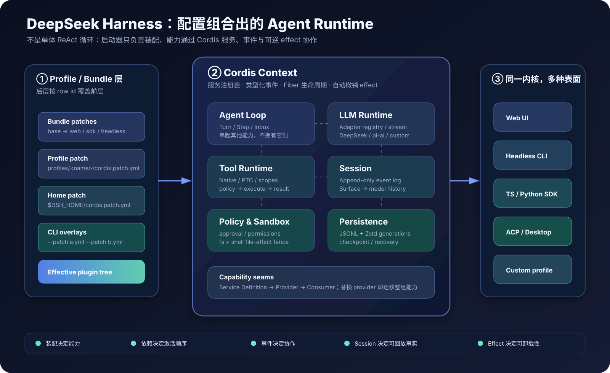
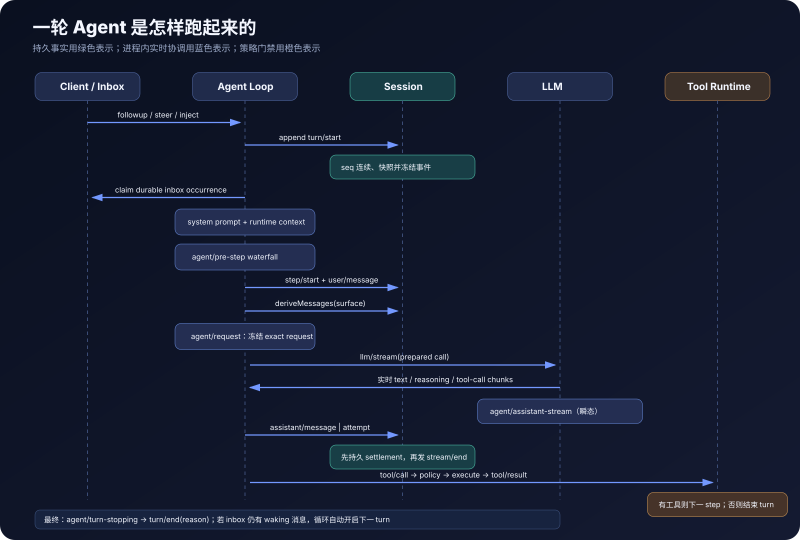
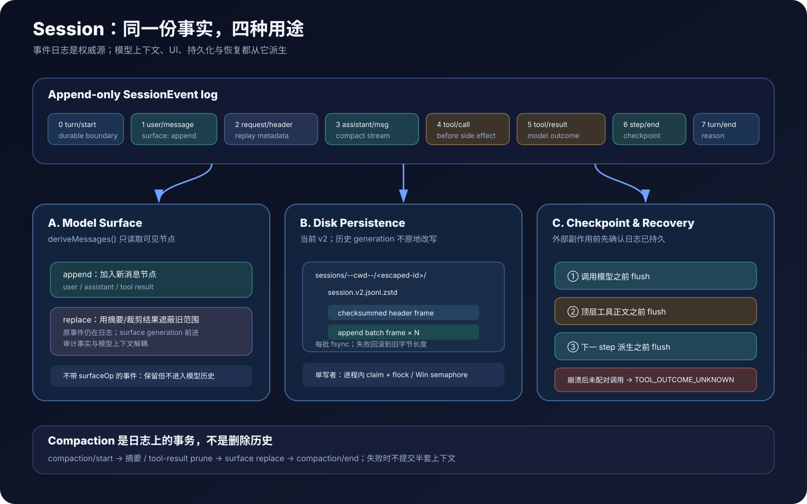
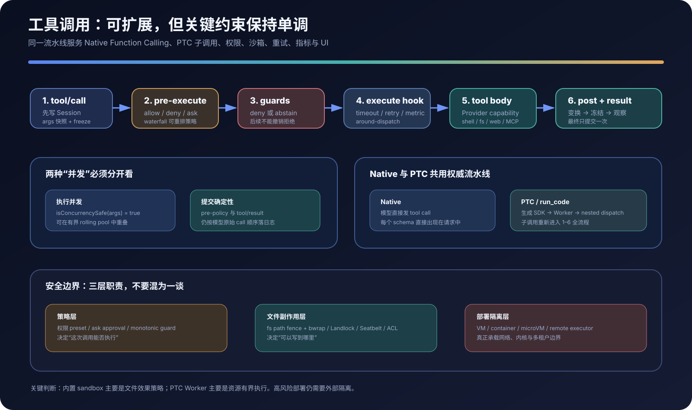
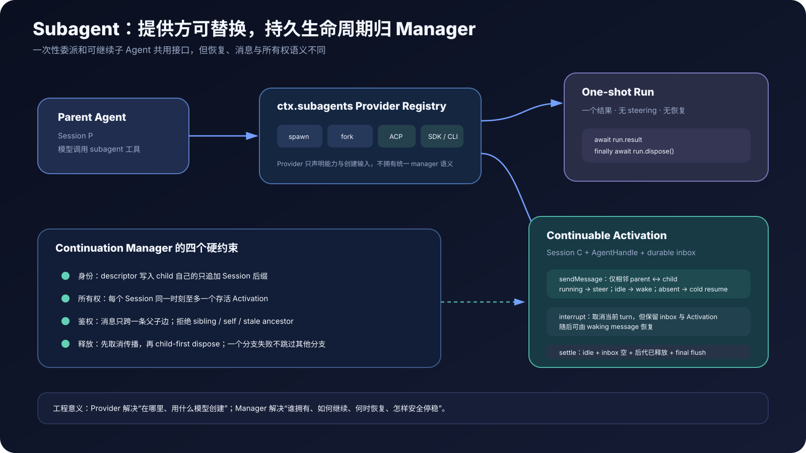

# DeepSeek Harness 源码解剖：一个“所有能力皆插件”的 Agent Runtime

> 面向熟悉 LLM、Tool Calling 与 Agent 工程的开发者<br>
> 调研日期：2026-09-07（Asia/Shanghai）<br>
> 源码基线：[`b0a7d2c`](https://github.com/deepseek-ai/deepseek-harness/tree/b0a7d2ce3b4c19d7452e364b2d7acbfa87e707ed)，仓库版本 `0.1.3-alpha.2`<br>
> 结论基于固定提交的源码、官方文档、Cordis 论文和安全政策；文中架构图均为本次调研原创。



如果只用一句话概括：**DeepSeek Harness 不是给 ReAct 循环多塞几个工具，而是把 Agent 做成一棵可重组、可卸载、可持久恢复的插件树。**

它把通常散落在应用代码里的模型适配、工具注册、会话历史、执行循环、沙箱、审批、压缩、子 Agent、API 和 UI 全部变成 Cordis 插件。Agent Loop 只是这些插件中的一个消费者与调度者，而不是不可替换的“上帝对象”。官方也把项目定位为 Developer Preview，并明确提示未来会有破坏性变更，因此本文会同时讨论它的设计价值、实现细节和当前边界。[官方 README](https://github.com/deepseek-ai/deepseek-harness/blob/b0a7d2ce3b4c19d7452e364b2d7acbfa87e707ed/README.zh.md) · [安全说明](https://github.com/deepseek-ai/deepseek-harness/blob/b0a7d2ce3b4c19d7452e364b2d7acbfa87e707ed/SAFETY.zh.md)

## 先给结论

| 维度 | 源码层面的判断 |
|---|---|
| 架构本质 | Cordis 插件运行时 + 能力服务注册表，而非固定 Agent 框架 |
| 控制流 | durable inbox 驱动 Turn；每个 Turn 含一个或多个 Step；Step 在模型调用和工具批次之间循环 |
| 状态模型 | append-only `SessionEvent` 是事实源，LLM 历史是其上的可替换 surface 投影 |
| 工具系统 | Native Function Calling、PTC `run_code` 或两者并存；统一经过策略、守卫、执行和结果流水线 |
| 持久化 | 当前 v2 JSONL generation；默认校验和 Zstd 帧；检查点与崩溃恢复语义清晰 |
| 并发 | 声明为并发安全的工具可重叠执行，但调用与结果仍按模型顺序提交，保持 transcript 确定性 |
| 扩展方式 | Service Definition → Provider → Consumer；也可通过事件 waterfall 横切现有能力 |
| 多端复用 | Web、Headless、TS/Python SDK、ACP、Desktop 都从具名 profile 组合同一运行时 |
| 安全边界 | 内置 sandbox 主要约束文件副作用；不等价于网络隔离、容器或多租户边界 |
| 成熟度 | 架构和测试纪律很强，但仍是开发者预览，API、配置与生态都可能快速变化 |

我的总体评价是：**它最值得学习的不是某个 prompt 或某个工具，而是“可组合性、可回放性和副作用控制”被放进了同一套运行时模型。** 这正是长期运行 Agent 比普通聊天应用更难、也更容易积累技术债的地方。

## 1. 项目规模与源码地图

在固定提交上，`packages/` 下共有 258 个 workspace package；其中有 1,474 个 `src/**/*.ts` 文件和 1,030 个 `tests/**/*.ts` 文件。这些数字不是为了炫耀规模，而是提醒读者：DeepSeek Harness 更接近一个 Agent 操作系统式的 monorepo，而不是一个几百行的示例循环。

关键目录可以按职责这样理解：

```text
apps/cli/                       dsh 统一启动器、profile 解析、patch 叠加
packages/boot/                  Cordis Loader 启动与配置装配
packages/bundle/                base / web / headless / sdk / acp 组合包
packages/core/agent-loop/       Turn / Step / Inbox 的默认驱动
packages/core/session/          内存事件日志与模型消息投影
packages/core/tools/            工具注册、scope、策略流水线、PTC
packages/llm/                   LLM seam 与 DeepSeek / pi-ai adapter
packages/session/               持久化、checkpoint、query、projection
packages/compaction/            上下文压缩与工具结果裁剪
packages/sandbox/               文件副作用策略与平台沙箱后端
packages/fs/  packages/shell/   文件、Shell 能力及其模型工具
packages/subagent/              provider registry、one-shot、continuable
packages/api/  packages/client/ Web Host/Client、Remote API、UI 插件
packages/sdk/  python/sdk/      stdio JSON-RPC 与 TS/Python SDK
```

官方架构文档列出的“核心包”只有 Session、System Prompt、Tools、Agent、Agent Loop、Scope、LLM 等少数几个；大量外围 package 都在这些 seam 上组合能力。这种拆法看起来琐碎，却把依赖边界和卸载边界做成了可检查的工程事实。[架构文档：Core packages](https://github.com/deepseek-ai/deepseek-harness/blob/b0a7d2ce3b4c19d7452e364b2d7acbfa87e707ed/docs/architecture.zh.md#L55-L68)

## 2. Cordis：为什么“所有能力皆插件”不是一句口号

### 2.1 六个运行时概念

| 概念 | 在 Harness 中的作用 |
|---|---|
| `Context` | 作用域化的服务容器，也是事件与生命周期 API 的入口 |
| `Service` | 在稳定的 `ctx.<key>` 上公开能力，例如 `ctx.llm`、`ctx.tools`、`ctx.sessions` |
| `inject` | 声明插件需要哪些服务；依赖未就绪时 Fiber 保持 Pending，依赖消失时自动卸载 |
| `effect` | 注册事件、工具、定时器等副作用，并把反向清理动作绑定到插件 Fiber |
| Event | 普通广播、串行事件或 waterfall；后者让策略与请求可以逐层变换 |
| Fiber | 插件实例的生命周期与资源所有权边界 |

核心不是“模块可以加载”，而是**模块产生的运行时影响可以撤销，模块依赖的能力可以响应式出现和消失**。Cordis 论文把前者称为 temporal composability，把后者称为 spatial composability：可逆 effect 让组件卸载时恢复上下文，reactive coeffect 让依赖变化驱动组件激活与失活。[Cordis 论文摘要](https://arxiv.org/abs/2608.25512) · [Cordis Primer](https://deepseek-harness.github.io/deepseek-harness/en/reference/cordis-primer)

Fiber 的简化状态机是：

```text
PENDING → LOADING → ACTIVE
                  ↘ FAILED
ACTIVE  → UNLOADING → DISPOSED
```

因此，当 LLM provider、工具或 API 服务被热替换时，消费它的插件不需要自己监听“provider changed”并手工清理一堆资源；依赖图和 effect 栈会负责停旧、撤销、再激活。官方生命周期文档给出了相同的状态与依赖驱动规则。[插件生命周期](https://deepseek-harness.github.io/deepseek-harness/en/develop/framework/)

### 2.2 Capability seam：接口、实现、模型入口分离

Harness 反复使用三角色模式：

```text
Service Definition  →  Service Provider  →  Consumer
定义 ctx 能力接口       本地/远端具体实现       Tool / UI / Loop
```

以 Shell 为例：抽象 shell service 是 Definition，本地 Bash、沙箱 Bash 或未来远端容器是 Provider，`bash` 工具是 Consumer。替换 Provider 后，工具 schema、Agent Loop 和 UI 不必分叉。文件系统、子 Agent、代码运行时、持久化都采用同一种结构。[三角色能力设计](https://deepseek-harness.github.io/deepseek-harness/en/develop/practice/)

这也是我认为它比“在工具函数里 if/else 选择本地或远端执行”更稳健的地方：**执行世界是配置选择，不是散落在业务代码里的条件分支。**

## 3. 启动不是 new Agent()，而是装配一棵插件树

### 3.1 Profile 与 Bundle

一个运行中的 `dsh` 来自有序配置层：

```text
empty root
  → bundle patches（通常先 dsh-base，再 surface bundle）
  → profile/cordis.patch.yml
  → $DSH_HOME/cordis.patch.yml
  → --patch overlays（按命令行顺序）
  → telemetry hard-disable patch（如启用）
```

`dsh-base` 提供模型、工具、JSONL 持久化、沙箱、审批、设置、凭证、压缩和子 Agent；`web-app`、`headless`、`sdk-app`、`acp-app` 再增加各自表面。`sdk-minimal` 是明确的例外，它用一份独立配置拥有完整最小树。[Profile 与 Bundle](https://github.com/deepseek-ai/deepseek-harness/blob/b0a7d2ce3b4c19d7452e364b2d7acbfa87e707ed/docs/architecture.zh.md#L15-L39)

一个很重要的配置陷阱是：**patch 命中 row 后会替换该 row 的整个 `config`，不是深度 merge。** 所以覆盖某个字段时要重述同一 row 需要保留的其他字段。基础 bundle 在文件头直接写明了这个约定，而且 row 的书写顺序不代表加载顺序；真正的激活顺序由 `inject` 服务依赖决定。[base bundle 说明](https://github.com/deepseek-ai/deepseek-harness/blob/b0a7d2ce3b4c19d7452e364b2d7acbfa87e707ed/packages/bundle/base/cordis.patch.yml#L1-L13)

### 3.2 从 `dsh web` 到 ACTIVE 插件树

实际启动链如下：

1. `apps/cli/src/bin.ts` 解析 profile、额外 patch 与内部应用参数。
2. 启动器加载并冻结“进程环境 → 项目 `.env` → Harness home `.env`”的来源快照；能改变进程启动、模块解析或信任链的敏感环境名不会从项目 `.env` 接受。
3. `profile-boot.ts` 解析具名 profile，按层组合 patch，并安装代理、信号与 fail-loud 关闭逻辑。
4. `boot()` 创建根 `Context`，挂载 Loader，再用一个固定 id 的 root Include 加载有效配置。
5. Loader 等待所有 entry 稳定；无法解析、激活失败或一直缺依赖的 entry 会在最终审计时报错，而不是返回一个残缺应用。
6. Web profile 可监听用户 patch 并事务式重新应用；Headless、SDK、ACP 等拥有一次性或 stdio 生命周期的 profile 则只在启动时应用。

对应源码可从 [`bin.ts`](https://github.com/deepseek-ai/deepseek-harness/blob/b0a7d2ce3b4c19d7452e364b2d7acbfa87e707ed/apps/cli/src/bin.ts#L28-L59)、[`profile-boot.ts`](https://github.com/deepseek-ai/deepseek-harness/blob/b0a7d2ce3b4c19d7452e364b2d7acbfa87e707ed/apps/cli/src/profile-boot.ts#L136-L173) 和 [`app-boot`](https://github.com/deepseek-ai/deepseek-harness/blob/b0a7d2ce3b4c19d7452e364b2d7acbfa87e707ed/packages/boot/app-boot/src/index.ts#L787-L831) 串起来阅读。

这种统一启动非常有价值：Web、CLI 和 SDK 不是三套行为接近但逐渐漂移的 Agent，而是同一套插件树换了 surface bundle。

## 4. Agent Loop：Turn、Step 与 Attempt 的真实边界



### 4.1 三层术语

- **Turn**：一次从 inbox 取到 waking 消息开始，到 `turn/end` 为止的高层工作单元。
- **Step**：一次模型请求及其随后工具批次；模型返回工具调用时，同一个 Turn 进入下一 Step。
- **Attempt**：一次模型流尝试。请求失败并重试时，失败流可作为 `assistant/attempt` 保留，但不一定成为模型历史里的正常 Assistant 消息。

默认 `ReactLoopAgent` 维护 `idle / maintenance / running` 三类阶段，并为每个 Agent 创建 scope、Session 与 durable inbox。不同入口的语义刻意分开：`followup()` 安排下一 Turn 并唤醒 Agent；`steer()` 把消息安排到最近的 Step 边界并唤醒；`inject()` 也进入下一 Step，但本身不唤醒一个空闲 Agent。这样，UI 的后续消息、忙碌中的纠偏和插件注入的运行时上下文不必争抢同一个模糊队列。[Agent Loop 源码](https://github.com/deepseek-ai/deepseek-harness/blob/b0a7d2ce3b4c19d7452e364b2d7acbfa87e707ed/packages/core/agent-loop/src/agent.ts#L236-L340)

### 4.2 主循环的等价伪代码

下面是对实现的压缩表达，不是逐行复制：

```ts
while (inbox.hasWakingWork()) {
  session.append('turn/start')
  const first = inbox.claimNextTurn()

  do {
    const prompt = await assemblePromptAndRuntimeContext(first)
    session.append('step/start')
    session.appendAcceptedMessages()

    const history = session.deriveMessages()
    const request = await buildAndFreezeRequest(history)
    const stream = await llm.stream(request)
    const assistant = await settleStream(stream)
    session.append(assistant.ok ? 'assistant/message' : 'assistant/attempt')

    if (assistant.toolCalls.length === 0) break
    await executeCallsAndCommitResultsInModelOrder(assistant.toolCalls)
    session.append('step/end')
  } while (shouldContinue())

  await emitSerial('agent/turn-stopping')
  session.append('turn/end', { reason })
}
```

源码中的关键不变量包括：

- `turn/start` 在领取 inbox occurrence 之前写入，Turn 的边界因此先成为持久事实。
- `agent/pre-step` 与 `agent/request` 是 waterfall，插件可以注入上下文、压缩历史、调整请求或拒绝继续。
- 最终发给 adapter 的消息与 header 会深冻结，防止异步中间件在请求途中修改证据。
- 正常 Assistant 流结算为 `assistant/message`；失败、取消或不可成为表面消息的流结算为 `assistant/attempt`。
- 无工具调用意味着 Step 完成；有工具调用则先完成整批结果，再进入下一个 Step。
- `agent/turn-stopping` 是串行事件，给目标、hook 或其他插件最后一次受控追加后续工作的机会。

完整时序由官方架构文档列出，源码实现集中在 `turn()`、`step()` 与 `buildRequest()`。[Turn/Step 顺序](https://github.com/deepseek-ai/deepseek-harness/blob/b0a7d2ce3b4c19d7452e364b2d7acbfa87e707ed/docs/architecture.zh.md#L84-L105) · [`step()` 实现](https://github.com/deepseek-ai/deepseek-harness/blob/b0a7d2ce3b4c19d7452e364b2d7acbfa87e707ed/packages/core/agent-loop/src/agent.ts#L343-L480)

### 4.3 实时流与持久事实分开

`agent/assistant-stream` 服务 UI 的低延迟展示，是进程内 live frame；Session 中的 `assistant/message` 或 `assistant/attempt` 才是可回放 settlement。实现会先把完整紧凑 stream 提交到 Session，再发出 stream end，避免 UI 看到“已完成”而日志还没落定。进程崩溃时，尚未 settlement 的 token 可以丢失，这是有意的边界，而不是把每个 token 都 fsync 的昂贵承诺。[Assistant stream 实现](https://github.com/deepseek-ai/deepseek-harness/blob/b0a7d2ce3b4c19d7452e364b2d7acbfa87e707ed/packages/core/agent-loop/src/assistant-stream.ts)

## 5. Session：事件日志才是 Agent 的长期记忆骨架



### 5.1 Append-only log 与 Model Surface

`Session` 构造时验证 seed 的事件格式、连续 `seq` 和 surface 变换；每次 `append()` 都用当前日志长度分配 `seq`，给数据做无损 JSON 快照并深冻结，然后才提交。观察者不能回头修改历史。[Session `append()`](https://github.com/deepseek-ai/deepseek-harness/blob/b0a7d2ce3b4c19d7452e364b2d7acbfa87e707ed/packages/core/session/src/index.ts#L637-L715)

但“日志中存在”不等于“模型可见”。模型历史来自 `deriveMessages()` 遍历的有序 surface 节点：

- `surfaceOp: append` 把新的 user、assistant 或 tool 结果加入表面；
- `surfaceOp: replace` 用摘要或裁剪后的节点遮蔽一段旧表面；
- 没有 surface 标记的 request header、边界、诊断、descriptor 等仍保留在日志里，但不会变成 LLM message。

这条分离非常关键：**审计历史可以只追加，模型上下文却可以压缩和迁移。** 换句话说，Event Log 回答“发生了什么”，Surface 回答“下一次模型应该看到什么”。[`deriveMessages()`](https://github.com/deepseek-ai/deepseek-harness/blob/b0a7d2ce3b4c19d7452e364b2d7acbfa87e707ed/packages/core/session/src/index.ts#L782-L824)

### 5.2 JSONL generation 与崩溃恢复

默认 `dsh-base` 把会话存到 `$DSH_HOME/sessions`，使用 `dsh-session-persistence-jsonl`。当前逻辑格式是 v2；旧 v0/v1 文件保持不可变，写打开历史格式时会生成新的后继 generation，不原地篡改来源。默认物理编码是若干可拼接、带校验和的 Zstandard 帧：一个 header 帧，之后每个 append batch 一个帧。[base 持久化配置](https://github.com/deepseek-ai/deepseek-harness/blob/b0a7d2ce3b4c19d7452e364b2d7acbfa87e707ed/packages/bundle/base/cordis.patch.yml#L110-L133) · [JSONL 后端](https://github.com/deepseek-ai/deepseek-harness/blob/b0a7d2ce3b4c19d7452e364b2d7acbfa87e707ed/packages/session/session-persistence-jsonl/README.zh.md#L54-L78)

关键语义不是“用了 JSONL”，而是：

1. 首次 materialize 通过非覆盖发布写入 header 和首批事件。
2. 每批 append 完成前 `fsync`；写入或同步失败时回滚到原字节长度。
3. 崩溃后的不完整纯文本尾行会丢弃；撕裂 Zstd 尾帧只保留能完整解码的记录，下一次写入前修复尾部。
4. 完整已提交帧的校验和、解压或结构错误被视为 corruption，拒绝静默猜测。
5. 每个 Session 只有一个活动写入者：进程内 claim 加 POSIX `flock` 或 Windows 命名 semaphore。网络文件系统上的 advisory lock 仍有明确限制。

这套实现支持“至少恢复到某个完整前缀”，而不是假装可以从任意半条工具副作用中精确回滚现实世界。

### 5.3 Checkpoint：在不可逆行为前先确认事实落盘

`dsh-session-checkpoint-policy` 在三个位置 flush：

- 调用模型 adapter 前；
- 顶层工具正文可能产生外部副作用前；
- 下一 Step 派生新请求前。

检查点失败会 fail closed：模型或顶层工具正文不会继续。若崩溃发生在已持久 `tool/call` 和 `tool/result` 之间，恢复不会盲目重试，而是补一个 `TOOL_OUTCOME_UNKNOWN`，要求对可能有副作用的动作先验证外部状态。这是 Agent 系统里很成熟的一点：**“不知道做没做完”必须成为一等状态，不能被错误折叠成“没做”。** [Checkpoint policy](https://github.com/deepseek-ai/deepseek-harness/blob/b0a7d2ce3b4c19d7452e364b2d7acbfa87e707ed/packages/session/session-checkpoint-policy/README.zh.md#L46-L52)

## 6. 工具系统：从 schema 注册到确定性提交



### 6.1 `ToolDefinition` 不只是一个函数

一个工具定义同时拥有：

- 模型可见的名称、描述和参数 schema；
- 规范输出 schema；
- 把规范值渲染成模型内容的 `render`；
- 执行函数与可选 finalize；
- 可选超时、并发安全分类；
- 可选的 UI call/result 呈现意图。

规范值、模型文本和 UI 卡片被刻意分开。这样 PTC 程序可以拿到结构化值，模型可以看到紧凑解释，UI 又能回放 diff、terminal 或 search 卡片，而不要求工具实现导入 React。[工具定义参考](https://github.com/deepseek-ai/deepseek-harness/blob/b0a7d2ce3b4c19d7452e364b2d7acbfa87e707ed/packages/core/tools/src/index.ts#L214-L270)

工具还支持 scope。全局注册和 Agent scoped 注册叠加时，局部工具可遮蔽全局同名工具；`restrict()` 形成的限制只能继续收紧，不能被后来的局部层放宽。这个性质被用来实现 Tool Search、子 Agent 工具过滤、Plan Mode 和权限约束。

### 6.2 一次调用的权威流水线

```text
tool/call 持久化
  → 参数快照、身份 token、冻结
  → tools/pre-execute waterfall（允许 / 拒绝 / 询问）
  → approval（如果需要）
  → monotonic guards
  → tools/execute waterfall（超时 / 重试 / 指标）
  → ToolDefinition.execute()
  → tools/post-execute（接受 / 屏蔽 / 替换 / 附加上下文）
  → 结果规范化、finalize、无损快照和冻结
  → tools/result 只读通知
  → tool/result 持久化
```

可重排的策略放在 waterfall，必须“只能更严不能变松”的策略放在 guard；这避免一个后注册的插件意外撤销前面的安全拒绝。官方生成的流水线图与源码的 `execute()` 路径给出了确切顺序。[工具执行流水线](https://github.com/deepseek-ai/deepseek-harness/blob/b0a7d2ce3b4c19d7452e364b2d7acbfa87e707ed/docs/tool-execution-pipeline.zh.md) · [`ToolRuntime.execute()`](https://github.com/deepseek-ai/deepseek-harness/blob/b0a7d2ce3b4c19d7452e364b2d7acbfa87e707ed/packages/core/tools/src/index.ts#L1332-L1660)

### 6.3 并行执行，但按原顺序落日志

`isConcurrencySafe(args)` 决定单次调用能否进入并发池。未声明、分类抛错或返回非布尔值都按 exclusive 处理，属于 fail-closed。调度器允许连续的 safe 调用在有界 rolling pool 中重叠；exclusive 调用成为前后 barrier。无论完成快慢，pre-policy、`tool/call`/`tool/result` 与提交顺序仍跟随模型原始 call 顺序。[工具批调度器](https://github.com/deepseek-ai/deepseek-harness/blob/b0a7d2ce3b4c19d7452e364b2d7acbfa87e707ed/packages/core/agent-loop/src/tool-calls.ts)

这是一个很实用的折中：获得网络查询、只读操作的吞吐，同时不让 transcript 受竞态完成顺序影响。取消时不再启动新调用，但会排空已经开始的任务，并为未启动调用生成可解释的合成结果，保证消息结构闭合。

### 6.4 Native、PTC 与 `run_code`

工具 registry 的 `mode` 有三种：

- `native`：每个可见工具直接作为 Function Calling schema；
- `ptc`：模型只直接看到 `run_code`，同时收到从当前工具 schema 生成的 TypeScript/Python SDK；
- `both`：两者同时提供。

PTC 程序里的 `await tools.foo(args)` 会带着父调用 token 重新进入同一套工具流水线，而不是绕过权限或沙箱直接调用实现。默认子调用并发上限是 10。发布的 TypeScript 后端为每次 `run_code` 创建一个全新的 Node Worker Thread，运行之间不保留状态；这保证了可重建性和资源边界，但官方明确说明它是“包含程序”而非多租户安全边界。[PTC mode](https://github.com/deepseek-ai/deepseek-harness/blob/b0a7d2ce3b4c19d7452e364b2d7acbfa87e707ed/packages/core/tools/README.zh.md#L123-L125) · [Worker 后端的信任边界](https://github.com/deepseek-ai/deepseek-harness/blob/b0a7d2ce3b4c19d7452e364b2d7acbfa87e707ed/packages/code-runtime/code-runtime-worker-thread/README.zh.md#L75-L79)

PTC 的真实优势不一定是少 token——官方也没有做这种普遍承诺——而是模型能用一个短程序组合循环、分支和多个结构化工具调用，中间值留在 Worker 内，不必每一步都往返 LLM。

## 7. LLM Runtime 与 DeepSeek Adapter

`ctx.llm` 是 provider → adapter 的动态注册表。Adapter 注册是 effect，可撤销或原子替换。Agent Loop 在请求前调用 `prepareCall()`，拿到绑定到同一注册 generation 的一次性 handle；即使此时配置 HMR，也不会出现“模型能力信息来自旧 adapter，实际 stream 却发给新 adapter”的撕裂。[LLM Runtime](https://github.com/deepseek-ai/deepseek-harness/blob/b0a7d2ce3b4c19d7452e364b2d7acbfa87e707ed/packages/llm/llm/src/index.ts)

固定提交里的 DeepSeek adapter 注册 `deepseek-official` 路由，默认 catalog 含 `deepseek-v4-flash`、`deepseek-v4-pro` 和实验视觉模型；基础 profile 默认选择 Flash。源码中的默认 context capacity 为 1,000,000、默认单次输出上限为 256,000——这里应理解为**该提交的 adapter 配置默认值**，不是本文对外部 API 产品规格做的长期保证。[DeepSeek catalog](https://github.com/deepseek-ai/deepseek-harness/blob/b0a7d2ce3b4c19d7452e364b2d7acbfa87e707ed/packages/llm/llm-deepseek/src/index.ts#L88-L112) · [adapter 默认值](https://github.com/deepseek-ai/deepseek-harness/blob/b0a7d2ce3b4c19d7452e364b2d7acbfa87e707ed/packages/llm/llm-deepseek/src/adapter.ts#L138-L145)

一次请求的实现细节值得注意：

1. 在 stream 开始时一次性快照 endpoint、模型配置与 credential，使同一请求不跨配置 generation。
2. 通过 `POST <baseURL>/chat/completions` 发起流式请求，解析 SSE，并用 idle watchdog 防止连接永久挂住。
3. 图片先通过 durable attachment service 解析；可使用 Files API 上传并复用 file id，必要时回退 base64；陈旧 file id 会失效并最多重试一次。
4. HTTP、配额、认证、上下文窗口和传输错误被归一化为 Harness 的 `LlmError` 分类。
5. Settings 可热更新 provider 配置；API key 按请求从凭证服务解析，而不是强制固化在插件加载时。

这套 seam 也能挂载 `llm-pi-ai` 或自定义 adapter。基础 bundle 中 pi-ai 默认没有 route，只有用户设置 provider profile 后才动态注册，避免“安装了代码”就等于“启用了外部提供方”。[base LLM 组合](https://github.com/deepseek-ai/deepseek-harness/blob/b0a7d2ce3b4c19d7452e364b2d7acbfa87e707ed/packages/bundle/base/cordis.patch.yml#L73-L108)

## 8. Compaction：压缩模型表面，不改写审计历史

基础 compactor 在 `agent/pre-step` 检查上下文压力，并在 adapter 报上下文溢出时进入恢复路径。当前默认阈值大致是在上下文达到 80% 时触发，保留约 16%，摘要上限 8,192 token；真实值仍由插件配置决定。[Compaction package](https://github.com/deepseek-ai/deepseek-harness/blob/b0a7d2ce3b4c19d7452e364b2d7acbfa87e707ed/packages/compaction/compaction-basic/README.zh.md)

一次压缩是日志事务：

```text
compaction/start
  → 选择可压缩的完整消息边界
  → 可选先裁剪超大 tool result
  → 用原始前缀请求摘要模型
  → 追加摘要消息，并以 surface replace 遮蔽旧区间
compaction/end
```

基础 bundle 还配置了工具结果 pruner：超过 8,192 字符时保留前 4,096 和后 1,024 个 Unicode code point，裁剪事实和替代结果都会进入日志。[base 裁剪配置](https://github.com/deepseek-ai/deepseek-harness/blob/b0a7d2ce3b4c19d7452e364b2d7acbfa87e707ed/packages/bundle/base/cordis.patch.yml#L388-L399)

这里有三个现实限制：字符数启发式可能低估 CJK 与 schema 成本；系统提示和工具 envelope 不能被普通对话摘要压缩；超大的不可分割消息单元仍可能无法放入窗口。因此，生产部署不能只把 compaction 当“无限上下文”，还应从工具输出上限、spill、检索和任务拆分共同治理。

## 9. Sandbox 与权限：它做了什么，也没做什么

DeepSeek Harness 的安全设计不是一个开关，而是三层：

1. **策略层**：`tools/pre-execute`、approval 与 monotonic guard 决定调用是否获准。
2. **文件效果层**：`ctx.sandboxPolicy` 为每次调用解析 `read-only`、`workspace-write` 或 `danger-full-access`；fs provider 与 shell provider 消费同一策略。
3. **部署隔离层**：容器、VM、microVM 或远端执行器负责更强的网络、内核和租户边界。

平台后端如下：

| 平台 | 默认后端 | 主要机制 | 已知边界 |
|---|---|---|---|
| Linux | bubblewrap，失败后尝试 Landlock | 只读宿主根、私有 `/dev`、PID namespace、工作区与临时目录写挂载；或 Landlock 文件访问规则 | 较旧 Landlock ABI 可能只报告 partial |
| macOS | Seatbelt `sandbox-exec` | 默认允许读取，拒绝文件写，再对白名单根开放写入 | 依赖已弃用但仍存在的系统机制 |
| Windows | ACL + restricted token | 工作区/私有临时目录的 SID 与 ACE，受限 token 执行 | Everyone 权限、硬链接等边界使其报告 partial |

请求受限模式却没有可用 runner 时，系统返回 `SANDBOX_UNAVAILABLE`，不会偷偷无沙箱执行；获批升级只对该次相同调用使用更宽模式。[sandbox seam](https://github.com/deepseek-ai/deepseek-harness/blob/b0a7d2ce3b4c19d7452e364b2d7acbfa87e707ed/packages/sandbox/sandbox/README.zh.md) · [平台后端](https://github.com/deepseek-ai/deepseek-harness/blob/b0a7d2ce3b4c19d7452e364b2d7acbfa87e707ed/packages/sandbox/sandbox-local/README.zh.md)

但是必须把边界说清楚：

- 内置 sandbox 的策略词汇主要是**文件操作**，不表达网络隔离。
- Bash 的进程可见性随后端变化，没有统一的完整保证。
- `fs-sandbox` 是可信进程内代码对模型路径的围栏，不是内核边界；重新 canonicalize 只能缩小而不能消灭 TOCTOU。
- PTC Worker 有空环境、内存和时间预算，但不是不可信租户代码的安全容器。
- `danger-full-access` 是明确绕过沙箱，不是“更宽但仍安全”的 profile。

因此官方安全政策建议在专用 VM 或容器中运行、限制权限、审查生成代码、避免敏感数据，并只加载可信插件/MCP/Skill/Hook。[官方安全使用政策](https://www.deepseek.com/harness/privacy/)

## 10. Subagent：Provider 与 Continuation Manager 分工



`ctx.subagents` 是具名 provider registry。随附 provider 包括进程内 spawn、继承历史的 fork，以及 ACP、Codex、Claude Code、DSH SDK 等进程外实现。调用方看统一能力，provider 通过 capability flags 明确自己是否支持模型选项、结构化输出、深度限制、工具过滤、persona 或 continuable 创建。[Subagent 子系统](https://github.com/deepseek-ai/deepseek-harness/blob/b0a7d2ce3b4c19d7452e364b2d7acbfa87e707ed/docs/subsystems/subagent.zh.md)

两种运行模式差别很大：

| 模式 | 生命周期 | 能否继续对话 | 恢复 |
|---|---|---|---|
| one-shot | 调用方持有 `SubagentRun`，等待一个 result，最后 dispose | 否 | 无 |
| continuable | Manager 持有 Session、AgentHandle、Inbox 与后代集合 | 是 | 目标不在线时可从持久会话 cold resume |

Continuable child 的 descriptor 写入它自己的 Session 后缀，包含 provider、模型路由、persona/tool filter 等恢复所需身份。消息只允许跨相邻 parent-child 边：目标 running 时进入最近 Step 边界，idle 时唤醒新 Turn，absent 时冷恢复；self、sibling、错误 parent 或陈旧 ancestor 会拒绝。`interrupt` 取消当前 Turn 但保留 Inbox 和 Activation，之后可由 waking 消息恢复。

一个 Activation 只有在 Agent idle、Inbox 空、所有已拥有后代释放、最终 flush 完成且 AgentHandle dispose 后才 settle。teardown 对选中森林自顶向下传播取消，再 child-first 释放资源；某个分支失败也不会跳过其余分支。这个实现说明团队对“后台 Agent 做完了”采用的是资源所有权定义，而不是仅看它有没有输出一段 final text。

基础组合默认把 `spawn` 配成 continuable，把 `fork` 保持 one-shot；fork 不指定单独模型时继承父模型和历史，以尽量保持 KV Cache 前缀可复用。[base subagent wiring](https://github.com/deepseek-ai/deepseek-harness/blob/b0a7d2ce3b4c19d7452e364b2d7acbfa87e707ed/packages/bundle/base/cordis.patch.yml#L328-L367)

## 11. Web、API 与 SDK：同一运行时的不同控制面

### 11.1 Web Host / Client

Web bundle 在 base 之上增加：Host WebServer、Workspace、Session/Settings Controller、Typert API Gateway、Connection、浏览器模块表以及一组细粒度 UI 插件。默认监听 `127.0.0.1:3080`，开启 gzip；Host 持有权威状态，浏览器侧的 Client model 维护无 React 的镜像，再由 UI adapter 投影到 Slot 和 Conversation 组件。[web bundle](https://github.com/deepseek-ai/deepseek-harness/blob/b0a7d2ce3b4c19d7452e364b2d7acbfa87e707ed/packages/bundle/web-app/cordis.patch.yml#L94-L191) · [Web Client architecture](https://deepseek-harness.github.io/deepseek-harness/en/reference/subsystems/web-client)

Typert Remote 把 Host service 上声明的方法生成 Host dispatcher 与 Client stub：普通调用走 `POST /api/<namespace>/<method>`，流式 Remote 复用 `/api/remote.mux` WebSocket。Connection 拥有信任检查、请求关联、取消和 transport envelope，Gateway 只拥有描述符、参数/result codec 与业务分发。[API Gateway](https://github.com/deepseek-ai/deepseek-harness/blob/b0a7d2ce3b4c19d7452e364b2d7acbfa87e707ed/docs/api-gateway.zh.md#L121-L162)

### 11.2 Headless

Headless bundle 不挂 HTTP Server 或浏览器插件，只增加一次性启动参数解析与 runner。它仍复用同一个 Agent Loop、Session、工具、持久化和沙箱。这使 CI 或脚本调用得到与 Web 近似的 Agent 行为，而不是另一份缩水实现。[headless bundle](https://github.com/deepseek-ai/deepseek-harness/blob/b0a7d2ce3b4c19d7452e364b2d7acbfa87e707ed/packages/bundle/headless/cordis.patch.yml)

### 11.3 TypeScript / Python SDK

SDK profile 挂载 stdio 上按行分帧的 JSON-RPC 2.0 Server。TS 与 Python 客户端都启动同版本的 `dsh --profile sdk` 子进程，打开/恢复 Session、发送 prompt，并收集事件、Agent 状态和 Subagent 通知。Python wheel 捆绑平台对应的单文件运行时，因此正常使用不要求系统安装 Node；它要求显式 `dsh_home`，避免无意复用用户全局 Harness home。[SDK 协议](https://github.com/deepseek-ai/deepseek-harness/blob/b0a7d2ce3b4c19d7452e364b2d7acbfa87e707ed/packages/sdk/protocol/README.zh.md#L28-L36) · [Python SDK](https://github.com/deepseek-ai/deepseek-harness/blob/b0a7d2ce3b4c19d7452e364b2d7acbfa87e707ed/python/sdk/README.zh.md)

这几种 surface 的选择建议很简单：

- 开发、观察事件与调整插件：Web；
- 一次任务、Shell 组合：Headless；
- 长期自动化、显式 Session 控制：SDK；
- 对接支持 Agent Client Protocol 的宿主：ACP；
- 定制交付：新 profile + bundle/patch，而不是复制 Agent 主循环。

## 12. 动手实现一个最小工具插件

下面的插件不访问文件或网络，只用来展示注册、类型推导、参数校验、规范值和 effect 清理。它根据变更规模与是否触及持久化/权限边界给出一个粗粒度风险提示。

创建 `scratch-plugin/risk-tool.ts`：

```ts
import type { Context } from '@deepseek-ai/cordis'
import { defineTool } from '@deepseek-ai/dsh-tools'

export const name = 'change-risk-tool'
export const inject = ['tools']

export function apply(ctx: Context) {
  ctx.tools.register(defineTool({
    name: 'estimate_change_risk',
    description: 'Estimate engineering risk before implementing a code change.',
    parameters: {
      changedFiles: {
        type: 'number',
        required: true,
        description: 'Estimated number of files that will change.',
      },
      touchesPersistence: { type: 'boolean', required: true },
      touchesPermissions: { type: 'boolean', required: true },
    },
    output: {
      schema: { type: 'string' },
      render: (_args, value) => [{ type: 'text', text: value }],
    },
    async execute(args) {
      if (!Number.isSafeInteger(args.changedFiles) || args.changedFiles < 0) {
        throw new Error('changedFiles must be a non-negative safe integer')
      }
      const score = Math.min(
        10,
        Math.ceil(args.changedFiles / 3)
          + (args.touchesPersistence ? 3 : 0)
          + (args.touchesPermissions ? 4 : 0),
      )
      const level = score >= 7 ? 'high' : score >= 4 ? 'medium' : 'low'
      return `Risk: ${level} (${score}/10). Add tests around state, failure, and rollback boundaries.`
    },
  }))
}
```

再创建一个 patch，例如 `scratch-plugin/cordis.patch.yml`：

```yaml
- insert:
    - id: change-risk-tool
      name: '/ABSOLUTE/PATH/TO/scratch-plugin/risk-tool.ts'
```

从上游源码 checkout 启动：

```bash
pnpm dsh web --patch ./scratch-plugin/cordis.patch.yml
```

然后在 UI 中要求模型先调用 `estimate_change_risk` 再制定修改方案。`inject = ['tools']` 保证 registry 就绪后才激活；`defineTool` 在执行前校验 schema；`ctx.tools.register()` 的注册属于当前 Fiber 的 effect，插件卸载或 HMR 时工具会自动注销。官方最小教程使用同一条路径。[第一个 Harness 插件](https://github.com/deepseek-ai/deepseek-harness/blob/b0a7d2ce3b4c19d7452e364b2d7acbfa87e707ed/docs/user/develop/basic/index.zh.md) · [工具教程](https://github.com/deepseek-ai/deepseek-harness/blob/b0a7d2ce3b4c19d7452e364b2d7acbfa87e707ed/docs/user/develop/basic/tool.zh.md)

生产工具还应继续补齐：输出 schema、并发分类、超时、取消、错误码、模型渲染、UI presentation、沙箱/权限行为、持久化事件、HMR 清理测试和真实 profile 组装测试。只写一个能返回字符串的 `execute()` 远远不够。

## 13. 测试策略透露出的工程取向

项目测试不是单一 `vitest run`：

- 单元测试覆盖边界、错误、事件顺序与并发竞态；每个 registry 都应验证 Fiber dispose 后注册被清理。
- 覆盖率门禁要求 `packages/*/*/src` 按文件 100% 行覆盖；项目文档也明确提醒，覆盖率只是必要条件。
- 真实 API e2e 验证 DeepSeek 与其他外部 provider；无 key 时自动跳过。
- Expected/Snapshot 测试回放完整 profile、Session 和 workspace 变化，而不只断言 Agent 自己声称“已经完成”。
- Chromium Web 快照同时验证 UI 输出与 ARIA 证据。
- 必需性能基准覆盖 Session 打开、Agent continuation、长会话浏览器和 reconnect 等用户路径。
- Host 与 Client 分成不同 TypeScript aggregate，避免两侧 Cordis `Context` 声明合并污染同一个 `ts.Program`。

官方测试策略尤其强调“验证外部世界，而不是 Agent 自我报告”：修改文件的 e2e 要重新读文件或重跑命令，不能只在 final answer 里搜一个成功关键词。这条原则值得所有 Coding Agent 项目照搬。[测试策略](https://github.com/deepseek-ai/deepseek-harness/blob/b0a7d2ce3b4c19d7452e364b2d7acbfa87e707ed/docs/testing.zh.md) · [构建与门禁脚本](https://github.com/deepseek-ai/deepseek-harness/blob/b0a7d2ce3b4c19d7452e364b2d7acbfa87e707ed/package.json)

## 14. 从 Agent 工程视角看它的优点与代价

### 值得借鉴的设计

1. **循环最小化，能力协议化。** Compaction、Hook、Goal、Plan、Tool Search、Subagent、Telemetry 都通过事件或 service 接入，不修改 Loop 本体。
2. **持久事实与实时体验分离。** Token 流可以低延迟，最终 settlement 才进入可回放日志；不会为了 UI 流畅牺牲状态语义。
3. **Model Surface 是显式投影。** 压缩、裁剪与迁移不需要篡改旧事件，审计和下一请求各取所需。
4. **副作用前有 durability barrier。** 模型请求与顶层工具执行前先 flush，崩溃后的“不确定结果”也有明确表示。
5. **安全策略可组合但关键拒绝单调。** waterfall 允许扩展，guard 防止后续插件放宽安全决定。
6. **并发吞吐不破坏 transcript 确定性。** 安全调用可并发，持久结果仍按模型序提交。
7. **多 surface 共用真实入口。** SDK、Web、Headless 的差异主要是 bundle，而不是各自重新实现 Agent。
8. **源码与文档同步意识强。** 生成 catalog、type-equivalent 文档、双语配对、入口验证和 profile snapshot 都有专门门禁。

### 必须接受的代价

1. **概念密度高。** Context、Fiber、effect、waterfall、surface、generation、seam、projection、Activation 都需要团队共同理解。
2. **package 数量大。** 边界清晰换来了导航、构建图和版本协调成本；小团队未必需要完整复制这种粒度。
3. **配置覆盖易踩坑。** row config 是整块替换，漏重述字段会得到合法但意外的配置。
4. **HMR 增加一致性要求。** 注册 generation、请求快照、依赖失活与恢复都必须处理，否则动态性会制造竞态。
5. **本地沙箱不是通用安全边界。** 面向不可信用户、多租户或高价值凭证时，必须再加容器/microVM/远端执行。
6. **持久化有单写者假设。** 这对本地优先很合理，但分布式调度不能直接把共享目录当数据库使用。
7. **压缩仍是启发式。** CJK、超大原子消息、系统/tool envelope 和摘要质量都需要部署侧监控。
8. **Developer Preview 风险真实存在。** 当前 profile、事件格式、SDK 与插件 API 都不应被当作长期稳定 ABI。

## 15. 是否适合你的项目

### 很适合

- 需要把 Coding Agent 做成长期演进平台，而非一次性 demo；
- 多个 UI/协议端需要共享同一套 Agent 行为；
- 需要 Session 回放、恢复、审计和可控压缩；
- 需要替换本地/远端工具、模型或子 Agent provider；
- 团队愿意接受插件运行时与事件溯源的学习成本。

### 可能过重

- 只有一个短任务、两三个工具、无需恢复的内部脚本；
- 只需托管工作流 DAG，不需要动态插件或开放式 Agent Loop；
- 团队无法承担 250+ package 级别的认知和升级成本；
- 需要立即承诺稳定 SDK/ABI 的生产产品。

### 用于生产前，我会做的八件事

1. 固定 npm 版本和源码 commit，不追随 `latest`。
2. 用自有真实任务建立 profile-level snapshot 与外部世界断言。
3. 在专用容器/VM 中运行，并限制网络、挂载、凭证和可执行文件。
4. 多租户时替换 `ctx.shell`/`ctx.fs` 为远端隔离执行世界，而不是只依赖本机 sandbox。
5. 明确 telemetry 与数据出站策略；需要完全关闭时设置非空 `DSH_TELEMETRY_DISABLED`。
6. 对 MCP、插件、Skill 和 Hook 做依赖锁定、代码审查与允许清单。
7. 监控 Session corruption、checkpoint 失败、unknown tool outcome、compaction 比例与 tool denial。
8. 为每次上游升级跑配置 dump diff、Session migration、SDK wire、浏览器快照与真实模型冒烟。

官方数据声明称输入、输出、工具记录、附件、路径、日志、模型地址和密钥默认在本地处理/存储；但一旦配置外部模型、Web 工具、MCP 或插件，相应数据可能由那些外部服务处理。基础 bundle 的 telemetry 默认是 `FEEDBACK_ONLY`，并提供环境变量硬关闭。对企业部署而言，应把这理解为“默认路径较克制”，而不是“任何组合都保证不出站”。[数据处理声明](https://www.deepseek.com/harness/en/data-processing/) · [telemetry 默认配置](https://github.com/deepseek-ai/deepseek-harness/blob/b0a7d2ce3b4c19d7452e364b2d7acbfa87e707ed/packages/bundle/base/cordis.patch.yml#L168-L197)

## 16. 最后的工程判断

DeepSeek Harness 最鲜明的设计选择，是把 Agent 从“一个会调用工具的模型循环”提升为“一个能够组合能力、记录事实、控制副作用并暴露多个控制面的运行时”。它没有消灭 Agent 工程的复杂性；相反，它把复杂性放到了可命名、可替换、可测试的位置：

```text
模型变化       → Adapter seam
执行环境变化   → fs / shell Provider
上下文增长     → Session surface + Compaction
策略变化       → waterfall + monotonic guard
应用入口变化   → Profile + Bundle
后台协作变化   → Subagent Provider + Continuation Manager
故障恢复       → Append-only log + Checkpoint + Recovery
```

这套架构是否值得完整采用，取决于你的 Agent 是一次性功能，还是未来几年都要承载新模型、新工具、新 UI 和新执行环境的平台。即使不采用整个项目，其中至少有四个设计值得直接带走：**持久事实与实时流分离、模型上下文作为显式投影、副作用前 checkpoint、并发执行与确定性提交分离。**

## 主要资料与源码入口

- [DeepSeek Harness 官方仓库](https://github.com/deepseek-ai/deepseek-harness)
- [固定调研提交](https://github.com/deepseek-ai/deepseek-harness/tree/b0a7d2ce3b4c19d7452e364b2d7acbfa87e707ed)
- [官方架构文档](https://deepseek-harness.github.io/deepseek-harness/en/reference/)
- [Cordis: A Programming Paradigm for Spatiotemporal Composability](https://arxiv.org/abs/2608.25512)
- [Agent Loop](https://github.com/deepseek-ai/deepseek-harness/blob/b0a7d2ce3b4c19d7452e364b2d7acbfa87e707ed/packages/core/agent-loop/src/agent.ts)
- [Tool Runtime](https://github.com/deepseek-ai/deepseek-harness/blob/b0a7d2ce3b4c19d7452e364b2d7acbfa87e707ed/packages/core/tools/src/index.ts)
- [Session](https://github.com/deepseek-ai/deepseek-harness/blob/b0a7d2ce3b4c19d7452e364b2d7acbfa87e707ed/packages/core/session/src/index.ts)
- [JSONL Persistence](https://github.com/deepseek-ai/deepseek-harness/blob/b0a7d2ce3b4c19d7452e364b2d7acbfa87e707ed/packages/session/session-persistence-jsonl/README.zh.md)
- [Compaction](https://github.com/deepseek-ai/deepseek-harness/blob/b0a7d2ce3b4c19d7452e364b2d7acbfa87e707ed/packages/compaction/compaction-basic/README.zh.md)
- [Sandbox](https://github.com/deepseek-ai/deepseek-harness/blob/b0a7d2ce3b4c19d7452e364b2d7acbfa87e707ed/packages/sandbox/README.zh.md)
- [Subagent](https://github.com/deepseek-ai/deepseek-harness/blob/b0a7d2ce3b4c19d7452e364b2d7acbfa87e707ed/docs/subsystems/subagent.zh.md)
- [API Gateway](https://github.com/deepseek-ai/deepseek-harness/blob/b0a7d2ce3b4c19d7452e364b2d7acbfa87e707ed/docs/api-gateway.zh.md)
- [测试策略](https://github.com/deepseek-ai/deepseek-harness/blob/b0a7d2ce3b4c19d7452e364b2d7acbfa87e707ed/docs/testing.zh.md)
- [安全使用政策](https://www.deepseek.com/harness/privacy/)

---

*调研说明：本文没有使用 GitHub stars、forks 或下载量等会快速变化的指标，也没有把源码中的当前模型默认值扩张为长期 API 承诺。未执行真实模型调用；实现判断以固定提交的源码、官方文档和测试约定互相校验。*
