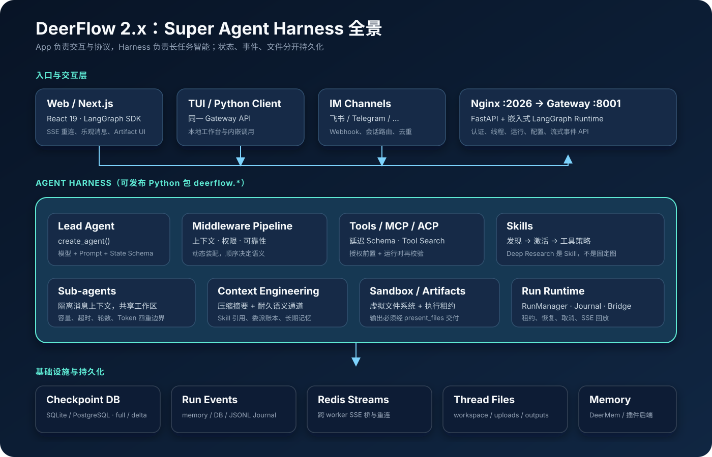
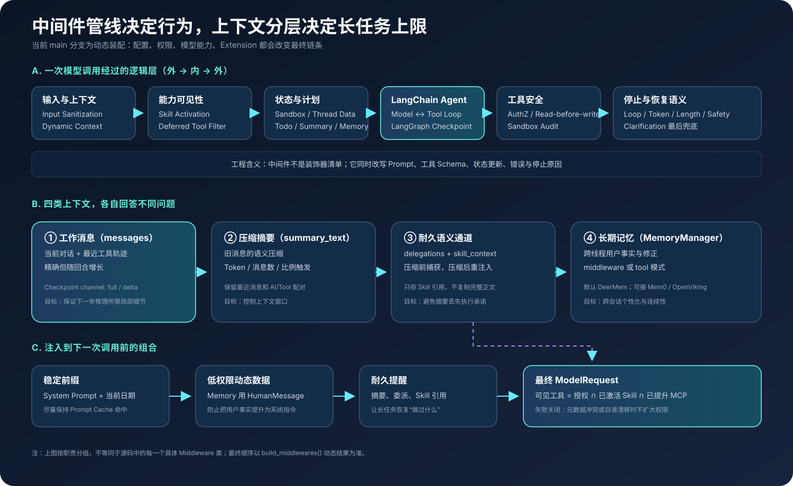
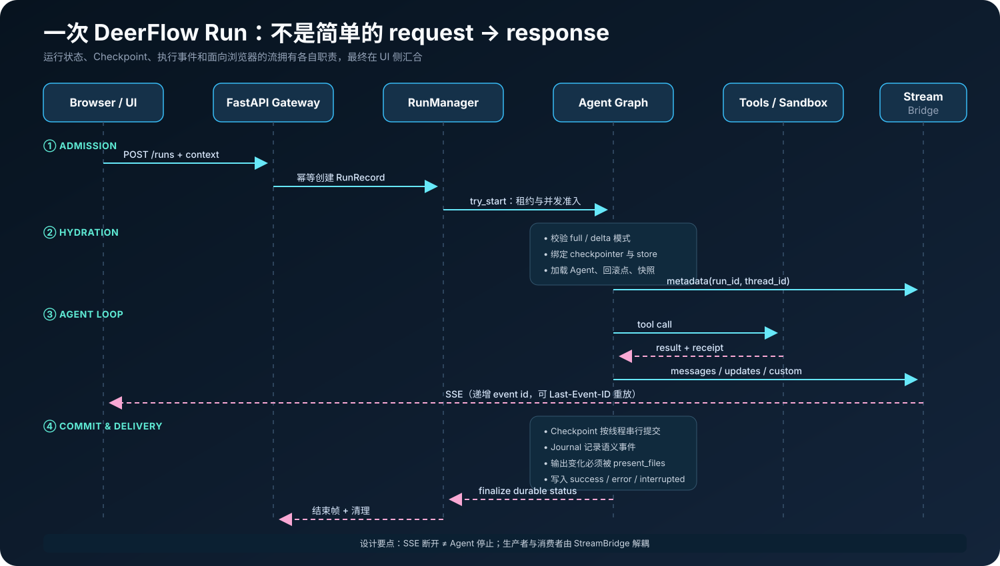
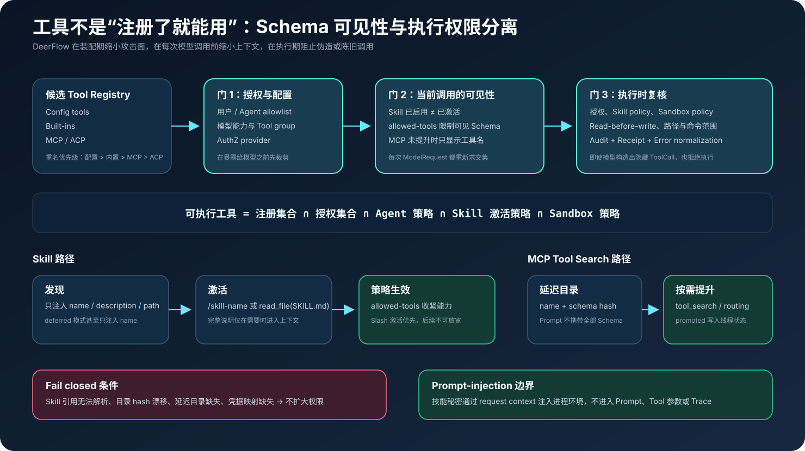
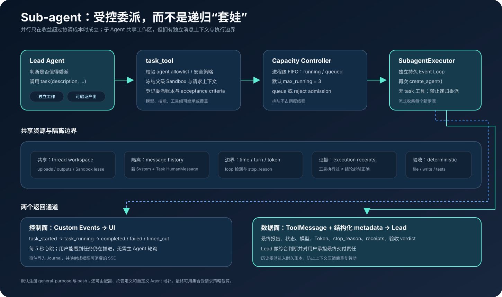

# DeerFlow 2.x 源码拆解：从 Deep Research 工作流到通用 Super Agent Harness

> 作者视角：大模型 Agent 工程 / 架构评审<br>
> 调研日期：2026-09-10（Asia/Shanghai）<br>
> 源码基线：[`bytedance/deer-flow@c9c7076`](https://github.com/bytedance/deer-flow/tree/c9c7076ba74806bd94879cd666b9215bf13c1cb1)<br>
> 版本说明：该提交的前后端包均声明为 `2.1.0`，但调研时最新正式 Tag 是 [`v2.0.0`](https://github.com/bytedance/deer-flow/releases/tag/v2.0.0)。因此本文把“已发布能力”和“main 分支当前实现”分开表述。

DeerFlow 最容易被误读成一个“自动搜索并写报告的 LangGraph”。这个理解对 1.x 尚有几分接近，对 2.x 已经失真。2.x 是一次不共享 1.x 代码的彻底重写：核心产品不再是某张预先编排的 Deep Research 图，而是一个面向长任务的 **Super Agent Harness**——给通用 Agent 配齐子 Agent、长期记忆、沙箱、Skill、工具治理、Checkpoint、可恢复流和 Artifact 交付能力。[^release][^concepts]

本文不是 README 的功能复述，而是一份源码级实现分析。重点回答六个工程问题：

1. Lead Agent 究竟怎样被组装出来？
2. 为什么 DeerFlow 选择“单 Agent 循环 + 中间件”，而不是把所有能力画成固定图？
3. 长任务如何压缩上下文而不遗失委派、Skill 和交付承诺？
4. MCP、Skill 与普通工具如何同时控制 Token 成本和权限边界？
5. 子 Agent 的并行、状态、验收和资源上限怎样落地？
6. 断线、重试、Checkpoint、运行事件和前端流，分别解决什么一致性问题？



## 一、先给结论

如果只记住本文的五个判断，可以记这些：

- **DeerFlow 2.x 的主抽象是 Harness，不是业务 Workflow。** Lead Agent 最终由 LangChain `create_agent()` 编译成 LangGraph；DeerFlow 的差异化主要来自装配器、状态 Schema、几十个按条件组合的中间件，以及 Agent 外围的运行系统。[^lead-agent][^langchain-middleware]
- **“Deep Research”已经下沉为 Skill。** 搜索、交叉验证、综合和引用等研究方法写在 `skills/public/deep-research/SKILL.md`，由通用长任务 Agent 按需加载；这比把研究步骤焊死在图拓扑里更容易演化。[^deep-research-skill]
- **上下文工程不是一个 Summarizer。** DeerFlow 同时维护工作消息、压缩摘要、委派账本、Skill 引用和跨线程长期记忆；摘要负责“压短”，耐久语义通道负责“别忘了尚未完成的承诺”。[^summarization][^thread-state]
- **工具治理分为“看得见”和“调得动”。** 授权、Skill `allowed-tools`、MCP 延迟 Schema 和 Sandbox 策略既裁剪模型可见工具，也在执行时复核，避免只靠 Prompt 约束。[^tools][^tool-search][^skill-policy]
- **长任务可靠性在 Agent 图之外。** `RunManager + RunJournal + StreamBridge + Checkpointer` 分别承担准入/租约、语义事件、可恢复传输和推理状态；浏览器断开不会天然终止生产者。[^run-worker][^stream-bridge]

这套架构的代价也很明确：行为从“看一张图就懂”变成“必须理解动态中间件顺序与多份持久状态”；默认单 Gateway worker 的运行管理还不是完整的横向扩展架构；本地 Sandbox 也不构成真正的安全隔离。

## 二、2.x 为什么不再只是 Deep Research

DeerFlow 的全称是 **Deep Exploration and Efficient Research Flow**。1.x 的品牌和代码重心都更靠近研究工作流；2.0 发布说明则明确称其为围绕 super-agent harness 的彻底重写，1.x 留在 `main-1.x` 分支。[^release]

两代架构可以这样理解：

| 维度 | 1.x 的典型心智模型 | 2.x 的源码事实 |
|---|---|---|
| 核心资产 | Deep Research 工作流 | 可复用 Agent Harness + 完整 App |
| 行为编排 | 图节点表达研究阶段 | 通用 model-tool loop，Skill 表达方法论 |
| 扩展点 | 改图、加节点、加工具 | Middleware、Skill、Tool、MCP、ACP、Extension |
| 长任务状态 | 工作流状态 | ThreadState + Checkpoint + RunRecord + Journal + 文件 |
| 并行方式 | 图中的并行分支 | Lead 根据收益按需委派 Sub-agent |
| 最终产物 | 研究回答/报告 | 文本响应 + 可验证 Artifact 交付 |

这不是说图不重要。`create_agent()` 返回的仍是一个编译后的 LangGraph，Checkpoint、流式事件和子图命名空间也都依赖 LangGraph。变化在于：**DeerFlow 不再用业务拓扑预先规定 Agent 每一步必须做什么，而是用运行时约束规定它“可以怎样安全、持久地做事”。**

## 三、代码库与分层

当前仓库是 Python + TypeScript monorepo，最重要的边界是 **Harness / App 单向依赖**：

```text
frontend/                         Next.js Web 产品
backend/app/                      FastAPI Gateway、IM Channels（app.*）
backend/packages/harness/
  deerflow/                       可发布 Harness（deerflow.*）
    agents/                       Lead、Sub-agent、Middleware、Memory
    tools/                        Built-in、MCP 延迟目录、工具装配
    sandbox/                      统一沙箱接口与生命周期
    runtime/                      Run、Journal、Stream Bridge、Checkpoint
skills/public/                    Deep Research 等公开 Skill
docker/                           Nginx、Gateway、Frontend、Redis、Provisioner
```

App 可以导入 Harness，Harness 不允许反向依赖 App，而且仓库用测试守住这条边界。这样既能交付完整产品，也能把 `deerflow.*` 当 SDK 嵌入其他 Agent 应用。[^backend-boundary]

源码基线的主要依赖如下：

| 层 | 当前声明 |
|---|---|
| Backend | Python `>=3.12`，`deerflow-harness 2.1.0` |
| Agent | LangChain `>=1.3`，LangGraph `>=1.2.9,<1.3` |
| MCP | `langchain-mcp-adapters >=0.2.2` |
| Frontend | Next.js `^16.2.11`，React `^19`，LangGraph SDK `^1.5.3` |
| Persistence | SQLite / PostgreSQL Checkpointer，文件与可选 Redis |

版本不是枝节：DeerFlow 使用了 LangGraph 1.2 的 `DeltaChannel` 等能力；照着旧版 LangGraph API 抄装配代码，很容易在 State、Middleware 或流事件格式上走偏。[^dependencies][^langgraph-persistence]

## 四、Lead Agent 是怎样组装出来的

真正的入口在 `backend/packages/harness/deerflow/agents/lead_agent/agent.py`。去掉缓存、异常处理和兼容分支后，装配逻辑可以还原成下面这段伪代码：

```python
def assemble_lead_agent(request_config, app_config):
    identity = resolve_trusted_user(request_config)
    options = resolve_request_options(request_config)

    # 优先级：请求覆盖 > 自定义 Agent > 全局默认
    model = resolve_and_authorize_model(options, identity, app_config)

    skills = discover_enabled_skills(identity, options.agent_policy)
    candidate_tools = get_available_tools(
        groups=options.tool_groups,
        include_mcp=True,
        subagent_enabled=options.subagent_enabled,
    )
    authorized_tools = filter_before_model_visibility(candidate_tools, identity)
    tools, deferred_catalog = assemble_deferred_mcp_tools(authorized_tools)

    middleware = build_middlewares(
        request=options,
        skills=skills,
        deferred_catalog=deferred_catalog,
        app_config=app_config,
    )
    prompt = render_lead_prompt(options, skills, app_config)

    return create_agent(
        model=model,
        tools=tools,
        middleware=middleware,
        system_prompt=prompt,
        state_schema=get_thread_state_schema(checkpoint_mode),
    )
```

这里有三个值得复用的设计。

第一，**请求配置不是可信配置**。用户身份、模型权限、可用子 Agent 和服务器保留字段都先由 Gateway/Harness 重算；客户端不能靠提交 `context` 自行扩大权限。

第二，**装配分两次裁剪工具**。先按身份、Agent 策略和工具组得到候选集合，再处理 Skill 与 MCP 在“当前这一次模型调用”中的可见性。静态注册、Prompt Schema 和执行权限因此不再是同一个概念。

第三，**Agent descriptor 与可执行 graph 一起返回**。descriptor 能说明这次到底选择了什么模型、工具和配置，使运行时与 UI 不必猜测动态装配结果。

## 五、中间件：DeerFlow 的真正控制平面

早期文章常说 DeerFlow 有“9 层”或“14 层”中间件；对当前 main 都不准确。`build_middlewares()` 会根据模型能力、Plan 模式、Sub-agent、Memory、Summarization、Tool Search、Guardrail 和 Extension 动态增删，中间件数量不是稳定 API。[^lead-agent]

更有用的读法，是按责任而不是死记类名分组：

| 责任 | 代表实现 | 解决的问题 |
|---|---|---|
| 输入边界 | InputSanitization、SystemMessageCoalescing | 清洗不合法消息，保持系统消息结构 |
| 资源准备 | ThreadData、Uploads、Sandbox | 建立每线程目录，注入上传文件，获取执行环境 |
| 工具安全 | Authorization、ReadBeforeWrite、SandboxAudit | 模型调用前裁剪，执行前再拒绝越权 |
| 工具可靠性 | ToolOutputBudget、ToolResultSanitization、ToolProgress、ToolErrorHandling | 外置巨型结果、统一错误、识别无进展循环 |
| 动态能力 | SkillActivation、SkillToolPolicy、McpRouting、DeferredToolFilter | 按当前上下文改变工具 Schema |
| 长上下文 | DynamicContext、DurableContext、Summarization、Memory | 日期/记忆注入、压缩、耐久语义恢复 |
| 工作管理 | Todo、SubagentLimit、Title、TokenUsage | 计划、委派配额、标题与成本统计 |
| 停止语义 | LoopDetection、TokenBudget、Length/Safety FinishReason | 把“为什么停”变成结构化状态 |
| 用户接管 | Clarification | 必须向用户询问时中断并等待恢复 |



顺序非常关键。输入清洗被放在外围，工具错误处理在内层给结果打上统一元数据；`ClarificationMiddleware` 刻意放在最后，使它能包住完整调用链并正确转换中断。对有 `before_model` / `after_model` 双向 Hook 的中间件，返回路径又是逆序执行，所以调整列表位置可能同时改变 Prompt、工具结果和异常语义。基础链条在 `build_lead_runtime_middlewares()` 中集中构造，Extension 则通过顺序约束参与合成，而不是任意 append。[^base-middleware]

这也是 DeerFlow 最强、同时最难维护的部分：扩展一个横切能力很方便，但团队必须把**顺序不变量**当正式接口，通过集成测试验证，而不能只测单个 Middleware 类。

## 六、ThreadState：工作状态不是只有 messages

DeerFlow 扩展 LangChain `AgentState` 得到 `ThreadState`。当前关键 Channel 包括：[^thread-state]

| 字段 | 用途 | 设计细节 |
|---|---|---|
| `messages` | 推理工作集 | 可使用 full 或 delta Channel |
| `sandbox` | 当前沙箱标识 | reducer 遇到冲突 ID 时 fail closed |
| `thread_data` | workspace / uploads / outputs | 文件路径与线程绑定 |
| `artifacts` | 可交付产物 | 使用 reducer 合并 |
| `todos` / `goal` | 计划与会话目标 | UI 可结构化呈现 |
| `viewed_images` | 已查看图片元数据 | 不把 Base64 写进 Checkpoint |
| `promoted_tools` | 已提升的 MCP Schema | 同时记录 catalog hash；目录变化即失效 |
| `delegations` | 子任务账本 | 有界保存，避免压缩后重复委派 |
| `skill_context` | 已读取 Skill 引用 | 保存名称/路径/描述，不复制完整正文 |
| `summary_text` | 历史摘要 | 与最近原始消息共同组成上下文 |
| `background_tasks` | 后台任务状态 | 支持异步进度与恢复 |

其中最有工程味的选择是“不把大对象塞进 State”：图片只保存元数据，巨型工具结果会落盘，Skill 只保存引用。这能同时降低序列化成本、Checkpoint 膨胀和模型上下文污染。

### Full 与 Delta Checkpoint

默认配置仍是 `checkpoint_channel_mode: full`。Full 模式在每个 super-step 写累积消息，线程越长，累计写入量大致呈二次增长；Delta 模式只写新增消息，并按 `snapshot_frequency` 定期做全量快照，用读取时物化成本换存储空间。LangGraph 官方也把 `DeltaChannel` 定义为 append-heavy Channel 的存储优化，且当前仍标为 beta。[^checkpoint-config][^langgraph-persistence]

DeerFlow 对模式切换很保守：模式是进程冻结、需重启的配置；共享同一数据库的进程必须一致；从 delta 读成 full 不能无损猜测，恢复时还有专门的线性化逻辑来规避历史 fork 重放问题。这说明 Checkpoint Schema 应被视为**持久数据协议**，而不是普通性能开关。

## 七、一次 Run 的完整生命周期



`run_agent()` 是理解生产可靠性的最佳入口。一次请求大致经过下面的阶段：[^run-worker]

1. **先建 Journal，再做预检。** 即使准入失败，也尽可能保留可诊断的运行事件。
2. **RunManager 准入。** `try_start()` 处理幂等、并发状态、租约和孤儿运行恢复，线程被标记为 running。
3. **Hydration。** 校验 Checkpoint 模式，构造服务器拥有的 Runtime Context，绑定 Checkpointer/Store，捕获回滚点和运行前 workspace 快照。
4. **开始流。** 先发布带 `run_id`、`thread_id` 的 metadata，再调用 `agent.astream()`；Checkpoint 写按线程加锁，防止同一线程并发破坏状态。
5. **事件分流。** `messages`、`updates`、`values`、`custom` 等 LangGraph 事件映射成 SSE；子图事件保留 namespace，避免子 Agent 的全量 `values` 覆盖根线程视图。
6. **验证交付。** 比较运行前后输出目录；若产生/修改了输出文件，却没有通过 `present_files` 呈现给用户，运行会被判为交付失败并写入 `run.delivery` receipt。
7. **有序收尾。** Flush Journal，持久化 receipts，写耗时与最终 Run 状态，再发送 UI 结束帧；清理采用独立超时，避免收尾挂死主任务。

### 四份状态，四种职责

| 状态系统 | 回答的问题 | 不该承担什么 |
|---|---|---|
| LangGraph Checkpoint | Agent 下一步从哪里继续？ | 不适合作为产品级审计日志 |
| RunRecord / RunManager | 这次运行是否准入、在跑、成功、失败或取消？ | 不保存全部推理语义 |
| RunJournal / Run Events | 过程中发生了哪些可查询事件？ | 不直接驱动模型恢复 |
| StreamBridge | 哪些帧尚未送达当前消费者？ | 不能替代长期事件存储 |
| Thread Files | 代码、数据和 Artifact 在哪里？ | 不该被塞成大段消息 |

`StreamBridge` 让生产者和 SSE 消费者解耦：每个事件有单调递增 ID，客户端可用 `Last-Event-ID` 重连，Bridge 负责心跳与缺口检测。内存实现适合单进程；Redis Streams 实现能支持跨 worker 传输与断线续流。于是“网页关了”只是消费者离线，并不等价于 Agent 任务应该被取消。[^stream-bridge]

## 八、上下文工程：压缩之外，还要保存语义承诺

普通 Summarization 的危险在于：它可能准确概括“讨论过什么”，却漏掉“谁正在做什么”“哪个 Skill 已被读取”“哪些产物必须交付”。DeerFlow 用多条 Channel 分工解决：

- `DeerFlowSummarizationMiddleware` 在 Token、消息数或上下文比例任一阈值满足时压缩旧消息，保留最近窗口以及 AI/Tool 配对。
- `DurableContextMiddleware` 在压缩前捕获委派记录和 Skill 引用，在压缩后作为低权限数据重新注入。
- `summary_text` 保存语言摘要；`delegations` 与 `skill_context` 保存结构化执行语义。
- 指定的摘要模型失败时回退到当前 Run 模型，防止一个便宜模型故障让长对话完全失去压缩能力。[^summarization]

当前示例配置默认开启 Summarization：32,000 tokens 触发、保留最近 10 条消息、最多取 15,564 tokens 准备摘要。这些只是模板默认值，不是适合所有模型的答案；实际阈值应根据 `context_window`、工具结果尺寸和单次输出预算一起标定。[^summarization-config]

### Dynamic Context 为什么把 Memory 放在 HumanMessage

`DynamicContextMiddleware` 第一次注入时会把框架拥有的日期/元数据与用户拥有的记忆拆开：前者使用 `SystemMessage`，后者使用 `HumanMessage`，并利用消息 ID 派生保持更新稳定。这样既能尽量维持系统前缀缓存，又不会把自动提取的用户事实“升级”为系统级指令。跨过午夜时只补轻量日期更新，不重写整段历史。[^dynamic-context]

这是一个值得抄走的安全原则：**记忆的来源决定它的权限，而不是它对回答有多重要。**

### 长期记忆

记忆通过 `MemoryManager` 抽象成可插拔后端。main 分支默认 `deermem`，还提供 Mem0、OpenViking、Honcho/noop 等适配路径；共有两种工作模式：[^memory]

- `middleware`：默认模式，回合结束后被动捕获用户消息和最终回复，后台抽取耐久事实。
- `tool`：实验模式，向模型暴露 `memory_search/add/update/delete`，让模型主动管理。

DeerMem 把用户摘要和 Agent 作用域事实分开存放，事实以 Markdown 为权威副本，并用 SQLite FTS5 做检索；中文可借助 jieba 分词，FTS5 不可用时退化到子串检索。默认身份桶是 `(user_id, agent_name)`，避免不同自定义 Agent 的事实互相污染。[^deermem]

自动记忆始终有误提取、过期和错误合并风险。DeerFlow 用置信度、容量、修订和陈旧清理降低风险，但它们不能把生成式抽取变成事实数据库。生产系统仍应提供“查看、纠正、删除、禁用记忆”的用户控制面。

## 九、Skill：把方法论从代码拓扑中解耦

DeerFlow 的 Skill 是一个目录包，入口为带 frontmatter 的 `SKILL.md`。常用字段包括 `name`、`description`、`license`、`allowed-tools`、`argument-hint` 和 `required-secrets`。运行时会扫描公开、用户自定义和集成 Skill，但“扫描到”不代表把完整正文灌进 Prompt。[^skills]

Skill 生命周期分三步：

1. **发现（discover）**：默认只把名称、描述和文件路径注入上下文；开启 deferred discovery 时甚至只给名称，模型先调用 `describe_skill`。
2. **激活（activate）**：用户可用 `/skill-name` 确定性激活；Agent 也可按需读取对应 `SKILL.md`。读取记录进入 `skill_context`，上下文压缩后仍保留引用。
3. **执行（enforce）**：`SkillToolPolicyMiddleware` 同时过滤下一次模型调用可见的 Tool Schema，并在工具真正执行时再次检查。Slash 激活形成更窄的策略后，后续自主加载不能把权限重新放宽。[^skill-policy]



### Deep Research 在 2.x 中具体是什么

公开的 `deep-research` Skill 把研究过程写成可执行方法论：先广泛探索，再深入高价值来源；记录来源，交叉验证，最后综合并检查覆盖与引用。另有 `github-deep-research` Skill 针对仓库、Issue、PR 和代码证据做同类约束。[^deep-research-skill][^github-research-skill]

这带来一个重要架构转变：

```text
固定研究图：代码决定步骤 → 改方法通常要改图、测试状态迁移

Skill 化研究：Harness 提供通用执行边界
            + Skill 提供可版本化的方法论
            + Tool/MCP 提供数据源
            + Artifact 合约约束最终交付
```

优点是研究方法可以像内容包一样分发、审查和按用户覆盖；缺点是执行路径更依赖模型遵循说明。DeerFlow 的补偿策略不是堆更多 Prompt，而是用 Tool policy、任务上限、receipts、验收条件与交付检查，把关键约束移回确定性代码。

### Skill Secret 为什么不直接进 Prompt

`required-secrets` 只声明 Skill 需要哪些凭据。真实值随请求放在 `context.secrets`，执行 Skill 相关进程时再注入环境，并从 Prompt、Tool 参数和 Trace 中剔除；缺失映射默认拒绝。这种“声明在内容层，值在控制面，使用在执行环境”的三段式设计，比把 API Key 拼进系统提示词安全得多。

## 十、Tools、MCP 与延迟 Schema

`get_available_tools()` 汇总四类来源：配置工具、内置工具、MCP 工具和 ACP 外部 Agent 工具。重名时按“配置 > 内置 > MCP > ACP”去重；视觉模型才得到 `view_image`，Sub-agent 开关决定是否加入 `task`，本地 Bash 则默认隐藏，除非显式允许 host bash。[^tools]

### 为什么要延迟 MCP Tool Schema

MCP Server 很容易一次暴露几十甚至几百个工具。完整 JSON Schema 每回合都进 Prompt 会产生三类成本：

- 固定输入 Token 和延迟上升；
- 相似工具增多，模型选择准确率下降；
- 暴露超出当前任务所需的能力面。

开启 `tool_search` 后，DeerFlow 只把 MCP 工具名称目录放入提示词。`DeferredToolCatalog` 对规范化名称和 Schema 计算 hash；模型调用 `tool_search(query)`，或 MCP routing metadata 命中后，相关 Schema 才被 promotion 到线程状态。下一次 `ModelRequest` 只绑定已提升的工具。目录 hash 变化时旧 promotion 作废，防止把陈旧授权/Schema 沿用到新目录。[^tool-search]

这里的重点不是多了一个“搜索工具”，而是建立了两级解析：

```text
Level 1：便宜目录      name + short hint
Level 2：昂贵可调用项  full JSON Schema + execution binding
```

示例配置默认关闭 `tool_search`，因为小工具集不一定值得增加一次发现步骤；当 MCP 数量显著增长时再启用，并用 `auto_promote_top_k` 控制每轮自动提升上限。[^tool-config]

### ACP 的位置

ACP（Agent Client Protocol）集成把 Codex、Claude Code、MCode 等外部编码 Agent 包装成 DeerFlow 工具。它和“选择哪个聊天模型”是两套配置：Lead Agent 可以用模型 A 推理，再把代码任务交给 ACP Agent B。每个线程拥有独立 ACP workspace，权限是否自动批准需显式配置。这使 DeerFlow 能充当 Agent-of-Agents 控制面，但也把外部 Agent 的认证、进程和文件权限纳入威胁模型。

## 十一、Sandbox 与 Artifact：执行环境也是 Agent API

`Sandbox` 抽象统一了命令执行、作用域执行、读写、下载、列表、glob 和 grep。实现可切换 Local、AIO Docker/Provisioner/Kubernetes、E2B、BoxLite、Tenki、OpenSandbox 等 Provider。Agent 看到稳定的虚拟路径：[^sandbox]

```text
/mnt/user-data/workspace   工作区
/mnt/user-data/uploads     用户上传
/mnt/user-data/outputs     最终产物
/mnt/skills                当前用户已启用 Skill 的只读投影视图
/mnt/acp-workspace         可选 ACP 工作区
```

`SandboxMiddleware` 按线程和用户延迟获取环境，用执行租约避免 Lead、多个 Sub-agent 和清理任务互相释放同一个 Sandbox；子 Agent 还获得自己的 command scope。Skill 投影则把允许的包复制到用户/线程视图，防止 Agent 通过工作区写权限篡改全局 Skill 源。

必须强调：**LocalSandboxProvider 不是安全边界。** 示例配置也明确只有隔离 Shell，或显式 `allow_host_bash: true` 时才暴露 Bash。只要 Agent 能在宿主机执行任意命令，Prompt injection 就可能转化为凭据泄漏或系统破坏。生产环境应优先远程/容器化 Provider，限制网络、挂载和环境变量，并把每次执行纳入 AuthZ 与审计。

### `present_files` 是交付协议，不是 UI 糖

DeerFlow 在 Run 前后比较 `outputs` 快照。如果 Agent 写出了新文件或修改了产物，却没有调用 `present_files` 明确呈现，运行会留下失败的 delivery receipt。这个设计把“文件确实存在”与“用户真正收到产物”分开验证，修复了文件型 Agent 最常见的假完成：模型说“报告已生成”，但前端根本没有下载入口。

## 十二、Sub-agent：什么时候并行，以及如何阻止失控



DeerFlow 内置 `general-purpose` 与 `bash` 两类子 Agent，还可以从配置、自定义 Agent 和托管定义注册更多类型。最终 Registry 按覆盖顺序合并，再受 Lead Agent allowlist 裁剪。[^subagent-registry]

### 不是“能并行就并行”

`task` 工具的说明直接把并行标准写成收益判断：只有独立子任务能带来明显的延迟收益、专家能力或上下文隔离时才委派；依赖前序结果、争用同一状态或工作量很小的任务留给 Lead。这个约束很现实，因为每次委派都会增加 Prompt、模型调用、上下文交接和结果综合成本。

### 一次委派怎样执行

1. `task_tool` 校验子 Agent 类型、allowlist、Bash 安全和本 Run 总委派数。
2. 冻结父级的 Sandbox、线程目录、上传文件、身份、授权、模型、工具组、Skill 和 Extension 快照。
3. 进入进程级 FIFO capacity controller。示例配置默认同时运行 3 个，队列 64 个，满载时排队或拒绝；排队任务不占调度线程。[^subagent-config]
4. `SubagentExecutor` 在独立的持久 Event Loop 上再次调用 `create_agent()`，使用新的 System Prompt 与单条 Task HumanMessage，因此不会继承 Lead 的整段消息历史。
5. 子 Agent 共享父线程工作区和 Sandbox 租约，但没有 `task` 工具，禁止递归套娃。
6. 执行过程中自动发 `task_started/running/completed/failed/timed_out` 事件；Lead 无需用轮询工具浪费回合。
7. 结果以 `ToolMessage + metadata` 返回，包含状态、模型、Token、`stop_reason`、execution receipts 和 acceptance verdict。[^task-tool][^subagent-executor]

### 三层“完成”证据

DeerFlow 没有把子 Agent 的一句“完成了”当真，而是逐级增强证据：

| 层 | 证据 | 能证明什么 |
|---|---|---|
| 自报 | 最终自然语言报告 | 子 Agent 声称做了什么 |
| Receipt | `[rN]` 工具执行回执 | 某个工具调用确实发生过；不保证结论正确 |
| Acceptance | `file:path`、`file_written:path`、`tests_passed:command` | 确定性条件是否满足 |

再叠加 timeout、max turns、loop detection 和 token budget，停止被表示成附加的 `stop_reason`，而不是把 `completed` 粗暴改成 `failed`。这样上层可以区分“正常完成”“被预算截断后给出收尾答案”和“运行时错误”。

普通 `task` 调用适合一次 Run 内的少量委派；另有默认关闭的 durable batch runtime，把大批子任务持久化到数据库，分别控制 batch 总量、live 数和真正占用 execution slot 的 running 数。这是把交互式委派升级为作业系统的起点，但会显著增加模型成本与运维复杂度。

## 十三、前端不是薄壳：它在做流一致性

前端通过 `useStream<AgentThreadState>` 连接 `lead_agent`，启用 `reconnectOnMount`、`streamResumable` 和 throttle；提交时把模式映射成后端上下文，例如 `ultra` 打开 Sub-agent，`pro/ultra` 打开 Plan，客户端 `recursion_limit` 设到 1000，但服务器还会按 `max_recursion_limit` 重新 clamp。[^frontend-stream]

几个细节说明它不是普通聊天 UI：

- 用户消息先乐观插入，文件上传完成后才正式 submit；失败时要回滚或对账。
- Token chunk 先进入缓冲，约每 80 ms 合并渲染，避免高频 React 更新。
- 重连会处理 replay gap、重复消息 ID、事件序号和持久化历史。
- Sub-agent 进度走根流的 custom event；不让子图 `values` 替换 Lead 的根状态。
- 上下文压缩与 Journal 历史切换期间保留 transient bridge，避免旧消息瞬间消失。

因此前端实际实现了一个小型 reconciler：它要合并乐观本地状态、LangGraph 当前状态、可重放流和持久化 Run Events。任何新增事件类型都应同时定义生产、持久化、SSE 映射、去重和最终 UI 语义。

## 十四、部署拓扑与生产边界

官方 Compose 包含五类服务：Nginx `:2026`、Next.js Frontend、FastAPI Gateway `:8001`、Redis Streams，以及可选 Sandbox Provisioner `:8002`。Nginx 默认只绑定 `127.0.0.1`，源码注释明确给出理由：这个 Agent 能执行命令，不应在没有 TLS/认证前门时直接暴露公网。[^compose]

```text
Browser / IM
      │
      ▼
Nginx :2026 ─────► Next.js :3000
      │
      └──────────► Gateway :8001
                         ├── Checkpoint / Run DB
                         ├── Redis Stream Bridge
                         ├── Thread Files / Memory
                         └── optional Provisioner :8002 ─► remote sandboxes
```

一个容易忽略的限制是：**Redis Bridge 解决的是跨 worker SSE 与重连，不等于整个 Gateway 已无状态化。** Compose 默认只启动一个 Uvicorn worker，因为 run cancel、请求去重和部分 IM 服务仍含进程本地状态。强行增加 `GATEWAY_WORKERS` 可能让事件能被看到，却无法保证取消请求落到拥有对应运行的 worker。[^compose]

生产化至少需要做以下决策：

| 领域 | 开发默认 | 生产建议 |
|---|---|---|
| 入口 | loopback Nginx | TLS、OIDC/SSO、CSRF、限流，之后才开放公网 |
| Sandbox | Local | 容器/远程隔离，最小挂载、网络与环境变量 |
| Checkpoint | SQLite / full | PostgreSQL；长线程评估 delta，但先做迁移演练 |
| Run Events | memory | DB 或受管日志，明确保留期与脱敏 |
| Stream | memory/Redis | 多 worker 必须 Redis，但仍要解决运行所有权 |
| Secret | `.env` / request context | Secret Manager、短期凭据、按用户映射 |
| 成本 | Token usage 开、硬预算关 | 打开预算与告警，按模型/用户/任务设配额 |
| 可观测性 | 可选 tracing | trace id、Run Journal、LLM/Tool latency、stop_reason 联查 |

## 十五、如何本地复现这份源码基线

如果目的是验证本文，而不是追随随时变化的 main，建议固定提交：

```bash
git clone https://github.com/bytedance/deer-flow.git
cd deer-flow
git checkout c9c7076ba74806bd94879cd666b9215bf13c1cb1

# 交互式生成最小 config.yaml 与 .env
make setup

# 诊断环境；需要 Python 3.12+、Node.js 22+
make doctor

# 按仓库 Install.md / Makefile 选择 Docker 或本地开发启动
make dev
```

`make setup` 会询问模型、搜索工具、Sandbox 与 Bash/写文件策略。不要直接提交生成的 `.env` 和 `config.yaml`；若要使用容器 Sandbox，第一次运行前预拉镜像可避免任务中途长时间等待。完整步骤以固定提交的 [`Install.md`](https://github.com/bytedance/deer-flow/blob/c9c7076ba74806bd94879cd666b9215bf13c1cb1/Install.md) 为准。[^readme]

本文没有启动真实模型做端到端聊天：那需要读者自己的 Provider/API Key，也会产生外部费用。源码、配置、依赖与静态图均基于上述提交核对；运行时行为的高风险结论同时查阅了相关测试/模块文档与上游 LangGraph 持久化语义。

## 十六、如果自己实现一个精简版 DeerFlow

不要从“把所有 Middleware 都抄一遍”开始。更稳妥的落地顺序是：

### 第 1 阶段：做对单 Agent 循环

- 用 `create_agent(model, tools, state_schema)` 建立最小可恢复 Agent。
- 先定义 `thread_id`、Checkpoint、取消和幂等语义，再做 UI。
- 工具统一返回结构化成功/失败，不把异常堆栈直接喂给模型。

### 第 2 阶段：把文件变成一等公民

- 每线程划分 workspace、uploads、outputs。
- 巨型 Tool output 外置到文件，只给模型 synopsis + path。
- 建立显式 Artifact present 合约，并在 Run 结束做确定性检查。

### 第 3 阶段：上下文分层

- 工作消息用于精确近期状态；摘要用于压缩历史。
- 未完成委派、已启用能力、产物清单用结构化 Channel 保存。
- 跨线程记忆单独建 Store，来源权限不得高于原始用户内容。

### 第 4 阶段：工具能力治理

- 在装配期按用户/Agent 策略过滤候选工具。
- 在模型调用前动态绑定 Schema，在执行前再次鉴权。
- 工具超过一定规模后再引入两级目录与延迟 Schema。

### 第 5 阶段：受控 Sub-agent

- 先实现总量、并发、超时和轮数上限，再开放并行。
- 子 Agent 隔离消息、共享明确的工作区；禁止无限递归。
- 返回执行 receipts，并只对关键结果做确定性 acceptance checks。

### 第 6 阶段：拆开恢复状态与观测事件

- Checkpoint 服务 Agent 恢复；Journal 服务审计与 UI 历史。
- Stream 只做在线/短期重放，不充当永久真相来源。
- 把 `stop_reason`、delivery verdict、token usage 和 trace id 贯穿全链路。

一段最小运行循环可以长这样：

```python
async def execute_run(run, graph, bridge, journal, checkpointer):
    await run.acquire_lease()
    await bridge.publish("metadata", {"run_id": run.id})

    try:
        async for mode, payload in graph.astream(
            run.input,
            config={"configurable": {"thread_id": run.thread_id}},
            stream_mode=["messages", "updates", "custom"],
        ):
            event = normalize_event(mode, payload)
            await journal.append(event)       # 可查询事实
            await bridge.publish(event)       # 在线交付

        delivery = verify_outputs_were_presented(run.workspace)
        await run.complete(delivery=delivery)
    except CancelledError:
        await run.interrupt()
    except Exception as exc:
        await run.fail(classify_error(exc))
    finally:
        await journal.flush()
        await run.release_lease()
```

这段伪代码故意没有模型、Prompt 和搜索细节，因为 Agent 系统最难补救的通常不是“模型还不够聪明”，而是幂等、状态归属、权限、恢复与交付从一开始就没有契约。

## 十七、架构评价：哪些值得学，哪些要谨慎

### 值得学习

1. **Harness / App 分层清楚。** Agent 核心能被产品使用，但不依赖产品路由和 UI。
2. **把语义约束下沉到运行时。** Tool Schema 过滤、执行复核、delivery receipt 和 acceptance checks 都比 Prompt 承诺可靠。
3. **上下文结构化。** 摘要、委派、Skill、Memory 不挤在一段“万能系统提示词”里。
4. **可恢复流与 Agent 执行解耦。** 浏览器体验、后台运行和审计有各自数据结构。
5. **Sub-agent 有明确成本模型。** 默认并发不高、禁止递归、总量有界，符合真实 API 成本和上下文开销。

### 需要谨慎

1. **动态中间件的认知负担高。** 数量和顺序随配置变化；Extension 组合可能引入跨层副作用，必须有顺序快照和端到端测试。
2. **状态面较多。** Checkpoint、Run DB、Journal、Bridge、文件和 Memory 之间可能出现部分成功，恢复/清理矩阵会快速膨胀。
3. **横向扩展仍有进程本地边界。** Redis 只解决传输，不自动解决 Run ownership、cancel routing 与全局并发。
4. **本地执行风险极高。** Local Sandbox 方便开发，却不能隔离恶意网页内容、依赖脚本或模型误操作。
5. **Memory 后端语义并不完全同构。** middleware/tool、search/CRUD、故障策略在不同实现上可能不同，切换 Provider 不能只换类名。
6. **main 的能力快于正式 Release。** 当前代码已进入 2.1.0 里程碑，生产采纳应固定 Tag/commit 并逐项确认 breaking changes。

我的总体评价是：DeerFlow 2.x 已经不是一个“研究 Demo”，而是一套认真处理 Agent 工程脏活的参考实现。它最有价值的地方不是某个 Prompt 或搜索算法，而是承认长任务 Agent 同时是 **状态机、作业系统、权限系统、文件系统客户端和流式应用**。它的复杂度也正来源于此。

## 十八、推荐的源码阅读顺序

如果要在两小时内建立实现心智模型，建议按以下顺序：

1. [`backend/AGENTS.md`](https://github.com/bytedance/deer-flow/blob/c9c7076ba74806bd94879cd666b9215bf13c1cb1/backend/AGENTS.md)：先看 Harness / App 边界。
2. [`lead_agent/agent.py`](https://github.com/bytedance/deer-flow/blob/c9c7076ba74806bd94879cd666b9215bf13c1cb1/backend/packages/harness/deerflow/agents/lead_agent/agent.py#L458-L1192)：看装配总入口与中间件顺序。
3. [`thread_state.py`](https://github.com/bytedance/deer-flow/blob/c9c7076ba74806bd94879cd666b9215bf13c1cb1/backend/packages/harness/deerflow/agents/thread_state.py)：看系统真正持久化哪些语义。
4. [`runtime/runs/worker.py`](https://github.com/bytedance/deer-flow/blob/c9c7076ba74806bd94879cd666b9215bf13c1cb1/backend/packages/harness/deerflow/runtime/runs/worker.py#L761)：看 Agent 如何成为可管理 Run。
5. [`task_tool.py`](https://github.com/bytedance/deer-flow/blob/c9c7076ba74806bd94879cd666b9215bf13c1cb1/backend/packages/harness/deerflow/tools/builtins/task_tool.py#L646) 与 [`subagents/executor.py`](https://github.com/bytedance/deer-flow/blob/c9c7076ba74806bd94879cd666b9215bf13c1cb1/backend/packages/harness/deerflow/subagents/executor.py#L765)：看委派与隔离。
6. [`tool_search.py`](https://github.com/bytedance/deer-flow/blob/c9c7076ba74806bd94879cd666b9215bf13c1cb1/backend/packages/harness/deerflow/tools/builtins/tool_search.py#L64)：看 MCP Schema 如何延迟加载。
7. [`summarization.md`](https://github.com/bytedance/deer-flow/blob/c9c7076ba74806bd94879cd666b9215bf13c1cb1/backend/docs/summarization.md) 与 Memory 目录：看长上下文。
8. [`frontend/src/core/threads/hooks.ts`](https://github.com/bytedance/deer-flow/blob/c9c7076ba74806bd94879cd666b9215bf13c1cb1/frontend/src/core/threads/hooks.ts#L1580)：最后看 UI 如何对账流状态。

## 调研可信度与局限

- **高置信事实**：源码类/函数、默认配置、依赖版本、Docker 拓扑、当前 commit 与 Tag，均直接来自固定提交或 Git refs。
- **中高置信解释**：模块之间的职责、设计动机，结合源码注释、仓库文档和上游 LangChain/LangGraph 文档交叉判断。
- **工程判断**：优缺点、生产建议和精简实现路径是本文作者基于源码作出的评价，不代表 ByteDance 官方承诺。
- **未验证项**：没有使用真实模型/API Key 运行端到端任务，也没有对各 Sandbox/Memory 第三方 Provider 做兼容性基准。

## 参考资料

[^release]: [DeerFlow v2.0.0 Release](https://github.com/bytedance/deer-flow/releases/tag/v2.0.0)；[固定提交的 README_zh](https://github.com/bytedance/deer-flow/blob/c9c7076ba74806bd94879cd666b9215bf13c1cb1/README_zh.md)。
[^concepts]: [DeerFlow Core Concepts](https://github.com/bytedance/deer-flow/blob/c9c7076ba74806bd94879cd666b9215bf13c1cb1/frontend/src/content/en/introduction/core-concepts.mdx)。
[^backend-boundary]: [backend/AGENTS.md — Harness / App split](https://github.com/bytedance/deer-flow/blob/c9c7076ba74806bd94879cd666b9215bf13c1cb1/backend/AGENTS.md)。
[^dependencies]: [Harness pyproject.toml](https://github.com/bytedance/deer-flow/blob/c9c7076ba74806bd94879cd666b9215bf13c1cb1/backend/packages/harness/pyproject.toml)；[frontend/package.json](https://github.com/bytedance/deer-flow/blob/c9c7076ba74806bd94879cd666b9215bf13c1cb1/frontend/package.json)。
[^lead-agent]: [Lead Agent assembly 与 build_middlewares()](https://github.com/bytedance/deer-flow/blob/c9c7076ba74806bd94879cd666b9215bf13c1cb1/backend/packages/harness/deerflow/agents/lead_agent/agent.py#L458-L1192)。
[^langchain-middleware]: [LangChain 官方 Middleware Overview](https://docs.langchain.com/oss/python/langchain/middleware/overview)。
[^base-middleware]: [基础运行时中间件装配](https://github.com/bytedance/deer-flow/blob/c9c7076ba74806bd94879cd666b9215bf13c1cb1/backend/packages/harness/deerflow/agents/middlewares/tool_error_handling_middleware.py#L150-L337)。
[^thread-state]: [ThreadState 与 reducers](https://github.com/bytedance/deer-flow/blob/c9c7076ba74806bd94879cd666b9215bf13c1cb1/backend/packages/harness/deerflow/agents/thread_state.py)。
[^checkpoint-config]: [config.example.yaml — Checkpoint mode](https://github.com/bytedance/deer-flow/blob/c9c7076ba74806bd94879cd666b9215bf13c1cb1/config.example.yaml#L2235-L2274)。
[^langgraph-persistence]: [LangGraph 官方 Persistence 与 DeltaChannel 文档](https://docs.langchain.com/oss/python/langgraph/persistence)。
[^run-worker]: [Run worker / agent.astream 生命周期](https://github.com/bytedance/deer-flow/blob/c9c7076ba74806bd94879cd666b9215bf13c1cb1/backend/packages/harness/deerflow/runtime/runs/worker.py#L761)。
[^stream-bridge]: [StreamBridge 基础协议](https://github.com/bytedance/deer-flow/blob/c9c7076ba74806bd94879cd666b9215bf13c1cb1/backend/packages/harness/deerflow/runtime/stream_bridge/base.py)；[Run event stream 设计](https://github.com/bytedance/deer-flow/blob/c9c7076ba74806bd94879cd666b9215bf13c1cb1/backend/docs/RUN_EVENT_STREAM.md)。
[^summarization]: [DeerFlow Summarization 设计](https://github.com/bytedance/deer-flow/blob/c9c7076ba74806bd94879cd666b9215bf13c1cb1/backend/docs/summarization.md)；[DurableContextMiddleware](https://github.com/bytedance/deer-flow/blob/c9c7076ba74806bd94879cd666b9215bf13c1cb1/backend/packages/harness/deerflow/agents/middlewares/durable_context_middleware.py)。
[^summarization-config]: [config.example.yaml — Summarization](https://github.com/bytedance/deer-flow/blob/c9c7076ba74806bd94879cd666b9215bf13c1cb1/config.example.yaml#L1813-L1876)。
[^dynamic-context]: [DynamicContextMiddleware](https://github.com/bytedance/deer-flow/blob/c9c7076ba74806bd94879cd666b9215bf13c1cb1/backend/packages/harness/deerflow/agents/middlewares/dynamic_context_middleware.py#L320-L606)。
[^memory]: [MemoryManager](https://github.com/bytedance/deer-flow/blob/c9c7076ba74806bd94879cd666b9215bf13c1cb1/backend/packages/harness/deerflow/agents/memory/manager.py)；[config.example.yaml — Memory](https://github.com/bytedance/deer-flow/blob/c9c7076ba74806bd94879cd666b9215bf13c1cb1/config.example.yaml#L1892-L2044)。
[^deermem]: [DeerMem storage](https://github.com/bytedance/deer-flow/blob/c9c7076ba74806bd94879cd666b9215bf13c1cb1/backend/packages/harness/deerflow/agents/memory/backends/deermem/deermem/core/storage.py)；[FTS5 retrieval](https://github.com/bytedance/deer-flow/blob/c9c7076ba74806bd94879cd666b9215bf13c1cb1/backend/packages/harness/deerflow/agents/memory/backends/deermem/deermem/core/retrieval.py)。
[^skills]: [Skills 子系统说明](https://github.com/bytedance/deer-flow/blob/c9c7076ba74806bd94879cd666b9215bf13c1cb1/backend/packages/harness/deerflow/skills/AGENTS.md)。
[^skill-policy]: [SkillToolPolicyMiddleware](https://github.com/bytedance/deer-flow/blob/c9c7076ba74806bd94879cd666b9215bf13c1cb1/backend/packages/harness/deerflow/agents/middlewares/skill_tool_policy_middleware.py)。
[^deep-research-skill]: [公开 Deep Research Skill](https://github.com/bytedance/deer-flow/blob/c9c7076ba74806bd94879cd666b9215bf13c1cb1/skills/public/deep-research/SKILL.md)。
[^github-research-skill]: [GitHub Deep Research Skill](https://github.com/bytedance/deer-flow/blob/c9c7076ba74806bd94879cd666b9215bf13c1cb1/skills/public/github-deep-research/SKILL.md)。
[^tools]: [工具装配与去重](https://github.com/bytedance/deer-flow/blob/c9c7076ba74806bd94879cd666b9215bf13c1cb1/backend/packages/harness/deerflow/tools/tools.py)。
[^tool-search]: [DeferredToolCatalog 与 tool_search](https://github.com/bytedance/deer-flow/blob/c9c7076ba74806bd94879cd666b9215bf13c1cb1/backend/packages/harness/deerflow/tools/builtins/tool_search.py#L64-L318)。
[^tool-config]: [config.example.yaml — Tool Search](https://github.com/bytedance/deer-flow/blob/c9c7076ba74806bd94879cd666b9215bf13c1cb1/config.example.yaml#L1159-L1174)。
[^sandbox]: [Sandbox 接口与安全边界](https://github.com/bytedance/deer-flow/blob/c9c7076ba74806bd94879cd666b9215bf13c1cb1/backend/packages/harness/deerflow/sandbox/AGENTS.md)；[Sandbox middleware](https://github.com/bytedance/deer-flow/blob/c9c7076ba74806bd94879cd666b9215bf13c1cb1/backend/packages/harness/deerflow/sandbox/middleware.py)。
[^subagent-registry]: [Sub-agent registry](https://github.com/bytedance/deer-flow/blob/c9c7076ba74806bd94879cd666b9215bf13c1cb1/backend/packages/harness/deerflow/subagents/registry.py)。
[^subagent-config]: [config.example.yaml — Subagent runtime](https://github.com/bytedance/deer-flow/blob/c9c7076ba74806bd94879cd666b9215bf13c1cb1/config.example.yaml#L1595-L1690)。
[^task-tool]: [`task` 工具实现](https://github.com/bytedance/deer-flow/blob/c9c7076ba74806bd94879cd666b9215bf13c1cb1/backend/packages/harness/deerflow/tools/builtins/task_tool.py#L646)。
[^subagent-executor]: [SubagentExecutor](https://github.com/bytedance/deer-flow/blob/c9c7076ba74806bd94879cd666b9215bf13c1cb1/backend/packages/harness/deerflow/subagents/executor.py#L765)。
[^frontend-stream]: [Frontend thread streaming hook](https://github.com/bytedance/deer-flow/blob/c9c7076ba74806bd94879cd666b9215bf13c1cb1/frontend/src/core/threads/hooks.ts#L1099-L2245)。
[^compose]: [Production Docker Compose](https://github.com/bytedance/deer-flow/blob/c9c7076ba74806bd94879cd666b9215bf13c1cb1/docker/docker-compose.yaml)。
[^readme]: [DeerFlow 中文 README / 快速开始](https://github.com/bytedance/deer-flow/blob/c9c7076ba74806bd94879cd666b9215bf13c1cb1/README_zh.md)。
