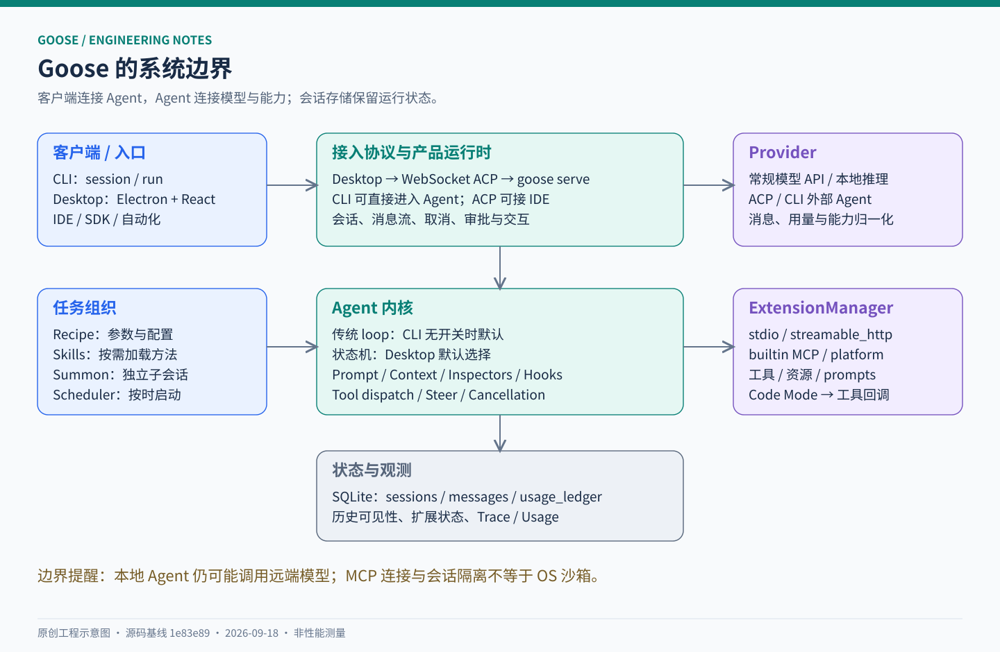
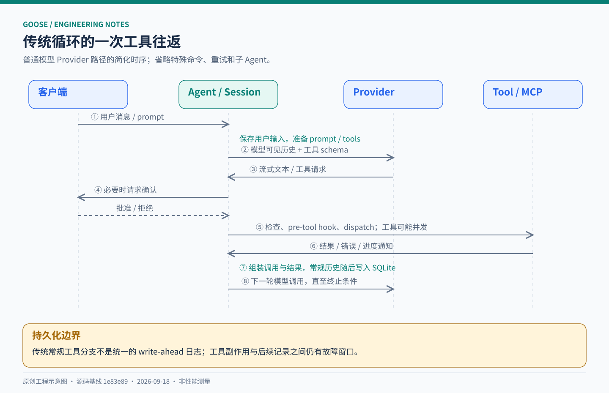
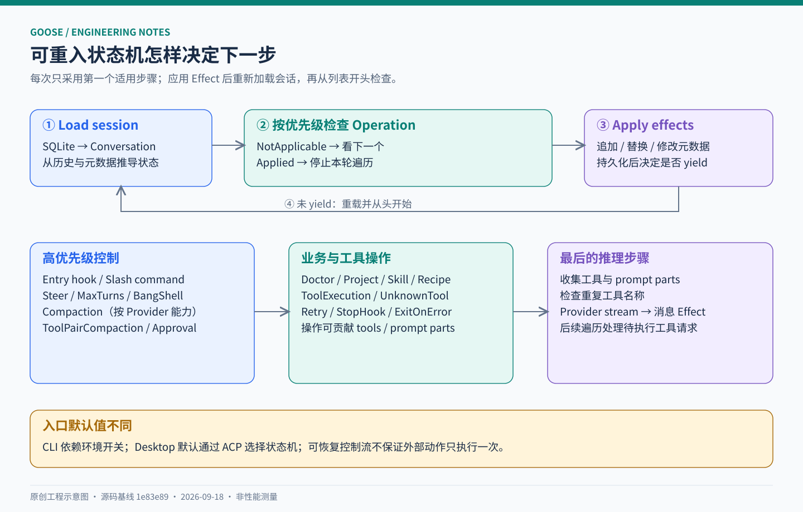
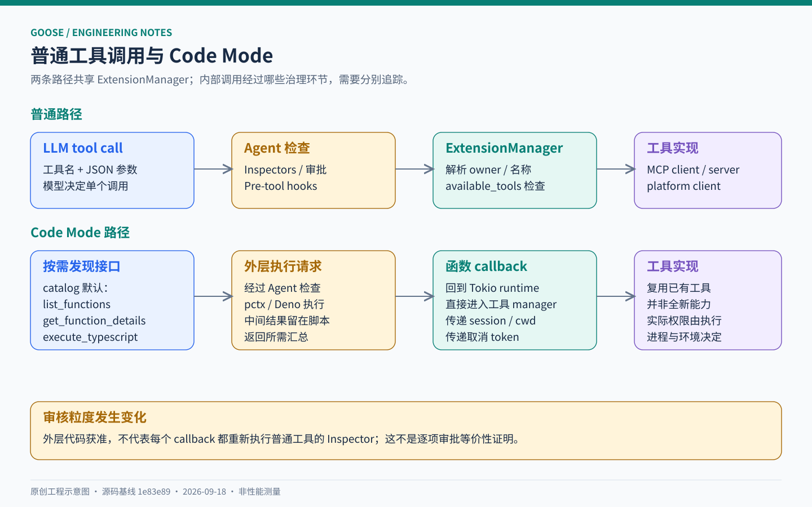
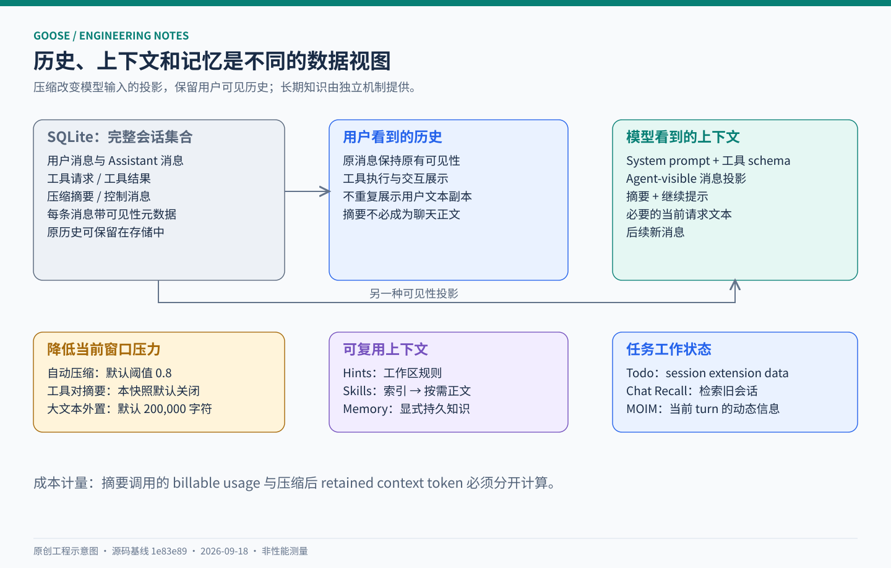
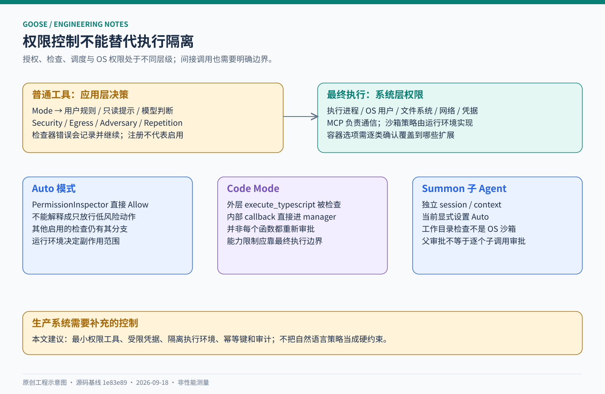
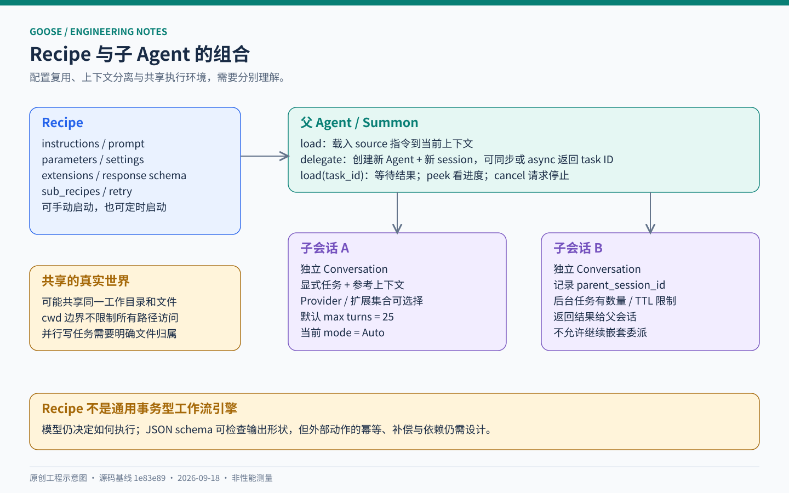

# 深入 Goose：从 MCP 工具循环到可恢复状态机的 Agent 工程实现

一个能修改代码的 Agent，最容易写出来的是 `模型 → 工具 → 模型`。最难的是让这个循环在工具变多、历史变长、用户中断、审批挂起、进程重启、模型协议变化之后，仍然具有可解释的行为。

Goose 值得研究，正是因为这些问题在它的源码里都有具体落点。它以 Rust 实现运行时，以 MCP 连接能力，以 ACP 连接客户端和外部 Agent，再通过持久化会话、上下文投影、Recipe 与子 Agent，组成可用于终端、桌面和自动化任务的产品。

本文沿一次真实调用应经过的代码路径，解释 Goose 如何实现这些机制，以及哪些设计可以借鉴、哪些边界需要补强。



## 阅读基线：先把版本固定下来

| 项目 | 本文基线 |
| --- | --- |
| 官方仓库 | [aaif-goose/goose][repo] |
| 分支与提交 | `main` / [`1e83e89f556fc60fd396df1fd0f2992f8b2f2dc1`][commit] |
| 提交时间 | 2026-09-18 00:19:10 UTC |
| 调研日期 | 2026-09-18 |
| 产品 workspace 版本 | `1.51.0`，来自根 `Cargo.toml`，不等同于“最新稳定发行版” |
| GDK 相关 crate 版本 | 本次查看的 `goose-agent`、`goose-providers` 等为 `0.1.0-alpha.9` |
| 技术栈 | Rust 2021、Rust 最低版本声明 `1.94.1`、Tokio、rmcp、SQLite/sqlx、Electron、React/TypeScript |
| 方法 | 固定提交源码阅读、调用链交叉检查、官方文档对照、随文教学示例验证 |
| 验证范围 | 未编译整个 Goose，未运行真实付费模型任务，未声称测得吞吐量、成功率或成本优势 |

本文中“当前”均指这个 commit。文中蓝色源码链接固定到该提交；完整索引见 [SOURCE_MAP.md](SOURCE_MAP.md)，文档与源码差异见 [RESEARCH_NOTES.md](RESEARCH_NOTES.md)。所有插图都是依据源码绘制的工程示意图，不是官方截图或性能测量图。[版本来源][workspace]

阅读路线：先读第 1—4 节理解运行时，再读第 5—10 节理解能力与边界；想动手可直接到第 13 节。附带的 Python 示例是教学实现，不是 Goose 官方 SDK 或源码移植。

| 阅读目标 | 入口 |
| --- | --- |
| 理解产品分层、仓库与 ACP | [架构与入口](#architecture) |
| 追踪传统循环和新状态机 | [执行内核](#runtime) |
| 理解 MCP 扩展和 Code Mode | [工具运行时](#tools) |
| 理解压缩、记忆和 SQLite | [上下文与状态](#context) |
| 审查权限、子 Agent 与 Recipe | [治理与委派](#security) |
| 运行示例与阅读工程取舍 | [动手实现](#practice) |

<a id="architecture"></a>

## 1. 用工程视角定义 Goose

### 1.1 产品能力背后的五个系统

从产品看，Goose 是一个通用、本地运行、可扩展的开源 Agent，能做代码、研究、写作和自动化。模型可以运行在远端，也可以接本地推理，因此“Agent 在本机运行”不意味着“所有数据都留在本机”。官方仓库采用 Apache-2.0 许可证，并将项目列为 Agentic AI Foundation 的一部分。[项目说明][repo] [许可证][license]

从实现看，可以把它拆成五个系统：

| 系统 | 回答的问题 | 代表实现 |
| --- | --- | --- |
| 客户端与协议 | 用户如何发起任务、看到流式结果、响应审批？ | CLI、Desktop、ACP server/client |
| Agent 编排 | 何时调用模型、调用工具、继续、停止或恢复？ | `Agent::reply`、传统 loop 与 state machine 双路径 |
| 能力运行时 | 工具如何发现、命名、连接、调用和取消？ | `ExtensionManager`、MCP、platform extensions |
| 上下文与状态 | 什么进入模型窗口，什么保留在历史和记忆里？ | `PromptManager`、compaction、SQLite、Skills |
| 工作流与治理 | 如何复用任务、委派、限制能力并观察执行？ | Recipe、Summon、Inspectors、Hooks、Telemetry |

**我的判断：Goose 的主要价值在 Agent harness，也就是包围模型的执行、状态与控制系统。** 替换模型只改变其中一个部件；工具边界、会话语义、恢复机制和上下文策略，决定了产品能否稳定地把模型决策变成实际动作。

### 1.2 三个必须知道的版本事实

第一，**当前 Desktop 的聊天通路已经采用 ACP**。直接用早期的 `goose-server + REST/SSE` 图来解释这个版本，会错过实际入口。

第二，**传统循环与状态机并存，而且入口默认值不同**。环境变量 `GOOSE_STATE_MACHINE` 默认为未启用；`1`、`true`、`TRUE`、`yes` 会开启，因此未配置开关的 CLI 路径仍使用传统循环。ACP 请求的 `_meta.goose.unrolledAgentLoop` 可覆盖环境值。当前 Desktop 的 `useLegacyAgentLoop` 设置默认为 `false`，每次 prompt 发送其反值，所以 **Desktop 默认选择状态机**。判断时必须一起看运行时开关、ACP metadata 和客户端设置。[开关实现][sm-mod] [ACP 覆盖][acp-server] [Desktop 设置][desktop-settings] [请求选择][desktop-prompt]

第三，**部分通用组件已抽成 GDK crate**。产品 crate `goose` 的内部 `pub` API 不应被当作稳定 SDK。GDK 的发布集合由 `release-plz.toml` 定义，`goose-sdk` 提供跨语言绑定层；不能把 Rust 内核的全部能力直接等同于某一种语言绑定已经暴露的能力。[上游开发约定][upstream-agents] [SDK 范围][sdk]

## 2. 仓库地图：读源码应从哪里进入

```text
crates/
├── goose-cli/                 CLI 命令、交互会话、run、serve、acp
├── goose/                     产品运行时、配置、扩展、会话、Recipe、ACP
│   └── src/agents/
│       ├── agent.rs           Agent 对象与传统主循环
│       ├── state_machine/     Goose 专属 Operation 和 Effect 适配
│       ├── extension_manager/ MCP / platform 扩展管理
│       └── platform_extensions/
├── goose-agent/               通用 Operation / StateMachine 抽象
├── goose-provider-types/      Provider trait、消息、用量、模式等类型
├── goose-providers/           模型适配、HTTP/流处理、格式转换
├── goose-context-management/  通用摘要、结构化压缩实现
├── goose-mcp/                 随产品分发的 MCP server
└── goose-sdk/                 GDK 与 UniFFI 绑定
ui/
├── desktop/                   Electron + React
├── goose-acp/                 ACP 相关共享包
└── goose-acp-client/           Goose ACP 客户端与生成的协议类型
```

这里最有用的拆分是：**产品策略保留在 `goose`，较通用的协议、推理与状态机抽到独立 crate。** 例如，`goose-agent` 知道如何遍历操作、应用效果，却不需要知道 Goose 的 `/doctor`、Recipe 调度和某个桌面 UI 的细节。[通用状态机][machine] [Goose 组装][agent-assembly]

### 2.1 Desktop：Electron 管生命周期，ACP 传会话语义

`ui/desktop/src/gooseServe.ts` 启动本地子进程，大致为：

```text
goose serve --platform desktop --enable-scheduler --host 127.0.0.1 --port <动态端口>
```

它将服务 secret 放入进程环境，等待 readiness，再把连接信息交给渲染层。`acpConnection.ts` 通过 `createWebSocketStream` 建立 ACP 连接；`useChatSession` 调用 controller，并从会话 store 读取消息和状态。审批、elicitation、会话通知分别有对应的适配模块。[启动服务][desktop-serve] [ACP 连接][desktop-acp] [聊天 Hook][desktop-chat]

这带来的好处是，客户端围绕 `session/prompt`、通知、取消和权限请求工作，而不是理解 Rust 内部循环。当前实现也包含连接代次与重连退避，防止旧连接恢复结果覆盖新连接状态。

### 2.2 MCP 和 ACP 分别连接什么

| 协议 | 在 Goose 中的主要用途 | 典型消息语义 |
| --- | --- | --- |
| MCP | Agent 访问工具、资源、提示模板及工具 UI | `tools/list`、`tools/call`、resources、prompts、elicitation |
| ACP | 客户端使用 Agent，或 Goose 使用外部 Agent | 建会话、发 prompt、流式更新、取消、权限请求 |

Goose 同时实现 ACP server 与 ACP provider：它既能被支持 ACP 的客户端使用，也能把其他 Agent 接到自己的 Provider 抽象里。后一种情况下，外部 Agent 可能拥有自己的工具循环、上下文和权限系统，不能把它理解为普通的一次 LLM HTTP 请求。[ACP 入口][acp-server] [ACP Provider][acp-provider]

<a id="runtime"></a>

## 3. 传统 Agent Loop：一条任务如何变成多次工具调用



### 3.1 `Agent` 持有的不是只有模型

`AgentConfig` 注入 `SessionManager`、`PermissionManager`、可选 scheduler、Goose mode、平台标识及 MCP host 信息。Agent 自身还组合 Provider、扩展管理、Prompt 管理、工具检查、确认路由、取消与 steer 等设施。[Agent 定义][agent]

可以把请求分为三段：

1. **入口处理**：处理用户消息、特殊命令/动作响应、会话状态与必要的压缩。
2. **准备模型请求**：收集工具，构建 system prompt，投影模型可见消息，适配 Provider。
3. **执行循环**：消费模型流，执行工具，补齐 observation，记录历史，再决定继续还是结束。

`reply()` 对外返回 `BoxStream<Result<AgentEvent>>`。消息、用量、MCP 通知和历史替换，都能作为事件向外传播。消息 ID 在统一边界补齐，帮助 UI 将一次逻辑消息的多个流式片段正确关联。[入口][agent-reply]

### 3.2 主循环的简化语义

以下是便于阅读的伪代码，省略了 structured output、hooks、steer 与错误恢复，不能直接替代源码：

```python
persist_user_message()
context = prepare_prompt_tools_and_history()

while not cancelled:
    check_turn_budget()
    response = stream_provider(context)
    emit_response_chunks(response)

    if response.has_tool_requests:
        decisions = inspect_requests(response.tool_requests)
        await_user_decisions_if_needed(decisions)
        observations = execute_approved_tools(decisions)
        append_paired_requests_and_results(response, observations)
    else:
        consider_final_output_retry_goal_and_stop_hooks(response)

    persist_accumulated_messages()
    if should_stop:
        break
```

源码还处理了这些常见但难处理的情况：

- 模型返回无法解析的工具调用：构造合法的历史占位调用，把解析错误放入对应工具结果，让下一轮模型纠正。
- Chat 模式出现工具调用：生成跳过结果，而不是实际 dispatch。
- 工具执行失败：错误作为 observation 返回，不必立即终止整个会话。
- 工具在运行中产生进度或请求用户输入：通知流、ActionRequired 流和最终结果通过 `tokio::select!` 统一消费。
- 模型结束时仍有目标、Recipe retry 或 Stop hook 条件：可能继续推理，而不是见到纯文本就无条件停机。
- 空响应重试、上下文超限恢复、最大轮数、协作式取消，都有专门分支。[循环实现][agent-loop] [工具流][tool-execution]

主 Agent 的默认最大轮数为 1,000，可由会话配置或 `GOOSE_MAX_TURNS` 调整。它限制的是循环轮次，不是费用或墙钟时间；一次模型调用和一次工具执行仍可能耗时很长。因此面向自动化任务时，轮数、单次超时、整体 deadline 与成本预算应分别规划。

### 3.3 并发工具执行不等于依赖调度器

传统路径将多个获准工具流放进 `stream::select_all`，状态机的工具操作也采用相近的并发消费方式。请求 ID 用于把异步结果配回调用；传统路径随后按请求列表构造历史中的调用/结果对。[传统工具处理][agent-tools] [状态机工具执行][sm-tools]

**工程含义：**可以重叠独立工具的等待时间，但这里不能推导出“Goose 会自动识别文件冲突并串行化”。`读取 A → 修改 A → 测试 A` 应通过多轮、明确程序顺序或上层编排表达依赖。读写共享状态的并发安全，仍需工具和工作流设计承担。

### 3.4 一个重要的持久化细节

不要把“有 SQLite”自动解释为“调用意图总在副作用发生前写盘”。传统 loop 的常规工具分支先运行工具，再把 request/result 放入 `messages_to_add`，之后逐条调用 `add_message()`。一些交互消息会提前保存，但不构成对全部工具的统一 write-ahead 保证。[工具分支][agent-tools] [循环落盘][agent-persist]

这意味着存在“外部动作已经发生，完整调用/结果历史尚未保存”的故障窗口。下一节的状态机改善了阶段边界，但同样没有把外部系统和本地 SQLite 变成一个原子事务。

## 4. 新状态机：把循环中的控制状态变成持久化历史的函数



### 4.1 核心抽象只有几组

`goose-agent` 中的状态机可以理解为“按优先级排列、反复从头检查的操作列表”：

| 抽象 | 职责 |
| --- | --- |
| `Operation<S, E>` | 检查会话并决定是否执行，还可以贡献工具和 prompt 片段 |
| `Inference<S, E>` | 负责模型请求的特殊步骤 |
| `Step` | 普通操作或推理步骤 |
| `OperationResult` | 不适用，或返回待应用的效果与是否让出控制权 |
| `ConversationEffect` | 追加消息、替换历史、修改工具元数据、修改可见性等 |
| `SessionLoader` / `EffectHandler` | 从存储读取会话，并持久化效果 |
| `Emitter` | 实时向调用方发事件，并携带取消 token |

核心 `run()` 的控制逻辑可概括为：

```python
while True:
    session = load(session_id)
    result = await first_applicable_step(session)
    if result is None:
        break
    await apply_effects(session, result.effects)
    if result.yield_to_client:
        break
```

每应用一次操作，就重新加载 session，再从列表开头检查。推理步骤真正执行前，还会从所有 operation 收集工具与 prompt parts；跨 operation 出现重名工具时会报错。[状态机源码][machine] [Operation 协议][operation]

这不是预先固定好的业务 DAG。它更接近一个可重入的规则执行器：**下一步由当前持久化会话和操作优先级共同决定。**

### 4.2 Goose 怎样组装这些步骤

`Agent::create_state_machine()` 的实际序列包含：入口 hook、slash command、steer、轮数限制、bang shell、条件性上下文压缩、工具对压缩、工具审批、doctor/project/skill/recipe 操作、工具执行、未知工具处理、retry、stop hook、错误退出，最后才是 inference。[组装代码][agent-assembly]

顺序是业务语义的一部分。例如：

- 未处理的工具请求先经过审批和执行，不能先让模型再推理一次。
- 达到轮数上限时，应在下一次模型调用之前处理。
- Provider 自己管理上下文时，不安装 Goose 的常规 compaction operation。
- 需要等待用户时可以保存控制信息，再把控制权交给客户端。

### 4.3 它改善了什么，又没有保证什么

传统循环需要很多局部变量记住“这次重试算不算一轮”“审批是否已处理”“下一步要执行什么”。状态机把可恢复标志放到消息及工具元数据上；Goose 的 adapter 将效果应用到 `SessionManager`。工具调用可先作为推理效果进入持久化会话，再由后续工具操作处理。[效果适配][sm-session] [审批操作][sm-approval]

这更容易做“销毁运行时对象、重建后继续”的生命周期测试。上游确实提供了 `reconstruction_isolation_lifecycle` 等测试文件。但**可重建控制流不等于 exactly-once 外部执行**：工具成功与结果落盘之间仍可能中断；效果列表的应用也不应被一概描述为单一跨系统事务。[生命周期测试][sm-tests]

如果要把这套模式用于付款、发消息或更新生产资源，仍应增加业务幂等键、外部结果查询、去重记录或人工核对状态。这是本文的工程建议，不是 Goose 已承诺的能力。

## 5. Provider：真正需要归一化的是行为契约

`Provider` trait 目前定义在 `goose-provider-types`，由上层重新导出。主接口是流式推理：

```text
stream(model_config, system, messages, tools) → MessageStream
```

默认 `complete()` 收集流形成完整消息。除此以外，trait 还描述上下文上限、模型发现、重试配置、模式同步、思考强度、会话恢复和权限路由。[Provider 定义][provider]

### 5.1 普通模型 Provider 与外部 Agent Provider

| 类型 | 主要由谁负责工具循环与历史？ | Goose 的适配重点 |
| --- | --- | --- |
| 常规模型 API | Goose | 模型消息格式、schema、流解析、usage、错误 |
| ACP / 部分 CLI wrapper | 外部 harness 可能持有自己的状态 | 会话 ID、权限转发、能力协商、上下文交接 |

`manages_own_context()` 是一个关键能力声明：为 `true` 时，Goose 会跳过相应的本地上下文处理；`supports_builtin_tools()` 的默认值也与它关联。权限通过 `PermissionRouting` 表达，避免所有 Provider 都假装由同一条工具审批链控制。[能力边界][provider-capabilities]

### 5.2 兼容工作发生在消息与工具两端

模型间的差异包括工具参数编码、思考块、签名、工具调用 ID、媒体内容、token usage、流式增量和上下文错误。Goose 在通用消息结构与各 Provider formatter 之间做转换；主循环也保留了针对拆分工具调用时 reasoning 元数据的处理。

这说明 Provider 抽象的难点不是只把 URL 换掉。若丢失 thinking signature，或让一个 tool-call ID 收到两个结果，即便网络请求成功也可能被下一轮模型 API 拒绝。`fix_conversation`、消息可见性投影、统一 ID 和 toolshim 都服务于这一层兼容。[请求准备][reply-parts] [Provider 实现目录][providers-tree]

<a id="tools"></a>

## 6. MCP 与 ExtensionManager：让所有能力进入同一个分发面



### 6.1 Extension 有四种主要配置形式

| 配置 `type` | 执行形态 | 关键区别 |
| --- | --- | --- |
| `stdio` | 启动本地进程，通过标准输入输出使用 MCP | 要管理进程、环境、退出与超时 |
| `streamable_http` | 连接远端 MCP endpoint | 可带 headers、OAuth 配置等 |
| `builtin` | 产品内置 MCP server | 当前无容器时可通过内存 duplex 连接，不能一概说是子进程 |
| `platform` | 进程内实现 `McpClientTrait` 的能力 | 直接访问会话、Provider、扩展管理等上下文 |

这里的统一点是调用接口，不是每个扩展都经过外部 JSON-RPC 网络连接。`builtin` 和 `platform` 也不能混用：前者有 MCP server 实现，后者是面向运行时能力的进程内适配。[配置类型][extension] [builtin 连接][builtin-connect]

### 6.2 一次调用经过哪些步骤

`ExtensionManager` 加载扩展之后，收集并缓存工具列表，再向模型暴露经过处理的名称。常见名称是 `扩展名__工具名`，例如外部 `repo__search`；但设置 `unprefixed_tools` 的一等扩展会直接暴露 `shell`、`edit`、`delegate` 等名称。工具的 owner 信息仍用于正确路由。[扩展注册][platform-registry] [工具管理][extension-manager]

大致路径是：

```text
模型工具名 → 解析 owner / 本地工具名 → 检查 available_tools
           → 构造 ToolCallContext → McpClientTrait::call_tool
           → 结果 + 通知 + 用户交互流 → 转为 observation
```

`ToolCallContext` 携带 session ID、工作目录、工具请求 ID；这比让工具读取进程全局 cwd 更适合多会话。工具缓存有版本号，加载/移除扩展后会使缓存失效，避免旧 schema 残留。[上下文与结果流][tool-execution] [分发实现][extension-dispatch]

`available_tools` 是服务端分发也会检查的能力筛选。它与“模型没看见某个工具”有所区别：只有提示词隐藏，没有分发约束，通常不够可靠。当前 `is_tool_available()` 的空列表表示不限制，因此显式禁用所有工具不应通过空 allowlist 来表达。[可用工具语义][extension]

### 6.3 Developer 是怎样给 Agent 操作系统能力的

当前 platform Developer 提供 `write`、`edit`、`shell`、`tree`、`read_image` 五个工具。读取文本、搜索和运行测试主要通过 shell；不要把别的 Agent 的 `read_file`、`apply_patch` 名称直接套到这个版本。[Developer 工具][developer]

这些工具让模型拥有真实副作用，但 MCP 本身只规范连接与交换。一个允许执行的 shell 命令最终能做什么，取决于运行进程、容器、文件权限和网络环境。

## 7. Code Mode：把部分工具编排移到程序里

### 7.1 为什么它能减少上下文压力

普通工具调用容易让模型反复读取大量 schema 和中间结果。Code Mode 让模型发现函数接口，再编写 TypeScript/JavaScript 程序组合调用；中间结果可以在程序内部过滤、聚合，只将所需部分返回模型。

例如，“查询 20 个条目并汇总数量”可以从很多次模型往返，改为发现接口后一次脚本执行。**这是机制上的潜在收益，不是本文测出的 token 节省比例。** 若脚本直接输出全部原始结果，收益仍可能消失。[Code Mode 实现][code-mode]

### 7.2 当前不只有一种工具披露方式

代码依赖可选 `code-mode` feature 和 `pctx_code_mode`，还要启用 `code_execution` 扩展。`CODE_MODE_TOOL_DISCLOSURE` 默认 `catalog`：

| 模式 | 当前暴露的元工具 | 行为 |
| --- | --- | --- |
| `catalog` | `list_functions`、`get_function_details`、`execute_typescript` | 先找函数，再读接口，再组合执行 |
| `filesystem` | `execute_bash`、`execute_typescript` | 通过工具接口文件发现函数，再执行程序 |
| `sidecar` | `execute_typescript` | 为直接工具调用保留程序化旁路 |

普通工具是否继续进入模型请求，由 `prepare_inference_tools()` 根据 disclosure 模式选择。官方文档中的“三个 meta-tools”对应默认 catalog，不是全部代码分支。[披露模式][code-disclosure] [模型工具过滤][reply-parts]

具体地，Catalog/Filesystem 过滤的是非一等扩展的常规工具；带一等扩展 owner 或工具 UI 资源的条目仍可能保留。因此“开启 Code Mode 后模型只剩三个工具”也不是普遍成立的描述。

### 7.3 Deno 执行器和外部工具边界

实现用 pctx 的 Deno runtime 执行脚本，用 registry 把函数绑定到 Goose 工具回调。回调回到主 Tokio runtime 的 `ExtensionManager::dispatch_tool_call()`；取消和超时要跨 runtime 传播，代码为此专门处理了任务取消和执行等待。[回调][code-callback]

需要特别关注的是：这个内部回调**直接进入 ExtensionManager**，并没有逐个重新走普通 loop 的 `ToolInspectionManager`。外层 `execute_typescript` 自身有审批与写操作注解，但不能据此宣称“脚本内每个函数都具有与普通调用完全相同的逐项审核”。这是一项可从静态调用链确认的架构边界，不是本文完成了漏洞利用测试。

此外，`tool_graph` 是描述调用依赖的输入元数据，不能把模型填写的图当作对实际程序行为的安全证明。工程上若要求每个敏感子调用单独授权，应把控制加在最终 dispatch / 工具执行边界，而不是只检查外层代码文本。

<a id="context"></a>

## 8. 上下文工程：用户看到的历史，不必全部发给模型



### 8.1 PromptManager 的缓存意识

system prompt 由模板、扩展说明、Goose mode、额外指令和工作目录 hints 组合。扩展按名称排序；创建 PromptManager 时固定时间字符串，精度取到小时，减少每轮时间变化破坏前缀缓存的问题。额外指令使用有序映射。[Prompt 构建][prompt-manager]

项目提示支持 `.goosehints` 与 `AGENTS.md` 等配置路径，并有子目录提示追踪。Skills 则先发现名称和描述，需要时通过 `load_skill` 加载正文和 supporting files。当前推荐可写位置是全局或项目的 `.agents/skills`，实现也处理兼容和插件来源。[Hints][hints] [Skills 发现][skills] [按需加载][skills-client]

可以从中提炼两条原则：稳定规则尽量稳定；大块专项知识按需进入上下文。它们有助于成本控制，但不保证所有 Provider 都按同样方式实现缓存。

动态信息还有独立的 turn-context 通道。`moim.rs` 构造当前时间、工作目录、压缩状态、轮数预算及扩展提供的上下文块，并提醒模型只把最近一轮的块视为当前状态。这比每次把全部动态状态改写进稳定 system prompt 更容易明确新旧信息的边界。[Turn context][moim]

### 8.2 两个可见性维度

消息可以对用户可见、对 Agent 不可见，也可以对 Agent 可见、对用户不可见。MCP 内容还有 audience，进入模型和 UI 前应分别投影。

压缩后通常是：

| 内容 | 用户历史 | 后续模型输入 |
| --- | --- | --- |
| 原来的聊天、工具消息 | 保留原有用户可见性 | 设为不可见 |
| 压缩摘要 | 不作为普通聊天正文展示 | 可见 |
| 继续任务的控制消息 | 不展示 | 可见 |
| 必要的当前用户文本副本 | 不重复展示 | 可见 |

因此，压缩不是把用户的聊天历史简单删掉，也不是“只保留最近 N 条”。当前实现会保留历史记录，并改变后续模型所见的逻辑视图。[压缩实现][context]

### 8.3 自动压缩与超限恢复

默认自动压缩阈值是上下文上限的 `0.8`。传统预检查优先使用 session usage，缺失时估算模型可见消息 token；比较规则是比例超过阈值。阈值 `<= 0` 或 `>= 1` 时，这个自动触发判断关闭。Provider 管理自己上下文时跳过。[阈值][context-default] [触发检查][context-check]

压缩过程调用模型生成摘要，并把摘要调用的账单 usage 与压缩后仍保留的上下文 token 估计分开。二者用途不同：前者用于累计成本，后者用于判断新窗口压力。

即使主动压缩没有解决问题，传统循环还处理 Provider 返回的 `ContextLengthExceeded`。本快照中第一个此类错误会尝试恢复压缩，再次超限达到 guard 时停止并提示用户；不能写成无限重试，也不应把 `>= 2` 的错误次数 guard 误读为一定执行两次成功压缩。[恢复分支][agent-recovery]

### 8.4 工具对摘要与大输出外置

有两项不同的机制：

**工具对摘要**针对较早的调用与结果，保护当前 turn 的近期调用，并按批选择旧调用做摘要。`GOOSE_TOOL_PAIR_SUMMARIZATION` 在此快照里默认 `false`；虽然官方说明页用较概括的口吻描述后台摘要，不能因此认定默认开启。默认 cutoff 根据窗口与阈值计算，并限制在 10—500；每批候选数是 10。[工具对压缩][context-tool-pairs]

**大文本结果外置**针对单个工具文本 content。超过默认 200,000 个字符时，保存为临时文件，向模型返回文件位置；这里是字符数，不是 token 数。文件写入失败时回退为原文本加警告，所以这也不是严格的最大上下文硬限制。[大结果处理][large-response]

前者是有损压缩，后者是将原内容外置后按需读取，适用于不同场景。

### 8.5 Memory、Chat Recall、Todo 与 Skills 不要混为一谈

| 机制 | 保存/提供什么 | 工程定位 |
| --- | --- | --- |
| 会话数据库 | 消息、配置、关联与用量 | 会话连续性和历史 |
| Compaction | 当前任务的压缩摘要 | 模型窗口管理 |
| Memory MCP | 分类保存的全局/局部记忆数据 | 显式持久知识 |
| Chat Recall | 历史会话检索与片段 | 从过去聊天找证据 |
| Todo | session extension data 中的计划文本 | 当前任务工作状态 |
| Skills | 可发现、按需加载的方法与文件 | 可复用知识与流程 |

源码不支持把这些机制统称为“默认向量数据库 RAG”，更不能把使用经验文件等同于在线更新模型权重。[Memory][memory] [Chat Recall][chatrecall] [Todo][todo]

## 9. 会话持久化：SQLite 的职责与边界

`SessionManager` 使用 `sessions.db`。存储层采用 SQLite WAL，并设置 busy timeout；schema 包含 `sessions`、`messages`、`usage_ledger` 等表。[会话实现][sessions]

| 数据 | 关键内容 |
| --- | --- |
| Session | 工作目录、Provider/model、mode、Recipe、扩展状态、父会话、schedule 等 |
| Message | 独立消息 ID、role、JSON content、metadata、创建时间 |
| Usage ledger | 模型、输入输出和缓存 token、成本来源、是否压缩调用 |

`add_message()` 在 `BEGIN IMMEDIATE` 事务中写消息并更新会话时间。为避免“工具运行前创建的占位结果”插入后排到更早的位置，创建时间会与已有最大时间取较大值。这个看似小的修正关系到重载历史的顺序是否与执行时一致。[追加实现][session-append]

`replace_conversation()` 在事务中替换该会话的消息集合。压缩后的集合仍可包含历史消息，只是可见性改变。因此“执行了数据库 replace”与“丢掉全部原始内容”不是一回事。[替换实现][session-replace]

需要保持边界清楚：SQLite 事务解决的是本地数据一致性；工具调用外部系统的原子性、跨进程业务互斥、多租户授权，还需分别设计。表里有 session ID，并不足以证明一套服务已经具备面向不可信租户的完整隔离。

<a id="security"></a>

## 10. 权限、安全检查与执行隔离



### 10.1 四种模式的真实分支

| Mode | 当前 PermissionInspector 基线 |
| --- | --- |
| `auto` | 直接 Allow；不是“只自动允许安全工具” |
| `approve` | 优先用户工具规则，未匹配则要求确认 |
| `smart_approve` | 优先用户规则，再考虑只读 annotation、特殊工具与模型判断 |
| `chat` | 主循环不执行普通工具调用 |

模式类型的默认值是 Auto。用户配置、发行包设置和入口可能改变实际模式，应检查生效值。[模式枚举][mode] [权限检查][permission]

Smart Approve 对未知工具可能调用模型判断只读性质，结合工具注解和缓存结果决定是否询问。模型判断和 `readOnlyHint` 都不是操作系统级保证，工具作者也可能标注错误。当前 `approve` 的默认分支并没有“所有读工具都免确认”的统一特判；这是与部分官方说明文字容易产生偏差的地方。

### 10.2 Inspector 是组合系统

Agent 注册了 Security、Egress、Adversary、Permission、Repetition 等 Inspector。按注册顺序运行并收集结果，以权限判断为基线，再应用其他检查器的覆盖；不同结果可以 Allow、Deny 或 RequireApproval。[注册][agent-inspectors] [组合逻辑][inspection]

需要分别理解它们的实际能力：

- `SecurityInspector`：提示注入等检测；`SECURITY_PROMPT_ENABLED` 在本快照默认关闭，不能把注册等同于启用。
- `EgressInspector`：从相关工具参数中提取目的地并记录出站日志，不是阻断任意网络流量的防火墙。
- `AdversaryInspector`：由 `adversary.md` 等配置启用的模型审查。
- `RepetitionInspector`：检测循环重复行为，属于运行可靠性防护。
- 检查器出错时，manager 记录错误后继续其他检查器；这意味着不能将整个系统概括为“任何检查失败都拒绝执行”。[安全启用][security-config] [Egress][egress] [Adversary][adversary]

### 10.3 Hooks 补充生命周期治理

Hooks 覆盖用户提交、工具执行前后、失败、停止等事件，支持超时和失败策略。`PreToolUse` 可以影响是否执行，Stop hook 可以要求继续；循环也设置连续 Stop 拒绝上限以避免永远无法结束。[Hooks][hooks]

这很适合团队增加审计或质量门槛，但 hook 本身也是可执行能力。更适合在受控插件、可信配置和明确进程权限下使用。

### 10.4 容器选项的覆盖面

CLI 的 `--container` 接受已有 Docker container ID，描述明确针对 stdio 和 builtin 扩展；builtin 会在容器中执行 `goose mcp ...`。这不代表所有进程内 platform extension 都自动进入该容器。[CLI 选项][cli] [builtin 容器分支][builtin-connect]

当前 platform Developer 的 shell 在其运行环境中执行。进程内 JS runtime、MCP 协议、审批对话框和子 Agent 独立上下文，也各自不等同于 OS 沙箱。

**工程建议：**部署前画出“最终哪个进程执行动作、用什么用户、能访问哪些文件和网络”。对敏感动作，把约束放在工具最终执行处，结合最小权限凭据、容器/VM、网络策略和幂等操作；不要只依赖自然语言规则。

## 11. 子 Agent、Recipe 与可复用工作流



### 11.1 `load` 和 `delegate` 做的是两件事

Summon 是 platform extension。`load(source=...)` 可以把可发现的 source 内容载入当前上下文；`delegate(...)` 创建独立子 Agent 去执行任务。对于后台任务，`load(task_id)` 等待结果，`peek` 查看状态，`cancel` 请求取消。[Summon][summon]

`delegate` 可指定 instructions、source、extensions、model/provider、max turns、上下文和工作目录等。它既能同步返回，也能 `async: true` 先给出任务 ID。默认后台任务数量上限是 5，完成任务保留时间配置默认 600 秒；这些是本实现的默认值，不是集群级配额。[后台任务默认值][summon-defaults]

### 11.2 隔离的是对话上下文，不是整个机器

子任务通过 `SessionManager` 创建 session 并记录父 session ID，再创建新的 `Agent`、安装 Provider 和扩展，从自身任务消息开始。它不自动复制父对话全部历史，调用方应明确提供所需证据。[子 Agent 执行][subagent]

扩展参数省略时继承父会话可用扩展，空数组表示不继承，指定名称时过滤父集合。工作目录 override 会 canonicalize，并要求处在父工作目录下；但是 shell 仍可能使用绝对路径，所以 cwd 限制本身不等于文件系统访问沙箱。[任务配置][summon-task-config] [目录检查][summon-working-dir]

### 11.3 一个不能略过的事实：子 Agent 使用 Auto

同步和异步委派路径都显式构造 `GooseMode::Auto`。源码解释是，当前子 Agent 的 ActionRequired 尚未完整转发给父会话；使用需要审批的模式会卡在确认等待。子任务最大轮数默认 25，可被相应配置覆盖；被委派的任务不能继续嵌套委派。[创建模式][summon-auto] [子任务预算][subagent-config]

因此，父任务在 Approve 模式下批准一次 `delegate`，不能理解为之后每一个子工具调用都会继承相同的人机审批流程。对子 Agent 的能力集合、任务范围和执行环境，应在委派之前确定。

### 11.4 Recipe 是任务配置，不是确定性 DAG 引擎

Recipe 使用 YAML/JSON，将以下内容打包：说明、初始 prompt、extensions、模型设置、参数、活动入口、JSON response schema、sub-recipes 与 retry 配置。它让一个任务更容易复用、分享和调度。[Recipe 数据模型][recipe]

参数通过模板填入任务配置；显式 `extensions` 列表决定配方环境；子 Recipe 可以被委派执行。输出 schema 通过 `final_output` 工具验证，错误会反馈模型修正，从而形成“模型生成 → schema 验证 → 再生成”的闭环。[模板][recipe-template] [结构化输出][final-output]

但自然语言写了“先 A 再 B”，不等于获得工作流引擎的 durable dependency、自动补偿和 exactly-once 保证。`sequential_when_repeated` 等配置有具体范围，也不应无限外推为通用 DAG 调度能力。

定时任务由 scheduler 接口管理 Recipe 执行，包含添加、暂停、立即运行、查询关联会话和取消任务等操作。定时触发解决“何时启动”，Agent/Recipe 仍解决“启动后如何做”。[Scheduler][scheduler]

## 12. 可观测性、测试与工程取舍

### 12.1 要观察完整任务，而不是只看最后一句话

Agent 和工具调用包含 tracing span、session ID、tool-call ID 与 `gen_ai.*` 属性；usage 包含模型输入输出及缓存 token。GDK 还提供 Provider 请求生命周期 hook，能关联请求开始、响应开始、结束与耗时。[Agent 遥测][telemetry] [SDK 观测接口][sdk]

GDK 的 payload capture 默认关闭；启用后可能包含完整提示词、会话与 schema。因此接入组织日志平台时，要明确记录内容、保留期限和脱敏位置，不能仅为了调试就无限复制原始上下文。

**本文建议的评估指标**包括任务成功率、人工纠正率、工具失败率、审批等待、压缩前后任务保真度、首次响应耗时、总模型/工具耗时、主子任务累计成本。它们是建议的验证框架，并非本文宣称 Goose 已测得的数据。

### 12.2 上游测试给出了哪些线索

仓库中可以找到 Provider/MCP integration、permission precedence、compaction、ACP transport auth、取消与 steer、tool lifecycle、重建隔离等测试。阅读这些用例，比只看 README 更能理解边界。例如，压缩测试不仅检查摘要存在，还检查当前用户消息与可见性；状态机生命周期测试关注对象重建后的行为。[上游测试][tests-tree] [状态机测试][sm-tests]

本次没有运行这些上游测试。随文只执行我们自己的教学示例与文档检查，验证清单见 [RESEARCH_NOTES.md](RESEARCH_NOTES.md)。

### 12.3 值得借鉴与需要付出的代价

| 设计 | 工程收益 | 代价或边界 |
| --- | --- | --- |
| Rust + Tokio 内核 | 将并发、流、取消和资源管理集中在核心 | 编译/跨平台依赖和异步边界更复杂 |
| MCP 能力抽象 | 本地、远端与内置能力共享较统一接口 | 工具发现、OAuth、schema 和生命周期仍需治理 |
| ACP 客户端边界 | 终端、桌面、IDE 可共享会话语义 | 重连、权限交互和协议扩展增加状态面 |
| 可见性投影 | UI 保留历史，模型使用较短窗口 | 必须测试内容泄漏与角色配对 |
| 状态机 | 可重入、更容易恢复和分层测试 | Operation 顺序是隐含控制策略，迁移期要维护两条路径 |
| Code Mode | 可减少往返和中间结果进入模型 | 程序调试、取消、权限粒度需要额外设计 |
| 子 Agent | 分离任务上下文、并行探索 | 共享文件冲突、预算放大、Auto 模式边界 |
| Recipe | 任务配置可版本化和复用 | 模型决策仍有不确定性，外部动作没有自动事务化 |

如果在自己的项目里借鉴 Goose，建议先实现清晰的工具契约、消息 ID、持久化和取消，再加入审批/恢复，之后再做并行委派与 Code Mode。先增加能力数量而没有梳理执行边界，往往会把错误放大得更快。

<a id="practice"></a>

## 13. 动手：两个与文章配套的实现

### 13.1 无需模型账号的状态机教学实现

[examples/state_machine_demo.py](examples/state_machine_demo.py) 用 Python 标准库实现一个小型教学版本：

- SQLite 记录用户消息、工具请求、审批决定、工具结果与最终输出；
- 按顺序寻找第一个适用 operation，每步提交后重载历史；
- 审批时让出控制权，销毁并重建运行时后继续；
- 模拟 Provider 发出一个 `count_words` 调用；
- 用显式可见性展示“用户历史保留、模型输入压缩”。

```bash
# 从 deepagent 仓库根目录运行；使用临时数据库，无模型、无网络请求。
python3 project/goose/examples/state_machine_demo.py
python3 -m unittest discover -s project/goose/examples -p 'test_*.py' -v
```

它使用确定性假 Provider 和无外部副作用的工具，用于观察控制流；没有实现 Goose 的 MCP、流式推理、Hooks、跨进程锁或工具幂等。示例测试通过，也不能证明上游 Goose 的真实模型任务通过。

### 13.2 可交给 Goose 使用的目录分析 Recipe

[examples/repository-map.yaml](examples/repository-map.yaml) 是按本快照 Recipe 字段编写的配方，只开放 platform Developer 的 `tree`，生成带“不确定性说明”的结构化目录报告。它故意不开放 shell 或写文件工具，因此只能依据目录结构提出假设，不能宣称读过源码实现。

```bash
# 已安装兼容版本 Goose、已完成模型 Provider 配置后：
goose recipe validate project/goose/examples/repository-map.yaml
GOOSE_MODE=approve goose run \
  --recipe project/goose/examples/repository-map.yaml \
  --params focus="理解 Agent 内核与模型适配模块" \
  --interactive
```

分析对象是 Goose 启动时的工作目录。若切到另一仓库运行，应把 `--recipe` 改为该文件的绝对路径。真实执行需要可用模型；本次仅校验 YAML/JSON schema 和源码字段契合情况，没有运行 Goose CLI 的模型调用，也没有声称已经执行上面的原生验证命令。

若要做完整源码分析，可以增添一个范围受限的读文件 MCP 工具；增加 shell 则会扩大能力范围，需要重新评估权限和运行环境。配方中的“只读”文字本身不能约束一个任意命令执行器。

## 14. 从 Goose 提炼出的 Agent 工程方法

这次源码阅读给我的最大启发，是把几个容易混淆的概念拆开实现：

**模型推理与任务编排分开。** Provider 负责把一次推理变成统一消息流，Agent 负责决定后续动作。外部 Agent Provider 必须显式声明它自管哪些状态。

**用户历史与模型上下文分开。** 历史用于理解与追溯，窗口用于下一次决策；压缩应该改变投影，同时保留必要证据。

**能力发现与能力授权分开。** 工具出现在 schema、通过审批、最终在操作系统执行，是三道不同的边界。Code Mode、子 Agent 等间接调用路径都要单独追踪。

**可恢复控制流与可恢复副作用分开。** 状态机能够重建“下一步该做什么”，并不自动知道崩溃前外部动作究竟完成没有。生产工具需要自己的幂等与查询协议。

**工作流复用与执行确定性分开。** Recipe、Skill、Custom Agent 可以让任务更容易复用，但只有明确的验收、执行约束与可观测记录，才能让一次完成真正可验证。

沿着这些边界阅读 Goose，会比“它支持多少工具、多少模型”更接近 Agent 工程的本质。下一步可以从 [源码索引](SOURCE_MAP.md) 按入口、推理、工具、存储的顺序追踪，再用 [教学示例](examples/README.md) 实际观察一次审批挂起与恢复。

<!-- SOURCE REFERENCES -->
[repo]: https://github.com/aaif-goose/goose/blob/1e83e89f556fc60fd396df1fd0f2992f8b2f2dc1/README.md
[commit]: https://github.com/aaif-goose/goose/tree/1e83e89f556fc60fd396df1fd0f2992f8b2f2dc1
[workspace]: https://github.com/aaif-goose/goose/blob/1e83e89f556fc60fd396df1fd0f2992f8b2f2dc1/Cargo.toml#L9
[license]: https://github.com/aaif-goose/goose/blob/1e83e89f556fc60fd396df1fd0f2992f8b2f2dc1/LICENSE
[sm-mod]: https://github.com/aaif-goose/goose/blob/1e83e89f556fc60fd396df1fd0f2992f8b2f2dc1/crates/goose/src/agents/state_machine/mod.rs#L72
[acp-server]: https://github.com/aaif-goose/goose/blob/1e83e89f556fc60fd396df1fd0f2992f8b2f2dc1/crates/goose/src/acp/server.rs#L421
[upstream-agents]: https://github.com/aaif-goose/goose/blob/1e83e89f556fc60fd396df1fd0f2992f8b2f2dc1/AGENTS.md#L39
[sdk]: https://github.com/aaif-goose/goose/blob/1e83e89f556fc60fd396df1fd0f2992f8b2f2dc1/crates/goose-sdk/README.md
[machine]: https://github.com/aaif-goose/goose/blob/1e83e89f556fc60fd396df1fd0f2992f8b2f2dc1/crates/goose-agent/src/machine.rs#L48
[agent-assembly]: https://github.com/aaif-goose/goose/blob/1e83e89f556fc60fd396df1fd0f2992f8b2f2dc1/crates/goose/src/agents/agent.rs#L1643
[desktop-serve]: https://github.com/aaif-goose/goose/blob/1e83e89f556fc60fd396df1fd0f2992f8b2f2dc1/ui/desktop/src/gooseServe.ts#L364
[desktop-acp]: https://github.com/aaif-goose/goose/blob/1e83e89f556fc60fd396df1fd0f2992f8b2f2dc1/ui/desktop/src/acp/acpConnection.ts#L131
[desktop-chat]: https://github.com/aaif-goose/goose/blob/1e83e89f556fc60fd396df1fd0f2992f8b2f2dc1/ui/desktop/src/hooks/useChatSession.ts#L57
[desktop-settings]: https://github.com/aaif-goose/goose/blob/1e83e89f556fc60fd396df1fd0f2992f8b2f2dc1/ui/desktop/src/utils/settings.ts#L100
[desktop-prompt]: https://github.com/aaif-goose/goose/blob/1e83e89f556fc60fd396df1fd0f2992f8b2f2dc1/ui/desktop/src/acp/prompt.ts#L6
[acp-provider]: https://github.com/aaif-goose/goose/blob/1e83e89f556fc60fd396df1fd0f2992f8b2f2dc1/crates/goose/src/acp/provider.rs
[agent]: https://github.com/aaif-goose/goose/blob/1e83e89f556fc60fd396df1fd0f2992f8b2f2dc1/crates/goose/src/agents/agent.rs#L212
[agent-reply]: https://github.com/aaif-goose/goose/blob/1e83e89f556fc60fd396df1fd0f2992f8b2f2dc1/crates/goose/src/agents/agent.rs#L2044
[agent-loop]: https://github.com/aaif-goose/goose/blob/1e83e89f556fc60fd396df1fd0f2992f8b2f2dc1/crates/goose/src/agents/agent.rs#L2416
[tool-execution]: https://github.com/aaif-goose/goose/blob/1e83e89f556fc60fd396df1fd0f2992f8b2f2dc1/crates/goose/src/agents/tool_execution.rs#L37
[agent-tools]: https://github.com/aaif-goose/goose/blob/1e83e89f556fc60fd396df1fd0f2992f8b2f2dc1/crates/goose/src/agents/agent.rs#L2838
[sm-tools]: https://github.com/aaif-goose/goose/blob/1e83e89f556fc60fd396df1fd0f2992f8b2f2dc1/crates/goose/src/agents/state_machine/ops_toolcalling.rs#L315
[agent-persist]: https://github.com/aaif-goose/goose/blob/1e83e89f556fc60fd396df1fd0f2992f8b2f2dc1/crates/goose/src/agents/agent.rs#L3500
[operation]: https://github.com/aaif-goose/goose/blob/1e83e89f556fc60fd396df1fd0f2992f8b2f2dc1/crates/goose-agent/src/operation.rs
[sm-session]: https://github.com/aaif-goose/goose/blob/1e83e89f556fc60fd396df1fd0f2992f8b2f2dc1/crates/goose/src/agents/state_machine/session.rs#L39
[sm-approval]: https://github.com/aaif-goose/goose/blob/1e83e89f556fc60fd396df1fd0f2992f8b2f2dc1/crates/goose/src/agents/state_machine/ops_tool_approval.rs
[sm-tests]: https://github.com/aaif-goose/goose/tree/1e83e89f556fc60fd396df1fd0f2992f8b2f2dc1/crates/goose/src/agents/state_machine/tests
[provider]: https://github.com/aaif-goose/goose/blob/1e83e89f556fc60fd396df1fd0f2992f8b2f2dc1/crates/goose-provider-types/src/base.rs#L464
[provider-capabilities]: https://github.com/aaif-goose/goose/blob/1e83e89f556fc60fd396df1fd0f2992f8b2f2dc1/crates/goose-provider-types/src/base.rs#L631
[reply-parts]: https://github.com/aaif-goose/goose/blob/1e83e89f556fc60fd396df1fd0f2992f8b2f2dc1/crates/goose/src/agents/reply_parts.rs#L244
[providers-tree]: https://github.com/aaif-goose/goose/tree/1e83e89f556fc60fd396df1fd0f2992f8b2f2dc1/crates/goose-providers/src
[extension]: https://github.com/aaif-goose/goose/blob/1e83e89f556fc60fd396df1fd0f2992f8b2f2dc1/crates/goose/src/agents/extension.rs#L156
[builtin-connect]: https://github.com/aaif-goose/goose/blob/1e83e89f556fc60fd396df1fd0f2992f8b2f2dc1/crates/goose/src/agents/extension_manager/builtin.rs#L10
[platform-registry]: https://github.com/aaif-goose/goose/blob/1e83e89f556fc60fd396df1fd0f2992f8b2f2dc1/crates/goose/src/agents/platform_extensions/mod.rs
[extension-manager]: https://github.com/aaif-goose/goose/blob/1e83e89f556fc60fd396df1fd0f2992f8b2f2dc1/crates/goose/src/agents/extension_manager/mod.rs#L750
[extension-dispatch]: https://github.com/aaif-goose/goose/blob/1e83e89f556fc60fd396df1fd0f2992f8b2f2dc1/crates/goose/src/agents/extension_manager/mod.rs#L1270
[developer]: https://github.com/aaif-goose/goose/blob/1e83e89f556fc60fd396df1fd0f2992f8b2f2dc1/crates/goose/src/agents/platform_extensions/developer/mod.rs
[code-mode]: https://github.com/aaif-goose/goose/blob/1e83e89f556fc60fd396df1fd0f2992f8b2f2dc1/crates/goose/src/agents/platform_extensions/code_execution.rs#L33
[code-disclosure]: https://github.com/aaif-goose/goose/blob/1e83e89f556fc60fd396df1fd0f2992f8b2f2dc1/crates/goose/src/agents/platform_extensions/code_execution.rs#L454
[code-callback]: https://github.com/aaif-goose/goose/blob/1e83e89f556fc60fd396df1fd0f2992f8b2f2dc1/crates/goose/src/agents/platform_extensions/code_execution.rs#L359
[prompt-manager]: https://github.com/aaif-goose/goose/blob/1e83e89f556fc60fd396df1fd0f2992f8b2f2dc1/crates/goose/src/agents/prompt_manager.rs#L108
[hints]: https://github.com/aaif-goose/goose/blob/1e83e89f556fc60fd396df1fd0f2992f8b2f2dc1/crates/goose/src/hints/load_hints.rs
[skills]: https://github.com/aaif-goose/goose/blob/1e83e89f556fc60fd396df1fd0f2992f8b2f2dc1/crates/goose/src/skills/mod.rs
[skills-client]: https://github.com/aaif-goose/goose/blob/1e83e89f556fc60fd396df1fd0f2992f8b2f2dc1/crates/goose/src/skills/client.rs#L71
[context]: https://github.com/aaif-goose/goose/blob/1e83e89f556fc60fd396df1fd0f2992f8b2f2dc1/crates/goose/src/context_mgmt/mod.rs#L70
[context-default]: https://github.com/aaif-goose/goose/blob/1e83e89f556fc60fd396df1fd0f2992f8b2f2dc1/crates/goose-context-management/src/lib.rs#L32
[context-check]: https://github.com/aaif-goose/goose/blob/1e83e89f556fc60fd396df1fd0f2992f8b2f2dc1/crates/goose/src/context_mgmt/mod.rs#L225
[agent-recovery]: https://github.com/aaif-goose/goose/blob/1e83e89f556fc60fd396df1fd0f2992f8b2f2dc1/crates/goose/src/agents/agent.rs#L3124
[context-tool-pairs]: https://github.com/aaif-goose/goose/blob/1e83e89f556fc60fd396df1fd0f2992f8b2f2dc1/crates/goose/src/context_mgmt/mod.rs#L27
[large-response]: https://github.com/aaif-goose/goose/blob/1e83e89f556fc60fd396df1fd0f2992f8b2f2dc1/crates/goose/src/agents/large_response_handler.rs#L5
[memory]: https://github.com/aaif-goose/goose/blob/1e83e89f556fc60fd396df1fd0f2992f8b2f2dc1/crates/goose-mcp/src/memory/mod.rs
[chatrecall]: https://github.com/aaif-goose/goose/blob/1e83e89f556fc60fd396df1fd0f2992f8b2f2dc1/crates/goose/src/agents/platform_extensions/chatrecall.rs
[todo]: https://github.com/aaif-goose/goose/blob/1e83e89f556fc60fd396df1fd0f2992f8b2f2dc1/crates/goose/src/agents/platform_extensions/todo.rs
[sessions]: https://github.com/aaif-goose/goose/blob/1e83e89f556fc60fd396df1fd0f2992f8b2f2dc1/crates/goose/src/session/session_manager.rs#L938
[session-append]: https://github.com/aaif-goose/goose/blob/1e83e89f556fc60fd396df1fd0f2992f8b2f2dc1/crates/goose/src/session/session_manager.rs#L1919
[session-replace]: https://github.com/aaif-goose/goose/blob/1e83e89f556fc60fd396df1fd0f2992f8b2f2dc1/crates/goose/src/session/session_manager.rs#L1964
[mode]: https://github.com/aaif-goose/goose/blob/1e83e89f556fc60fd396df1fd0f2992f8b2f2dc1/crates/goose-provider-types/src/goose_mode.rs#L22
[permission]: https://github.com/aaif-goose/goose/blob/1e83e89f556fc60fd396df1fd0f2992f8b2f2dc1/crates/goose/src/permission/permission_inspector.rs#L159
[agent-inspectors]: https://github.com/aaif-goose/goose/blob/1e83e89f556fc60fd396df1fd0f2992f8b2f2dc1/crates/goose/src/agents/agent.rs#L768
[inspection]: https://github.com/aaif-goose/goose/blob/1e83e89f556fc60fd396df1fd0f2992f8b2f2dc1/crates/goose/src/tool_inspection.rs#L75
[security-config]: https://github.com/aaif-goose/goose/blob/1e83e89f556fc60fd396df1fd0f2992f8b2f2dc1/crates/goose/src/security/mod.rs#L58
[egress]: https://github.com/aaif-goose/goose/blob/1e83e89f556fc60fd396df1fd0f2992f8b2f2dc1/crates/goose/src/security/egress_inspector.rs
[adversary]: https://github.com/aaif-goose/goose/blob/1e83e89f556fc60fd396df1fd0f2992f8b2f2dc1/crates/goose/src/security/adversary_inspector.rs
[hooks]: https://github.com/aaif-goose/goose/blob/1e83e89f556fc60fd396df1fd0f2992f8b2f2dc1/crates/goose/src/hooks/mod.rs#L55
[cli]: https://github.com/aaif-goose/goose/blob/1e83e89f556fc60fd396df1fd0f2992f8b2f2dc1/crates/goose-cli/src/cli.rs#L134
[summon]: https://github.com/aaif-goose/goose/blob/1e83e89f556fc60fd396df1fd0f2992f8b2f2dc1/crates/goose/src/agents/platform_extensions/summon.rs#L724
[summon-defaults]: https://github.com/aaif-goose/goose/blob/1e83e89f556fc60fd396df1fd0f2992f8b2f2dc1/crates/goose/src/agents/platform_extensions/summon.rs#L559
[subagent]: https://github.com/aaif-goose/goose/blob/1e83e89f556fc60fd396df1fd0f2992f8b2f2dc1/crates/goose/src/agents/subagent_handler.rs#L120
[summon-task-config]: https://github.com/aaif-goose/goose/blob/1e83e89f556fc60fd396df1fd0f2992f8b2f2dc1/crates/goose/src/agents/platform_extensions/summon.rs#L1652
[summon-working-dir]: https://github.com/aaif-goose/goose/blob/1e83e89f556fc60fd396df1fd0f2992f8b2f2dc1/crates/goose/src/agents/platform_extensions/summon.rs#L2309
[summon-auto]: https://github.com/aaif-goose/goose/blob/1e83e89f556fc60fd396df1fd0f2992f8b2f2dc1/crates/goose/src/agents/platform_extensions/summon.rs#L1393
[subagent-config]: https://github.com/aaif-goose/goose/blob/1e83e89f556fc60fd396df1fd0f2992f8b2f2dc1/crates/goose/src/agents/subagent_task_config.rs#L9
[recipe]: https://github.com/aaif-goose/goose/blob/1e83e89f556fc60fd396df1fd0f2992f8b2f2dc1/crates/goose/src/recipe/mod.rs#L43
[recipe-template]: https://github.com/aaif-goose/goose/blob/1e83e89f556fc60fd396df1fd0f2992f8b2f2dc1/crates/goose/src/recipe/template_recipe.rs
[final-output]: https://github.com/aaif-goose/goose/blob/1e83e89f556fc60fd396df1fd0f2992f8b2f2dc1/crates/goose/src/agents/final_output_tool.rs#L24
[scheduler]: https://github.com/aaif-goose/goose/blob/1e83e89f556fc60fd396df1fd0f2992f8b2f2dc1/crates/goose/src/scheduler_trait.rs#L9
[telemetry]: https://github.com/aaif-goose/goose/blob/1e83e89f556fc60fd396df1fd0f2992f8b2f2dc1/crates/goose/src/agents/gen_ai_telemetry.rs
[tests-tree]: https://github.com/aaif-goose/goose/tree/1e83e89f556fc60fd396df1fd0f2992f8b2f2dc1/crates/goose/tests
[moim]: https://github.com/aaif-goose/goose/blob/1e83e89f556fc60fd396df1fd0f2992f8b2f2dc1/crates/goose/src/agents/moim.rs
[recipe-validation]: https://github.com/aaif-goose/goose/blob/1e83e89f556fc60fd396df1fd0f2992f8b2f2dc1/crates/goose/src/recipe/validate_recipe.rs
[recipe-adapter]: https://github.com/aaif-goose/goose/blob/1e83e89f556fc60fd396df1fd0f2992f8b2f2dc1/crates/goose/src/recipe/recipe_extension_adapter.rs
