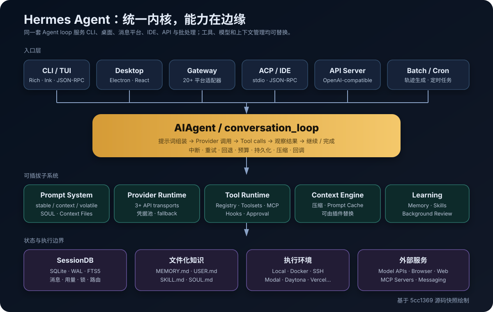
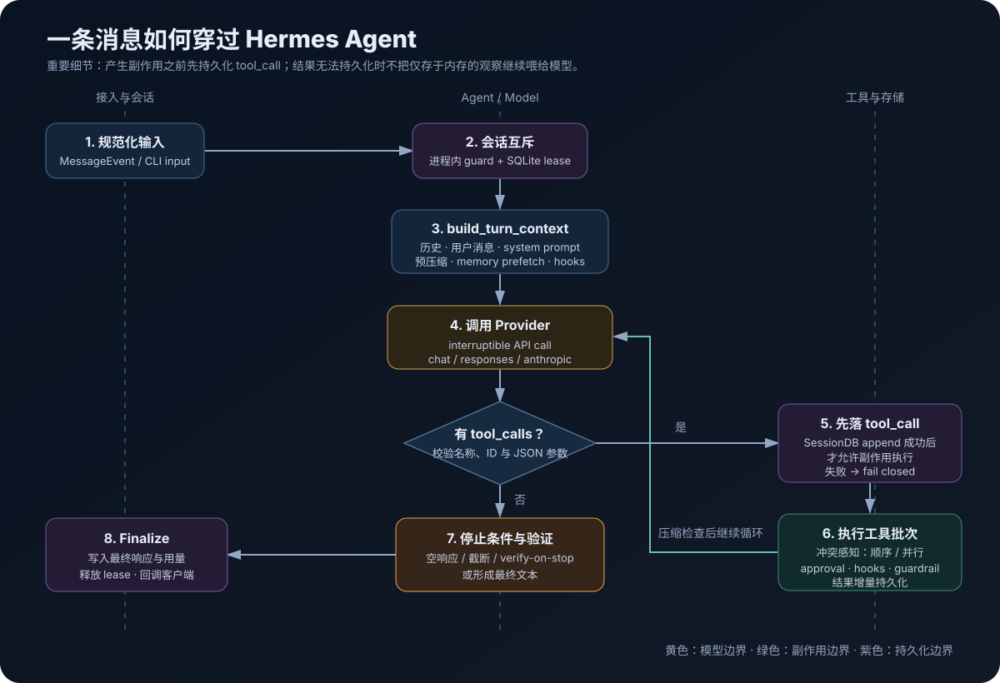
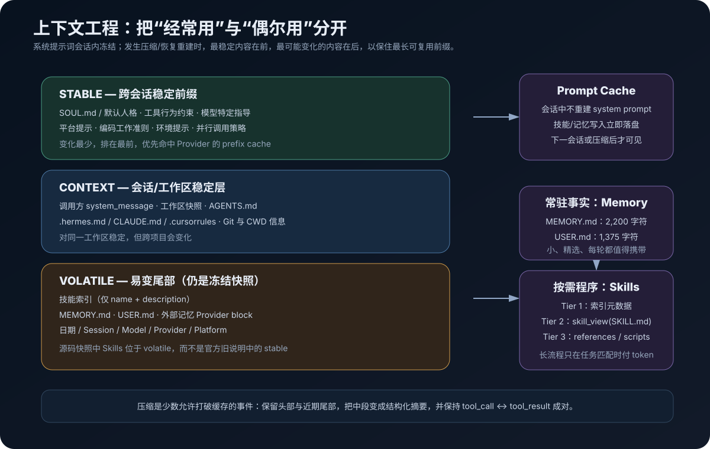
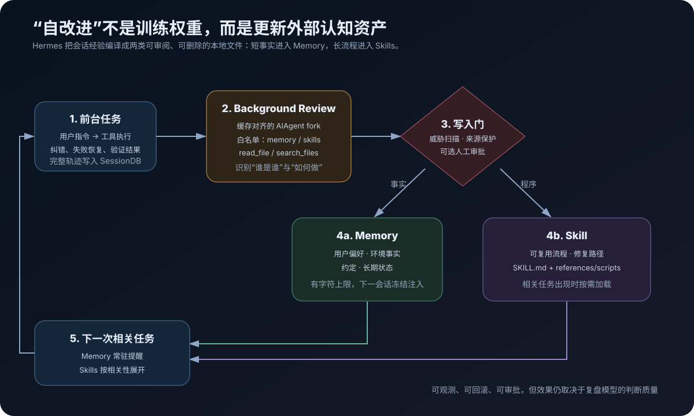

# 拆解 Hermes Agent：一个自改进、可持久化、多入口的大模型 Agent 如何实现

> 站在专业大模型 Agent 工程师的角度，Hermes Agent 最值得研究的并不是“工具很多”，而是它如何同时处理四个难题：**会话越跑越长、能力越接越多、入口越来越杂、经验如何跨会话复用**。



## 调研范围与结论先行

本文基于 Nous Research 的 [Hermes Agent 官方仓库][repo]、[官方架构文档][docs-arch]，以及 `main` 分支在 **2026-08-30** 的源码快照 `5cc1369`（包版本 `0.20.6`）完成。本文阅读并交叉检查了 Agent loop、提示词、工具注册与执行、Provider 路由、SQLite 会话库、记忆、Skills、后台复盘、上下文压缩、Gateway、插件、子 Agent 与代码沙箱等关键路径。没有把需要真实账号和计费 API 的端到端调用冒充为本地验证；运行行为方面以源码、测试设计和官方文档为证据。

我的核心判断是：

1. **Hermes Agent 是 Agent harness，不是某个 Hermes 模型的薄壳。** 模型是可替换的推理内核，Hermes 真正提供的是循环、工具、上下文、持久化、入口适配和安全边界。
2. **它的架构主线是“窄腰”。** CLI、桌面、Gateway、ACP、API、Cron 最终都进入同一个 `AIAgent`；Provider、工具、记忆和上下文引擎在腰部两侧扩展。
3. **它所谓的“自改进”不是在线训练模型权重。** 它把会话经验写成可审阅的 `MEMORY.md`、`USER.md` 与 `SKILL.md`，下一次通过常驻注入或按需检索复用。这更像“Agent 认知资产的持续编译”。
4. **Prompt cache 是一级架构约束。** Hermes 宁可让本轮刚写入的记忆等到下个会话才生效，也不在会话中途修改 system prompt、破坏缓存前缀。
5. **工程成熟度高，复杂度也很高。** 它已经处理并发工具、跨进程会话互斥、压缩竞争、Provider 差异、消息角色修复、审批、提示注入、断点恢复等大量生产问题；代价是核心路径庞大、状态面广、维护门槛高。

---

## 1. Hermes Agent 到底是什么

从产品表面看，Hermes 是一个能在终端、桌面和消息平台里工作的个人 Agent；从代码结构看，它是一套完整的 Agent 操作系统：

- 输入侧：经典 CLI、Ink TUI、Electron Desktop、消息 Gateway、ACP IDE、OpenAI 兼容 API、Batch、Cron；
- 推理侧：OpenAI Chat Completions、Responses/Codex、Anthropic Messages，以及少数特殊 transport；
- 行动侧：文件、终端、浏览器、Web、视觉、MCP、代码执行、子 Agent、计划、记忆与自动化；
- 状态侧：SQLite 会话历史、FTS5 搜索、文件化 Memory/Skills、用量和成本、后台任务；
- 扩展侧：普通插件、模型 Provider 插件、记忆 Provider、上下文引擎、平台适配器。

项目使用 MIT License。当前源码要求 Python `>=3.11,<3.14`，核心依赖包括 OpenAI SDK、Pydantic、Rich、prompt_toolkit、FastAPI/Uvicorn、croniter 等；重型或 Provider 专属依赖尽量放入 optional dependencies 并延迟安装。[`pyproject.toml`][src-pyproject] 还大量使用精确版本或上界约束，体现了项目对供应链风险的现实防御。

一个重要的阅读提醒是：仓库变化极快。当前快照中 `run_agent.py` 约 9.3K 行、真正的 `agent/conversation_loop.py` 约 8.7K 行、`cli.py` 约 22K 行、`gateway/run.py` 约 32K 行、`hermes_state.py` 约 15K 行。它正在持续把 god-file 拆成模块，但尚未完成。

---

## 2. 总体架构：所有入口共用一个 Agent 内核

官方架构图把 `AIAgent` 放在中央，这是准确的。但当前实现比“一个 while 循环”多得多：[`AIAgent`][src-aiagent] 保留公共接口与大量状态，真正的单轮编排已下沉到 [`agent/conversation_loop.py`][src-loop]；`AIAgent.run_conversation()` 自己则负责跨进程会话租约、Relay/观测上下文、任务用量归属与最终清理。[源码][src-run-wrapper]

可以把系统分成五层：

| 层 | 主要职责 | 关键实现 |
|---|---|---|
| 接入层 | 把终端、桌面、消息、IDE、API 事件统一成一次 Agent turn | `cli.py`、`tui_gateway/`、`gateway/`、`acp_adapter/` |
| 编排层 | 循环调用模型、解析工具、控制预算、中断、重试和完成 | `AIAgent`、`conversation_loop.py` |
| 能力层 | Tool Registry、Toolsets、MCP、插件、子 Agent、代码 RPC | `model_tools.py`、`tools/`、`toolsets.py` |
| 认知层 | System prompt、Memory、Skills、Context Engine、压缩 | `agent/system_prompt.py`、`memory_tool.py`、`context_compressor.py` |
| 状态/执行层 | SQLite、终端后端、浏览器、外部 Provider、消息平台 | `hermes_state.py`、`tools/environments/`、Provider 插件 |

“同一个 Agent 内核”带来一个非常实际的好处：工具、记忆、会话、审批与压缩行为不需要在 Telegram、CLI 和 IDE 中分别实现。平台差异通过 callback、adapter 和 platform hint 留在边缘。反过来，核心的任何复杂度也会被所有入口共同承担，所以 Hermes 对核心 tool schema 和 system prompt 的膨胀非常克制。

---

## 3. 一次完整 Turn：远不止 ReAct

教科书式 Agent loop 通常只有：`LLM → tool → observation → LLM`。Hermes 的真实执行路径多了持久化、互斥、恢复和安全语义。



### 3.1 Turn 入口：先拿到这段会话的“写权限”

`AIAgent.run_conversation()` 在进入真正循环前，会尝试对已有 session 获取 SQLite 中的 durable turn lease。租约把 Desktop、CLI resume、Gateway、后台投递等不同进程对同一会话的 `load → run → flush` 串行化；等待期间如果前一个进程做了压缩并切换 session tip，后来的进程会在拿到租约后重新解析并加载最新历史。[源码][src-run-wrapper]

这解决的是 Agent 产品中非常容易被忽视的竞态：两个入口同时看到旧历史，各自调用模型和工具，最后把两条互不知情的分支写回同一会话。Hermes 选择 fail closed：租约超时或刷新丢失时停止本轮，而不是冒险污染 transcript。

### 3.2 Prologue：一次性构造 turn 上下文

[`build_turn_context()`][src-turn-context] 集中处理：

- 清理与持久化用户消息；
- 加载/复用 system prompt；
- 恢复历史和 todo/nudge 状态；
- 预检查上下文压力与压缩；
- 外部记忆 prefetch；
- 插件 `pre_llm_call`；
- 为崩溃恢复提前落盘。

将这些动作集中成 prologue 很重要：如果记忆预取、压缩或消息修复散落在循环的不同分支，Provider 重试和工具 continuation 很容易重复注入内容，造成缓存失效或角色序列错误。

### 3.3 主循环：预算、中断、调用与恢复

核心循环条件可以概括为：

```python
while (
    api_call_count < max_iterations
    and iteration_budget.remaining > 0
) or budget_grace_call:
    check_redirect_and_interrupt()
    maybe_compress()
    response = call_provider_interruptibly()
    if response.tool_calls:
        validate_and_execute()
        continue
    return_finalize_text()
```

实际代码在 [`conversation_loop.py:2074`][src-loop-while]。与普通实现相比，它还处理：

- 用户在模型思考或工具执行中发来的 `/steer` 与硬中断；
- 空响应、截断、非法 JSON、未知工具名和重复 tool-call ID；
- 401 凭据刷新、429/5xx fallback、Provider 特有错误；
- 消息角色交替和 tool-call/result 配对修复；
- 验证停止循环、Kanban worker 完成协议；
- 迭代预算耗尽前的 grace call 与收尾摘要。

### 3.4 工具调用的关键事务语义

Hermes 的一个优秀设计是：**模型返回的 assistant tool-call 记录必须先成功写入 SessionDB，工具副作用才允许发生。** 工具结果也会增量持久化；如果结果无法成为 canonical transcript，就停止本轮，不把只存在于当前进程内存里的结果继续喂给模型。[源码][src-loop-tools]

这不是数据库意义上的完整分布式事务——外部系统副作用仍无法与 SQLite 原子提交——但它显著改善了崩溃后的可解释性：恢复时至少能看到“模型决定调用了什么”，而不是只看到磁盘已经被改了却找不到调用原因。

### 3.5 并行不是“所有工具一起跑”

多 tool-call 会经过分段规划：只读调用和互不冲突的路径操作可以并发，交互式、共享状态或可能冲突的操作保持顺序，结果最终仍按原始 tool-call 顺序插回消息历史。[`agent/tool_executor.py`][src-tool-executor]

这是比简单 `ThreadPoolExecutor.map()` 更可靠的策略，因为 Agent 同一轮常会同时读写文件，错误并行会让后一个 patch 基于旧内容执行。

---

## 4. Prompt 工程：缓存稳定性是一等约束



### 4.1 三层 system prompt

当前源码在 [`agent/system_prompt.py`][src-system-prompt] 中把 prompt 分成：

1. **stable**：SOUL/默认人格、工具行为准则、模型特定指导、平台提示、编码和环境提示；
2. **context**：调用方 system message、工作区快照、`.hermes.md`、`AGENTS.md`、`CLAUDE.md`、`.cursorrules`；
3. **volatile**：Skills 索引、`MEMORY.md`、`USER.md`、外部记忆块、日期与 session/model/provider/platform 信息。

最终按 `stable → context → volatile` 拼接，并在 `AIAgent` 生命周期内缓存。除压缩/恢复等明确边界外，不在会话中途重建。

这里还有一个很有价值的“文档漂移”案例：当前[官方 Prompt Assembly 文档][docs-prompt]仍把 skills 描述为 stable tier 的组成部分，但本次源码快照已经明确把 Skills 索引移动到 volatile 的前端，因为 skills 会在会话过程中被创建或修改；这样重建时只从靠后的索引位置失去最长前缀命中。研究快速演进项目时，应以固定 commit 的源码为准。

### 4.2 为什么刚写入的记忆不能立刻进入 system prompt

`MemoryStore` 同时维护两份视图：

- `_system_prompt_snapshot`：会话开始时从磁盘读取、扫描、冻结；
- `memory_entries/user_entries`：工具看到和写入的 live state。

本轮调用 `memory(add/replace/remove)` 会立刻原子写盘，但不会修改 snapshot；新事实到下一会话或下一次上下文重建才进入提示词。[源码][src-memory]

这是一种明确的成本/新鲜度取舍：牺牲“本轮立即常驻”，换取 system prompt 字节稳定和 Provider prefix cache 的持续命中。本轮模型已经从 memory tool 的结果知道写入成功，因此通常不需要再把同一事实注入 system prompt。

### 4.3 临时信息放在哪里

并非所有动态内容都应该进入 system prompt。Hermes 把预算警告、某些 continuation 提示和临时上下文放在 API-call-time 层，Skills slash command 则生成新的 user message，而不是修改 system prompt。这个原则非常值得复用：

> 稳定身份和长期规则放 system；当前任务证据放消息；一次性恢复提示放临时层。

---

## 5. Tool Runtime：注册、暴露和执行是三件事

Hermes 的工具系统不是一个 `dict[name] = function` 就结束了。它把工具生命周期拆成三个阶段：

### 5.1 注册：模块自描述

每个内置工具模块在顶层调用 `registry.register(...)`，提交：

- name 与 toolset；
- 模型可见 JSON Schema；
- handler；
- 可用性 `check_fn`；
- 环境依赖、async 标志、展示元数据；
- 可选的动态 schema override。

[`discover_builtin_tools()`][src-registry-discovery] 会 AST 扫描 `tools/*.py`，只导入存在顶层 `registry.register()` 的模块，并把“文件 mtime/size → 是否注册工具”的判断缓存在磁盘，避免每次冷启动完整 parse。注册最终形成进程级 `ToolEntry` registry。[注册实现][src-registry-register]

### 5.2 暴露：会话能力，而不是进程能力

工具注册成功，不等于模型一定看得到。`toolsets.py` 定义核心工具与 `web`、`file`、`browser`、`skills`、`delegation`、`memory` 等命名集合；每个入口按平台和配置选择 enabled/disabled toolsets，随后：

1. 递归展开复合 toolset；
2. 应用 disabled subtraction；
3. 调用 Registry 的 `check_fn` 过滤不可用工具；
4. 基于本会话真实可用工具重写动态 schema；
5. 做跨 Provider JSON Schema 兼容清洗；
6. 必要时把大量 MCP/plugin 工具折叠为 Tool Search 桥。

核心列表见 [`_HERMES_CORE_TOOLS`][src-toolsets]，选择逻辑见 [`_compute_tool_definitions()`][src-tool-defs]。

这里的工程原则是：**能力属于 session，不属于全局环境变量。** 同一 Gateway 进程可以同时服务工具权限不同的会话；若用进程级 env 判断 GUI、浏览器或项目工具是否存在，就会把一个用户的能力错误泄漏给另一个 session。

### 5.3 渐进披露：Tool Search

工具 schema 本身也消耗上下文。当 MCP 和插件工具的 schema 超过配置阈值（默认按上下文窗口占比判断）时，Hermes 不把所有非核心 schema 直接发给模型，而是暴露 `tool_search / tool_describe / tool_call` 三个桥接工具。核心 Hermes 工具永不被延迟；桥接执行时还会再次检查本 session 的 toolset，避免 restricted subagent 越权调用全局 registry。[源码][src-tool-defs]

这相当于把“平铺工具目录”改造成两阶段检索：先找能力，再加载 schema，再调用。它和 Skills 的渐进披露是同一种上下文经济学。

### 5.4 Dispatch：在 handler 外再包一圈治理

[`handle_function_call()`][src-dispatch] 和 Tool Registry dispatch 共同处理：

- 参数类型纠正与 schema 校验；
- Tool Search 解包与 session 级二次授权；
- pre/post tool hooks 与 middleware；
- 危险操作审批、编辑审批和 guardrail；
- agent-level 特殊工具路由；
- sync/async handler 桥接；
- 错误截断、敏感信息清洗、结果类型规范化。

普通 handler 应返回 JSON string；唯一结构化例外是受支持的 multimodal envelope。把结果契约封在 dispatch 边界，可以避免某个插件返回任意 Python 对象，破坏持久化、预算统计或后续消息序列。

### 5.5 扩展工具的推荐方式

对用户或业务专属能力，Hermes 明确推荐插件，而不是直接改 core：

```python
def handle_weather(args, **kwargs):
    city = args.get("city", "")
    return '{"success": true, "city": "%s"}' % city

def register(ctx):
    ctx.register_tool(
        name="company_weather",
        toolset="company",
        schema={
            "name": "company_weather",
            "description": "Query the internal weather service.",
            "parameters": {
                "type": "object",
                "properties": {"city": {"type": "string"}},
                "required": ["city"],
            },
        },
        handler=handle_weather,
    )
```

插件 `PluginContext` 还可注册 hooks 和 CLI command。若要覆盖内置工具，代码需要 `override=True`，operator 还必须在配置中显式允许该插件覆盖，防止插件悄悄替换 `write_file` 等高权限工具。[源码][src-plugins]

---

## 6. 终端、代码执行与子 Agent

### 6.1 统一执行环境 ABC

终端工具通过 `BaseEnvironment` 抽象统一 local、Docker、SSH、Singularity、Modal、Daytona 与 Vercel Sandbox 等后端。[环境接口][src-env-base] 同一个 `terminal` tool schema 因此可以在本机 shell、容器和云沙箱之间切换，task_id 用于隔离工作目录、进程和远端资源。

这也解释了为什么“安全”不能只看 tool name：`terminal` 在 local backend 上就是宿主机权限，在 Docker/Vercel backend 上才有更强的边界。

### 6.2 `execute_code`：用一次模型调用完成工具流水线

`execute_code` 让模型写 Python，但脚本不是直接 import 全部 Hermes 内部对象：父进程生成一个 `hermes_tools.py` stub，并建立 RPC 通道；子 Python 只通过 RPC 调用白名单工具。POSIX 本地使用 Unix domain socket，Windows 当前代码走带 token 的 loopback TCP，远端后端使用文件式 RPC 轮询。[源码][src-execute-code]

它解决的是 Agent 的“上下文往返税”：

```text
普通方式：LLM → web_search → LLM → read_file → LLM → terminal → LLM
execute_code：LLM → Python 脚本（内部 RPC 多次调工具）→ LLM
```

父进程仍负责真实工具 dispatch，因此审批、白名单、hooks 与日志不会因为脚本化编排而消失。子进程环境也会清除大部分敏感环境变量，stdout 经过截断、落盘和 secret redaction。

### 6.3 Delegation：隔离上下文，而不是复制整段对话

`delegate_task` 为每个子任务构造独立 `AIAgent`、task_id、终端 session 与压缩器，只把 goal、必要 context 和受限 toolsets 交给子 Agent；批量任务通过线程池并行，默认并发上限由 `delegation.max_concurrent_children` 控制。[源码][src-delegate]

叶子 Agent 默认拿不到 clarify、memory、cron 等面向主会话的能力；嵌套 delegation 由最大 spawn depth 与 orchestrator 配置控制。子 Agent 最终把摘要而不是完整轨迹交回父上下文，必要时超长摘要会落文件。这是合理的 context isolation，但并不降低总 token 成本——只是避免父模型每一步都携带所有子任务细节。

---

## 7. Provider 路由：统一内部消息，适配不同外部协议

Hermes 的 Provider runtime resolver 被 CLI、Gateway、Cron、ACP 与辅助模型任务共享。[官方说明][docs-provider]

核心输出是：

```text
(requested provider, model, config, env, credentials)
                         ↓
{ provider, api_mode, base_url, api_key, source, refresh metadata }
```

当前主要 transport 包括：

- `chat_completions`：OpenAI-compatible；
- `codex_responses`：OpenAI Responses/Codex；
- `anthropic_messages`：Anthropic 原生 Messages；
- 以及 Bedrock、Codex app-server 等特殊路径。

三类主要 transport 最终都投影到内部的 OpenAI 风格消息：`role/content/tool_calls/tool_call_id`。这样工具执行器、SessionDB、Gateway 和压缩器不用理解每个 Provider 的原生结构；adapter 负责 reasoning、stream、tool use 与 cache marker 的来回转换。[Agent loop 文档][docs-loop]

[`resolve_runtime_provider()`][src-runtime-provider] 的难点不在列出 Provider，而在凭据边界和优先级：保存的 config 应优先于旧 shell export；OpenRouter/OpenAI/AI Gateway 的 key 不能被误发给任意自定义 URL；OAuth token 需要刷新；同一 Provider 不同模型可能走不同 API mode；fallback 切换后 system message 与 tool-call 格式仍要同步。

Provider 以 `plugins/model-providers/<name>/` 注册 profile，用户目录下的同名插件可覆盖 bundled profile。这个做法让“支持新 Provider”多数时候变成数据和小型适配，而不是继续向 Agent loop 塞分支。

---

## 8. Memory、Skills 与自改进闭环



### 8.1 Memory：短、精选、每轮值得携带

内置记忆由两个文件组成：

| 文件 | 用途 | 默认字符上限 |
|---|---|---:|
| `MEMORY.md` | 环境事实、项目约定、工具经验、长期状态 | 2,200 |
| `USER.md` | 用户偏好、沟通风格、身份和期待 | 1,375 |

字符限制而非 token 限制，让行为不依赖 tokenizer。达到上限时不会静默删除，而是把当前条目和使用量返回给模型，要求在本轮合并或删除后重试；连续失败超过阈值则停止 memory side effect，不能因为“记忆整理失败”阻塞对用户的最终回复。[实现][src-memory] [官方说明][docs-memory]

写入前会做 threat-pattern 扫描；从磁盘加载时也再次扫描，命中可疑提示注入的条目不会进入 frozen snapshot，但原内容仍保留在 live state，便于用户检查和删除。文件写入使用锁与原子替换，还检测无法 round-trip 的外部修改，避免工具基于旧视图覆盖手工编辑。

### 8.2 Skills：长流程按需加载

Skill 是包含 YAML frontmatter 的目录化知识包：

```text
skills/<category>/<name>/
├── SKILL.md
├── references/
├── scripts/
└── templates/
```

渐进披露分三层：

1. `skills_list`/系统索引只提供 name + description；
2. `skill_view(name)` 加载完整 `SKILL.md`；
3. 真正需要时再读 references、scripts、templates。

`skill_manage` 可以 create、patch、rewrite、write/remove support file；但后台 autonomous reviewer 对 bundled、Hub-installed、external、pinned 和 user-owned skills 有保护，已有文件还要求 read-before-write。[实现][src-skills] [官方说明][docs-skills]

这一区分非常关键：

- Memory 回答“这个用户和环境有什么长期事实？”
- Skill 回答“这类任务应该怎样做？”

如果把长流程塞进 Memory，每次请求都付 token；如果把用户偏好只塞进一个偶尔加载的 Skill，Agent 又会经常忘记。

### 8.3 Background Review：后台复盘如何工作

前台 turn 结束后，Hermes 可以启动一个 cache-parity review fork。它复用父 Agent 的 session identity 与缓存前缀，但限制迭代数和工具白名单；默认只允许 memory、skills、read_file、search_files 以及显式配置的额外工具，禁止终端和任意写文件，技能修改必须走 `skill_manage` 验证路径。[源码][src-background-review]

复盘 prompt 会寻找：

- 用户对风格、格式或工作流的纠正；
- 成功的非平凡技术路径；
- 从失败/死路中找到的可靠修复；
- 已加载 Skill 的缺失或过时内容。

它也明确禁止把“某次环境没装工具”“某个短暂 API 报错”“尚未解决的失败猜测”固化成长期规则。这是非常必要的负面约束，否则自改进系统很容易把偶发故障编译成永久性自我限制。

写入可通过 `memory.write_approval` 等开关进入人工审批队列；Curator 还会跟踪 agent-created skill 的使用次数、活跃度、pin 与 archive 状态，只归档、不自动删除。

### 8.4 对“自改进”的准确评价

优点：它本地化、透明、可 diff、可审批、可恢复，不需要训练基础模型，也不会把私人经验上传为共享权重。

局限：复盘质量仍由 LLM 判断决定。错误归纳、过拟合单次偏好、技能重叠和知识过期不会因为换成 Markdown 就自动消失。因此这更接近**可治理的外部记忆学习**，而不是算法意义上的模型能力提升。

---

## 9. Context Engine 与长会话压缩

Hermes 把上下文管理抽象成 `ContextEngine`，默认实现是有损 `ContextCompressor`，也允许插件提供替代引擎。[官方压缩文档][docs-compression]

默认压缩流程可概括为：

1. 先清理保护区外的旧长 tool result，零 LLM 成本；
2. 保留 system/head 与近期 tail，边界对齐完整 tool-call/result 组；
3. 用辅助模型把中段压成结构化摘要；
4. 重新组装消息并清理孤儿 tool pair；
5. 后续压缩在上一版摘要上迭代，而不是每次从零开始。

新版本默认 `compression.in_place: true`：同一 session id 上把旧消息标为 `active=0, compacted=1`，而不是一定创建 parent/child session 链；旧内容仍可由 `session_search` 找回。legacy rotating path 仍然存在。

压缩的工程难点不只是总结质量：

- 摘要模型的上下文必须装得下需要压缩的中段；
- tool_call 与 tool_result 不能被切开；
- 多进程不能同时压缩同一会话；
- 压缩后必须验证真实请求压力确实下降，避免每轮反复压缩；
- Provider 返回的 prompt token 优先于粗略估算；
- 某些 Responses/Codex route 有原生 server-side compaction，不能只改本地镜像。

Hermes 为此维护 compression lock、失败 cooldown、ineffective count、fallback streak 和 post-compression 验证。这部分代码复杂，但反映了长跑 Agent 的真实问题：上下文压缩不是一个 `summarize(messages)` 函数，而是一套带一致性和恢复语义的状态迁移。

---

## 10. SessionDB：对话是可查询的事件日志

Hermes 使用 profile-scoped `state.db`，而不是每会话 JSONL。[`SessionDB`][src-session-db] 采用 SQLite WAL，存储：

- sessions：来源、模型、system prompt、状态、标题、用量、成本、工作区、路由和压缩信息；
- messages：role、content、tool calls、reasoning、Provider sidecar、display metadata、active/compacted；
- session_model_usage：按模型/任务归因；
- FTS5、trigram 与可选 CJK 索引；
- gateway routing、compression locks、session turn leases、async delegations 等。

官方 [Session Storage 文档][docs-session] 展示了 schema 和 FTS5 搜索。值得注意的实现选择有：

- `api_content` 保存实际发给 Provider 的字节等价内容，和 UI 展示 content 分离，支持缓存稳定重放；
- tool calls、reasoning details 和 Codex items 都保留，不把轨迹压扁成纯文本；
- 写入使用 `BEGIN IMMEDIATE`、应用级抖动重试和周期 WAL checkpoint；
- session search 可以跨已压缩消息找回历史证据；
- 进程级与 SQLite 级 lease 共同避免一段会话同时运行两次。

这让 Hermes 的“记忆”实际上有三层：

1. 当前消息上下文：短期工作记忆；
2. SQLite + FTS5：完整情景记忆，可按需检索；
3. MEMORY/USER + Skills：精选语义事实与程序记忆。

它不是经典“向量数据库 RAG”架构：核心跨会话搜索首先利用结构化 transcript 与全文索引，外部 Memory Provider 才可能引入额外的语义检索系统。

---

## 11. Gateway、Cron 与多入口连续性

Gateway 是长期运行的消息路由器，而不是另一套 Agent。[`GatewayRunner`][src-gateway] 接收平台 adapter 规范化后的 `MessageEvent`，完成授权、session key 路由、slash command、运行中 Agent 控制和最终投递。[官方 Gateway 文档][docs-gateway]

消息处理有两层 guard：

1. Base adapter 在 session active 时合并/排队新消息并触发 interrupt；
2. Gateway runner 再拦截 `/stop`、`/new`、`/approve`、`/deny` 等控制命令。

这能让用户在 Telegram 中途纠正正在执行的任务，也避免同一 chat 同时启动两个 Agent。授权采用平台 allowlist、DM pairing、全局策略等多层检查，默认拒绝未授权用户。

Cron 创建的是新的 Agent task，而不只是 shell command：任务可以携带 Skills、Provider/model override、前置采集脚本、workdir 和投递目标。长期会话、后台 terminal process、异步 delegation 与 cron 的区别是持久性：需要跨进程重启保证的工作应交给 Cron 或可恢复的后台执行，而不是只依赖进程内 future。

Profiles 则通过在导入核心模块前设置 `HERMES_HOME`，隔离每个 Agent 的 config、密钥、sessions、memory、skills、gateway PID 和日志。它既是多租户边界，也是避免多个 Agent 互相污染学习资产的基础。

---

## 12. 安全模型：防御纵深，但不是自动“安全”

Hermes 的[官方安全文档][docs-security]列出了多层边界，源码中可以归纳为：

- **谁能发消息**：平台 allowlist、DM pairing、profile 隔离；
- **模型能执行什么**：session toolsets、子 Agent 限权、Tool Search 二次授权；
- **高风险命令是否执行**：危险模式分类与 human approval；
- **文件能写哪里**：敏感路径硬拒绝、可选 safe root、变更验证；
- **网络能访问哪里**：website blocklist 与 SSRF 地址检查；
- **外部服务能看到哪些凭据**：MCP/execute_code 子进程环境过滤；
- **进入 prompt 的内容是否可信**：Context/Memory/Skill threat scan；
- **插件能否接管内置工具**：override 需要插件声明和 operator opt-in；
- **审计与恢复**：SessionDB 轨迹、checkpoint、rollback、日志和审批记录。

但部署者仍要理解三个现实：

1. local terminal backend 以 Hermes 进程用户的权限执行命令，审批不是 OS 沙箱；
2. Python 插件在 Agent 进程内运行，本质上是受信代码，manifest 不是容器边界；
3. 提示注入扫描是启发式防线，不可能证明第三方网页、Skill 或 MCP 输出安全。

因此，处理生产凭据或不可信输入时，应优先使用容器/云沙箱、最小 toolset、出站网络策略和 memory write approval，而不是只依赖模型“遵守提示词”。

---

## 13. 工程评价：哪些设计值得学，哪些要谨慎复制

### 值得学习

**1. System prompt 的缓存稳定性成为架构约束。** 许多 Agent 项目先拼功能，最后才发现每轮动态重建 system prompt 让缓存和成本失控。Hermes 从层次、顺序、冻结快照到 slash skill 的 user-message 注入都围绕这一点设计。

**2. 注册、暴露、dispatch 三层分离。** 这让 session 权限、可用性探测、动态 schema、MCP 和插件可以独立演进。

**3. Memory 与 Skills 分工清楚。** 小事实常驻、长流程按需，外加完整 session search，避免所有知识都挤进向量库或 system prompt。

**4. 工具副作用前持久化。** 虽不是真正分布式事务，但为恢复和审计提供了最小可靠因果链。

**5. Provider 协议在边界适配。** 内部消息格式统一，Agent loop 不直接绑定 OpenAI 或 Anthropic。

**6. “核心窄、边缘宽”的扩展政策。** 新平台、新 Provider、新 UI 可以快速增长；新 core tool 必须证明几乎所有用户都需要。

### 需要谨慎

**1. 核心复杂度已经很高。** 大量恢复分支、全局缓存、ContextVar、线程池和跨进程锁相互作用，局部修改的回归面很大。要复用理念，不必照搬全部规模。

**2. 同步核心 + 线程桥接有成本。** 它兼容大量同步 SDK，也便于 CLI，但 cancellation、async handler、后台 review、Gateway event loop 之间需要很多适配代码。

**3. 进程级状态是锋利边缘。** 例如工具解析结果和某些 registry/cache 是 process-global，必须额外用 session scope、ContextVar 和保存/恢复避免子 Agent 或多 profile 串扰。

**4. 自改进容易产生“知识债”。** 即使有 Curator 和保护规则，错误 Skill 仍可能在未来重复放大。生产环境需要审批、质量指标和定期清理。

**5. 文档会落后于 main。** 本文发现的 Skills tier 差异就是例子。实现评审必须固定 commit，而不能只读产品页。

---

## 14. 如果要自己实现一个 Hermes-like Agent

不建议一开始复制 Hermes 的所有功能。更稳妥的演进顺序是：

### Phase 1：最小可恢复循环

- 一个内部消息格式；
- 一个 Provider adapter；
- Tool Registry + JSON Schema；
- 每个 assistant tool-call 和 tool result 增量持久化；
- 明确的 iteration budget、interrupt 与最终状态。

### Phase 2：上下文成本治理

- system prompt 分为 stable/context/volatile；
- system prompt 会话内冻结；
- tool schema 按 session 权限裁剪；
- 压缩保留 tool-call/result 配对；
- 历史检索能访问压缩前消息。

### Phase 3：跨会话学习

- 小型、有限额、可审批的 Memory；
- `skills_list → skill_view` 渐进披露；
- 背景 review 只能使用严格白名单；
- 记录每次知识变更的 provenance 与效果。

### Phase 4：多入口与插件

- 平台只做事件适配，不复制 Agent loop；
- session key 和用户授权在 Gateway 中统一；
- 插件工具默认 session-scoped；
- 第三方进程凭据默认不透传；
- 为 Provider、Memory、Context Engine 分别定义小而稳定的接口。

这条路线的本质是：先保证**因果链可恢复**，再追求**能力丰富**，最后才做**自我改写**。

---

## 15. 快速上手与源码阅读顺序

官方安装方式：

```bash
curl -fsSL https://hermes-agent.nousresearch.com/install.sh | bash
source ~/.bashrc
hermes setup --portal   # 或配置自己的 Provider
hermes
```

如果目的是学习实现，建议按以下顺序阅读：

1. [`agent/conversation_loop.py`][src-loop]：先看 turn 的真实控制流；
2. [`agent/turn_context.py`][src-turn-context]：理解 prologue；
3. [`agent/system_prompt.py`][src-system-prompt]：理解缓存不变量；
4. [`model_tools.py`][src-tool-defs] + [`tools/registry.py`][src-registry-register]：理解能力如何进入模型；
5. [`agent/tool_executor.py`][src-tool-executor]：理解副作用与并行；
6. [`hermes_state.py`][src-session-db]：理解恢复、搜索和并发；
7. [`tools/memory_tool.py`][src-memory]、[`tools/skills_tool.py`][src-skills]、[`agent/background_review.py`][src-background-review]：理解自改进；
8. [`gateway/run.py`][src-gateway]：最后再看多平台和长期运行。

---

## 结语

Hermes Agent 证明了一件事：一个真正能长期运行的 Agent，难点很快会从“模型会不会调用工具”转移到“上下文、权限、状态、并发、成本和经验如何被治理”。

它最成熟的地方，不是堆出了几十种工具，而是逐渐形成了几条一致的工程原则：

- 一个统一内核，平台能力留在边缘；
- system prompt 稳定，动态信息进入消息或易变尾部；
- 小事实常驻、长流程按需、完整历史可检索；
- 工具调用先形成可审计记录，再发生副作用；
- 扩展默认走插件/MCP，不让 core schema 无限制增长；
- 自改进必须可观察、可拒绝、可撤销。

如果你正在构建 Coding Agent、个人助理或多平台自动化 Agent，Hermes 最值得借鉴的不是某一个类或工具，而是这套对**长期运行成本和状态一致性**的敬畏。

---

## 参考资料

- [Hermes Agent GitHub 仓库][repo]
- [官方 Architecture][docs-arch]
- [官方 Agent Loop Internals][docs-loop]
- [官方 Prompt Assembly][docs-prompt]
- [官方 Tools Runtime][docs-tools]
- [官方 Context Compression and Caching][docs-compression]
- [官方 Session Storage][docs-session]
- [官方 Provider Runtime Resolution][docs-provider]
- [官方 Gateway Internals][docs-gateway]
- [官方 Persistent Memory][docs-memory]
- [官方 Skills System][docs-skills]
- [官方 Security][docs-security]

[repo]: https://github.com/NousResearch/hermes-agent
[docs-arch]: https://hermes-agent.nousresearch.com/docs/developer-guide/architecture
[docs-loop]: https://hermes-agent.nousresearch.com/docs/developer-guide/agent-loop
[docs-prompt]: https://hermes-agent.nousresearch.com/docs/developer-guide/prompt-assembly
[docs-tools]: https://hermes-agent.nousresearch.com/docs/developer-guide/tools-runtime
[docs-compression]: https://hermes-agent.nousresearch.com/docs/developer-guide/context-compression-and-caching
[docs-session]: https://hermes-agent.nousresearch.com/docs/developer-guide/session-storage
[docs-provider]: https://hermes-agent.nousresearch.com/docs/developer-guide/provider-runtime
[docs-gateway]: https://hermes-agent.nousresearch.com/docs/developer-guide/gateway-internals
[docs-memory]: https://hermes-agent.nousresearch.com/docs/user-guide/features/memory
[docs-skills]: https://hermes-agent.nousresearch.com/docs/user-guide/features/skills
[docs-security]: https://hermes-agent.nousresearch.com/docs/user-guide/security

[src-pyproject]: https://github.com/NousResearch/hermes-agent/blob/5cc1369fa298021f8c740de154ff8c37c30bdcc8/pyproject.toml
[src-aiagent]: https://github.com/NousResearch/hermes-agent/blob/5cc1369fa298021f8c740de154ff8c37c30bdcc8/run_agent.py#L422
[src-run-wrapper]: https://github.com/NousResearch/hermes-agent/blob/5cc1369fa298021f8c740de154ff8c37c30bdcc8/run_agent.py#L8633
[src-loop]: https://github.com/NousResearch/hermes-agent/blob/5cc1369fa298021f8c740de154ff8c37c30bdcc8/agent/conversation_loop.py#L1879
[src-loop-while]: https://github.com/NousResearch/hermes-agent/blob/5cc1369fa298021f8c740de154ff8c37c30bdcc8/agent/conversation_loop.py#L2074
[src-loop-tools]: https://github.com/NousResearch/hermes-agent/blob/5cc1369fa298021f8c740de154ff8c37c30bdcc8/agent/conversation_loop.py#L7182
[src-turn-context]: https://github.com/NousResearch/hermes-agent/blob/5cc1369fa298021f8c740de154ff8c37c30bdcc8/agent/turn_context.py
[src-tool-executor]: https://github.com/NousResearch/hermes-agent/blob/5cc1369fa298021f8c740de154ff8c37c30bdcc8/agent/tool_executor.py
[src-system-prompt]: https://github.com/NousResearch/hermes-agent/blob/5cc1369fa298021f8c740de154ff8c37c30bdcc8/agent/system_prompt.py#L435
[src-registry-discovery]: https://github.com/NousResearch/hermes-agent/blob/5cc1369fa298021f8c740de154ff8c37c30bdcc8/tools/registry.py#L111
[src-registry-register]: https://github.com/NousResearch/hermes-agent/blob/5cc1369fa298021f8c740de154ff8c37c30bdcc8/tools/registry.py#L763
[src-toolsets]: https://github.com/NousResearch/hermes-agent/blob/5cc1369fa298021f8c740de154ff8c37c30bdcc8/toolsets.py#L31
[src-tool-defs]: https://github.com/NousResearch/hermes-agent/blob/5cc1369fa298021f8c740de154ff8c37c30bdcc8/model_tools.py#L424
[src-dispatch]: https://github.com/NousResearch/hermes-agent/blob/5cc1369fa298021f8c740de154ff8c37c30bdcc8/model_tools.py#L1240
[src-plugins]: https://github.com/NousResearch/hermes-agent/blob/5cc1369fa298021f8c740de154ff8c37c30bdcc8/hermes_cli/plugins.py#L1458
[src-env-base]: https://github.com/NousResearch/hermes-agent/blob/5cc1369fa298021f8c740de154ff8c37c30bdcc8/tools/environments/base.py#L650
[src-execute-code]: https://github.com/NousResearch/hermes-agent/blob/5cc1369fa298021f8c740de154ff8c37c30bdcc8/tools/code_execution_tool.py
[src-delegate]: https://github.com/NousResearch/hermes-agent/blob/5cc1369fa298021f8c740de154ff8c37c30bdcc8/tools/delegate_tool.py#L3669
[src-runtime-provider]: https://github.com/NousResearch/hermes-agent/blob/5cc1369fa298021f8c740de154ff8c37c30bdcc8/hermes_cli/runtime_provider.py#L1876
[src-memory]: https://github.com/NousResearch/hermes-agent/blob/5cc1369fa298021f8c740de154ff8c37c30bdcc8/tools/memory_tool.py#L154
[src-skills]: https://github.com/NousResearch/hermes-agent/blob/5cc1369fa298021f8c740de154ff8c37c30bdcc8/tools/skills_tool.py#L818
[src-background-review]: https://github.com/NousResearch/hermes-agent/blob/5cc1369fa298021f8c740de154ff8c37c30bdcc8/agent/background_review.py
[src-session-db]: https://github.com/NousResearch/hermes-agent/blob/5cc1369fa298021f8c740de154ff8c37c30bdcc8/hermes_state.py#L4385
[src-gateway]: https://github.com/NousResearch/hermes-agent/blob/5cc1369fa298021f8c740de154ff8c37c30bdcc8/gateway/run.py#L7002
