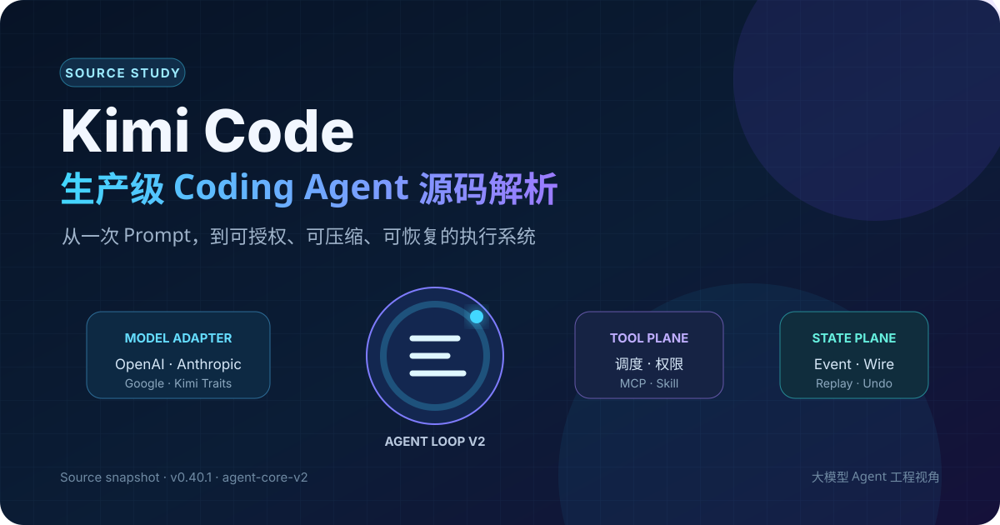
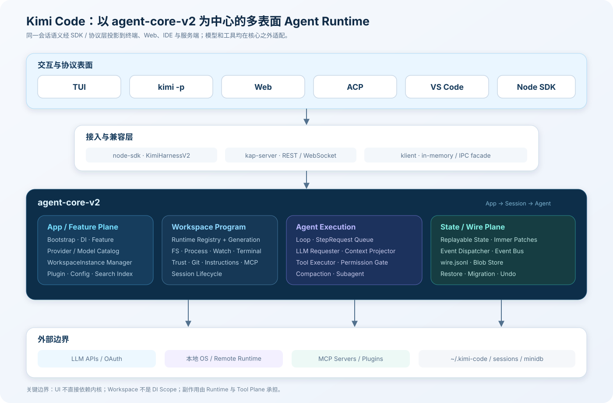
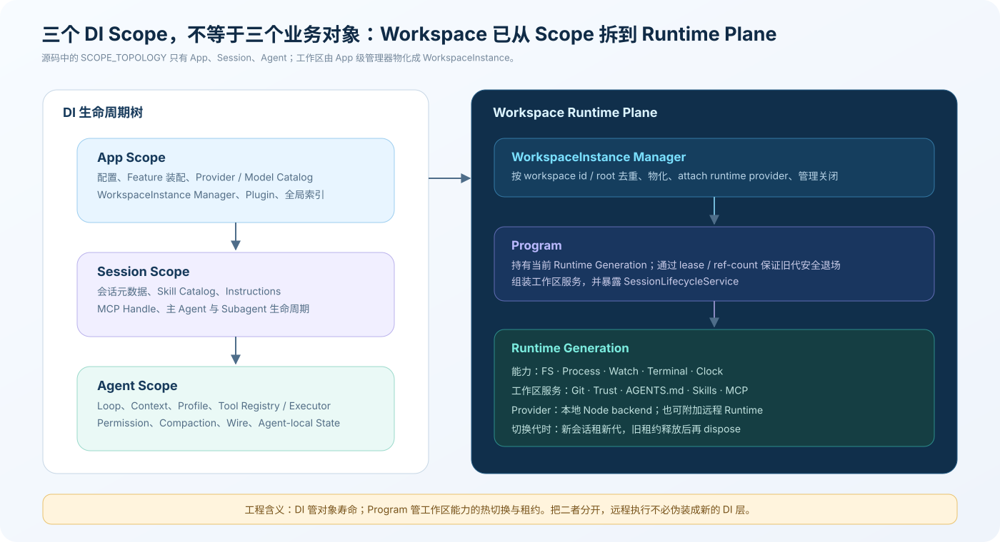
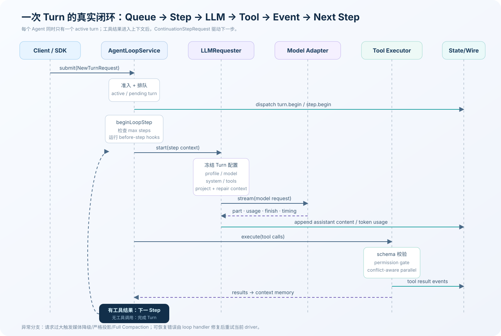
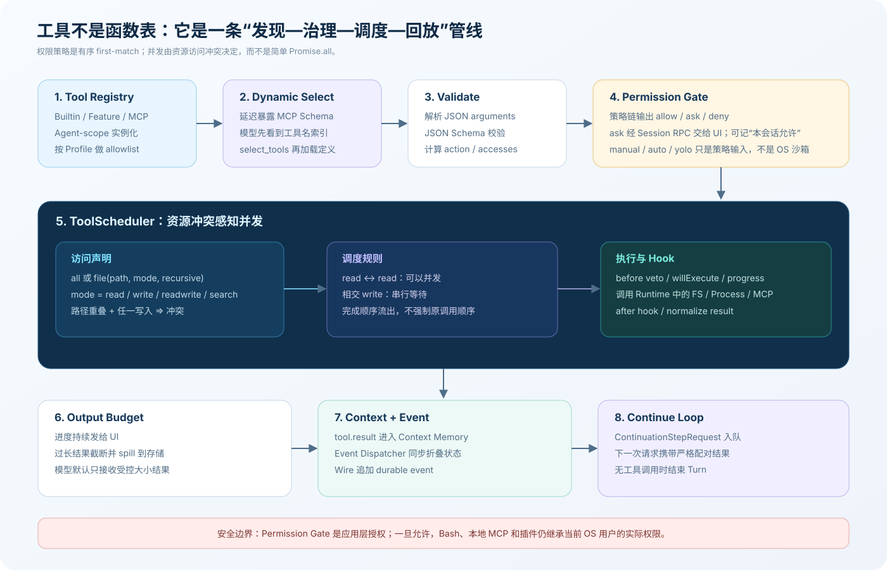
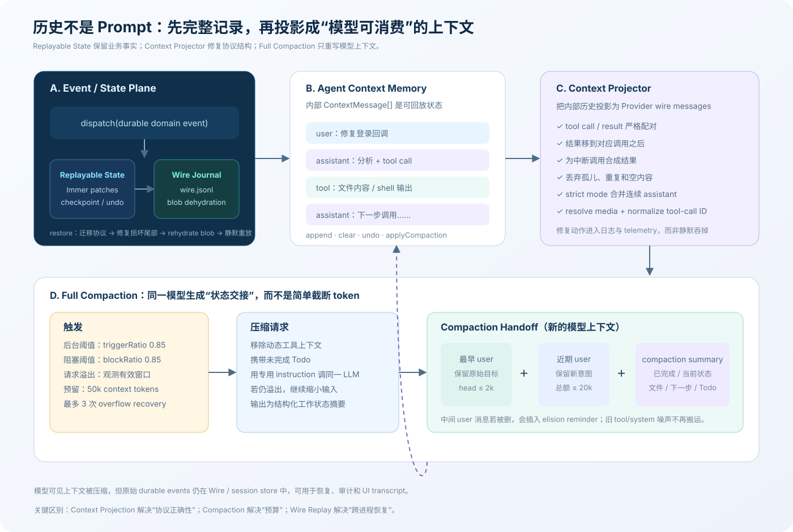
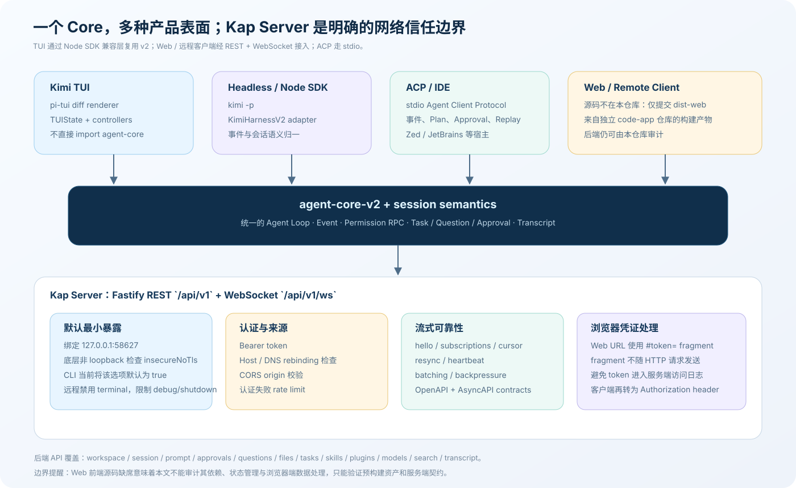

# 从一次 Prompt 到可恢复执行：Kimi Code 生产级 Agent 源码解析



> 本文从大模型 Agent 工程视角阅读 [MoonshotAI/kimi-code](https://github.com/MoonshotAI/kimi-code)，重点回答一个问题：Kimi Code 如何把不可靠、流式、可能产生副作用的模型输出，变成可调度、可授权、可压缩、可恢复并能被多种客户端复用的本地 Agent Runtime。

## 调研基线与结论边界

| 项目 | 本文基线 |
| --- | --- |
| 仓库 | [`MoonshotAI/kimi-code`](https://github.com/MoonshotAI/kimi-code) |
| 分支 / Commit | `main` / [`0faa878f282b`](https://github.com/MoonshotAI/kimi-code/commit/0faa878f282bdcb2b8f77251f944bfc393ff4ad6) |
| Commit 时间 | 2026-09-02 21:57:23 +08:00 |
| CLI 版本 | `@moonshot-ai/kimi-code@0.40.1` |
| 当前内核 | `@moonshot-ai/agent-core-v2@0.4.3`，交互 TUI 与 `kimi -p` 默认启用 |
| 工程栈 | TypeScript / ESM / pnpm workspace；源码仓库要求 Node.js `>=24.15.0` |
| 许可证 | MIT |
| 规模感知 | 22 个 app/package manifest；约 2,425 个 `src` TS/TSX 文件、42.4 万行，另有约 1,300 个测试路径下的 TS/TSX 文件 |
| 方法 | 固定 Commit 的静态调用链追踪、实现与测试交叉验证、官方 README/文档对照 |

规模数字按文件系统扫描统计，包含协议、SDK、服务端、构建脚本与部分生成代码，只表示工程量级，不等同于“有效核心代码行数”。发布的 CLI 包声明 Node.js `>=22.19.0`，而 monorepo 根开发环境要求 `>=24.15.0`；本文讨论源码开发时以后者为准。

有两个边界需要先说明：

- 本文以代码为事实源。仓库根部的 Agent 指引仍写着 `App → Workspace → Session → Agent` 四级生命周期，但当前 [`scopes.ts`](https://github.com/MoonshotAI/kimi-code/blob/0faa878f282bdcb2b8f77251f944bfc393ff4ad6/packages/agent-core-v2/src/app/scopes.ts) 已只有 `App → Session → Agent`；Workspace 被实现为 `WorkspaceInstance + Program + Runtime Generation`，后文会解释这次演进。
- Web 前端源码已迁到独立的 `code-app` 仓库；本仓库只提交同步后的 `dist-web` 构建产物。因此本文可以审计 Web 后端、协议和预构建资产装载，不能据此完整评价浏览器端实现。

## 结论先行

Kimi Code 不是“给模型一组函数，再写一个 `while (toolCalls)`”这么简单。它更像一套本地 Agent 操作系统，最有价值的是下面八个结构选择。

1. **当前主路径已经是 v2，不是实验旁路。** TUI 和 `kimi -p` 默认使用 `agent-core-v2`，只有显式设置 `KIMI_CODE_LEGACY_FLAG` 才回到旧内核；`kimi web` 始终启动 v2 的 Kap Server。
2. **生命周期与执行位置被拆开。** DI 只有 App、Session、Agent 三层；工作区能力由带代际与租约的 `Program` 管理，因此本地 FS/Process 和未来远程 Runtime 不必伪装成 DI Scope。
3. **Agent Loop 是事件化状态机。** 一个 Turn 由多个 Step 构成；StepRequest 有明确准入语义，模型流、工具执行、错误恢复和下一步排队各自独立。
4. **模型兼容发生在协议适配层。** OpenAI Chat Completions、OpenAI Responses、Anthropic、Google GenAI 是基础协议；Kimi 通过 provider trait 注入 thinking、prompt cache、schema 规范化和媒体上传差异，而不是污染主循环。
5. **工具系统本质上是治理平面。** Registry 管发现，Profile 管可见性，JSON Schema 管输入，Permission Gate 管授权，资源访问声明管并发，Hook 管扩展，输出预算管上下文成本。
6. **完整历史与模型上下文是两份不同视图。** durable event 写入 `wire.jsonl`；Context Projector 修复 wire message；Full Compaction 重写模型可见上下文，但不会把原始可回放事实一并抹掉。
7. **Subagent 是同一内核的递归复用。** 每个子 Agent 有独立 Agent Scope、Context、Loop 和工具集；父 Agent 只得到最终交接，可前台等待、后台运行或恢复已有 agent id。
8. **多端复用依靠兼容边界。** TUI 不直接依赖 core，而是消费 Node SDK 的 `KimiHarness`；v2 adapter 把新内核事件映射回稳定接口，使迁移不必重写整个 UI。



## 一、先建立正确心智模型：一个 Runtime，多个产品表面

从目录看，Kimi Code 是一个 pnpm monorepo；从运行时看，它由“交互表面—接入协议—工作区 Runtime—Agent Core—外部边界”组成。

| 层 | 关键目录 / 包 | 主要职责 |
| --- | --- | --- |
| CLI 与终端 UI | `apps/kimi-code`、`packages/pi-tui` | 命令解析、交互 TUI、headless、Web 启动、原生二进制打包 |
| IDE 与可视化 | `apps/vscode`、`apps/vis` | VS Code 接入与工具输出可视化 |
| Agent 内核 | `packages/agent-core-v2` | DI、Workspace Runtime、Session、Loop、模型、工具、权限、上下文、状态、MCP、Skill、Plugin |
| 旧内核 | `packages/agent-core`、`packages/kaos`、`packages/kosong` | 兼容路径及历史执行/模型抽象；不再是默认 CLI 热路径 |
| 客户端兼容层 | `packages/node-sdk`、`packages/klient` | `KimiHarness` 公共接口、新旧内核适配、in-memory / IPC facade |
| 服务端 | `packages/kap-server` | REST、WebSocket、认证、回放、搜索、Workspace/Session API |
| IDE 协议 | `packages/acp-server` | Agent Client Protocol over stdio，映射会话、事件、权限与 Plan |
| 持久化与呈现 | `packages/minidb`、`packages/transcript` | snapshot + WAL 读模型、全文搜索、同构 transcript 投影 |
| 横切能力 | `packages/protocol`、`packages/telemetry`、`packages/oauth` | 跨进程契约、遥测上下文、认证 |

这张表也解释了两个容易混淆的缩写：**ACP** 连接 Agent 与 IDE/宿主，负责会话交互；**MCP** 连接 Agent 与外部工具服务器，负责能力扩展。前者是“谁在使用 Agent”，后者是“Agent 能使用什么”。

### 启动链路：默认 v2，legacy 是显式回退

CLI 入口 [`apps/kimi-code/src/main.ts`](https://github.com/MoonshotAI/kimi-code/blob/0faa878f282bdcb2b8f77251f944bfc393ff4ad6/apps/kimi-code/src/main.ts) 将参数交给 [`commands.ts`](https://github.com/MoonshotAI/kimi-code/blob/0faa878f282bdcb2b8f77251f944bfc393ff4ad6/apps/kimi-code/src/cli/commands.ts)。不同表面随后分流：

```text
kimi
  ├─ interactive ──> runShell()
  │                   ├─ 默认 createKimiHarnessV2()
  │                   └─ legacy flag -> createKimiHarness()
  ├─ -p PROMPT ─────> runPrompt() -> native v2 print runner
  ├─ web ────────────> kap-server（始终 agent-core-v2）
  └─ acp ────────────> ACP stdio server
```

路由事实写得非常直白：[`experimental-v2.ts`](https://github.com/MoonshotAI/kimi-code/blob/0faa878f282bdcb2b8f77251f944bfc393ff4ad6/apps/kimi-code/src/cli/experimental-v2.ts) 说明 v2 已是 TUI 与 print 模式默认值，`KIMI_CODE_EXPERIMENTAL_FLAG` 只控制内核里的实验特性，并不选择引擎；[`run-shell.ts`](https://github.com/MoonshotAI/kimi-code/blob/0faa878f282bdcb2b8f77251f944bfc393ff4ad6/apps/kimi-code/src/cli/run-shell.ts) 真正创建 `createKimiHarnessV2`。

这是阅读源码时的第一个关键判断：`agent-core` 虽然仍有大量成熟代码，分析“当前 Kimi Code 怎样运行”应从 `agent-core-v2` 开始；旧内核主要用于兼容、迁移和理解历史设计。

### 为什么 TUI 中间还要放一层 Node SDK

`KimiTUI` 的构造参数是公共 `KimiHarness`，没有直接 import `agent-core-v2`。Node SDK 的 v2 RPC client、event mapper、session mapper 将新内核的状态和事件翻译成原有 UI 接口；[`kimi-harness.ts`](https://github.com/MoonshotAI/kimi-code/blob/0faa878f282bdcb2b8f77251f944bfc393ff4ad6/packages/node-sdk/src/kimi-harness.ts) 继续管理 active session、认证、配置 RPC 和 telemetry。

这不是多余转发，而是一次正在发生的架构迁移所需要的 **anti-corruption layer**：

- TUI 不需要同时理解 v1/v2 两种内部事件；
- 内核可以重构 Scope、状态与持久化，而不破坏前端；
- 同一接口还能接 in-process core 或 daemon/IPC；
- 迁移完成前，legacy flag 仍可复用同一 UI。

代价是 mapper 会短期承载两套语义，调试时要分清“core 事件是否正确”和“SDK 是否映射正确”两个故障域。

## 二、Bootstrap、Feature 与 Scope：先组装世界，再创建会话

v2 的 composition root 是 [`bootstrap.ts`](https://github.com/MoonshotAI/kimi-code/blob/0faa878f282bdcb2b8f77251f944bfc393ff4ad6/packages/agent-core-v2/src/app/bootstrap/bootstrap.ts)。它先解析 Kimi home、`config.toml`、宿主身份、存储与 Skill discovery，再创建 App Scope。默认用户数据根目录是 `~/.kimi-code`。

### Feature 不是布尔开关，而是依赖装配单元

[`feature.ts`](https://github.com/MoonshotAI/kimi-code/blob/0faa878f282bdcb2b8f77251f944bfc393ff4ad6/packages/agent-core-v2/src/features/feature.ts) 允许一个 Feature 声明：

- 配置 section；
- 绑定到 App / Session / Agent 的 service；
- Agent tool 与 command；
- agent profile、model/provider 扩展；
- 启用时的 unit 与生命周期行为。

`FeatureAssemblyService` 收集 recipe，`FeatureManagerService` 再动态管理启用的 unit。Todo、Skill、Plan、Goal、Swarm、Tower、Cron、Usage、Token Counting 都用同一种机制接入，而不是把所有服务硬编码进 Bootstrap。

这种结构把“有没有某能力”和“这个能力在哪个 Scope 存活”放进同一声明。它很接近模块化内核：核心循环只依赖接口和 contribution registry，不需要知道某个功能来自内置模块、插件还是实验 Feature。

### 当前只有三个 DI 生命周期

[`scopes.ts`](https://github.com/MoonshotAI/kimi-code/blob/0faa878f282bdcb2b8f77251f944bfc393ff4ad6/packages/agent-core-v2/src/app/scopes.ts) 的代码事实是：

```text
App
└─ Session
   ├─ Agent(main)
   ├─ Agent(subagent-1)
   └─ Agent(subagent-2)
```

- **App Scope**：进程级配置、Provider/Model Catalog、Plugin、全局 MCP 配置、WorkspaceInstance Manager、索引与宿主 OS backend。
- **Session Scope**：一次工作区会话的元数据、Instructions、Skill Catalog、MCP handle、主/子 Agent 生命周期。
- **Agent Scope**：独立的 Profile、Context Memory、Loop、Tool Registry/Executor、Permission Mode、Compaction、Wire 与任务状态。

父 Scope 提供长生命周期服务，子 Scope 可以覆写或增加依赖；Scope dispose 会成组释放监听器、MCP 连接、Agent 任务等资源。比全局 singleton 更重要的是，它让“两个 Session、多个 Subagent 同时跑”有明确的状态隔离边界。



### Workspace 为什么不再是 Scope

[`WorkspaceInstanceManager`](https://github.com/MoonshotAI/kimi-code/blob/0faa878f282bdcb2b8f77251f944bfc393ff4ad6/packages/agent-core-v2/src/workspace/workspaceInstance/workspaceInstanceManagerService.ts) 是 App 级服务，按 root/workspace id 去重并物化 `WorkspaceInstance`；其中的 [`Program`](https://github.com/MoonshotAI/kimi-code/blob/0faa878f282bdcb2b8f77251f944bfc393ff4ad6/packages/agent-core-v2/src/program/program.ts) 管理“当前 Runtime Generation”。

Runtime 提供 FS、Process、Watch、Terminal、Clock 等主机能力；Program 在其上组装 Git、Trust、Instructions、MCP、Skills、Agent Profiles 和 SessionLifecycle。Generation 带 lease/reference count：当执行位置或能力集合更新时，新会话租用新代，旧代等现有租约释放后再销毁。

这是一个非常专业的拆分：

- DI Scope 解决 **对象活多久、依赖从哪里来**；
- WorkspaceInstance 解决 **哪个项目、有哪些会话**；
- Runtime Generation 解决 **副作用究竟在哪里执行、能力怎样热替换**。

若未来把执行搬到远端容器，只需附加新的 Runtime Provider；不用新增一个假装“远程工作区”的 DI 层，也不用让 Agent Loop 认识 SSH、容器或 RPC。

## 三、Agent Loop：Turn、Step 与队列组成真正状态机

核心类型位于 [`loop.ts`](https://github.com/MoonshotAI/kimi-code/blob/0faa878f282bdcb2b8f77251f944bfc393ff4ad6/packages/agent-core-v2/src/agent/loop/loop.ts)：一个用户回合是 `Turn`，其中每次模型请求及其工具执行是一个 `Step`。[`AgentLoopService`](https://github.com/MoonshotAI/kimi-code/blob/0faa878f282bdcb2b8f77251f944bfc393ff4ad6/packages/agent-core-v2/src/agent/loop/loopService.ts) 不只是循环，还管理 active turn、pending turn、StepRequest 队列、取消和错误恢复。

### StepRequest 的准入语义

并发交互中，“用户此刻又发来一句话”不能一律塞到当前 prompt。源码为请求定义了不同 admission mode：

| 模式 | 语义 |
| --- | --- |
| `newTurn` | 明确创建新 Turn |
| `activeOrNewTurn` | 有 active turn 就注入，没有则新建 |
| `activeOrNextTurn` | 可以进入当前，否则排到下一 Turn |
| `activeTurnOnly` | 仅当前活跃 Turn 可接收 |

[`StepRequestQueue`](https://github.com/MoonshotAI/kimi-code/blob/0faa878f282bdcb2b8f77251f944bfc393ff4ad6/packages/agent-core-v2/src/agent/loop/stepRequestQueue.ts) 还区分不可合并的 driver 与可合并请求，避免两个独立驱动同时占用一个 Agent。每个 Agent 同时只有一个 active turn，但不同 Agent Scope 可以独立运行。



把 [`loopService.ts`](https://github.com/MoonshotAI/kimi-code/blob/0faa878f282bdcb2b8f77251f944bfc393ff4ad6/packages/agent-core-v2/src/agent/loop/loopService.ts) 压缩成职责等价的伪代码：

```ts
while (!turn.finished) {
  const step = beginLoopStep();        // 限额、hook、step.begin
  const response = await llm.start({
    profileSnapshot,
    context: projectedContext,
    visibleTools,
  });

  appendAssistantParts(response.parts);

  if (response.toolCalls.length === 0) {
    finishStepAndTurn();
    break;
  }

  const results = await toolExecutor.execute(response.toolCalls);
  appendToolResults(results);           // durable event + context
  enqueueContinuationStep();            // 下一轮让模型消费结果
}
```

实际实现比伪代码多三类生产级控制：

1. `beginLoopStep` 检查 `loop_control.max_steps_per_turn`；handoff step 可绕过普通 step 上限，以免压缩交接做到一半被截断。
2. `onWillBeginStep`、`onDidFinishStep` 和 tool hooks 把压缩、提醒、Feature 行为插入固定时点，不侵入主循环。
3. 错误可以被已注册 loop handler 接管。例如请求溢出由 Full Compaction 修复上下文，再重试失败的 driver，而不是直接把整轮标记失败。

### 为什么“工具调用结束”不等于 Step 完成

模型输出的 tool call 只是意图；宿主完成参数校验、权限决策和真实副作用后，tool result 才被追加进 Context。随后 `ContinuationStepRequest` 驱动下一 Step，让模型观察结果并决定继续或结束。这样模型无法绕过宿主直接声称“工具已经执行”，UI 也能在模型流、批准中、执行中、已完成之间呈现真实状态。

## 四、LLM Requester：把不稳定 Provider 收敛为统一流

[`llmRequesterService.ts`](https://github.com/MoonshotAI/kimi-code/blob/0faa878f282bdcb2b8f77251f944bfc393ff4ad6/packages/agent-core-v2/src/agent/llmRequester/llmRequesterService.ts) 是 Step 与模型协议之间最重要的边界。它做的工作可以按顺序拆成：

1. **冻结 Turn 配置快照。** profile、model、thinking、system prompt 在 Turn 内保持一致，防止用户修改配置后同一轮前后语义漂移。
2. **选择工具。** Profile allowlist、模型 tool-use 能力和动态工具选择共同决定本次真正发送的 schema。
3. **塑造上下文。** 从 Context Memory 读取内部历史，经 Projector 修复，再解析图片/视频等媒体。
4. **预算与记录。** 估算 system、tool schema、message token；写 request record 与 telemetry。
5. **消费 Provider 流。** 统一接收 `part / usage / finish / timing`，边流式发布，边记录 token 与内容。
6. **规范化 tool-call id。** 同一响应内重复、非法或跨协议不一致的 id 会被归一，避免结果无法配对。

Requester 还实现分级降级，而不是把所有错误都交给通用 retry：

- 请求过大时，先降低媒体负载，再剥离被 Provider 拒绝的媒体；
- 图片格式错误时移除媒体，让纯文本任务仍可继续；
- 可恢复的消息结构错误切换 strict projection；
- 已知上下文溢出通知 Compaction，更新对模型有效窗口的观测；
- 开发/运维场景可用 `KIMI_CODE_INFINITE_RETRY` 改变重试边界，但不应把它当正常用户策略。

专业 Agent 系统不应把“模型请求失败”视为一个错误码。媒体问题、消息配对问题、上下文预算问题、网络瞬时问题需要不同恢复动作，Kimi Code 在 Requester 这一层完成了分类。

## 五、Provider 架构：基础协议 + Provider Trait

v2 内部也保留了 `kosong` 的抽象思想，但代码位于 `agent-core-v2/src/kosong`。[`ProtocolAdapterRegistry`](https://github.com/MoonshotAI/kimi-code/blob/0faa878f282bdcb2b8f77251f944bfc393ff4ad6/packages/agent-core-v2/src/kosong/provider/protocolAdapterRegistry.ts) 组合两类东西：

- **基础协议**：OpenAI Chat Completions、OpenAI Responses、Anthropic Messages、Google GenAI；
- **Provider trait**：某个供应商对参数、schema、缓存、媒体和返回扩展字段的具体约定。

[`ModelCatalogService`](https://github.com/MoonshotAI/kimi-code/blob/0faa878f282bdcb2b8f77251f944bfc393ff4ad6/packages/agent-core-v2/src/kosong/model/catalogService.ts) 再将模型配置、Provider 配置、环境变量、OAuth、协议、能力推断、endpoint 与 auth 合成可调用的 `ModelRequester`。

标准 Provider 支持常见的 `OPENAI_API_KEY/BASE_URL`、Anthropic 和 Google/Vertex 配置。Kimi 默认 endpoint 是 `https://api.moonshot.ai/v1`，其 trait 负责：

- 将统一 thinking 配置映射到 Kimi 请求体；
- 传递 `prompt_cache_key`；
- 规范化工具 JSON Schema；
- 保留 Kimi 特有的 tool call extras 与内建 `$` function；
- 需要时先经 Kimi Files 上传视频。

因此它不是“只能调用 Kimi 的 CLI”，也不是“换一个 base URL 就算多模型”。真正的兼容面包括请求角色、thinking 语义、tool schema、媒体生命周期、usage 与流事件。主循环只看到统一类型，协议差异被限制在 adapter/trait 层。

## 六、Prompt 与 Profile：能力、身份和上下文的装配点

Agent 的行为不只由一段 system prompt 决定。[`profileService.ts`](https://github.com/MoonshotAI/kimi-code/blob/0faa878f282bdcb2b8f77251f944bfc393ff4ad6/packages/agent-core-v2/src/agent/profile/profileService.ts) 将 model alias、thinking、system prompt renderer、tool allowlist 和允许的 subagent profile 绑定为一次可快照的 Profile。

构建 system prompt 时，Profile 会组装：

- 基础角色与工具使用规则；
- 当前 OS、shell、cwd 和工作区文件概览；
- 根目录到相关子目录逐层适用的 `AGENTS.md`；
- 当前可发现 Skill 的精简索引；
- Plugin 贡献的 system prompt section；
- 额外工作目录与 Git 上下文。

这里有两道值得借鉴的信任处理。其一，system template 明确把仓库中的 `AGENTS.md` 当项目说明，而不是高于宿主策略的特权指令；其二，Agent 访问新路径后，`AgentsMdReminderService` 会检查是否进入新的嵌套规则作用域，再补充提醒。它避免启动时递归读取整个仓库，也避免后来编辑子模块却漏掉更具体的约束。

### 内建 Profile 并不只是不同 Prompt

当前 [`profiles.ts`](https://github.com/MoonshotAI/kimi-code/blob/0faa878f282bdcb2b8f77251f944bfc393ff4ad6/packages/agent-core-v2/src/session/agentLifecycle/profile/profiles.ts) 至少定义三类常用角色：

| Profile | 工具能力 | 典型用途 | 关键边界 |
| --- | --- | --- | --- |
| `agent` | 完整编辑、Shell、MCP、问答、Goal、Tower、Agent/AgentSwarm | 默认主 Agent | 可以委派 `coder / explore / plan` |
| `coder` | 读写编辑、Shell、Skill、MCP 等 | 会修改代码的子任务 | 不再拥有 Agent/AgentSwarm，限制递归扩张 |
| `explore` | Read、Glob、Grep、Web、FetchURL，另外仍有 Bash | 快速源码探索 | “只读”由 prompt 强制，不是能力层硬隔离 |

最后一项必须精确理解：源码自己把 explore 描述为 **prompt-enforced read-only behavior**，但它的 allowlist 仍包含 `Bash`。因此它能减少无意编辑，却不能作为安全沙箱；如果场景需要确定性只读，必须在 Permission Policy、Runtime 或 OS 隔离层拒绝写入副作用。

## 七、Tool Plane：从发现到结果回灌的完整治理链

Kimi Code 的工具来自多个来源：内建的 Read/Write/Edit/Grep/Glob/Bash，任务与媒体工具，Feature 提供的 Todo/Skill/Plan/Goal/Swarm/Tower/Cron，以及命名为 `mcp__server__tool` 的 MCP 工具。Tool contribution 在 App 层登记，具体实例在 Agent Scope 按需创建；Profile 再决定某个 Agent 能看到哪些工具。



### 1. 参数验证发生在副作用之前

[`toolExecutorService.ts`](https://github.com/MoonshotAI/kimi-code/blob/0faa878f282bdcb2b8f77251f944bfc393ff4ad6/packages/agent-core-v2/src/agent/toolExecutor/toolExecutorService.ts) 先解析模型给出的 JSON arguments，并用 JSON Schema 校验；随后工具把参数解析成 `ToolExecution`，给出 action 描述和资源访问集合。直到 before-execute hook 与 Permission Gate 都放行，真实 `execute` 才开始。

这把“模型生成了什么”“系统准备执行什么”“用户批准了什么”拆成三个可观察阶段。UI 可以展示经过解析的动作，而不必把一段未经验证的 JSON 当作真实行为。

### 2. 并发依据资源冲突，而不是工具类别

[`toolScheduler.ts`](https://github.com/MoonshotAI/kimi-code/blob/0faa878f282bdcb2b8f77251f944bfc393ff4ad6/packages/agent-core-v2/src/agent/toolExecutor/toolScheduler.ts) 接受工具声明的资源访问：全局 `all`，或某个文件路径的 `read / write / readwrite / search`，并可标记 recursive。

冲突规则很朴素：两个 read 不冲突；路径重叠且任一侧写入就冲突；`all` 会与对应范围的操作冲突。于是：

```text
Read(a.ts) ─┐
Read(b.ts) ─┼─ 可并行
Grep(src/) ─┘

Edit(a.ts) ─── 与 Read/Edit(a.ts) 串行
Write(src/) ── 与递归范围内访问串行
```

这种方案比“所有 Bash 串行、所有 Read 并行”更接近真实依赖，也比让模型自行安排并发可靠。结果按实际完成顺序流出，用户能先看到快任务，而不是被最慢的第一个 tool call 阻塞。

当然，正确性依赖工具如实声明 accesses。Plugin/MCP 若无法给出精细资源范围，应该选择保守声明；漏报写冲突会把竞态重新带回来。

### 3. Permission Gate 是有序 first-match policy

[`permissionGateService.ts`](https://github.com/MoonshotAI/kimi-code/blob/0faa878f282bdcb2b8f77251f944bfc393ff4ad6/packages/agent-core-v2/src/agent/permissionGate/permissionGateService.ts) 订阅 before-execute，交给 Policy Service 做 first-match 决策。当前模式是 `manual / auto / yolo`，但“模式”只是策略输入，真正决策来自一串按顺序排列的规则：

1. auto 模式拒绝需要人工回答的问题；
2. 用户显式 deny；
3. 危险命令 ask（非交互入口不会注册这条交互式规则）；
4. auto 模式批准其允许范围；
5. 当前 Session 已批准过的规则；
6. 用户显式 ask / allow；
7. 敏感文件、Git 控制路径等内建规则；
8. yolo 批准；
9. 默认工具、Git cwd 写入等安全默认；
10. 没有命中时 fallback ask。

`ask` 通过 Session 级交互 RPC 发给 TUI/Web/ACP，用户可以只批准一次或记录为本会话规则。Subagent 继承父 Agent 的 permission mode；工具拒绝会作为结果返回，系统提示子 Agent 不得用别的命令绕过拒绝。

但这依旧不是沙箱。应用层一旦批准 Bash、本地 Plugin 或 stdio MCP，进程仍以当前 OS 用户权限执行。高风险环境需要在 Runtime 下再加容器、受限用户、网络策略或远程 sandbox。Permission Gate 管“是否允许”，OS/Runtime 管“即便允许，最多能做什么”。

### 4. 工具输出也有上下文预算

工具的完整结果可供 UI、事件与外部存储使用，但送回模型的版本会被规范化并限制大小。默认模型侧结果上限是 50,000 字符，截断前最多保留 10,000,000 字符供 spill/预览处理，避免一次日志洪水占满 prompt。Progress 事件与最终模型输入分开，因此“用户能实时看见”不意味着“每个字符都必须喂给 LLM”。

## 八、动态 Tool Schema：把能力发现从每轮 Prompt 中拿出来

MCP 接入后，一个会话可能有数十甚至数百个工具。若每轮都附上全部 JSON Schema，会消耗大量 token，还增加模型选错工具的概率。Kimi Code 的 [`toolSelectService.ts`](https://github.com/MoonshotAI/kimi-code/blob/0faa878f282bdcb2b8f77251f944bfc393ff4ad6/packages/agent-core-v2/src/agent/toolSelect/toolSelectService.ts) 在模型声明支持 `dynamically_loaded_tools` 且功能开启时采用两段式暴露：

1. Provider 请求先只携带常用工具，以及延迟工具的名称/简述索引；
2. 模型调用 `select_tools` 指定所需名字；
3. 系统将精确 schema 作为动态上下文加入后续请求；
4. Compaction 后清理并按当前需要重新计算，避免过期 schema 永久占据历史。

这相当于给 Agent 做“工具虚拟内存”：工具目录是索引，详细 schema 按需分页。收益主要是减少 prompt 固定税；代价是首次使用某个冷工具多一个选择步骤，而且能力声明不正确的模型不能安全启用此路径。

## 九、Context Projector：在发送前修复 Provider 可消费性

Agent 的内部 Context 并不天然满足每家模型 API 的结构约束。中断、取消、重试、并行 tool call、旧版本恢复都可能留下 orphan tool result、重复 call id 或连续 assistant 消息。[`ContextProjectorService`](https://github.com/MoonshotAI/kimi-code/blob/0faa878f282bdcb2b8f77251f944bfc393ff4ad6/packages/agent-core-v2/src/agent/contextProjector/contextProjectorService.ts) 在发送前构造线性、可验证的 wire history：

- 将 tool result 移到对应 call 之后；
- 为已中断但没有结果的调用合成中断结果；
- 丢弃孤儿结果、重复调用和没有有效内容的消息；
- strict mode 下合并连续 assistant，并确保历史从可接受角色开始；
- 投影媒体，保证 tool-call id 与 Requester 的规范化结果一致。

修复会进入日志/telemetry，而不是静默篡改。这个设计非常重要：**durable history 可以忠实记录当时发生的异常，而 provider projection 负责在每次发送时生成合法视图**。如果直接原地“修历史”，恢复与审计会失真；如果完全不修，单次取消就可能让后续所有请求持续报错。

## 十、Full Compaction：生成一次可执行的状态交接

[`fullCompactionService.ts`](https://github.com/MoonshotAI/kimi-code/blob/0faa878f282bdcb2b8f77251f944bfc393ff4ad6/packages/agent-core-v2/src/agent/fullCompaction/fullCompactionService.ts) 同时挂在 step 前后 hook 与 loop error handler 上。默认配置反映了它不是“到了上限才临时救火”：

| 参数 | 默认值 | 作用 |
| --- | ---: | --- |
| `triggerRatio` | `0.85` | 达到估算窗口比例后可在后台开始压缩 |
| `blockRatio` | `0.85` | 达到阻塞阈值时当前 Step 等待压缩 |
| `reservedContextSize` | `50,000` | 为下一轮输出、工具与误差预留空间 |
| `maxOverflowCompactionAttempts` | `3` | 溢出恢复尝试上限 |
| `maxRecentMessages` | `4` | 候选近期消息数量 |
| `maxRecentSizeRatio` | `0.2` | 近期尾部预算比例 |

系统估算的不只是 messages，还包括 system prompt 与当前非延迟工具 schema。若 Provider 返回 context overflow，它会根据实际失败反推更小的有效窗口，然后压缩并重试当前 Step。

压缩本身仍调用当前模型，但使用专门的 full-compaction instruction，并标记独立请求来源。输入会移除动态 tool context；如果压缩请求自身仍超限或输出截断，就继续缩小历史。摘要要求交接已完成工作、当前状态、关键文件、错误、下一步与 Todo，而不是写成聊天纪要。



### Handoff 保留的是用户意图，不是最近若干任意消息

[`compactionHandoff.ts`](https://github.com/MoonshotAI/kimi-code/blob/0faa878f282bdcb2b8f77251f944bfc393ff4ad6/packages/agent-core-v2/src/agent/contextMemory/compactionHandoff.ts) 的策略很有辨识度：

- 保留最早的 user head，避免任务原始目标只存在于模型摘要；
- 在约 20k user-message token 总预算内保留近期 user tail，其中 head 目标约 2k；
- 若中间用户消息被省略，插入明确的 elision reminder；
- 再追加模型生成的 compaction summary 与未完成 Todo；
- 不机械搬运旧 system/tool 噪声。

这样做同时防两种风险：只保留摘要会让模型“总结错用户要求”，只保留最近消息又会丢掉最初验收标准。这里的压缩产物更像一次 Agent-to-Agent handoff。

## 十一、Event Sourcing：先折叠状态，再写 Wire Journal

v2 的 [`EventDispatcherService`](https://github.com/MoonshotAI/kimi-code/blob/0faa878f282bdcb2b8f77251f944bfc393ff4ad6/packages/agent-core-v2/src/state/eventDispatcherService.ts) 对一个 durable event 执行三个同步动作：

1. 把事件 fold 进所有相关 Replayable State / Model；
2. 提交 Immer patches 与 inverse patches；
3. 将协议化事件追加到 Wire journal，再发布给 Event Bus / 订阅方。

Replayable State 支持 durable 与 transient、checkpoint、undo participant；dispatcher 还维护 cascade queue，并用上限阻止事件循环无限级联。Context Memory、permission mode、Agent state 等因此不需要各自发明一套恢复格式。

[`WireService`](https://github.com/MoonshotAI/kimi-code/blob/0faa878f282bdcb2b8f77251f944bfc393ff4ad6/packages/agent-core-v2/src/wire/wireService.ts) 为 Agent 维护 `wire.jsonl` 与协议元数据。大块内容会先 dehydration 到 blob store，事件只记录引用。恢复过程会：

- 读取协议版本并逐步 migration；
- 检查 JSONL 损坏尾部，修复到最后一个有效记录；
- rehydrate blob；
- 静默重放已知事件到 State；
- 最后触发 onDidRestore，让连接、索引等派生资源恢复。

Session 的 `state.json` 和全局 Session Index 是另一层元数据/读模型。`minidb` 用 snapshot + WAL、索引和全文搜索支撑列表与查询，并将搜索工作搬到 worker，避免每次 UI 启动都线性扫描所有 Agent journal。

这个结构有三个直接收益：

- **UI 一致性**：TUI、Web、Transcript 消费与状态相同来源的事件；
- **崩溃恢复**：append-only journal 比频繁覆盖一个大 JSON 更抗半写入；
- **演进能力**：wire protocol migration 与 read model rebuild 分离，旧会话不必永远锁死内部对象结构。

它的代价也很现实：事件 schema、migration、projection 与 snapshot/WAL 必须一起维护；新增一个 durable 字段不只是改 interface，还要考虑老 journal 怎样回放。

## 十二、Subagent：隔离上下文，而不是复制一份进程

主 Profile 的 `Agent` 工具由 [`SubagentService`](https://github.com/MoonshotAI/kimi-code/blob/0faa878f282bdcb2b8f77251f944bfc393ff4ad6/packages/agent-core-v2/src/session/subagent/subagentService.ts) 支撑。创建子 Agent 时，SessionLifecycle 在同一 Session 下新建 Agent Scope，给它独立的：

- Agent id、Profile 和可选 model；
- Context Memory、Loop 与 Wire；
- Profile 约束后的 Tool Registry；
- task 状态、取消信号与超时；
- 与父 Agent 相同的 permission mode 和用户工具来源。

父 Agent 的模型不会看到子 Agent 每一步的中间消息；前台调用等待其最终 handoff，后台调用注册成 Task 并在完成时自动通知，之后可用原 agent id 恢复。实验性的 fork 路径还能把已完成会话上下文复制为子 Agent 起点，但普通 spawn 更强调上下文隔离。

一次委派的关键路径可以简化为：

```text
Parent Agent tool call
  └─ SessionSubagentService.spawn(profile, prompt)
      ├─ create Agent Scope
      ├─ bind runtime + inherit permission mode
      ├─ runAgentTurn()
      ├─ foreground: await final handoff
      └─ background: register Task -> completion notification
```

这种设计的价值不是“并行显得更聪明”，而是 **上下文分区**：探索日志、海量 grep 结果、独立实现细节不必污染主 Agent 的窗口。`coder` 没有 Agent 工具，避免默认递归爆炸；`AgentSwarm` 又要求一次 response 中只出现一个 swarm call，且至少两个不同子任务，并对数量与重复 prompt 做检查。这些确定性约束比一句“请不要生成太多 Agent”可靠。

`Swarm`、`Goal` 与 `Tower` 是更高层的编排 Feature：前者批量运行差异化 subagent，Goal 给长任务增加预算/期限与状态，Tower 负责更持续的多 Agent 协调。它们仍复用相同 Agent Scope、Loop、Task、Permission 和 Event 基础设施，并没有另起一套执行引擎。

## 十三、Skill、Plugin 与 MCP：三种扩展解决三类问题

这三者经常一起出现，但边界不同。

| 机制 | 主要扩展对象 | 何时加载 | 是否直接执行外部代码 |
| --- | --- | --- | --- |
| Skill | 专门工作流、说明与配套资源 | 先暴露精简索引，激活时注入完整 prompt | Skill 文本本身不执行；它可指导 Agent 调已有工具 |
| Plugin | 一组可安装能力清单 | Plugin 装载/启用时注册 | 当前 manifest 不支持任意 `tools/apps/inject/bootstrap` runtime 字段 |
| MCP | 外部工具进程或 HTTP/SSE 服务 | Session 连接并发现工具；schema 可延迟暴露 | 是，调用发生在外部 MCP server |

### Skill：索引常驻，正文按需注入

Skill catalog 聚合 project、user、extra、builtin 与 plugin source。System prompt 只携带 name、description、path 等索引；用户用 slash command 或模型调用 `Skill` 后，[`skillService.ts`](https://github.com/MoonshotAI/kimi-code/blob/0faa878f282bdcb2b8f77251f944bfc393ff4ad6/packages/agent-core-v2/src/features/skill/skillService.ts) 才读取并渲染完整内容。

渲染支持 `$ARGUMENTS`、`$0` 和命名参数，以及 skill directory、session id 等运行时占位符。激活事实被记录进 Event 与 prompt metadata，因此恢复/导出能知道某轮使用了哪个 Skill。这个两段式加载与动态工具 schema 采用同一原则：**发现信息小而稳定，执行细节按需进入上下文**。

### Plugin：声明式能力包，而不是任意 Node 插件

[`manifest.ts`](https://github.com/MoonshotAI/kimi-code/blob/0faa878f282bdcb2b8f77251f944bfc393ff4ad6/packages/agent-core-v2/src/app/plugin/manifest.ts) 接受根部 `kimi.plugin.json` 或 `.kimi-plugin/plugin.json`，可声明 skills、agent profiles、session-start skill、MCP servers、external hooks、commands、system prompt 与展示信息。路径必须以 `./` 开始且 realpath 不能逃出插件根；system prompt 还有 32 KiB 上限。

尤其值得注意的是，manifest 看到 `tools`、`apps`、`inject`、`bootstrap` 等字段会记录“不支持”的诊断。也就是说，当前 Plugin 倾向于组合 Skill、MCP 与 Hook，而不是允许包在 Kimi 进程里随意注入 JS。这显著缩小内核供应链攻击面，但 MCP server 和 external hook 仍是可执行边界，安装来源与工作区信任依然重要。

### MCP：注册表、连接和 Agent 工具是三层

MCP 并非一张全局 config 直接灌进工具列表：

1. [`McpRegistryService`](https://github.com/MoonshotAI/kimi-code/blob/0faa878f282bdcb2b8f77251f944bfc393ff4ad6/packages/agent-core-v2/src/app/mcpRegistry/mcpRegistryService.ts) 合并用户/项目配置与 Plugin contribution；未信任工作区不会读取项目级 MCP 配置。
2. Session MCP handle 合并 baseline 与调用方注入的临时 server，管理 stdio、HTTP、SSE、OAuth、重连和状态。
3. [`AgentMcpService`](https://github.com/MoonshotAI/kimi-code/blob/0faa878f282bdcb2b8f77251f944bfc393ff4ad6/packages/agent-core-v2/src/agent/mcp/mcpService.ts) 等初始 discovery 完成，将远端工具以 `mcp__<server>__<tool>` 注册进当前 Agent，并处理命名冲突和认证提示。

同名 baseline 目标中，全局/文件配置优先于启用的 Plugin 配置；Plugin MCP entry 只读，用户不能把对 Plugin 的修改误写回全局配置。MCP 工具与内建工具走同一 Profile、动态 schema、Permission Gate、Scheduler、输出预算和 Event 管道，这是扩展机制能保持一致治理的核心。

## 十四、TUI、Web、ACP 与 Klient 怎样共享 Core



### TUI：diff renderer 上的状态投影

终端界面建立在 `packages/pi-tui` 的差量渲染器上。`KimiTUI` 协调 `TUIState`、controller 与 component，处理输入、流式内容、工具进度、审批、问题、任务和 Session 切换。它只通过 Node SDK/KimiHarness 操作会话，因此内核事件必须先通过 mapper 变成稳定 UI event。

这个边界使 TUI 保持“可替换视图”，但也要求不要在 UI 里私自推断业务状态。例如工具是否已完成、Turn 是否 active，应该由 core event/summary 决定，而不是根据最后一行文本猜测。

### Kap Server：REST 做命令，WebSocket 做持续状态

`packages/kap-server` 用 Fastify 暴露 `/api/v1` REST 与 `/api/v1/ws`。REST 路由覆盖 Workspace、Session、Prompt、Approval、Question、File/FS、Task、Skill、Plugin、Model Catalog、Search 与 Transcript；WebSocket 协议包含 hello、subscription、cursor/resync、heartbeat、batch 与 backpressure。

[`start.ts`](https://github.com/MoonshotAI/kimi-code/blob/0faa878f282bdcb2b8f77251f944bfc393ff4ad6/packages/kap-server/src/start.ts) 启动 v2 Bootstrap，协议目录同时维护 Zod schema、OpenAPI 与 AsyncAPI 投影。客户端断线重连时不必盲目重建全量 UI：cursor 和 business snapshot 可以补齐错过的事件，in-flight tracker 则区分“没有收到完成事件”和“任务实际上仍运行”。

Web UI 的构建产物在原生 SEA 打包时一并嵌入；仓库 CI 只验证 `dist-web` 已同步，不在这里重新编译独立前端源码。这正是前文审计边界的来源。

### ACP：把 Kimi 语义翻译为 IDE 协议

`packages/acp-server` 通过 stdio 实现 Agent Client Protocol，将 v2 的 message/event、tool、plan、approval、question、session replay、filesystem 和 terminal 映射到 ACP。IDE 负责交互宿主，Kimi Core 继续负责 Agent 状态；因此同一个 Session 可以保留权限询问和历史回放，而不必在每个 IDE 插件里重写 Loop。

### Klient：同一个 facade，两种 transport

`packages/klient` 在 in-memory core 和 IPC/daemon transport 上提供一致 facade。它让测试、桌面/远程壳与嵌入式使用能共享 contract，同时把“直接调用服务”和“跨进程调用服务”的差异限制在 transport 层。

## 十五、原生分发：Node SEA 不是普通 npm bundle

Kimi Code 同时提供 npm CLI 与原生单文件产物。npm 路径由 tsdown 生成 `dist/main.mjs`；native build 则使用 Node.js Single Executable Applications（SEA），脚本位于 [`apps/kimi-code/scripts/native`](https://github.com/MoonshotAI/kimi-code/tree/0faa878f282bdcb2b8f77251f944bfc393ff4ad6/apps/kimi-code/scripts/native)：

```text
01-bundle.mjs
  └─ bundle CLI、worker entry 与运行时 JS
02-sea-blob.mjs
  └─ 收集 JS、native deps、workers、dist-web -> SEA config/blob
03-inject.mjs
  └─ 复制 Node executable，用 postject 注入 NODE_SEA_BLOB
04-sign / hash
  └─ macOS codesign/notarize，生成校验信息
05-verify
  └─ smoke / artifact verification
```

运行时需要的 native addon、worker 与 Web asset 会按版本、target、hash 解出到缓存，解决 SEA 内资源不能像普通文件路径直接加载的问题。CI 的 [`_native-build.yml`](https://github.com/MoonshotAI/kimi-code/blob/0faa878f282bdcb2b8f77251f944bfc393ff4ad6/.github/workflows/_native-build.yml) 覆盖 Linux x64/arm64、macOS x64/arm64、Windows x64/arm64，并对每个平台跑 native smoke test。

这条分发链让用户无需单独安装 Node.js，但把构建复杂度转移到资产清单、native ABI、代码签名、跨平台 runner 与缓存提取安全上。工程上“一个文件可运行”从来不是“一个 JS 文件就够了”。

## 十六、安全模型：分层防线与明确缺口

Kimi Code 的安全不是 `--yolo` 的反义词，而是多层控制共同构成。

### 已实现的主要防线

- **Workspace Trust**：未信任目录不会加载项目级 MCP 等主动执行配置；终端启动前解析 `stty` 还刻意拒绝 cwd 内同名程序，防止恶意仓库在 trust gate 前劫持 PATH。
- **Profile capability**：不同 Agent 只注册允许的工具和 subagent；`coder` 不可继续委派。
- **Permission Policy**：用户规则、危险命令、敏感文件、Git 控制路径与模式按顺序决策。
- **Tool validation**：JSON Schema、action/access resolution 先于真实副作用。
- **Runtime boundary**：FS、Process、Terminal 经可替换 Runtime 接口，不要求 Agent 直接操作 Node 全局 API。
- **Plugin path validation**：manifest 路径做 realpath containment，system prompt 限长，任意 runtime 注入字段不受支持。
- **Kap Server network controls**：默认绑定 `127.0.0.1:58627`；底层 `startServer` 对非 loopback 要求 `insecureNoTls === true`；Bearer token、Host/DNS-rebinding、CORS origin、认证失败限流和安全 header 共同工作；远程 bind 下限制 terminal/debug/shutdown 等能力。
- **浏览器 token**：启动 URL 把凭证放在 `#token=` fragment，fragment 不随 HTTP request 发送，可避免 token 直接出现在服务端访问日志；前端再转成 Authorization header。

### 不能被误解为安全保证的部分

- manual/auto/yolo 是应用授权策略，不是文件系统或进程沙箱；
- explore 的只读行为由 prompt 约束，Bash 能力仍存在；
- 本地 MCP、external hook 与被允许的 Bash 继承当前用户权限；
- Context Projector 能修复消息协议，不能判断模型建议的业务操作是否正确；
- Event journal 能撤销部分内部状态/文件工作流，不可能撤回已经发出的网络请求、数据库写入或外部系统消息；
- `startServer` 的非 loopback guard 看似要求主动 opt-in，但当前 `kimi web` 的 Commander 选项把 `--insecure-no-tls` 默认值设为 `true`，所以 CLI 的 `--host` 路径实际上会自动满足 guard。远程开放时必须主动配置反向代理 TLS、网络 ACL、密码/短期凭证，不能把这个 guard 当作可靠的人机确认。

对企业落地而言，推荐把 Kimi 的 Permission/Trust 当第一道策略面，再把实际工具 Runtime 放进受限容器或远程 sandbox。两层分别处理“意图授权”和“能力上限”，不能互相替代。

## 十七、从 Agent 工程角度评价这套实现

### 最值得借鉴的部分

**1. Runtime Generation 是比 Workspace Scope 更长远的抽象。** 它承认“项目身份”和“执行位置”不是一回事，并用 lease 保证热切换期间的资源安全。这为远程开发、容器执行和多后端能力奠定了干净边界。

**2. Agent Loop 的控制面足够显式。** Turn/Step、admission mode、driver/mergeable request、hook、recoverable error 都有类型和状态，不依赖散落的布尔值。它能承受用户 steering、后台任务和压缩恢复叠加。

**3. Context 被拆成事实、投影和预算三层。** Wire/Replay 保存事实，Projector 保证协议正确，Compaction 控制预算。许多 Agent 把三件事混在一个 `messages` 数组里，最终无法同时做到恢复与压缩。

**4. Tool 调度知道资源冲突。** 这是 Agent 工具系统从 demo 走向工程化的重要一步：并行不再完全交给模型，也不必为安全把所有动作全局串行。

**5. v2 迁移没有绑架 UI。** KimiHarnessV2 mapper 允许先替换内核，再逐步收敛公共契约。大型 Agent 产品几乎一定会更换模型层和状态层，这个迁移缝比一开始追求“完美统一类型”更实际。

### 需要持续关注的复杂度与风险

**1. 双内核仍然提高认知成本。** `agent-core`、`agent-core-v2`、外部 `kosong/kaos` 与 v2 内部同名概念并存；搜索一个符号时很容易读到非默认路径。后续应继续缩短 legacy 保留期，或在目录/文档中强化热路径标识。

**2. 文档与代码已有 Scope 漂移。** 根部说明的四级 Scope 与当前三层实现不一致，证明架构演进很快。自动生成架构清单或在 CI 中校验关键 design invariant，可以减少维护者和二次开发者误判。

**3. Event-sourced 内核把难题搬到 schema 演进。** Wire migration、read model、SDK event mapper、Kap protocol、Transcript 必须协同。应把 golden journal replay、跨版本恢复和 corrupt-tail 修复视为发布级回归测试，而不只是单元测试。

**4. 声明式 accesses 可能失真。** 调度器的正确性依赖每个工具保守且准确地描述资源。对 Bash/MCP 这类动态行为，需要默认宽访问、静态分析或运行时 sandbox 配合，不能假定 schema 能预测所有副作用。

**5. Web 前端源码不在同仓审计链。** 预构建资产简化发布，但后端 commit 无法单独复现浏览器 bundle。理想发布流程应记录上游 code-app commit、SBOM/哈希和可复现构建元数据。

**6. Prompt-enforced policy 需要清晰命名。** explore 已在描述中诚实注明 prompt-enforced，这是好事；产品 UI 与企业策略也应保持同样措辞，避免用户把角色名“只读”当成确定性访问控制。

## 十八、如果你要二次开发，应从哪里切入

### 新增一个普通工具

1. 定义 input schema、tool 名称与结果类型；
2. 在 `resolveExecution` 中给出面向用户的 action 和保守的 resource accesses；
3. 实现 execute、progress 和可取消行为；
4. 通过 Tool contribution 注册到 Agent Scope；
5. 把名称加入需要它的 Profile allowlist；
6. 为参数错误、权限 deny/ask、并发冲突、输出截断和 replay 写测试。

不要从“怎样写函数”开始，而应先回答：它读写哪些资源、是否需要批准、结果多大、取消后留下什么、恢复时哪些状态必须 durable。

### 新增一个 Provider

1. 判断能否复用现有基础协议；
2. 用 trait 处理供应商参数、schema、thinking、media 和返回扩展；
3. 在 Model Catalog 中声明认证来源和 capability；
4. 用真实流测试 text、thinking、tool call、usage、取消、超限与 malformed response；
5. 验证 Context Projector 的输出是否满足该 Provider 的消息约束。

如果差异只是 endpoint/auth，不应复制整套 adapter；如果 wire protocol 真的不同，再新增 base protocol。

### 新增一个 Feature

用 Feature recipe 声明 config、scoped services、tools、commands/profile contribution，并选择准确生命周期。Session 数据不要放 App singleton；只与单 Agent 相关的 Loop/Context 行为不要放 Session 全局。Feature 的 dispose 路径与 enable/disable 动态行为应和 happy path 同等测试。

### 接入一种新 UI/宿主

优先消费 Node SDK、Klient 或 Kap/ACP contract，不要让 UI 直接依赖 agent-core 内部类。需要覆盖的不是“显示 Markdown”这么简单，而是：session restore、流式 part、tool progress、approval/question RPC、background task、disconnect/resync、compaction、取消与错误分类。

## 十九、推荐的源码阅读路线

如果只有半天时间，可以按下面顺序读，避免陷入 legacy 与边缘 Feature：

1. [`experimental-v2.ts`](https://github.com/MoonshotAI/kimi-code/blob/0faa878f282bdcb2b8f77251f944bfc393ff4ad6/apps/kimi-code/src/cli/experimental-v2.ts) 与 [`run-shell.ts`](https://github.com/MoonshotAI/kimi-code/blob/0faa878f282bdcb2b8f77251f944bfc393ff4ad6/apps/kimi-code/src/cli/run-shell.ts)：确认当前默认引擎与 UI 边界。
2. [`bootstrap.ts`](https://github.com/MoonshotAI/kimi-code/blob/0faa878f282bdcb2b8f77251f944bfc393ff4ad6/packages/agent-core-v2/src/app/bootstrap/bootstrap.ts)、[`scopes.ts`](https://github.com/MoonshotAI/kimi-code/blob/0faa878f282bdcb2b8f77251f944bfc393ff4ad6/packages/agent-core-v2/src/app/scopes.ts)、[`program.ts`](https://github.com/MoonshotAI/kimi-code/blob/0faa878f282bdcb2b8f77251f944bfc393ff4ad6/packages/agent-core-v2/src/program/program.ts)：建立生命周期模型。
3. [`sessionLifecycleService.ts`](https://github.com/MoonshotAI/kimi-code/blob/0faa878f282bdcb2b8f77251f944bfc393ff4ad6/packages/agent-core-v2/src/workspace/sessionLifecycle/sessionLifecycleService.ts)：看 Session 与主 Agent 怎样创建。
4. [`loopService.ts`](https://github.com/MoonshotAI/kimi-code/blob/0faa878f282bdcb2b8f77251f944bfc393ff4ad6/packages/agent-core-v2/src/agent/loop/loopService.ts) 与 [`llmRequesterService.ts`](https://github.com/MoonshotAI/kimi-code/blob/0faa878f282bdcb2b8f77251f944bfc393ff4ad6/packages/agent-core-v2/src/agent/llmRequester/llmRequesterService.ts)：追一次 Turn。
5. [`toolExecutorService.ts`](https://github.com/MoonshotAI/kimi-code/blob/0faa878f282bdcb2b8f77251f944bfc393ff4ad6/packages/agent-core-v2/src/agent/toolExecutor/toolExecutorService.ts)、[`toolScheduler.ts`](https://github.com/MoonshotAI/kimi-code/blob/0faa878f282bdcb2b8f77251f944bfc393ff4ad6/packages/agent-core-v2/src/agent/toolExecutor/toolScheduler.ts) 与 permission policies：追一次副作用。
6. [`contextProjectorService.ts`](https://github.com/MoonshotAI/kimi-code/blob/0faa878f282bdcb2b8f77251f944bfc393ff4ad6/packages/agent-core-v2/src/agent/contextProjector/contextProjectorService.ts)、[`fullCompactionService.ts`](https://github.com/MoonshotAI/kimi-code/blob/0faa878f282bdcb2b8f77251f944bfc393ff4ad6/packages/agent-core-v2/src/agent/fullCompaction/fullCompactionService.ts)：理解长任务。
7. [`eventDispatcherService.ts`](https://github.com/MoonshotAI/kimi-code/blob/0faa878f282bdcb2b8f77251f944bfc393ff4ad6/packages/agent-core-v2/src/state/eventDispatcherService.ts) 与 [`wireService.ts`](https://github.com/MoonshotAI/kimi-code/blob/0faa878f282bdcb2b8f77251f944bfc393ff4ad6/packages/agent-core-v2/src/wire/wireService.ts)：理解恢复与投影。
8. 最后再按需要进入 Subagent、MCP、Skill、Plugin、Kap Server、ACP 与 native build。

## 二十、总结

Kimi Code 0.40.1 最核心的工程答案，可以浓缩成一句话：**用显式生命周期隔离状态，用事件保存事实，用投影适配模型，用策略治理副作用，再把这些能力封装成可被多种客户端复用的 Agent Runtime。**

它的亮点不在某个神奇 prompt，而在边界：

- Loop 不认识具体 Provider；
- Provider 不执行工具；
- Tool 不自行决定权限；
- UI 不持有业务真相；
- 压缩不删除 durable history；
- Workspace 身份不绑定单一执行位置；
- Subagent 复用同一内核但隔离上下文。

这些边界也构成判断一个 Coding Agent 是否从 demo 走向生产的检查表。模型能力会继续变化，真正能延长系统寿命的，是在协议不稳定、工具有副作用、上下文有限、进程会崩溃、客户端会断线的前提下，仍让每一层只承担它能够可靠完成的职责。

## 主要一手资料

- [Kimi Code 仓库与 README](https://github.com/MoonshotAI/kimi-code/tree/0faa878f282bdcb2b8f77251f944bfc393ff4ad6)
- [官方文档](https://moonshotai.github.io/kimi-code/zh/)
- [agent-core-v2 源码](https://github.com/MoonshotAI/kimi-code/tree/0faa878f282bdcb2b8f77251f944bfc393ff4ad6/packages/agent-core-v2/src)
- [Node SDK 源码](https://github.com/MoonshotAI/kimi-code/tree/0faa878f282bdcb2b8f77251f944bfc393ff4ad6/packages/node-sdk/src)
- [Kap Server 源码](https://github.com/MoonshotAI/kimi-code/tree/0faa878f282bdcb2b8f77251f944bfc393ff4ad6/packages/kap-server/src)
- [ACP Server 源码](https://github.com/MoonshotAI/kimi-code/tree/0faa878f282bdcb2b8f77251f944bfc393ff4ad6/packages/acp-server/src)
- [Node.js SEA 官方文档](https://nodejs.org/api/single-executable-applications.html)
- [Model Context Protocol 规范](https://modelcontextprotocol.io/specification/)
- [Agent Client Protocol](https://agentclientprotocol.com/)

---

*本文所有实现结论固定到 commit `0faa878f282bdcb2b8f77251f944bfc393ff4ad6`。Kimi Code 演进很快；阅读较新版本时，请先重新确认 v2 路由、Scope topology、Feature 默认值和 wire protocol migration。*
