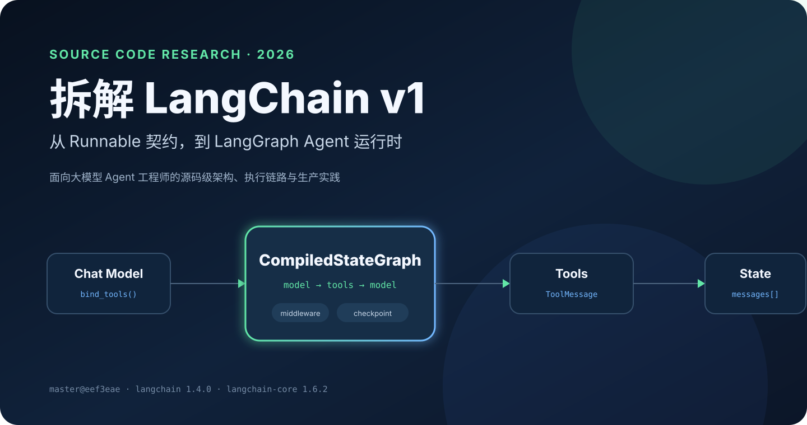
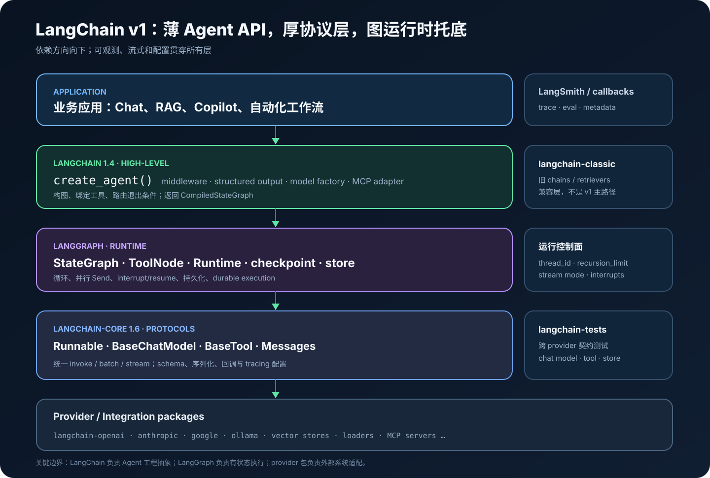
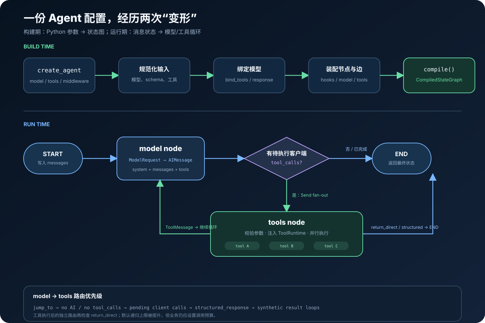
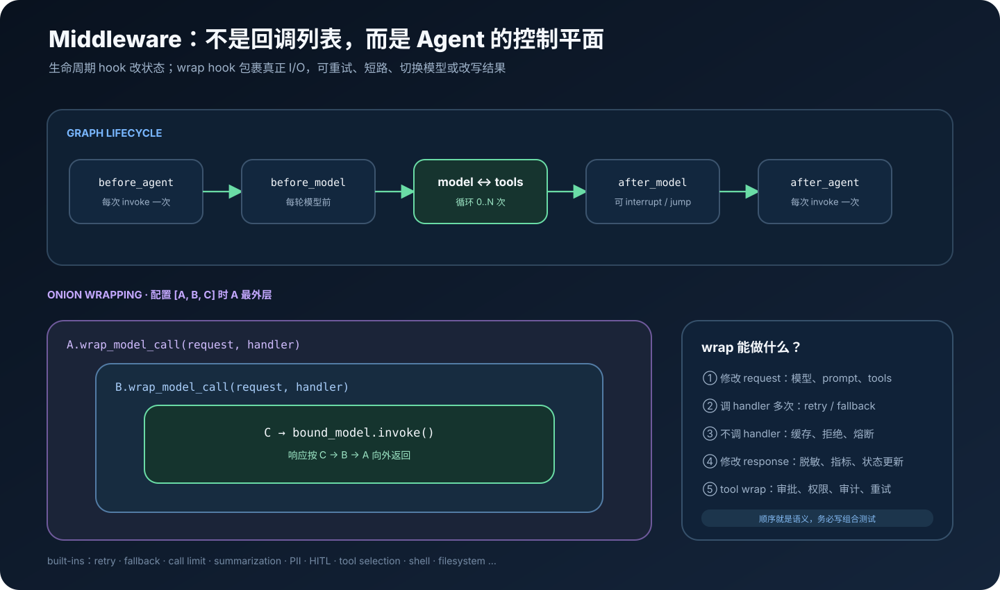
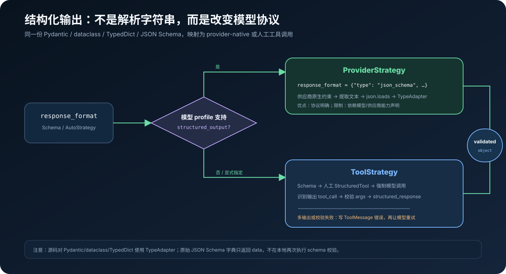
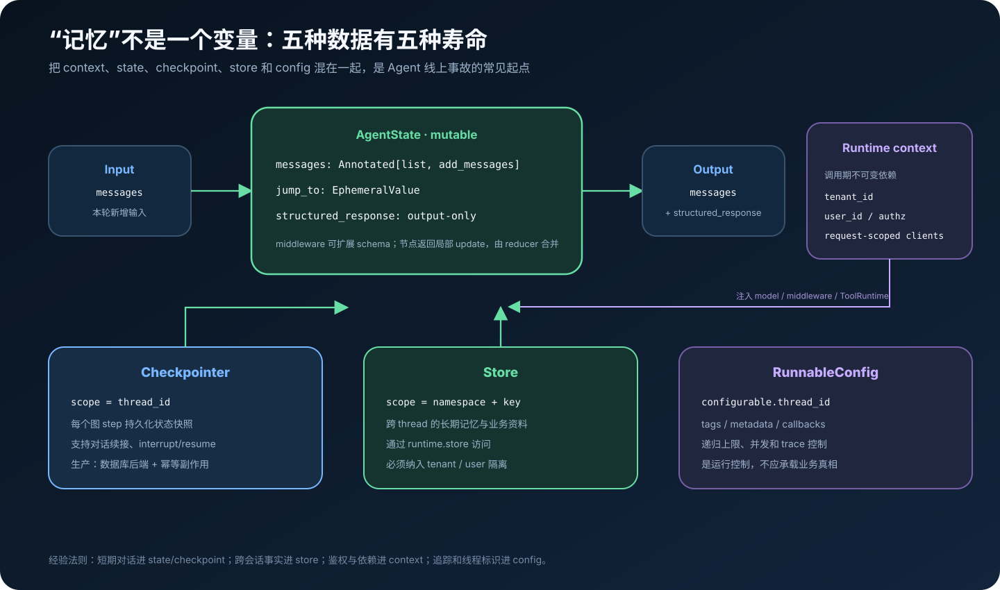

# 拆解 LangChain v1：从 Runnable 契约到 LangGraph Agent 运行时

> 一份面向大模型 Agent 工程师的源码级调研。本文基于 `langchain-ai/langchain` 的 `master@eef3eaeac8ff2646c43b37ac2a755a5e7978e8b4`（提交于 2026-09-05）与已发布的 `langchain==1.4.0`、`langchain-core==1.6.2`，调研时间为 2026-09-06。`master` 是开发分支快照，不等同于未来版本承诺。



很多人记忆里的 LangChain，仍是 2023 年那套“PromptTemplate 接 LLM，再接 OutputParser”的 chains 工具箱。源码中的 LangChain v1 已经换了重心：高层 `langchain` 包把模型、工具、中间件和输出约束编译成 **LangGraph 状态图**；`langchain-core` 提供跨供应商协议；真正的循环、并行、暂停与恢复由 LangGraph 执行。

本文不做 API 菜单式介绍，而沿着一条真实控制链回答这些问题：`create_agent` 究竟创建了什么？工具如何变成模型可见的 JSON Schema，又如何安全执行？middleware 为什么能实现重试、审批和动态模型路由？短期记忆、长期记忆与运行上下文分别落在哪里？最后再给出一份可执行的生产形态示例。

## 先给结论

从当前源码看，LangChain 最准确的工程定义是：

> **一个以 `Runnable`、消息、模型和工具为协议层，以 middleware 做横切控制，以 LangGraph 做有状态执行内核的 Agent 工程框架。**

六个关键判断：

1. **`create_agent` 是图工厂，不是 while-loop 包装器。** 它动态合成 state schema、middleware 节点、模型节点、`ToolNode` 与条件边，最后返回 `CompiledStateGraph`。
2. **`langchain` v1 有意变薄。** 抽象协议在 `langchain-core`，执行语义在 `langgraph`，供应商实现拆到 partner 包；旧 chains/retrievers 迁到 `langchain-classic`。
3. **Agent 状态的中心是消息日志。** `AIMessage.tool_calls` 发出动作意图，`ToolMessage.tool_call_id` 回填动作结果，图根据最新消息决定继续还是退出。
4. **Middleware 是控制平面。** 它既能在生命周期节点更新 state，也能洋葱式包裹模型/工具 I/O，实现重试、fallback、审批、限额、压缩和策略治理。
5. **“记忆”被拆成不同生命周期。** state 是本轮可变数据，checkpointer 保存 thread 状态，store 保存跨 thread 资料，context 注入请求级不可变依赖，config 承载运行控制。
6. **框架默认不等于安全沙箱。** 普通 tool 就是宿主进程里的 Python 调用；权限、隔离、幂等、审批和审计仍是应用责任。

## 1. 版本边界：今天研究的不是旧版 Chains

LangChain v1 于 2025-10-20 发布，官方把 `create_agent`、标准内容块和收敛后的命名空间列为核心变化；旧 chains、retrievers、indexing 等保留在 `langchain-classic`。[v1 发布说明](https://docs.langchain.com/oss/python/releases/langchain-v1)与[迁移说明](https://docs.langchain.com/oss/python/migrate/langchain-v1)明确了这个边界。

当前固定快照中，主包 [`libs/langchain_v1/pyproject.toml`](https://github.com/langchain-ai/langchain/blob/eef3eaeac8ff2646c43b37ac2a755a5e7978e8b4/libs/langchain_v1/pyproject.toml#L13-L39) 的版本和直接依赖是：

```text
langchain                 1.4.0
├── langchain-core        >=1.6.0,<2.0.0
├── langgraph             >=1.2.11,<1.3.0
└── pydantic              >=2.7.4,<3.0.0
```

因此本文把“LangChain 实现”限定在 Python v1 主路径。LCEL、prompt、document、vector store 等仍是重要底层能力，但不再用旧 `AgentExecutor` 解释当前 Agent。

## 2. Monorepo 分层：谁定义协议，谁负责执行



| 包/目录 | 源码职责 | 工程含义 |
|---|---|---|
| `libs/langchain_v1` | `create_agent`、middleware、模型工厂、MCP 适配 | 面向应用的高层 Agent API |
| `libs/core` | Runnable、messages、BaseChatModel、BaseTool、prompt、parser、callbacks | 不依赖具体供应商的稳定协议层 |
| `langgraph` 依赖 | StateGraph、ToolNode、Runtime、checkpoint、store、interrupt | 有状态循环和 durable execution 内核 |
| `libs/partners/*` | OpenAI、Anthropic、Google、Ollama 等适配 | 把频繁变化的 SDK 与核心解耦 |
| `libs/langchain` | 发布名为 `langchain-classic` | 旧 chains/retrievers 的兼容边界 |
| `libs/standard-tests` | 模型、embedding、tool、vector store 等契约测试 | 让“兼容 LangChain”成为可执行规范 |

主包目录本身只保留 `agents`、`chat_models`、`embeddings`、`messages`、`tools`、`mcp` 等少量入口。这个拆分解决的是 Agent 生态的根本矛盾：核心协议需要稳定，供应商 SDK 和能力矩阵却在快速变化。

值得强调的是，`langchain-core` 不是工具函数集合，而是 **协议内核**；`langgraph` 也不是可选的可视化配件，而是 v1 Agent 的执行依赖。官方概览同样把 LangChain 定位为高层 Agent 框架、LangGraph 定位为底层编排运行时。[官方概览](https://docs.langchain.com/oss/python/langchain/overview)

## 3. 最小公分母：Runnable 把“可调用对象”变成协议

`Runnable` 是 LangChain 可组合性的基础。它规定同步/异步、批处理、流式、schema 和配置接口；`RunnableSequence` 表示串行，`RunnableParallel` 表示并行。源码中的 [`Runnable`](https://github.com/langchain-ai/langchain/blob/eef3eaeac8ff2646c43b37ac2a755a5e7978e8b4/libs/core/langchain_core/runnables/base.py#L133-L208) 与 [`__or__`](https://github.com/langchain-ai/langchain/blob/eef3eaeac8ff2646c43b37ac2a755a5e7978e8b4/libs/core/langchain_core/runnables/base.py#L627-L673) 让下面这种写法不只是语法糖：

```python
chain = prompt | model | parser
result = chain.invoke(input, config={"tags": ["checkout"]})
```

`|` 会把左、右对象规整为 `RunnableSequence`。调用时，每个子 Runnable 得到子 trace 上下文，输出顺序传给下一步；异步、batch 与 stream 沿同一协议传播。需要留意一个常被忽略的语义：**串行链中只要某一步不支持流式 transform，它就会缓冲前面结果，后续才开始输出。** 这也是“模型支持 token stream，但整条链看起来不流式”的常见原因。

默认 `batch` 会用线程池并发执行同步 `invoke`，默认 `ainvoke` 也可把同步实现卸载到线程；provider 若能原生批量/异步，应覆盖这些默认实现，避免把网络并发退化成线程模拟。[Runnable 批处理实现](https://github.com/langchain-ai/langchain/blob/eef3eaeac8ff2646c43b37ac2a755a5e7978e8b4/libs/core/langchain_core/runnables/base.py#L931-L979)

### 3.1 RunnableConfig 不等于业务输入

`RunnableConfig` 贯穿调用链，承载 tags、metadata、callbacks、`configurable`、递归和并发控制。它适合 trace 与执行参数，不适合保存订单状态、权限真相或可恢复业务数据。业务输入应进入 state/context，持久化事实进入数据库/store。

## 4. 消息协议：Agent 循环真正传递的数据

`BaseMessage` 不只有 `content`。它还保存 `additional_kwargs`、`response_metadata`、`name`、`id` 等字段，并提供跨 provider 的标准 `content_blocks` 视图。[BaseMessage 源码](https://github.com/langchain-ai/langchain/blob/eef3eaeac8ff2646c43b37ac2a755a5e7978e8b4/libs/core/langchain_core/messages/base.py#L93-L205)

Agent 主路径关心四类消息：

| 类型 | 作用 | 关键字段 |
|---|---|---|
| `SystemMessage` | 注入全局行为约束 | `content` |
| `HumanMessage` | 用户输入 | 文本或多模态 content blocks |
| `AIMessage` | 模型输出和动作意图 | `tool_calls`、`invalid_tool_calls`、`usage_metadata` |
| `ToolMessage` | 工具执行回执 | `tool_call_id`、`status`、`artifact` |

[`AIMessage`](https://github.com/langchain-ai/langchain/blob/eef3eaeac8ff2646c43b37ac2a755a5e7978e8b4/libs/core/langchain_core/messages/ai.py#L160-L304) 会把供应商特有响应尽量翻译为统一内容块与 `tool_calls`。[`ToolMessage`](https://github.com/langchain-ai/langchain/blob/eef3eaeac8ff2646c43b37ac2a755a5e7978e8b4/libs/core/langchain_core/messages/tool.py#L26-L82) 依靠 `tool_call_id` 与原始动作配对；`artifact` 可保存 UI、调试或下游需要、但不应重新发送给模型的大对象。

这使一次工具调用成为明确的事件对：

```text
AIMessage(tool_calls=[{id: "call_7", name: "search", args: {...}}])
                                ↓
ToolMessage(tool_call_id="call_7", status="success", content="...")
```

如果自己拼接历史，最危险的不是格式错误，而是漏掉 ToolMessage、错配 ID 或破坏 provider 要求的消息顺序。优先让 state reducer 与 `ToolNode` 维护协议。

## 5. Model 抽象：统一调用面，不假装能力完全相同

[`BaseChatModel`](https://github.com/langchain-ai/langchain/blob/eef3eaeac8ff2646c43b37ac2a755a5e7978e8b4/libs/core/langchain_core/language_models/chat_models.py#L284-L332) 对外提供 `invoke/ainvoke/stream/astream/batch`，并通过声明式方法提供 `bind_tools`、structured output、retry 和 fallback。字符串、PromptValue 或消息序列会先规整为统一 message input，再进入 `generate_prompt` 和 provider 实现。[输入规整与调用](https://github.com/langchain-ai/langchain/blob/eef3eaeac8ff2646c43b37ac2a755a5e7978e8b4/libs/core/langchain_core/language_models/chat_models.py#L461-L523)

高层 [`init_chat_model`](https://github.com/langchain-ai/langchain/blob/eef3eaeac8ff2646c43b37ac2a755a5e7978e8b4/libs/langchain_v1/langchain/chat_models/base.py#L194-L360) 接受 `provider:model` 字符串，根据内置 registry 延迟导入对应 partner 包。这样应用可以把模型选择推迟到配置期：

```python
from langchain.chat_models import init_chat_model

model = init_chat_model("openai:<model-name>", temperature=0)
```

统一接口不代表供应商能力齐平。模型的 `profile` 会描述 tool calling、structured output、图片输入等能力；Agent 的 `AutoStrategy` 也会参考它。模型名启发式只是兼容兜底，不应该代替生产环境里的显式能力测试。

还有一个安全细节：把 configurable model 设置为 `configurable_fields="any"`，意味着运行配置可能改写 `api_key`、`base_url` 等参数；源码直接发出安全警告。不能把来自终端用户的 `configurable` 原样传给模型工厂。[可配置模型警告](https://github.com/langchain-ai/langchain/blob/eef3eaeac8ff2646c43b37ac2a755a5e7978e8b4/libs/langchain_v1/langchain/chat_models/base.py#L340-L355)

### 5.1 模型调用内部还发生了什么

核心调用路径可压缩为：

```text
invoke
  → convert_input
  → generate_prompt
  → generate
  → cache lookup
  → rate limiter
  → provider _generate / _stream
  → attach response metadata + usage
  → cache update + callback end
```

缓存检查在 rate limiter 之前，命中缓存不会消耗供应商限流配额；流式路径则把多个 `AIMessageChunk` 逐步发给 callback，并在必要时合并成最终 generation。[模型缓存与生成路径](https://github.com/langchain-ai/langchain/blob/eef3eaeac8ff2646c43b37ac2a755a5e7978e8b4/libs/core/langchain_core/language_models/chat_models.py#L1880-L2049)

## 6. Tool 实现：从 Python 签名到可审计动作

一个被 `@tool` 修饰的函数会变成 `StructuredTool`。框架通过函数签名与类型标注生成 Pydantic/JSON Schema；描述通常来自 docstring。`ToolRuntime`、state、store、tool-call ID 等注入参数会从模型可见 schema 中排除。[schema 生成](https://github.com/langchain-ai/langchain/blob/eef3eaeac8ff2646c43b37ac2a755a5e7978e8b4/libs/core/langchain_core/tools/base.py#L263-L368)与[`@tool` 转换](https://github.com/langchain-ai/langchain/blob/eef3eaeac8ff2646c43b37ac2a755a5e7978e8b4/libs/core/langchain_core/tools/convert.py#L270-L347)

```python
from langchain.tools import ToolRuntime, tool

@tool
def lookup_order(order_id: str, runtime: ToolRuntime) -> str:
    """Read an order visible to the current tenant."""
    tenant_id = runtime.context.tenant_id  # 不暴露给模型
    return repository.for_tenant(tenant_id).get(order_id)
```

模型只看到 `order_id`，看不到、也不能伪造 `runtime`。执行时 [`BaseTool._parse_input`](https://github.com/langchain-ai/langchain/blob/eef3eaeac8ff2646c43b37ac2a755a5e7978e8b4/libs/core/langchain_core/tools/base.py#L778-L906) 做输入校验和注入，`run/arun` 建立 callback 生命周期、处理工具错误，并把结果格式化为 ToolMessage。[BaseTool 执行路径](https://github.com/langchain-ai/langchain/blob/eef3eaeac8ff2646c43b37ac2a755a5e7978e8b4/libs/core/langchain_core/tools/base.py#L1009-L1135)

写工具应遵守四条规则：

- schema 要窄：使用 enum、范围、明确字段，不接收任意命令字符串；
- 权限要在工具内部再次校验，不能相信 system prompt；
- 副作用要幂等，幂等键应与 tool call/thread/业务请求关联；
- 读操作和写操作分开，重试、审批、超时策略分别配置。

`return_direct=True` 会使工具结果满足后直接结束 Agent；普通工具则把结果送回模型继续推理。一次 AIMessage 中的多个待执行调用，会被路由成多个 `Send("tools", [tool_call])`，从而并行 fan-out。[工具并行路由](https://github.com/langchain-ai/langchain/blob/eef3eaeac8ff2646c43b37ac2a755a5e7978e8b4/libs/langchain_v1/langchain/agents/factory.py#L1923-L1972)

## 7. `create_agent`：一座状态图工厂



[`create_agent`](https://github.com/langchain-ai/langchain/blob/eef3eaeac8ff2646c43b37ac2a755a5e7978e8b4/libs/langchain_v1/langchain/agents/factory.py#L772-L972) 的参数看起来像普通工厂：model、tools、system prompt、middleware、response format、state/context schema、checkpointer 和 store。返回值却是 `CompiledStateGraph`。

### 7.1 构建阶段

源码按以下顺序装配：

1. 字符串模型交给 `init_chat_model`；字符串 prompt 转为 `SystemMessage`。
2. 将 schema 规整为 Auto、Provider 或 Tool structured-output strategy。
3. 合并 middleware 自带 tools 与应用 tools；provider 内置工具只绑定给模型，客户端工具进入 `ToolNode`。
4. 校验 middleware 名称和 hook，按声明顺序组合 model/tool wrappers。
5. 合并 middleware state schema、显式 state schema 与基础 `AgentState`；创建 `StateGraph`。
6. 加入 before/after agent、before/after model、model 与 tools 节点，再生成条件边。
7. 用 checkpointer、store、interrupt、cache 和 stream transformers 编译图。

工具节点的建立与 provider 工具的区分见 [`factory.py`](https://github.com/langchain-ai/langchain/blob/eef3eaeac8ff2646c43b37ac2a755a5e7978e8b4/libs/langchain_v1/langchain/agents/factory.py#L994-L1105)；state schema 合并和建图见[对应实现](https://github.com/langchain-ai/langchain/blob/eef3eaeac8ff2646c43b37ac2a755a5e7978e8b4/libs/langchain_v1/langchain/agents/factory.py#L1174-L1192)；最终编译见[`compile` 调用](https://github.com/langchain-ai/langchain/blob/eef3eaeac8ff2646c43b37ac2a755a5e7978e8b4/libs/langchain_v1/langchain/agents/factory.py#L1829-L1857)。

### 7.2 执行阶段

模型节点每轮构造 `ModelRequest`，选择/绑定模型，把 system message 前置到历史消息，再调用模型；模型响应转换为 state update 或 `Command`。[模型节点实现](https://github.com/langchain-ai/langchain/blob/eef3eaeac8ff2646c43b37ac2a755a5e7978e8b4/libs/langchain_v1/langchain/agents/factory.py#L1441-L1540)

随后路由函数检查最新 `AIMessage`：

```text
显式 jump_to？              → 跳往指定节点
没有 AIMessage/tool_calls？ → END
还有待执行客户端工具？       → Send 到 tools（可并行）
已有 structured_response？  → END
只有合成 ToolMessage？       → 回 model
```

工具执行完成后，`return_direct` 或结构化输出工具可直接结束，否则回到 model，直到模型不再发 tool call。这个循环符合官方 Agent 文档描述，但源码揭示了两个更重要的事实：**路由是消息驱动的，middleware 可以通过 state update/Command 改变路由。** [Agent 官方说明](https://docs.langchain.com/oss/python/langchain/agents)

工厂内部把图的 recursion limit 提升到 9999，是为了不让通用图默认值过早截断 Agent；这绝不等于应用应该允许无限循环。生产系统仍需模型调用上限、工具调用上限、总耗时和 token/cost budget。

## 8. AgentState：reducer，而不是共享可变 dict

基础 [`AgentState`](https://github.com/langchain-ai/langchain/blob/eef3eaeac8ff2646c43b37ac2a755a5e7978e8b4/libs/langchain_v1/langchain/agents/middleware/types.py#L349-L367) 包含：

```python
messages: Required[Annotated[list[AnyMessage], add_messages]]
jump_to: NotRequired[Annotated[JumpTo | None, EphemeralValue, PrivateStateAttr]]]
structured_response: NotRequired[Annotated[ResponseT, OmitFromInput]]
```

节点不是就地修改一个全局 dict，而是返回局部 update；每个字段由 reducer 合并。`messages` 使用 `add_messages` 追加/按 ID 更新，`jump_to` 是临时控制信号，`structured_response` 不属于输入。middleware 可以声明扩展 state schema，工厂负责合并。

这种模型的收益是并行节点、checkpoint 和 replay 都有明确合并语义；代价是自定义字段必须认真选择 reducer。两个并行工具同时写同一个“最后值”字段而没有 reducer，结果可能冲突或丢失。

## 9. Middleware：Agent 的控制平面



[`AgentMiddleware`](https://github.com/langchain-ai/langchain/blob/eef3eaeac8ff2646c43b37ac2a755a5e7978e8b4/libs/langchain_v1/langchain/agents/middleware/types.py#L385-L420) 可带 state schema、工具、trace policy 和 stream transformer，并实现两类扩展点：

- 生命周期 hooks：`before_agent`、`before_model`、`after_model`、`after_agent`；
- I/O wrappers：`wrap_model_call`、`wrap_tool_call` 及异步版本。

Hook 适合更新 state、插入消息、做跳转或 interrupt。Wrapper 得到 request 与 inner handler，可以：修改模型、prompt、工具或参数；调用 handler 多次实现重试；跳过 handler 实现缓存/拒绝；修改返回值或附加 state update。[ModelRequest 与 override](https://github.com/langchain-ai/langchain/blob/eef3eaeac8ff2646c43b37ac2a755a5e7978e8b4/libs/langchain_v1/langchain/agents/middleware/types.py#L87-L269)

组合顺序是语义：middleware `[A, B, C]` 中 A 最外层，调用向内 `A → B → C → model`，响应反向返回。一个“计费 middleware”放在 retry 外层只计一次逻辑调用，放在内层则会计入每次重试。源码专门用链式 handler 实现这一顺序。[wrapper 组合](https://github.com/langchain-ai/langchain/blob/eef3eaeac8ff2646c43b37ac2a755a5e7978e8b4/libs/langchain_v1/langchain/agents/factory.py#L263-L352)

当前内置 middleware 已覆盖模型/工具重试与 fallback、调用上限、摘要压缩、PII、HITL、工具选择、上下文编辑、文件搜索、Shell 等。[middleware 导出清单](https://github.com/langchain-ai/langchain/blob/eef3eaeac8ff2646c43b37ac2a755a5e7978e8b4/libs/langchain_v1/langchain/agents/middleware/__init__.py)

### 9.1 Human-in-the-loop 为什么能恢复

`HumanInTheLoopMiddleware.after_model` 检查最新 AIMessage 的目标工具，生成 action request 和允许的决策，然后调用 LangGraph `interrupt()`。恢复时收到 `approve/edit/reject/respond` 决策，重建获准 tool calls，并为拒绝/人工答复生成 ToolMessage。[HITL 实现](https://github.com/langchain-ai/langchain/blob/eef3eaeac8ff2646c43b37ac2a755a5e7978e8b4/libs/langchain_v1/langchain/agents/middleware/human_in_the_loop.py#L405-L497)

```python
config = {"configurable": {"thread_id": "incident:42"}}
paused = agent.invoke(input, config=config, context=context)

resumed = agent.invoke(
    Command(resume={"decisions": [{"type": "approve"}]}),
    config=config,
    context=context,
)
```

恢复依赖同一 `thread_id` 与 checkpointer。真实生产环境还必须保证审批者身份、待审批参数签名、过期策略，以及工具本身的幂等性。

## 10. 结构化输出：两条协议路径



`response_format=MyPydanticModel` 会先成为 `AutoStrategy`。绑定模型时，工厂按 profile/兼容判断选择：

- `ProviderStrategy`：把 schema 绑定为供应商原生 JSON Schema response format；收到消息后提取文本、`json.loads` 并做类型校验。
- `ToolStrategy`：把 schema 伪装成一把输出工具，要求模型调用它；识别对应 tool call 后校验 args 并写入 `structured_response`。

具体绑定逻辑在 [`_get_bound_model`](https://github.com/langchain-ai/langchain/blob/eef3eaeac8ff2646c43b37ac2a755a5e7978e8b4/libs/langchain_v1/langchain/agents/factory.py#L1298-L1439)，两种策略定义在 [`structured_output.py`](https://github.com/langchain-ai/langchain/blob/eef3eaeac8ff2646c43b37ac2a755a5e7978e8b4/libs/langchain_v1/langchain/agents/structured_output.py#L196-L314)。

ToolStrategy 遇到多个结构化输出调用或 Pydantic 校验失败时，会插入带错误信息的 ToolMessage，让模型修正后再试；错误处理策略可自定义。[结构化输出处理](https://github.com/langchain-ai/langchain/blob/eef3eaeac8ff2646c43b37ac2a755a5e7978e8b4/libs/langchain_v1/langchain/agents/factory.py#L1194-L1296)

一个隐蔽差异是：Pydantic、dataclass 与 TypedDict 最终通过 `TypeAdapter.validate_python`；直接传入原始 JSON Schema dict 时，本地只返回 data，不再次执行该 schema。需要强本地校验时，优先用 Pydantic/dataclass，或自行加 validator。[本地解析实现](https://github.com/langchain-ai/langchain/blob/eef3eaeac8ff2646c43b37ac2a755a5e7978e8b4/libs/langchain_v1/langchain/agents/structured_output.py#L77-L103)

## 11. State、context、checkpoint、store：五种寿命



| 载体 | 是否可变 | 典型寿命 | 适合保存 |
|---|---:|---|---|
| Input/Output | 输入不可变、输出结果 | 一次 API 调用 | 本轮用户输入、最终结果 |
| AgentState | 按 reducer 更新 | 一次 run / 一个 thread 的当前状态 | messages、计划、调用计数 |
| Runtime context | 不可变 | 一次 invocation | tenant、user、鉴权结果、请求级依赖 |
| Checkpointer | 持久化 state 快照 | 同一 `thread_id` 跨调用 | 短期记忆、暂停/恢复、故障续跑 |
| Store | 显式读写 | 跨 thread | 用户偏好、长期记忆、共享业务资料 |
| RunnableConfig | 调用控制 | 一次调用及子调用 | tags、metadata、callbacks、thread_id |

官方短期记忆文档说明，checkpointer 在每个 graph step 保存状态，并通过 `thread_id` 续接；store 则用于跨 thread 的长期资料。[短期记忆](https://docs.langchain.com/oss/python/langchain/short-term-memory)、[长期记忆](https://docs.langchain.com/oss/python/langchain/long-term-memory)

LangGraph `Runtime` 把 context、store、stream writer 和执行信息注入 middleware/tool。最重要的设计原则是：**身份放 context，状态放 state，快照交 checkpointer，长期资料进 store。** [Runtime 官方说明](https://docs.langchain.com/oss/python/langchain/runtime)

多租户系统的 namespace 至少应包含 tenant/user；不能仅依赖模型“不要读取别人的数据”。`InMemorySaver` 和 `InMemoryStore` 只适合本地测试，进程退出即丢失，也不提供跨实例协调。

## 12. Streaming：同一次图执行的不同投影

Agent 继承 CompiledStateGraph 的 `invoke/ainvoke/stream/astream`。常用 stream mode 有：

- `updates`：每个节点完成后的 state update，适合呈现 Agent 步骤；
- `messages`：模型 token/message chunk 与 metadata，适合逐 token UI；
- `custom`：工具通过 `runtime.stream_writer` 发业务进度。

这些不是三次独立执行，而是同一个运行过程的不同事件投影；可以组合订阅。[Streaming 官方说明](https://docs.langchain.com/oss/python/langchain/streaming)

生产 UI 不应只渲染 token。至少应建模 `run_started/model_stream/tool_started/tool_finished/interrupted/run_finished/error`，并用 run ID、node、tool call ID 做关联；断线重连从 checkpoint/run store 恢复，而不是在浏览器里猜执行状态。

### 12.1 Callback、trace 与业务审计不是同一件事

Callbacks 记录模型/工具/链调用生命周期，LangSmith 可消费这些 trace。业务审计还需记录操作者、授权策略版本、工具参数摘要、审批决定、幂等键和外部系统回执。Trace 便于调试，不自动满足合规审计和数据保留要求。

## 13. MCP：新适配层，不是另一套 Agent 内核

`langchain==1.4.0` 新增 `langchain.mcp` 命名空间和 `MCPAdapter`，当前源码明确标注为 beta。[官方 release](https://github.com/langchain-ai/langchain/releases/)与[MCP 模块](https://github.com/langchain-ai/langchain/blob/eef3eaeac8ff2646c43b37ac2a755a5e7978e8b4/libs/langchain_v1/langchain/mcp/__init__.py)

[`MCPAdapter`](https://github.com/langchain-ai/langchain/blob/eef3eaeac8ff2646c43b37ac2a755a5e7978e8b4/libs/langchain_v1/langchain/mcp/adapter.py#L125-L242) 通过 FastMCP 发现远端 MCP tools，并把它们转换成异步 LangChain `StructuredTool`；elicitation 可映射为 LangGraph interrupt。字符串 target 只允许 HTTP(S)，避免把普通字符串隐式当成本地文件或子进程配置。

MCP 返回的 text/image/file content 会转换成 LangChain 标准内容块，`structured_content` 放入 artifact；错误会成为 `status="error"` 的 ToolMessage。[MCP tool 转换](https://github.com/langchain-ai/langchain/blob/eef3eaeac8ff2646c43b37ac2a755a5e7978e8b4/libs/langchain_v1/langchain/mcp/tools.py#L120-L180)

这层只解决协议适配。MCP server 仍是外部信任边界：必须验证服务器身份、工具 allowlist、租户凭据、参数和返回内容，不能因为它能自动发现就自动授权。

## 14. 一份生产形态的最小实现

完整代码位于 [`examples/incident_agent.py`](examples/incident_agent.py)，运行方式见 [`examples/README.md`](examples/README.md)。它实现一个事故分诊 Agent：

- `RequestContext` 注入 tenant/user/权限，不暴露给模型；
- `lookup_runbook` 是只读工具，可以指数退避重试；
- `create_incident_ticket` 是写工具，不自动重试，执行前必须人工审批；
- `ModelCallLimitMiddleware` 限制模型循环；
- `ToolStrategy(IncidentAssessment)` 强制 Pydantic 结果；
- checkpointer 支持 interrupt/resume，store 记录示例工单。

核心构建代码如下：

```python
agent = create_agent(
    model=model_id,
    tools=[lookup_runbook, create_incident_ticket],
    system_prompt="Inspect the runbook; never invent evidence or ticket IDs.",
    middleware=[
        ModelCallLimitMiddleware(run_limit=8, exit_behavior="error"),
        ModelRetryMiddleware(max_retries=2, on_failure="error"),
        ToolRetryMiddleware(
            tools=["lookup_runbook"], max_retries=2, on_failure="error"
        ),
        HumanInTheLoopMiddleware(
            interrupt_on={
                "create_incident_ticket": {
                    "allowed_decisions": ["approve", "edit", "reject"]
                }
            }
        ),
    ],
    response_format=ToolStrategy(IncidentAssessment),
    context_schema=RequestContext,
    checkpointer=InMemorySaver(),
    store=InMemoryStore(),
)
```

这段实现故意不做三个“看似省事”的动作：不把身份写进 prompt、不重试写操作、不自动批准 interrupt。示例中的内存后端也清楚标为非生产组件。

### 14.1 从演示升级到生产

```text
Demo                         Production
────────────────────────────────────────────────────────────
InMemorySaver             → PostgreSQL/受支持的持久 checkpointer
InMemoryStore             → 持久 store + tenant namespace + ACL
命令行 approve            → 有身份认证的审批 UI / 工单回调
进程内函数工具             → 有超时、权限、幂等与审计的 service client
单个 model_id             → 显式能力矩阵 + fallback + 预算路由
print 最终结果             → 事件流、指标、trace、审计日志、告警
```

## 15. 安全边界：LangChain 编排代码，不隔离代码

这是生产落地最重要的一节。

`ShellToolMiddleware` 没有显式 policy 时使用 `HostExecutionPolicy`；源码注释明确说明它不提供文件系统或网络沙箱，命令可访问宿主进程能访问的一切。Docker policy 默认关闭网络，是更合理的起点，但仍需镜像、挂载、资源与 syscall 策略。[执行 policy](https://github.com/langchain-ai/langchain/blob/eef3eaeac8ff2646c43b37ac2a755a5e7978e8b4/libs/langchain_v1/langchain/agents/middleware/_execution.py#L91-L105)与[Shell 默认行为](https://github.com/langchain-ai/langchain/blob/eef3eaeac8ff2646c43b37ac2a755a5e7978e8b4/libs/langchain_v1/langchain/agents/middleware/shell_tool.py#L518-L595)

上线前至少检查：

- **最小权限**：每个工具独立身份；按 tenant/user 在工具内部授权；读写工具分离。
- **输入/输出治理**：窄 schema、大小限制、URL/路径 allowlist；工具返回也视为不可信内容。
- **隔离**：代码、Shell、浏览器类工具运行在容器或 microVM；默认断网，按域名开放。
- **副作用**：幂等键、事务/outbox、超时、补偿；不要盲目重试写操作。
- **人工审批**：审批绑定具体参数和策略版本；参数一旦 edit，必须重新校验权限。
- **预算**：模型/工具调用次数、token、费用、墙钟时间、并发和返回体上限。
- **秘密管理**：密钥只在服务侧注入；trace、ToolMessage、artifact 与错误栈统一脱敏。
- **恢复语义**：checkpoint 可能重放节点，工具必须能识别“已成功但回执丢失”。

提示注入无法仅靠 system prompt 根治。真正的防线是缩小工具能力、强授权、把高风险动作放审批门后，并将外部内容与控制指令分离。[官方 context engineering 指南](https://docs.langchain.com/oss/python/langchain/context-engineering)

## 16. 测试：验证 Agent 的状态机，而不只是最终文本

仓库里的 `langchain-tests` 提供跨 provider 的标准测试套件，覆盖 chat model、embedding、tool、vector store、retriever、store、cache 等接口。[标准测试说明](https://github.com/langchain-ai/langchain/blob/eef3eaeac8ff2646c43b37ac2a755a5e7978e8b4/libs/standard-tests/README.md)

业务 Agent 的测试建议分四层：

1. **工具单测**：schema、权限、边界值、超时、幂等、错误映射；不调用模型。
2. **图路径测试**：用 scripted/fake chat model 固定 tool calls，断言 model→tools→model、并行回执、return_direct、structured retry。
3. **Middleware 组合测试**：断言嵌套顺序、重试次数、计费位置、HITL reject/edit、limit exit。
4. **Provider 合约与离线评估**：少量真实 API 测试验证 capability profile/tool schema，再用数据集评估任务成功率、工具选择、延迟和成本。

不要只断言最终自然语言完全相等。优先断言结构化结果、调用过哪些工具、参数是否合法、是否越权、循环次数、状态转移和审计事件。

## 17. 设计得失：为什么这样实现

### 优点

- 高层 API 很小，但能下沉到完整 LangGraph 图，简单和可控并存。
- message/tool/Runnable 协议统一，替换 provider 的应用改动相对集中。
- middleware 把 retry、HITL、压缩和路由从业务 prompt 中抽离，可单测、可组合。
- state/checkpoint/store/context 分层，为多轮、恢复和多租户提供正确建模入口。
- partner packages 与标准测试降低核心依赖爆炸，并把兼容性变成测试契约。

### 代价与陷阱

- 抽象层多：错误可能跨 provider → core → middleware → graph，排查需要理解完整调用链。
- middleware 顺序、state reducer、stream mode 都有语义，组合不当不会在类型层面自动报错。
- “统一模型接口”容易制造能力同质化错觉，原生 structured output、多模态和工具语义仍需 provider 测试。
- 图恢复不等于外部副作用 exactly-once；checkpoint 与业务事务之间仍有分布式一致性问题。
- 默认 host tools 很方便，也很危险；框架提供 policy 插口，但不会自动建立租户隔离。

我的工程判断是：LangChain v1 的最大进步不是 API 更短，而是终于把 **Agent 视为可持久、可中断、有明确状态转移的程序**。最大的风险也随之变化——不再是 prompt 拼接难看，而是开发者可能误以为有了图、middleware 和 checkpoint，就已经自动获得安全、幂等与分布式事务。

## 18. 推荐的源码阅读顺序

如果准备二次开发，按调用链阅读比按目录浏览更高效：

1. [`agents/factory.py`](https://github.com/langchain-ai/langchain/blob/eef3eaeac8ff2646c43b37ac2a755a5e7978e8b4/libs/langchain_v1/langchain/agents/factory.py)——先理解图如何生成。
2. [`middleware/types.py`](https://github.com/langchain-ai/langchain/blob/eef3eaeac8ff2646c43b37ac2a755a5e7978e8b4/libs/langchain_v1/langchain/agents/middleware/types.py)——掌握 request/response/state/hook 协议。
3. [`tools/base.py`](https://github.com/langchain-ai/langchain/blob/eef3eaeac8ff2646c43b37ac2a755a5e7978e8b4/libs/core/langchain_core/tools/base.py)——看 schema、注入与执行。
4. [`language_models/chat_models.py`](https://github.com/langchain-ai/langchain/blob/eef3eaeac8ff2646c43b37ac2a755a5e7978e8b4/libs/core/langchain_core/language_models/chat_models.py)——跟踪模型调用、缓存和 stream。
5. [`messages`](https://github.com/langchain-ai/langchain/tree/eef3eaeac8ff2646c43b37ac2a755a5e7978e8b4/libs/core/langchain_core/messages)——理解跨 provider 消息规范。
6. 选一个 middleware 和一个 partner provider 顺着读到底，再对照测试。

调试时建议记录每个 graph node 的输入 state 摘要、输出 update、model/tool request ID 与 thread ID。先定位是哪条状态转移错了，再看 prompt 或供应商响应，效率远高于只盯最终回答。

## 结语

LangChain v1 的源码主线可以压缩成一句话：

```text
业务配置
  → Runnable / Message / Model / Tool 协议
  → create_agent 编译 StateGraph
  → middleware 控制模型与工具边界
  → LangGraph 持久化并执行循环
  → stream / trace / structured_response 对外投影
```

它解决的是“如何把非确定性的模型调用组织成可组合、可观察、可恢复的程序”。它没有替你解决的，是业务授权、租户隔离、外部副作用一致性、成本约束和质量评估。专业 Agent 工程的分水岭，恰恰在后半句。

---

### 调研说明与主要来源

- 源码：[`langchain-ai/langchain`](https://github.com/langchain-ai/langchain)，固定到 `eef3eaeac8ff2646c43b37ac2a755a5e7978e8b4`。
- 版本事实：[`langchain` package metadata](https://github.com/langchain-ai/langchain/blob/eef3eaeac8ff2646c43b37ac2a755a5e7978e8b4/libs/langchain_v1/pyproject.toml)、[官方 releases](https://github.com/langchain-ai/langchain/releases/)。
- 官方文档：[Overview](https://docs.langchain.com/oss/python/langchain/overview)、[Agents](https://docs.langchain.com/oss/python/langchain/agents)、[Models](https://docs.langchain.com/oss/python/langchain/models)、[Tools](https://docs.langchain.com/oss/python/langchain/tools)、[Middleware](https://docs.langchain.com/oss/python/langchain/middleware/overview)、[Structured output](https://docs.langchain.com/oss/python/langchain/structured-output)、[Streaming](https://docs.langchain.com/oss/python/langchain/streaming)。
- 研究方法、证据账本和限制见 [`report-source.md`](report-source.md)。文中的架构图均依据上述固定源码自行绘制。
