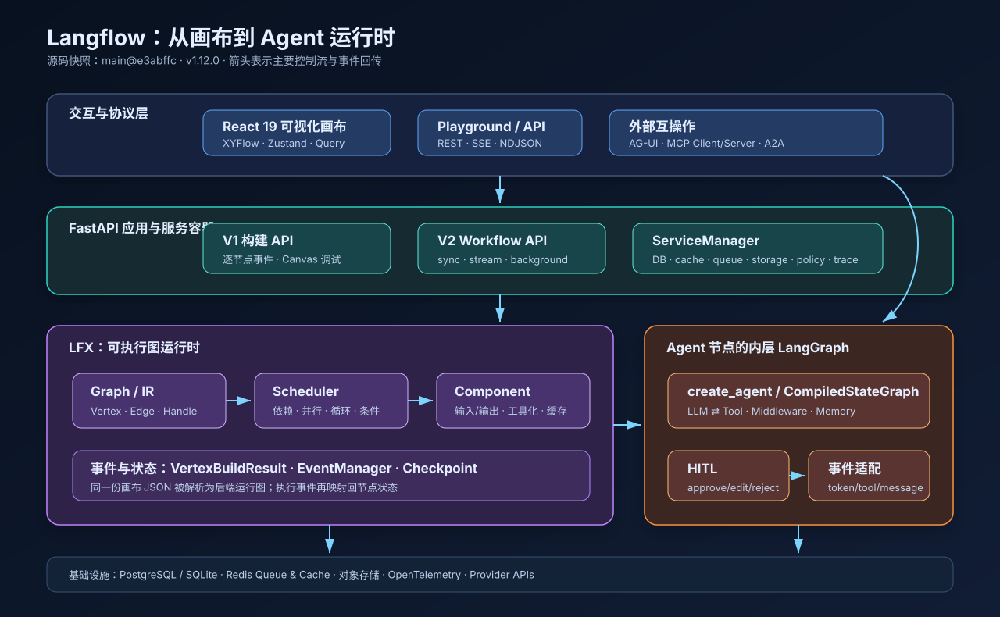
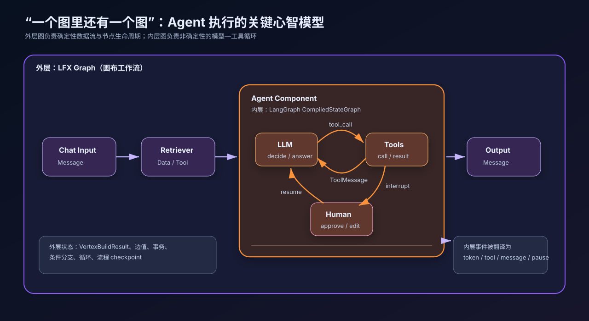
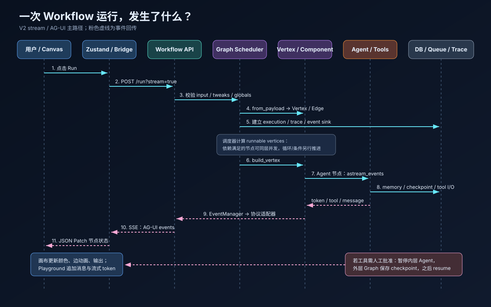
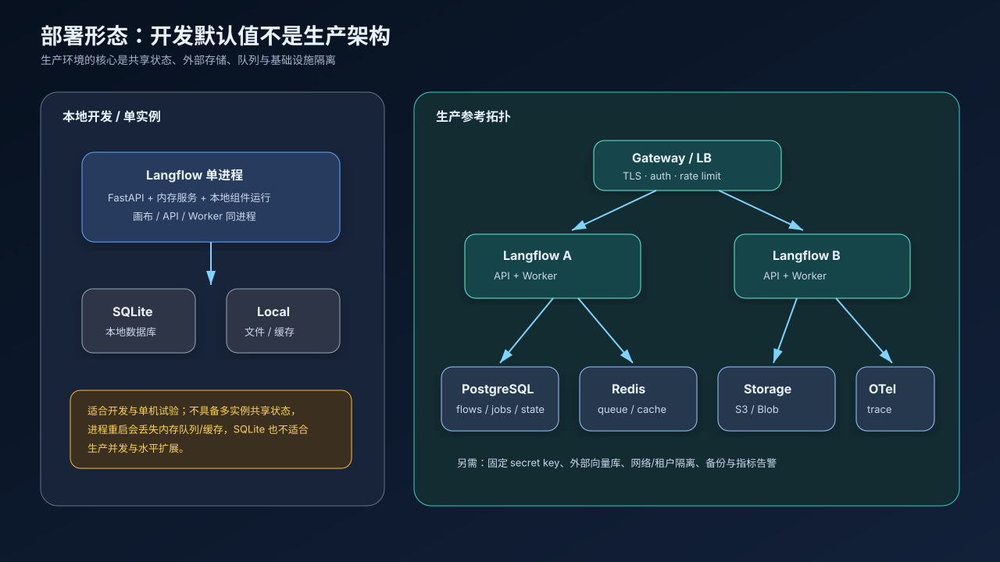

# 拆解 Langflow：从可视化画布到双层 Agent 运行时

> 一份面向大模型 Agent 工程师的源码级调研。本文基于 Langflow `main@e3abffc1b8da1e38cc2f21a9cf1b23b4a21c15d5`（仓库版本 `1.12.0`，提交于 2026-09-01），调研时间为 2026-09-04。`main` 是开发分支快照，不等同于稳定版本承诺。

Langflow 经常被一句话概括成“用拖拽方式搭建 LLM 应用”。这个描述没有错，却漏掉了最有工程价值的部分：它已经不是简单的 LangChain 可视化封装，而是一套包含 **可执行图中间表示、组件系统、Agent 内循环、事件协议、持久化控制面和扩展机制** 的应用运行时。

本文不做 UI 功能导览，而沿着一次真实执行的控制流，回答五个问题：画布如何变成代码？节点怎样调度？Agent 为什么是“图中图”？流式事件如何回到前端？它离生产级 Agent 平台还差什么？



## 先给结论

从源码看，Langflow 最准确的工程定义是：

> **一个以 JSON 图为可执行 IR、以 LFX 为工作流内核、以 LangGraph 驱动 Agent 内循环，并通过 FastAPI、AG-UI、MCP、A2A 和持久化服务对外提供能力的图形化 Agent IDE。**

其中最重要的四个判断是：

1. **画布不是展示层的附属品，而是程序本身。** React Flow 中的 nodes、edges、handles 和 viewport 被保存为 Flow JSON；后端再从同一份 JSON 恢复 `Graph → Vertex → Component`。
2. **Langflow 有两套嵌套的图。** 外层 LFX 图解决确定性的数据依赖、并行、条件和循环；Agent 节点内部再运行 LangGraph 状态图，解决模型—工具—人工审批的非确定性循环。
3. **流式输出本质上是执行事件的协议适配。** 节点构建、token、工具调用、日志和人工暂停先进入内部事件总线，再转换成 Langflow 事件或 AG-UI SSE，前端据此更新画布和 Playground。
4. **它首先是 IDE，其次才是隔离运行平台。** 自定义组件能在后端进程里执行 Python；认证并不会自动带来租户级代码隔离。生产化必须把网络、进程、数据和凭据边界放到基础设施层解决。

## 1. 仓库不是一个包，而是四层产品

官方仓库是 Python 与 TypeScript 混合的 monorepo。根包通过依赖链把能力逐层叠加，仓库自己的工程说明将它概括为 `langflow → langflow-core → langflow-base → lfx`。固定提交下的根 [`pyproject.toml`](https://github.com/langflow-ai/langflow/blob/e3abffc1b8da1e38cc2f21a9cf1b23b4a21c15d5/pyproject.toml) 要求 Python 3.10–3.14；前端使用 React 19、Vite、Zustand、TanStack Query 与 `@xyflow/react`，见 [`package.json`](https://github.com/langflow-ai/langflow/blob/e3abffc1b8da1e38cc2f21a9cf1b23b4a21c15d5/src/frontend/package.json)。

| 层 | 主要职责 | 为什么要拆开 |
|---|---|---|
| `lfx` | Graph、Vertex、Edge、Component、schema、CLI 与轻量服务 | 让图执行内核可以脱离完整 Langflow 独立运行 |
| `langflow-base` | FastAPI、数据库、认证、缓存、队列、存储、追踪 | 提供平台控制面，但不强绑全部模型 SDK |
| provider bundles | OpenAI、Anthropic、Google、向量库等组件包 | 隔离巨大且经常冲突的第三方依赖 |
| `langflow` | 完整发行包，选择并组合官方 bundles | 提供开箱即用安装体验 |
| `frontend` | 画布、Playground、节点状态和协议 bridge | 把 JSON 图变成可编辑、可观测的程序 |

本次源码快照中，`lfx`、后端、前端和 bundles 的主要目录合计约 15.7 万行 Python/TS/TSX，并有 24 个独立 bundle 包。这个规模解释了为什么把 Langflow 仅看成“低代码页面”会误判它的架构复杂度。

## 2. 画布 JSON：既是 UI 状态，也是可执行 IR

前端的 FlowPage 把 `@xyflow/react` 的 nodes 与 edges 放入 Zustand store。连线时，源码不仅记录起点和终点，还会把 source/target handle 的类型信息序列化进 edge；保存时再把 nodes、edges 和 viewport 一起 PATCH 到后端。关键实现可从 [`flowStore.ts`](https://github.com/langflow-ai/langflow/blob/e3abffc1b8da1e38cc2f21a9cf1b23b4a21c15d5/src/frontend/src/stores/flowStore.ts)、[`use-save-flow.ts`](https://github.com/langflow-ai/langflow/blob/e3abffc1b8da1e38cc2f21a9cf1b23b4a21c15d5/src/frontend/src/hooks/flows/use-save-flow.ts) 和 [`FlowPage`](https://github.com/langflow-ai/langflow/blob/e3abffc1b8da1e38cc2f21a9cf1b23b4a21c15d5/src/frontend/src/pages/FlowPage/components/PageComponent/index.tsx) 对照阅读。

下面是经过简化的概念结构，不是源码原样拷贝：

```json
{
  "nodes": [
    {"id": "input-1", "data": {"type": "ChatInput", "node": {"template": {}}}},
    {"id": "agent-1", "data": {"type": "Agent", "node": {"template": {}}}}
  ],
  "edges": [
    {
      "source": "input-1",
      "target": "agent-1",
      "sourceHandle": {"dataType": "Message", "outputName": "message"},
      "targetHandle": {"inputTypes": ["Message"], "fieldName": "input_value"}
    }
  ],
  "viewport": {"x": 0, "y": 0, "zoom": 1}
}
```

后端的 [`Graph.from_payload`](https://github.com/langflow-ai/langflow/blob/e3abffc1b8da1e38cc2f21a9cf1b23b4a21c15d5/src/lfx/src/lfx/graph/graph/base.py) 接收这份 payload，执行旧格式迁移、目录策略校验和 flow setting 校验，然后构造 `Vertex`、`Edge`、邻接关系、入度与 runnable 状态。数据库里的 [`Flow` 模型](https://github.com/langflow-ai/langflow/blob/e3abffc1b8da1e38cc2f21a9cf1b23b4a21c15d5/src/backend/base/langflow/services/database/models/flow/model.py) 则持久化整个图，以及 endpoint、flow type、MCP/A2A 暴露开关等元数据。

这套设计有一个很实用的性质：**编辑、存储、执行和观测都围绕同一个节点 ID 空间工作。** 后端发出 `agent-1` 的构建事件，前端无需额外映射就能点亮对应节点。代价是画布 schema 变成长期兼容契约，组件类名、输入名和 handle 结构一旦进入已保存的 flow，就不能随意修改。

## 3. 后端启动：FastAPI 只是入口，ServiceManager 才是骨架

[`main.py`](https://github.com/langflow-ai/langflow/blob/e3abffc1b8da1e38cc2f21a9cf1b23b4a21c15d5/src/backend/base/langflow/main.py) 负责创建 FastAPI app、挂载 V1/V2 路由和中间件。真正体现平台性的部分在 lifespan：

- 启动前检查生产配置，初始化数据库迁移、超级用户与策略；
- 建立 LLM cache，加载 bundles 和组件缓存，导入 starter flows；
- 启动 telemetry、MCP composer、任务队列和后台孤儿任务清理；
- 初始化 OpenTelemetry 事件循环与数据库指标；
- 关闭时先释放 MCP 连接，再停止后台任务、服务、沙箱和临时目录。

服务没有散落成模块级单例，而是由 [`ServiceManager`](https://github.com/langflow-ai/langflow/blob/e3abffc1b8da1e38cc2f21a9cf1b23b4a21c15d5/src/lfx/src/lfx/services/manager.py) 管理。它维护 factory/class registry，按需发现配置和 entry point，用 keyed lock 避免并发请求重复构造同一服务，并统一处理依赖注入与 teardown。后端的 [`register_all_service_factories`](https://github.com/langflow-ai/langflow/blob/e3abffc1b8da1e38cc2f21a9cf1b23b4a21c15d5/src/backend/base/langflow/services/utils.py) 注册数据库、chat、cache、session、storage、variable、tracing、queue、auth、policy、checkpoint 和 executor 等服务。

这是一种务实的轻量服务容器：比全局变量可测试，比大型 DI 框架容易理解，也允许 LFX 在无数据库的轻量模式中替换为 no-op 服务。

## 4. LFX Graph：如何把静态图变成运行中的程序

LFX 的核心对象定义在 [`graph/base.py`](https://github.com/langflow-ai/langflow/blob/e3abffc1b8da1e38cc2f21a9cf1b23b4a21c15d5/src/lfx/src/lfx/graph/graph/base.py) 与 [`vertex/base.py`](https://github.com/langflow-ai/langflow/blob/e3abffc1b8da1e38cc2f21a9cf1b23b4a21c15d5/src/lfx/src/lfx/graph/vertex/base.py)：

- `Graph`：保存 vertices、edges、入度、run map、queue、循环状态、条件分支和 checkpoint；
- `Vertex`：把节点 template 解析为参数，递归取得上游值，实例化组件并执行；
- `Edge`：描述输出 handle 到输入 field 的类型化连接；
- `VertexBuildResult`：携带结果、artifact、参数、日志与状态，供后续节点和事件层消费。

执行过程可以抽象为：

```text
payload
  → Graph.from_payload
  → prepare / build_run_map
  → 找出依赖已满足的 runnable vertices
  → Graph.build_vertex
  → Vertex.build_params（递归取得上游输出）
  → instantiate_component
  → Component._build_results
  → 保存边值、事务、trace，并发出构建事件
```

源码里有两种互补的调度方式：

1. `Graph.process` 面向整体执行。它把同一层可运行节点包装为 `asyncio.create_task`，再用 `gather` 并发等待，之后计算下一批 runnable vertices。
2. `async_start/astep` 面向逐步构建。每次从 queue 取一个节点并产出事件，适合 Canvas 实时显示、调试和人工暂停。

为什么不只保留一个？批量并发追求吞吐，逐步执行追求可视化、精细错误定位和可恢复性。Langflow V2 的同步执行可以走图协调器，而流式执行仍复用了逐 Vertex 的事件路径；这是 V1/V2 演进中的现实折中，而不是“两个完全独立的引擎”。

### 4.1 循环、条件与缓存

普通 DAG 只要拓扑排序即可，Agent 工作流却常包含迭代器、条件路由和冻结节点。LFX 为此维护 run map、cycle/conditional branch 状态和每个 Vertex 的 runnable 判定。节点冻结且缓存命中时，`Graph.build_vertex` 可直接恢复结果；但在使用模型相关缓存前仍会重新执行模型 provider policy 校验，避免缓存绕开治理策略。

这里能看到一个成熟工作流引擎才会关心的细节：**“可运行”并不等于“入度为零”，还要结合循环轮次、分支激活、上游失败、缓存和暂停状态。**

## 5. Component：声明式端口包裹命令式代码

[`Component` 基类](https://github.com/langflow-ai/langflow/blob/e3abffc1b8da1e38cc2f21a9cf1b23b4a21c15d5/src/lfx/src/lfx/custom/custom_component/component.py) 是 Langflow 可扩展性的中心。组件作者声明 `inputs` 和 `outputs`，运行时负责：

- 为每个实例深拷贝 schema，避免节点间共享可变状态；
- 把边上传来的值绑定到输入字段；
- 只执行真正连接或请求的输出 method；
- 对同步 method 使用线程卸载，对 async method 原生 await；
- 缓存 edge value，生成前端可读的 result/artifact；
- 对 secret 做脱敏，记录 trace、日志和 token stream；
- 通过 `to_toolkit` 把组件输出包装成 LangChain `StructuredTool`。

也就是说，同一个组件可以有两种身份：放在外层图里时是一个数据流节点；交给 Agent 时又能成为一把工具。这使“工作流编排”和“Agent 工具调用”共享同一套能力资产。

下面是一个符合当前组件心智模型的示意组件，可作为扩展起点；具体 import 和字段应以目标版本模板为准：

```python
from lfx.custom import Component
from lfx.io import MessageTextInput, Output, StrInput
from lfx.schema import Data


class KeywordScoreComponent(Component):
    display_name = "Keyword Score"
    description = "统计文本中目标关键词的命中次数"
    icon = "ScanSearch"
    name = "KeywordScore"

    inputs = [
        MessageTextInput(name="text", display_name="Text", required=True),
        StrInput(name="keyword", display_name="Keyword", required=True),
    ]
    outputs = [
        Output(name="result", display_name="Result", method="score"),
    ]

    def score(self) -> Data:
        count = self.text.lower().count(self.keyword.lower())
        return Data(data={"keyword": self.keyword, "count": count})
```

工程上最容易踩的坑是重命名：组件 `name`、输入字段名、输出 method 和返回类型都可能已经被写入 flow JSON。发布后直接改名相当于修改序列化协议，应提供 migration 或保留兼容别名。

## 6. Agent 的真实实现：外层 LFX，内层 LangGraph

这是全篇最关键的部分。



默认 [`AgentComponent`](https://github.com/langflow-ai/langflow/blob/e3abffc1b8da1e38cc2f21a9cf1b23b4a21c15d5/src/lfx/src/lfx/components/models_and_agents/agent.py) 在外层只是一个 Vertex，但它不会简单地调用一次 LLM。它通过 LangChain 的 `create_agent` 创建 LangGraph `CompiledStateGraph`，再以 `astream_events(version="v2")` 运行整个模型—工具循环。

### 6.1 运行前组装

`get_agent_requirements` 会完成以下工作：

1. 根据 provider/model 输入取得 chat model，并执行 model policy；
2. 按 session、flow、context 与 user 范围读取 chat memory；
3. 可选加入 Current Date 和安全 Calculator 工具；
4. 注册 callback，并强制模型以 stream 模式工作以产生细粒度事件；
5. 校验模型是否支持 `bind_tools`。

随后 `create_agent_runnable` 按配置加入中间件：

- `ToolCallIDMiddleware`：修正或补充 tool call ID；
- `ModelCallLimitMiddleware`：将 `max_iterations` 变成模型调用上限；
- `ToolRetryMiddleware`：工具失败时默认最多重试两次；
- `HumanInTheLoopMiddleware`：对需要批准的工具动作发出 interrupt；
- durable checkpointer：让 interrupt 之后可以恢复同一条 Agent 状态图。

### 6.2 运行与事件翻译

`run_agent` 把输入包装成 messages，设置 callbacks、`thread_id` 和 `recursion_limit = max_iterations × 2 + 5`，然后消费 LangGraph 的 event stream。若是恢复请求，则使用 `Command(resume=...)` 继续执行，而不是从头重新跑。

LangGraph 原始事件并不会直接暴露给 UI。Langflow 的 agent event adapter 将它们规整成 token、message、tool content、error、pause 等平台事件，同时保留 token usage 和部分消息气泡。对应的数据类型可见 [`agents/events.py`](https://github.com/langflow-ai/langflow/blob/e3abffc1b8da1e38cc2f21a9cf1b23b4a21c15d5/src/lfx/src/lfx/base/agents/events.py)。

### 6.3 Human-in-the-loop 是“双 checkpoint”问题

工具审批支持 approve、edit、reject 和 respond。内层 LangGraph 先暂停在 tool call；Langflow 再把审批请求写成 flow pause，并让外层工作流保存 Graph checkpoint。用户响应后，外层执行恢复到 Agent Vertex，内层又通过 `Command(resume=...)` 继续原线程。审批逻辑见 [`tool_approval.py`](https://github.com/langflow-ai/langflow/blob/e3abffc1b8da1e38cc2f21a9cf1b23b4a21c15d5/src/lfx/src/lfx/components/models_and_agents/agent_helpers/tool_approval.py)。

因此，HITL 不是给工具调用前加一个弹窗那么简单。它必须同时保证：

- 内层 Agent 消息、tool call ID 和中间状态不丢；
- 外层节点、边值、事务和后续节点不重复执行；
- 前端知道当前是失败、完成还是可恢复暂停；
- 恢复请求与原 execution/thread 精确关联。

这也解释了为什么 Langflow 的 checkpoint、job 和 execution signal 模型值得单独存在。

## 7. 从点击 Run 到画布亮起：事件驱动执行链



前端 `buildFlow` 先验证节点与边，等待正在编辑的组件更新完成，再创建 `AbortController` 并识别是否含 HITL。V2 路径由 [`run-flow-bridge.ts`](https://github.com/langflow-ai/langflow/blob/e3abffc1b8da1e38cc2f21a9cf1b23b4a21c15d5/src/frontend/src/controllers/API/agui/run-flow-bridge.ts) 消费 AG-UI：

- `RUN_STARTED` 初始化执行状态；
- `STATE_DELTA` 以 JSON Patch 更新节点状态；
- `CUSTOM` 承载 Langflow 事件、日志与 human input；
- `RUN_FINISHED` / `RUN_ERROR` 收束画布和 Playground 状态。

后端 V2 [`workflow.py`](https://github.com/langflow-ai/langflow/blob/e3abffc1b8da1e38cc2f21a9cf1b23b4a21c15d5/src/backend/base/langflow/api/v2/workflow.py) 提供三种模式：

| 模式 | 返回方式 | 适用场景 |
|---|---|---|
| `sync` | 请求结束时返回完整结果 | 短任务、服务间调用、测试 |
| `stream` | SSE 持续返回事件 | Chat、长生成、画布调试 |
| `background` | 先返回 execution/job 标识，再查询或重连 | 长任务、客户端断线、人工暂停 |

官方仍将 V2 Workflow API 标记为 Beta，接口细节应以使用版本的 [Workflow API 文档](https://docs.langflow.org/workflow-api) 为准。

流式实现 [`workflow_execution.py`](https://github.com/langflow-ai/langflow/blob/e3abffc1b8da1e38cc2f21a9cf1b23b4a21c15d5/src/backend/base/langflow/api/v2/workflow_execution.py) 没有另写一套执行器，而是复用 V1 build 的逐 Vertex 事件，再由 protocol adapter 输出 Langflow 或 AG-UI frame。事件进入容量为 256 的 bounded queue；消费者变慢时，生产者会受到背压，而不是无限堆积内存。后台重连则支持通过 `Last-Event-ID` 从持久化事件序号继续回放。

这种“内部领域事件 → 协议适配器”的结构非常值得借鉴：运行时不需要知道 UI 使用 SSE、AG-UI 还是未来的其他传输协议。

## 8. V1 与 V2 为什么同时存在

V1 [`build.py`](https://github.com/langflow-ai/langflow/blob/e3abffc1b8da1e38cc2f21a9cf1b23b4a21c15d5/src/backend/base/langflow/api/build.py) 围绕 Canvas 构建体验设计：启动 build 返回 job ID，客户端随后获取 NDJSON/轮询事件，也可以取消。服务端逐 Vertex 发出 `vertices_sorted`、`build_start`、`end_vertex`、`error` 与 `end`。

V2 则把 flow 提升为面向开发者的 workflow endpoint，统一 inputs、tweaks、globals、sync/stream/background 和协议选择。两者共用图运行时与部分事件路径，说明 Langflow 在进行“IDE 内部构建 API → 通用工作流 API”的渐进迁移。

对集成方的建议是：

- 新的服务端集成优先评估 V2，但接受 Beta 版本治理；
- Canvas 插件或兼容旧部署时仍需理解 V1 build 事件；
- 不要把某个前端事件结构直接当成长期领域模型，自己应再加一层 adapter。

## 9. 持久化：Flow 数据只是开始

Langflow 使用 SQLModel/SQLAlchemy 与 Alembic。除了 flow、user、API key、variable、folder、file、message，还持久化 transaction、vertex build、trace/span 等运行信息。V2 后台执行进一步增加四类控制面数据，定义可见 [`jobs/model.py`](https://github.com/langflow-ai/langflow/blob/e3abffc1b8da1e38cc2f21a9cf1b23b4a21c15d5/src/backend/base/langflow/services/database/models/jobs/model.py)：

- `Job`：queued、in_progress、completed、failed、cancelled、timed_out、suspended 等状态；
- `JobEvent`：带递增 seq 的可回放事件；
- `ExecutionSignal`：stop、pause、resume 等协作式控制信号；
- `JobCheckpoint`：按 job/kind 保存恢复 blob。

这里要区分“持久化控制面”与“分布式执行面”。固定提交的 [`BackgroundExecutionService`](https://github.com/langflow-ai/langflow/blob/e3abffc1b8da1e38cc2f21a9cf1b23b4a21c15d5/src/backend/base/langflow/services/background_execution/service.py) 默认可以在进程内执行，并为 scaled backend 留有装配入口；可选模块不可用时会回退到 in-process。换言之，数据库记录能让事件重放和状态更耐久，但它本身并不自动等于跨节点任务调度。

## 10. 扩展系统：为什么 provider 要拆成 bundles

模型 SDK 的依赖冲突是 Agent 平台常见的维护黑洞。Langflow 把 provider 组件拆成 bundle，并通过 `langflow.extensions` entry point 与扩展 registry 发现。组件接口层 [`components.py`](https://github.com/langflow-ai/langflow/blob/e3abffc1b8da1e38cc2f21a9cf1b23b4a21c15d5/src/lfx/src/lfx/interface/components.py) 维护组件缓存、lazy metadata/loading、代码 hash 和开发模式重载。

这个设计带来三点收益：

1. 引擎与 provider SDK 生命周期解耦；
2. UI 可以先读取组件 metadata，不必立即 import 全部重依赖；
3. 企业可以发布自己的 pip extension，而不必长期 fork 核心仓库。

代价是启动阶段和缓存失效更复杂：扩展版本、组件代码 hash、已保存 flow schema、前端 metadata 必须保持一致。对私有组件包，至少要建立版本化发布、兼容性测试和 flow migration 流程。

## 11. MCP、A2A 与 AG-UI：三个协议处在不同平面

它们经常被一起宣传，但工程角色不同：

| 协议 | 在 Langflow 中的角色 | 所在平面 |
|---|---|---|
| AG-UI | 把运行、状态增量、消息、工具和自定义事件流给客户端 | UI 事件平面 |
| MCP | 让 flow 消费外部工具/资源，或把 flow 暴露为 MCP 能力 | 工具互操作平面 |
| A2A | 把 Agent flow 暴露为 agent card/task 语义，支持 Agent 间协作 | Agent 互操作平面 |

三者共同体现了 Langflow 的平台方向：内部仍是一套 Graph/Component/Agent 运行时，对外则通过不同 adapter 暴露。Flow 数据模型中的 MCP/A2A flags 和启动时的 MCP managers 表明这些不是纯前端功能。A2A 的接口仍应按部署版本核对，官方也保留了分版本的 [A2A Server 文档](https://docs.langflow.org/1.11.0/a2a-server)。

## 12. LFX：把运行时从 IDE 中剥离

[`src/lfx/README.md`](https://github.com/langflow-ai/langflow/blob/e3abffc1b8da1e38cc2f21a9cf1b23b4a21c15d5/src/lfx/README.md) 将 LFX 定位为轻量执行层，提供 `lfx run` 与 `lfx serve`。它默认使用 no-op 数据库，不保存 flow、message 或 user，适合本地、无状态服务和嵌入式执行。

从架构演化看，这是正确的拆分方向：

- IDE 关心编辑、账户、目录、版本、历史和共享；
- Runtime 关心构图、类型、调度、事件和资源生命周期；
- Control plane 关心任务、checkpoint、策略、审计与扩缩容。

如果三者永久捆在一个进程里，任何 serverless、边缘部署或批处理场景都会被 UI 和数据库依赖拖累。LFX 让 Langflow 有机会成为“flow 编译/编辑器 + 多形态执行器”，而不只是一体化 Web 应用。

## 13. 生产部署：默认配置只适合本地



官方 [Production Best Practices](https://docs.langflow.org/deployment-prod-best-practices) 要求生产环境使用 PostgreSQL、外部 storage、固定 secret key，并为向量数据配置合适的 pgVector/外部向量库。多 worker 下，内存 job queue 不能跨进程共享；Redis queue/cache 和共享数据库才是水平扩展的基础。具体变量随版本变化，应以 [Environment Variables](https://docs.langflow.org/environment-variables) 为准。

一套最低限度的生产检查表是：

- PostgreSQL 做主状态库，配置迁移、备份、连接池和恢复演练；
- Redis 承担需要跨进程共享的队列/缓存，监控 backlog 和 consumer health；
- 文件、artifact 与上传内容进入外部对象存储；
- secret key 固定且托管于 secret manager，不随容器重建；
- provider 凭据按环境与租户隔离，限制网络 egress；
- Gateway 层完成 TLS、认证、限流和请求体限制；
- 为 flow、vertex、model/tool 调用建立超时、重试、并发与预算上限；
- 对 checkpoint/event 表制定保留和清理策略。

### 可观测性边界

Langflow 可以初始化 OpenTelemetry，采集请求率、错误率、延迟、运行时健康和 flow span 等服务级信号。官方 [OpenTelemetry 文档](https://docs.langflow.org/observability-opentelemetry) 明确区分服务观测与 LLM prompt/completion 追踪：启用 OTel 不代表自动记录每次提示词与模型输出；后者应由专门 tracing integration 承担，并建立敏感数据策略。

## 14. 安全：必须把它当成“远程代码执行 IDE”来部署

这是所有生产讨论中优先级最高的一节。

官方 [Security 文档](https://docs.langflow.org/security) 将 Langflow 定义为 IDE/代码执行平台：有开发权限的用户可以编写自定义 Python，并在后端进程的文件系统和网络权限下执行；同一进程内没有天然的强用户隔离。因此：

- 身份认证只回答“你是谁”，不等于限制自定义代码能读什么文件、访问什么网段；
- UI 隐藏某个组件不等于消除执行面，API、已保存 flow、插件和其他解释器入口也要治理；
- 可选 microVM 沙箱只覆盖文档列出的 Python Interpreter/旧 REPL 等入口，不能推断为全平台隔离；
- 外部 tracing 可能把 prompt、工具参数或 secret 发往第三方，必须按数据分类启用；
- 真正的不可信多租户应采用独立进程/容器/VM、网络策略、短期凭据和资源配额。

Langflow 提供 catalog policy、model provider policy、`LANGFLOW_ALLOW_CUSTOM_COMPONENTS`、代码解释器阻断和 tweaks 控制等治理开关，但它们是纵深防御，不是沙箱替代品。最稳妥的部署模型仍是：**把能编辑代码的人视为该运行环境的开发者；把互不信任的租户放进不同安全边界。**

## 15. 架构优点与技术债

### 做得好的地方

- **IR 统一。** 同一个节点 ID 贯穿编辑、持久化、执行、日志和可视化，降低了调试系统的映射成本。
- **组件与工具复用。** Component 既能成为外层节点，也能被包装为 Agent Tool，能力资产不必维护两份。
- **双层图职责清楚。** 外层处理数据依赖，内层处理推理循环，避免把所有控制流硬塞入一种抽象。
- **事件优先。** 协议 adapter 将运行时与 AG-UI/SSE 解耦，天然支持 Playground、画布和后台重放。
- **逐步拆出 LFX。** 轻量 runtime 为 headless、serverless 和独立 worker 留出了空间。
- **扩展依赖隔离。** bundles/entry points 缓解 provider SDK 膨胀与冲突。

### 需要持续偿还的复杂度

- **V1/V2 双轨。** 流式 V2 复用 V1 逐节点逻辑，减少重写风险，却增加理解和测试矩阵。
- **schema 兼容压力。** 组件名字、字段和 handle 都是持久化协议，重构成本高。
- **双 checkpoint 一致性。** 外层 Graph 与内层 LangGraph 都可能暂停，恢复、取消和超时要避免重复副作用。
- **进程内与分布式语义差异。** durable 数据表、Redis queue 和真正的跨节点执行并非同一个问题。
- **安全模型容易被 UI 误导。** 拖拽界面看起来无害，但自定义组件拥有后端代码权限。
- **Provider 变化快。** 组件 metadata、SDK 版本、模型能力和 policy 缓存需要协同更新。

## 16. 如果要基于 Langflow 做企业 Agent 平台

我不会先修改 Graph 调度器，而会按以下顺序补齐平台能力：

1. **定义信任边界。** 区分平台管理员、flow 开发者、只运行用户和不可信租户，确定是否允许自定义代码。
2. **冻结组件契约。** 为私有 bundle 建 semver、schema snapshot、migration 和 golden flow 测试。
3. **统一执行身份。** 将 user、tenant、flow、execution、thread、job 贯穿 DB、trace、tool credential 与审计日志。
4. **约束副作用。** 所有外部工具支持 idempotency key、timeout、retry policy 和审批级别；恢复 checkpoint 时尤其重要。
5. **建立预算系统。** 在 flow、Agent、模型和工具四层限制 token、迭代次数、并发、时长和费用。
6. **分离 control plane 与 worker。** API 接收/查询任务，worker 执行 LFX；用 durable queue 和 lease 明确 at-least-once 语义。
7. **红队测试恢复路径。** 覆盖工具调用后断线、审批前后重启、重复 resume、队列重复投递、模型超时与部分流式输出。

其中第四和第七项常被低估。Agent 工作流最危险的 bug 不是“回答错”，而是恢复后重复发邮件、重复付款或重复写库。

## 17. 推荐的源码阅读路线

如果你希望自行验证本文结论，按这条链路阅读最省时间：

```text
frontend flowStore / FlowPage
  → use-save-flow
  → database Flow model
  → Graph.from_payload
  → Graph.process / astep / build_vertex
  → Vertex.build / instantiate_component
  → Component._build_results / to_toolkit
  → AgentComponent.run_agent
  → V1 build events / V2 workflow_execution
  → frontend run-flow-bridge
  → JobEvent / Checkpoint / ExecutionSignal
```

每读一层都追问三个问题：状态的权威来源在哪里？失败后从哪里恢复？事件如何对应回原节点？这样比从组件目录逐个浏览更容易建立完整心智模型。

## 结语

Langflow 真正有价值的地方，不是把几个方框拖到一起，而是把 **可编辑的图、可执行的组件、可循环的 Agent、可回放的事件和可扩展的协议** 拼成了一个相对完整的工程系统。

它的设计也揭示了 Agent 平台的普遍规律：确定性工作流和非确定性推理循环需要不同抽象；流式 UI 背后需要稳定的领域事件；HITL 背后需要 durable state；低代码并不会降低代码执行的安全等级。

如果把 Langflow 当作原型工具，它能很快交付；如果把它当作企业运行平台，则必须在它的图运行时之外，认真补齐租户隔离、幂等、副作用治理、分布式 worker 和成本控制。这两种判断并不矛盾——恰恰是读完源码后最应该保留的清醒。

---

### 主要资料

- [Langflow 官方仓库](https://github.com/langflow-ai/langflow)
- [固定提交 `e3abffc`](https://github.com/langflow-ai/langflow/tree/e3abffc1b8da1e38cc2f21a9cf1b23b4a21c15d5)
- [Workflow API](https://docs.langflow.org/workflow-api)
- [Components and bundles](https://docs.langflow.org/components-bundle-components)
- [Production best practices](https://docs.langflow.org/deployment-prod-best-practices)
- [Security](https://docs.langflow.org/security)
- [OpenTelemetry](https://docs.langflow.org/observability-opentelemetry)
- [MIT License](https://github.com/langflow-ai/langflow/blob/e3abffc1b8da1e38cc2f21a9cf1b23b4a21c15d5/LICENSE)

研究证据、版本冲突处理和覆盖边界记录在同目录的 `report-source.md`，便于后续更新本文时复核。
