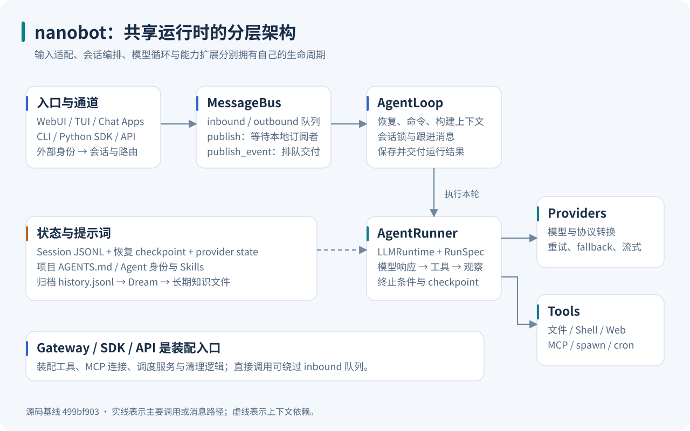
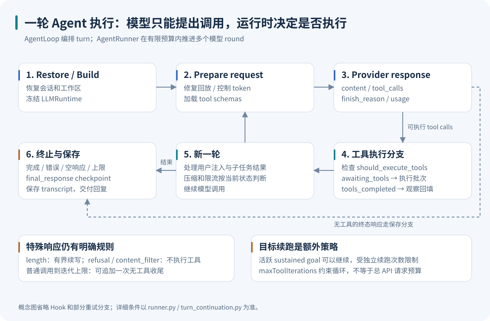
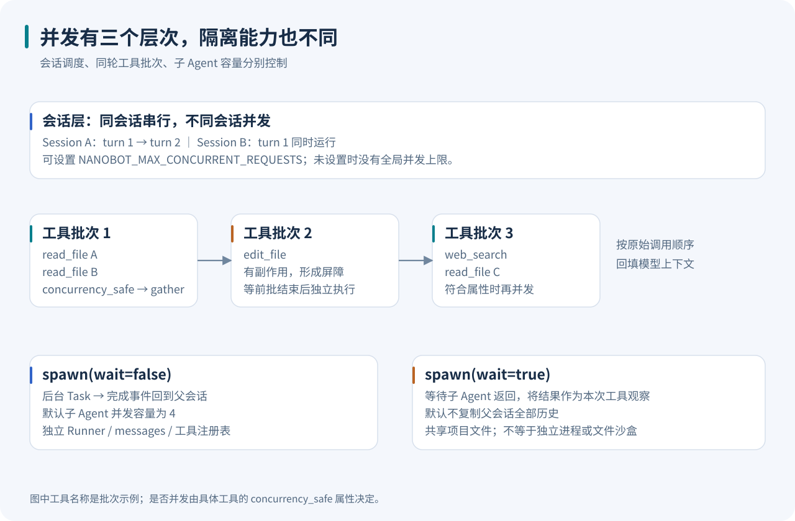
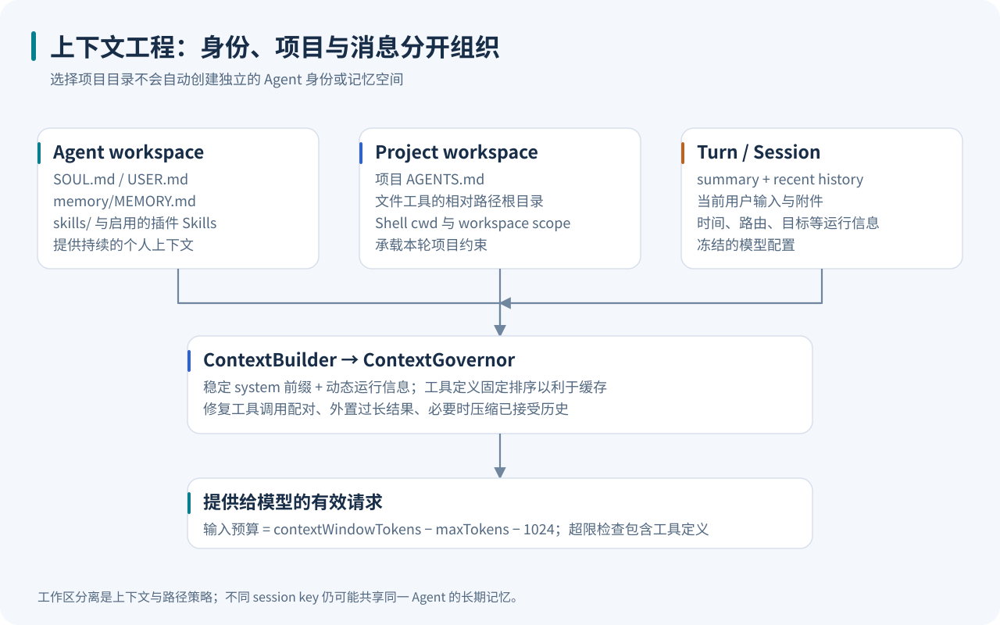
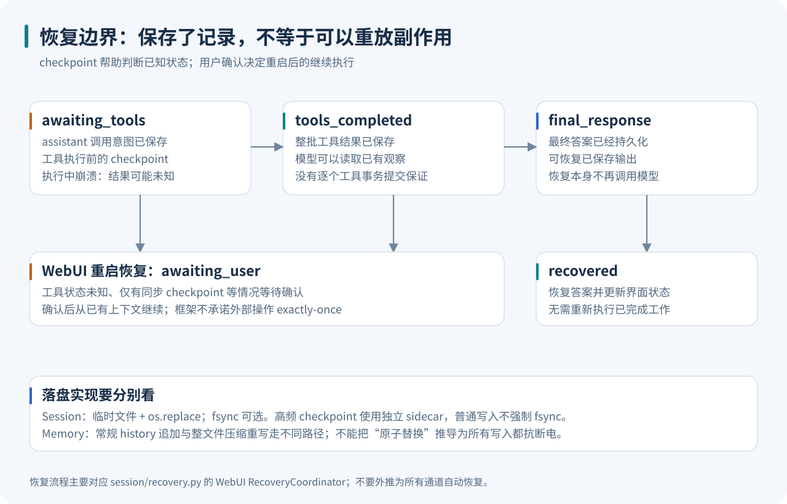
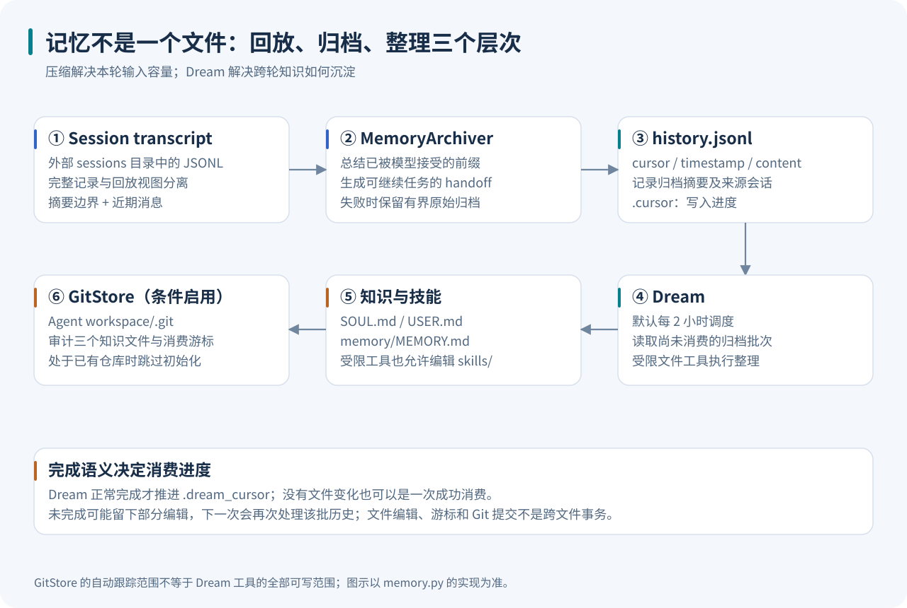
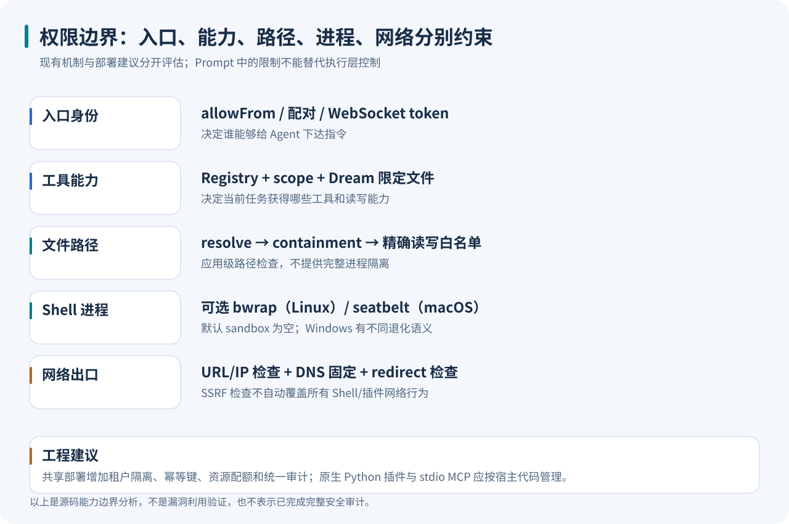

# nanobot 源码深读：从轻量个人助手到可持续执行的 Agent 运行时

> 从大模型 Agent 工程师的视角，沿着一次真实请求，理解模型调用、工具执行、上下文、记忆、并发与恢复如何组成一个可用的系统。

| 调研项 | 基线 |
| --- | --- |
| 官方仓库 | [HKUDS/nanobot](https://github.com/HKUDS/nanobot) |
| 调研日期 | 2026-09-14 |
| 源码提交 | [`499bf903022f429dd4501fdfbeeccadcb99dd51f`](https://github.com/HKUDS/nanobot/tree/499bf903022f429dd4501fdfbeeccadcb99dd51f) |
| 提交时间 | 2026-09-14 17:48:10 +08:00 |
| 包声明版本 | `nanobot-ai 0.3.0`；这里分析的是上述开发提交，不假定与 PyPI 同名版本逐文件一致 |
| 方法 | 克隆源码、追踪调用链、对照文档与测试、运行 128 项上游测试、运行真实 Runner 的离线示例 |
| 阅读对象 | Agent 框架开发者、个人助手产品工程师、准备二次开发 nanobot 的团队 |

**nanobot 最值得研究的地方，是它如何把个人助手的“持续工作”拆成一组明确的运行时责任。** 模型决定下一步行动；Runner 管理一次模型—工具闭环；Loop 维护会话与交付；记忆、任务调度和外部通道围绕这些边界扩展。

当前版本已经包含 WebUI、原生终端客户端、模型预设、MCP、后台及同步子 Agent、持续目标、Dream 记忆整理与中断恢复。用早期“一个 while 循环、一个 Markdown 记忆文件”的印象理解它，会遗漏大量影响正确性的实现。

本文中的“源码事实”以固定提交为准；“工程判断”是从实现推导出的适用性和代价；“改进建议”不代表上游已经实现。所有图均为根据源码绘制的原创示意图，打开 Markdown 即可阅读，无需 Mermaid 插件。



## 阅读导航

- [1. 如何理解它的“轻量”](#sec-1)
- [2. 从入口到一次 Agent turn](#sec-2)
- [3. AgentRunner 的模型—工具循环](#sec-3)
- [4. 工具契约与受控并发](#sec-4)
- [5. Provider：模型切换不只是替换 URL](#sec-5)
- [6. 上下文与两个工作区](#sec-6)
- [7. 上下文压缩与长工具结果](#sec-7)
- [8. Session 与中断恢复](#sec-8)
- [9. Dream：从归档到长期知识](#sec-9)
- [10. Skills、插件与 MCP](#sec-10)
- [11. 子 Agent 与跨会话协作](#sec-11)
- [12. Goal、Cron、Heartbeat 与本地触发器](#sec-12)
- [13. WebUI、流式事件与交付](#sec-13)
- [14. 安全边界与生产化取舍](#sec-14)
- [15. 本地运行与二次开发示例](#sec-15)
- [16. 验证结果与源码阅读路线](#sec-16)

<a id="sec-1"></a>
## 1. 如何理解它的“轻量”

nanobot 是一个可自托管的个人 Agent 运行时，主要后端语言为 Python，要求 Python 3.11 及以上；WebUI 使用 React/TypeScript 与 Vite，终端客户端位于独立的 `tui/`。它既可以作为常驻 Gateway 接收聊天消息，也可以通过 CLI、Python SDK、OpenAI 兼容 HTTP API 被调用。[包定义](https://github.com/HKUDS/nanobot/blob/499bf903022f429dd4501fdfbeeccadcb99dd51f/pyproject.toml)、[WebUI 依赖](https://github.com/HKUDS/nanobot/blob/499bf903022f429dd4501fdfbeeccadcb99dd51f/webui/package.json)

从当前源码规模看，“轻量”适合解释为**主干概念相对直接、本地部署不强依赖大型基础设施**，不宜再解释成整个产品只有几千行代码。

下面是本次自行统计的物理行数，包含注释和空行，排除了目录名为 `tests` 的 Python 文件；不包含前端、终端客户端和文档。它描述代码规模，不衡量运行内存、延迟或质量。

| 区域 | Python 文件数 | 物理行数 | 主要责任 |
| --- | ---: | ---: | --- |
| `nanobot/agent` | 50 | 23,170 | Loop、Runner、上下文、记忆、工具与子 Agent |
| `nanobot/providers` | 24 | 16,284 | 多供应商协议、重试、模型状态 |
| `nanobot/session` | 13 | 4,676 | 会话存储、回放、恢复与目标状态 |
| `nanobot/channels` | 79 | 26,834 | 聊天平台适配与 WebSocket |
| `nanobot/webui` | 49 | 20,541 | WebUI 后端、设置、历史投影与访问控制 |
| **整个 `nanobot/`** | **329** | **120,110** | 总计还包括 CLI、配置、调度、工具函数等 |

单看两个核心文件，`loop.py` 为 2,388 行，`runner.py` 为 1,372 行。数字提醒我们：理解小型 Agent 框架，不能只读一个概念性循环，更要读其外围的状态管理。[统计结果与文件哈希](research/source-inventory.json)、[可重跑统计脚本](research/source_inventory.py)

我的整体判断是：它很适合学习和构建**以单个用户、可信工作区和常驻助手为中心**的产品；若要作为多租户 Agent 服务底座，需要补充实例隔离、资源预算、外部副作用幂等和集中审计。后者是部署判断，不是对上游功能缺失的泛化批评。

<a id="sec-2"></a>
## 2. 从入口到一次 Agent turn

### 2.1 先识别三个执行层级

| 层级 | 对应对象 | 一次执行意味着什么 |
| --- | --- | --- |
| 通道会话层 | `AgentLoop`、Session、TurnDelivery | 接收一个输入，恢复状态，运行并交付结果 |
| 模型循环层 | `AgentRunner`、`AgentRunSpec` | 连续请求模型、执行工具、吸收观察，直到某个终止条件 |
| 单次模型请求层 | `LLMProvider` | 生成响应，可能在内部重试、切换模型或处理流式恢复 |

所以，**一次用户消息不等于一次模型调用，一次 Runner iteration 也不保证只有一次 HTTP 请求。** 预算、日志和计费必须注明统计层级。[Loop](https://github.com/HKUDS/nanobot/blob/499bf903022f429dd4501fdfbeeccadcb99dd51f/nanobot/agent/loop.py)、[Runner](https://github.com/HKUDS/nanobot/blob/499bf903022f429dd4501fdfbeeccadcb99dd51f/nanobot/agent/runner.py)、[Provider 基类](https://github.com/HKUDS/nanobot/blob/499bf903022f429dd4501fdfbeeccadcb99dd51f/nanobot/providers/base.py)

### 2.2 Gateway 是装配入口

CLI 的实际入口由 `pyproject.toml` 指向 `nanobot.cli.entry:main`。裸命令、一次性请求、WebUI 和 Gateway 再分派到各自模块。Gateway 的装配代码准备配置、provider、消息总线、session manager、工具注册表、MCP 连接和调度服务，并把交付回调连接起来。[CLI entry](https://github.com/HKUDS/nanobot/blob/499bf903022f429dd4501fdfbeeccadcb99dd51f/nanobot/cli/entry.py)、[Gateway 装配](https://github.com/HKUDS/nanobot/blob/499bf903022f429dd4501fdfbeeccadcb99dd51f/nanobot/cli/gateway_runtime.py)

通道通常把外部消息转换为 `InboundMessage`，再写入消息总线；Python SDK 等直接调用入口可以进入 `process_direct()`，不必先经过 inbound 队列。两者仍复用相同的 turn 处理与 Runner。[消息类型](https://github.com/HKUDS/nanobot/blob/499bf903022f429dd4501fdfbeeccadcb99dd51f/nanobot/bus/events.py)、[SDK 装配](https://github.com/HKUDS/nanobot/blob/499bf903022f429dd4501fdfbeeccadcb99dd51f/nanobot/nanobot.py)

### 2.3 Loop 把一轮拆成可定位的阶段

`_process_message()` 的主链路可以概括为：

```text
restore → compact → command → build → run → save → respond
```

具体来说：

1. **restore**：取得 Session，恢复 checkpoint 和中断标记，处理附件引用，应用 Session 的工具策略。
2. **compact**：检查会话是否存在待处理的空闲压缩状态。
3. **command**：优先处理 `/stop`、`/goal` 等命令，必要时提前返回。
4. **build**：确定本轮模型运行时、有效工作区和回放历史，提前保存用户输入，再准备结构化 transcript 输入。
5. **run**：调用 Runner，接收文本、工具事件、usage 和终止原因。
6. **save**：写入消息及摘要边界，清理已经完成的 pending/checkpoint 标记。
7. **respond**：按当前通道的交付规则生成回复。

这套阶段划分的价值在于定位责任：消息发错聊天窗口应先查路由和 `TurnDelivery`；工具调用后没有继续应查 Runner；工具读取了错误项目则查 workspace scope。[阶段实现：`_process_message()`](https://github.com/HKUDS/nanobot/blob/499bf903022f429dd4501fdfbeeccadcb99dd51f/nanobot/agent/loop.py#L1594)

### 2.4 同会话串行，跨会话并发

`_dispatch()` 使用会话锁来串行化同一个 Session 的完整处理；不同 Session 可同时运行。正在运行时收到的输入，可能进入最多容纳 20 条消息的 pending queue，在安全边界作为跟进消息被读取。全局并发门通过环境变量 `NANOBOT_MAX_CONCURRENT_REQUESTS` 启用，默认未设置或小于等于零时不限制并发。[dispatch 与队列](https://github.com/HKUDS/nanobot/blob/499bf903022f429dd4501fdfbeeccadcb99dd51f/nanobot/agent/loop.py#L1391)

消息总线本身使用进程内 `asyncio.Queue`，不是持久化消息中间件。它把网络 I/O 与核心执行解耦，但不单独提供跨进程投递、磁盘队列或全局背压。长期可靠性依赖其他持久化组件，而非队列名称。[MessageBus](https://github.com/HKUDS/nanobot/blob/499bf903022f429dd4501fdfbeeccadcb99dd51f/nanobot/bus/queue.py)

<a id="sec-3"></a>
## 3. AgentRunner 的模型—工具循环



### 3.1 用 RunSpec 显式注入运行条件

`AgentRunSpec` 包含输入消息或 transcript builder、工具注册表、冻结的 `LLMRuntime`、循环上限、工具结果长度限制，以及 Hook、checkpoint、压缩、用户注入和目标继续回调。

`AgentRunResult` 则返回最终文本、实际消息列表、成功使用的工具、逐轮 usage、工具事件、停止原因、provider state 和摘要 checkpoint。**调用方获得的是一次运行的结果记录，而不仅仅是一段回答。**[执行契约](https://github.com/HKUDS/nanobot/blob/499bf903022f429dd4501fdfbeeccadcb99dd51f/nanobot/agent/runner.py#L89)

下面是为解释控制流而写的伪代码，不是上游函数的完整复制：

```python
for round_index in range(spec.max_iterations):
    request = prepare_context(transcript, provider_state)
    response = await request_model(request)

    if response.should_execute_tools:
        append_assistant_tool_calls(response)
        await checkpoint("awaiting_tools")
        results = await execute_in_safe_batches(response.tool_calls)
        append_tool_observations(results)
        await checkpoint("tools_completed")
        await consume_followups()
        continue

    if await consume_followups_or_goal_continuation(response):
        continue

    return finalize_response(response)

return handle_iteration_limit()
```

### 3.2 Tool calls 存在，不代表可以执行

`LLMResponse.should_execute_tools` 同时检查是否有工具调用，以及 `finish_reason` 是否允许执行。当前允许的值是 `tool_calls`、`function_call` 和 `stop`；对于 `refusal`、`content_filter`、`error` 等终态，不会因为响应里夹带了工具字段就执行工具。

这一点处理的是跨 provider 和网关兼容问题：**运行时需要对模型输出的控制语义作判断，不能把 JSON 字段存在直接等同于执行许可。**[响应契约](https://github.com/HKUDS/nanobot/blob/499bf903022f429dd4501fdfbeeccadcb99dd51f/nanobot/providers/base.py#L554)

### 3.3 工具调用前后都留下恢复边界

Runner 先追加 assistant 工具调用消息，再发出 `awaiting_tools` checkpoint；整批执行完成后，按原调用顺序追加 tool result，再发出 `tools_completed` checkpoint。最终响应还有 `final_response` checkpoint。

这些 checkpoint 描述“运行时已经知道什么”，而不是提供外部工具的分布式事务。如果进程在外部操作成功后、结果 checkpoint 写入前退出，副作用仍可能处于未知状态。恢复章节会继续展开。[核心循环](https://github.com/HKUDS/nanobot/blob/499bf903022f429dd4501fdfbeeccadcb99dd51f/nanobot/agent/runner.py#L386)

### 3.4 异常情况是循环的一部分

当前 Runner 对空响应、输出截断、畸形工具调用、模型错误、用户中途追加和循环上限都有分支处理。输出因 `length` 截断时可进行有界续写；达到普通迭代上限时，可额外请求一次不带工具的收尾总结。遇到拒绝或内容过滤，不应通过目标继续策略把它变成无限重试。

默认 `maxToolIterations` 是 200，但这不是美元预算，也不是严格的 API 请求数上限：provider 重试、压缩、fallback 和额外收尾会增加请求；持续目标又有跨 Runner 分片的继续机制。[Runner 恢复与收尾](https://github.com/HKUDS/nanobot/blob/499bf903022f429dd4501fdfbeeccadcb99dd51f/nanobot/agent/runner.py#L1009)、[默认配置](https://github.com/HKUDS/nanobot/blob/499bf903022f429dd4501fdfbeeccadcb99dd51f/nanobot/config/schema.py#L118)

<a id="sec-4"></a>
## 4. 工具契约与受控并发

### 4.1 Tool 同时定义模型接口与执行属性

每个 Tool 提供名称、描述、JSON Schema 和异步 `execute()`。此外还定义几个与调度有关的属性：

| 属性 | 默认行为 | 影响 |
| --- | --- | --- |
| `read_only` | `False` | 工具是否声明没有副作用 |
| `exclusive` | `False` | 工具是否需要独占执行 |
| `concurrency_safe` | `read_only and not exclusive` | 是否可以与其他安全工具组成并发批次 |
| `_scopes` | `{"core"}` | 自动加载到主 Agent、subagent 等哪些范围 |

属性允许具体工具覆盖。比如 `spawn` 明确声明 `concurrency_safe=True`，依据是调用状态独立，容量由 manager 管理。因此不要把并发规则简化成“只读工具一律并发，写工具一律串行”的类型名单。[Tool 基类](https://github.com/HKUDS/nanobot/blob/499bf903022f429dd4501fdfbeeccadcb99dd51f/nanobot/agent/tools/base.py)、[spawn 属性](https://github.com/HKUDS/nanobot/blob/499bf903022f429dd4501fdfbeeccadcb99dd51f/nanobot/agent/tools/spawn.py)

### 4.2 参数校验失败，应该成为模型可见的观察

`ToolRegistry.prepare_call()` 先精确查找工具，然后处理部分兼容格式、根据 schema 做有限类型转换，最后验证参数。不存在的工具可得到名称建议，但建议不会直接替代原名称并执行。

例如 schema 要求整数时，字符串 `"19"` 可以转换为整数；缺少必填字段、类型错误、非法枚举或被禁止的额外字段则返回错误。错误结果使用带 `is_error` 属性的 `ToolResult`，保持与字符串结果兼容。对于标准工具，这比用字符串是否以 `Error:` 开头来猜测状态更稳妥；旧插件的错误前缀兼容由包装层处理。[Registry](https://github.com/HKUDS/nanobot/blob/499bf903022f429dd4501fdfbeeccadcb99dd51f/nanobot/agent/tools/registry.py)、[插件兼容包装](https://github.com/HKUDS/nanobot/blob/499bf903022f429dd4501fdfbeeccadcb99dd51f/nanobot/agent/tools/loader.py)

工具异常通常被转换成 observation，让模型修正参数或调整策略；取消异常则继续向上传播，以便 `/stop` 等控制生效。对重复外部查询、重复越界尝试还会增加专门的限制和提示。[执行器](https://github.com/HKUDS/nanobot/blob/499bf903022f429dd4501fdfbeeccadcb99dd51f/nanobot/agent/tools/execution.py)

### 4.3 并发是相邻安全调用的分批执行

`AgentLoop` 调用 Runner 时显式启用 `concurrent_tools=True`；但直接构造 `AgentRunSpec` 的默认值是 `False`。开启后，执行器按原始 tool calls 顺序形成批次：连续的 `concurrency_safe` 工具可以一起 `asyncio.gather()`，遇到不安全工具就先结束当前批次，再单独执行该工具。

```text
模型调用列表：read A, read B, edit A, search, read C
执行批次：   [read A || read B] → [edit A] → [search || read C]
```

结果仍按原列表顺序回填，这样模型看到的因果关系稳定。它优化的是一轮里独立 I/O 的耗时，并没有推断任意工具之间的完整依赖图。[分批算法](https://github.com/HKUDS/nanobot/blob/499bf903022f429dd4501fdfbeeccadcb99dd51f/nanobot/agent/tools/execution.py#L269)、[Loop 的 Runner 装配](https://github.com/HKUDS/nanobot/blob/499bf903022f429dd4501fdfbeeccadcb99dd51f/nanobot/agent/loop.py#L1172)



<a id="sec-5"></a>
## 5. Provider：模型切换不只是替换 URL

### 5.1 统一的是运行契约，不是假设各家协议相同

Provider 层把响应归一成 `LLMResponse`，保留文本、工具调用、终止原因、reasoning/thinking blocks、usage、错误分类及供应商会话状态。很多后端走 OpenAI 兼容实现，Anthropic、Azure、Bedrock、Codex OAuth、GitHub Copilot 等则有专门路径。当前依赖表没有 LiteLLM，不能沿用早期材料里“所有请求都经 LiteLLM”的说法。[provider 工厂](https://github.com/HKUDS/nanobot/blob/499bf903022f429dd4501fdfbeeccadcb99dd51f/nanobot/providers/factory.py)、[注册表](https://github.com/HKUDS/nanobot/blob/499bf903022f429dd4501fdfbeeccadcb99dd51f/nanobot/providers/registry.py)、[依赖表](https://github.com/HKUDS/nanobot/blob/499bf903022f429dd4501fdfbeeccadcb99dd51f/pyproject.toml)

### 5.2 本轮模型设置被冻结

`LLMRuntime` 是 frozen dataclass，保存 provider、model、生成参数、context window 和 preset 身份。Provider 对象本身仍可能有状态，但模型选择与生成参数在准入时形成快照。

这样一个 Session 切换模型、另一个 Session 刷新配置时，不必让已经执行中的工具循环突然读到新的 model/max tokens。子 Agent 也接收当前请求的 runtime 快照。[不可变运行配置](https://github.com/HKUDS/nanobot/blob/499bf903022f429dd4501fdfbeeccadcb99dd51f/nanobot/utils/llm_runtime.py)、[Session 模型解析](https://github.com/HKUDS/nanobot/blob/499bf903022f429dd4501fdfbeeccadcb99dd51f/nanobot/agent/model_runtime.py)

### 5.3 可移植 transcript 与 provider state 并存

Responses 类 API 可能使用服务端 continuation 或原生压缩状态。nanobot 把这些信息交给 `ProviderConversationStateController` 管理，同时保留可移植消息回放。

状态只能在 provider/model 兼容的前提下继续；更换模型、改写摘要边界、裁剪请求历史后，需要相应失效或重建。不能一面修改前面的消息，一面继续假定远端 append-only 状态仍对应原始 transcript。[会话状态控制器](https://github.com/HKUDS/nanobot/blob/499bf903022f429dd4501fdfbeeccadcb99dd51f/nanobot/providers/conversation_state.py)、[ContextGovernor](https://github.com/HKUDS/nanobot/blob/499bf903022f429dd4501fdfbeeccadcb99dd51f/nanobot/agent/context_governance.py)

### 5.4 Retry 与 fallback 分别回答不同问题

同一 provider 的重试用于处理瞬时故障；`FallbackProvider` 用于在适合切换的错误后尝试配置的备用模型。它区分错误类别，避免把内容过滤、拒绝、上下文超限等情况一律当作后端故障。

流式输出尤其敏感：一旦已有内容显示，切到备用模型可能产生重复答案。实现通常阻止这种切换，超时恢复则有关闭当前片段、另起流式片段的专门处理。主 provider 连续失败后的熔断阈值为 3 次，冷却时间为 60 秒；这描述源码策略，不是服务可用性承诺。[fallback 实现](https://github.com/HKUDS/nanobot/blob/499bf903022f429dd4501fdfbeeccadcb99dd51f/nanobot/providers/fallback_provider.py)

<a id="sec-6"></a>
## 6. 上下文与两个工作区



### 6.1 选项目，不意味着切换 Agent 身份

nanobot 区分 **Agent workspace** 和 **Project workspace**：前者是配置的 Agent 主目录，后者是会话当前操作的项目。在默认场景中它们可以相同，WebUI 选择其他项目后则会分离。

| 内容 | 来源 |
| --- | --- |
| 项目指令 `AGENTS.md` | 当前项目目录 |
| Agent 风格 `SOUL.md`、用户画像 `USER.md` | Agent 工作区 |
| `memory/MEMORY.md`、自定义 Skills | Agent 工作区 |
| 文件工具的相对路径、Shell cwd | 当前项目目录 |
| 项目访问模式 | 当前 Session 的 workspace scope |

因此，将 WebUI 从项目 A 切到项目 B，并不会创建一套隔离记忆；仅使用不同 session key 也只隔离相应会话历史。涉及不同人的用户画像或敏感项目时，应考虑独立 Agent 工作区或实例，而不能只更改聊天标题。[ContextBuilder](https://github.com/HKUDS/nanobot/blob/499bf903022f429dd4501fdfbeeccadcb99dd51f/nanobot/agent/context.py#L102)、[workspace scope](https://github.com/HKUDS/nanobot/blob/499bf903022f429dd4501fdfbeeccadcb99dd51f/nanobot/security/workspace_access.py)

### 6.2 System prompt 是结构化装配结果

`ContextBuilder` 组合身份与平台约束、bootstrap 文件、工具契约、当前项目、长期记忆、always Skills、普通 Skills 摘要和已归档会话摘要。当前消息的运行时信息由独立的 runtime context 机制追加。

Skill 全文、时间、工具结果和路由字段不应无差别塞进一个不断增长的系统提示词。稳定前缀与动态内容分离有利于减少提示词漂移，也有利于 provider 的前缀缓存。工具 schema 同样按稳定顺序输出：内置工具在前，MCP 工具在后，各自按名称排序。[上下文构建](https://github.com/HKUDS/nanobot/blob/499bf903022f429dd4501fdfbeeccadcb99dd51f/nanobot/agent/context.py)、[运行时上下文](https://github.com/HKUDS/nanobot/blob/499bf903022f429dd4501fdfbeeccadcb99dd51f/nanobot/runtime_context.py)、[schema 排序](https://github.com/HKUDS/nanobot/blob/499bf903022f429dd4501fdfbeeccadcb99dd51f/nanobot/agent/tools/registry.py#L92)

我的工程判断是：这些设计的价值主要体现为**输入可解释、可控制**。本文没有做真实 provider 的缓存命中率或延迟对比，因此不据此宣称具体性能提升。

<a id="sec-7"></a>
## 7. 上下文压缩与长工具结果

### 7.1 先治理请求，再发送模型

`ContextGovernor` 在模型调用边界处理历史消息。它会移除无用占位消息、丢弃工具名称缺失的非法调用、移除孤立或重复工具结果，并为缺失结果的调用补充说明性结果。修复发生在模型请求副本上，避免把历史污染永久放大，也避免为了满足供应商格式而任意改写原始 transcript。[请求治理实现](https://github.com/HKUDS/nanobot/blob/499bf903022f429dd4501fdfbeeccadcb99dd51f/nanobot/agent/context_governance.py)

这类清理处理的是协议合法性，不是伪造工具执行成功。比如中断后有 tool call 却没有 observation，应让模型知道结果缺失，而不是随意填入“操作成功”。

### 7.2 Token 预算必须包含工具定义

当前输入预算的基本计算是：

```text
输入预算 = contextWindowTokens - maxTokens - 1024
```

其中 `maxTokens` 为预留输出，1024 是当前实现的安全缓冲。压力判断优先使用适用于当前请求的 provider 状态估算或匹配的真实 usage，否则走 token 估算链；工具定义也纳入估计，而不是只统计聊天文本。[预算和压力判断](https://github.com/HKUDS/nanobot/blob/499bf903022f429dd4501fdfbeeccadcb99dd51f/nanobot/agent/context_governance.py#L383)

配置中的 context window 是运行参数，不会自动改变模型的真实容量。若把较小模型配置成 200k，预检就可能失真。反过来，MCP 工具过多、schema 太长，也会挤占历史与输出空间。

### 7.3 压缩处理已接受的前缀，保留新增消息

Runner 为 transcript 维护压缩状态。压力出现时，优先总结已被模型接受的历史前缀，将其替换为摘要上下文，再拼回当前尚未被接受的 delta。这样可以避免新输入或新工具结果在压缩时被遗漏。

归档器无法得到有效摘要时，会退回有界原始归档；无法容纳的请求仍有明确的预算失败路径，而不是保证所有超长输入都能自动解决。此外，默认空闲 15 分钟触发的 auto-compaction 是另一条路径，配置项对外保存为 `idleCompactAfterMinutes`，不是删除聊天记录的 TTL。[压缩状态](https://github.com/HKUDS/nanobot/blob/499bf903022f429dd4501fdfbeeccadcb99dd51f/nanobot/agent/context_governance.py)、[归档器](https://github.com/HKUDS/nanobot/blob/499bf903022f429dd4501fdfbeeccadcb99dd51f/nanobot/agent/memory.py#L752)、[空闲压缩](https://github.com/HKUDS/nanobot/blob/499bf903022f429dd4501fdfbeeccadcb99dd51f/nanobot/agent/autocompact.py)

### 7.4 长工具输出先外置，再按需读取

默认 `maxToolResultChars=16000`。结果规范化会在存在 workspace 的情况下，将过长文本持久化为文件引用，模型保留有界内容并可继续读取。对于没有 workspace 或持久化失败的路径，会采用相应截断处理。部分工具有外置豁免，不能假设每个结果都按同一规则裁剪。[结果规范化](https://github.com/HKUDS/nanobot/blob/499bf903022f429dd4501fdfbeeccadcb99dd51f/nanobot/agent/context_governance.py#L695)

这属于把上下文当作有限工作内存：完整输出存在文件里，模型只携带当前决策所需部分。收益是容量更可控，代价是后续检索可能增加工具往返，而且截断和摘要都有信息损失风险。

<a id="sec-8"></a>
## 8. Session 与中断恢复



### 8.1 持久化 transcript 与模型回放视图分离

默认会话文件位于 `<config-dir>/sessions/<workspace-id>/`，不直接放在 Agent 日常操作的 workspace 内。工作区通过 `.nanobot/workspace-id` 保存不透明 ID，以支持目录迁移后的命名空间定位。

Session 持有消息、metadata、归档边界和可选 provider state。`get_history()` 从已归档边界之后构造回放，摘要作为上下文加入；`commit_summary_checkpoint()` 会记录隐藏的继续边界，而不是把全部旧对话直接从物理 transcript 删掉。[Session 与回放](https://github.com/HKUDS/nanobot/blob/499bf903022f429dd4501fdfbeeccadcb99dd51f/nanobot/session/manager.py#L323)

### 8.2 JSONL 不等于每次保存都 append-only

当前普通 Session 保存会写临时文件，再 `os.replace()` 原文件。高频运行中 checkpoint 使用独立的 `.checkpoint.json` sidecar，减少每次工具阶段都复制全量会话的开销；加载时校验其对应的 Session 基线。

需要区分三个概念：

- **逻辑 transcript 保留历史**：压缩不必丢掉所有原始消息。
- **文件原子替换**：读者尽量看到完整旧文件或完整新文件。
- **强制刷盘持久性**：需要另外看 `fsync` 是否启用。

`save(..., fsync=False)` 的默认值明确是 False；正常高频 sidecar 保存同样没有每次强制 `fsync`。一些关闭和明确持久化路径会传入 True。因此，不能写成“每轮保存都保证断电不丢失”。[普通保存与 checkpoint](https://github.com/HKUDS/nanobot/blob/499bf903022f429dd4501fdfbeeccadcb99dd51f/nanobot/session/manager.py#L1211)

### 8.3 重启恢复选择保守的执行语义

在本次基线的 WebUI `RecoveryCoordinator` 中：

| 已知状态 | 典型处理 |
| --- | --- |
| 已保存 `final_response` | 恢复答案并标为 recovered |
| `awaiting_tools` 或仍有 pending tool calls | 等待用户确认，提示工具状态未知 |
| 已同步的工具结果等其他未完成边界 | 重启后等待确认，不自动启动新的模型工作 |
| checkpoint 无效或未知 | 丢弃无效恢复状态，必要时标为不可直接继续 |

这正视了外部副作用的不确定性。以“创建工单”为例：请求可能已经到达工单服务，但本地还没保存结果；盲目重放会创建两次。nanobot 的 checkpoint 有助于恢复对话，但不能代替工单服务的幂等键。[WebUI 恢复策略](https://github.com/HKUDS/nanobot/blob/499bf903022f429dd4501fdfbeeccadcb99dd51f/nanobot/session/recovery.py)

工程上应为重要写工具设计 `operation_id`、幂等键、结果查询与执行前后记录。这是建议的增强项，本文没有把它画成当前内置事务能力。

<a id="sec-9"></a>
## 9. Dream：从归档到长期知识



### 9.1 四类状态各司其职

| 状态 | 存储 | 解决的问题 |
| --- | --- | --- |
| 会话 transcript 与摘要边界 | Session JSONL | 当前对话如何继续与回放 |
| 压缩归档 | `memory/history.jsonl` | 历史发生过什么，供后续整理消费 |
| 长期知识 | `SOUL.md`、`USER.md`、`memory/MEMORY.md` | 哪些风格、偏好、事实应进入未来上下文 |
| 版本历史 | 条件启用的 `GitStore` | 知识变化如何检查与恢复 |

这套主路径以文本文件与游标为核心，没有把向量数据库作为长期记忆的必需基础设施。它适合规模较小、可直接查看和编辑的个人知识；大量文档语义检索仍是另一类问题。[MemoryStore](https://github.com/HKUDS/nanobot/blob/499bf903022f429dd4501fdfbeeccadcb99dd51f/nanobot/agent/memory.py)

### 9.2 Consolidator 先归档，Dream 再整理

`MemoryArchiver` 接收需要归档的消息，请求生成摘要；摘要应保留长期信息和继续当前工作所需的 handoff。有效摘要写入 `history.jsonl`，每条包含递增 cursor、timestamp、content，以及可选 session key。

之后 `Dream` 读取 `.dream_cursor` 之后的记录。当前 `build_dream_prompt()` 默认最多选择 20 条，每条历史文本截取到最多 1000 字符，再加入整理指令。默认每两小时调度，也可以通过 `/dream` 手动运行；`modelOverride` 使用命名 preset。[归档实现](https://github.com/HKUDS/nanobot/blob/499bf903022f429dd4501fdfbeeccadcb99dd51f/nanobot/agent/memory.py#L820)、[Dream 输入构造](https://github.com/HKUDS/nanobot/blob/499bf903022f429dd4501fdfbeeccadcb99dd51f/nanobot/agent/memory.py#L541)、[Dream 配置](https://github.com/HKUDS/nanobot/blob/499bf903022f429dd4501fdfbeeccadcb99dd51f/nanobot/config/schema.py#L53)

可以把它理解为两种时间尺度：压缩在输入容量紧张时帮助当前任务继续；Dream 稍后把分散经历沉淀成长期知识。两者都会涉及模型工作，但目标不同。

### 9.3 Dream 使用专门的工具注册表

`build_dream_tools()` 只装入文件读取、编辑、写入和 apply patch 工具；写入范围是 `skills/` 加三个精确文件：`SOUL.md`、`USER.md`、`memory/MEMORY.md`。它没有获得完整主 Agent 的 Shell、网页、发送消息等工具集。

这是一种具体的能力裁剪：给整理任务一组能完成工作的小工具，而不是只在 prompt 里要求“不要做其他事情”。同时也要注意，它允许编辑 Skills，范围比“仅更新一个 MEMORY.md”更大。[Dream 工具权限](https://github.com/HKUDS/nanobot/blob/499bf903022f429dd4501fdfbeeccadcb99dd51f/nanobot/agent/memory.py#L573)

### 9.4 推进游标的条件是正常完成

Gateway 调度 Dream 后检查 `_stop_reason == completed`。正常完成才推进 `.dream_cursor`；即使没有文件差异，也可能代表这批历史已被处理、无须增加记忆。未完成则保留原消费游标，下次仍会读到同一批历史。[Dream 调度与提交](https://github.com/HKUDS/nanobot/blob/499bf903022f429dd4501fdfbeeccadcb99dd51f/nanobot/cli/gateway_runtime.py#L558)

这并不是跨文件事务：模型可能已经改了一部分文件才失败，代码没有因此统一回滚；调度路径的 finally 仍会尝试记录知识变化。于是“失败不推进游标”意味着可能重复消费，整理指令与文件编辑应尽量可重复执行。

### 9.5 版本化能力有条件和范围

源码把 `GitStore` 初始化在 **Agent 工作区根目录**，跟踪三个长期知识文件及 `memory/.dream_cursor`。如果工作区已经处于一个 Git 仓库之内，它会跳过自动初始化，避免创建嵌套仓库。官方记忆文档目录示意里把 `.git` 画在 `memory/` 下，与本次实现不一致，本文以构造函数为准。[MemoryStore 构造](https://github.com/HKUDS/nanobot/blob/499bf903022f429dd4501fdfbeeccadcb99dd51f/nanobot/agent/memory.py#L70)、[GitStore 初始化](https://github.com/HKUDS/nanobot/blob/499bf903022f429dd4501fdfbeeccadcb99dd51f/nanobot/utils/gitstore.py#L45)

启用后可通过 `/dream-log` 检查变更，通过 `/dream-restore` 恢复。这里的自动跟踪范围不包含整个 Skills 目录，不能把“Dream 可以改技能”进一步写成“所有 Dream 文件修改都自动进入同一套版本审计”。[Dream 命令实现](https://github.com/HKUDS/nanobot/blob/499bf903022f429dd4501fdfbeeccadcb99dd51f/nanobot/command/builtin.py#L722)

另一个容易被文档概述掩盖的区别是：`history.jsonl` 的普通追加使用追加写入和进程内锁；整文件压缩重写才走临时文件、fsync 与 rename 等路径。不能把重写路径的持久性保证套到每一条追加记录上。[追加](https://github.com/HKUDS/nanobot/blob/499bf903022f429dd4501fdfbeeccadcb99dd51f/nanobot/agent/memory.py#L280)、[重写](https://github.com/HKUDS/nanobot/blob/499bf903022f429dd4501fdfbeeccadcb99dd51f/nanobot/agent/memory.py#L469)

我的工程判断是：文件记忆的可解释性很好，但摘要质量、记忆污染、跨会话事实混入、失败后的部分编辑，都需要在真实使用中持续评估。Git 历史提供可见性，不等于记忆事实已经被验证。

<a id="sec-10"></a>
## 10. Skills、插件与 MCP

### 10.1 Skills 是方法知识，Tool 是可执行接口

SkillsLoader 按 **workspace Skills → 启用插件中的 Skills → 内置 Skills** 的优先顺序处理同名技能，并检查所需命令与环境变量。

`always` 技能的全文可以常驻；普通技能先展示摘要与位置，按需读取；用户通过 `$skill-name` 显式指定的技能，可以进入当前轮的 runtime context。这是渐进式加载，而不是每次把所有 `SKILL.md` 都塞进上下文。[SkillsLoader](https://github.com/HKUDS/nanobot/blob/499bf903022f429dd4501fdfbeeccadcb99dd51f/nanobot/agent/skills.py)

不同扩展机制可以这样理解：

| 扩展 | 典型内容 | 运行责任 |
| --- | --- | --- |
| Skill | 做事步骤、约定、参考资料 | 提示词加载器与模型理解 |
| 原生 Tool | schema + Python execute | 宿主进程内直接执行 |
| MCP server | 远程或子进程能力 | MCP 连接与外部服务生命周期 |
| Agent Plugin | 打包 Skills、MCP 或两者 | 安装与启用边界 |
| CLI App | 本地可执行程序与适配说明 | 可执行文件管理与插件激活 |

`ToolLoader` 使用 `pkgutil` 扫描内置工具，并读取 `nanobot.tools` entry points；加载时判断 scope、是否启用及名称冲突。原生 Python 插件的导入本身就在宿主代码权限下执行，它与只读取 Markdown 的 Skill 不具有相同的信任成本。[工具发现](https://github.com/HKUDS/nanobot/blob/499bf903022f429dd4501fdfbeeccadcb99dd51f/nanobot/agent/tools/loader.py)、[Agent Plugin](https://github.com/HKUDS/nanobot/blob/499bf903022f429dd4501fdfbeeccadcb99dd51f/nanobot/agent/plugins.py)

### 10.2 MCP 生命周期属于应用层

当前 `MCPProvider` 由 Gateway、SDK 等装配入口持有。它与 AgentLoop 共享工具注册表，在使用前 `connect()`，关闭时 `aclose()`。Loop 自身不负责悄悄建立或释放 MCP 连接；`AgentLoop.from_config()` 因而要求调用者提供 registry。[MCPProvider](https://github.com/HKUDS/nanobot/blob/499bf903022f429dd4501fdfbeeccadcb99dd51f/nanobot/agent/tools/mcp.py#L1346)、[Loop 工厂](https://github.com/HKUDS/nanobot/blob/499bf903022f429dd4501fdfbeeccadcb99dd51f/nanobot/agent/loop.py#L458)

这是一个有用的资源所有权设计：模型循环可以创建很多次，但连接属于长寿命应用组件，清理逻辑也有明确归属。

### 10.3 MCP 工具转换为同一种 Tool

MCP 工具被包装为 `mcp_<server>_<tool>` 名称，schema 经过兼容规范化，然后注册给模型。支持 stdio、SSE 与 streamable HTTP；默认单工具 timeout 为 30 秒。

`enabledTools=["*"]` 允许全部能力，包括资源与 prompts 的相应包装；配置成受限名称列表时，仅注册列出的工具，不额外开放资源和 prompts。普通 MCP 工具包装并没有普遍宣称并发安全，不能因为服务暴露了工具就假定全部可并行。[MCP 配置](https://github.com/HKUDS/nanobot/blob/499bf903022f429dd4501fdfbeeccadcb99dd51f/nanobot/config/schema.py#L362)、[包装与注册](https://github.com/HKUDS/nanobot/blob/499bf903022f429dd4501fdfbeeccadcb99dd51f/nanobot/agent/tools/mcp.py#L595)

实现还区分外部任务取消、SDK 自身取消、连接失效和短暂故障；部分瞬时错误会重试一次，连接终止可触发重新连接。这提升可用性，但对于带副作用的 MCP 工具，调用者仍应关注重试后的幂等性：连接断开不能证明服务端没有执行。[MCP 调用与重试](https://github.com/HKUDS/nanobot/blob/499bf903022f429dd4501fdfbeeccadcb99dd51f/nanobot/agent/tools/mcp.py#L627)

<a id="sec-11"></a>
## 11. 子 Agent 与跨会话协作

### 11.1 同一个 spawn 有两种等待方式

| 调用 | 行为 | 合适场景 |
| --- | --- | --- |
| `spawn(..., wait=false)` | 后台创建 Task，先返回任务已启动 | 可以与主任务独立推进的工作 |
| `spawn(..., wait=true)` | 等待子 Agent，结果直接作为 tool observation | 当前决策依赖子任务结论 |

子 Agent 使用独立的消息数组、Runner 和工具注册表，初始输入主要是子任务说明与子 Agent system prompt，不是父会话全部历史的复制。模型 runtime 和有效工作区 scope 从当前请求传入，工具通过 `scope="subagent"` 加载。当前作用域不会自然再装入主 Agent 的 spawn/cron/goal 等全部工具。[SubagentManager](https://github.com/HKUDS/nanobot/blob/499bf903022f429dd4501fdfbeeccadcb99dd51f/nanobot/agent/subagent.py)、[spawn 工具](https://github.com/HKUDS/nanobot/blob/499bf903022f429dd4501fdfbeeccadcb99dd51f/nanobot/agent/tools/spawn.py)

因此，任务描述必须明确交付物、必要背景和文件位置。省略父上下文可以减少信息污染，却也要求主 Agent 做好任务分解和信息交接。

### 11.2 并发容量不是隔离边界

默认子 Agent 并发数是 4，manager 使用 semaphore 控制准入，维护任务状态和父会话归属，支持按 Session 取消。后台结果通过 system 消息送回父会话，由父 Agent 继续处理和交付。[容量与生命周期](https://github.com/HKUDS/nanobot/blob/499bf903022f429dd4501fdfbeeccadcb99dd51f/nanobot/agent/subagent.py#L93)

这些 Task 仍在同一 Python 进程内，通常共享项目文件。独立工具对象不意味着互斥修改文件，也不意味着自动获得 worktree 或容器。多个子任务同时修改同一个文件仍可能冲突；运行中的任务与状态主要在内存里，也不能等同于可跨重启恢复的分布式任务队列。

### 11.3 Session 工具扩展了协作范围

除临时子 Agent 外，当前还有读取已保存会话与向其他会话发送消息的工具，以及 WebUI 的会话引用。它们解决“另一段对话掌握了相关上下文”这一问题，与 spawn 创建的新任务生命周期不同。读写会话能力具有自己的访问和限流语义，不应直接解释成一个具备全局计划与一致性保证的多 Agent DAG。[会话读取工具](https://github.com/HKUDS/nanobot/blob/499bf903022f429dd4501fdfbeeccadcb99dd51f/nanobot/agent/tools/sessions.py)、[会话消息工具](https://github.com/HKUDS/nanobot/blob/499bf903022f429dd4501fdfbeeccadcb99dd51f/nanobot/agent/tools/session_messages.py)

<a id="sec-12"></a>
## 12. Goal、Cron、Heartbeat 与本地触发器

### 12.1 Goal 把“继续工作”变成显式会话状态

持续目标由 `create_goal`、`update_goal` 和 Session metadata 中的 goal state 表达。目标变更有执行边界上的授权检查：`goal_mutation_permission` 用 ContextVar 保存本轮是否允许创建/替换目标，默认不允许；`/goal` 命令提供明确的用户启动路径。

运行中若模型准备结束，但目标仍活跃，继续回调可以提供目标状态让模型继续；达到本次迭代上限后，在有 pending queue 等条件下，可排入内部 continuation。当前跨分片续跑计数上限为 12。它是受约束的持续执行，不是无限循环。[Goal 工具](https://github.com/HKUDS/nanobot/blob/499bf903022f429dd4501fdfbeeccadcb99dd51f/nanobot/agent/tools/long_task.py)、[授权 ContextVar](https://github.com/HKUDS/nanobot/blob/499bf903022f429dd4501fdfbeeccadcb99dd51f/nanobot/agent/goal_permission.py)、[续跑策略](https://github.com/HKUDS/nanobot/blob/499bf903022f429dd4501fdfbeeccadcb99dd51f/nanobot/session/turn_continuation.py)

内部继续消息带专门 metadata，不被伪装成用户的新授权；循环到预算边界的中间收尾也可以被抑制，避免反复给用户输出“我还在继续”。对于调用者，仍然要区分**目标活跃、当前 Runner 结束、整个任务完成**三个状态。

### 12.2 Cron 决定何时开始一轮工作

Cron 支持 `at`、`every`、`cron` 三类 schedule，后者使用 croniter 与时区信息。工作区中的 `cron/jobs.json` 保存任务，状态包含下次运行、最近结果等，调度器还有运行记录与持久化逻辑。

用户创建的自动化绑定来源 Session、channel、chat 和相关 metadata，运行时作为该会话的一轮任务，而不是忘记来源的裸 prompt。对于忙碌会话，协调器可延后处理，避免把自动化事件任意注入当前用户的工具循环。[CronService](https://github.com/HKUDS/nanobot/blob/499bf903022f429dd4501fdfbeeccadcb99dd51f/nanobot/cron/service.py)、[会话自动化协调](https://github.com/HKUDS/nanobot/blob/499bf903022f429dd4501fdfbeeccadcb99dd51f/nanobot/agent/automation_turns.py)

### 12.3 Heartbeat 和 Dream 复用调度基础设施

当前 Heartbeat 是系统 cron job，读取 `HEARTBEAT.md` 中的 Active Tasks，执行检查，并抑制无行动价值的常规结果；它不再是早期架构里的独立 heartbeat service。Dream 同样由调度器触发，但使用自己的输入和工具能力。[系统任务装配](https://github.com/HKUDS/nanobot/blob/499bf903022f429dd4501fdfbeeccadcb99dd51f/nanobot/cli/gateway_runtime.py)

### 12.4 Local trigger 连接外部事件

本地触发器把脚本产生的消息投递到已经绑定的 Session。它本身不负责托管第三方 webhook、认证外部平台或理解事件格式；这些由外部程序完成。交付被保存在工作区内，成功后完成相应记录，语义需要按 at-least-once 理解，外部系统应容忍重复。

区别可以归纳为：Goal 回答“什么时候才算任务结束”，Cron 回答“什么时候开始执行”，Trigger 回答“哪个外部事件要求执行”，Heartbeat 则是一类周期性主动检查。[触发器实现](https://github.com/HKUDS/nanobot/blob/499bf903022f429dd4501fdfbeeccadcb99dd51f/nanobot/triggers/local_session_turns.py)、[自动化文档](https://github.com/HKUDS/nanobot/blob/499bf903022f429dd4501fdfbeeccadcb99dd51f/docs/automations.md)

<a id="sec-13"></a>
## 13. WebUI、流式事件与交付

### 13.1 界面显示的是运行过程

WebUI 后端通过 WebSocket 通道承载聊天与事件，前端使用 React 展示会话、工具、文件修改、上下文压缩、目标和自动化。构建产物输出到 `nanobot/web/dist/`，可以随 Python wheel 分发。

默认 Gateway 健康检查端口为 18790，WebUI/WebSocket 默认使用 8765，两个服务面不能混为一谈。`nanobot webui` 负责准备本地界面并启动或加入共享 Gateway；持续后台模式由 `nanobot gateway --background` 管理。[WebSocket 通道](https://github.com/HKUDS/nanobot/blob/499bf903022f429dd4501fdfbeeccadcb99dd51f/nanobot/channels/websocket/runtime.py)、[Gateway 生命周期](https://github.com/HKUDS/nanobot/blob/499bf903022f429dd4501fdfbeeccadcb99dd51f/nanobot/gateway/runtime.py)、[WebUI 启动](https://github.com/HKUDS/nanobot/blob/499bf903022f429dd4501fdfbeeccadcb99dd51f/nanobot/cli/webui.py)

### 13.2 本地状态通知与远端交付分开

`MessageBus.publish()` 等待本地订阅者按顺序处理事件；`publish_event()` 则把路由事件排入 outbound 队列，让 channel 自己完成网络发送和界面投影。Runner 使用 turn 范围的 `EventSink` 发出类型化事件，而不是在核心循环里拼 WebSocket JSON。

这个边界避免把网络发送延迟直接变成本地状态更新的阻塞条件。代价是必须处理交付与执行状态的差异：模型已经结束，不代表客户端已经收到了最后一帧。[事件总线](https://github.com/HKUDS/nanobot/blob/499bf903022f429dd4501fdfbeeccadcb99dd51f/nanobot/bus/queue.py)、[事件类型](https://github.com/HKUDS/nanobot/blob/499bf903022f429dd4501fdfbeeccadcb99dd51f/nanobot/events.py)、[turn 交付](https://github.com/HKUDS/nanobot/blob/499bf903022f429dd4501fdfbeeccadcb99dd51f/nanobot/agent/turn_delivery.py)

### 13.3 流式输出要避免重复发送

Loop 记录当前片段是否真正发出内容；如果 provider 恢复路径只返回完整文本却没有 delta，仍需正常交付。若 `message` 工具已经向当前目标发送回复，也有相应的重复回复抑制。子 Agent 结果、自动化结果、模型文本因此不能简单都走同一个“最后再发一次 final_content”的代码路径。[Loop 的运行与交付处理](https://github.com/HKUDS/nanobot/blob/499bf903022f429dd4501fdfbeeccadcb99dd51f/nanobot/agent/loop.py#L1974)

工程上值得借鉴的是：**流式状态、执行状态、持久化状态、交付状态需要分别表达，再通过明确的边界同步。** 单独一个 `is_loading` 布尔值不足以描述整个系统。

<a id="sec-14"></a>
## 14. 安全边界与生产化取舍



### 14.1 现有控制分别约束什么

| 边界 | 本次源码中的机制 | 需要保留的限定 |
| --- | --- | --- |
| 输入身份 | 通道 `allowFrom`、配对存储、WebSocket 认证等 | 各 channel 具有自己的配置与协议语义 |
| 工具能力 | registry、scope、Session disabled tools、Dream 专用工具集 | 原生插件代码仍在宿主进程执行 |
| 文件访问 | 路径解析、包含关系、读写根目录与精确文件白名单 | 是应用层 guard，不是完整 OS 隔离 |
| Shell | 命令检查、工作目录限制、环境变量处理、可选 sandbox | 默认 `tools.exec.sandbox` 为空 |
| HTTP 访问 | URL/IP 检查、私网阻断、DNS 固定、重定向校验与 whitelist | 不会自动约束所有 Shell、插件或 stdio MCP 发出的网络请求 |

这些机制有明确的代码归属：[通道基类](https://github.com/HKUDS/nanobot/blob/499bf903022f429dd4501fdfbeeccadcb99dd51f/nanobot/channels/base.py)、[路径策略](https://github.com/HKUDS/nanobot/blob/499bf903022f429dd4501fdfbeeccadcb99dd51f/nanobot/security/workspace_policy.py)、[Shell](https://github.com/HKUDS/nanobot/blob/499bf903022f429dd4501fdfbeeccadcb99dd51f/nanobot/agent/tools/shell.py)、[网络检查](https://github.com/HKUDS/nanobot/blob/499bf903022f429dd4501fdfbeeccadcb99dd51f/nanobot/security/network.py)。

### 14.2 Restricted 与 sandbox 是不同概念

全局 `restrictToWorkspace` 的 schema 默认值为 False；WebUI 的会话访问模式又有单独的 scope 处理。因此要检查当前 turn 的有效策略，而不是只看配置文件中的一个布尔值。

可选 sandbox 后端包括 Linux bubblewrap 和 macOS seatbelt。配置生效时，它们对命令的文件系统访问施加更低层限制；Windows 对不支持的配置会有告警并保留应用 guard，不能把行为当作跨平台等价。当前 bwrap 参数主要建立文件系统边界，并未创建隔离网络 namespace，不能把它宣传为默认断网沙盒。[scope 解析](https://github.com/HKUDS/nanobot/blob/499bf903022f429dd4501fdfbeeccadcb99dd51f/nanobot/security/workspace_access.py)、[sandbox 包装](https://github.com/HKUDS/nanobot/blob/499bf903022f429dd4501fdfbeeccadcb99dd51f/nanobot/agent/tools/sandbox.py)

### 14.3 SSRF 控制需要沿每条网络路径检查

HTTP 工具使用公共 URL 检查，阻止私网、loopback、link-local 等目标，并提供显式 CIDR 白名单；HTTP/SSE MCP 也纳入对应检查。受信任代理会形成另一条明确的 DNS 与出口边界。

这降低了“模型被网页诱导请求内部地址”的风险，但 prompt injection 仍可能通过其他已授权能力影响行为。需要逐条判断文件写入、Shell、MCP、消息发送和记忆更新的权限，不能仅凭 web_fetch 有 SSRF guard 就推导整个 Agent 网络安全。[network.py](https://github.com/HKUDS/nanobot/blob/499bf903022f429dd4501fdfbeeccadcb99dd51f/nanobot/security/network.py)、[MCP HTTP 连接](https://github.com/HKUDS/nanobot/blob/499bf903022f429dd4501fdfbeeccadcb99dd51f/nanobot/agent/tools/mcp.py#L1017)

### 14.4 哪些设计值得直接借鉴

- **Loop 与 Runner 分离**：让通道产品语义与模型闭环各自演进。
- **冻结本轮 runtime**：避免会话切换模型影响已经开始的执行。
- **真实错误作为 observation**：给模型修正机会，又在执行层阻止非法参数。
- **基于安全属性的工具分批**：在保留调用顺序的同时利用独立 I/O 并发。
- **模型回放与物理历史分离**：控制上下文容量，保留检查与恢复依据。
- **归档和知识整理分层**：把即时压缩与长期记忆质量分开处理。
- **能力专用工具集**：让 Dream、subagent 等任务获得适合其职责的执行范围。

### 14.5 从个人助手走向共享服务，还要补什么

以下是工程建议，未作为本次已实现能力或已验证指标：

| 场景压力 | 建议增强 | 验证方式 |
| --- | --- | --- |
| 多用户共享一个实例 | 按租户隔离配置、会话、记忆、工具凭据与执行环境 | 用不同身份测试跨会话与跨项目读取 |
| 重要写操作不可重复 | operation ID、幂等键、执行结果查询 | 在工具成功但 checkpoint 前故障注入 |
| 并发任务增多 | 队列容量、请求准入、工具与子任务配额 | 记录排队延迟、峰值进程数与超时率 |
| 长任务费用难控制 | 总请求数、token、金额和墙钟预算 | 把重试、fallback、Dream、subagent 都计入 |
| 多副本部署 | 持久化队列、分布式租约、存储一致性设计 | 重启、双实例写入与重复触发测试 |
| 自动记忆长期累积 | 来源标识、敏感信息策略、记忆质量回归集 | 测试误记、过时事实、恶意指令污染 |

若以个人工作站为目标，保持本地文件和简单组件往往有利；若以多租户服务为目标，上述成本应在选型时计入。本文没有进行压力测试、真实模型效果排名或完整安全审计。

<a id="sec-15"></a>
## 15. 本地运行与二次开发示例

### 15.1 先运行发布版本，还是复现源码基线

日常体验可按官方安装路径使用发布包：

```bash
uv tool install nanobot-ai
nanobot --version
nanobot webui
```

在 WebUI 配置 provider 和模型后，可以使用 `nanobot -m "你好"` 做一次性调用；长期运行使用 `nanobot gateway --background`。这组命令描述产品使用入口，本次没有配置真实账号、调用付费模型或连接个人聊天平台。[官方 Quick Start](https://github.com/HKUDS/nanobot/blob/499bf903022f429dd4501fdfbeeccadcb99dd51f/docs/quick-start.md)

要复现本文代码，请固定提交，不要用未来的 `main` 替代：

```bash
git clone https://github.com/HKUDS/nanobot.git
cd nanobot
git checkout 499bf903022f429dd4501fdfbeeccadcb99dd51f
python3 -m venv .venv
source .venv/bin/activate
python -m pip install -e .
```

完整源码安装涉及匹配版本的终端与 WebUI 构建，按仓库说明准备 Bun。只验证本文 Runner 示例时，可以使用 [示例说明](examples/README.md) 的后端依赖安装方法，从 `PYTHONPATH` 导入 checkout，避开前端构建。

### 15.2 调用高层 SDK

配置真实模型后，应用通常从高层 SDK 入手：

```python
import asyncio
from nanobot import Nanobot

async def main():
    async with Nanobot.from_config() as bot:
        result = await bot.run(
            "阅读当前工作区，说明目录结构。",
            session_key="sdk:repo-review",
        )
        print(result.content)
        print(result.stop_reason)
        print(result.tools_used)

asyncio.run(main())
```

`async with` 负责连接与清理；`session_key` 表达会话复用；返回对象包含运行信息。这段示例依据 SDK 接口整理，需要真实配置，未在本次用真实模型运行。[SDK 实现](https://github.com/HKUDS/nanobot/blob/499bf903022f429dd4501fdfbeeccadcb99dd51f/nanobot/nanobot.py)、[SDK 使用说明](https://github.com/HKUDS/nanobot/blob/499bf903022f429dd4501fdfbeeccadcb99dd51f/docs/python-sdk.md)

### 15.3 不用 API key，观察真实 Runner 的工具闭环

本目录附带 [runner_demo.py](examples/runner_demo.py)。它导入上游真正的 `AgentRunner`、`ToolRegistry` 与 `LLMRuntime`，只将 provider 替换成预先编排响应的 `ScriptedProvider`。

运行过程如下：

| 模型轮次 | 脚本 provider 返回 | 实际运行时行为 |
| --- | --- | --- |
| 1 | `demo_add(a=19)`，缺少 b | schema 校验失败，工具本体没有执行，产生错误 observation |
| 2 | `demo_add(a="19", b=23)` | registry 转换整数参数，真正执行加法并返回 `42` |
| 3 | 普通答案 | 正常停止，返回 completed |

这里“模型修正”由脚本预设，不能据此证明真实 LLM 的纠错能力；它验证的是**运行时能否将错误反馈、合法调用和最终响应正确连接起来**。

本次运行得到：

```json
{
  "final": "19 + 23 = 42。",
  "stop_reason": "completed",
  "model_rounds": 3,
  "actual_tool_calls": [[19, 23]],
  "tool_statuses": ["error", "ok"]
}
```

完整输出还包含五个 checkpoint 阶段，见 [真实运行记录](research/runner-demo-output.json)。示例内有断言确保非法调用没有执行，provider usage 是明确标注的合成值，不是模型成本数据。

### 15.4 新能力应该加在哪里

如果是“如何做代码审查”的方法知识，写 Skill；如果需要一个有 schema 的确定性 Python 能力，写 Tool；如果能力独立部署或需要服务端认证，优先考虑 MCP；如果只是增加新的聊天平台，写 channel package。只有涉及模型循环本身的状态和终止语义时，才需要进入 Runner。

例如示例中的 `AddTool` 只定义 schema 与 `execute()`，Runner 不知道加法业务。正式插件可通过 `nanobot.tools` entry point 发现，或在嵌入式应用中向调用者拥有的 registry 注册。名称应避免与内置工具冲突，并准确声明副作用与并发属性。[ToolLoader 扩展机制](https://github.com/HKUDS/nanobot/blob/499bf903022f429dd4501fdfbeeccadcb99dd51f/nanobot/agent/tools/loader.py)

<a id="sec-16"></a>
## 16. 验证结果与源码阅读路线

### 16.1 本次实际做了什么

| 检查 | 结果 | 能支持的结论 |
| --- | --- | --- |
| 固定 commit 与文件哈希 | 已记录 | 源码结论可追溯到同一快照 |
| 8 个上游测试文件 | **128 passed** | 所选 Runner、上下文、记忆、会话原子保存、目标继续和路径策略测试通过 |
| 真实 Runner 离线示例 | 通过全部内置断言 | 参数拒绝、参数转换、观察回填、正常结束与 checkpoint 顺序符合示例预期 |
| 本地引用、源码文件与行号检查 | 见 [验证记录](research/verification.md) | 博客链接与附件可定位 |
| SVG 渲染与文字布局检查 | 见 [验证记录](research/verification.md) | 图形在浏览器中可渲染，未发现文字越出卡片的情况 |

Python 测试环境为 3.13.14。测试使用本次解析的依赖版本，未安装到用户全局环境；依赖快照与命令见 [research/verification.md](research/verification.md)。

首次在受限沙盒中执行，127 项通过，1 项 GitStore 初始化测试失败；原因是沙盒在 `/tmp` 注入 `.git` 保护目录，让被测工作区被判定为“位于已有仓库中”。在独立临时环境、沙盒外使用同组测试重跑，128 项通过。没有修改上游代码，也没有通过跳过失败用例获得结果。[最终测试输出](research/upstream-tests.txt)

这些验证不覆盖真实 provider 兼容性、聊天平台登录、完整前端构建、性能与成本、真实工具副作用以及完整安全审计。文件规模和测试数量也不是质量评分。

### 16.2 文档概述与源码之间，哪些地方最容易读错

| 容易沿用的描述 | 本次基线的准确表述 |
| --- | --- |
| 全部逻辑都在一个 AgentLoop | 产品编排在 Loop，模型循环在独立 Runner |
| 所有请求经 LiteLLM | 当前是自己的 provider 契约与具体适配，依赖表不含 LiteLLM |
| 记忆只有 MEMORY.md 与 HISTORY.md | 当前主路径包含 Session 摘要、history.jsonl、Dream 与消费游标 |
| Git 记忆仓库在 memory/.git | 实现使用 Agent workspace/.git，且初始化有条件 |
| 所有 JSONL 写入都原子并 fsync | Session 默认 fsync=False，history 普通追加与压缩重写不同 |
| 子 Agent 只能后台执行 | `spawn(wait=true)` 支持等待后直接返回结果 |
| 重启会自动把任务继续跑完 | WebUI 恢复对需要新执行的情况等待确认，可直接恢复已保存答案 |
| Restricted 就是 OS 沙盒 | 路径 guard、会话访问模式与可选进程 sandbox 是不同控制 |

这些差异是本文固定版本并坚持读取实现的原因。后续版本可能继续改变，复核时应重新运行统计与关键测试。

### 16.3 建议的源码阅读顺序

1. 从 [`agent/loop.py`](https://github.com/HKUDS/nanobot/blob/499bf903022f429dd4501fdfbeeccadcb99dd51f/nanobot/agent/loop.py) 的 `_process_message()` 看清一次请求有哪些阶段。
2. 从 [`agent/runner.py`](https://github.com/HKUDS/nanobot/blob/499bf903022f429dd4501fdfbeeccadcb99dd51f/nanobot/agent/runner.py) 的 `_run_core()` 看工具执行与终止条件。
3. 联读 [`tools/registry.py`](https://github.com/HKUDS/nanobot/blob/499bf903022f429dd4501fdfbeeccadcb99dd51f/nanobot/agent/tools/registry.py) 与 [`tools/execution.py`](https://github.com/HKUDS/nanobot/blob/499bf903022f429dd4501fdfbeeccadcb99dd51f/nanobot/agent/tools/execution.py)，理解校验和并发如何约束执行。
4. 联读 [`context.py`](https://github.com/HKUDS/nanobot/blob/499bf903022f429dd4501fdfbeeccadcb99dd51f/nanobot/agent/context.py)、[`context_governance.py`](https://github.com/HKUDS/nanobot/blob/499bf903022f429dd4501fdfbeeccadcb99dd51f/nanobot/agent/context_governance.py)、[`session/manager.py`](https://github.com/HKUDS/nanobot/blob/499bf903022f429dd4501fdfbeeccadcb99dd51f/nanobot/session/manager.py)，区分存储、回放与实际请求。
5. 阅读 [`memory.py`](https://github.com/HKUDS/nanobot/blob/499bf903022f429dd4501fdfbeeccadcb99dd51f/nanobot/agent/memory.py) 与 [`cli/gateway_runtime.py`](https://github.com/HKUDS/nanobot/blob/499bf903022f429dd4501fdfbeeccadcb99dd51f/nanobot/cli/gateway_runtime.py) 的 Dream 调度，确认输入、工具、游标和版本化边界。
6. 最后读 [`subagent.py`](https://github.com/HKUDS/nanobot/blob/499bf903022f429dd4501fdfbeeccadcb99dd51f/nanobot/agent/subagent.py)、[`recovery.py`](https://github.com/HKUDS/nanobot/blob/499bf903022f429dd4501fdfbeeccadcb99dd51f/nanobot/session/recovery.py) 和安全模块，再判断扩展需求应该落在哪一层。

对 Agent 工程师而言，nanobot 展示了一条值得实践的路线：保留清晰的模型—工具循环，用显式的执行契约组织上下文、资源与状态，再逐层补齐持续工作的产品语义。真正决定它能否稳定工作的，往往是那些模型之外的边界。
