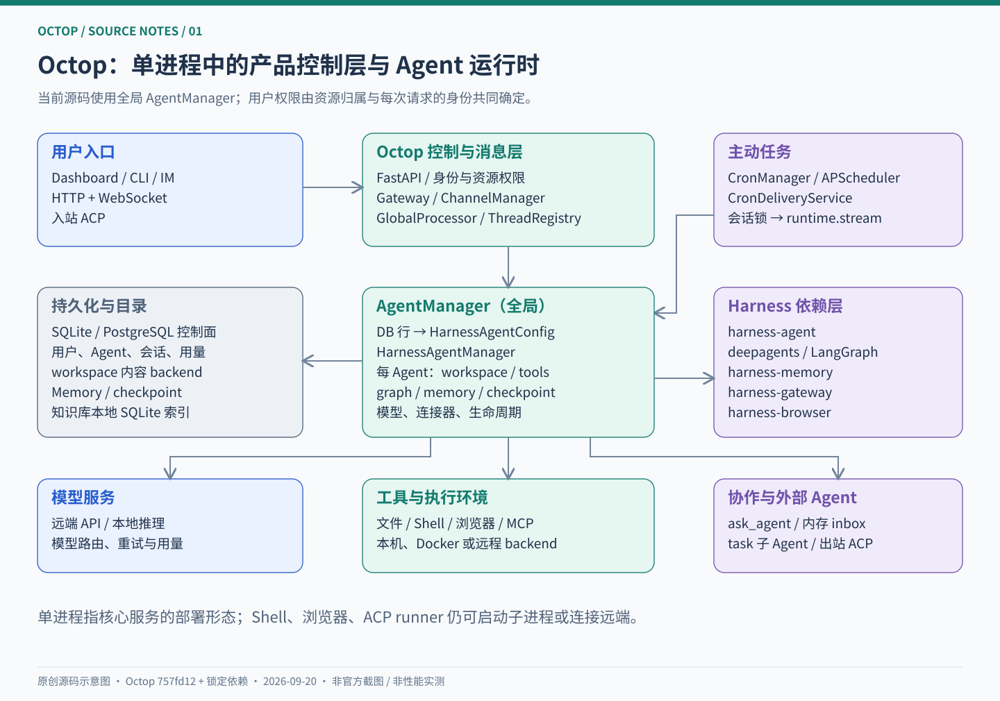
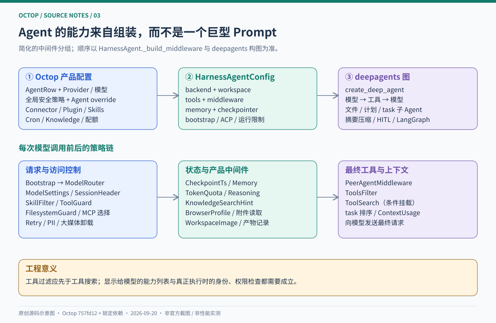
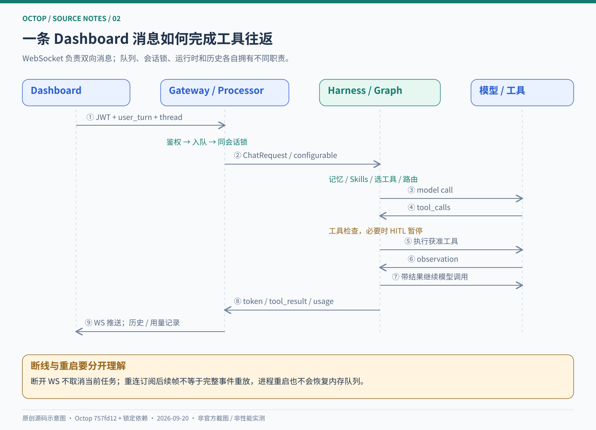
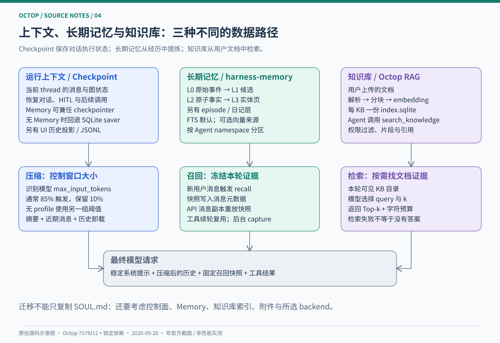
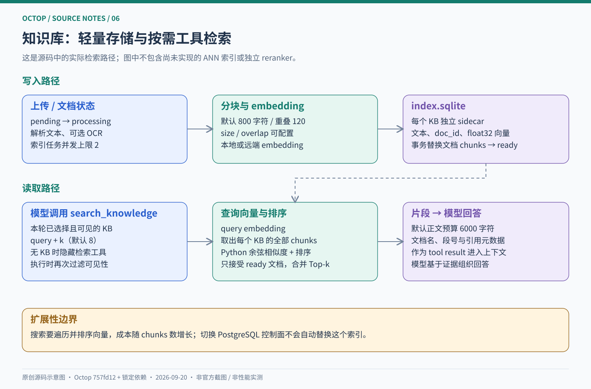
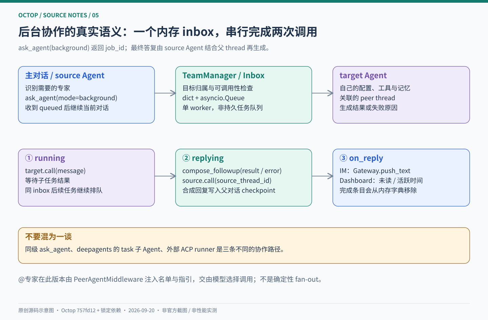
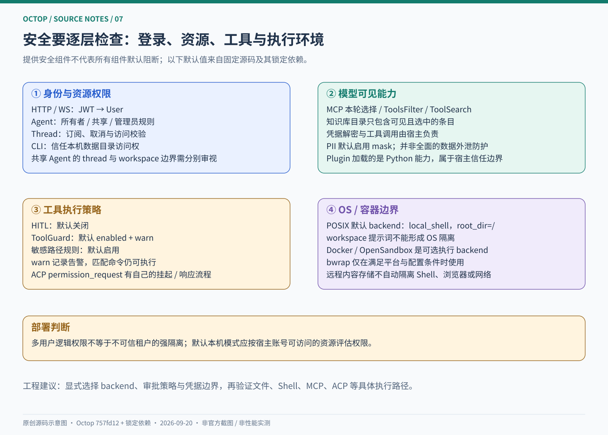
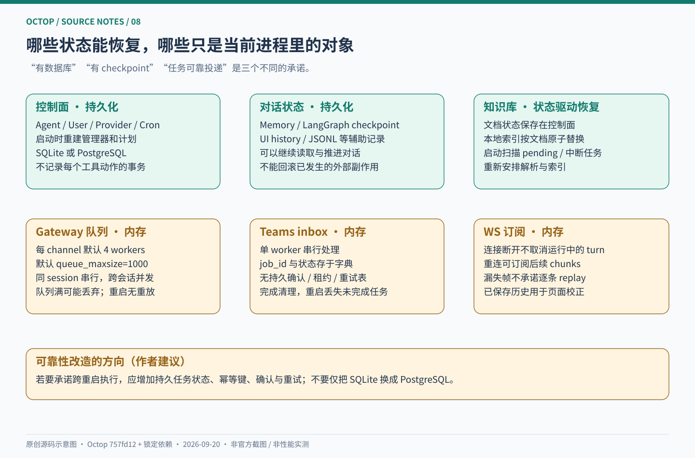

# 深入 Octop：自托管多用户 Agent 平台的架构、运行时与工程边界

把一个大模型接上工具，只解决了 Agent 工程的一小部分。真正的产品还要回答：不同用户的消息如何路由？同一个会话能否被并发修改？用户关闭页面后任务怎么办？长期记忆与聊天历史如何区分？审批挂起之后从哪里恢复？所谓“多 Agent”究竟是多个配置，还是可靠的任务协作？

Octop 值得研究的地方，正是它把这些问题放进了一个可以自行部署的产品：Python 后端、React 控制台、CLI、IM 通道、定时任务、知识库和外部 Agent 接入。**从源码看，它的核心价值是 Agent 产品控制层与运行时集成：Octop 管身份、资源、生命周期和交互，Harness 系列库承接通用 Agent 能力，Deep Agents 与 LangGraph 承接底层执行图。** [服务组装][server] [Agent 组装][manager] [运行图实现][h-agent]

本文沿实际代码解释它的实现，也讨论这些实现能支持怎样的部署承诺。所有图均为依据固定源码绘制的原创工程示意图。



## 阅读基线与导航

| 项目 | 本文基线 |
| --- | --- |
| 官方仓库 | [TencentCloud/Octop](https://github.com/TencentCloud/Octop) |
| 源码快照 | `main`，提交 [`757fd12e5dcae7f9303dbfbbf6321a6986694a8b`](https://github.com/TencentCloud/Octop/commit/757fd12e5dcae7f9303dbfbbf6321a6986694a8b) |
| 提交时间 | 2026-09-19 09:34:38 +08:00 |
| 调研日期 | 2026-09-20 |
| 项目版本声明 | `1.0.1`，来自 `pyproject.toml`，不另行推断为最新稳定发行版 |
| 后端 / 前端 | Python ≥3.12；FastAPI、uvicorn、asyncio；React 18、TypeScript、Vite、Ant Design |
| 固定运行依赖 | `orcakit-harness-agent 1.0.11`、`harness-memory 0.9.10`、`harness-gateway 0.9.8`、`harness-browser 0.7.9` |
| 底层图相关依赖 | `deepagents 0.7.9`、`langgraph 1.2.11`，来自 `uv.lock` |
| 许可证 | MIT；依赖各自遵循其许可证 |
| 验证范围 | 固定源码阅读；4 个依赖源码包 SHA-256 校验；10 项上游代码隔离验证；4 项教学示例测试 |

依赖声明的 `>=` 与锁文件的精确版本不是一回事。本文追踪的是此提交及其锁文件；没有安装全量依赖或启动真实模型、IM、数据库集群与浏览器任务，也没有测量成功率、吞吐量或成本优势。本文中的“当前”均指这个快照。[项目声明][project] [锁文件][lock] [前端依赖][frontend-package] [许可证][license]

建议按以下路线阅读：

| 想解决的问题 | 阅读位置 |
| --- | --- |
| Octop 与 Harness 各做什么？ | 第 1—3 节：产品定位、结构和 Agent 组装 |
| 一条消息到底经过哪些模块？ | 第 4—5 节：会话、流式执行和前端状态 |
| 如何处理上下文、长期记忆与文档？ | 第 6—7 节：记忆与 RAG |
| 多 Agent、MCP、ACP 如何协作？ | 第 8—10 节：能力扩展和任务委派 |
| 是否适合多用户生产部署？ | 第 11—13 节：安全、调度和恢复边界 |
| 如何复现与借鉴？ | 第 14—16 节：实践步骤、验证与工程判断 |

附属文件：[离线网页](index.html) · [源码索引](SOURCE_MAP.md) · [调研与验证记录](RESEARCH_NOTES.md) · [教学示例](examples/README.md) · [机器可读快照](research/snapshot.json)。

<a id="positioning"></a>

## 1. 从 Agent 工程角度定义 Octop

### 1.1 它管理的是一组持续存在的 Agent

Octop 的 Agent 不是一次函数调用的临时变量。一个 Agent 有数据库记录、工作目录、模型配置、人格与专家模板、Skills、连接器、工具开关、记忆和会话。用户可以反复与它交互，也可以让定时任务或 IM 消息进入同一个运行体系。[AgentManager][manager]

这种产品形态带来三个工程重点：

1. **身份连续性**：下一次发消息时，找回的是哪一个用户、Agent 和 thread？
2. **能力连续性**：模型、工具、Skills、连接器发生变化后，运行实例如何热更新或重建？
3. **状态连续性**：历史、记忆、任务与外部副作用，分别由谁保存？

从这个角度看，Octop 更适合作为“如何把 Agent runtime 做成多人可用的自托管产品”的案例。只看工具数量，会错过它最有借鉴价值的部分。

### 1.2 四层实现分工

| 层次 | 具体职责 | 代表实现 |
| --- | --- | --- |
| 产品与控制面 | 用户、Agent、配置、权限、知识库、插件、用量、定时任务 | Octop `infra/`、DB repos、FastAPI routers |
| Agent 运行时适配 | 配置组装、模型路由、MCP/ACP、记忆中间件、安全策略、同级 Agent 调用 | `harness_agent.HarnessAgent` / `HarnessAgentManager` |
| 执行图与通用能力 | 模型—工具循环、计划、文件工具、子 Agent、摘要、图中断与状态推进 | `deepagents.create_deep_agent`、LangGraph |
| 接入与环境 | 通道队列、消息归一化、浏览器、Shell、存储 backend | harness-gateway、harness-browser、backends |

`orcakit-harness-agent` 是发行包名，Python 导入仍是 `harness_agent`。调研或排障时必须同时记录发行版本和导入路径；否则很容易读到同名库的另一个版本。[依赖声明][project] [图构建][h-agent]

### 1.3 源码中的“单进程”指什么

核心服务由一个 Python 进程组装：API、Gateway、Agent 注册表、Cron 等直接调用彼此，不要求部署 Redis、RabbitMQ 或独立 Agent worker 集群。这个取舍降低了个人、家庭和小团队的安装成本。[启动实现][server] [架构决策][adr]

但 Shell、浏览器和 ACP runner 仍可能启动子进程，远端模型和存储也可能位于外部。**“核心服务单进程”不是“系统永远只有一个进程”，也不是“所有数据绝不离开本机”。** 是否调用云模型、远程 embedding 或第三方连接器，取决于具体配置。

## 2. 仓库地图与启动流程

### 2.1 读代码应从哪里进入

```text
src/octop/
├── launch.py                  将 OctopServer、FastAPI、uvicorn 接起来
├── config.py                  进程配置与环境变量
├── api/
│   ├── common/agent.py        Agent 访问和所有权判断
│   └── routers/chat/          WS、HITL 恢复、历史与轨迹接口
├── cli/commands/              CLI 与入站 ACP
└── infra/
    ├── server.py              根组装点与生命周期
    ├── agents/manager.py      全局 Agent 注册与 Harness 配置组装
    ├── gateway/               消息、会话、通道、WS、HITL 协调
    ├── knowledge/             文档解析、索引和检索工具
    ├── connectors/            凭据、OAuth、MCP 连接适配
    ├── cron/                  定时计划与主动投递
    ├── backend/               Agent workspace/backend 配置适配
    ├── history/               UI 历史与可选版本化归档
    ├── trajectory/            执行轨迹记录与实时分发
    └── db/                    数据库工厂、迁移、资源仓储
dashboard/src/                 React 源码
src/octop/dashboard/           随 Python 包分发的前端构建产物
```

建议先读 `server.py` 建立对象关系，再读 `manager.py::_build_harness_config`，然后沿聊天 WS 路由进入 `GlobalProcessor`。一开始就追完所有工具，容易把集成代码与执行内核混在一起。[服务组装][server] [启动入口][launch] [配置组装][manager] [聊天入口][chat-ws]

### 2.2 实际启动顺序

`OctopServer.start()` 先准备路径、环境、日志与配置，扫描专家和子 Agent 目录，再播种、加载已安装插件。首次向导尚未选择数据库时可以延迟绑定控制面；已配置时打开数据库、运行迁移、构造 `SharedServices` 并准备 JWT secret。[`start`][server]

随后 `_boot_runtime()` 的主要动作是：

1. 创建全局 `AgentManager`。
2. 创建轨迹服务，以及条件启用的版本化历史归档。
3. 构造并启动 `Gateway`。
4. 构造 `CronDeliveryService` 与 `CronManager`，加载计划任务。
5. 把 Cron 与 team processor 等能力注入 Agent 注册表。
6. `registry.boot()` 从资源记录重建运行实例；刷新媒体 backend。
7. 启动用户管理和主动关怀调度，把实例放入 `AppRuntime`。
8. 扫描需要恢复的知识库索引任务。

这一流程说明：**数据库保存了可重建的产品配置，管理器和正在执行的异步任务是运行时对象。** 两者不能用“状态都在数据库里”一句话概括。

### 2.3 需要纠正的旧架构图

README 仍能看到 `UserManager → 每用户 HarnessAgentManager → 每 Agent Runtime` 的图。此提交实际使用进程级 `AgentManager`，里面持有一个 Harness manager；用户权限通过资源归属与调用上下文执行。`docs/architecture.md` 已提到全局注册表，但个别目录名、默认 backend 描述和其它专题文档仍滞后。[README 图][readme] [全局注册表][manager] [当前组装][server]

本文以调用点和锁定依赖为准，差异详见 [调研记录](RESEARCH_NOTES.md)。

<a id="runtime"></a>

## 3. Agent 如何被组装出来



### 3.1 `AgentRow → HarnessAgentConfig` 是关键接缝

`AgentManager._build_harness_config()` 把产品层的数据翻译成运行时理解的配置。这段代码集中处理 workspace/backend、模型、Cron 和知识库工具、插件工具与中间件、MCP 连接、ACP runners、安全策略、Skills、记忆参数等。[组装源码][manager]

用非可执行伪代码表达其职责：

```python
row = load_agent_row(agent_id)
workspace = resolve_workspace_and_backend(row)
policy = merge(global_security_policy, row.security_override)

config = HarnessAgentConfig(
    workspace=workspace,
    model=resolve_agent_model_or_global_fallback(row),
    tools=cron_tools + knowledge_tools + enabled_plugin_tools,
    middleware=product_middleware,
    mcp=connectors_for_acting_user,
    skills=agent_skills_and_selected_packages,
    memory=resolved_memory_settings,
)
config = apply_security_policy(config, policy)
```

真正的类参数名应以源码为准；伪代码的重点是**产品实体到运行时配置的单向映射**。新增产品能力时，尽量在这里完成装配，不让底层图依赖 HTTP 请求或数据库表结构。

值得注意，`agent_list` / `ask_agent` 在当前版本由 `PeerAgentMiddleware` 挂载；旧文档中直接 `merged_tools.extend(team_tools())` 的示例不能作为此版本的精确实现。

### 3.2 真正的 Agent Loop 在哪里

`HarnessAgent._init_graph()` 组装 tools、middleware、skills 和 memory 文件，再调用 `_build_graph()`。后者最终调用 `deepagents.create_deep_agent()`，并传入 backend、checkpointer、子 Agent、`interrupt_on` 等。[Harness 构图][h-agent] [Deep Agents 图][d-graph]

其核心语义仍可理解为：

```text
加载 thread 的状态
  → 构造本轮模型上下文与可见工具
  → 模型返回文本或 tool_calls
  → 检查 / 中断 / 执行工具
  → 把 observation 放回消息状态
  → 继续模型调用，直到结束或触发限制
```

但不能把这段简图误认为 Octop 自己写了一个 `while True` 循环。真正决定状态推进、工具回流和中断恢复的是依赖构建的 LangGraph 图。Octop 主要负责输入组装、产品策略和结果投影。

### 3.3 中间件才是工程策略的主要承载点

Harness 的链包含模型路由、模型参数、会话头、Skills 过滤、Shell 检查、文件权限、MCP 过滤、模型重试、PII、大媒体卸载、checkpoint 时间戳、记忆，以及宿主中间件。最后再处理 peer 工具、禁用工具过滤、条件性的工具搜索和上下文用量快照。[中间件装配][h-agent]

Octop 自己加入的策略很具体：

| 中间件 | 解决的问题 |
| --- | --- |
| `TokenQuotaMiddleware` | 本轮执行前检查实际调用用户的累计 token 配额 |
| `ReasoningRequestMiddleware` | 将产品侧推理参数适配给模型调用 |
| `KnowledgeSearchHintMiddleware` | 本轮无知识库则隐藏工具，有知识库则补充目录说明 |
| `BrowserProfileMiddleware` | 传递本轮浏览器 profile 选择 |
| `BinaryReadGuardMiddleware` | 避免把附件类二进制文件当普通文本读取 |
| `WorkspaceImageMaterializeMiddleware` | 调模型前把工作区图像引用转换成模型可消费的输入 |
| `ThreadArtifactsMiddleware` | 将成功工具产生的文件关联到 thread |

这里有两个可复用经验。其一，**按请求修改模型可见工具时，应保持请求局部性**；例如知识库工具通过复制 schema 更新说明，避免修改一个共享工具实例后污染其它用户。其二，**禁用工具过滤要先于工具搜索**，否则被隐藏的能力仍可能出现在搜索目录中。[知识库中间件][kb-hint] [工具搜索装配][h-agent]

### 3.4 模型路由与执行预算

Gateway 构造请求时解析本轮模型覆盖、Agent 默认模型以及多模态需求，Harness 的模型路由中间件在模型调用时选择实例。模型不是在服务器启动时永久固定的单例。[请求构造][processor] [Harness 路由装配][h-agent]

Octop 的配置名称也要按源码解释：

| 配置项 | 实际映射 |
| --- | --- |
| `max_iters` | LangGraph 的 `recursion_limit`，不是严格的“LLM 请求次数” |
| `max_input_length` | 模型输入窗口上限覆盖 |
| `temperature` / `top_p` / `max_tokens` | 本轮模型调用参数 |
| 用户 token quota | 在 `before_agent` 阶段检查已记录的累计用量 |

图步骤、模型次数、工具次数、墙钟时间、实际费用是不同量纲。**配额前置检查不等于每个流式 token 的原子预扣。** 并发任务可能同时通过检查，因此将其改成严格计费预算，需要额外的预留与结算机制；这是工程推论，不是本文测得的线上问题。[参数映射][limits] [配额检查][quota]

## 4. 一条消息的完整调用链



### 4.1 WebSocket 入口负责身份与帧语义

普通 Dashboard 聊天入口是 `/api/agents/{agent_id}/chat/ws`。它先解析 token、确定用户，执行 Agent 访问检查，再注册 WebSocket 连接。帧类型包括 `user_turn`、`subscribe`、`cancel`、`ping`。[WS 路由][chat-ws]

一个 `user_turn` 大致经历：

1. 用 Pydantic 校验帧和内容。
2. `prepare_dashboard_turn()` 解析 thread、MCP、Skills、附件和模型选择。
3. 构造统一的 `InboundMessage`，写入用户身份与 thread 等 metadata。
4. 把连接订阅到 thread。
5. `ChannelManager.enqueue()` 把消息放进 Dashboard 通道队列。

因此 WS 接收循环可以继续处理控制消息，不必一直阻塞等待模型生成结束。取消消息、订阅消息还会核对 thread 的 Agent 和用户归属；Agent 可访问不等于任意 thread 都可访问。[帧处理][chat-ws] [turn 准备][chat-turn]

### 4.2 Session key 与 thread ID 分别解决什么

默认会话键形如：

```text
<agent_id>:<channel_type>:<channel_subject_id>:<dm|group>
例如：A:dashboard:42:dm
```

`session_key` 表示一个可投递的通道会话，`thread_id` 表示一段实际对话状态。`ThreadRegistry` 维护两者的绑定；新建、切换、重置对话可以改变 thread，同时保留通道会话身份。[会话注册表][threads]

这解释了为什么不能简单使用“用户 ID 就是会话 ID”：同一用户可能有多个 Agent、Web 与 IM 两个入口、多个历史 thread；群聊还需要群身份与单聊区分。Registry 中的锁保护创建和绑定操作；它不等于覆盖所有模型执行的全局锁。

### 4.3 队列并发与会话串行

Octop 创建 `ChannelManager(channels={})`，此处沿用锁定版本的默认值：每个 channel 4 个 worker，队列最大 1000。Gateway 使用通道与会话键维护锁，同一会话顺序处理，不同会话可以重叠等待模型或工具 I/O。[Octop Gateway][gateway] [队列实现][g-manager]

这个设计适合 I/O 等待较多的 Agent 工作负载，但有明确边界：

- worker 是异步任务，不是隔离进程。
- 队列在内存里，进程重启没有消息重放。
- 队列满的代码路径会记录日志并丢弃 payload，不能据此承诺可靠消息投递。
- gateway 的会话锁只覆盖经过它的路径，不能自动推广到所有 peer、ACP 或直接 runtime 调用。

### 4.4 `GlobalProcessor` 把产品请求变成运行时请求

Web 使用 `iter_turn_chunks()`；IM 使用 `__call__()`，再把流投影为通道理解的 `MessageEvent`。核心工作包括 slash 分发、session/thread 解析、多模态输入处理、模型选择、本轮 MCP/知识库选择、history tracker、trajectory 与 usage 记录。[Processor][processor] [多模态组装][request]

图片在数量、大小和格式允许时转为视觉输入；不适合内联的内容可以降级为工作区路径提示。上传文件应已经位于 Agent workspace 的 `inbound/` 下，而不是把浏览器预览 URL 直接当作可靠的模型输入。[附件转换][chat-turn] [内容构建][request]

执行层调用 `AgentManager.stream()`，再委托 Harness。返回的 `token`、`tool_result`、`hitl_required`、usage 等事件被附加产品所需的工具信息、附件信息与历史记录。**流式事件是执行过程的展示视图，不是唯一的持久状态来源。**

### 4.5 不是所有入口都逐行经过同一个 Processor

“统一运行时”是成立的，但“每一种入口都调用同一个函数”过度简化了当前实现：

| 入口 | 当前主要路径 |
| --- | --- |
| Dashboard | WS → ChannelManager → `GlobalProcessor.iter_turn_chunks` → runtime |
| IM | ChannelManager → `GlobalProcessor.__call__` → stream 投影 |
| Cron `agent` 任务 | `CronDeliveryService` 在会话锁下构造请求，直接调用 `AgentManager.stream` |
| 同级 Agent | `TeamManager` 直接调用目标 runtime，借助宿主 hook 关联历史 |
| 入站 ACP | CLI 启动服务并取得 HarnessAgent，交给 ACP server |

如果新增审计、预算或安全规则，只放在一个 HTTP 路由里，可能漏掉其它入口。应根据规则作用范围，把它放在公共运行时中间件、能力执行层或明确共享的服务中。[定时投递][delivery] [同级调用][h-team] [ACP 入口][acp-cli]

## 5. 前端流式状态与中断恢复

### 5.1 为什么聊天状态不全放在 React 组件里

`dashboard/src/pages/Chat/hooks/chatStore.ts` 把 WebSocket 与累积消息放在模块级 store，组件订阅状态快照。这让页面切换与组件重挂载不必成为任务取消的原因。[前端状态][frontend]

后台 WS 的 `finally` 仅注销连接，特意不取消正在运行的 turn。重连后客户端可以 `subscribe`，服务器报告 `turn_status`，客户端继续接收后续片段。它提供的是源码注释所说的弱流恢复：**恢复订阅，不代表服务器保存并逐条补发了断线期间所有 token。** 历史重载负责校正已保存内容。[WS 生命周期][chat-ws]

这是一个有用的产品取舍：普通页面操作不应让长任务消失；与此同时，UI 也不应把重连误判为任务重新开始，造成重复请求或重复统计。

### 5.2 HITL 是图中断，不只是一个弹窗

HITL 即 human-in-the-loop，指在工具执行等步骤等待人的决策。Harness 会把工具中断转换成 `hitl_required`；Processor 把请求注册到 HITL 协调器。用户提交决策后，经 `/chat/hitl/resume` 恢复运行。此恢复路由仍使用 SSE 返回后续流，普通聊天则已经采用 WS。[HITL 注册][processor] [恢复路由][chat-routes] [中断装配][h-agent]

需要区分三种“等待”：WebSocket 断线是传输问题；HITL 是运行图主动暂停；进程退出是运行实例生命周期结束。有 checkpoint 是恢复图状态的基础，但不能单独证明审批记录、客户端订阅和所有外部执行上下文都能跨重启无缝恢复。

<a id="memory"></a>

## 6. 上下文、长期记忆和历史：至少四种存储语义



### 6.1 不要把所有 Markdown 和 SQLite 都叫“记忆”

| 数据 | 主要目的 | 生命周期 / 归属 |
| --- | --- | --- |
| Prompt 文件与 Skills | 规定角色、行为和完成任务的方法 | Agent workspace 内容 |
| LangGraph checkpoint | 保存执行图与当前 thread 的消息状态 | 会话执行状态 |
| 长期记忆 | 跨 turn 提炼、召回事实与经历 | Harness Memory namespace |
| UI 历史、轨迹、JSONL | 展示、查询、记录和诊断 | 各自的产品数据与归档路径 |
| 知识库索引 | 从上传文档中寻找相关证据 | 知识库资源与文档状态 |

这些数据可以共用一个物理数据库，也可以分开；物理位置相同不意味着语义相同。

### 6.2 Memory 还可以兼任 checkpointer

Harness `_resolve_checkpointer()` 的优先级是：显式关闭；显式提供 saver；复用已创建的 `Memory`；最后回退到异步 SQLite saver。Memory 继承 checkpoint saver 的接口，所以长期记忆与图状态可以共用底层存储。[checkpointer 选择][h-agent]

Octop 在 SQLite 控制面下默认交给 Harness 使用文件记忆；控制面为 PostgreSQL 时，默认把同一 DSN 传给 Memory，但仍能为某 Agent 显式指定 SQLite。namespace 由 Agent ID 派生，而非仅用用户可改名的显示名称。[记忆 backend][memory-backend] [namespace 与配置][manager]

新 Agent 的系统文件通常位于 workspace 的 `.octop/` 前缀下；旧布局有兼容路径。因此备份时不能假定所有版本都把 `memory.sqlite` 放在 workspace 根目录，也不能只备份控制面的 `octop.db`。[路径选择][memory-backend] [workspace 装配][manager]

### 6.3 长期记忆有写入、蒸馏、召回三条路

Harness 的 `MemoryRuntime` 创建 `Memory`、`MemoryService`、辅助模型客户端以及中间件。`MemoryService` 提供 recall/search/get 与 capture/extract 等语义接口。[MemoryRuntime][h-memory] [MemoryService][m-service]

可把数据演进理解为：

```text
模型交互
  → L0 原始事件
  → 抽取 L1 候选
  → 晋升为 L2 原子事实
  → 聚合 / 重生成 L3 实体页
  → 在后续任务中按查询召回
```

库还包含 episode/日记等层次，不是只保存一个不断变长的 `MEMORY.md`。辅助 LLM 负责抽取与蒸馏；没有可用辅助模型时，原始捕获与 FTS 召回仍有独立价值，但不能假定结构化事实已成功生成。[分层概念][m-readme] [服务接口][m-service]

此锁定版本默认打开记忆、自动召回和捕获；自动抽取默认使用 idle 模式，静默 300 秒触发。可改为 interval 模式，默认间隔 21600 秒，即 6 小时。两种计时触发互斥。Octop 把用户选择的一个辅助模型引用映射到 Harness 的 light/heavy 兼容字段。[默认配置][h-config] [计时器装配][h-memory] [参数适配][manager]

### 6.4 召回结果冻结在用户 turn 上

这里有一个很值得借鉴的上下文设计：新用户消息进入 `before_model` 时，Memory middleware 获取召回结果并把快照附到消息元数据；发送给模型时，在消息副本上重放召回内容。工具续轮沿用这个快照，历史消息也沿用当时的证据。[记忆中间件][h-memory-mw]

它避免同一轮工具执行过程中长期记忆变化，导致模型前后看到不同证据；同时减少反复改写 system prompt。捕获则通过后台任务执行，不要求每一条原始事件都在用户响应前完成落盘。

召回不是固定的“对所有文本做向量 Top-k”。Memory 的查询管线包含查询解析、实体/时间/指代路由、多来源候选、重排、多样性与去重、预算控制。默认主要使用 atom 与 raw 的全文检索；有实体锚点时可加入实体页，有向量索引时才加入 vector 来源。[召回管线][m-recall] [来源选择][m-router]

### 6.5 自动摘要与长期记忆不是替代关系

Deep Agents 的 `compute_summarization_defaults()` 在模型具有有效 `max_input_tokens` profile 时，使用约 85% 的阈值触发，保留约 10% 的窗口；没有该 profile 时，回退为 170000 token 触发、保留 6 条消息，并采用另一套工具参数截断条件。[默认值源码][d-summary]

Harness 还将 recall 快照计入摘要 token 估算，并保留主 Agent 的 summarization middleware 实例供 `/compact` 使用。[摘要集成][h-agent]

这里的比例不是模型请求最终长度的绝对保证。系统提示、工具 schema、媒体和 token 估算误差都应考虑。本文的隔离验证确认了两组默认值的返回结果，没有验证真实模型在边界上下文长度下的完成能力。

**工程含义：摘要解决“这次请求放得下”，长期记忆解决“以后还能记得”，历史归档解决“事后能查到”。** 三者不能互相替代。

## 7. 知识库 RAG 的真实实现



### 7.1 写入：状态驱动的索引任务

`process_document()` 读取文档，标记 processing，解析文本并按配置执行 OCR，再分块、生成 embedding、替换向量索引，最后更新为 ready；异常时记录 failed。索引调度使用 `asyncio.Semaphore(2)`，重活经 executor 离开主事件循环。[索引任务][kb-jobs]

默认分块大小为 800 **字符**，重叠 120 字符，步长 680；这不是 token 分块，也不是依据标题或句法的语义分块。参数可由设置覆盖。[分块函数][kb-chunk] [参数读取][kb-params]

对一个 1600 字符输入，默认得到长度 `[800, 800, 240]` 的三个块。这个结果已在隔离验证中用上游原函数确认。分块越细，召回可能更聚焦，但 embedding 数量、索引体积和跨块信息损失也会变化，不能只以块数多寡判断质量。

### 7.2 存储：每个知识库一份 SQLite sidecar

`KnowledgeIndex` 把索引写到 `knowledge/<kb_id>/index.sqlite`。chunks 包含 `chunk_id`、`doc_id`、ordinal、文本、embedding BLOB 与 metadata；向量以 float32 编码。一份文档的旧块删除和新块插入在同一 SQLite 事务中完成。[索引实现][kb-index]

即使控制面换成 PostgreSQL，此代码仍使用本地 SQLite sidecar。不能根据系统支持 PostgreSQL，就推导出知识库已切成 pgvector。

### 7.3 检索：由模型选择何时调用工具

本轮可见且选中的知识库会被写进请求配置。`KnowledgeSearchHintMiddleware` 将知识库名字和简介放进 `search_knowledge` 的 description；如果本轮没有知识库，直接把工具移出模型可见列表。[工具说明][kb-tools] [按轮过滤][kb-hint]

因此正常链路是：

```text
用户提问
  → 模型看到可用知识库目录
  → 模型调用 search_knowledge(query, k)
  → 返回有来源的文档片段
  → 模型结合片段作答
```

这属于工具驱动的 Agentic RAG。它不是在每一轮进入模型前无条件检索一次；工具说明只能影响模型选择，不能保证每个需要引用的回答都一定先检索。

### 7.4 算法：全量遍历余弦相似度，再排序

`KnowledgeIndex.search()` 从 SQLite 读取所有块，解包向量，用 Python 计算余弦相似度，再排序返回 Top-k：

```text
score(q, x) = Σ(qᵢ × xᵢ) / (√Σqᵢ² × √Σxᵢ²)
```

若索引含 N 个块、向量维度为 d，单库向量打分约为 `O(Nd)`，全量排序约为 `O(N log N)`，还需要装载向量与文本。这是根据代码结构推导的复杂度，不是吞吐基准测试。[搜索实现][kb-index]

上层检索先确认知识库可见性，再过滤 ready 文档，从多个库取候选并统一排序，默认最终 `k=8`。格式化正文的默认预算为 6000 字符；其余前导说明、分隔符与引用元数据还可能带来额外长度，因此不要把它当成整个 tool result 的硬长度上限。[检索与格式化][kb-retrieve]

### 7.5 工程评价与改进方向

这个实现部署依赖少，路径直观，便于先做小规模私有文档检索。要支持更大规模或更严格的答案质量，需要解决的也是具体问题：

- **检索扩展性**：替换全量遍历为适当的索引或外部检索服务，并验证过滤条件能够正确下推。
- **证据粒度**：保留标题、页码、段落边界；目前固定字符窗可能切开表格或论证。
- **查询质量**：加入是否需要检索、查询改写、召回与答案引用覆盖率的评测。
- **embedding 一致性**：更换模型时重建索引；源码跳过维度不匹配向量，但“同维度、不同语义空间”仍不能直接比较。
- **失败可观测性**：检索部分异常会记录日志并返回空内容，用户层面的“没有找到相关段落”可能需要与索引故障区分。

这些是本文的工程建议，不是现有实现已经提供的能力。上游隔离验证覆盖了排序、替换、维度不匹配与零向量拒绝等基础语义。[验证结果](research/probe-results.json)

<a id="capabilities"></a>

## 8. 专家、Skills、插件与 MCP：四种扩展单元

### 8.1 专家模板负责配置和内容复用

专家目录包含角色内容、manifest、Skills 和可选子 Agent 文件。创建 Agent 时播种模板到 workspace，随后运行时加载这些内容。MBTI、人设和自定义 system prompt 主要改变行为指引，不会额外训练一套模型。[模板播种][manager]

从工程上看，一个专业 Agent 的效果来自多项共同作用：合适的模型、清晰的任务边界、领域工具、文档与流程，以及可检查的输出。只有人格描述，很难得到稳定的专业能力。

### 8.2 Skills 是方法与资源，工具是执行契约

Skills 目录经配置传入 Deep Agents，Harness 还处理禁用集合、额外 skill 目录和工作区目录发现。它表达“完成某类任务应读什么、按什么步骤做”，工具则表达可调用的参数和实际副作用。[Skills 配置][manager] [构图传入 skills][h-agent]

例如，发布报告的 Skill 可以规定查证、结构与审阅步骤；写文件工具或 MCP 工具负责真正创建文档。两者一起使用，才把行为方法与执行能力接起来。

### 8.3 插件进入宿主进程的信任边界

启动时 `PluginManager.seed_bundled()` 准备随包插件，`load_installed(install_deps=True)` 加载已安装插件。Agent 配置组装会合并全局插件状态与 Agent 开关，注册工具与中间件；还会把不符合模型工具命名要求的名字转换为可绑定名称。[插件管理][plugins] [挂载流程][manager]

插件可以贡献可执行 Python 能力和中间件，因此“可安装”不是“天然隔离”。审查插件时应把它当成服务端代码依赖，检查执行权限、依赖来源和升级策略。模型工具审批只能约束相应工具路径，无法替代宿主插件代码的信任决策。

### 8.4 Connector 把外部账号能力适配成 MCP

Connector 管理用户的外部服务实例、凭据与授权。builder 根据连接类型生成远端 MCP 配置，或指向 Octop 的内部 MCP gateway。内部 URL 带随机 token；特定连接器还会规范化工具参数别名、允许的工具和认证头。[连接构建][connectors]

凭据使用 Fernet 加密，密钥经 `SecretRepo` 保存或获取。这提供应用内的加密存储机制，但不等价于独立 KMS：如果攻击者能同时读取凭据和用于解密的 secret，仍需依赖数据库、文件与主机访问控制。[凭据加密][crypto]

尤其对共享 Agent，工具实际使用谁的连接器很重要。组装代码显式处理 owner 与本轮用户覆盖，并维护按用户区分的 MCP 缓存。Agent 拥有者、消息发送者、外部服务授权主体必须在实现与测试中分别确认，不能仅用 Agent 名称作为凭据隔离键。[用户相关组装][manager]

## 9. 多 Agent：三条不同的协作路径



### 9.1 先区分“多个 Agent”与“Agent 之间协作”

| 机制 | 被调用者 | 状态和调用特点 |
| --- | --- | --- |
| `ask_agent` | 注册表中的另一个持久 Agent | 使用目标 Agent 的配置、工具与记忆；支持同步或后台 |
| `task` / subagent | Deep Agents 构图时配置的子 Agent | 属于当前运行图的子任务能力，不等同于一个 Octop 用户资源 |
| ACP runner | 外部 Coding Agent 进程 | 外部 Agent 有自己的会话、工具与权限协议 |

三者可能都在 UI 中表现为“委派任务”，但它们的身份、上下文继承、失败处理和恢复机制不同。[Harness 图与子 Agent][h-agent] [Teams][h-team] [ACP 会话][h-acp-service]

### 9.2 当前 `@专家` 是模型指引，不是确定性调度

锁定版本的 `PeerAgentMiddleware` 检测最新用户消息里的 `@`，按当前用户和 Agent 查询可调用专家，把名单与指引追加到本轮 system message，同时挂载 `agent_list` / `ask_agent` 工具。具体调用仍由模型产生。[peer 中间件][h-peer]

这与旧专题文档中的 `apply_mentions → 并行调用 → 注入结果` 不同。当前设计支持模糊名字和按语义选择专家，但也意味着 `@` 本身不构成“指定任务必然已经提交”的执行确认。若产品要求确定性路由，应在应用层解析并显式调度，同时展示真实 job 状态。[旧文档][team-doc]

### 9.3 同步 `ask_agent`

`TeamManager.call_peer()` 解析并校验目标、构造 peer 请求、等待目标调用，返回一次性结果。Octop 通过 `prepare_peer_session()`、`record_peer_turn()` 将目标 thread 与产品历史关联。[同步调用][h-team] [宿主回调][processor]

目标 thread 可以由父 thread 与目标 Agent ID 派生，不应按旧示意文档一律理解为“每次随机创建一个全新且无关联的 thread”。这种关联方便追踪任务来源，但仍需要检查上下文共享是否符合产品预期。

### 9.4 后台 `ask_agent` 的完整状态转换

`submit_peer()` 把消息放入 `HarnessAgentInboxManager`，返回 `job_id` 与 queued 状态。源码使用一个字典保存消息，加一个 `asyncio.Queue`，由**全局单 worker 串行消费**。[后台提交][h-team] [inbox 实现][h-inbox]

```text
queued
  → running：target.call(task)
  → replying：compose_followup(result 或 error)
  → source.call(parent_thread_id, followup)
  → done / failed
  → on_reply 通知用户
```

这里最关键的是第二次模型调用：后台任务完成后，不是简单把子 Agent 原文贴到通知里，而是让 source Agent 在原父 thread 上结合上下文重新组织回复。结果自然进入父对话 checkpoint，后续用户能继续追问。

目标调用失败时，worker 仍可让 source 生成解释；不过 Octop 的 `on_reply` 在 failed 状态投递的是 `error_text`。应区分“父线程里可能已有合成回复”和“外部通知最终展示什么”。[失败处理][h-inbox] [通知实现][processor]

### 9.5 后台不等于可靠任务平台

此实现有四个明确边界：

1. 一个慢任务会占住 inbox worker，阻塞后续后台任务；与跨 channel 普通聊天并发是两回事。
2. inbox 不落盘，重启后未完成任务丢失。
3. 正常通知后的终态消息会从字典移除，不是可长期查询的审计任务表。
4. 取消主要设置状态，在阶段之间检查；不能直接理解为立刻杀死所有正在执行的外部动作。

Dashboard 的团队回调主要更新未读与活跃时间；IM 通过 Gateway 推送文本。不能把这条路径描述为对子任务 token 的全程实时转发。[inbox 生命周期][h-inbox] [完成回调][processor]

对需要严格完成承诺的后台任务，建议加入持久任务记录、幂等键、重试策略、deadline 和结果确认。若要按目标并行，还需处理父 thread 并发合成以及共享文件冲突；单纯把 worker 数量调大并不充分。

## 10. ACP：Octop 既能被调用，也能调用别的 Agent

### 10.1 入站 ACP：把 Octop 暴露给 IDE

`octop acp` 启动嵌入式 `OctopServer`，解析选择的 Agent，取得其 Harness 实例，再调用 `run_harness_acp_server()`，使用 stdio 与客户端通信。[CLI ACP][acp-cli]

因此 IDE 能使用 Octop 的 Agent 配置和能力，而不必再实现一个网页聊天客户端。stdio 要保留给协议消息；普通日志应使用适当的日志流。

### 10.2 出站 ACP：把编码任务交给专门的运行时

用户配置 ACP runners，再在某 Agent 上启用委派工具。Agent 组装把 runner 配置传给 Harness，条件满足时注册 `acp_runner`。外部进程可以是 OpenCode、Claude Code 的 ACP 适配器或其它支持的 runner。[Octop runner 设置][acp-settings] [工具装配][h-agent]

ACP runtime 维护会话、消息更新、工具状态与 permission request。遇到权限请求时，它可保存 pending permission，通过 future 等待决策，恢复后继续原任务；硬阻止规则仍可直接拒绝。[ACP client][h-acp] [会话服务][h-acp-service]

这个边界应理解为“Agent 调另一个有自主执行能力的 Agent”，而非“调用一次文本模型”。外部 runner 的工作目录、文件访问、会话复用和审批，都要单独评估。外层 Octop 的某项工具规则也不能自动保证覆盖外部进程所有内部工具。

### 10.3 MCP 与 ACP 的职责分界

| 协议 | 主要连接对象 | 核心语义 |
| --- | --- | --- |
| MCP | 工具、外部数据与服务 | 发现能力、参数化调用、返回结果 |
| ACP | 客户端与 Agent，或 Agent 与外部 Agent | 会话、prompt、更新、取消、权限请求 |

把两者区分开，才能选择正确的观测与治理方式：工具调用追踪输入输出和副作用；Agent 委派还必须追踪其内部任务生命周期与授权决策。

<a id="security"></a>

## 11. 安全与多用户隔离：按执行路径审视默认值



### 11.1 资源访问与资源修改是两个判断

`api/common/agent.py` 区分所有者、共享 Agent 和管理员。共享可以允许使用某 Agent，但修改操作仍需所有者或管理员权限。聊天 thread 的订阅、取消与指定历史 thread 又有相应用户校验。[Agent 权限][access] [聊天校验][chat-ws] [thread 解析][chat-turn]

同时，CLI 默认信任本机对数据目录的访问权。Web JWT 的权限模型不能直接套用到已经能读取服务数据目录的本地账号上。部署时应该明确谁能使用服务 API，谁能访问服务进程与文件系统。

### 11.2 默认策略：有防护，但不全是阻断

| 机制 | 此快照的默认行为 | 不能据此推导什么 |
| --- | --- | --- |
| 工具人工审批 HITL | 关闭 | 不能声称每次高风险工具调用都必经人工批准 |
| Shell ToolGuard | 开启，模式为 `warn` | 命中规则不代表命令已被阻止 |
| 文件权限规则 | 默认包含敏感路径拒绝规则 | 不是内核级文件系统隔离 |
| PII | 开启，默认 `mask`，覆盖指定输入/输出/工具结果面 | 不是覆盖所有凭据与网络行为的数据防泄漏系统 |
| Skill 扫描 | 默认 `warn` | 不能证明任意 Skill 可安全执行 |

Octop `_default_policy()` 明确设置 HITL false、ToolGuard warn；Harness 策略给出文件、PII 和 Skill 默认值。ToolGuard 在 warn 分支记录告警后继续调用 handler；block 与 require_approval 才具有不同执行语义。[Octop 默认值][security] [Harness 策略][h-policy] [工具检查中间件][h-guard]

这些是部署配置事实，不是对存在可利用漏洞的判定。本文没有做渗透测试或隔离逃逸测试。

### 11.3 默认 workspace 不应被解释成默认 OS 沙盒

一个更容易误读的点是 backend。旧架构说明写默认 filesystem rooted at workspace，但当前 POSIX 配置会取 Harness 的 `DEFAULT_BACKEND_SPEC`：`local_shell`、`root_dir="/"`、`virtual_mode=True`；Windows 有把默认 root 缩到 workspace 的分支。[Octop backend][backend] [Harness 默认值][h-backend]

Harness 会把会话产物、卸载文件等放到工作区系统前缀，也会向模型提示优先使用 workspace。**产物目录归属与 Shell 的 OS 访问范围，是不同问题。** `root_dir=/` 不会给进程增加 root 权限，但通常允许其按宿主账号权限访问更广的文件范围。

Docker、OpenSandbox 等执行 backend，以及满足条件时的 bwrap 路径，可以提供另一类隔离机制。是否真的使用它们，必须看配置、平台与运行结果；把服务本身放进一个容器，也不自动等于每个用户或 Agent 有独立容器。

### 11.4 共享 Agent 需要单独设计共享语义

thread 归属检查可以阻止用户直接打开别人的聊天记录，但同一个持久 Agent 仍可能共享 workspace、工具配置和 Agent 级记忆 namespace。由此得出的工程问题是：共享专家应分享能力，还是也分享知识与产物？这需要明确的产品设计与用例测试，不能只看线程隔离就下结论。[Agent namespace][manager] [记忆配置][h-config]

同理，远端存储 backend 提供内容存取，不自动约束本地浏览器、Shell、ACP 或插件。评估多租户时，应沿具体执行路径检查身份、资源、凭据和系统权限四个环节。

## 12. 定时任务、用量与可观测性

### 12.1 Cron 区分直接推送和 Agent 执行

`CronManager.boot()` 从数据库加载计划，通过 APScheduler 注册。任务可以是 `text`：直接投递消息；也可以是 `agent`：运行 Agent 后投递结果。`CronDeliveryService` 统一处理 session、模型、MCP 和知识库选择，并在目标会话锁内执行。[计划管理][cron] [执行投递][delivery]

Agent 型任务直接消费 `AgentManager.stream()`，收集可见文本与用量。若出现 `hitl_required`，当前代码会抛出“需要用户交互”的错误，不把无人值守 cron 自动转换为完整的人机审批工作流。没有可见输出也被视作失败。

这意味着一个在网页对话中能够完成的任务，不一定能直接原样放进 Cron：需要确认凭据、工具权限、模型选择与交互需求都满足无人值守执行条件。

### 12.2 计划恢复不等于补执行每一个漏掉的任务

启动时重建计划可以恢复未来调度。代码为用户任务设置了 `misfire_grace_time=60`，但这并不是所有中断任务的持久重试日志。外部系统已经收到消息而进程在记录完成前退出，仍可能留下难以判断是否应重试的窗口。[计划注册][cron]

对重要投递建议引入业务幂等键、结果状态与重试策略，避免把“有 Cron”当成“恰好执行一次”。

### 12.3 观察用户结果，也观察运行过程

Processor 维护 history tracker、usage tracker 和条件启用的 trajectory。工具开始/结束、用户消息、上下文和用量等记录帮助解释 Agent 为什么产生某个结果；Harness 还支持配置 Langfuse callbacks。[Processor 记录][processor] [服务装配][server] [callback 接入][h-agent]

这里值得分开收集三类信息：用户可见最终答复、完整工具执行轨迹、模型/检索/委派资源消耗。只记录最后文本无法判断 Agent 是否真的执行工具；只看 token 数也不能解释失败。

若基于 Octop 建生产观测，我会优先增加或验证队列深度与丢弃数、单会话等待时间、LLM 首 token 延迟、工具失败率、HITL 等待时间、后台任务端到端时长、RAG 空结果与索引故障比例。这是建议的观测集合，不代表当前内置面板都已提供这些指标。

<a id="reliability"></a>

## 13. 重启恢复与扩展性：应该承诺到哪一层



### 13.1 一张恢复能力表

| 状态 | 当前保存 / 恢复机制 | 判断 |
| --- | --- | --- |
| 用户、Agent、模型与计划配置 | 控制面 DB，启动时重建 | 配置可恢复 |
| 对话图与消息 | Memory/checkpointer，另有历史记录 | 可读取已保存状态，继续对话仍取决于相应运行路径 |
| 知识库未完成索引 | 文档状态持久化，启动扫描重新调度 | 有显式的索引重启恢复路径 |
| ChannelManager 入站队列 | 内存 queue | 重启不自动重放 |
| Teams inbox | 内存字典、单 worker queue | 未完成任务不跨重启恢复 |
| WS 连接与订阅 | 内存集合与回调 | 客户端需要重连订阅 |
| 工具已产生的外部副作用 | 由各工具或外部系统负责 | 无法从 checkpoint 单独推出 exactly-once |

依据分别来自启动、索引任务、Gateway 和 inbox，而不是只依据“所有状态可重建”的概括性描述。[启动][server] [索引恢复][kb-jobs] [Gateway][g-manager] [inbox][h-inbox]

### 13.2 PostgreSQL 不会自动把它变成分布式 Agent 平台

控制面支持 PostgreSQL，有助于更换数据库能力与运维方式。但全局注册表、通道连接、inbox、WS 订阅与调度仍是进程内状态。不能仅增加多个 uvicorn worker 或服务副本，就假定这些状态被正确共享。[数据库工厂][db] [服务组装][server]

多副本还需要定义谁拥有 IM 长连接、谁负责某条 Cron、哪一个 worker 执行某个 thread，以及谁给用户推流。可行的改造方向包括持久任务队列、分布式租约、会话调度归属和共享事件日志；这些属于架构扩展，不是修改数据库 URL 就能得到的能力。

### 13.3 本地化部署的优势与代价

优势是组装关系直接、没有必须外置的消息基础设施，适合快速部署与调试。代价是宿主进程故障影响范围集中，CPU 密集型工作必须避免阻塞事件循环，隔离与扩展需要额外设计。

值得肯定的一点是，知识库索引已经使用 executor 与限流；但不能因为这一模块处理了阻塞，就自动推断所有第三方插件或工具都不会阻塞。需要在实际工具集合上测量。

<a id="practice"></a>

## 14. 如何按本文版本复现与阅读实现

### 14.1 固定代码和依赖

下面是基于仓库安装方式整理的复现步骤，**本次没有执行全量安装和启动**。使用可写的专用工作目录与独立 Python 环境：

```bash
git clone https://github.com/TencentCloud/Octop.git
cd Octop
git checkout 757fd12e5dcae7f9303dbfbbf6321a6986694a8b

# 按锁文件安装；不要先升级依赖再把结果当成本篇的固定版本。
uv sync --frozen

# 使用独立数据目录，避免影响已有 Octop 配置。
export OCTOP_HOME="$PWD/.octop-research-data"
uv run octop init
uv run octop run --host 127.0.0.1 --port 8088
```

`OCTOP_HOME` 是应用实际读取的数据根目录变量。Docker Compose 中的 `OCTOP_DATA` 用于宿主挂载路径插值，两者不能混用。[路径解析][paths] [Compose 配置][compose]

如果源码安装后没有控制台构建产物，可在另一个终端构建：

```bash
cd Octop/dashboard
npm ci
npm run build
```

具体构建输出与仓库 Makefile 保持一致。通过 UI 配置模型提供方、凭据和可用模型；首次仅跑一个读写专用 workspace 的任务，再逐步启用真实外部工具。这里不提供未经实测的业务 API payload，避免拿内部伪代码冒充稳定的 HTTP 契约。

### 14.2 一次有价值的功能验收

| 场景 | 观察重点 |
| --- | --- |
| 同 thread 连续发两条消息 | 是否按会话顺序执行，取消是否及时 |
| 两个 thread 同时发消息 | 是否能跨会话并发，资源预算如何累计 |
| 生成中关闭页面再回来 | 任务是否继续，历史和流是否正确校正 |
| 上传文档再提问 | 文档是否 ready，是否真实调用 `search_knowledge`，引用是否匹配 |
| `ask_agent` 同步与后台 | 目标/父 thread 归属、回调状态、失败通知 |
| 审批暂停、拒绝与恢复 | 哪个工具请求被暂停，拒绝是否阻止该动作 |
| 重启服务 | 分别检查配置、history、索引、inbox，而非只看首页能否打开 |
| 共享 Agent 由两个用户使用 | thread、workspace、Memory 和 Connector 的共享策略是否符合预期 |

这些是建议补充的集成验收，不是本次已执行的测试清单。

### 14.3 最小教学实现：先理解后台协作语义

随文的 [inbox_demo.py](examples/inbox_demo.py) 只使用 Python 标准库，用模拟 Agent 展示提交立即返回、单 worker 执行、父 thread 合成和失败通知：

```bash
python3 project/octop/examples/inbox_demo.py
python3 -m unittest discover -s project/octop/examples -p 'test_*.py' -v
```

预期先得到 `agent_calls_so_far: 0`，随后调用顺序是：

```text
检索专家 → 主助手（父 thread）→ 架构专家 → 主助手（父 thread）
```

这个示例不是 Octop SDK，也没有复刻 LangGraph、真实 LLM、审批或持久化。它刻意把任务保留在内存里，让读者能直接观察为什么“后台排队成功”和“跨重启保证完成”是不同语义。完整差异见 [示例说明](examples/README.md)。

## 15. 本次究竟验证了什么

### 15.1 直接执行上游的小范围代码

[probe_upstream.py](scripts/probe_upstream.py) 在校验源码哈希后加载上游的 `PathLayout`、分块函数和 `KnowledgeIndex`。这些模块只需标准库；脚本用空父包壳避免触发整个应用的可选依赖导入，业务函数体不改写。摘要默认值函数通过 AST 单独抽取执行。

| 检查 | 结果 |
| --- | --- |
| 默认 800/120 分块长度与重叠 | 通过 |
| 非法 overlap 拒绝 | 通过 |
| 两个简单向量的余弦排序 | 通过 |
| 无效替换不破坏旧索引内容 | 通过 |
| 同文档重建执行替换而非追加 | 通过 |
| 不同维度向量不参与当前查询 | 通过 |
| 零查询向量拒绝 | 通过 |
| 有 profile / 无 profile 两组摘要默认值 | 通过 |

表中有合并展示的项目，共 10 项断言；另有教学示例 4 项测试。原始结果保存于 [probe-results.json](research/probe-results.json)，复现方法见 [调研记录](RESEARCH_NOTES.md)。

### 15.2 尚未验证的内容

没有运行 Octop 上游完整 pytest、前端构建、`make all` 或真实模型端到端流程；没有测量真实任务成功率、检索准确率、隔离安全性、跨平台兼容性和 PostgreSQL 行为。本文是固定版本的实现调研与局部语义验证，不能充当生产认证或性能评测报告。

## 16. 一个 Agent 工程师会带走哪些设计

最值得复用的第一项，是**将 Agent 的产品资源与执行 runtime 分层**：用户、模型配置、权限与生命周期由控制层管理，底层图负责执行。这样才能让 Web、IM、CLI 和计划任务复用能力，同时保留各入口需要的产品语义。

第二项是**把 session、thread 和 job 分开建模**。通道会话负责可达性，thread 负责上下文，job 负责待执行工作。Octop 的前两者已有清晰落点；后台 inbox 的边界则说明，当任务需要可靠交付时，job 本身也必须拥有持久生命周期。

第三项是**让上下文生成过程可解释**。固定的召回快照、按轮知识库目录、工具过滤顺序、摘要预算与用量记录，都在回答“模型这一轮实际看到了什么”。这通常比给 system prompt 再加几百行规则更有工程收益。

第四项是**按真实执行路径验证权限**。网页鉴权、共享专家、MCP 用户凭据、Shell backend、ACP 外部进程和插件代码各有边界。单一“安全开关”无法替代逐层检查。

对于个人、家庭或小团队，Octop 提供了一个完整且可读的自托管 Agent 产品实现，尤其适合学习多入口集成、配置驱动的运行时装配与记忆接入。对于不可信租户隔离、大规模并发或必须跨重启完成的后台业务，应先补足执行隔离、持久任务调度、会话归属与业务幂等，再提出相应的服务承诺。

---

本文的源码链接固定到具体提交；依赖链接指向锁定源码包的证据索引。完整文件哈希、函数行号、文档差异与验证范围见 [SOURCE_MAP.md](SOURCE_MAP.md)、[research/snapshot.json](research/snapshot.json) 和 [RESEARCH_NOTES.md](RESEARCH_NOTES.md)。

[project]: https://github.com/TencentCloud/Octop/blob/757fd12e5dcae7f9303dbfbbf6321a6986694a8b/pyproject.toml
[lock]: https://github.com/TencentCloud/Octop/blob/757fd12e5dcae7f9303dbfbbf6321a6986694a8b/uv.lock
[readme]: https://github.com/TencentCloud/Octop/blob/757fd12e5dcae7f9303dbfbbf6321a6986694a8b/README.md
[architecture]: https://github.com/TencentCloud/Octop/blob/757fd12e5dcae7f9303dbfbbf6321a6986694a8b/docs/architecture.md
[adr]: https://github.com/TencentCloud/Octop/blob/757fd12e5dcae7f9303dbfbbf6321a6986694a8b/docs/adr/001-single-process-model.md
[server]: https://github.com/TencentCloud/Octop/blob/757fd12e5dcae7f9303dbfbbf6321a6986694a8b/src/octop/infra/server.py
[launch]: https://github.com/TencentCloud/Octop/blob/757fd12e5dcae7f9303dbfbbf6321a6986694a8b/src/octop/launch.py
[manager]: https://github.com/TencentCloud/Octop/blob/757fd12e5dcae7f9303dbfbbf6321a6986694a8b/src/octop/infra/agents/manager.py
[processor]: https://github.com/TencentCloud/Octop/blob/757fd12e5dcae7f9303dbfbbf6321a6986694a8b/src/octop/infra/gateway/process/processor.py
[request]: https://github.com/TencentCloud/Octop/blob/757fd12e5dcae7f9303dbfbbf6321a6986694a8b/src/octop/infra/gateway/process/harness_request.py
[gateway]: https://github.com/TencentCloud/Octop/blob/757fd12e5dcae7f9303dbfbbf6321a6986694a8b/src/octop/infra/gateway/gateway.py
[threads]: https://github.com/TencentCloud/Octop/blob/757fd12e5dcae7f9303dbfbbf6321a6986694a8b/src/octop/infra/gateway/threads.py
[chat-ws]: https://github.com/TencentCloud/Octop/blob/757fd12e5dcae7f9303dbfbbf6321a6986694a8b/src/octop/api/routers/chat/ws.py
[chat-turn]: https://github.com/TencentCloud/Octop/blob/757fd12e5dcae7f9303dbfbbf6321a6986694a8b/src/octop/api/routers/chat/turn.py
[chat-routes]: https://github.com/TencentCloud/Octop/blob/757fd12e5dcae7f9303dbfbbf6321a6986694a8b/src/octop/api/routers/chat/routes.py
[access]: https://github.com/TencentCloud/Octop/blob/757fd12e5dcae7f9303dbfbbf6321a6986694a8b/src/octop/api/common/agent.py
[limits]: https://github.com/TencentCloud/Octop/blob/757fd12e5dcae7f9303dbfbbf6321a6986694a8b/src/octop/infra/agents/runtime_limits.py
[security]: https://github.com/TencentCloud/Octop/blob/757fd12e5dcae7f9303dbfbbf6321a6986694a8b/src/octop/infra/agents/security/policy_store.py
[backend]: https://github.com/TencentCloud/Octop/blob/757fd12e5dcae7f9303dbfbbf6321a6986694a8b/src/octop/infra/backend/resolver.py
[memory-backend]: https://github.com/TencentCloud/Octop/blob/757fd12e5dcae7f9303dbfbbf6321a6986694a8b/src/octop/infra/agents/memory_backend.py
[paths]: https://github.com/TencentCloud/Octop/blob/757fd12e5dcae7f9303dbfbbf6321a6986694a8b/src/octop/infra/utils/paths.py
[kb-tools]: https://github.com/TencentCloud/Octop/blob/757fd12e5dcae7f9303dbfbbf6321a6986694a8b/src/octop/infra/knowledge/tools.py
[kb-hint]: https://github.com/TencentCloud/Octop/blob/757fd12e5dcae7f9303dbfbbf6321a6986694a8b/src/octop/infra/knowledge/hint.py
[kb-jobs]: https://github.com/TencentCloud/Octop/blob/757fd12e5dcae7f9303dbfbbf6321a6986694a8b/src/octop/infra/knowledge/jobs.py
[kb-chunk]: https://github.com/TencentCloud/Octop/blob/757fd12e5dcae7f9303dbfbbf6321a6986694a8b/src/octop/infra/knowledge/chunk.py
[kb-index]: https://github.com/TencentCloud/Octop/blob/757fd12e5dcae7f9303dbfbbf6321a6986694a8b/src/octop/infra/knowledge/index.py
[kb-retrieve]: https://github.com/TencentCloud/Octop/blob/757fd12e5dcae7f9303dbfbbf6321a6986694a8b/src/octop/infra/knowledge/retrieve.py
[kb-params]: https://github.com/TencentCloud/Octop/blob/757fd12e5dcae7f9303dbfbbf6321a6986694a8b/src/octop/infra/knowledge/params.py
[kb-embed]: https://github.com/TencentCloud/Octop/blob/757fd12e5dcae7f9303dbfbbf6321a6986694a8b/src/octop/infra/knowledge/embed.py
[connectors]: https://github.com/TencentCloud/Octop/blob/757fd12e5dcae7f9303dbfbbf6321a6986694a8b/src/octop/infra/connectors/builder.py
[crypto]: https://github.com/TencentCloud/Octop/blob/757fd12e5dcae7f9303dbfbbf6321a6986694a8b/src/octop/infra/connectors/crypto.py
[plugins]: https://github.com/TencentCloud/Octop/blob/757fd12e5dcae7f9303dbfbbf6321a6986694a8b/src/octop/infra/agents/plugins/manager.py
[quota]: https://github.com/TencentCloud/Octop/blob/757fd12e5dcae7f9303dbfbbf6321a6986694a8b/src/octop/infra/agents/middleware/token_quota.py
[cron]: https://github.com/TencentCloud/Octop/blob/757fd12e5dcae7f9303dbfbbf6321a6986694a8b/src/octop/infra/cron/manager.py
[delivery]: https://github.com/TencentCloud/Octop/blob/757fd12e5dcae7f9303dbfbbf6321a6986694a8b/src/octop/infra/cron/delivery.py
[frontend]: https://github.com/TencentCloud/Octop/blob/757fd12e5dcae7f9303dbfbbf6321a6986694a8b/dashboard/src/pages/Chat/hooks/chatStore.ts
[frontend-package]: https://github.com/TencentCloud/Octop/blob/757fd12e5dcae7f9303dbfbbf6321a6986694a8b/dashboard/package.json
[compose]: https://github.com/TencentCloud/Octop/blob/757fd12e5dcae7f9303dbfbbf6321a6986694a8b/docker/docker-compose.yml
[acp-cli]: https://github.com/TencentCloud/Octop/blob/757fd12e5dcae7f9303dbfbbf6321a6986694a8b/src/octop/cli/commands/acp.py
[acp-settings]: https://github.com/TencentCloud/Octop/blob/757fd12e5dcae7f9303dbfbbf6321a6986694a8b/src/octop/infra/agents/acp_settings.py
[team-doc]: https://github.com/TencentCloud/Octop/blob/757fd12e5dcae7f9303dbfbbf6321a6986694a8b/docs/agent-interop-mailbox.md
[delegation-doc]: https://github.com/TencentCloud/Octop/blob/757fd12e5dcae7f9303dbfbbf6321a6986694a8b/docs/agent-delegation.md
[db]: https://github.com/TencentCloud/Octop/blob/757fd12e5dcae7f9303dbfbbf6321a6986694a8b/src/octop/infra/db/factory.py
[license]: https://github.com/TencentCloud/Octop/blob/757fd12e5dcae7f9303dbfbbf6321a6986694a8b/LICENSE
[h-agent]: SOURCE_MAP.md#h-agent
[h-config]: SOURCE_MAP.md#h-config
[h-memory]: SOURCE_MAP.md#h-memory
[h-memory-mw]: SOURCE_MAP.md#h-memory-mw
[h-team]: SOURCE_MAP.md#h-team
[h-inbox]: SOURCE_MAP.md#h-inbox
[h-peer]: SOURCE_MAP.md#h-peer
[h-policy]: SOURCE_MAP.md#h-policy
[h-guard]: SOURCE_MAP.md#h-guard
[h-backend]: SOURCE_MAP.md#h-backend
[h-acp]: SOURCE_MAP.md#h-acp
[h-acp-service]: SOURCE_MAP.md#h-acp-service
[m-service]: SOURCE_MAP.md#m-service
[m-recall]: SOURCE_MAP.md#m-recall
[m-router]: SOURCE_MAP.md#m-router
[m-readme]: SOURCE_MAP.md#m-readme
[g-manager]: SOURCE_MAP.md#g-manager
[d-graph]: SOURCE_MAP.md#d-graph
[d-summary]: SOURCE_MAP.md#d-summary
