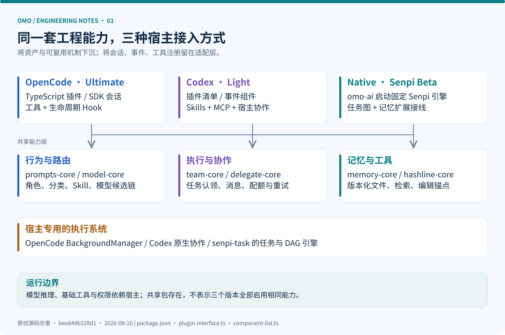
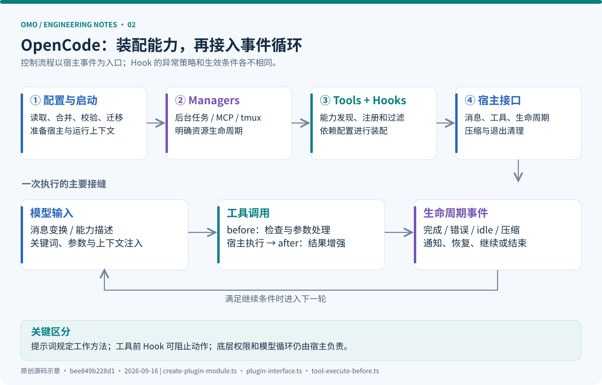
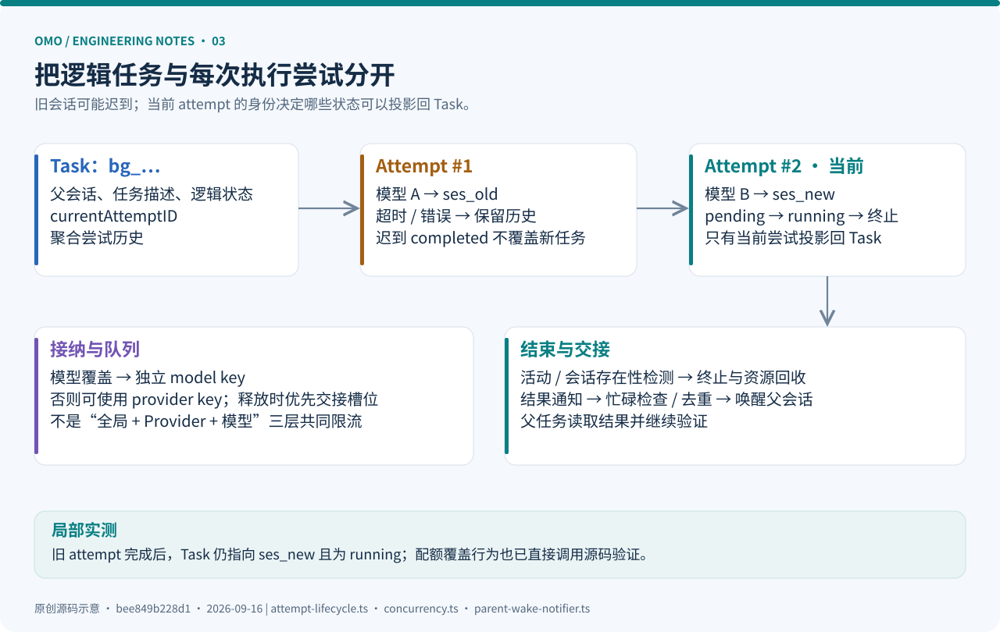
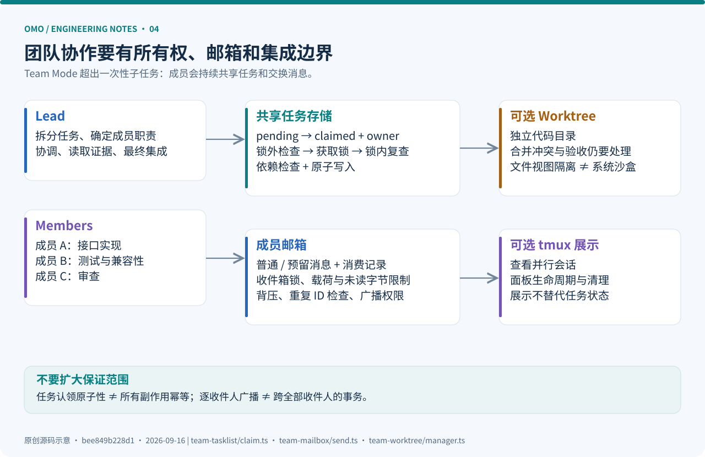
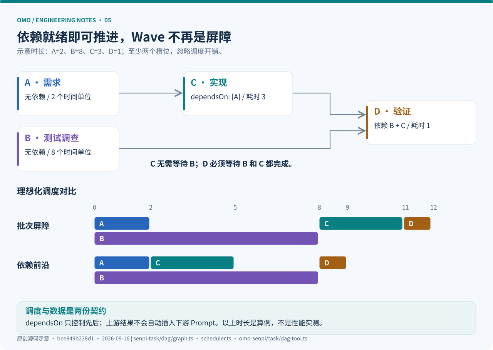
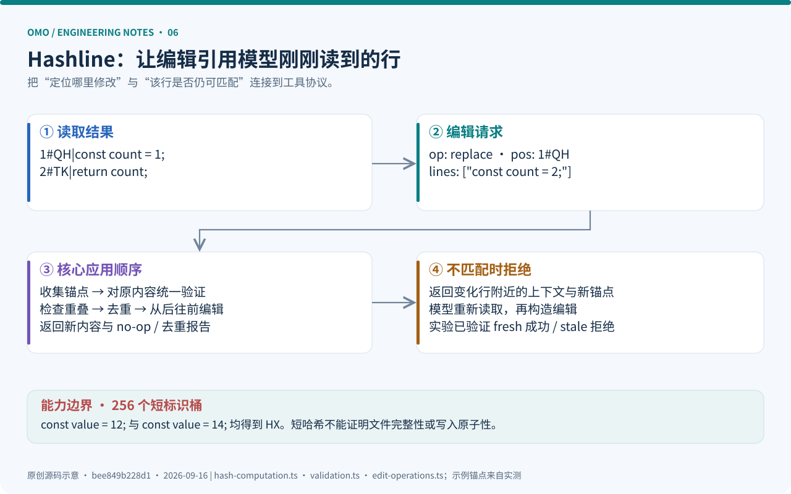
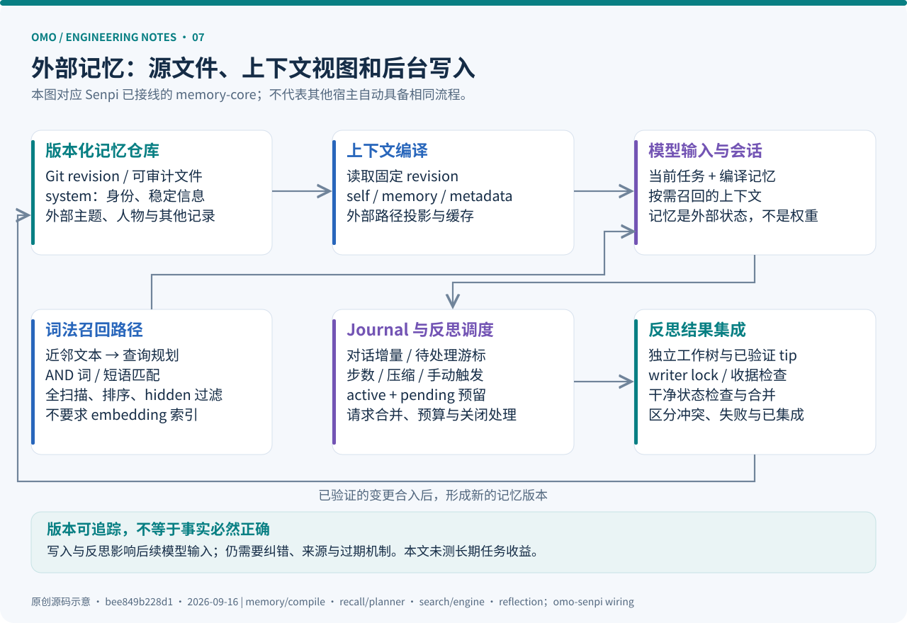
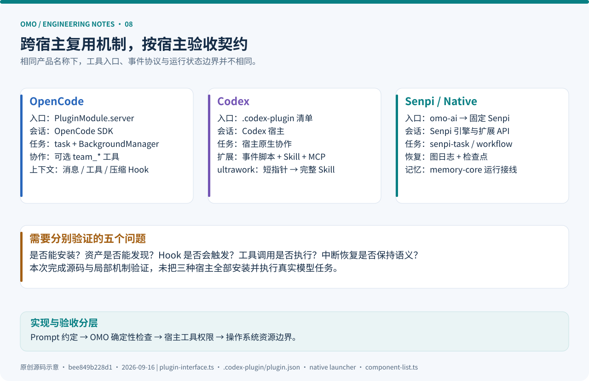

# oh-my-openagent 源码深度解析：从多 Agent 编排到可恢复的执行系统

> 调研日期：2026-09-16（Asia/Shanghai）。<br>
> 源码基线：`dev` 分支本次获取的提交 **`bee849b228d1cb076a8f2ac839335f43399febe1`**，提交时间 `2026-09-16T23:46:32+09:00`。根包版本 `5.0.0-beta.67`；独立发行包 `omo-ai` 为 `5.0.0-0.beta.67`。这些是源码快照中的版本，不能直接等同于 npm 的当前稳定版本。<br>
> 方法：官方仓库与固定提交源码交叉阅读，直接运行部分源码机制实验。本文区分**源码事实、局部实测、工程推论**；未做真实模型任务完成率、成本或完整宿主兼容性评测。



一个 Coding Agent 在演示里很容易成立：给模型一段任务描述，暴露读文件、改代码和执行命令的工具，再把结果送回模型。但当任务持续几个小时、包含多个子任务、横跨不同模型、发生上下文压缩时，真正的问题开始出现：谁负责子任务？失败后重试的是哪一次执行？旧会话的完成事件还能不能改变新状态？停止响应究竟表示完成，还是正在等待结果？

**oh-my-openagent 的主要工程价值，是把这些问题逐步变成可执行的运行机制。** 提示词、角色和 Skill 是其中一层；任务状态、事件接线、工具约束、消息投递、持久化和恢复同样重要。本文从这些机制出发，追踪它如何围绕宿主 Agent 建立更完整的执行系统。

配套阅读：[离线网页版](index.html) · [直接调用源码的实验](examples/README.md) · [验证记录](research/verification.md) · [源码索引](research/sources.md) · [快照与文件指纹](research/snapshot.json)。图均为本次调研原创，SVG 随文保存，不依赖在线图床。

## 阅读导航

| 想解决的问题 | 章节 |
| --- | --- |
| 项目是什么，三个版本如何区分？ | [1. 定位与版本](#position)、[2. 源码地图](#source-map) |
| 插件如何进入宿主运行时？ | [3. 启动与 Hook](#lifecycle) |
| Agent、分类、模型和 Skill 如何组合？ | [4. 角色系统](#agents)、[5. 委派链路](#delegation) |
| 并发、重试、通知和协作如何可靠运行？ | [6. 后台任务](#background)、[7. Team Mode](#teams) |
| 新版图执行具体怎么实现？ | [8. Senpi DAG](#dag) |
| 编辑、上下文和记忆如何处理？ | [9. 工具工程](#tools)、[10. 上下文](#context)、[11. 记忆](#memory) |
| 跨宿主迁移和项目配置有哪些边界？ | [12. 适配层](#adapters)、[13. 配置与权限](#configuration) |
| 如何复现、验证与借鉴？ | [14. 完整案例](#walkthrough)、[15. 源码实验](#experiments)、[16. 工程判断](#assessment) |

<a id="position"></a>
## 1. 先确定研究对象：名字变了，架构也在变

### 1.1 GitHub 名、npm 名与入口名不是一回事

当前仓库是 `code-yeongyu/oh-my-openagent`，根 `package.json` 的 `name` 仍为 `oh-my-opencode`。同一个启动脚本映射了 `oh-my-opencode`、`oh-my-openagent`、`omo-agent-toolkit`、`lazycodex`、`lazycodex-ai` 五个 bin 名称。独立发行版则在 `packages/omo-native`，包名为 `omo-ai`，提供 `omo` 命令。[根包声明][package] · [独立包声明][native-package]

因此，检索源码时看到 `@oh-my-opencode/*`、旧配置名或 Sisyphus 相关目录，并不意味着找错项目。研究时需要分别辨认**产品名称、包命名空间、安装别名、宿主入口和状态目录**。

### 1.2 当前有三条产品路径

| 形态 | 宿主与入口 | OMO 主要负责什么 | 本文研究边界 |
| --- | --- | --- | --- |
| Ultimate / OpenCode | 作为 OpenCode 插件加载 | 角色、分类委派、后台任务、Hook、工具与团队协作 | 以 `omo-opencode` 的真实注册链为主 |
| Light / Codex | Codex 插件命名空间 `omo` | Hook 组件、Skills、MCP、配置和安装适配 | 不把 OpenCode 的全部工具当作 Codex 也具备 |
| Senpi / Native，Beta | `omo-ai` 启动固定版本 Senpi 并加载 OMO 扩展 | 在独立发行入口中组合任务引擎、图执行、记忆等能力 | 区分 OMO 扩展与外部 Senpi 引擎 |

三个版本的产品定位来自官方说明；实际入口可分别追到 `plugin-interface.ts`、Codex 插件清单和 Native 启动器。[官方入口][upstream-readme] · [OpenCode 接口][interface] · [Codex 清单][codex-plugin] · [Native 启动器][native-launcher]

从 Agent 工程角度，可以把 OMO 理解为 **harness 增强与编排层**：它决定模型获得哪些工作规则、可调用哪些扩展工具、如何启动子任务、何时继续执行，以及哪些状态跨轮次保存。OpenCode 与 Codex 路径依赖宿主自己的模型执行循环；Native 路径也通过发行包复用 Senpi 引擎。不能把整套系统画成三个客户端共同调用一个 OMO 自研 `while (tool_calls)` 内核。

### 1.3 本文特别防止的三种误读

第一，`ultrawork` 是一组工作约定、触发逻辑和配套执行机制的入口。关键词本身不产生任务正确性的证明。

第二，仓库里出现某个模块，只说明实现存在。它是否启用、是否暴露为工具、是否被当前宿主执行，需要继续看注册链和配置条件。

第三，本次基线处于 Beta 演进阶段。比如源码内部保留 `dag` 命名，但 Senpi 的模型侧工具名已经是 **`workflow`**；旧 `ralph_loop` 配置有向 `goal` 迁移的兼容逻辑。使用旧文章中的入口和默认值，可能得到不同结果。[图工具][dag-tool] · [配置迁移][config-validation]

<a id="source-map"></a>
## 2. 源码地图：按工程职责阅读，而不是按角色名阅读

根包声明了 **28 个 workspaces**。这是 `package.json.workspaces` 的数组长度，不是仓库全部目录数，也不是独立服务数。我们选取了 69 个关键证据文件保存路径、行数和 SHA-256，便于复查。[快照](research/snapshot.json)

```text
packages/
├── omo-opencode/        OpenCode 插件、CLI、角色、Hook、后台任务
├── omo-codex/           Codex 安装器、插件清单和独立 Hook 组件
├── omo-senpi/           Senpi 扩展接线、workflow、记忆运行时
├── omo-native/          omo-ai 发行包与固定引擎启动器
├── senpi-task/          任务状态、执行器、生命周期、DAG 与恢复
├── model-core/          模型要求、候选链和能力相关逻辑
├── prompts-core/        跨宿主共享提示词资产
├── omo-config-core/     统一配置、宿主视图与模型引用
├── delegate-core/       委派相关共享逻辑
├── team-core/           团队状态、任务认领、邮箱与工作树
├── memory-core/         Git 记忆、召回、反思与文件操作
├── hashline-core/       行锚点、校验和编辑算法
├── rules-engine/        规则匹配与注入基础
├── skills-loader-core/  Skill 发现与内建能力选择
├── mcp-client-core/     MCP 客户端与连接管理
├── lsp-core/            语言服务基础能力
├── lsp-tools-mcp/       LSP 的工具协议表面
├── lsp-daemon/          LSP 服务进程入口
└── shared-skills/       可被多个宿主消费的 Skill 资产
```

这张地图揭示了一个设计方向：**能跨宿主复用的算法、状态和资产下沉到 core；依赖宿主事件、工具 API 和会话结构的代码保留在适配层。** 但 `senpi-task` 明确与 Senpi 任务运行方式相连，不应仅因位于独立 package 就称为完全通用的任务引擎。[工作区定义][package] · [Senpi 接线][senpi-task]

建议阅读顺序是：**入口 → 注册点 → 调用分支 → 状态存储 → 失败处理 → 测试**。例如研究 Hashline，不能只读哈希函数；还要确认 `hashline_edit` 是否开启、读工具如何返回锚点、编辑前如何校验和拒绝。

<a id="lifecycle"></a>
## 3. OpenCode 插件如何进入一次真实执行？



### 3.1 入口很短，装配逻辑很长

`packages/omo-opencode/src/index.ts` 调用 `createPluginModule()`，导出模块及其 server 入口。真正的启动流程在 `src/testing/create-plugin-module.ts`。这个文件虽然放在 `testing` 路径下，当前正式入口确实导入它，不能按目录名认定它只服务于测试。[入口][entry] · [启动实现][bootstrap]

启动阶段要完成的工作包括：初始化配置上下文、迁移旧工作区、检测重复插件、准备客户端认证、加载配置、准备运行时 Skill 来源、创建 Managers、Tools 和 Hooks，再把它们组合成宿主接口。退出时还要清理后台资源和已注册的 Hook。

用本文原创的伪代码表示关键依赖：

```typescript
const config = loadAndValidateConfig(project);
const managers = createManagers(host, config);
const capabilities = await discoverAndRegisterTools(managers, config);
const hooks = composeHooks(managers, capabilities, config);
return bindHostEvents({ managers, tools: capabilities.tools, hooks });
```

这里的核心并非工厂函数数量，而是**装配顺序与生命周期归属**：Hook 需要知道有哪些 Skill；委派工具需要后台管理器；配置阶段又要把最终 Agent、MCP、命令写给宿主。[Managers][managers] · [工具注册][tools] · [Hook 组合][hooks]

### 3.2 两类“配置加载”要分开

第一类是读取 OMO 配置：解析配置层、解析模型引用、处理宿主视图、验证字段、合并和迁移。

第二类是 `config` Hook：在宿主配置对象上应用 Provider、插件组件、Agent、工具权限、MCP 和命令。这一步是在“构建宿主最终可执行能力”。实现还缓存 Agent 装配结果；缓存重放时需要恢复排序、注册名称等副作用。[配置链][config-chain] · [验证][config-validation] · [配置 Hook][config-handler]

Agent 构造中有一个很具体的工程细节：初始化阶段使用缓存和可用模型信息，源码明确避免此时再调用 OpenCode 客户端 API，以免配置加载与服务初始化互相等待。它说明插件初始化本身也是并发系统，不能无条件在所有工厂函数里查询宿主服务。[内建 Agent 构造][agents]

### 3.3 Hook 是事件处理管线，不是统一的“拦截器黑盒”

| 宿主事件 | OMO 的典型处理 | 工程意义 |
| --- | --- | --- |
| `chat.message` / `chat.params` | 关键词、会话状态和推理参数调整 | 使行为与当前模型、模式一致 |
| `tool.execute.before` | 参数规范化、写入保护、规则注入、团队工具门控 | 在副作用发生前约束动作 |
| `tool.execute.after` | 输出处理、注释检查、Hashline 读增强、元数据恢复 | 改善下一轮模型观察 |
| `experimental.chat.messages.transform` | 上下文、团队邮箱、工具消息配对修复等 | 维护最终模型输入 |
| `event` | 会话生命周期、后台任务和失败事件处理 | 推进状态机与异步结果交接 |
| `experimental.session.compacting` | 压缩前补充上下文、保护任务状态 | 降低压缩导致的任务遗忘 |

表格列出的是代表性职责，不意味着每项永远开启。部分 Hook 由配置控制，压缩相关接口另在启动装配处接入。[接口][interface] · [工具前][before] · [工具后][after] · [消息变换][transform] · [启动实现][bootstrap]

错误策略也有差别：工具前处理可以抛错阻止动作；工具后处理包含捕获和日志逻辑；消息变换中部分项被标为 fatal。因而不能概括成“所有 Hook 错误都中断”或“所有错误都忽略”。插件作者必须逐事件定义失败时该阻止、降级还是重试。

<a id="agents"></a>
## 4. Agent 是角色配置，运行实例由宿主创建

### 4.1 角色与分类各管一层

`builtin-agents.ts` 维护角色工厂和元数据。Sisyphus、Hephaestus、Atlas 的配置还会结合可用 Agent、Skill 和分类构造。当前 `agentSources` 表列出了 10 个角色；Prometheus 则在 `agent-config-assembly.ts` 中按 planner 开关单独构建，开关缺省为 true。这解释了官方“11 agents”与工厂表行数的差别，但实际可用角色仍受配置和模型可用性影响。[角色工厂][agents] · [配置装配][agent-assembly] · [官方说明][upstream-readme]

| 角色或角色组 | 主要工作定位 | 实现阅读重点 |
| --- | --- | --- |
| Sisyphus | 主任务理解、委派、推动收敛 | 动态 Prompt、工具与能力目录 |
| Hephaestus | 深入实现与自主工程执行 | 独立工厂及模型相关构造 |
| Atlas | 计划执行与编排 | 额外的编排上下文与装配 |
| Sisyphus Junior | 分类委派的执行角色 | `category` 解析后的常见目标 |
| Prometheus | 规划角色 | 在最终 Agent 装配阶段单独构建 |
| Explore / Librarian | 仓库探索、资料与实现查证 | 元数据触发条件和工具范围 |
| Oracle / Metis / Momus | 咨询、规划前分析、计划审查 | 各自的角色指令与权限配置 |
| Multimodal Looker | 视觉与多模态理解 | 模型能力和工具启用条件 |

这些角色并不是仓库训练出来的独立模型，也不是启动时自动全部常驻的进程。它们首先是 `AgentConfig` 和提示词工厂；在实际委派时才结合模型、会话和任务形成运行实例。

### 4.2 动态 Prompt 在解决能力目录漂移

如果主 Agent 的提示词写死“可以调用 Explore、Oracle 和某个 Skill”，但用户禁用了对应工具，模型就会得到失真的能力描述。OMO 把可用 Agent、Skill、分类和元数据输入提示词构造过程，使委派表和工具选择说明尽量与当前配置同步。[动态 Prompt][prompt-builder] · [Sisyphus 工厂][sisyphus] · [内建角色装配][agents]

可以把一次角色实例理解成：

```text
角色指令 + 当前能力目录 + 模型相关变体
        + 分类提示 + 显式 Skill 内容 + 当前任务
        + 宿主授予的工具与权限
```

这个分层值得借鉴：**角色回答“怎样思考和工作”，分类回答“当前任务属于哪种工作”，模型配置回答“用哪个执行资源”。** 它们可以组合，不需要为每个“角色 × 模型 × 任务类型”复制一整套 Prompt。

### 4.3 规划与执行要追踪当前入口

仓库保留不少 Prometheus、Atlas、Boulder 等历史命名，也在使用 `/ulw-plan`、`/ulw-execute` 等工作流入口。阅读规划链路时，应先看当前命令、Skill 和 Agent 装配，再理解旧名兼容。不能直接复述早期版本“固定切换到某个规划 Agent，然后统一执行”的流程。[当前命令][commands] · [Agent 装配][agent-assembly] · [配置迁移][config-validation]

模型侧的“先规划、再检查、最后执行”仍主要是行为契约。真正能阻止某类写入或强制工具范围的，是权限配置和对应工具前 Hook。两者结合才构成完整约束。

<a id="delegation"></a>
## 5. 一次 `task` 委派如何变成子会话？

`createDelegateTask()` 是 OpenCode 路径中最值得细读的入口之一。它对外注册 `task` 的参数，并把参数解析、Skill 内容、父上下文、模型决策与执行分支连接起来。[委派工具][delegate]

### 5.1 参数定义本身就是运行协议

| 字段 | 作用 | 容易误解之处 |
| --- | --- | --- |
| `prompt` | 子任务完整描述 | 子任务需要足够独立的背景和验收条件 |
| `category` | 按任务分类路由 | 与直接选 `subagent_type` 是两种选择方式 |
| `subagent_type` | 指定专业角色 | 不能和分类目标随意叠加 |
| `load_skills` | 显式注入 Skill | 可省略，默认为空数组 |
| `run_in_background` | 后台返回或同步等待 | 描述推荐后台，但**省略时按 false 处理** |
| `task_id` | 继续已有子会话 | 此处期望 `ses_...`，不是 `bg_...` 后台任务号 |

最后两点尤其值得注意：文案推荐、参数缺省值、运行 ID 类型是三个不同层次。模型只记住“后台任务 ID”，在继续任务时就可能把不正确的 ID 传回工具。[参数 Schema 与分支][delegate]

### 5.2 实际调用链

```text
task.execute
  → prepareDelegateTaskArgs
  → resolveSkillContent
  → resolveParentContext
  → 已有 task_id ? 继续已有会话
  → category ? resolveCategoryExecution : resolveSubagentExecution
  → 组合子任务 system 内容
  → 后台 / 同步 / 特殊不稳定模型执行分支
  → 创建或恢复宿主子会话
```

Skill 加载失败时，工具先返回错误，避免带着缺失的工作约定继续启动。分类委派还会读取当前模型配置，减少启动后配置改变所造成的偏差。某些不稳定模型在显式同步调用时会进入专门的后台执行处理分支。[委派工具][delegate] · [分类解析][category]

### 5.3 模型路由是候选链加可用性判断

内建分类包括 `visual-engineering`、`ultrabrain`、`deep`、`quick` 等。分类解析涉及用户显式配置、Junior 的默认覆盖、分类默认值、模型可用集合、系统默认模型，以及 fallback 设置。不同分支存在不同优先关系，不宜压缩成一个放之四海皆准的四项优先级表。[分类解析][category] · [模型选择][model-selection]

在本次快照中，`ultrabrain` 的候选链包含 `gpt-6-astra` 的 `max` 变体和 `gpt-5.6-sol` 的后备项；`deep` 使用不同的推理变体。这里记录的是**仓库中的路由字符串与策略**，不等于这些模型在任意账户中都可用，也不是本文对模型优劣的评测。[分类候选链][model-requirements]

工程上应分开看两个问题：

1. **启动时选择**：根据配置与可用性决定这次调用用哪个模型。
2. **执行时恢复**：模型调用真的失败后，是否重试、如何切换候选项、怎样处理旧会话事件。

候选链解决的是执行资源可替换性；它不能自动解决工具副作用幂等、不同模型输出习惯差异或上下文迁移损失。

<a id="background"></a>
## 6. 后台任务：可靠性集中在状态、配额与结果交接



### 6.1 Task、Attempt 和 Session 必须分别建模

OpenCode 后台管理器负责任务集合、启动、轮询、事件处理和通知。`attempt-lifecycle.ts` 进一步把一次业务任务和一次实际执行拆开：[后台管理器][background] · [执行尝试][attempt]

- **Task**：逻辑工作项，后台 ID 常见为 `bg_...`。
- **Attempt**：某一次执行尝试，拥有自己的模型、状态、起止时间和 attempt ID。
- **Session**：宿主真实执行的对话会话，常见 ID 为 `ses_...`。

假设第一次调用超时，系统启动第二次尝试；第一条会话稍后又发来完成事件。如果只有一个 `task.status`，迟到事件可能把仍在运行的新尝试标成完成。

这里的实现以 `currentAttemptID` 作为当前投影的依据。旧 attempt 可以被记录为结束，但只有当前 attempt 才能把状态、会话和模型投影回 Task。绑定会话时也检查 attempt 是否仍然当前、是否已终止。

**局部实测：**实验先创建 `ses_old`，再重试到 `ses_new`，最后把旧 attempt 标成 completed。任务仍保持 `sessionId = ses_new`、`status = running`。这证明该投影函数在所测场景中挡住了旧结果覆盖；它不等于整个事件系统已经被穷尽验证。[实验](examples/source-probes.mjs)

### 6.2 并发限制有一个很容易看漏的语义

`ConcurrencyManager` 先选配额键，再维护该键的计数和等待队列：[并发实现][concurrency]

```text
存在 modelConcurrency[provider/model] → 键为完整模型名
否则存在 providerConcurrency[provider] → 键为 provider
否则                                  → 键为完整模型名
```

限制值按模型、Provider、默认值选择；没有配置时回退为 5；配置为 0 表示无限制。`release()` 优先把已有槽位转交给队首等待者，计数不变；无人等待时才递减。队列项的 `settled` 标志防止取消与释放重复处理同一个等待者。

**关键结论：这不是“全局上限 → Provider 上限 → 模型上限”同时生效的层级信号量。** 当某个模型有显式覆盖时，它使用独立的配额键。实验设置 Provider 上限为 1、特定模型上限为 2，成功让普通模型占用 1 个 Provider 槽位，特定模型再占用 2 个独立槽位。

这不是凭字段名字推断出的细节，而是直接运行源码确认的行为。如果团队需要严格的供应商总并发预算，应增加独立的聚合预算层；不能仅凭 `providerConcurrency` 字段存在就认定所有模型共享同一总上限。

### 6.3 进程还活着，不代表任务在推进

后台轮询不仅看 elapsed time，还检查任务状态、最近活动、会话状态、会话是否消失、通知是否仍待投递等信息。已终止任务与仍在运行的任务使用不同回收条件；Team 任务也有特殊处理。[轮询与回收][poller]

在失活处理里，代码先尝试终止会话；如果终止失败，还会检查会话是否确实已不存在，再决定能否结束任务并释放资源。这能减少“调度层认为取消了，实际子任务还在继续”的状态分裂。

`background_task` 配置同时包含并发、深度、后代数量、失活超时、任务 TTL 和工具调用限制等字段。但 Schema 注释只是阅读入口，真实回收条件仍应以运行代码为准。[配置 Schema][config-background]

### 6.4 通知是执行的一部分

子任务完成后还要解决：父会话是否忙碌？是否已有待处理的内部提示？同一结果是否已经通知？是否需要延后唤醒？这些问题对应 `parent-wake-*` 系列文件和通知协调器。[父会话通知][wake]

工具前 Hook 还会识别“后台任务仍在运行时用纯 `sleep` 反复等待”的情况，阻止这类空转，提示由完成通知推进。这说明后台机制设计的目标是**事件驱动的交接**，而不只是让模型不断轮询。[工具前处理][before]

<a id="teams"></a>
## 7. Team Mode：从主从委派扩展为有状态的协作



普通委派主要是“父任务给子任务一个 Prompt，等待结果”；Team Mode 进一步引入成员身份、共享任务、认领、消息和生命周期。OpenCode 工具注册受 `team_mode.enabled` 控制；Codex 与 Senpi 的协作表面则走各自的适配链。[工具注册][tools] · [团队配置][team-config]

### 7.1 任务认领必须在锁内复查

`claimTask()` 的关键过程是：读取任务、检查 pending 与依赖、处理陈旧锁、进入认领锁、**重新读取任务和依赖**、写入 claimed 状态和 owner，最后原子写入任务文件。[认领实现][team-claim]

为什么要检查两次？因为第一次读取与获取锁之间，其他成员可能已经认领了任务。没有锁内二次检查，两个成员会同时认为自己是负责人。

这一机制把“不要重复做别人的任务”从协作礼仪变成了确定性的存储约束。但它只约束经过这个认领入口的行为；成员直接编辑相同文件时，仍需要工作划分和文件隔离。

### 7.2 邮箱不只是 JSON 消息列表

`sendMessage()` 包含成员有效性验证、团队删除状态检查、广播权限、载荷大小限制、收件箱字节预算、重复 ID 检查和收件箱锁。预留投递中的消息文件也纳入未读预算；已消费消息另外留下可检查记录。[发送实现][mailbox] · [消费记录][mailbox-ledger]

这些设计分别回应几个常见失败：

| 失败情形 | 对应机制 |
| --- | --- |
| 成员向所有人无节制广播 | 广播要求 lead 身份 |
| 发送方持续产生消息，接收方处理不过来 | 收件箱背压 |
| 重复发送同一个消息 ID | 现有普通或预留文件检测 |
| 消费者退出后不清楚消息是否已处理 | 消费记录与恢复相关机制 |
| 删除中的团队继续接受新消息 | 生命周期状态检查 |

要注意，源码里的广播是按接收者逐个处理。不能据此声称具有跨所有收件人的原子广播事务；也不能把“有去重记录”直接等同于端到端 exactly-once 语义。真实副作用仍需消费方幂等。

### 7.3 工作树是文件视图隔离，tmux 是展示与控制

`team-worktree/manager.ts` 能为成员创建 detached Git worktree，使不同成员拥有独立的工作目录。它是可选路径，不应默认每个后台子任务都自动拥有独立工作树。[工作树实现][worktree]

Git worktree 解决源码修改相互踩踏的一部分问题，但多个目录仍可能共用端口、数据库、凭据和其他机器资源。tmux 则用于展示和管理多个终端会话。二者都不构成操作系统级沙盒。

如果借鉴这一实现建设生产团队 Agent，至少应分别设计**任务所有权、消息投递、文件修改归属和最终集成验收**。这些职责不会因“启动了四个 Agent”自然出现。

<a id="dag"></a>
## 8. Senpi 的图执行：从提示词里的计划走向调度器里的依赖



### 8.1 对外叫 `workflow`，内部仍叫 DAG

Senpi 扩展的任务组件调用 `createDagTool()`，但工具文件定义的 `WORKFLOW_TOOL_NAME` 是 `workflow`。描述鼓励通过 eval 单元中的 `tool.workflow` 和 JavaScript SDK 组织图定义。[工具实现][dag-tool] · [扩展接线][senpi-task]

这是**宿主 CodeMode 与 OMO 图工具协同**的表面：OMO 在这里贡献图契约、管理器、调度、结果与恢复；仅阅读这个仓库里的工具接线，不能反推完整 eval 执行隔离实现，因为底层宿主引擎是另一个依赖。

节点目标采用 `category` 与 `subagent_type` 二选一。显式 `model` 只允许与直接 Agent 目标一起使用。工具边界先验证目标，再交给图管理器和编译器；TypeScript 联合类型表达的限制仍需要运行时验证，不能只依赖类型标注。[图类型][dag-types] · [工具验证入口][dag-tool]

### 8.2 `dependsOn` 只控制顺序

这是图编译器和工具描述都明确表达的契约：**依赖边不会自动把上游结果插入下游 Prompt。** [图编译][dag-graph] · [工具契约][dag-tool]

例如以下定义是本文原创的图数据示意，可用于理解 `compileDag()` 的输入；它没有启动真实 Agent：

```typescript
const definition = {
  key: "api-change-v1",
  name: "实现接口并验证",
  nodes: [
    { id: "spec", category: "deep", prompt: "澄清接口，写入 artifacts/spec.md" },
    { id: "tests", category: "quick", prompt: "调查现有测试，写入 artifacts/tests.md" },
    {
      id: "implement", category: "deep", dependsOn: ["spec"],
      prompt: "读取 artifacts/spec.md，按其中约束实现接口并记录改动。"
    },
    {
      id: "verify", category: "deep", dependsOn: ["implement", "tests"],
      prompt: "读取两个产物，检查实际代码，执行适当测试并记录结果。"
    }
  ]
};
```

真实使用还必须保证文件对下游可见。若节点使用独立 worktree，`artifacts/spec.md` 不会因为同名就自动共享；需要显式的产物目录、复制或集成机制。**控制依赖与数据传递应分别设计。**

### 8.3 编译阶段先拒绝坏图

`compileDag()` 是确定性的图编译函数，时间可以由调用者传入。它会检查空图、重复节点 ID、不存在的依赖、自依赖、环、节点数量和 Prompt 字节预算等，并计算 edges、waves、criticalPath、bottlenecks。[编译实现][dag-graph]

默认最大节点数为 64、每节点 Prompt 字节上限为 262144；这些是当前图设置中的默认值。不能据此认定系统会同时启动 64 个子 Agent，实际运行还受任务引擎的常驻子任务上限约束。[图设置][dag-types] · [调度][dag-scheduler]

实验确认三类非法图被拒绝，且失败时不产生可执行节点数组。这里测的是图编译，不是 LLM 的拆解能力。一个语法合法的 DAG 仍然可能把有业务依赖的任务错误地安排为并行。

### 8.4 Wave 是描述信息，不是批次屏障

设 A、B 无依赖，C 只依赖 A，D 依赖 B 和 C。编译后的 wave 为 `[A,B] → [C] → [D]`。如果误把 wave 当作屏障，就必须等 A 和 B 都结束才启动 C。

当前 `runFrontier()` 的逻辑是：检查就绪前沿，尝试接纳节点，等待一个执行结果，折叠状态，然后重新计算。只要 A 已 completed 且有空槽，C 就可以开始，B 可以继续运行。未获准进入的节点会排队，释放槽位后优先考虑较早被拒绝的请求。[前沿调度][dag-scheduler]

图中的假设时长为 A=2、B=8、C=3、D=1，忽略调度开销且至少有两个槽位：批次屏障耗时 12，前沿调度耗时 9。这是解释语义的算例，**不是项目性能基准**。源码里的 `criticalPath` 也是基于图结构计算；不应当成使用历史耗时预测的时间关键路径。

失败传播还有一个细节：跳过依赖节点的级联在当前没有附着执行任务时进行，给运行中的兄弟任务以及某些可恢复节点留下继续推进的机会。它不是一发现失败就立即将所有下游永久跳过。

### 8.5 可恢复执行依赖日志、检查点和所有权

`dag/journal.ts` 在运行锁内恢复当前持久状态、分配序号、追加 WAL 事件、应用 reducer、写检查点，再通知订阅者。completed 节点的结果产物有提前落地的处理，以便进程在检查点替换前退出时仍有恢复依据。[日志实现][dag-journal]

图管理器还处理定义键与指纹、运行重用、修订；调度器提供 retry、send、取消与 suspend 等控制。相同 key 和同一图定义可复用已有运行；不能把“相同 key”理解成可以无条件替换任意新图。[图管理器][dag-manager] · [工具实现][dag-tool] · [恢复入口][dag-recovery]

这里更准确的工程定位是**本地持久化、带恢复协议的任务图执行器**。本文没有验证网络分区、多机器一致性、任意副作用的事务回滚，因此不把它描述成分布式工作流平台的等价替代品。

<a id="tools"></a>
## 9. 工具工程：让模型更容易产生可执行、可校验的动作

### 9.1 Hashline：把读取观察与编辑锚点连接起来



普通文本替换依赖模型重新生成原字符串，容易受到缩进、重复文本和旧上下文影响。Hashline 为读取结果中的每行附加行号和短哈希，模型编辑时引用该锚点。实验直接调用本次源码，得到：

```text
1#QH|const count = 1;
2#TK|return count;
```

下面是本文使用的编辑参数示意：

```json
{
  "filePath": "/workspace/example.ts",
  "edits": [
    { "op": "replace", "pos": "1#QH", "lines": ["const count = 2;"] }
  ]
}
```

这里 `/workspace/example.ts` 只是示例路径。OpenCode 工具还支持 append、prepend，以及删除、重命名等字段；是否暴露这一工具受 `hashline_edit` 配置影响。[工具 Schema][hash-tool] · [工具注册][tools]

底层算法大致分四步：[哈希计算][hash] · [锚点校验][hash-validation] · [编辑应用][hash-apply]

1. 读取行内容，规范化后生成短哈希。
2. 收集本次批量编辑引用，在原始内容上统一校验。
3. 检查范围重叠，去重，并按位置从后往前应用。
4. 返回新内容以及 no-op、重复编辑等报告信息。

从后往前处理能减少前面的插入让后续行号移动的问题。锚点过期时，校验器返回附近行和新锚点，给模型一个可恢复的下一步，而不只是“编辑失败”。

### 9.2 短哈希不是文件事务，也不是安全校验

当前实现使用 xxHash32 后取模 256，映射到短标识字典。主要哈希规范化移除 CR 并裁剪行尾空白；验证还兼容旧版忽略空白的哈希。[哈希计算][hash] · [兼容验证][hash-validation]

**局部实测：**`const value = 12;` 与 `const value = 14;` 在相同行号下都得到 `HX`。只需 257 个不同输入就必然超过 256 个桶，出现碰撞是设计空间的自然结果。

因此，Hashline 适合降低误定位和陈旧读取导致的编辑失败，但不能证明目标文件未被其他进程修改。需要严格并发写控制时，还应使用完整文件摘要、锁或版本比较。本文测试的是核心字符串编辑逻辑，没有把它当作整个文件写入链的并发原子性测试。

### 9.3 MCP、Skill 和内建工具是不同的能力入口

OpenCode 的内建 MCP 配置工厂分别准备 websearch、context7、grep_app 和 lsp；某些来源还取决于配置可用性。`skill_mcp` 则在已加载的 Skill 中查找声明的 MCP Server，要求一次明确选择 tool、resource、prompt 中的一个操作，并携带 session、Skill、scope 等上下文。[内建 MCP][mcps] · [Skill MCP][skill-mcp]

这两条通路不能混用。`skill_mcp` 对内建 MCP 名称有专门提示，要求使用宿主暴露的原生工具名。否则模型可能反复尝试从错误的注册表寻找已经存在的能力。

LSP 能提供诊断、跳转、引用和重命名等基于语言服务的操作；结构化 AST 搜索由对应工具与 Skill 资产提供。它们将一部分代码理解和重构步骤交给确定性程序，减少模型猜测。但“有 LSP 诊断”依然不意味着业务测试通过。

### 9.4 Skill 发现是配置系统的一部分

`createSkillContext()` 并行发现 OMO 配置、宿主配置、Claude 用户与项目目录、OpenCode 目录、`.agents` 目录和共享 Skill 等来源，然后做禁用别名过滤、浏览器 Provider 选择与同名合并。相同名称同时出现在宿主配置和插件配置时，这一分支明确让宿主配置优先。[Skill 发现][skill-context]

这种能力目录最好同时服务于：主 Agent 可见描述、委派时 Skill 注入、命令注册与 MCP 来源。只维护其中一份，容易出现“Prompt 说有，运行时找不到”的故障。

<a id="context"></a>
## 10. 上下文管理与持续执行：既要保住目标，也要知道何时停止

### 10.1 上下文是一种需要校验的数据结构

多轮工具执行的模型输入包含用户消息、助手消息、工具调用、工具结果、后台通知与压缩摘要。它们并非任意文本拼接：某些模型对工具消息配对、最终消息角色、预填内容等有格式要求。

OMO 的消息变换管线处理上下文注入、团队状态和邮箱、工具配对等，还对部分 Provider/模型的 assistant prefill 限制做专门恢复。这里修复的是**下一次请求的结构与兼容性**，并没有改变基础模型参数。[消息变换][transform]

### 10.2 压缩摘要不应该成为任务状态的唯一副本

`compaction-todo-preserver` 在压缩前保存详细 Todo 快照。恢复时并非无条件覆盖现状：如果当前已有有效的详细任务列表，应避免把旧状态强行写回；如果任务被简化为空或某类通用占位列表，则尝试恢复。[Todo 保护][compaction]

这一实现还尝试解析宿主的 `Todo.update` 能力，失败时记录日志。它说明插件在宿主升级时存在 API 接缝：代码里有恢复功能，与特定宿主版本上恢复成功，是不同的验收项。

源码中这个保护器的快照位于内存 Map。它有利于一次进程生命周期内的压缩保护，不能单凭这段实现推导出跨进程持久恢复。持久计划、Boulder 状态、图日志和长期记忆是另外的存储职责。

### 10.3 持续执行不是无限追加“继续”

`todo-continuation-enforcer` 在 session idle 后检查是否存在未完成任务，但会在多种情形下退出：[继续执行条件][continuation]

- 全部 Todo 已完成，或没有任务；
- 用户取消、检测到中断，或同步子任务已交回父任务；
- 后台任务还在执行，或仍有待投递唤醒；
- 存在未回答的用户问题或尚未完成的内部响应；
- 发生 token 上限或不可重试请求错误；
- 恢复中、注入中、达到连续失败限制或处于冷却期。

实现还包含冷却随失败次数增长、停滞检测和压缩保护。它解决的是“当系统确认可以继续且还有工作时，再推动一轮”，而不是无视用户输入和运行状态地循环。

从控制系统角度看，结束一轮生成是一个观测事件，不能直接等同于任务完成。是否继续，需要任务状态、外部等待与用户控制共同决定。

<a id="memory"></a>
## 11. 记忆系统：Git 存储、上下文编译、词法召回与后台反思



本节主要讨论 **Senpi 适配层已接线的 `memory-core`**。共享包存在不代表所有宿主默认启用相同记忆能力。Senpi 记忆组件先检查启用配置和宿主 ExtensionAPI 能力，再建立身份与会话绑定；身份冲突时关闭这条绑定路径并报告问题。[记忆入口][memory-component]

### 11.1 先把“记忆”分成不同的数据

| 数据 | 生命周期与用途 | 不应混淆为 |
| --- | --- | --- |
| 当前会话消息 | 本次推理与工具调用轨迹 | 永久准确的知识库 |
| Todo / 计划 / 任务日志 | 长任务进度、所有权与恢复 | 用户长期偏好 |
| system 记忆与身份文件 | 跨会话稳定信息，编译到 Prompt | 模型权重更新 |
| 其他记忆文件与人物记录 | 按主题保存、按需读取或召回 | 每轮都全文注入的上下文 |
| journal / reflection 状态 | 哪些对话增量已处理、哪些仍待反思 | 只用于展示的聊天日志 |

一个系统可以同时需要这些数据，但它们的可靠性要求不同：任务状态需要精确推进，经验记忆需要纠错、去重、来源和过期机制。

### 11.2 Git revision 到模型输入：记忆需要“编译”

`compileMemoryBlockAtRevision()` 从一个固定 Git revision 读取文件，单独处理 `system/persona.md` 与 `system/identity.md`，再组织其他 system Markdown 和外部路径投影。结果包含 `<self>`、`<memory>` 和 metadata 等结构。[记忆编译][memory-compile]

固定 revision 的意义是本次上下文来自一个一致的记忆版本，而不是读取过程中恰好有一半文件发生变化。外部目录主要通过路径投影提示模型，避免所有记忆正文每轮全部进入上下文。

这可以看作三层结构：**可审计的源文件 → 可缓存的编译结果 → 一次推理的输入视图**。运行接线中使用 MemoryBlockCache、RecallCorpusCache 等缓存，维护“保存什么”与“现在给模型看什么”的区别。[运行接线][memory-wiring]

### 11.3 召回不应被笼统称为向量 RAG

本次分析到的 `planRecallQueries()` 是确定性的词法查询规划器。它从新近文本挑选少量词和相邻短语，过滤停用词；使用 Unicode 字符处理非 ASCII 内容；给定工具文本时还能提取路径相关查询。[查询规划][memory-plan]

默认查询预算最多 4 个；有工具文本时这个实现可以扩展到最多 6 个。实验中的中文文本得到 `排队失败`、`重试机制` 和对应短语；这证明非 ASCII 不会被简单丢弃，**不证明具备中文分词或完整的跨语言语义理解**。

`searchTranscripts()` 则对 TranscriptProvider 提供的会话消息做全扫描。查询中的每个词和每个短语都必须匹配；分数倾向更靠前的匹配和更长的词，分数越小排名越高，同分时按日期排序；隐藏会话缺省不参与。[检索引擎][memory-search] · [查询与打分][memory-query]

因此，这条路径是 FTS-lite 风格的词法检索，不依赖 embedding 索引。它的优势是规则明确、便于本地验证；局限是召回对措辞和子串更敏感，且全扫描成本随候选集合增长。此处的复杂度判断是基于循环结构的工程推论，不是性能实测。

### 11.4 反思是一个后台写入工作流

反思状态机接受 step-count、compaction、manual、dream 等请求；处理触发优先级、active 与 pending 预留、多个会话请求合并，以及待处理数量和字节预算。`compaction_accepted` 先记录待处理标记；后续成功结算再决定是否满足反思触发条件。[反思状态机][memory-reflect]

运行接线把 journal、事实提取、召回、Kibitzer 辅助流程、反思与关闭清理组合起来。不能把整个系统描述为“每轮直接覆盖一个 memory.md”。[记忆运行时][memory-wiring]

反思的 Git worktree 集成也有明确边界：在 writer lock 内检查是否已经集成、父仓库是否干净、是否存在其他未结束合并，再合并已验证的分支 tip。返回值区分 merged、parent_dirty、merge_conflict、failed，并利用收据或 ancestry 避免重复集成。[反思集成][memory-worktree]

这类设计使后台 Agent 的记忆修改拥有可检查的版本和恢复路径。但 Git 只能记录“改了什么”，不能证明新事实为真。模型从对话中提炼出的偏好、经验和人物信息，仍需要来源、纠错和隐私边界。

### 11.5 这里的“学习”发生在外部状态

本节研究的记忆路径更新文件、索引视图、journal 和提示词输入；没有证据表明它在这条流程里微调基础模型权重。因此，准确的表述是**跨会话外部记忆与经验整理**。这种机制能否改善某类任务的长期表现，要通过保留任务集、错误记忆注入和纠错实验来评估，不能仅靠功能名称判定。

<a id="adapters"></a>
## 12. 三宿主适配：共享核心不等于能力完全相同



### 12.1 OpenCode：在宿主生命周期中运行插件逻辑

它的主要接口是 TypeScript 插件对象，能注册工具、处理消息和工具事件，利用 SDK 创建子会话，并通过配置 Hook 注入 Agent、MCP 和命令。任务执行循环与基础宿主状态仍由 OpenCode 提供。[接口][interface] · [子会话启动][spawner]

### 12.2 Codex：清单、事件组件、Skills 与 MCP

Codex 插件清单把多个事件接到组件脚本，包括 SessionStart、UserPromptSubmit、PreToolUse、PostToolUse、PostCompact、Stop 和 SubagentStop 相关入口。清单中的含义应由宿主支持的事件协议解释，不能直接映射成 OpenCode 同名函数的行为。[Codex 清单][codex-plugin]

一个很有价值的适配案例是 `ultrawork` 的短指针。组件优先注入紧凑的引导文本，让宿主 Agent 读取完整 Skill；如果文件不存在，则回退到完整内联 directive。它把大段规则资产从有限的 Hook 文本通道中移出，降低被截断的风险。[指针构造][codex-pointer]

这里“先创建目标、再读完整规则”等内容是组件交给模型执行的指令；不代表构造这段字符串就已经创建了宿主目标。

Codex 的 `.mcp.json` 声明 grep_app、context7、git_bash、lsp 四个 Server。协作主要使用 Codex 自身能力与插件组件配合；不能照搬 OpenCode 的 `team_*` 工具接口来调用。[Codex MCP][codex-mcp] · [官方版本说明][upstream-readme]

### 12.3 Native / Senpi：发行包固定引擎，扩展组合能力

`omo-ai` 固定依赖 `@code-yeongyu/senpi` 的 `2026.9.16-3` 版本。启动器设置品牌与状态路径，把扩展路径交给引擎，并采用 `~/.omo/agent` 作为规范化的引擎状态目录。[独立包][native-package] · [启动器][native-launcher]

Senpi 扩展用 `createOmoSenpiComponents()` 组织配置、模式、Skill、LSP、任务、thread、记忆等组件。顺序带有依赖关系，例如配置诊断先于某些启动提示，task 与 memory 分别接自己的运行生命周期。[组件清单][senpi-components]

这种固定引擎版本的方式缩小了适配器需要面对的运行组合，但引擎升级仍是兼容性工程。本次研究未安装三套宿主做完整交互回归，不把代码存在视为跨宿主功能对齐已经验证。

### 12.4 使用时先选择发行入口

以下是固定提交官方文档提供的产品安装入口，供理解三条分发路径；本次调研没有执行这些安装命令：

| 已有环境与目标 | 官方入口 |
| --- | --- |
| 在 OpenCode 中使用 Ultimate | `bunx oh-my-openagent install` |
| 在 Codex CLI 中使用 Light | `npx lazycodex-ai install` |
| 同时配置两种插件 | `bunx oh-my-openagent install --platform=both` |
| 使用独立的 Senpi Beta 发行版 | `npm i -g omo-ai@beta`，随后执行 `omo` |

Native 路径要求 `@beta` 标签，npm 上的裸包名 `omo` 不是这里的 `omo-ai`。这些入口解决分发与配置，不替代各宿主和模型 Provider 的可用性检查。阅读特定提交应使用前文的源码固定方式；上述未固定版本的安装命令可能随发布时间获取不同代码。[官方安装说明][upstream-readme] · [独立包][native-package]

<a id="configuration"></a>
## 13. 配置、权限和可观测性：控制应落在能执行它的层

### 13.1 配置合并有意保留不同语义

统一配置通过 core 加载，OpenCode 再投影出适合自己的配置视图。项目和用户层、profile、宿主块、模型引用共同决定结果，不应只用一句“项目覆盖用户”概括整个系统。[配置视图][config-chain]

`mergeConfigs()` 对 agents、categories、team_mode 等做深合并，对 disabled 系列列表做去重并集。`validatePluginConfig()` 收集字段诊断，并按可解析的顶层部分构建配置；它不是任一未知键出现就无条件终止整个插件。[合并][config-merge] · [验证][config-validation]

其中 `mcp_env_allowlist` 和 Playwright MCP 参数还有用户来源保护，防止项目层任意扩大这些设置。保护特定字段是具体的信任边界，不能外推为所有项目配置都已经不可信隔离。

下面是便于讨论的 OpenCode 项目配置示例，字段来自本次源码；不是本机已安装或已运行的配置：

```jsonc
// .omo/omo.jsonc
{
  "team_mode": {
    "enabled": true,
    "max_parallel_members": 3,
    "tmux_visualization": false
  },
  "background_task": {
    "defaultConcurrency": 2,
    "maxDepth": 2,
    "maxLiveDescendantsPerRoot": 6
  },
  "hashline_edit": true
}
```

`defaultConcurrency: 2` 在前述实现中是各选定配额键的回退限制，并不是整个进程总共最多两个任务。Team 的成员并行控制、后台任务控制以及 Senpi 任务引擎的常驻限制，也不应视为同一个配置域。[并发][concurrency] · [后台配置][config-background] · [团队配置][team-config]

### 13.2 三层约束分别验收

| 层次 | 例子 | 能证明什么 |
| --- | --- | --- |
| 模型行为约定 | 先计划、使用 Skill、验证后再交付 | 模型被告知了工作流程，遵循率需评测 |
| OMO 确定性程序 | DAG 拒绝环、认领锁、编辑锚点校验 | 经过相应入口时执行了具体检查 |
| 宿主与操作系统 | 工具权限、文件系统隔离、网络和进程限制 | 决定实际能产生哪些副作用 |

这张表是基于源码的工程分析。一个工具前检查即使非常严格，也不能自动覆盖未经该工具入口发生的所有系统调用；一个独立 worktree 也不会天然隔离凭据。

### 13.3 应观察任务轨迹，而不只观察最终回复

Managers 中有日志、任务展示与状态镜像；图执行有边界事件、序号、检查点和订阅；Codex 清单、Senpi 组件中也能看到 telemetry 入口。这些是不同的观测通路，**本次未做运行时网络抓取，不对实际上传字段、默认发送行为和保留时间作结论**。[Managers][managers] · [DAG 日志][dag-journal] · [Codex 清单][codex-plugin] · [Senpi 组件][senpi-components]

若在团队内扩展，建议统一记录 `root session → task → attempt → child session → model → artifact` 的关联，另记录工具调用成本、等待时间、恢复次数和验收结果。这样才有可能解释一次长任务为什么慢、为什么贵、为什么宣称完成却没有通过测试。

### 13.4 许可证也要以具体文件为准

根包声明 `SUL-1.0`，根 `LICENSE.md` 为 Sustainable Use License；Codex 插件元数据标注了 MIT，仓库另有第三方说明。这里只记录源码事实，不把整个仓库笼统标成统一 MIT，也不将公开源码等同于无限制使用授权。复用具体组件时应核对相应许可证文件与归属。[根许可证][license] · [根包][package] · [Codex 元数据][codex-plugin] · [第三方说明][notices]

<a id="walkthrough"></a>
## 14. 把机制串起来：一个接口改造任务如何推进？

下面是根据已读实现构造的工程案例，**不是一次已经运行的真实模型轨迹**。假设用户要求“为项目增加批量导入接口，补充测试，并验证兼容性”。

1. **建立入口与能力视图。** 宿主加载 OMO，解析项目配置，准备当前可用 Agent、分类、Skill 和工具。主 Agent 收到用户任务以及相应工作约定。
2. **获取最少的必要信息。** 先读取路由、数据模型和测试约定。独立的仓库探索可委派；需要连续修改同一接口文件的工作应保持清晰所有权。
3. **定义子任务契约。** 每个子任务包含范围、可修改文件、输入产物、输出位置和验收方法。分类路由选择执行模型，Skill 提供具体工作方法。
4. **进入受控执行。** OpenCode 可使用后台 task 与通知；Senpi 可用 workflow 表达依赖。两条路径的工具名、ID 与恢复协议分别遵循各自实现，不能混用。
5. **边执行边处理失败。** 模型失败可能产生新 attempt；失活会话进入检测与回收；错误图在运行前被拒绝；Hashline 锚点失效时重新读取；团队认领冲突时重新取得任务状态。
6. **让结果可见。** 子任务写入明确产物，父任务收到完成通知后读取结果，并检查实际 diff。图依赖只保证顺序，产物传递仍需要明确安排。
7. **用工程证据判定完成。** 主任务验证正常、非法输入和兼容路径，执行项目适当的分析与测试。Agent 的“完成”消息不能代替退出码、测试输出和实际代码检查。
8. **保存正确类别的状态。** Todo 和计划记录任务完成；有持久价值的约定才进入记忆流程。临时失败日志与未经确认的猜测不应直接成为长期事实。

在这条链上，多 Agent 的收益来自可以并行的独立工作；可靠性来自准确的状态和证据。任务划分不当、上下文重复和频繁协调，都可能让多个 Agent 比单个 Agent 更慢。

<a id="experiments"></a>
## 15. 可复现验证：直接运行源码，而不是验证一个相似的玩具实现

配套 [source-probes.mjs](examples/source-probes.mjs) 直接导入固定提交中的 TypeScript 模块，使用 Node 24 的 TypeScript 转换和一个仅用于实验的相对路径解析器。脚本不安装 OMO、不创建宿主会话、不调用模型、不修改上游源码；只验证选定核心机制。

| 实验组 | 已观察结果 | 不能据此推断 |
| --- | --- | --- |
| Provider 队列交接 | 同 Provider 的两个模型共享配置槽位 | 任意 Provider 的全链路限流表现 |
| 模型覆盖配额 | 模型覆盖使用独立键；默认 5、0 表示无限制 | 存在统一的全局并发预算 |
| 等待队列取消 | 取消者不吞掉后续等待者的槽位 | 所有进程退出竞态都正确 |
| Attempt 隔离 | 旧 attempt 完成不覆盖当前 Task 投影 | 所有重试副作用幂等 |
| DAG 合法图 | 正确计算 fork/join 的 waves 与结构关键路径 | 实际运行耗时最优 |
| DAG 非法图 | 拒绝环、未知依赖和重复节点 ID | 模型拆解的业务依赖一定正确 |
| Hashline 编辑 | 新锚点可编辑，所测旧锚点被拒绝 | 文件写入具备事务原子性 |
| Hashline 碰撞 | 找到 `HX` 碰撞样本 | 哈希能作为完整性证明 |
| 词法检索 | AND、短语和 hidden 过滤符合实现 | 语义召回质量达到某个指标 |
| 查询规划 | 确定性、非 ASCII 与工具词查询成立 | 有中文语义分词或向量检索 |

**本次结果：10 组全部通过，Node `v24.18.0`。** 完整输出保存在 [probe-results.json](research/probe-results.json)，执行范围和限制在 [verification.md](research/verification.md)。

复现步骤见 [实验说明](examples/README.md)。上游广泛使用 Bun 测试，本环境没有 Bun，本次没有安装完整依赖或运行上游全量测试；Node 实验只覆盖可独立导入的模块，不应称为全仓回归通过。

### 15.1 下一步如果要验证生产可用性

下面是建议的补充评测设计，并非本次已执行结果：

| 场景 | 应观测的证据 |
| --- | --- |
| 子任务运行中杀死父进程，再恢复 | 任务所有权、重复执行次数、结果是否丢失 |
| 模型 429、超时、断流后切换 | attempt 轨迹、费用、重复副作用、最终质量 |
| 压缩发生在未完成工具调用附近 | 工具消息配对、Todo、未决问题是否保留 |
| 团队成员争抢任务、收件箱满 | 唯一 owner、背压、消息重投和消费记录 |
| 两成员修改同一模块 | worktree 集成冲突和最终测试结果 |
| 长期记忆包含错误或过时事实 | 错误传播、纠正速度、删除与遗忘效果 |
| 单 Agent 与多 Agent 对照 | 相同任务集下的成功率、延迟分位数、总 token 与费用 |

<a id="assessment"></a>
## 16. 专业 Agent 工程视角：哪些设计值得借鉴，哪些还需自己证明？

### 16.1 最值得借鉴的五个设计

**第一，显式区分任务与执行尝试。** 这是处理重试、迟到结果、模型切换和恢复的基础。只有一个 status 字段的设计很快会遇到歧义。

**第二，让运行时约束补足提示词。** 认领锁、DAG 校验、工具前守卫和锚点验证，都把一部分易失败行为变成程序检查。Prompt 仍然重要，但能确定判断的事情应尽量由代码判断。

**第三，把宿主适配与共享语义拆开。** 模型策略、图编译、编辑算法和记忆处理可以共享；事件名称、会话启动和工具注册应留在适配层。这样迁移不会退化成在所有文件里堆宿主判断。

**第四，将异步结果投递视为核心协议。** 子任务启动成功只完成了前半程。通知去重、忙碌时延后、父会话唤醒和取消后的事件处理，决定任务最终能否收敛。

**第五，外部记忆也需要版本与写入协议。** 固定 revision 编译、后台反思预留、工作树集成和冲突分类，让记忆从随意文本追加发展成可管理的数据流程。

### 16.2 复杂度的代价是真实存在的

多宿主、多模型、旧配置迁移和多套恢复机制提高了覆盖面，也带来接线与组合测试成本。本次就看到：根包与产品不同名、运行入口位于 `testing` 目录、DAG 的目录名与工具名不同、Agent 总数需要跨两处装配才能解释。

这些不自动意味着实现错误，但提醒维护者：**可发现性和架构说明本身也是可靠性工作。** 对外契约、注册代码和实际行为应持续校验，不能长期依赖早期 AGENTS/README 的摘要数字。

成本同样不能只看单个模型价格。一个更适合的工程核算口径是：

```text
一次成功交付的成本
  = 主 Agent 调用 + 子 Agent 调用 + 工具与检索
  + 重试与恢复 + 后台记忆处理 + 人工验收与返工
```

并行化主要缩短可并行部分的墙钟时间，可能增加总 token；更多专业角色可能提升某些任务质量，也可能引入重复调研和协调。本文没有足够基准数据给出统一提升比例。

### 16.3 自建同类系统时的实施顺序

建议先完成一个可追踪的单任务闭环，再逐层增加复杂度：

1. 定义稳定的 Tool 契约、任务状态和验收证据。
2. 引入独立的 attempt、取消、超时和错误分类。
3. 加入有明确配额语义的后台执行与结果投递。
4. 对确有独立分工的场景增加团队认领和文件隔离。
5. 当依赖关系足够明确时，使用可校验、可恢复的 DAG。
6. 最后把高价值、可纠正的信息纳入长期记忆，并度量收益。

oh-my-openagent 展示的不是一个通用 Prompt 能解决所有工程问题，而是一组逐步下沉到代码的执行协议。研究它最有价值的方式，是拿一个具体失效场景追问：**状态在哪里、谁有所有权、哪个入口做检查、如何恢复、什么证据证明完成？**

---

本文图示为概念与实现关系重绘，不是官方 UI 截图。所有源码链接固定到同一提交；图示、实验和文案的完整生成与验证说明见 [研究记录](research/verification.md)。

<!-- GENERATED SOURCE REFERENCES -->

[package]: https://github.com/code-yeongyu/oh-my-openagent/blob/bee849b228d1cb076a8f2ac839335f43399febe1/package.json
[upstream-readme]: https://github.com/code-yeongyu/oh-my-openagent/blob/bee849b228d1cb076a8f2ac839335f43399febe1/README.md
[license]: https://github.com/code-yeongyu/oh-my-openagent/blob/bee849b228d1cb076a8f2ac839335f43399febe1/LICENSE.md
[notices]: https://github.com/code-yeongyu/oh-my-openagent/blob/bee849b228d1cb076a8f2ac839335f43399febe1/THIRD-PARTY-NOTICES.md
[entry]: https://github.com/code-yeongyu/oh-my-openagent/blob/bee849b228d1cb076a8f2ac839335f43399febe1/packages/omo-opencode/src/index.ts
[bootstrap]: https://github.com/code-yeongyu/oh-my-openagent/blob/bee849b228d1cb076a8f2ac839335f43399febe1/packages/omo-opencode/src/testing/create-plugin-module.ts
[interface]: https://github.com/code-yeongyu/oh-my-openagent/blob/bee849b228d1cb076a8f2ac839335f43399febe1/packages/omo-opencode/src/plugin-interface.ts
[managers]: https://github.com/code-yeongyu/oh-my-openagent/blob/bee849b228d1cb076a8f2ac839335f43399febe1/packages/omo-opencode/src/create-managers.ts
[tools]: https://github.com/code-yeongyu/oh-my-openagent/blob/bee849b228d1cb076a8f2ac839335f43399febe1/packages/omo-opencode/src/plugin/tool-registry.ts
[hooks]: https://github.com/code-yeongyu/oh-my-openagent/blob/bee849b228d1cb076a8f2ac839335f43399febe1/packages/omo-opencode/src/create-hooks.ts
[config-handler]: https://github.com/code-yeongyu/oh-my-openagent/blob/bee849b228d1cb076a8f2ac839335f43399febe1/packages/omo-opencode/src/plugin-handlers/config-handler.ts
[agents]: https://github.com/code-yeongyu/oh-my-openagent/blob/bee849b228d1cb076a8f2ac839335f43399febe1/packages/omo-opencode/src/agents/builtin-agents.ts
[sisyphus]: https://github.com/code-yeongyu/oh-my-openagent/blob/bee849b228d1cb076a8f2ac839335f43399febe1/packages/omo-opencode/src/agents/sisyphus-agent-factory.ts
[prompt-builder]: https://github.com/code-yeongyu/oh-my-openagent/blob/bee849b228d1cb076a8f2ac839335f43399febe1/packages/omo-opencode/src/agents/dynamic-agent-prompt-builder.ts
[agent-assembly]: https://github.com/code-yeongyu/oh-my-openagent/blob/bee849b228d1cb076a8f2ac839335f43399febe1/packages/omo-opencode/src/plugin-handlers/agent-config-assembly.ts
[commands]: https://github.com/code-yeongyu/oh-my-openagent/blob/bee849b228d1cb076a8f2ac839335f43399febe1/packages/omo-opencode/src/features/builtin-commands/commands.ts
[delegate]: https://github.com/code-yeongyu/oh-my-openagent/blob/bee849b228d1cb076a8f2ac839335f43399febe1/packages/omo-opencode/src/tools/delegate-task/tools.ts
[category]: https://github.com/code-yeongyu/oh-my-openagent/blob/bee849b228d1cb076a8f2ac839335f43399febe1/packages/omo-opencode/src/tools/delegate-task/category-resolver.ts
[model-requirements]: https://github.com/code-yeongyu/oh-my-openagent/blob/bee849b228d1cb076a8f2ac839335f43399febe1/packages/model-core/src/category-model-requirements.ts
[model-selection]: https://github.com/code-yeongyu/oh-my-openagent/blob/bee849b228d1cb076a8f2ac839335f43399febe1/packages/omo-opencode/src/tools/delegate-task/model-selection.ts
[background]: https://github.com/code-yeongyu/oh-my-openagent/blob/bee849b228d1cb076a8f2ac839335f43399febe1/packages/omo-opencode/src/features/background-agent/manager.ts
[spawner]: https://github.com/code-yeongyu/oh-my-openagent/blob/bee849b228d1cb076a8f2ac839335f43399febe1/packages/omo-opencode/src/features/background-agent/spawner.ts
[attempt]: https://github.com/code-yeongyu/oh-my-openagent/blob/bee849b228d1cb076a8f2ac839335f43399febe1/packages/omo-opencode/src/features/background-agent/attempt-lifecycle.ts
[concurrency]: https://github.com/code-yeongyu/oh-my-openagent/blob/bee849b228d1cb076a8f2ac839335f43399febe1/packages/omo-opencode/src/features/background-agent/concurrency.ts
[poller]: https://github.com/code-yeongyu/oh-my-openagent/blob/bee849b228d1cb076a8f2ac839335f43399febe1/packages/omo-opencode/src/features/background-agent/task-poller.ts
[wake]: https://github.com/code-yeongyu/oh-my-openagent/blob/bee849b228d1cb076a8f2ac839335f43399febe1/packages/omo-opencode/src/features/background-agent/parent-wake-notifier.ts
[team-config]: https://github.com/code-yeongyu/oh-my-openagent/blob/bee849b228d1cb076a8f2ac839335f43399febe1/packages/team-core/src/config.ts
[team-claim]: https://github.com/code-yeongyu/oh-my-openagent/blob/bee849b228d1cb076a8f2ac839335f43399febe1/packages/team-core/src/team-tasklist/claim.ts
[mailbox]: https://github.com/code-yeongyu/oh-my-openagent/blob/bee849b228d1cb076a8f2ac839335f43399febe1/packages/team-core/src/team-mailbox/send.ts
[mailbox-ledger]: https://github.com/code-yeongyu/oh-my-openagent/blob/bee849b228d1cb076a8f2ac839335f43399febe1/packages/team-core/src/team-mailbox/consumed-ledger.ts
[worktree]: https://github.com/code-yeongyu/oh-my-openagent/blob/bee849b228d1cb076a8f2ac839335f43399febe1/packages/team-core/src/team-worktree/manager.ts
[dag-tool]: https://github.com/code-yeongyu/oh-my-openagent/blob/bee849b228d1cb076a8f2ac839335f43399febe1/packages/omo-senpi/src/components/task/dag-tool.ts
[dag-graph]: https://github.com/code-yeongyu/oh-my-openagent/blob/bee849b228d1cb076a8f2ac839335f43399febe1/packages/senpi-task/src/dag/graph.ts
[dag-types]: https://github.com/code-yeongyu/oh-my-openagent/blob/bee849b228d1cb076a8f2ac839335f43399febe1/packages/senpi-task/src/dag/types.ts
[dag-scheduler]: https://github.com/code-yeongyu/oh-my-openagent/blob/bee849b228d1cb076a8f2ac839335f43399febe1/packages/senpi-task/src/dag/scheduler.ts
[dag-journal]: https://github.com/code-yeongyu/oh-my-openagent/blob/bee849b228d1cb076a8f2ac839335f43399febe1/packages/senpi-task/src/dag/journal.ts
[dag-manager]: https://github.com/code-yeongyu/oh-my-openagent/blob/bee849b228d1cb076a8f2ac839335f43399febe1/packages/senpi-task/src/dag/manager.ts
[dag-recovery]: https://github.com/code-yeongyu/oh-my-openagent/blob/bee849b228d1cb076a8f2ac839335f43399febe1/packages/senpi-task/src/dag/recovery.ts
[hash]: https://github.com/code-yeongyu/oh-my-openagent/blob/bee849b228d1cb076a8f2ac839335f43399febe1/packages/hashline-core/src/hash-computation.ts
[hash-validation]: https://github.com/code-yeongyu/oh-my-openagent/blob/bee849b228d1cb076a8f2ac839335f43399febe1/packages/hashline-core/src/validation.ts
[hash-apply]: https://github.com/code-yeongyu/oh-my-openagent/blob/bee849b228d1cb076a8f2ac839335f43399febe1/packages/hashline-core/src/edit-operations.ts
[hash-tool]: https://github.com/code-yeongyu/oh-my-openagent/blob/bee849b228d1cb076a8f2ac839335f43399febe1/packages/omo-opencode/src/tools/hashline-edit/tools.ts
[mcps]: https://github.com/code-yeongyu/oh-my-openagent/blob/bee849b228d1cb076a8f2ac839335f43399febe1/packages/omo-opencode/src/mcp/index.ts
[skill-context]: https://github.com/code-yeongyu/oh-my-openagent/blob/bee849b228d1cb076a8f2ac839335f43399febe1/packages/omo-opencode/src/plugin/skill-context.ts
[skill-mcp]: https://github.com/code-yeongyu/oh-my-openagent/blob/bee849b228d1cb076a8f2ac839335f43399febe1/packages/omo-opencode/src/tools/skill-mcp/tools.ts
[before]: https://github.com/code-yeongyu/oh-my-openagent/blob/bee849b228d1cb076a8f2ac839335f43399febe1/packages/omo-opencode/src/plugin/tool-execute-before.ts
[after]: https://github.com/code-yeongyu/oh-my-openagent/blob/bee849b228d1cb076a8f2ac839335f43399febe1/packages/omo-opencode/src/plugin/tool-execute-after.ts
[transform]: https://github.com/code-yeongyu/oh-my-openagent/blob/bee849b228d1cb076a8f2ac839335f43399febe1/packages/omo-opencode/src/plugin/messages-transform.ts
[compaction]: https://github.com/code-yeongyu/oh-my-openagent/blob/bee849b228d1cb076a8f2ac839335f43399febe1/packages/omo-opencode/src/hooks/compaction-todo-preserver/hook.ts
[continuation]: https://github.com/code-yeongyu/oh-my-openagent/blob/bee849b228d1cb076a8f2ac839335f43399febe1/packages/omo-opencode/src/hooks/todo-continuation-enforcer/idle-event.ts
[memory-component]: https://github.com/code-yeongyu/oh-my-openagent/blob/bee849b228d1cb076a8f2ac839335f43399febe1/packages/omo-senpi/src/components/memory/index.ts
[memory-wiring]: https://github.com/code-yeongyu/oh-my-openagent/blob/bee849b228d1cb076a8f2ac839335f43399febe1/packages/omo-senpi/src/components/memory/wiring.ts
[memory-compile]: https://github.com/code-yeongyu/oh-my-openagent/blob/bee849b228d1cb076a8f2ac839335f43399febe1/packages/memory-core/src/compile/compile.ts
[memory-plan]: https://github.com/code-yeongyu/oh-my-openagent/blob/bee849b228d1cb076a8f2ac839335f43399febe1/packages/memory-core/src/recall/planner.ts
[memory-search]: https://github.com/code-yeongyu/oh-my-openagent/blob/bee849b228d1cb076a8f2ac839335f43399febe1/packages/memory-core/src/search/engine.ts
[memory-query]: https://github.com/code-yeongyu/oh-my-openagent/blob/bee849b228d1cb076a8f2ac839335f43399febe1/packages/memory-core/src/search/query.ts
[memory-reflect]: https://github.com/code-yeongyu/oh-my-openagent/blob/bee849b228d1cb076a8f2ac839335f43399febe1/packages/memory-core/src/reflection/machine.ts
[memory-worktree]: https://github.com/code-yeongyu/oh-my-openagent/blob/bee849b228d1cb076a8f2ac839335f43399febe1/packages/memory-core/src/reflection/worktree-integration.ts
[codex-plugin]: https://github.com/code-yeongyu/oh-my-openagent/blob/bee849b228d1cb076a8f2ac839335f43399febe1/packages/omo-codex/plugin/.codex-plugin/plugin.json
[codex-mcp]: https://github.com/code-yeongyu/oh-my-openagent/blob/bee849b228d1cb076a8f2ac839335f43399febe1/packages/omo-codex/plugin/.mcp.json
[codex-pointer]: https://github.com/code-yeongyu/oh-my-openagent/blob/bee849b228d1cb076a8f2ac839335f43399febe1/packages/omo-codex/plugin/components/ultrawork/src/skill-pointer.ts
[senpi-components]: https://github.com/code-yeongyu/oh-my-openagent/blob/bee849b228d1cb076a8f2ac839335f43399febe1/packages/omo-senpi/src/extension/component-list.ts
[senpi-task]: https://github.com/code-yeongyu/oh-my-openagent/blob/bee849b228d1cb076a8f2ac839335f43399febe1/packages/omo-senpi/src/components/task/index.ts
[native-package]: https://github.com/code-yeongyu/oh-my-openagent/blob/bee849b228d1cb076a8f2ac839335f43399febe1/packages/omo-native/package.json
[native-launcher]: https://github.com/code-yeongyu/oh-my-openagent/blob/bee849b228d1cb076a8f2ac839335f43399febe1/packages/omo-native/bin/lib/launcher.js
[config-validation]: https://github.com/code-yeongyu/oh-my-openagent/blob/bee849b228d1cb076a8f2ac839335f43399febe1/packages/omo-opencode/src/config/validate.ts
[config-merge]: https://github.com/code-yeongyu/oh-my-openagent/blob/bee849b228d1cb076a8f2ac839335f43399febe1/packages/omo-opencode/src/plugin-config/config-merger.ts
[config-chain]: https://github.com/code-yeongyu/oh-my-openagent/blob/bee849b228d1cb076a8f2ac839335f43399febe1/packages/omo-opencode/src/plugin-config/omo-config-chain.ts
[config-background]: https://github.com/code-yeongyu/oh-my-openagent/blob/bee849b228d1cb076a8f2ac839335f43399febe1/packages/omo-opencode/src/config/schema/background-task.ts
