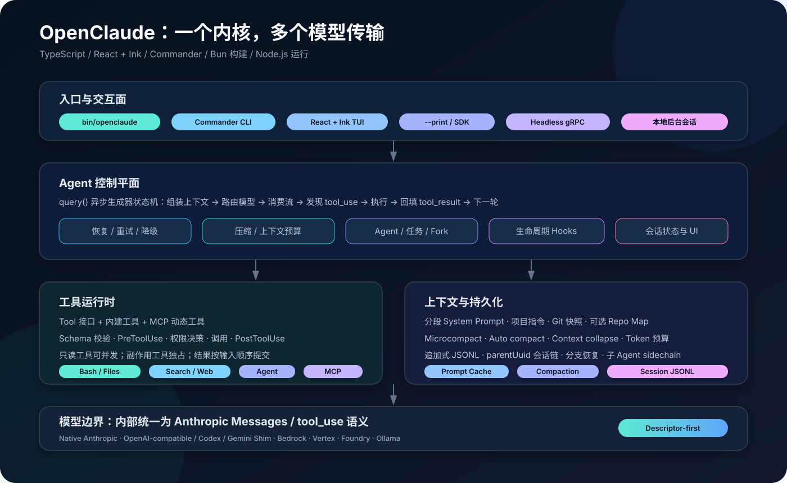
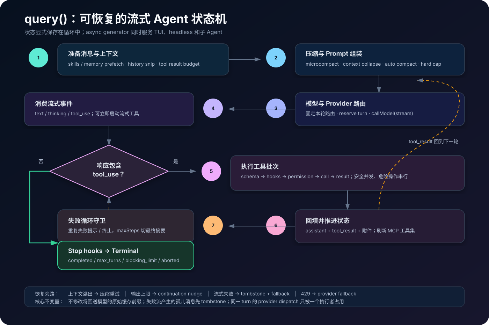
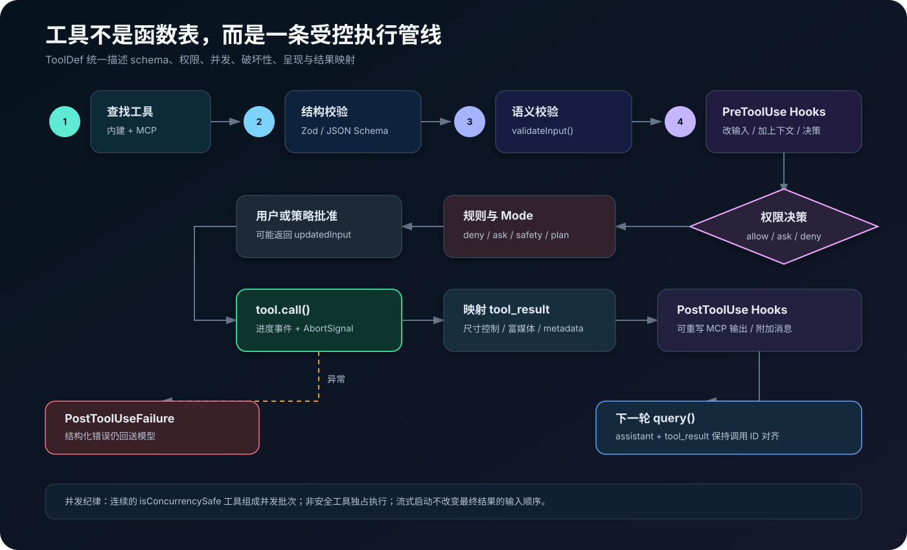
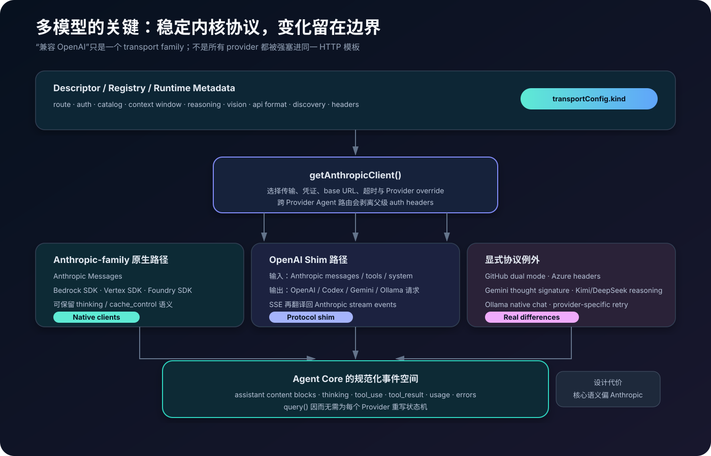
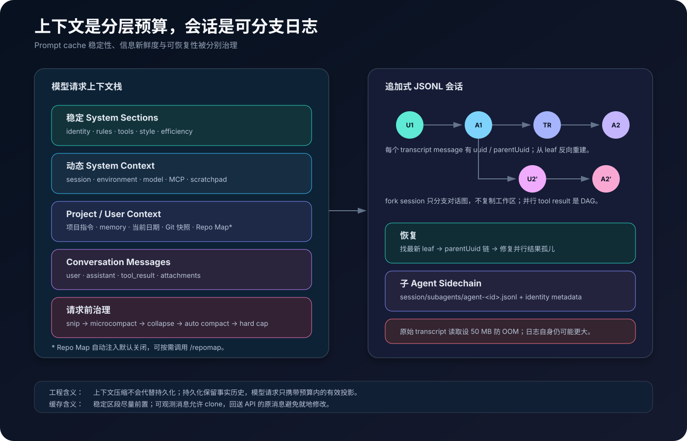

# OpenClaude 源码深潜：如何把 Claude Code 风格 Agent 接到任意模型



> 作者视角：大模型 Agent 工程 / Runtime 架构
> 调研日期：2026-09-03（Asia/Shanghai）
> 源码快照：[`aceacf0`](https://github.com/Gitlawb/openclaude/commit/aceacf0e590a7d84447a8c44f3aa61eba781a542)，`main`，包版本 `0.30.0`
> 说明：本文是源码静态审计与架构复盘，不是对所有 Provider 的在线兼容性测试。

## 先说结论

OpenClaude 不是一个简单的“把 Anthropic URL 改成 OpenAI URL”的代理，也不是从零设计的通用 Agent 框架。它的核心做法是：保留一套 Claude Code 风格的 Agent Runtime——终端 UI、工具调用、权限、上下文压缩、会话恢复、子 Agent 和 MCP——然后把不同模型的请求与流式响应，在边界处归一到 **Anthropic Messages / content block / `tool_use` / `tool_result`** 这一内部语义空间。

这带来一个非常务实的结果：复杂的 `query()` Agent 状态机只维护一份；OpenAI、Codex、Gemini、Ollama 等差异集中进 shim，Bedrock、Vertex、Foundry 等真实协议差异则保留专用 SDK 路径。仓库自述的定位也是“面向云端和本地模型的一套统一 coding-agent CLI”，并明确列出 prompts、tools、agents、MCP、slash commands 与 streaming output 等共同工作流。[README](https://github.com/Gitlawb/openclaude/blob/aceacf0e590a7d84447a8c44f3aa61eba781a542/README.md#L11-L13)

从 Agent 工程角度看，它最值得研究的不是 Provider 数量，而是下面五件事：

1. 用异步生成器把模型流、工具进度、恢复事件和 UI 解耦；
2. 在流还没结束时就调度已经完整到达的工具调用；
3. 把权限、Hooks、校验和结果归一化做成工具调用的必经管线；
4. 把上下文压缩设计为多级降载，而不是一次粗暴摘要；
5. 用 append-only JSONL 和 `parentUuid` 链支持恢复、分支及子 Agent sidechain。

但它也有三个必须正视的风险：**许可证来源存在明确警告；内部协议强耦合 Anthropic 语义；若干核心文件已大到接近“God module”**。

## 1. 调研口径与仓库快照

本次把仓库克隆到本地，固定在 `aceacf0e590a7d84447a8c44f3aa61eba781a542`，沿调用链阅读入口、Agent 循环、API client、tool runtime、权限、MCP、会话与 build script。快照统计如下：

| 项目 | 快照值 | 备注 |
| --- | ---: | --- |
| npm 包版本 | `0.30.0` | 最新 tag 为 `v0.30.0` |
| 提交数 | 1,196 | 本地 `git rev-list --count HEAD` |
| Git 跟踪文件 | 3,444 | 本地 `git ls-files` |
| `src` 下 TS/TSX 文件 | 3,189 | 其中测试文件 688 个 |
| `src/query.ts` | 3,204 行 | Agent 主状态机 |
| `src/main.tsx` | 4,475 行 | CLI 编排与 TUI 启动 |
| `sessionStorage.ts` | 6,196 行 | 会话读写与恢复 |

版本、CLI/SDK 导出和构建脚本可以从 [`package.json`](https://github.com/Gitlawb/openclaude/blob/aceacf0e590a7d84447a8c44f3aa61eba781a542/package.json#L2-L79) 交叉验证。统计值会随提交变化，因此只代表本文快照。

### 一个不能略过的法律事实

README 顶部显示 MIT badge，但仓库实际 `LICENSE` 文件是一份 `NOTICE`：它声明代码派生自 Anthropic 的专有 Claude Code CLI；只有 OpenClaude 贡献者的修改在“法律允许的范围内”按 MIT 提供；底层派生代码仍受 Anthropic 版权约束，且项目未获 Anthropic 授权分发专有源码。[LICENSE/NOTICE](https://github.com/Gitlawb/openclaude/blob/aceacf0e590a7d84447a8c44f3aa61eba781a542/LICENSE#L1-L29)

因此，**不能把这个仓库当作普通、干净、全量 MIT 授权的代码库**。学习和评估是一回事，将代码直接用于商业分发、二次发布或供应链依赖是另一回事；企业采用前应让法务审查来源、许可证链和可分发范围。本文不提供法律意见。

## 2. 总体架构：控制平面稳定，传输边界可变

源码可以切成六层：

| 层 | 主要职责 | 代表路径 |
| --- | --- | --- |
| 启动层 | Node launcher、快速参数路径、配置和 Provider 预加载 | `bin/openclaude`、`src/entrypoints/cli.tsx` |
| 产品层 | Commander 命令、React + Ink TUI、headless/SDK/gRPC | `src/main.tsx`、`src/components/`、`src/entrypoints/` |
| Agent 控制层 | 模型轮次、流式事件、恢复、压缩、工具循环 | `src/query.ts`、`src/services/api/claude.ts` |
| 工具层 | Tool 协议、权限、Hooks、并发、MCP 包装 | `src/Tool.ts`、`src/tools.ts`、`src/services/tools/` |
| 状态层 | Prompt、上下文、记忆、会话 JSONL、任务 | `src/constants/prompts.ts`、`src/context.ts`、`src/utils/sessionStorage.ts` |
| Provider 层 | 描述符、路由、原生客户端和协议 shim | `src/integrations/`、`src/services/api/client.ts`、`openaiShim.ts` |

最关键的架构判断是：**OpenClaude 的“通用”发生在边界，不发生在内核对象模型里。** `createOpenAIShimClient()` 返回一个形似 Anthropic SDK 的 `{ beta, messages }` 对象，内部把 Anthropic 消息和工具 schema 转成目标 Provider 请求，再把 SSE/非流式响应还原成 Anthropic stream events。[openaiShim](https://github.com/Gitlawb/openclaude/blob/aceacf0e590a7d84447a8c44f3aa61eba781a542/src/services/api/openaiShim.ts#L293-L380) [shim client](https://github.com/Gitlawb/openclaude/blob/aceacf0e590a7d84447a8c44f3aa61eba781a542/src/services/api/openaiShim.ts#L392-L574)

这不是理论上最中立的抽象，却是迁移既有 Agent Runtime 时成本最低、风险最可控的抽象：工具循环无需知道上游到底是 Chat Completions、Responses、Codex 还是 Gemini。

## 3. 启动链：为长会话和冷启动做过专门设计

`openclaude` 命令首先进入一个很薄的 Node launcher。它默认把 V8 old-space 上限提升到 8 GB，附加 `--expose-gc`，再动态导入构建后的 `dist/cli.mjs`；`--max-memory` 可覆盖默认值。[launcher](https://github.com/Gitlawb/openclaude/blob/aceacf0e590a7d84447a8c44f3aa61eba781a542/bin/openclaude#L19-L112)

随后 `src/entrypoints/cli.tsx` 使用动态 import 分阶段启动：

- `--version` 是零额外模块导入的快速路径；
- `ps/logs/attach/kill` 是纯本地后台会话快速路径，不触发凭证和 Provider 校验；
- `--provider-env-file` 与 `--provider` 必须先于配置解析生效；
- `--bare` 在导入完整 CLI 前设置，确保构建/运行时 gate 的模块初始化行为一致；
- 最后才载入 `src/main.tsx`。[CLI bootstrap](https://github.com/Gitlawb/openclaude/blob/aceacf0e590a7d84447a8c44f3aa61eba781a542/src/entrypoints/cli.tsx#L243-L419) [full CLI handoff](https://github.com/Gitlawb/openclaude/blob/aceacf0e590a7d84447a8c44f3aa61eba781a542/src/entrypoints/cli.tsx#L739-L768)

`main.tsx` 再完成 Commander 参数、managed settings、MCP、权限上下文、会话恢复与 Ink AppState 的拼装。产品表面看起来是一套终端 UI，底下其实有三种消费同一 Runtime 的形态：交互 TUI、`--print`/SDK 的 headless 流，以及 gRPC 服务。

后台会话不是 daemon：README 明确说它启动本地 child process，将日志和元数据写到 OpenClaude config 目录；当前 `attach` 也只是引导用户跟随日志，并非完整终端重连。[background sessions](https://github.com/Gitlawb/openclaude/blob/aceacf0e590a7d84447a8c44f3aa61eba781a542/README.md#L185-L220)

## 4. `query()`：真正的 Agent 内核



`query()` 是一个 `AsyncGenerator`，对外持续产出 stream event、request start、message、tombstone 和 tool-use summary，内部委托给 `queryLoop()`。[query interface](https://github.com/Gitlawb/openclaude/blob/aceacf0e590a7d84447a8c44f3aa61eba781a542/src/query.ts#L524-L675)

可以把它压缩成下面这段伪代码：

```ts
async function* queryLoop(state) {
  while (true) {
    const projected = projectMessages(state.messages)
    const compacted = await enforceContextBudget(projected)
    const route = pinModelRouteForCurrentTurn(state)

    for await (const event of callModel({
      messages: compacted,
      system: buildSystemPrompt(),
      tools: state.tools,
      route,
    })) {
      yield event
      if (event.containsToolUse) streamingExecutor.add(event.toolUse)
      yield* streamingExecutor.completedInInputOrder()
    }

    if (recoverableError) {
      state = recoverOrFallback(state)
      continue
    }
    if (!hasToolUse) return runStopHooks()

    const results = await streamingExecutor.drain()
    state.messages.push(assistantMessage, ...results)
    state.tools = refreshMcpTools()
  }
}
```

真实实现比伪代码复杂得多，但主干就是这七步：

1. 预取 skills / memory，投影历史消息，预算化大型 tool result；
2. 依次尝试 history snip、microcompact、context collapse 和 auto compact；
3. 为当前用户 turn 固定模型路由，防止一次工具循环中前后模型漂移；
4. 调 `queryModelWithStreaming()`，边收 token 边识别完整 `tool_use` block；
5. 允许流式工具执行器提前启动工具；
6. 把 assistant 与 `tool_result` 追加回状态，刷新可能变化的 MCP tool set；
7. 没有工具调用时执行 Stop hooks 并返回 `Terminal`。

循环初始化的是显式可变状态，包含消息、轮次、压缩/恢复 guard、fallback 状态、continuation nudge 计数和 Agent step limit，而不是把控制逻辑藏进递归 Promise。[query state](https://github.com/Gitlawb/openclaude/blob/aceacf0e590a7d84447a8c44f3aa61eba781a542/src/query.ts#L678-L745)

### 4.1 为什么要“流结束前执行工具”

模型可能连续产生多个工具调用。OpenClaude 在收到完整的 `tool_use` block 后立刻加入 `StreamingToolExecutor`，而不是等整条 assistant message 完全结束；这能把网络流剩余时间与工具 I/O 重叠。工具进度立即向 UI 发出，但结果仍按输入顺序提交，避免对话历史顺序不稳定。[streaming tool detection](https://github.com/Gitlawb/openclaude/blob/aceacf0e590a7d84447a8c44f3aa61eba781a542/src/query.ts#L1673-L1819)

### 4.2 恢复不是外围补丁，而是状态机分支

源码为以下失败分别建了恢复路径：

- streaming fallback：给失败尝试产生的孤儿消息发 tombstone，丢弃其工具结果，再创建新 executor；
- context overflow：触发响应式压缩后重试；
- max output tokens：在可继续时注入 continuation nudge；
- Provider 429：按 fallback chain 切换，但限制为一次性恢复，避免无限路由；
- 工具重复失败：failure-loop guard 先告警再终止；
- `maxSteps`：停止提供工具，要求子 Agent 生成最终摘要。

尤其值得肯定的是，源码区分“展示给 SDK/UI 的 clone”和“下一次送回模型的原消息”：只给可观测副本补充派生字段，避免改变 prompt-cache 前缀的字节表示。[stream handling](https://github.com/Gitlawb/openclaude/blob/aceacf0e590a7d84447a8c44f3aa61eba781a542/src/query.ts#L1490-L1819)

## 5. 工具 Runtime：schema、权限与生命周期的交汇点



`Tool` 不是简单的 `{name, fn}`。它同时承载：输入/输出 schema、模型提示描述、调用实现、并发安全性、只读/破坏性分类、权限检查、hook matcher、流式进度、终端渲染和 tool-result 映射。[Tool interface](https://github.com/Gitlawb/openclaude/blob/aceacf0e590a7d84447a8c44f3aa61eba781a542/src/Tool.ts#L397-L730)

工具池由两部分组成：内建工具与 MCP 动态工具。内建部分覆盖 Bash、Read/Edit/Write、Glob/Grep、Web、Agent、Task、Skill、LSP、RepoMap 等；`--bare` 通常缩减为 Bash、Read、Edit。组装时先应用 deny rules，再分别排序内建和 MCP 分区，最后去重且让内建同名工具优先。这种“分区稳定排序”是为 prompt-cache key 稳定性服务的。[tool assembly](https://github.com/Gitlawb/openclaude/blob/aceacf0e590a7d84447a8c44f3aa61eba781a542/src/tools.ts#L183-L241) [pool ordering](https://github.com/Gitlawb/openclaude/blob/aceacf0e590a7d84447a8c44f3aa61eba781a542/src/tools.ts#L262-L365)

### 5.1 一次工具调用的完整路径

`checkPermissionsAndCallTool()` 大致执行：

1. 找工具、规范化输入；
2. Zod/JSON Schema 结构校验；
3. 工具自己的 `validateInput()` 语义校验；
4. 运行 PreToolUse hooks，允许修改输入、添加上下文或提前给出权限决策；
5. 调统一 `canUseTool` 权限系统；
6. 获准后执行 `tool.call()`，透传 `AbortSignal` 和 progress callback；
7. 映射为模型能消费的 `tool_result`；
8. 成功跑 PostToolUse，失败跑 PostToolUseFailure；MCP 输出还可由 hook 改写。

输入错误和执行异常不会直接把 Agent 循环炸掉，而会变成带 `is_error` 的结构化 tool result，让模型有机会自纠。[tool execution](https://github.com/Gitlawb/openclaude/blob/aceacf0e590a7d84447a8c44f3aa61eba781a542/src/services/tools/toolExecution.ts#L783-L1191) [call and result](https://github.com/Gitlawb/openclaude/blob/aceacf0e590a7d84447a8c44f3aa61eba781a542/src/services/tools/toolExecution.ts#L1395-L1753) [failure hook](https://github.com/Gitlawb/openclaude/blob/aceacf0e590a7d84447a8c44f3aa61eba781a542/src/services/tools/toolExecution.ts#L1914-L1965)

### 5.2 并发规则

`isConcurrencySafe()` 为真的连续工具可并行；非安全工具必须独占。流式执行器维护 per-tool child `AbortController`，Bash 失败会终止兄弟子进程，而 Read/WebFetch 等独立 I/O 失败不会连坐；进度即时产出，最终结果保持输入顺序。[StreamingToolExecutor](https://github.com/Gitlawb/openclaude/blob/aceacf0e590a7d84447a8c44f3aa61eba781a542/src/services/tools/StreamingToolExecutor.ts#L46-L176) [abort and ordering](https://github.com/Gitlawb/openclaude/blob/aceacf0e590a7d84447a8c44f3aa61eba781a542/src/services/tools/StreamingToolExecutor.ts#L362-L575)

这套纪律比“`Promise.all(toolCalls)`”可靠得多：并行能力成为工具契约的一部分，副作用顺序也有明确边界。

### 5.3 权限模型

外部可选模式包括 `default`、`plan`、`acceptEdits`、`bypassPermissions`、`fullAccess`、`dontAsk`；open build 还启用了内部 `auto` classifier。权限决策不是单一布尔值，而是规则、工具检查、safety check、mode 和交互批准的组合。

几个重要不变量：

- 显式 deny rule 最先阻断；
- `plan` 机械性拒绝非只读调用，只允许精确的活动 plan 文件等例外；
- `bypassPermissions` 仍尊重显式内容 ask rule 和部分 safety check；
- `fullAccess` 是更高一级、会跳过这些提示的危险 opt-in；
- `dontAsk` 把需要询问的结果转成拒绝，适合不能弹交互框的运行环境。

对应决策顺序可见 [`permissions.ts`](https://github.com/Gitlawb/openclaude/blob/aceacf0e590a7d84447a8c44f3aa61eba781a542/src/utils/permissions/permissions.ts#L1172-L1276)，plan 模式的不变量在 [`checkPlanModePermissions`](https://github.com/Gitlawb/openclaude/blob/aceacf0e590a7d84447a8c44f3aa61eba781a542/src/utils/permissions/permissions.ts#L1414-L1521)。

这里也有一个扩展开发陷阱：`buildTool()` 默认把未声明的工具视为“不可并发、非只读”，但 `isDestructive()` 默认是 `false`，`checkPermissions()` 默认返回 allow，并跳过 auto classifier。安全敏感的第三方工具必须显式覆盖这些方法，不能把默认值理解为完整的 fail-closed。[buildTool defaults](https://github.com/Gitlawb/openclaude/blob/aceacf0e590a7d84447a8c44f3aa61eba781a542/src/Tool.ts#L778-L826)

## 6. 多 Provider 适配：Descriptor-first，而非 Descriptor-only



Provider 描述符把认证、模型目录、能力和 transport family 数据化。`TransportKind` 包括 `anthropic-native`、`anthropic-proxy`、`openai-compatible`、`local`、`gemini-native`、`bedrock` 和 `vertex`；模型条目可声明 reasoning、vision、context window、最大输出和请求级 override。[descriptor types](https://github.com/Gitlawb/openclaude/blob/aceacf0e590a7d84447a8c44f3aa61eba781a542/src/integrations/descriptors.ts#L5-L50) [model metadata](https://github.com/Gitlawb/openclaude/blob/aceacf0e590a7d84447a8c44f3aa61eba781a542/src/integrations/descriptors.ts#L52-L150)

官方架构文档把职责分得很清楚：

- descriptor 决定“这个 route 是什么、声称支持什么”；
- routing 把当前配置/环境解析为 route；
- transport 执行真实 HTTP/API 合约。[integrations architecture](https://github.com/Gitlawb/openclaude/blob/aceacf0e590a7d84447a8c44f3aa61eba781a542/docs/architecture/integrations.md#L25-L68)

### 6.1 客户端工厂的实际分流

`getAnthropicClient()` 是中心工厂：

| 路径 | 典型目标 | 做法 |
| --- | --- | --- |
| Anthropic native | Anthropic、部分 GitHub native mode | 直接构建 Anthropic client |
| OpenAI shim | OpenAI-compatible、Codex、Gemini、Mistral、Ollama 等 | 伪装 Anthropic SDK 接口，双向转换协议 |
| 专用云 SDK | Bedrock、Vertex、Foundry | 延迟加载对应 SDK 和凭证链 |
| per-Agent override | 不同子 Agent 路由到不同模型/端点 | 强制走 shim，并剥离父请求的 auth headers |

最后一点很重要：跨 Provider Agent 路由前会移除 `Authorization`、`x-api-key`、`api-key`，避免父 Provider 凭证被转发到第三方端点。[client routing](https://github.com/Gitlawb/openclaude/blob/aceacf0e590a7d84447a8c44f3aa61eba781a542/src/services/api/client.ts#L675-L733) Bedrock/Foundry/Vertex 仍保留专用认证路径，而不是假装所有服务都完全 OpenAI-compatible。[native cloud paths](https://github.com/Gitlawb/openclaude/blob/aceacf0e590a7d84447a8c44f3aa61eba781a542/src/services/api/client.ts#L734-L907)

### 6.2 Shim 到底转换什么

它不只是字段改名，还要处理：

- system prompt 与 role/message 结构；
- Anthropic `input_schema` 到 OpenAI strict tools schema；
- `max_tokens` / `max_completion_tokens`；
- Chat Completions、Responses、Codex、Gemini 的 endpoint 和 body；
- reasoning content、thinking format、Gemini thought signature；
- 流式 delta、tool-call arguments、usage 和错误到 Anthropic 事件；
- Ollama 的原生 chat 与本地重试。

这解释了为什么“兼容 OpenAI API”从来不是一个二元属性。仓库自己也承认当前架构是 descriptor-first、不是 descriptor-only，GitHub dual mode、Mistral、Azure auth/header、Gemini signature、DeepSeek/Kimi reasoning 以及云厂商认证都属于有意保留的例外。[known exceptions](https://github.com/Gitlawb/openclaude/blob/aceacf0e590a7d84447a8c44f3aa61eba781a542/docs/architecture/integrations.md#L136-L190)

## 7. 上下文工程：先投影，再压缩，最后才拒绝请求



系统提示词按 section 组装。稳定、适合缓存的身份/行为/工具/风格区段在前，session、memory、environment、language、MCP、scratchpad 等动态区段在后；override、coordinator、agent、custom、default 有明确优先级，append prompt 最后追加。[prompt sections](https://github.com/Gitlawb/openclaude/blob/aceacf0e590a7d84447a8c44f3aa61eba781a542/src/constants/prompts.ts#L441-L600) [prompt precedence](https://github.com/Gitlawb/openclaude/blob/aceacf0e590a7d84447a8c44f3aa61eba781a542/src/utils/systemPrompt.ts#L28-L122)

每次请求前，上下文治理不是只有 `/compact`：

1. 约束过大的 tool result；
2. history snip 删除可安全移除的旧内容；
3. microcompact 对特定历史块做轻量压缩；
4. context collapse / auto compact 生成更紧凑的上下文；
5. 如果仍超过 active-message 或 compact safety hard cap，就在发请求前终止。

这种分级策略的目标是保住最近的任务轨迹和 prompt-cache 前缀，同时避免把“Provider 返回 context too long”当作第一层控制机制。[pre-request compaction](https://github.com/Gitlawb/openclaude/blob/aceacf0e590a7d84447a8c44f3aa61eba781a542/src/query.ts#L933-L1115)

### 7.1 Repo Map

Repo Map 的实现是：枚举 Git 跟踪及未忽略文件，用 tree-sitter 提取 TS/JS/Python 符号，建立按引用次数 × IDF 加权的文件引用图，再用 PageRank 排名，最后按 token budget 输出路径和签名。缓存按路径、mtime、size 增量复用。[repo-map design](https://github.com/Gitlawb/openclaude/blob/aceacf0e590a7d84447a8c44f3aa61eba781a542/docs/repo-map.md#L1-L25)

需要注意：自动注入默认关闭，`REPO_MAP=1` 才会在 session context 中使用 1,024-token map；`/repomap` 命令不依赖这个 gate，默认预算 2,048 token。文档给出的冷启动 20–30 秒、缓存后低于 100 ms 是仓库自述，不是本文独立 benchmark。[repo-map usage](https://github.com/Gitlawb/openclaude/blob/aceacf0e590a7d84447a8c44f3aa61eba781a542/docs/repo-map.md#L26-L78)

## 8. 会话：JSONL 是事件事实，Prompt 只是预算投影

会话以追加式 JSONL 保存。user、assistant、attachment 和特定 system message 才是 transcript message；高频 progress 只属于 UI，不参与 `parentUuid` 链，避免恢复时把真实对话分叉成孤儿。[transcript messages](https://github.com/Gitlawb/openclaude/blob/aceacf0e590a7d84447a8c44f3aa61eba781a542/src/utils/sessionStorage.ts#L445-L524)

恢复时从最新 leaf 沿 `parentUuid` 反向走到根，再反转得到对话；由于并行 tool use 的真实拓扑可能是 DAG，代码还有后处理去找回兄弟 assistant block 和 tool result。[conversation chain](https://github.com/Gitlawb/openclaude/blob/aceacf0e590a7d84447a8c44f3aa61eba781a542/src/utils/sessionStorage.ts#L2985-L3060)

几个实用细节：

- fork session 只创建新的会话分支，不复制 filesystem 或 Git worktree；
- 子 Agent transcript 位于主 session 的 `subagents/agent-<id>.jsonl`；
- 原始 transcript 读取设置 50 MB guard，注释明确说明 JSONL 本身可能增长到数 GB；
- OpenClaude 默认使用 `~/.openclaude`，不读取 `~/.claude`、项目 `.claude/` 或 `CLAUDE_CONFIG_DIR`。[config cutover](https://github.com/Gitlawb/openclaude/blob/aceacf0e590a7d84447a8c44f3aa61eba781a542/README.md#L222-L234) [paths and guard](https://github.com/Gitlawb/openclaude/blob/aceacf0e590a7d84447a8c44f3aa61eba781a542/src/utils/sessionStorage.ts#L526-L586)

这里体现出一个成熟的 Agent Runtime 观念：**持久化层保存完整事实历史，模型层只消费当前 token 预算下的投影。** 压缩不应破坏审计与恢复，日志也不应被迫等同于 prompt。

## 9. 子 Agent：复用同一循环，改变上下文、工具和生命周期

子 Agent 没有第二套推理引擎；`runAgent()` 最终仍调用同一个 `query()`。区别来自运行前的上下文构造：

- 可继承并过滤父消息，实现 forked context；
- 可为不同 Agent 指定 model、Provider route、effort、permission mode、tools 和 `maxSteps`；
- 可预载 skills，并把 Agent frontmatter 中的 MCP server 加到父 MCP 集合；
- 同步 Agent 共享父 abort/controller 与部分状态，异步 Agent 使用独立 controller；
- 后台 Agent 默认不能弹权限 UI，因此需要询问的操作会被避免或拒绝；
- 身份 metadata 先持久化，再写 sidechain transcript，防止恢复时失去受限身份。

Provider 路由、父消息过滤和权限派生见 [`runAgent()`](https://github.com/Gitlawb/openclaude/blob/aceacf0e590a7d84447a8c44f3aa61eba781a542/src/tools/AgentTool/runAgent.ts#L340-L520)，skills/MCP/工具池和最终复用 `query()` 见 [后半段实现](https://github.com/Gitlawb/openclaude/blob/aceacf0e590a7d84447a8c44f3aa61eba781a542/src/tools/AgentTool/runAgent.ts#L553-L850)。

这是一个很好的复用边界：子 Agent = 新的 `ToolUseContext` + 受限工具集 + 独立消息 sidechain，而不是 fork 一份完整产品进程。只有 team/tmux 等模式才走进程级并行路径。

## 10. MCP：把远端工具编译进本地 Tool 协议

MCP client 通过 `tools/list` 拉取 server tools，做 Unicode 清理，默认将名字规范化为 `mcp__<server>__<tool>`，再把 MCP schema、描述、annotations 和 call 方法包装成内部 `Tool`。[MCP wrapping](https://github.com/Gitlawb/openclaude/blob/aceacf0e590a7d84447a8c44f3aa61eba781a542/src/services/mcp/client.ts#L1860-L1979)

MCP 输入用 AJV 校验，按 `$schema` 在 draft-07 与 2020-12 间选择，编译结果放进 `WeakMap`，使断开/刷新后的 schema 可被回收；返回值可以是文本或富 content blocks。[MCP Tool](https://github.com/Gitlawb/openclaude/blob/aceacf0e590a7d84447a8c44f3aa61eba781a542/src/tools/MCPTool/MCPTool.ts#L1-L182)

值得警惕的是，MCP 的 `readOnlyHint` 同时影响 `isReadOnly()` 和 `isConcurrencySafe()`，plan mode 也只依赖该 hint 判断 MCP 是否只读。由于 annotation 来自 server，接入不完全可信的 MCP 时，不应仅依赖它做安全边界；还要使用 server/tool allow/deny rules、沙箱和最小权限凭证。[MCP annotations](https://github.com/Gitlawb/openclaude/blob/aceacf0e590a7d84447a8c44f3aa61eba781a542/src/services/mcp/client.ts#L1941-L1954) [plan-mode MCP check](https://github.com/Gitlawb/openclaude/blob/aceacf0e590a7d84447a8c44f3aa61eba781a542/src/utils/permissions/permissions.ts#L1443-L1451)

## 11. Open build、功能开关与发布形态

源码中的 `feature('FLAG')` 会在 Bun 构建时替换为布尔字面量，从而让 tree shaking 移除不可用代码。当前 open build 的代表性矩阵：

| 状态 | 能力 |
| --- | --- |
| 开启 | context collapse、history snip、本地后台会话、MCP skills、coordinator、Explore/Plan agents、auto permission classifier、token budget、fork subagent、conversation arc、multi-turn context |
| 运行时 opt-in | Repo Map 自动注入（`REPO_MAP=1`） |
| 关闭/缺源或依赖内部设施 | voice、proactive、Kairos、bridge、daemon、remote triggers、browser tool、computer-use MCP |

权威开关表在 [`scripts/build.ts`](https://github.com/Gitlawb/openclaude/blob/aceacf0e590a7d84447a8c44f3aa61eba781a542/scripts/build.ts#L81-L132)。这里最容易产生误读：源码树里“看见一个模块或 import”不等于 npm 包中的 open build 真的启用了它；必须同时检查 build flag、stub 和运行时 gate。

构建产物是 Node ESM：Bun 将 CLI 打成单一 `dist/cli.mjs`，另打一个不捆绑 React/Ink 的 `dist/sdk.mjs`；缺失的内部/native 模块会被显式 stub，构建后还检查 stub marker。CLI 对语法和空白做 minify，但不改 identifier，因为错误分类等逻辑依赖 `constructor.name`。[CLI build](https://github.com/Gitlawb/openclaude/blob/aceacf0e590a7d84447a8c44f3aa61eba781a542/scripts/build.ts#L179-L210)

## 12. 工程评价：哪些设计值得抄，哪些债务要绕开

### 值得借鉴

**1. 用事件流统一交互与无头模式。** `AsyncGenerator` 让 TUI、SDK、日志、子 Agent 都能消费相同事件，不必把 UI callback 塞进推理逻辑。

**2. Provider 归一化放在 API 边界。** 一份工具循环服务多个模型，真正不同的协议保留专用路径，避免“最低共同能力”抽象。

**3. 工具调用是一条 policy pipeline。** schema、semantic validation、hooks、permission、abort、result mapping 全部集中，可观测性和安全性比散落在每个工具里更强。

**4. 上下文治理是分级控制系统。** 先局部减负，再整体压缩，最后硬拒绝；同时保护 prompt cache 的稳定前缀。

**5. 失败被建模为 Agent 可消费事件。** 工具错误、Provider 错误、stream fallback 和 continuation 都有明确状态，而不是任由异常穿透 UI。

### 主要技术债与风险

**1. 来源与许可风险是 P0。** 这不是代码质量问题，而是能否合法采用的问题；任何架构优点都不能覆盖它。

**2. 核心模块过大。** `main.tsx`、`query.ts`、`sessionStorage.ts`、`toolExecution.ts` 合计超过 1.5 万行，状态耦合、测试矩阵和新人理解成本都很高。更健康的演进方向是按“request preparation / stream reducer / recovery policy / tool scheduling / transcript graph”切模块，同时保持事件协议不变。

**3. 内部协议并不 Provider-neutral。** 以 Anthropic content blocks 为 canonical model 降低了迁移成本，却意味着每个非 Anthropic Provider 都要模拟 thinking、tool-call 和错误语义；Provider 新特性也可能先被压扁再使用。

**4. Descriptor 与 env 兼容层并存。** 当前 route 仍受大量环境变量驱动，metadata、routing 和 transport 之间存在兼容桥。新增 Provider 时若只加 descriptor、不跑生成与 transport 测试，容易得到“UI 可选、运行失败”的半成品。

**5. 安全默认值需要扩展者自觉。** 内建工具经过完整权限体系，但 `buildTool()` 的默认 allow 和 MCP server 自报 annotations 都要求插件/MCP 运营方承担额外审查。

**6. 8 GB 默认 heap 是症状也是保护。** 它让长 session 更稳，却提示 transcript、消息投影、工具大结果和 UI state 仍有显著内存压力。未来更理想的是索引式会话读取、分段物化和严格的大对象所有权。

## 13. 如果从零复刻：建议的最小实现顺序

不要先做 20 个 Provider。先建立不变量，再扩展边界：

1. 定义 canonical `MessageEvent`：text、thinking、tool call、tool result、usage、error；
2. 实现单 Provider 的 `AsyncGenerator` 模型流；
3. 实现纯状态机 reducer：`prepare → model → tools → append → stop`；
4. 定义 Tool contract，把 schema、只读、并发、权限和 result mapping 设为必填；
5. 实现串行工具执行，再加只读并发和按输入顺序提交；
6. 加 append-only transcript，消息必须有稳定 ID 与 parent；
7. 加 token budget、tool-result truncation 和一次完整 compact；
8. 第二个 Provider 必须通过 adapter 接入，禁止在 Agent loop 写 Provider switch；
9. 再加 MCP、子 Agent、后台任务和 UI；
10. 最后做智能路由、复杂恢复与 Repo Map。

一个可维护的目录边界可以是：

```text
agent-runtime/
├── events.ts             # canonical event protocol
├── reducer.ts            # pure state transitions
├── loop.ts               # async generator orchestration
├── recovery-policy.ts
├── context-budget.ts
├── tools/
│   ├── contract.ts
│   ├── scheduler.ts
│   └── permission.ts
├── providers/
│   ├── adapter.ts
│   ├── anthropic.ts
│   └── openai.ts
└── persistence/
    ├── transcript.ts
    └── graph.ts
```

核心原则是：**状态转换尽量纯，I/O 通过端口注入，安全属性不能是“可选文档约定”。**

## 14. 本地运行与源码阅读路线

官方 npm 安装需要 Node.js `>=22`，Bun 只用于源码构建和本地开发。[Quick Start](https://github.com/Gitlawb/openclaude/blob/aceacf0e590a7d84447a8c44f3aa61eba781a542/README.md#L125-L162)

```bash
# 直接使用发布包
npm install -g @gitlawb/openclaude@latest
openclaude

# 从源码研究
git clone https://github.com/Gitlawb/openclaude.git
cd openclaude
bun install
bun run build
node bin/openclaude --version
```

建议按以下顺序读代码：

1. `bin/openclaude`：理解进程和内存启动方式；
2. `src/entrypoints/cli.tsx`：理解配置/Provider 的前置顺序；
3. `src/main.tsx`：只看 headless 与 `launchRepl` 分支，不要一开始逐行读；
4. `src/query.ts`：先画状态机，再跟恢复分支；
5. `src/Tool.ts` → `src/tools.ts` → `toolExecution.ts` → `StreamingToolExecutor.ts`；
6. `client.ts` → `openaiShim.ts` → `src/integrations/`；
7. 最后读 `sessionStorage.ts`、`AgentTool/runAgent.ts` 和 MCP client。

运行时配置建议优先用 `/provider` 生成 OpenClaude 自己的 profile；仓库不会自动加载项目 `.env`，如需显式加载可用 `--provider-env-file`。[configuration note](https://github.com/Gitlawb/openclaude/blob/aceacf0e590a7d84447a8c44f3aa61eba781a542/README.md#L151-L162)

## 结语

OpenClaude 展示了一条很现实的 Agent 产品工程路线：不追求一开始就有最纯粹的通用抽象，而是先保住成熟的终端 Agent 交互和控制循环，再用 adapter、descriptor 与专用 client 逐步拓宽模型边界。

它最有价值的思想可以概括为一句话：**把模型差异隔离在传输层，把 Agent 的状态、工具、安全和恢复做成稳定内核。**

但如果要在生产系统里借鉴，应该复用这些架构思想，而不是忽视许可证警告直接复制仓库；同时要把巨型状态机拆成可测试的 reducer 和 policy module，并把每个第三方工具的权限与副作用属性变成强制契约。

---

本文所有实现判断均来自上述固定 commit 的仓库源码与仓库内文档；项目状态、Provider 数量和默认开关后续可能变化。版本入口：[GitHub 仓库](https://github.com/Gitlawb/openclaude) · [v0.30.0 Release](https://github.com/Gitlawb/openclaude/releases/tag/v0.30.0)。
