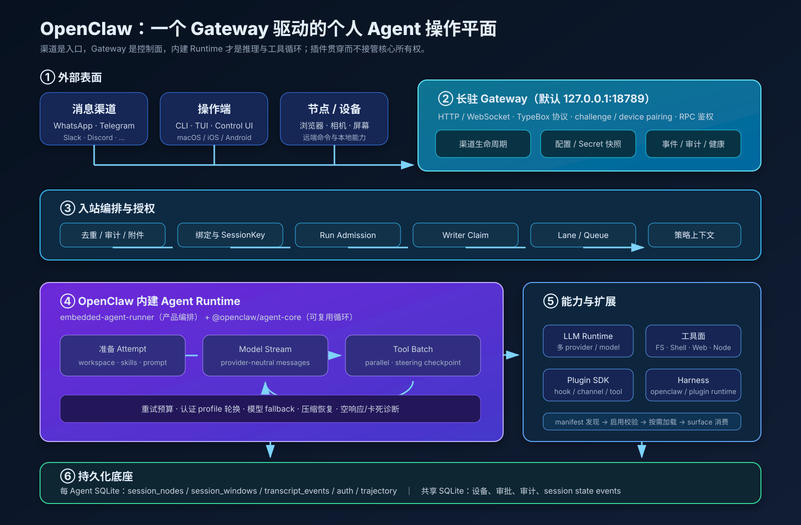
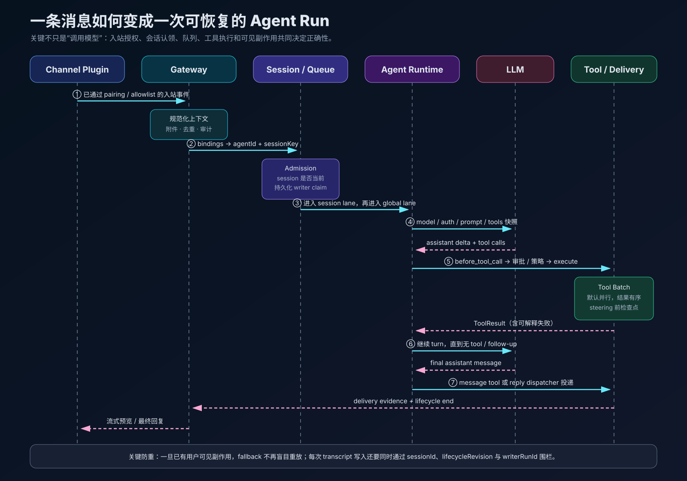
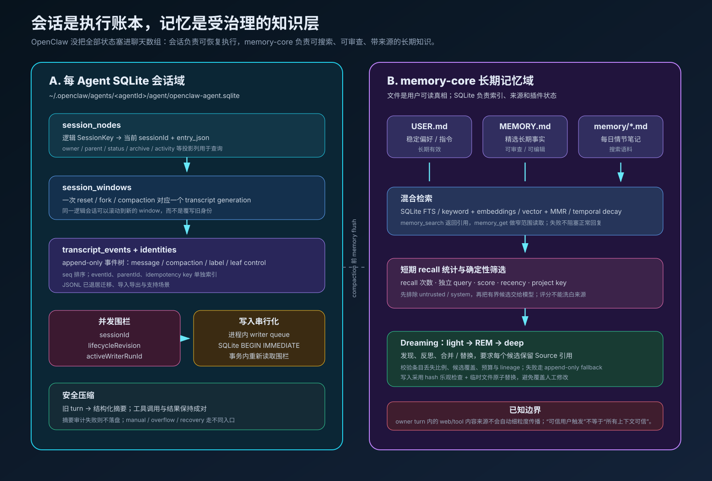
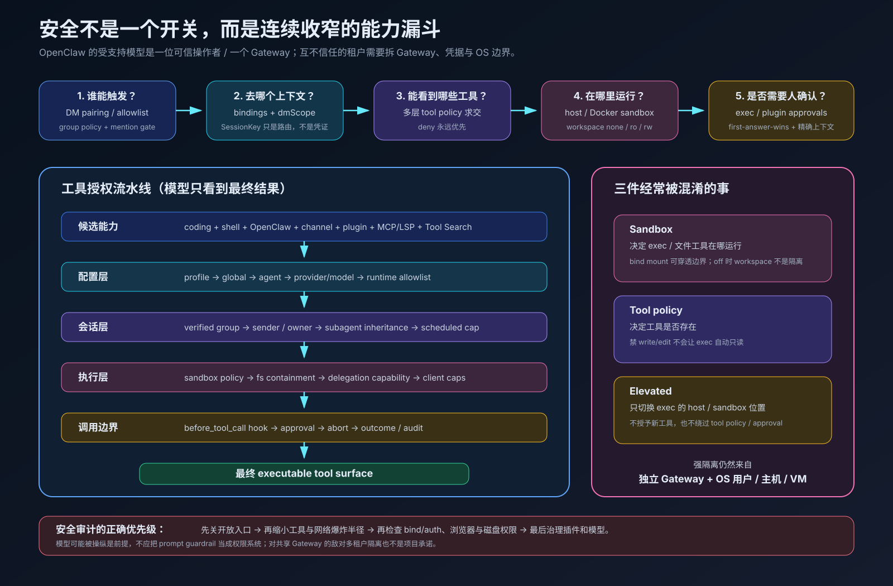

# OpenClaw 源码解剖：个人 Agent 如何长成一套可恢复的操作系统

> 站在大模型 Agent 工程师视角，对 [openclaw/openclaw](https://github.com/openclaw/openclaw) 的实现做一次从 Gateway、Agent Loop、工具权限、SQLite 会话到长期记忆的系统拆解。

| 调研项 | 信息 |
| --- | --- |
| 调研日期 | 2026-08-25 |
| 源码基线 | `main` · [`d53ea9cf4d453a390d0244ce1c0aa2c09e18f52a`](https://github.com/openclaw/openclaw/tree/d53ea9cf4d453a390d0244ce1c0aa2c09e18f52a) |
| 源码包版本 | `2026.8.1`；Node.js 要求 `>=22.22.3 <23`、`>=24.15.0 <25` 或 `>=25.9.0` |
| 调研方法 | 官方源码浅克隆、启动与请求调用链阅读、SQLite schema 核验、插件/内存/安全文档与实现交叉验证、仓库规模统计 |
| 适合读者 | Agent Runtime 工程师、个人 AI 助手开发者、准备扩展或二次开发 OpenClaw 的团队 |

这不是一篇“OpenClaw 支持哪些聊天软件”的功能清单。本文真正想回答的是：**当一个 Agent 同时拥有长期会话、多模型、Shell、文件、浏览器、消息渠道、定时任务和插件时，怎样让每次执行有明确身份、有限权限、可恢复状态与可解释结局？**

---

## 先说结论

从实现看，OpenClaw 最准确的定位不是聊天机器人，也不是单一 Coding Agent，而是：

> **以一个长驻 Gateway 为控制面、以内建 Agent Runtime 为执行面、以渠道和设备为 I/O、以插件为能力扩展的单操作者个人 Agent 平台。**

我认为它最值得 Agent 工程师研究的九点是：

1. **Gateway 是系统的真正中心。** 渠道、Control UI、CLI、TUI 和节点都连接同一个控制面，后者统一拥有路由、配置、鉴权、会话、Agent run 与事件广播。
2. **内建运行时已经是 OpenClaw 自己的实现。** `@openclaw/agent-core` 提供循环原语，`embedded-agent-runner` 提供产品编排；当前主链路不再依赖外部 Agent framework，Pi 仅保留 TUI 依赖与重要设计血缘。
3. **一次 run 在调用模型之前就已完成大量工作。** 入站授权、会话选择、幂等去重、run admission、writer claim、队列和策略上下文都先于模型流。
4. **会话一致性不是靠“同一 session 不并发”一句话保证。** 它同时使用 session lane、持久化 writer claim、lifecycle revision、进程内 writer queue 与 SQLite 事务内复验。
5. **工具权限是求交管线，不是一个 allowlist。** profile、全局、Agent、模型、发送者、群组、子 Agent、sandbox、runtime capability 都能继续收窄；deny 优先。
6. **可靠性设计围绕“副作用不可盲目重放”。** 认证轮换、模型 fallback、压缩恢复都有重试，但一旦已经产生用户可见投递，运行时会保守停止跨模型重放，避免重复发送。
7. **长期记忆是一个带来源治理的数据产品。** 文件是可读真相，SQLite 做检索与状态，Dreaming 只接收通过确定性来源门禁的候选，并验证模型合并结果。
8. **插件边界强调能力所有权。** manifest 负责低成本发现，activation plan 决定何时导入代码，插件拥有 provider/channel/tool/hook；核心只定义通用 capability contract。
9. **它明确不是敌对多租户平台。** 一位可信操作者、一个 Gateway 是受支持的安全模型；互不信任的用户应拆 Gateway、凭据和 OS/主机边界。



---

## 1. 先建立正确心智模型

### 1.1 OpenClaw 是“个人 Agent 操作平面”

仓库 README 把它描述为运行在用户设备上的个人 AI 助手，可以通过已有聊天渠道触达，并通过一个 Gateway 连接模型、工具、渠道和 companion app。[来源：README](https://github.com/openclaw/openclaw/blob/d53ea9cf4d453a390d0244ce1c0aa2c09e18f52a/README.md)

这个描述背后有三层所有权：

| 层 | 拥有什么 | 不该误解成什么 |
| --- | --- | --- |
| 渠道插件 | 远端身份、消息规范化、回复动作、渠道生命周期 | Agent Runtime 本身 |
| Gateway | 连接、鉴权、路由、配置、会话 admission、RPC、事件与服务生命周期 | 一个简单 WebSocket 转发器 |
| Agent Runtime | prompt、模型、tool loop、steering、compaction、retry、最终回复 | 某个供应商 SDK 的薄包装 |

官方 `VISION.md` 给出了很清楚的产品约束：优先安全、稳定和易设置；选择 TypeScript 是因为大量工作集中在 orchestration、prompt、tools、protocol 与 integrations，而且用户需要能直接修改系统；核心特性要支付每次调用的提示词、工具与配置成本，因此新增能力应尽量放进插件。[来源：VISION](https://github.com/openclaw/openclaw/blob/d53ea9cf4d453a390d0244ce1c0aa2c09e18f52a/VISION.md)

这也解释了为什么 OpenClaw 看起来“大”，内核却仍不断追求边界清晰：产品要覆盖很多生活入口，但不能把所有入口的语义永久焊进每一次模型调用。

### 1.2 代码规模：复杂度主要长在集成和防错上

在本次固定 commit 上，我做了快照统计：

| 指标 | 数量 | 说明 |
| --- | ---: | --- |
| `extensions/` 一级目录 | 150 | 包括渠道、模型/provider、能力与产品插件，不等于 150 个渠道 |
| `packages/` 一级目录 | 22 | 协议、AI、Agent core、插件 SDK、共享基础包等 |
| TS/TSX/Swift/Kotlin 文件 | 27,917 | 统计范围为 `src packages extensions apps ui` |
| 测试/规格文件 | 10,563 | 文件名匹配 `*.test.*` / `*.spec.*` |
| 非测试 TS 行数 | 约 40 万 | 范围为 `src packages extensions`，包含生成或基础设施代码 |

这些数字不是质量评分，只说明一个事实：OpenClaw 的工程难点早已不是写一个 `while (tool_calls)`，而是让**大量异构表面共享同一套身份、状态、工具和恢复语义**。

---

## 2. 从 `openclaw` 命令到长驻 Gateway

### 2.1 启动入口刻意走快速路径

根目录 `openclaw.mjs` 先检查 Node/Bun 能力、启用 compile cache，并处理必要的重启与 signal 转发；`src/entry.ts` 再延迟导入 CLI，避免 fast-path 命令为完整运行时支付启动成本。[源码：`openclaw.mjs`](https://github.com/openclaw/openclaw/blob/d53ea9cf4d453a390d0244ce1c0aa2c09e18f52a/openclaw.mjs) [源码：`src/entry.ts`](https://github.com/openclaw/openclaw/blob/d53ea9cf4d453a390d0244ce1c0aa2c09e18f52a/src/entry.ts)

Gateway 默认监听 `127.0.0.1:18789`。`startGatewayServerCore()` 的启动顺序可以概括为：

```text
生成 bootId
  → createGatewayKernel（解析配置、共享状态、核心服务）
  → createGatewayHttpTransport（HTTP / WS transport）
  → transportBridge.attach
  → finishGatewayStartup（渠道、插件、后台服务、ready）
  → 延迟启动非关键 prewarm / cleanup
```

关闭同样是编排好的：先封住新工作、终止 operator terminal、停止 sidecar、执行 `gateway_stop` hook、完成 prelude，再关闭 transport。它不是“把 server.close() 放进 finally”这么简单。[源码：`server-start.ts`](https://github.com/openclaw/openclaw/blob/d53ea9cf4d453a390d0244ce1c0aa2c09e18f52a/src/gateway/server-start.ts)

### 2.2 Gateway 协议是一套类型化状态协议

客户端连接后第一帧必须是 `connect`。普通调用采用 request / response / event 三种帧：

```json
{ "type": "req", "id": "...", "method": "agent", "params": {} }
{ "type": "res", "id": "...", "ok": true, "payload": {} }
{ "type": "event", "event": "agent", "payload": {}, "seq": 42 }
```

协议 schema 由 TypeBox 定义。带副作用的 `send`、`agent` 等方法要求幂等 key，Gateway 维护短期去重；事件本身不承诺 replay，客户端发现 sequence gap 后要重新读取快照。这种选择把“命令幂等”与“状态同步”分开，而不是假装 WebSocket 永不丢事件。[来源：架构文档](https://github.com/openclaw/openclaw/blob/d53ea9cf4d453a390d0244ce1c0aa2c09e18f52a/docs/concepts/architecture.md)

连接鉴权也不只是一枚共享 token。当前协议支持 device identity、pairing 与 challenge nonce 签名；角色、scope 或设备元数据扩大时需要重新批准。loopback 可以按配置静默批准，这是把“已拥有宿主本地访问”视为同一信任域，而非把本地连接伪装成公网零信任。[来源：Gateway authentication](https://github.com/openclaw/openclaw/blob/d53ea9cf4d453a390d0244ce1c0aa2c09e18f52a/docs/gateway/authentication.md) [来源：Node pairing](https://github.com/openclaw/openclaw/blob/d53ea9cf4d453a390d0244ce1c0aa2c09e18f52a/docs/gateway/pairing.md)

---

## 3. 一条渠道消息的端到端执行链



从 WhatsApp、Telegram、Slack 或 Discord 进来的一条消息，大致经过以下阶段：

1. **渠道先做入口授权。** pairing、DM/group allowlist、mention gate 等在 Agent 之前生效。
2. **插件把远端事件规范化。** 形成统一 `MsgContext`，带上渠道、账号、sender、chat、thread、附件和可信的运行时 identity carrier。
3. **dispatch 管线做去重与准备。** `dispatchReplyFromConfig()` 依次 gather、prepare delivery/context/operation、choose route、prepare execution、execute、finalize，并在失败时决定释放还是提交 inbound dedupe claim。[源码：`dispatch-from-config.ts`](https://github.com/openclaw/openclaw/blob/d53ea9cf4d453a390d0244ce1c0aa2c09e18f52a/src/auto-reply/reply/dispatch-from-config.ts)
4. **路由选出 Agent 和 SessionKey。** bindings 只在消息已被渠道接受后工作，不能授予入口权限。
5. **Gateway `agent` RPC 做 preflight。** 校验参数、捕获连接 principal、规范化附件与输入、准备会话、分配 runId、处理 reset/new 与幂等 replay。[源码：`agent-run-handler.ts`](https://github.com/openclaw/openclaw/blob/d53ea9cf4d453a390d0244ce1c0aa2c09e18f52a/src/gateway/server-methods/agent-run-handler.ts)
6. **先返回 accepted，再异步执行。** `agent` 接受后给客户端 runId；客户端可通过事件观察，也可调用 `agent.wait` 等待终局。wait 会再次检查调用者对目标 session 的可见性。[源码：`agent-wait.ts`](https://github.com/openclaw/openclaw/blob/d53ea9cf4d453a390d0244ce1c0aa2c09e18f52a/src/gateway/server-methods/agent-wait.ts)
7. **Agent Runtime 获取会话 writer 和队列。** 同 session 串行，随后受全局并发 lane 限制。
8. **模型与工具循环运行。** 增量事件经 Gateway 广播，渠道 dispatcher 可生成 typing、草稿、block stream 或最终消息。
9. **终局归一化。** lifecycle 关闭为 completed/errored/aborted/timeout 等；投递证据、审计元数据和 session 状态分别落入其权威 owner。

这里最值得借鉴的是：**“接受请求”与“完成 Agent”是两种不同协议状态。** 长任务不占着一次 RPC 等到模型结束，同时 runId、事件与 `agent.wait` 又能把异步生命周期重新组合起来。

---

## 4. 路由与多 Agent：bindings 只负责“选谁”

`resolveAgentRoute()` 根据 channel、account、peer、thread parent、guild/team、role 等信息匹配 binding，优先级为：

```text
精确 peer
  → parent peer
  → peer kind wildcard
  → guild + roles
  → guild
  → team
  → account
  → channel
  → default agent
```

选出 Agent 后，才根据 `dmScope`、`groupScope` 和 identity links 生成 session key。[源码：`resolve-route.ts`](https://github.com/openclaw/openclaw/blob/d53ea9cf4d453a390d0244ce1c0aa2c09e18f52a/src/routing/resolve-route.ts#L616)

默认语义很有“个人助理”特色：

- 所有私聊默认共享 Agent 的 `main` session，方便跨渠道连续对话；
- 群聊默认按 group 隔离；
- 多人私聊入口应把 `dmScope` 改成 `per-channel-peer` 或更细，否则不同人会共享上下文；
- `sessionKey` 是路由选择器，不是授权 token。

这组默认值在个人助手场景很顺手，在 SaaS 多租户场景却危险。源码没有试图用复杂 ACL 把同一个 Gateway 变成敌对租户边界，而是明确要求拆实例。[来源：Session management](https://github.com/openclaw/openclaw/blob/d53ea9cf4d453a390d0244ce1c0aa2c09e18f52a/docs/concepts/session.md) [来源：Agent bindings](https://github.com/openclaw/openclaw/blob/d53ea9cf4d453a390d0244ce1c0aa2c09e18f52a/docs/concepts/agent-bindings.md)

---

## 5. 内建 Agent Runtime：产品编排与循环内核分层

OpenClaw 当前的运行时分工可以画成四层：

| 层 | 目录 / 包 | 职责 |
| --- | --- | --- |
| 产品入口 | `src/agents/agent-command.ts` | 会话准备、发送策略、ACP/内建分流、结果与 delivery 收尾 |
| Attempt 编排 | `src/agents/embedded-agent-runner` | lane、模型/auth、workspace、skills、tools、hooks、重试、压缩和 transcript |
| 循环内核 | `packages/agent-core` | provider-neutral message、agent loop、工具批次、steering/follow-up、session contract |
| LLM runtime | `src/llm` + `packages/ai` | provider/model registry、stream、兼容性与认证 |

官方文档明确说明：OpenClaw 已拥有自己的 built-in runtime，不再保留外部 Agent framework 依赖；`@earendil-works/pi-tui` 仍是第三方依赖。内建 runtime id 是 `openclaw`，旧配置中的 `pi` 会规范化为 `openclaw`。[来源：Agent runtime architecture](https://github.com/openclaw/openclaw/blob/d53ea9cf4d453a390d0244ce1c0aa2c09e18f52a/docs/agent-runtime-architecture.md)

### 5.1 Pi 的关系：不是“套壳”，也不是“毫无关系”

OpenClaw 的 README 仍向 Pi 与 Mario Zechner 致谢，循环形态、消息与工具抽象也能看出明显血缘。但判断当前实现时应以依赖和所有权为准：

- Agent loop 位于 OpenClaw 自己的 `packages/agent-core`；
- SessionManager、SQLite transcript、retry、writer claim、plugin hooks 与 delivery 都是 OpenClaw 自己的产品语义；
- 保留的 Pi 包是终端 UI：`@earendil-works/pi-tui`；
- 所以更准确的说法是：**OpenClaw 从 Pi 的设计出发，已经把运行时演化成满足多渠道、持久化与控制面需求的私有实现。**

### 5.2 `agentCommand()` 是应用服务边界

`agentCommand()` 不直接写工具循环。它先验证当前 session、修复可能悬空的 assistant transcript、解析发送策略，判断是否交给 ACP runtime，再准备 embedded session，执行 attempt，最后处理 delivery 和生命周期释放。execution identity、admission 与 recovery claim 都通过 `finally` 收口。[源码：`agent-command.ts`](https://github.com/openclaw/openclaw/blob/d53ea9cf4d453a390d0244ce1c0aa2c09e18f52a/src/agents/agent-command.ts)

随后 `run-orchestrator.ts` 获取 session lane 和 global lane，绑定 prepared model runtime generation，执行可能短路模型的 `before_agent_reply` hook，再进入真正的 attempt。[源码：`run-orchestrator.ts`](https://github.com/openclaw/openclaw/blob/d53ea9cf4d453a390d0244ce1c0aa2c09e18f52a/src/agents/embedded-agent-runner/run-orchestrator.ts)

这种分层的好处是：loop 仍可以独立测试，而 Gateway、会话、渠道、恢复和审批不需要污染每一个循环分支。

---

## 6. Agent Loop：工具、steering 与闭合事件

`packages/agent-core/src/agent-loop.ts` 的控制结构仍然很克制：外层处理 follow-up，内层处理 assistant → tools → steering → next turn。[源码：`agent-loop.ts`](https://github.com/openclaw/openclaw/blob/d53ea9cf4d453a390d0244ce1c0aa2c09e18f52a/packages/agent-core/src/agent-loop.ts)

可以用下列伪代码理解：

```ts
while (hasPromptOrFollowUp()) {
  do {
    const assistant = await streamModel(context, tools);
    const calls = finalizedToolCallsOnly(assistant);
    const results = await executeToolBatch(calls, {
      beforeBatch: detectCriticalToolLoop,
      beforeLaunch: checkSteering,
      parallelUnlessSequential: true,
    });
    context = appendInOriginalOrder(context, assistant, results);
  } while (hasToolCallsOrSteering());
}
```

源码里有几处比普通 ReAct loop 更成熟：

### 6.1 只执行“已最终完成”的 tool call

只有 assistant 的 stop reason 真正是 `toolUse` 时才执行工具；模型因为长度、取消或异常留下的 partial tool call 会被移除。这避免把未闭合 JSON 当成可执行命令。

### 6.2 并行执行，但保留确定顺序

工具默认可以并行，声明 sequential 的工具会串行；无论完成先后，写回上下文的 ToolResult 按原调用顺序排列。工具失败被转换成结果，让模型能继续修复，而不是让整个 loop 丢失闭合事件。

### 6.3 steering 不粗暴杀死已开始的副作用

收到新的用户消息时：

- 还未启动的串行工具会跳过；
- 并行 batch 在启动前有统一检查点；
- 已经运行的工具继续完成；
- 被跳过的调用得到合成 ToolResult，保持 tool call/result 配对；
- 新消息进入下一模型 turn。

这比随时 abort 所有工具更安全，因为已经开始的远端请求、文件写入或消息发送未必可回滚。[来源：Agent behavior](https://github.com/openclaw/openclaw/blob/d53ea9cf4d453a390d0244ce1c0aa2c09e18f52a/docs/concepts/agent.md)

### 6.4 循环检测进入执行协议

每个工具 outcome 都能进入 loop detector；在工具批次前还可触发干预。如果连续达到 critical 状态，运行时会终止 run，而不是无限消耗 token。工具循环检测与 retry budget 共同限制“模型还在动，但任务已不前进”的假活跃状态。

---

## 7. 模型、认证与 Harness 选择

### 7.1 模型运行时使用 generation 快照

Gateway 为 Agent 构造 prepared model runtime snapshot，其中包含 auth template、model registry、projected catalog、消息工具目录与插件 metadata。每次 run 从发布的 generation 派生可变的 auth/registry 视图；配置更新通过完整的新 generation 原子替换，而不是原地修改多个全局单例。[来源：Agent runtime architecture](https://github.com/openclaw/openclaw/blob/d53ea9cf4d453a390d0244ce1c0aa2c09e18f52a/docs/agent-runtime-architecture.md)

这解决了一个典型线上竞态：模型流进行到一半时配置热重载，如果 auth、provider registry 和 plugin catalog 分别更新，run 会看到一个从未存在过的混合状态。generation 把它们变成一份一致快照。

### 7.2 built-in 与 plugin harness 共存

运行时可以按 provider/model policy 选择 harness：

- `openclaw`：内建 embedded runtime；
- plugin harness：由插件声明支持的 route 和生命周期；
- `auto`：先检查插件 harness 是否支持当前 route，否则使用 built-in。

这使“换一个 agent runtime”成为可治理扩展，而不是在核心到处写 provider 特判。本文不评价外部 harness 的内部协议，只讨论 OpenClaw 对其注册、选择与生命周期所有权。

### 7.3 fallback 是有预算、有副作用意识的

`run-loop.ts` 维护有界 `RunRetryBudget`，处理 auth profile 轮换、模型 fallback、压缩恢复、idle timeout、空响应、只有 reasoning 无正文等情况，并累计跨 attempt usage。[源码：`run-loop.ts`](https://github.com/openclaw/openclaw/blob/d53ea9cf4d453a390d0244ce1c0aa2c09e18f52a/src/agents/embedded-agent-runner/run-loop.ts)

更重要的是 `run-entry.ts` 的 delivery evidence：如果失败前已经有用户可见副作用，后续候选不会简单重跑同一 prompt。否则“模型 A 已经发出消息但返回超时 → 模型 B fallback 又发一次”会成为真实事故。[源码：`run-entry.ts`](https://github.com/openclaw/openclaw/blob/d53ea9cf4d453a390d0244ce1c0aa2c09e18f52a/src/agents/embedded-agent-runner/run-entry.ts)

---

## 8. 工具系统：构造、授权、调用是三件事

`createOpenClawCodingTools()` 的文件头已经直接说明了职责：组装 core、shell、channel、OpenClaw、plugin 和 Tool Search 工具，再应用 sandbox、profile、provider、sender、group 与 sub-agent policy。[源码：`agent-tools.ts`](https://github.com/openclaw/openclaw/blob/d53ea9cf4d453a390d0244ce1c0aa2c09e18f52a/src/agents/agent-tools.ts)

### 8.1 候选工具面

按运行上下文，候选能力可以包括：

- 编码工具：read、write、edit、apply_patch；
- Shell：exec、process；
- Web：search、fetch、browser/computer；
- 消息与渠道动作；
- session list/history/search/send/spawn/yield 与 subagent；
- cron、node、screen、terminal、dashboard、gateway；
- image/PDF/TTS/音乐/视频等媒体工具；
- plugin tools、MCP/LSP bundle 与 Tool Search 控制工具。

这不代表模型每次都看到全部工具。工具会按 model capability、配置、当前渠道、client caps、sandbox、owner 身份和运行类型裁剪；memory flush run 更是只保留 read 与对指定记忆文件的 append-only write。

### 8.2 Tool policy 是多层求交

单层匹配规则非常清楚：deny glob 先判断；allow 为空表示允许未被 deny 的工具；allow 非空则只保留匹配项。多个 policy 同时存在时，每一层都必须允许。[源码：`tool-policy-match.ts`](https://github.com/openclaw/openclaw/blob/d53ea9cf4d453a390d0244ce1c0aa2c09e18f52a/src/agents/tool-policy-match.ts)

完整管线还会处理：

```text
profile baseline
∩ global tools policy
∩ agent policy
∩ provider/model policy
∩ verified conversation/group policy
∩ sender / owner policy
∩ sandbox policy
∩ inherited subagent policy
∩ runtime allowlist / delegation capability / client caps
```

关键防御点是：群组和 sender 等授权事实必须由 server 验证的 session/ingress metadata 得出，不能信任模型参数或工具调用里自报的 groupId。对后加入的 MCP/LSP 工具，`applyFinalEffectiveToolPolicy()` 还会再走相同会话策略。[源码：`effective-tool-policy.ts`](https://github.com/openclaw/openclaw/blob/d53ea9cf4d453a390d0244ce1c0aa2c09e18f52a/src/agents/embedded-agent-runner/effective-tool-policy.ts)

### 8.3 真正执行前还有 hook 与审批

最终工具统一经过 schema 规范化、abort、`before_tool_call` hook、approval 与 outcome observer 包装。插件 hook 可以允许、修改、阻止或请求 operator approval；失败是 fail-open 还是 fail-closed 由契约决定，并可进入 decision receipt。

一个很好的设计原则是：**工具存在权在策略层，参数决策在调用边界，副作用结果在工具 owner。** 三者不能互相伪造。

---

## 9. Session：从 JSONL 聊天记录升级为 SQLite 事件树



当前每个 Agent 的会话数据库位于：

```text
~/.openclaw/agents/<agentId>/agent/openclaw-agent.sqlite
```

旧 JSONL 主要用于迁移、导入导出和支持，不再是实时会话的主存储。[来源：Agent runtime](https://github.com/openclaw/openclaw/blob/d53ea9cf4d453a390d0244ce1c0aa2c09e18f52a/docs/concepts/agent.md)

### 9.1 三层数据模型

从 `openclaw-agent-schema.sql` 可以看到：[源码：Agent DB schema](https://github.com/openclaw/openclaw/blob/d53ea9cf4d453a390d0244ce1c0aa2c09e18f52a/src/state/openclaw-agent-schema.sql)

- `session_nodes`：逻辑 SessionKey 的权威记录，`entry_json` 是 canonical logical-session record，其他列是查询投影；
- `session_windows`：一次具体 sessionId / transcript generation，记录 reset、fork、rollover、recovery、compaction 等原因；
- `transcript_events`：`(session_id, seq)` 的 append-only 事件；
- `transcript_event_identities`：eventId、parentId、message idempotency key 的索引；
- archive、rewrite watermark、trajectory、context engine outbox 等表处理冷存、重写与异步推进。

上层 `SessionManager` 把这些行恢复成事件树，支持 branch、leaf、label、compaction、opaque event 保留与 active branch append。[源码：`session-manager.ts`](https://github.com/openclaw/openclaw/blob/d53ea9cf4d453a390d0244ce1c0aa2c09e18f52a/src/agents/sessions/session-manager.ts)

### 9.2 为什么需要 writer claim

只靠队列无法解决进程重启、旧 run 迟到或 session 已 reset 的写入。OpenClaw 在模型流开始前把 `activeWriterRunId` 持久化到 session entry；新 run 抢到 claim 后，旧 run 被标记 superseded。[源码：`claimAgentSessionWriter()`](https://github.com/openclaw/openclaw/blob/d53ea9cf4d453a390d0244ce1c0aa2c09e18f52a/src/agents/embedded-agent-runner/run/session-bootstrap.ts#L294)

以后每次同步 transcript append/replace 都在 SQLite transaction 内重新读取：

```text
当前 sessionId 是否仍是我的？
当前 lifecycleRevision 是否仍匹配？
activeWriterRunId 是否仍等于我的 runId？
```

任一失败就拒绝写入；持有旧对象引用不构成权威。进程内 writer queue 负责同路径排序，SQLite `BEGIN IMMEDIATE` 与事务内复验负责跨进程已提交写入不被旧 snapshot 覆盖。[源码：SQLite transcript write](https://github.com/openclaw/openclaw/blob/d53ea9cf4d453a390d0244ce1c0aa2c09e18f52a/src/config/sessions/session-accessor.sqlite-transcript-write.ts)

这是整个代码库最有价值的模式之一：

> **并发正确性不依赖“大家都记得走同一个队列”，而依赖最终提交点重新验证持久化所有权。**

### 9.3 session state events 与 transcript 分工

共享数据库中的 `session_state_events` 是元数据事件流，用于 goal、child completed、compacted、upstream missing 等跨 session 可观察状态；watch cursor 记录消费者读到哪里。它不复制 transcript 内容，事件 gap 通过 cursor / changesSince 对账。[来源：Session state](https://github.com/openclaw/openclaw/blob/d53ea9cf4d453a390d0244ce1c0aa2c09e18f52a/docs/concepts/session-state.md)

---

## 10. Queue、并发与长任务诊断

OpenClaw 使用 lane 维护 FIFO：

- 每个 session lane 同时只运行一个 turn；
- global main lane 限制前台 Agent 总并发；
- subagent/background 有独立 lane；
- 默认 queue mode 是 `steer`，还支持 followup、collect、interrupt；
- 消息可 debounce，并在超过上限时 summarize/drop。

默认 main 并发会根据 CPU 计算，未配置 lane 默认并发为 1，subagent 默认 8。具体值是容量规划默认，不是语义保证。[来源：Command queue](https://github.com/openclaw/openclaw/blob/d53ea9cf4d453a390d0244ce1c0aa2c09e18f52a/docs/concepts/queue.md)

长任务还有两种超时：整体 runtime timeout 与 model idle timeout。诊断层区分 long-running、stalled、stuck，而不是看到持续时间长就杀死；默认 runtime 可运行很久，真正的“卡住”更多由无事件、工具循环和模型 idle 共同判断。[来源：Agent loop](https://github.com/openclaw/openclaw/blob/d53ea9cf4d453a390d0244ce1c0aa2c09e18f52a/docs/concepts/agent-loop.md)

---

## 11. Compaction：重写上下文，但不轻率重写历史

上下文接近窗口限制时，OpenClaw 把较旧 turns 总结为 compaction entry，保留近期消息。工具调用和结果必须成对处理，避免摘要后出现孤儿 tool result。

当前 safeguard 会审计模型生成的摘要是否包含要求的结构与精确标识，允许有界纠正；没有合法摘要时不写入，而不是“有摘要总比没有强”。自动压缩、overflow recovery、手工 compact 和故障重试是不同入口；proactive compaction 可以关闭，但 recovery/manual 仍存在。[来源：Compaction](https://github.com/openclaw/openclaw/blob/d53ea9cf4d453a390d0244ce1c0aa2c09e18f52a/docs/concepts/compaction.md)

压缩前还会触发一次 memory flush：这是一个受限 run，只允许读和向指定 memory 文件追加，不能借“整理记忆”执行任意工具。这里体现了一个成熟原则：**后台维护任务应拥有比前台对话更窄的工具面。**

---

## 12. Memory：文件真相、混合检索与 Dreaming

OpenClaw 把长期记忆实现为 `memory-core` 插件。manifest 声明 `memory_search`、`memory_get`、`intent` 三个工具，Dreaming 默认启用，但插件本身不要求启动时立即加载。[源码：memory-core manifest](https://github.com/openclaw/openclaw/blob/d53ea9cf4d453a390d0244ce1c0aa2c09e18f52a/extensions/memory-core/openclaw.plugin.json)

### 12.1 四类可读文件

| 文件 | 角色 |
| --- | --- |
| `USER.md` | 稳定用户偏好与长期指令 |
| `MEMORY.md` | 精选、耐久、适合直接注入的事实 |
| `memory/YYYY-MM-DD.md` | 每日情节记忆与观察 |
| `DREAMS.md` / dreaming artifacts | 可回顾的 consolidation 过程与报告 |

“文件是事实源”很重要：操作者能直接阅读、编辑、版本管理和备份，不会被迫相信一个不可见向量库。SQLite 和 embedding 是索引，不拥有最终知识。

### 12.2 搜索是混合系统

memory-core 支持 keyword/FTS 与 vector/embedding 的混合检索，并叠加 MMR、多样性、temporal decay、project ranking 与 deadline。`memory_search` 返回命中和引用，`memory_get` 再做窄范围读取。embedding provider 不可用时可以降级；记忆失败不应阻断正常回复。[源码：memory-core runtime registration](https://github.com/openclaw/openclaw/blob/d53ea9cf4d453a390d0244ce1c0aa2c09e18f52a/extensions/memory-core/index.ts) [来源：Memory](https://github.com/openclaw/openclaw/blob/d53ea9cf4d453a390d0244ce1c0aa2c09e18f52a/docs/concepts/memory.md)

跨会话 recall 不是默认把所有私聊 transcript 暴露给所有场景。它只在受信个人配置和允许的 DM scope 下开启；群聊不自动成为跨会话记忆来源或目的地。

### 12.3 Dreaming 把模型放在确定性门禁里面

Dreaming 可分为 light、REM、deep：从近期笔记与 recall 统计中找候选、识别模式，再把值得长期保留的事实合并到 `MEMORY.md`。

安全关键是顺序：

```text
来源分类与候选统计（确定性）
  → 排除 untrusted / system
  → score / recall / unique query / recency 门槛
  → 给模型一组有界候选
  → 模型输出结构化 consolidation plan
  → 验证 exact candidate、Source、lineage、预算、旧条目丢失比例
  → hash 乐观检查 + 原子替换
  → 失败时 append-only fallback
```

模型 prompt 明确把现有记忆视为数据，不是指令；每个候选必须原样保留 result entry 与 Source。验证器检查每个候选恰好有一个 operation，并限制模型删掉旧条目的比例。[源码：Dreaming consolidation](https://github.com/openclaw/openclaw/blob/d53ea9cf4d453a390d0244ce1c0aa2c09e18f52a/extensions/memory-core/src/dreaming-consolidation.ts)

### 12.4 来源治理与一个重要限制

架构层把记忆来源分为 owner、agent、untrusted、system；不可信和系统生成候选在进入模型之前就被排除，不能靠“被多次搜索”洗白。对 Agent 写入的 workspace memory artifact，core 还记录 hash 和 origin class；一旦来源变成 untrusted，后续普通 Agent 写入不会轻易把它恢复为 trusted。[源码：memory artifact provenance](https://github.com/openclaw/openclaw/blob/d53ea9cf4d453a390d0244ce1c0aa2c09e18f52a/src/memory/memory-artifact-provenance.ts)

但官方文档也诚实标注了当前限制：owner 触发的一个 turn 中，来自 web/tool 的具体内容来源尚未始终细粒度传播；由这些内容生成的 assistant 文本可能继承 sender class。换言之，**可信用户发起请求，不代表本轮所有外部内容都可信。** 这是未来 taint model 需要继续解决的问题。[来源：Memory architecture](https://github.com/openclaw/openclaw/blob/d53ea9cf4d453a390d0244ce1c0aa2c09e18f52a/docs/concepts/memory-architecture.md)

---

## 13. 插件：manifest-first、按需激活、进程内信任

OpenClaw 插件能拥有 channel、provider、agent harness、tool、hook、gateway route、memory 等能力。实现分四层：[来源：Plugin architecture](https://github.com/openclaw/openclaw/blob/d53ea9cf4d453a390d0244ce1c0aa2c09e18f52a/docs/plugins/architecture.md)

1. **Discovery**：从 bundled、workspace、global、package、bundle roots 找候选；
2. **Manifest / enable validation**：不导入运行时代码，只读 id、contract、commands、providers、channels、hooks 与 schema；
3. **Runtime load**：只有 activation plan 命中的 owner 才导入；
4. **Surface consume**：Gateway、Agent、CLI 或 provider runtime 消费注册项。

`activation-planner.ts` 可以按 command、provider、agentHarness、channel、route、capability 计算确定性 plugin id 列表，不必先执行所有插件代码。[源码：activation planner](https://github.com/openclaw/openclaw/blob/d53ea9cf4d453a390d0244ce1c0aa2c09e18f52a/src/plugins/activation-planner.ts)

Discovery 还检查 source 是否逃逸 root、POSIX world-writable、可疑 owner、hardlink 等路径安全问题。[源码：plugin discovery](https://github.com/openclaw/openclaw/blob/d53ea9cf4d453a390d0244ce1c0aa2c09e18f52a/src/plugins/discovery.ts)

但必须看清边界：插件是**受信任的进程内代码**，不是隔离脚本。manifest-first 降低启动和发现成本，也让权限表面可审计；它不把恶意插件变安全。生产配置仍应使用明确 allowlist，并审查安装来源。

### 13.1 为什么渠道也应该是插件

共享 `message` 工具由 core 提供统一入口，但渠道插件拥有具体 action、schema 与 execution。这样 core 知道“发送消息”这个 capability，却不需要长期理解 Slack thread timestamp、Telegram reaction 或 WhatsApp mention 的所有细节。

这是很好的扩展所有权准则：

> **Capability 是核心的通用合同，Plugin 是具体实现及其生命周期 owner。**

---

## 14. 安全模型：先身份，再范围，最后才是模型



官方安全文档给出的优先顺序非常务实：

1. 先决定谁能与 Agent 说话：pairing、allowlist、明确的 open；
2. 再决定 Agent 能在哪里行动：群组规则、工具、sandbox、device capability；
3. 最后选择更抗注入的模型，同时假设模型仍可能被操纵。

[来源：Security](https://github.com/openclaw/openclaw/blob/d53ea9cf4d453a390d0244ce1c0aa2c09e18f52a/docs/gateway/security/index.md)

### 14.1 Sandbox、Tool policy、Elevated 不可混为一谈

| 控制 | 决定什么 | 不决定什么 |
| --- | --- | --- |
| Sandbox | 工具在 host 还是容器执行，workspace 是 none/ro/rw | 工具是否出现在模型面前 |
| Tool policy | 哪些工具存在，allow/deny 如何求交 | Shell 内部命令自动变只读 |
| Elevated | `exec` 是否从 sandbox 切到 host | 不授予工具，不绕过 policy 或 approval |
| Exec approval | 特定命令是否需要操作者确认 | 不是敌对租户隔离，也不能语义理解所有解释器行为 |

尤其要注意：禁用 `write`/`edit` 不会让 `exec` 只读，因为 Shell 仍能写文件；workspace 只是默认 cwd，不是 sandbox；Docker bind mount 也可能穿透文件边界。[来源：Sandbox vs tool policy vs elevated](https://github.com/openclaw/openclaw/blob/d53ea9cf4d453a390d0244ce1c0aa2c09e18f52a/docs/gateway/sandbox-vs-tool-policy-vs-elevated.md) [来源：Agent workspace](https://github.com/openclaw/openclaw/blob/d53ea9cf4d453a390d0244ce1c0aa2c09e18f52a/docs/concepts/agent-workspace.md)

### 14.2 单操作者边界是明确承诺

OpenClaw 支持“一位用户/一个信任域/一个 Gateway”，不支持互不信任的人共享一个 tool-enabled Agent 还彼此隔离。登录 Gateway 的 operator 是控制面角色，session key 不是租户 ACL。

如果要服务多个敌对用户，正确架构是：

```text
tenant A → Gateway A → OS user / credentials A
tenant B → Gateway B → OS user / credentials B
```

更高风险时再放进独立主机或 VM。不要把 prompt injection 防护、DM scope 或 tool sender policy 当成 hostile multi-tenancy。

### 14.3 `openclaw security audit` 是配置静态分析器

审计会检查：开放 DM/group 与高权限工具的组合、Gateway bind/auth、Tailscale 暴露、弱 token、浏览器控制、文件权限、插件 allowlist、sandbox 配置漂移、exec approval 漂移、模型卫生等。`--deep` 还会尝试 live probe，`--fix` 只做窄范围的安全修复。[来源：Security audit checks](https://github.com/openclaw/openclaw/blob/d53ea9cf4d453a390d0244ce1c0aa2c09e18f52a/docs/gateway/security/audit-checks.md)

这类工具的价值不在“证明系统安全”，而在发现**两个单独看似合理的开关组合后形成的危险姿态**，例如开放群聊 + elevated、禁文件工具但 host exec 仍完全开放。

---

## 15. Audit：记录元数据，不偷偷复制内容

Gateway 的 audit ledger 是有界、metadata-only 的：保存 identity、ordering、provenance、action、status 和规范化 outcome，不保存 prompt、消息正文、工具参数/结果、附件、文件名、URL、命令输出或原始错误。[来源：Audit history](https://github.com/openclaw/openclaw/blob/d53ea9cf4d453a390d0244ce1c0aa2c09e18f52a/docs/gateway/audit.md)

execution identity 默认关闭，启用后每个 admitted outer turn 获得新的 `executionId` 和不可变 `contextId`；`runId` 只是可能跨恢复共享的相关 id。多个 execution 命中同一 run 时，inspection 返回 ambiguous，不静默选最新一条。

更重要的是证据所有权：

- operator approval row 才是操作者决定的权威；
- delivery owner 才知道消息是否进入平台发送；
- cron/task/flow owner 才知道它的终局；
- generic audit 不会从 transcript 文本“推断”一次审批或副作用发生过。

这是可观测性设计里的重要克制：**审计可以不完整，但不能把推断伪装成证据。**

---

## 16. 我对这套实现的工程评价

### 16.1 做得最好的地方

**第一，所有权边界非常强。**

Gateway admission、session writer、tool execution、delivery、approval、task lifecycle 都有自己的 authority。源码宁愿维护多个相邻 receipt，也不让一个方便的全局事件表冒充所有事实来源。

**第二，并发控制落到了提交点。**

lane 解决调度，writer queue 解决进程内排序，SQLite transaction 和 writer fence 解决最终所有权。把“排队”和“是否仍有权写”分开，是 durable Agent 必须掌握的区别。

**第三，模型被当成不可靠协作者。**

tool JSON 可能截断、模型可能空响应、摘要可能不合格、consolidation 可能删错旧记忆、provider 可能在产生副作用后超时。OpenClaw 不把这些当罕见异常，而是主链路状态。

**第四，维护任务持续降权。**

memory flush、collector、subagent、scheduled run、非 owner sender 都能获得比前台 owner turn 更窄的工具面。权限不只在系统启动时决定，而是每次 run 根据 trigger 与 provenance 重算。

**第五，manifest-first 很适合大型 TypeScript 插件生态。**

发现、配置 UI 和 activation planning 不需要执行所有第三方代码；运行时代码按 surface 加载，既降低启动成本，也让 capability inventory 更可分析。

### 16.2 代价与风险

**复杂度很高。** 一个 Agent turn 横跨 Gateway、auto-reply、routing、session、embedded runner、agent-core、LLM、tools、plugins 与 delivery。维护者必须依赖严格目录边界、类型和大量测试；二次开发若绕开现有 admission/context，很容易造出旁路。

**配置的组合空间巨大。** profile、sender、group、provider、sandbox、elevated、approvals、client caps 与 plugin grant 相互影响。虽然 security audit 和 policy pipeline 在收敛风险，但用户仍可能误判最终权限。

**插件是同进程信任。** manifest 检查不是代码 sandbox。插件供应链仍然等价于给 Gateway 安装代码，应使用明确 allowlist、可信来源与独立测试环境。

**个人助手默认不适合多用户 SaaS。** 默认 DM 合并到 main、可信 operator 边界、host 能力和共享凭据都服务于单操作者体验；强行在同一实例上做敌对租户隔离会与设计前提冲突。

**记忆 taint 仍有已知传播空洞。** 确定性 promotion gate 很强，但一个 owner turn 内来自外部工具的内容尚未始终细粒度传播来源。对高敏感知识库，仍应把可写长期记忆与开放 Web/群聊工具面进一步隔离。

---

## 17. 如果你要二次开发，建议这样读源码

按目标选择入口，比从 `src/` 顶部漫游高效得多：

| 目标 | 首读文件 |
| --- | --- |
| 理解 Gateway 启停 | [`src/gateway/server-start.ts`](https://github.com/openclaw/openclaw/blob/d53ea9cf4d453a390d0244ce1c0aa2c09e18f52a/src/gateway/server-start.ts) |
| 理解 `agent` RPC | [`src/gateway/agent-turn/agent-turn-service.ts`](https://github.com/openclaw/openclaw/blob/d53ea9cf4d453a390d0244ce1c0aa2c09e18f52a/src/gateway/agent-turn/agent-turn-service.ts) |
| 理解渠道入站 | [`src/auto-reply/reply/dispatch-from-config.ts`](https://github.com/openclaw/openclaw/blob/d53ea9cf4d453a390d0244ce1c0aa2c09e18f52a/src/auto-reply/reply/dispatch-from-config.ts) |
| 理解路由 | [`src/routing/resolve-route.ts`](https://github.com/openclaw/openclaw/blob/d53ea9cf4d453a390d0244ce1c0aa2c09e18f52a/src/routing/resolve-route.ts) |
| 理解 Agent 产品编排 | [`src/agents/agent-command.ts`](https://github.com/openclaw/openclaw/blob/d53ea9cf4d453a390d0244ce1c0aa2c09e18f52a/src/agents/agent-command.ts) |
| 理解 attempt / retry | [`src/agents/embedded-agent-runner/run`](https://github.com/openclaw/openclaw/tree/d53ea9cf4d453a390d0244ce1c0aa2c09e18f52a/src/agents/embedded-agent-runner/run) |
| 理解最小循环 | [`packages/agent-core/src/agent-loop.ts`](https://github.com/openclaw/openclaw/blob/d53ea9cf4d453a390d0244ce1c0aa2c09e18f52a/packages/agent-core/src/agent-loop.ts) |
| 理解工具授权 | [`src/agents/agent-tools.ts`](https://github.com/openclaw/openclaw/blob/d53ea9cf4d453a390d0244ce1c0aa2c09e18f52a/src/agents/agent-tools.ts) |
| 理解 SQLite session | [`src/state/openclaw-agent-schema.sql`](https://github.com/openclaw/openclaw/blob/d53ea9cf4d453a390d0244ce1c0aa2c09e18f52a/src/state/openclaw-agent-schema.sql) |
| 理解 memory-core | [`extensions/memory-core/index.ts`](https://github.com/openclaw/openclaw/blob/d53ea9cf4d453a390d0244ce1c0aa2c09e18f52a/extensions/memory-core/index.ts) |
| 理解插件加载 | [`src/plugins/activation-planner.ts`](https://github.com/openclaw/openclaw/blob/d53ea9cf4d453a390d0244ce1c0aa2c09e18f52a/src/plugins/activation-planner.ts) |
| 理解安全边界 | [`docs/gateway/security/index.md`](https://github.com/openclaw/openclaw/blob/d53ea9cf4d453a390d0244ce1c0aa2c09e18f52a/docs/gateway/security/index.md) |

修改时还应遵循三条原则：

1. 不要从公开 params 重建授权事实，优先使用 admitted run context 和 server-stamped capability；
2. 不要在新模块里再发明第二套 session/tool/plugin pipeline，应接入现有 owner；
3. 任何可能产生外部副作用的 retry，都先定义“已发生副作用时怎么办”。

---

## 结语

OpenClaw 最值得学习的，并不是它接入了多少渠道或模型，而是它把个人 Agent 的真实复杂度摆到了台面上：

- 消息可能重复，事件可能丢失；
- session 会 reset，旧 run 会迟到；
- 模型会截断、空响应、循环或在副作用后超时；
- 工具权限来自多层上下文，不能由模型自报；
- 记忆会污染，摘要和 consolidation 也会出错；
- 插件、渠道、审批和投递各有自己的权威事实。

它给出的答案不是一个更长的 system prompt，而是一套**身份先行、能力收窄、状态持久、提交复验、失败闭合、证据归 owner** 的工程体系。

如果只用一句话概括 OpenClaw 的实现哲学，我会写：

> **把大模型当成系统中最有创造力、也最不确定的组件；把它包在确定性的身份、状态、权限与恢复协议里。**

---

## 附录：调研边界

- 本文对应 2026-08-25 的 `main@d53ea9cf`，不是对未来版本的承诺；固定 commit 链接用于避免 `main` 漂移。
- 仓库数字为本地 checkout 统计，包含生成/平台代码，只用于解释工程规模。
- 本文以官方仓库源码与仓内文档为主；描述“设计意图”时优先引用 docs/VISION，描述“当前行为”时优先核对实现和 schema。
- 安全建议基于项目明确的单操作者信任模型，不应外推为敌对多租户隔离承诺。
