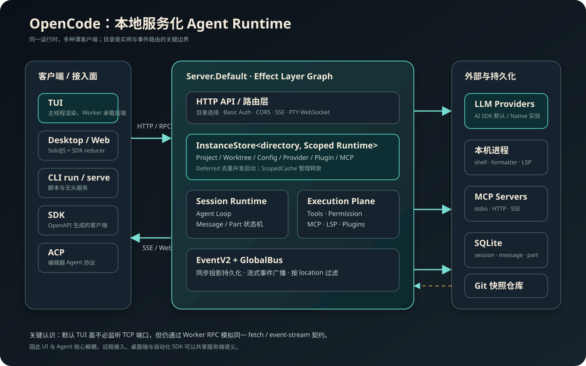
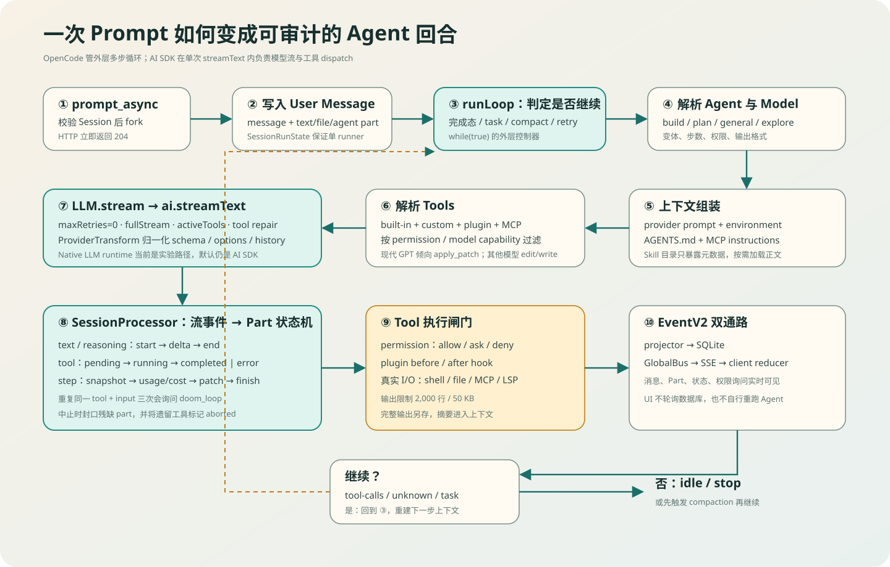
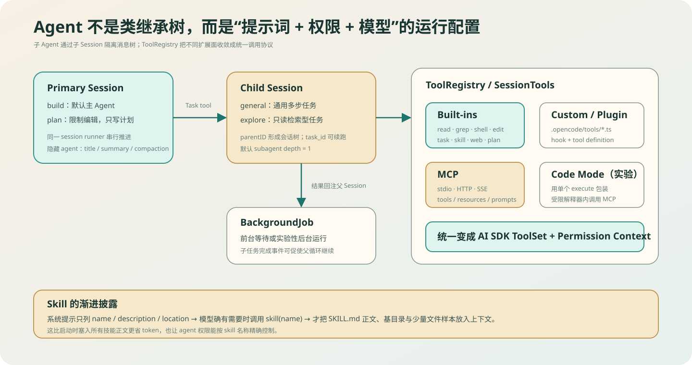
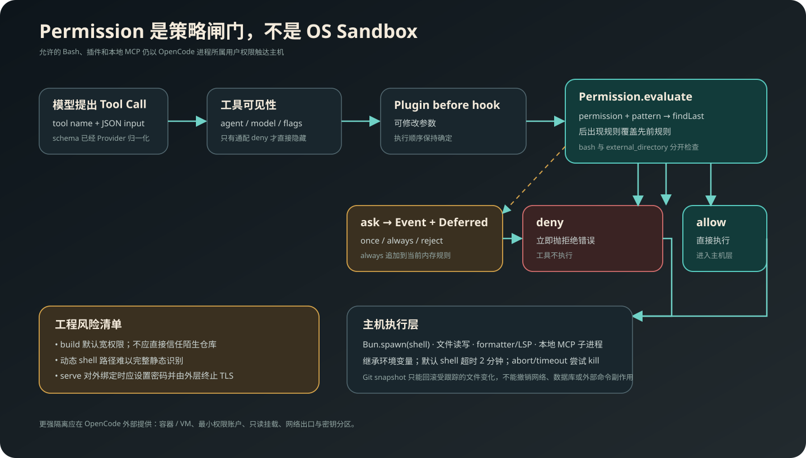
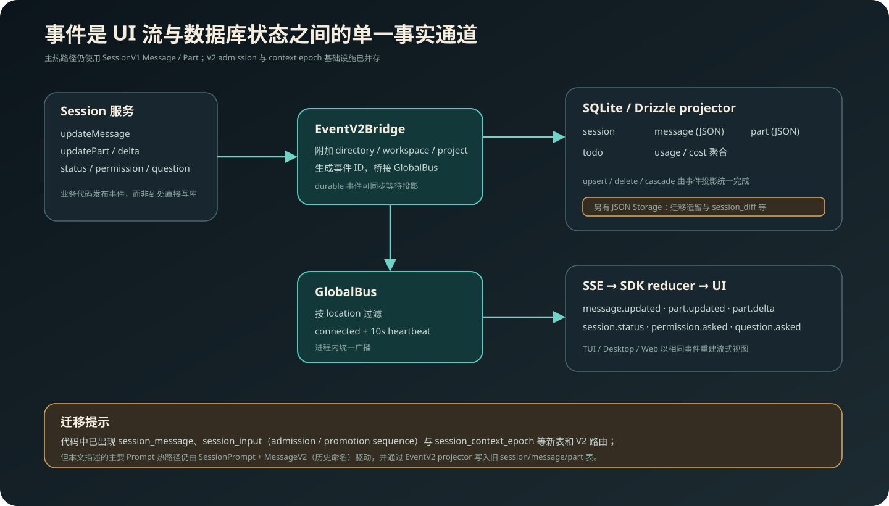
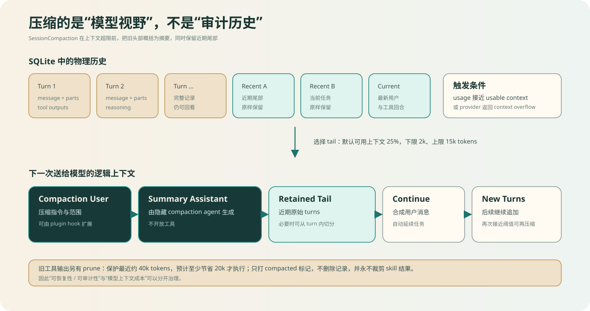

# 解剖 OpenCode：一个本地服务化 AI Coding Agent 是怎样炼成的

> 从入口、运行时、Agent Loop、模型适配、工具与权限，到事件溯源、上下文压缩和 Git 快照的源码级分析。


OpenCode 把自己称为 “The open source AI coding agent”。如果只看终端界面，很容易把它理解成“一个会调用 Shell 的聊天循环”；但沿源码追踪一次完整请求之后，会得到完全不同的结论：**它首先是一个以本地 Server 为中心、按工作目录隔离实例、以事件连接 UI 与持久化、再由多种客户端接入的 Agent Runtime。**

本文站在大模型 Agent 工程师的角度，回答五个实现问题：

1. 用户的一条 Prompt 如何穿过 TUI、Server、Session 与 LLM，再变成多轮工具调用？
2. OpenCode 怎样兼容许多 Provider，而没有把差异泄漏到 Agent 主循环？
3. 工具、MCP、Skill、Plugin、Subagent 分别位于哪一层，如何组合？
4. 权限、上下文压缩与 Git 快照分别解决什么问题，又有哪些明确边界？
5. 哪些代码是当前稳定热路径，哪些是正在演进的 V2 基础设施？

## 调研基线与结论边界

| 项目 | 本文基线 |
| --- | --- |
| 仓库 | [anomalyco/opencode](https://github.com/anomalyco/opencode) |
| 分支 / Commit | `dev` / [`5f5ea53afb2630227ead917f1a0ddf784c33150c`](https://github.com/anomalyco/opencode/tree/5f5ea53afb2630227ead917f1a0ddf784c33150c) |
| 快照日期 | 2026-08-27 |
| `packages/opencode` 版本 | `1.18.23` |
| 代码规模快照 | `packages/opencode/src` 356 个 TypeScript 文件；`packages/opencode/test` 290 个 TypeScript 文件；monorepo 内 26 个 `package.json` |
| 方法 | 固定 Commit 静态源码追踪、调用链交叉验证、官方文档对照、数据与安全边界审阅 |
| 不覆盖 | OpenCode Cloud 的私有服务端实现、各模型本身的效果评测、不同发行渠道的安装体验 |

> 重要提示：这个 Commit 正处于明显的架构迁移期。主 Prompt 热路径仍围绕 `SessionPrompt + SessionV1 Message/Part` 运行，同时新的 `session_message`、`session_input`、`session_context_epoch` 与 Core Session Runner 已经存在。本文会把“已经进入主热路径的实现”和“正在搭建的 V2 设施”分开描述，避免把未来结构误写成当前事实。

## 先说结论

OpenCode 最值得 Agent 工程借鉴的，不是某一段 Prompt，而是下面六个结构选择。

**第一，Server 是产品内核，TUI 只是客户端。** 默认 TUI 为了轻量可以不真正监听 TCP，但它仍通过 Worker RPC 转发 `fetch` 与事件流，复用同一套 HTTP/SSE 语义。这使桌面端、Web、SDK、ACP 与 TUI 不必维护多套 Agent 实现。

**第二，外层 Agent Loop 与单次模型流被清晰分工。** AI SDK 负责一次 `streamText` 中的模型流与工具 dispatch；OpenCode 自己负责跨 step 的状态机、消息持久化、权限、重试、压缩与继续条件。

**第三，事件同时驱动数据库和 UI。** Session 业务逻辑发布 EventV2；projector 将其写入 SQLite，GlobalBus 将同一事件送入 SSE。界面看到的不是另一份“临时流状态”，而是同一业务事件的实时投影。

**第四，Provider 兼容本质上是协议归一化。** 仅仅替换 API Endpoint 不够。OpenCode 还要处理 system prompt 角色、推理参数、tool schema、跨模型 reasoning、未闭合 tool call、工具结果中的媒体以及不同 Provider 的元数据。

**第五，权限不是沙箱。** `allow / ask / deny` 是应用层策略闸门。被允许的 Shell、Plugin 和本地 MCP 仍以当前 OS 用户权限执行；Git 快照也只能回滚工作区文件，不能撤销网络调用、外部数据库写入或任意命令副作用。

**第六，上下文与历史被有意分离。** SQLite 保留物理历史，模型只看“摘要 + 近期尾部 + 后续回合”的逻辑窗口。OpenCode 因而能同时追求可审计性和上下文成本控制。



## 一、仓库结构：一个产品，多个 Runtime Surface

OpenCode 是 Bun/TypeScript monorepo。根目录使用 Bun workspace，核心包的依赖包括 Effect、AI SDK、Drizzle、SQLite、MCP SDK、Tree-sitter、SolidJS 和 OpenTUI。不要把所有 `packages/*` 都理解成独立产品，它们大致分成四层：

| 层 | 代表包 | 职责 |
| --- | --- | --- |
| Agent 运行时 | `packages/opencode`、`packages/core`、`packages/llm` | CLI、Server、Session、Provider、Tool、事件、数据库与实验性新 Runner |
| 接入协议 | `packages/sdk`、`packages/protocol`、`packages/plugin` | OpenAPI SDK、共享协议、插件类型与工具定义 |
| 用户界面 | `packages/tui`、`packages/app`、`packages/desktop` | 终端 UI、Web/Solid UI、桌面壳 |
| 扩展与分发 | `packages/codemode`、`packages/web` 等 | MCP Code Mode、官网与文档、辅助服务 |

CLI 入口位于 [`packages/opencode/src/index.ts`](https://github.com/anomalyco/opencode/blob/5f5ea53afb2630227ead917f1a0ddf784c33150c/packages/opencode/src/index.ts)。它用 yargs 注册 `run`、`serve`、`web`、`attach`、`acp` 等命令，未指定子命令时进入 TUI。入口末尾显式退出进程，源码给出的理由是 MCP 子进程可能使进程无法自然结束——这是一个很小但很真实的 Agent Runtime 生命周期问题。

从工程分层看，`packages/opencode` 仍然很大，但它并非一团全局单例。Effect Layer 被用来组合 Database、Config、Provider、Agent、Skill、MCP、LLM、Session 和 ToolRegistry，并用 Scope 管理资源释放。其价值不在“函数式写法”本身，而在于：**工作区实例退出时，缓存、MCP Client、子进程和监听器能跟随 Scope 一起释放。**

## 二、为什么说 TUI 只是一个薄客户端

入口的关键不在 JSX，而在 [`cli/cmd/tui.ts`](https://github.com/anomalyco/opencode/blob/5f5ea53afb2630227ead917f1a0ddf784c33150c/packages/opencode/src/cli/cmd/tui.ts) 与 [`cli/tui/worker.ts`](https://github.com/anomalyco/opencode/blob/5f5ea53afb2630227ead917f1a0ddf784c33150c/packages/opencode/src/cli/tui/worker.ts)。默认启动过程可以简化成：

```text
主线程
  └─ OpenTUI 渲染、按键和界面状态
       ├─ createWorkerFetch() ──RPC──> Worker 中的 Server.app.fetch()
       └─ createEventSource()  ──RPC──> Worker 中的 GlobalBus

Worker
  └─ Server.Default + Effect Runtime + Session/Provider/Tool/MCP
```

只有在用户显式传入网络参数时，Worker 才启动真正监听端口的 Server；本地默认模式把 Request/Response 通过 RPC 传到 `Server.Default().app.fetch`。因此，“没开端口”并不等于“绕过了 Server”。

这个结构解决了三个产品级问题：

- TUI 崩溃与后端生命周期可以相对隔离，主线程专注终端渲染。
- 桌面端、Web、SDK 和 ACP 可以复用服务契约，而不是复制 Prompt Loop。
- 本地调用与远程调用在语义上足够相近，后续接入远程 workspace/control plane 时不用推翻内核。

`serve` 模式则直接启动无头服务。服务端会提示未设置 `OPENCODE_SERVER_PASSWORD` 的风险；每个请求还能根据 Session、query、`x-opencode-directory` 或当前目录选择工作区实例。相关组合位于 [`server/routes/instance/httpapi/server.ts`](https://github.com/anomalyco/opencode/blob/5f5ea53afb2630227ead917f1a0ddf784c33150c/packages/opencode/src/server/routes/instance/httpapi/server.ts) 与 [`workspace-routing.ts`](https://github.com/anomalyco/opencode/blob/5f5ea53afb2630227ead917f1a0ddf784c33150c/packages/opencode/src/server/routes/instance/httpapi/middleware/workspace-routing.ts)。

## 三、Instance：以目录为键的资源与隔离单元

OpenCode 不是每次请求都重新扫描配置、初始化 MCP 和创建 Provider。它把已解析目录映射为一个 Instance：

```ts
directory -> {
  project,
  worktree,
  config,
  providers,
  agents,
  skills,
  plugins,
  mcpClients,
  sessionRuntime,
  caches
}
```

[`project/instance-store.ts`](https://github.com/anomalyco/opencode/blob/5f5ea53afb2630227ead917f1a0ddf784c33150c/packages/opencode/src/project/instance-store.ts) 用 `Deferred` 消除同一目录的并发重复启动；[`effect/instance-state.ts`](https://github.com/anomalyco/opencode/blob/5f5ea53afb2630227ead917f1a0ddf784c33150c/packages/opencode/src/effect/instance-state.ts) 则用带 Scope 的缓存提供“每 Instance 一份”的状态。实例被释放时，配置缓存和 MCP 连接也随之失效。

这相当于 Agent 系统中的 dependency-injection scope：

- **Process Scope**：数据库、全局事件、安装与账户等共享服务；
- **Instance Scope**：目录、worktree、项目配置、Provider、Plugin、Skill、MCP；
- **Session Scope**：消息、runner、权限询问、取消信号、后台任务；
- **Step Scope**：一次 LLM stream、tool call、snapshot 与 token usage。

边界判断集中于 [`project/instance-context.ts`](https://github.com/anomalyco/opencode/blob/5f5ea53afb2630227ead917f1a0ddf784c33150c/packages/opencode/src/project/instance-context.ts)。它特别处理了“非 Git 目录的 worktree 可能是 `/`”这类危险情况，避免因为根路径包含一切而绕过 `external_directory` 权限。

配置也不是简单读取当前目录的一个 JSON。大体加载顺序是：远程 well-known 配置、用户全局配置、`OPENCODE_CONFIG`、沿目录发现的项目配置、各 `.opencode` 目录、`OPENCODE_CONFIG_CONTENT`、组织配置、受管配置/MDM；后加载值覆盖前值，`instructions` 等少数字段会合并去重。插件声明还携带来源与 global/local scope，便于后续按来源安装和诊断。实现见 [`config/config.ts`](https://github.com/anomalyco/opencode/blob/5f5ea53afb2630227ead917f1a0ddf784c33150c/packages/opencode/src/config/config.ts)。

## 四、一次 Prompt 的完整执行链

客户端最常走的是异步接口 `POST /session/:sessionID/prompt_async`。Handler 验证 Session 后，把 [`SessionPrompt.prompt`](https://github.com/anomalyco/opencode/blob/5f5ea53afb2630227ead917f1a0ddf784c33150c/packages/opencode/src/session/prompt.ts) fork 到 Server Scope，立即返回 `204`；后续进度全部走事件流。这样 HTTP 请求无需和数分钟的 Agent 任务同寿命。



### 4.1 Prompt 入库与单 Runner 约束

`prompt()` 会先清理尚未提交的新 revert 状态，再创建 User Message 及 TextPart、FilePart、AgentPart 等 Part，更新 Session 时间，最后进入 `loop()`。

[`session/run-state.ts`](https://github.com/anomalyco/opencode/blob/5f5ea53afb2630227ead917f1a0ddf784c33150c/packages/opencode/src/session/run-state.ts) 的职责是让同一 Session 同时只有一个 Runner。取消会同时终止 Runner 与关联 Background Job，而不是只关闭某个 HTTP Response。

### 4.2 外层 `while(true)` 做什么

[`session/prompt.ts`](https://github.com/anomalyco/opencode/blob/5f5ea53afb2630227ead917f1a0ddf784c33150c/packages/opencode/src/session/prompt.ts) 的主循环每轮会：

1. 把 Session 设为 `busy`，读取并过滤压缩后的消息历史；
2. 判断最近 Assistant 是否已经自然完成，是否还有 task/tool-call/compaction 要处理；
3. 首步在后台生成标题；
4. 解析当前 Agent、Model、Variant 与输出格式；
5. 若队列里是 Subtask 或 Compaction Part，先执行这些控制任务；
6. 若上轮 usage 已接近上下文上限，先做自动压缩；
7. 创建 Assistant Message 与 `SessionProcessor`；
8. 解析当前可用工具，拼装 system 与 history；
9. 调用 `LLM.stream()`，消费结果；
10. 根据 processor 返回的 `continue / compact / stop` 决定下一轮。

当 Agent 配置了最大步数，最后一步会额外加入 `MAX_STEPS_PROMPT`，要求模型停止继续开工具分支并给出总结。它不是依赖模型“自觉”，而是让运行时显式感知剩余预算。

### 4.3 单次模型流与多步 Agent Loop 的分工

稳定默认路径位于 [`session/llm.ts`](https://github.com/anomalyco/opencode/blob/5f5ea53afb2630227ead917f1a0ddf784c33150c/packages/opencode/src/session/llm.ts)：OpenCode 调用 AI SDK 的 `streamText()`，提供 `activeTools`、`toolChoice`、tool-call repair 与完整流；AI SDK 在该次流中完成工具 dispatch。OpenCode 将 `maxRetries` 默认为 0，因为重试策略由外层 Session 统一掌控。

也就是说：

```text
OpenCode：跨 step 编排、状态、权限、持久化、重试、压缩
AI SDK：单个 step 的模型调用、流事件、tool-call dispatch
Tool：真实副作用与结构化结果
```

代码里已经有 `@opencode-ai/llm` Native Runtime，但由 `experimentalNativeLlm` 开关控制，并在不支持时回落。它是值得关注的演进方向，不能当成当前默认实现。

### 4.4 SessionProcessor：真正的流式状态机

[`session/processor.ts`](https://github.com/anomalyco/opencode/blob/5f5ea53afb2630227ead917f1a0ddf784c33150c/packages/opencode/src/session/processor.ts) 把模型流转成可持久化 Part：

| 流事件 | 持久化结果 |
| --- | --- |
| reasoning/text start、delta、end | 创建 Part，持续发布 delta，结束时封口 |
| tool-input / tool-call | ToolPart 从 `pending` 变为 `running` |
| tool-result / tool-error | ToolPart 变为 `completed` 或 `error` |
| step-start | 先记录 Git snapshot，避免工具先于 step 事件执行 |
| step-finish | 记录 finish reason、usage、cost、snapshot patch，触发 summary/prune 判定 |
| abort/error | 结束残缺文本；遗留工具标为 `Tool execution aborted` |

它还做了一个实用的 doom-loop 检测：如果最近出现三次相同工具和相同输入，会发起 `doom_loop` 权限询问，避免模型在错误状态中无限重复。

重试同样在 Session 层：[`session/retry.ts`](https://github.com/anomalyco/opencode/blob/5f5ea53afb2630227ead917f1a0ddf784c33150c/packages/opencode/src/session/retry.ts) 最多重试 5 次，解析 `retry-after-ms` / `retry-after`，否则使用带 jitter 的指数退避并封顶；重试状态与下次时间也会成为 Session 状态事件，UI 能明确展示“正在等待 Provider”，而不是像卡死。

## 五、System Prompt 不是一个字符串，而是一条上下文装配线

模型请求的 system 部分由多种来源拼成：

1. 根据模型家族选择的基础 Prompt；
2. 当前目录、平台、Git 信息等 Environment；
3. 全局与项目指令文件；
4. 配置中的本地 glob 或远程 Instruction URL；
5. 可见 Skill 的元数据目录；
6. MCP Server 暴露的 instructions；
7. 用户传入的 system；
8. Plugin 对 system 的最终变换。

模型家族路由在 [`session/system.ts`](https://github.com/anomalyco/opencode/blob/5f5ea53afb2630227ead917f1a0ddf784c33150c/packages/opencode/src/session/system.ts)，请求装配在 [`session/llm/request.ts`](https://github.com/anomalyco/opencode/blob/5f5ea53afb2630227ead917f1a0ddf784c33150c/packages/opencode/src/session/llm/request.ts)。不同模型并不强行共用完全相同的提示词；GPT/Codex、Claude、Gemini、Kimi、Meta 等家族有针对性的基线。

指令发现 [`session/instruction.ts`](https://github.com/anomalyco/opencode/blob/5f5ea53afb2630227ead917f1a0ddf784c33150c/packages/opencode/src/session/instruction.ts) 有一个很值得复用的“渐进上下文”设计：启动时读取全局 `AGENTS.md`，并从当前目录向 worktree 查找项目 `AGENTS.md`、`CLAUDE.md` 或 `CONTEXT.md`；当 `read` 工具后来打开更深层文件时，才搜索那个文件附近尚未加载的指令并注入一次。这样 monorepo 子目录规则不会全部挤进初始上下文，也不会在真正编辑该目录时遗漏。

## 六、Provider：难点不在请求 URL，而在历史可迁移性

[`provider/provider.ts`](https://github.com/anomalyco/opencode/blob/5f5ea53afb2630227ead917f1a0ddf784c33150c/packages/opencode/src/provider/provider.ts) 结合 models.dev 元数据、环境变量、Auth 数据库/API/OAuth、Plugin Auth 和用户配置得到可用 Provider。模型元数据包括 capability、context/output limits、cost、SDK npm 包和 endpoint；Provider SDK 可来自内置 `@ai-sdk/*` 包，也能按配置动态安装，再按 provider/options hash 缓存。

真正复杂的是 [`provider/transform.ts`](https://github.com/anomalyco/opencode/blob/5f5ea53afb2630227ead917f1a0ddf784c33150c/packages/opencode/src/provider/transform.ts) 和 Message→ModelMessage 转换。它们要修补下面这些协议不一致：

- 某些 OpenAI OAuth 流程把 system 放进 `instructions` provider option，而不是普通 system message；
- OpenAI/Azure/部分 Bedrock 路径的 Tool Schema 严格模式不同；
- reasoning effort、thinking budget、cache key、max output token 的字段名和语义不同；
- 切换模型后，旧 Provider 的 reasoning metadata 不能原样带给新 Provider；
- 尚在 `pending/running` 的旧 tool call 必须补成 interrupted error，保证工具协议闭合；
- 某些 Provider 不接受 tool-result 内媒体，需要提取成后续 User Attachment；
- 已 abort 但包含有效内容的消息不能简单丢弃。

因此“多 Provider Agent”的正确抽象不是：

```text
provider = endpoint + apiKey
```

而是：

```text
provider adapter = auth + model metadata + request options
                 + message normalization + tool protocol
                 + media policy + error/retry semantics
```

这也是 OpenCode 能在同一 Session 切换模型仍尽量保持历史可用的关键。

## 七、Tool Plane：把 Agent 接到真实计算机

[`tool/registry.ts`](https://github.com/anomalyco/opencode/blob/5f5ea53afb2630227ead917f1a0ddf784c33150c/packages/opencode/src/tool/registry.ts) 汇总内建工具、`.opencode/tool(s)/*.ts` 自定义工具与 Plugin 工具；[`session/tools.ts`](https://github.com/anomalyco/opencode/blob/5f5ea53afb2630227ead917f1a0ddf784c33150c/packages/opencode/src/session/tools.ts) 再结合 Agent 权限、模型能力与 MCP，把它们变成 AI SDK ToolSet。

主要内建能力包括：

| 类别 | 工具/实现重点 |
| --- | --- |
| 检索 | `read`、`glob`、`grep`；读取时可注入附近指令 |
| 编辑 | `edit`、`write`、`apply_patch`；写前生成 diff 并询问，写后格式化并取 LSP diagnostics |
| 执行 | `shell`；实时流输出、超时与取消、静态命令解析 |
| 编排 | `task`、`todowrite`、plan enter/exit |
| 外部信息 | `webfetch`、按 Provider/开关提供的 `websearch` |
| 扩展 | `skill`、MCP tools/resources/prompts、自定义工具、Plugin 工具 |

Registry 还会针对模型调整编辑工具：现代 GPT 更倾向暴露 `apply_patch`，其他模型使用 `edit/write`。这是一个常被忽略的事实：**工具设计也要适配模型训练分布，而不是所有模型共享同一工具表就结束。**

### 7.1 Shell 如何做权限解析

[`tool/shell.ts`](https://github.com/anomalyco/opencode/blob/5f5ea53afb2630227ead917f1a0ddf784c33150c/packages/opencode/src/tool/shell.ts) 用 Tree-sitter 解析 Bash 或 PowerShell AST，提取复合命令中的各个子命令，并识别 `cd`、`cp`、`mv`、`rm` 等命令携带的静态路径。随后分别询问：

- `external_directory`：目标路径是否越出当前 Instance；
- `bash` / shell permission：具体命令模式是否允许。

用户选择 “always” 时，系统会依据命令的 arity 生成适度泛化规则，例如保留前若干参数并在末尾加 `*`。默认 Shell 超时 2 分钟，可由参数覆盖；Abort 或 Timeout 后会尝试终止进程。

不过 AST 解析不能神奇地还原所有动态值：变量展开、命令替换、运行时生成路径依然存在静态分析盲区。这正是它不能被称为沙箱的原因之一。

### 7.2 工具输出为什么必须截断

[`tool/truncate.ts`](https://github.com/anomalyco/opencode/blob/5f5ea53afb2630227ead917f1a0ddf784c33150c/packages/opencode/src/tool/truncate.ts) 默认将进入上下文的工具结果限制为 2,000 行或 50 KiB。完整输出保存在用户数据目录的 `tool-output` 下，并有清理机制；摘要会提示模型用 Grep/Read 定位，若 Task 可用还建议委派给 explore Agent。

这是一种比“粗暴把输出砍掉”更完整的策略：

```text
上下文：短预览 + 完整结果路径 + 下一步检索建议
磁盘：完整输出，可按 offset / pattern 再取
```

它把高 token 的读取任务转成“先建立索引，再渐进读取”。

## 八、Agent 与 Subagent：会话树，而不是隐藏线程

当前源码内置 Agent 见 [`agent/agent.ts`](https://github.com/anomalyco/opencode/blob/5f5ea53afb2630227ead917f1a0ddf784c33150c/packages/opencode/src/agent/agent.ts)：

| Agent | 类型 | 主要限制/用途 |
| --- | --- | --- |
| `build` | primary | 默认开发 Agent，开启 question/plan_enter，权限总体较宽 |
| `plan` | primary | 只允许写计划文件，禁止一般编辑，可 plan_exit |
| `general` | subagent | 通用多步子任务 |
| `explore` | subagent | 只读检索；允许 read/grep/glob/list、受控 shell 与 Web 获取 |
| `title` / `summary` / `compaction` | hidden primary | 系统后台元任务，不出现在普通选择列表 |



[`tool/task.ts`](https://github.com/anomalyco/opencode/blob/5f5ea53afb2630227ead917f1a0ddf784c33150c/packages/opencode/src/tool/task.ts) 不在同一个 Message 里偷偷开启一条链，而是创建带 `parentID` 的 Child Session。子 Agent 默认继承模型，允许单独覆盖；结果通过 BackgroundJob 等待或实验性后台运行，完成后回注父 Session，使父循环继续。`task_id` 还能恢复原 Child Session，避免把续问当成全新任务。

这种设计带来几个好处：

- 子任务有独立上下文，不污染父 Session 的每一步历史；
- UI 可以把会话树展示出来，定位哪个子任务卡住；
- 子 Session 可单独取消、重试和续跑；
- 结果回注时保留来源关系，审计比“一个巨大 Prompt”清晰。

默认 `subagent_depth` 为 1，用来抑制无界递归。权限继承也需要准确理解：父 Session 的显式 deny 与外部目录约束会影响子 Session，但“父 Agent 的全部策略”并不是自动变成子 Agent 策略；子 Agent 自己的 permission 配置仍是重要边界。用户通过显式 Agent mention 发起 Task 时还有专门的调用路径，所以做企业策略时应审阅会话权限，而不能只看某个 Agent 模板。

## 九、Permission：有序规则、运行时询问与真实边界

权限实现集中在 [`permission/evaluate.ts`](https://github.com/anomalyco/opencode/blob/5f5ea53afb2630227ead917f1a0ddf784c33150c/packages/opencode/src/permission/evaluate.ts) 与 [`permission/index.ts`](https://github.com/anomalyco/opencode/blob/5f5ea53afb2630227ead917f1a0ddf784c33150c/packages/opencode/src/permission/index.ts)。规则由 `permission + pattern + action` 组成，支持通配匹配，并以 `findLast` 选择最后一条命中的规则——也就是后出现规则覆盖先前规则。

一次工具调用可能得到：

- `allow`：直接执行；
- `deny`：立即拒绝；
- `ask`：创建 Deferred，发布 Permission Event，等待客户端回复 `once / always / reject`。

`always` 会把获批 pattern 追加到当前运行时规则；它主要是当前实例内的便捷批准，不应未经验证就当作跨进程永久安全策略。Session 自身的 permission rules 才属于会话数据的一部分。



### 9.1 默认策略并不等于零信任

内建默认值总体允许工具，`doom_loop` 与外部目录通常询问，敏感 `.env*` 读取询问而 `.env.example` 可读。`build` 是高能力 Agent；`plan` 才通过拒绝普通编辑形成明显约束；`explore` 先拒绝所有再白名单只读能力。

因此在不可信仓库上使用时，至少应考虑：

- 使用容器或 VM，而不是把应用权限当作 OS 隔离；
- 以最小权限账户运行，避免将宿主密钥完整注入环境；
- 对工作区使用只读或精确可写挂载；
- 限制网络出口、本地 Docker Socket、SSH Agent 和云元数据；
- 对未知 Plugin、本地 MCP 和仓库指令文件做与代码相同级别的审阅。

### 9.2 Server 暴露面的安全

Server 支持 Basic Auth，CORS 对 localhost、官方域名与桌面端来源做限制。但如果把服务绑定到非 loopback 地址，应该设置 `OPENCODE_SERVER_PASSWORD`，并由反向代理或安全网络层终止 TLS。没有密码的局域网 Server 不是“本地工具”，而是一个能驱动文件和 Shell 的远程执行面。

## 十、MCP、Skill 与 Plugin：三个不同的扩展层

这三者常被笼统称为“插件”，但在 OpenCode 中边界不同。

### 10.1 MCP：远程或子进程工具协议

[`mcp/index.ts`](https://github.com/anomalyco/opencode/blob/5f5ea53afb2630227ead917f1a0ddf784c33150c/packages/opencode/src/mcp/index.ts) 按 Instance 启动本地 stdio MCP 或连接远程 Streamable HTTP，并为兼容服务回落到 SSE。它缓存 Tool Definition，响应 ToolListChanged，读取 resources/prompts，并把 MCP Server instructions 纳入 system；只有该 Server 的工具可见时，instructions 才会被注入。

远程 MCP OAuth 实现包含 PKCE、callback 与 state 校验，Token 被持久化；Instance 释放时 Client 关闭，本地子进程会被尽力终止。MCP 工具返回的文本同样经过截断，图片/资源附件只接受受支持类型并设大小上限。

实验性的 Code Mode 不再把大量 MCP Tool Schema 全部暴露给模型，而是提供一个 `execute`，让模型在受限解释器中组合 MCP 调用。这里的“受限”指 Code Mode Interpreter，不代表普通 Shell 获得 OS 沙箱。

### 10.2 Skill：先发现目录，后按需装正文

[`skill/index.ts`](https://github.com/anomalyco/opencode/blob/5f5ea53afb2630227ead917f1a0ddf784c33150c/packages/opencode/src/skill/index.ts) 会扫描 `.agents/skills/**/SKILL.md`、`.claude/skills/**/SKILL.md`、配置目录的 `skill(s)/**/SKILL.md`、用户指定路径和远程 Skill 来源。启动时 system 只放 name、description、location；真正调用 [`tool/skill.ts`](https://github.com/anomalyco/opencode/blob/5f5ea53afb2630227ead917f1a0ddf784c33150c/packages/opencode/src/tool/skill.ts) 后，才返回完整正文、基目录和少量文件样本。

这是一种标准的 progressive disclosure：Skill 数量增加时，初始 Prompt 仍然可控；Agent 还能按 Skill 名称设置 `allow/ask/deny`。

### 10.3 Plugin：运行时 Hook 与能力注入

[`plugin/index.ts`](https://github.com/anomalyco/opencode/blob/5f5ea53afb2630227ead917f1a0ddf784c33150c/packages/opencode/src/plugin/index.ts) 加载内置和外部 Plugin。外部 Plugin 依次初始化，确保 hook 注册与执行顺序确定；Plugin 获得当前目录、项目、worktree、SDK Client、Server URL 与 Bun Shell。

Plugin API 见 [`packages/plugin/src/index.ts`](https://github.com/anomalyco/opencode/blob/5f5ea53afb2630227ead917f1a0ddf784c33150c/packages/plugin/src/index.ts)，可以：

- 注册工具与 Provider/Auth；
- 监听事件和配置；
- 在 message、LLM params/headers/system 前后变换；
- 在 permission ask、command、tool execute 前后介入；
- 修改 shell 环境；
- 扩展 compaction prompt 与 auto-continue；
- 注册实验性 workspace adapter。

Plugin 的能力远高于 Skill，也更接近任意本机代码执行。加载未知 Plugin 的风险模型应与安装 npm 包一致，而不是与“读取一段 Prompt”一致。

## 十一、事件、SQLite 与 UI：同一状态的两种投影

OpenCode 没有让 UI 直接查询 Session 表并猜测流状态。主要业务代码发布 EventV2，事件通过 [`event-v2-bridge.ts`](https://github.com/anomalyco/opencode/blob/5f5ea53afb2630227ead917f1a0ddf784c33150c/packages/opencode/src/event-v2-bridge.ts) 附加 directory/workspace/project location：

- 一路被 [`packages/core/src/session/projector.ts`](https://github.com/anomalyco/opencode/blob/5f5ea53afb2630227ead917f1a0ddf784c33150c/packages/core/src/session/projector.ts) 投影为 SQLite 行；
- 另一路进入 GlobalBus，经 SSE 送到客户端 reducer。



主热路径的核心表是 `session`、`message`、`part`、`todo`。Message/Part 的复杂结构以 JSON 保存；step-finish 事件还会投影 usage 与 cost。删除 Session 会处理子 Session 和关联数据。

SSE 事件包括 `message.updated`、`message.part.updated`、`message.part.delta`、`session.status`、Permission/Question 等。连接建立时发送 connected，之后约每 10 秒 heartbeat；事件按 workspace location 过滤。客户端因此可以边接收 token delta，边看到 ToolPart 从 pending 变成 running/completed，而无需轮询。

### 11.1 当前代码的双轨迁移

快照中还出现了新的：

- `session_message`：按 Session sequence 排序的消息投影；
- `session_input`：输入 admission / promotion sequence；
- `session_context_epoch`：上下文 epoch 与压缩状态；
- Core 侧新的 Session Runner、RunCoordinator 与 Execution 抽象。

Server Layer 同时挂载 legacy V1 服务图和 V2/Core Route，部分 Event projector 也开始填充新表。这说明团队正在从旧 Session 结构迁向更明确的 durable execution/event-sourced 模型。但本文描述的用户 Prompt 主链仍以 `packages/opencode/src/session/prompt.ts` 为准。阅读这个仓库时，最容易犯的错误就是把“已存在的 V2 文件”当成“当前所有流量已经经过 V2”。

此外，[`storage/storage.ts`](https://github.com/anomalyco/opencode/blob/5f5ea53afb2630227ead917f1a0ddf784c33150c/packages/opencode/src/storage/storage.ts) 的 JSON KV 存储仍用于迁移遗留和少量数据（如 session diff），所以“OpenCode 所有状态都在 SQLite”也不准确。

## 十二、上下文工程：保留历史，但不把历史全部喂给模型

[`session/compaction.ts`](https://github.com/anomalyco/opencode/blob/5f5ea53afb2630227ead917f1a0ddf784c33150c/packages/opencode/src/session/compaction.ts) 根据模型可用上下文和上一轮 usage 判断是否溢出。默认保留近期上下文预算为可用 context 的 25%，同时限制在 2,000～15,000 tokens；也能用 `tail_turns` 或显式 token 配置覆盖。



压缩过程不是简单把所有历史重新总结：

1. 从后往前按完整 User Turn 选择近期 tail；必要时可以在一个 Turn 内切分；
2. 将较老 head 序列化，工具输出在摘要输入中最多保留 2,000 字符；
3. 把上一次 summary 一并交给隐藏 `compaction` Agent；
4. 得到新 Summary Assistant Message；
5. 下一次模型上下文重排为 `compaction user + summary + retained tail + continue`；
6. 数据库中的旧 Message/Part 并不因此消失。

如果 Provider 报错来自超大媒体，压缩后还会把媒体替换为文字占位再重放，避免同一附件立刻再次触发 overflow。

另一个异步 `prune` 专门治理旧 Tool Output：从最近往前保护约 40,000 tokens 的工具结果，只有预计可节省超过 20,000 tokens 才把更旧输出标记为 compacted；`skill` 结果永不被 prune。这里的“清理”仍是逻辑标记，不是删除审计记录。

这个设计体现了三层记忆：

- **Durable memory**：SQLite 中的完整 Session 历史；
- **Working memory**：本轮 summary + recent tail；
- **Externalized memory**：被截断的完整工具输出文件、项目代码与 Git 对象。

## 十三、Git Snapshot、Revert 与“可撤销”的边界

在 LLM Stream 开始和 Step 边界，OpenCode 会通过 [`snapshot/index.ts`](https://github.com/anomalyco/opencode/blob/5f5ea53afb2630227ead917f1a0ddf784c33150c/packages/opencode/src/snapshot/index.ts) 记录工作树快照。它不污染用户仓库的普通 commit，而是在 OpenCode 数据目录为每个 project/worktree 维护独立 Git dir，并通过 alternates 复用原仓库对象库以减少成本。

Snapshot 会：

- 跟踪未被 ignore 的变化；
- 排除超过 2 MiB 的未跟踪文件；
- 在 step finish 计算 patch 与 changed files；
- 在 [`session/revert.ts`](https://github.com/anomalyco/opencode/blob/5f5ea53afb2630227ead917f1a0ddf784c33150c/packages/opencode/src/session/revert.ts) 中按消息边界恢复文件；
- 清理 revert 点之后的 Message/Part，或通过 unrevert 恢复后续快照。

但它不是事务系统。下面这些通常无法靠 Git Revert 恢复：

- 已发送的网络请求、邮件或 Issue；
- 外部数据库与云资源变化；
- 工作树之外的文件；
- gitignored 内容与过大的未跟踪文件；
- Shell 启动的后台进程和系统级副作用。

所以 snapshot 的正确定位是“代码编辑撤销与 diff 观测”，不是“Agent 副作用回滚”。

## 十四、从可靠性与可观测性看实现细节

OpenCode 没有一个单独名为“observability platform”的模块，但多个细节组合成可诊断性：

- Session 状态显式区分 busy、idle、retry，并携带下一次重试时间；
- 每个 Assistant Step 记录 model/provider、tokens、cache tokens、cost 与 finish reason；
- ToolPart 保留 input、output/error、time 与 metadata；
- SSE 让 UI 同步看到真实状态，而非只显示转圈；
- 工具完整输出落盘，流入上下文的是可控摘要；
- Session tree、parentID 与 task_id 使子任务可定位；
- Git snapshot patch 连接“模型回合”和“文件变化”；
- Plugin Error 通过 Session Event 呈现，不只藏在 Server Log。

当然仍有进一步工程空间：Plugin hook 隔离、跨进程 durable approval、所有副作用的幂等 key、更加一致的 V2 迁移边界，以及面向长任务的 crash recovery 都值得继续观察。新 Core 的 admission、context epoch 和 run coordinator 很可能就是在为这些问题铺路——这是从代码结构做出的推断，而不是项目方已承诺的路线图。

## 十五、如何二次开发：从改动目标反推入口

| 目标 | 优先阅读/修改位置 | 验证重点 |
| --- | --- | --- |
| 新增模型 Provider | `provider/provider.ts`、`provider/transform.ts`、`session/llm/request.ts` | Auth、tool schema、history replay、error/retry、media |
| 新增内建工具 | `tool/*`、`tool/registry.ts`、`session/tools.ts` | Schema、permission pattern、abort、truncation、metadata |
| 新增 Agent | `agent/agent.ts` 或 Markdown/JSON 配置 | mode、model、prompt、steps、permission、subagent depth |
| 扩展 MCP | `mcp/index.ts`、`session/tools.ts` | transport、OAuth、list change、resource mime/size、disposal |
| 改 Session Loop | `session/prompt.ts`、`processor.ts`、`run-state.ts` | 单 runner、事件顺序、tool closure、cancel、compact/retry |
| 改 UI 流状态 | Server event handlers + SDK reducer + TUI/App | delta/upsert 顺序、重连、heartbeat、location 过滤 |
| 改存储模型 | EventV2 schema + Core projector + migration | 事件兼容、幂等 upsert、旧表迁移、同步持久化语义 |
| 企业安全收敛 | permission、server auth、workspace routing、部署层 | OS 隔离、密钥、网络、插件/MCP 供应链、审计 |

推荐的开发验证顺序是：先为纯规则与状态机写单测，再做 Session 集成测试，然后通过 SDK 发起 `prompt_async` 并消费 SSE，最后才验证 TUI。因为 TUI 是接入面，直接从终端界面调 Agent 内核会把 Server、事件、Provider 与 UI 问题混在一起。

## 十六、源码导航

以下链接全部固定到本文调研 Commit，避免 `dev` 分支继续演进后行文与源码错位。

| 主题 | 固定源码 |
| --- | --- |
| CLI / TUI Worker | [`index.ts`](https://github.com/anomalyco/opencode/blob/5f5ea53afb2630227ead917f1a0ddf784c33150c/packages/opencode/src/index.ts) · [`tui.ts`](https://github.com/anomalyco/opencode/blob/5f5ea53afb2630227ead917f1a0ddf784c33150c/packages/opencode/src/cli/cmd/tui.ts) · [`worker.ts`](https://github.com/anomalyco/opencode/blob/5f5ea53afb2630227ead917f1a0ddf784c33150c/packages/opencode/src/cli/tui/worker.ts) |
| Server / Instance | [`server.ts`](https://github.com/anomalyco/opencode/blob/5f5ea53afb2630227ead917f1a0ddf784c33150c/packages/opencode/src/server/routes/instance/httpapi/server.ts) · [`instance-store.ts`](https://github.com/anomalyco/opencode/blob/5f5ea53afb2630227ead917f1a0ddf784c33150c/packages/opencode/src/project/instance-store.ts) |
| Agent Loop | [`prompt.ts`](https://github.com/anomalyco/opencode/blob/5f5ea53afb2630227ead917f1a0ddf784c33150c/packages/opencode/src/session/prompt.ts) · [`processor.ts`](https://github.com/anomalyco/opencode/blob/5f5ea53afb2630227ead917f1a0ddf784c33150c/packages/opencode/src/session/processor.ts) |
| LLM / Provider | [`llm.ts`](https://github.com/anomalyco/opencode/blob/5f5ea53afb2630227ead917f1a0ddf784c33150c/packages/opencode/src/session/llm.ts) · [`request.ts`](https://github.com/anomalyco/opencode/blob/5f5ea53afb2630227ead917f1a0ddf784c33150c/packages/opencode/src/session/llm/request.ts) · [`provider.ts`](https://github.com/anomalyco/opencode/blob/5f5ea53afb2630227ead917f1a0ddf784c33150c/packages/opencode/src/provider/provider.ts) |
| Tool / Permission | [`registry.ts`](https://github.com/anomalyco/opencode/blob/5f5ea53afb2630227ead917f1a0ddf784c33150c/packages/opencode/src/tool/registry.ts) · [`tools.ts`](https://github.com/anomalyco/opencode/blob/5f5ea53afb2630227ead917f1a0ddf784c33150c/packages/opencode/src/session/tools.ts) · [`permission`](https://github.com/anomalyco/opencode/tree/5f5ea53afb2630227ead917f1a0ddf784c33150c/packages/opencode/src/permission) |
| Agent / Task | [`agent.ts`](https://github.com/anomalyco/opencode/blob/5f5ea53afb2630227ead917f1a0ddf784c33150c/packages/opencode/src/agent/agent.ts) · [`task.ts`](https://github.com/anomalyco/opencode/blob/5f5ea53afb2630227ead917f1a0ddf784c33150c/packages/opencode/src/tool/task.ts) |
| MCP / Skill / Plugin | [`mcp`](https://github.com/anomalyco/opencode/tree/5f5ea53afb2630227ead917f1a0ddf784c33150c/packages/opencode/src/mcp) · [`skill`](https://github.com/anomalyco/opencode/tree/5f5ea53afb2630227ead917f1a0ddf784c33150c/packages/opencode/src/skill) · [`plugin`](https://github.com/anomalyco/opencode/tree/5f5ea53afb2630227ead917f1a0ddf784c33150c/packages/opencode/src/plugin) |
| Event / Storage | [`event-v2-bridge.ts`](https://github.com/anomalyco/opencode/blob/5f5ea53afb2630227ead917f1a0ddf784c33150c/packages/opencode/src/event-v2-bridge.ts) · [`projector.ts`](https://github.com/anomalyco/opencode/blob/5f5ea53afb2630227ead917f1a0ddf784c33150c/packages/core/src/session/projector.ts) |
| Context / Revert | [`compaction.ts`](https://github.com/anomalyco/opencode/blob/5f5ea53afb2630227ead917f1a0ddf784c33150c/packages/opencode/src/session/compaction.ts) · [`snapshot`](https://github.com/anomalyco/opencode/tree/5f5ea53afb2630227ead917f1a0ddf784c33150c/packages/opencode/src/snapshot) · [`revert.ts`](https://github.com/anomalyco/opencode/blob/5f5ea53afb2630227ead917f1a0ddf784c33150c/packages/opencode/src/session/revert.ts) |
| 官方文档源码 | [`packages/web/src/content/docs`](https://github.com/anomalyco/opencode/tree/5f5ea53afb2630227ead917f1a0ddf784c33150c/packages/web/src/content/docs) |

## 结语：OpenCode 真正实现的是“可操作的模型运行时”

一个能回答代码问题的模型不等于 Coding Agent。后者必须把概率式模型嵌入一个确定性更强的运行环境：要有工作区实例、消息状态机、工具协议、权限闸门、Provider 归一化、事件流、持久化、重试、上下文治理和有限的撤销能力。

OpenCode 当前实现并不完美，尤其是 V1/V2 双轨、应用权限与 OS 隔离的差距、Plugin/MCP 的供应链风险，都需要使用者看清。但它的整体结构已经给出一个成熟答案：

> **让模型负责提出下一步，让 Runtime 负责记住发生了什么、决定什么可以发生、执行真实动作，并把结果可靠地送回模型和人。**

这比“再写一个 ReAct 循环”更接近生产级 Agent 工程的本质。
