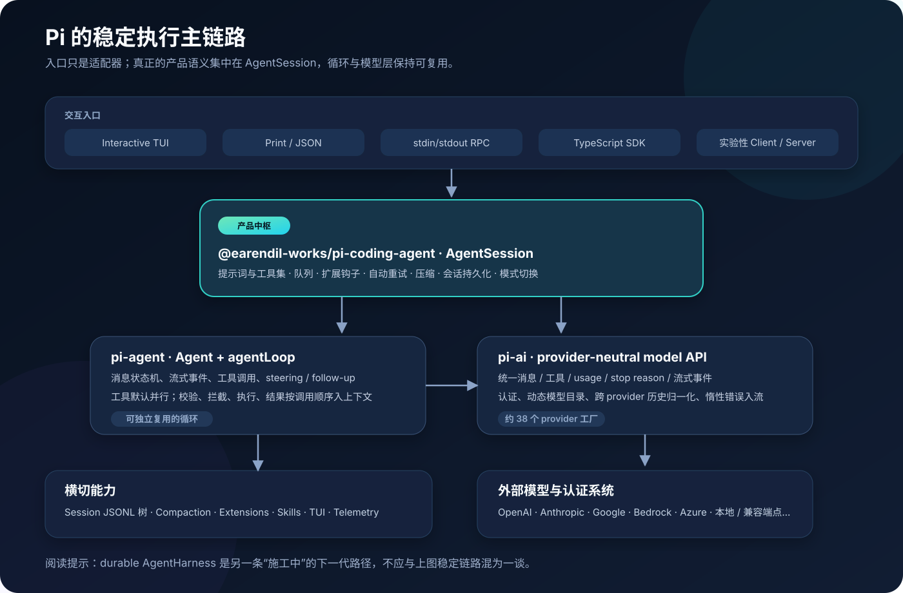
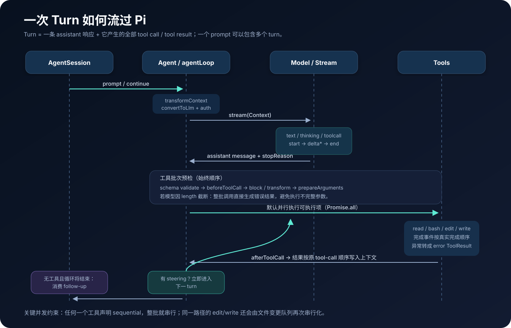
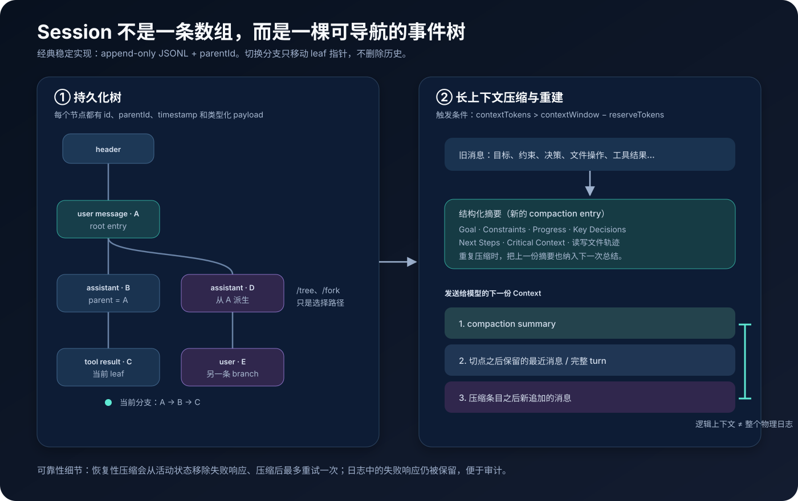
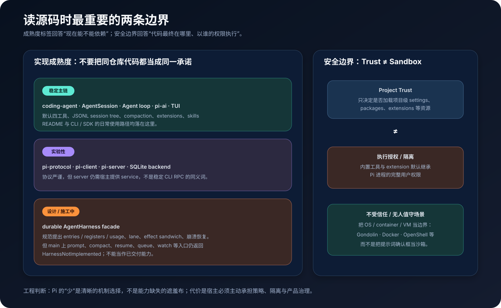

# Pi 源码解剖：一个把“少即是多”做到工程深处的 Coding Agent

> 站在大模型 Agent 工程师视角，对 [earendil-works/pi](https://github.com/earendil-works/pi) 的实现做一次自底向上的拆解。

| 调研项 | 信息 |
| --- | --- |
| 调研日期 | 2026-08-25 |
| 源码基线 | `main` · [`a79b3733421ead0dcea3cbe32247ea2464400dcb`](https://github.com/earendil-works/pi/tree/a79b3733421ead0dcea3cbe32247ea2464400dcb) |
| 相对版本 | `v0.84.3-19-ga79b37334`，即比 `v0.84.3` 多 19 个提交 |
| 调研方法 | 源码调用链阅读、包依赖与测试分布统计、稳定/实验接口交叉核对、Git 历史核验 |
| 适合读者 | Agent 框架作者、Coding Agent 工程师、准备二次开发 Pi 的团队 |

这不是一篇功能菜单。真正值得研究的是：Pi 如何用一个很小的核心，把模型差异、工具并发、会话分支、上下文压缩、插件生命周期和终端渲染这些“脏活”拼成一条可恢复、可扩展的 Agent 执行链。

同时，仓库正处在架构演进期。本文会严格区分三类东西：**当前稳定主链路、标注为 experimental 的远程协议栈、仍处于实现规范/施工阶段的 durable AgentHarness**。忽略这条边界，很容易读出一个“源码里尚不存在”的 Pi。

---

## 先说结论

从工程角度，我对 Pi 的判断是：**它不是一个预装全部工作流的 Agent 产品，而是一套带优秀默认值的、可塑性很强的 Coding Agent harness。**

最值得借鉴的七点是：

1. **核心循环刻意保持无产品偏见。** `pi-agent` 只理解消息、流、工具与队列；复杂产品语义集中在 `AgentSession`。
2. **跨模型统一不是“换一个 API 地址”。** Pi 会处理推理块、图像能力、tool-call ID、孤儿工具调用、动态认证和错误流化，解决的是历史消息能否跨 provider 重放。
3. **工具默认并行，但结果确定性优先。** 工具可以按完成顺序发事件，却按原调用顺序写回上下文；同一文件的写操作还会再串行化。
4. **会话是 append-only 事件树，不是聊天数组。** 分支、恢复、压缩都保留可审计历史，模型看到的“逻辑上下文”与磁盘上的“物理日志”分离。
5. **扩展系统有明确的宿主生命周期。** 它不只注册工具，还能拦截输入、上下文、模型 payload、tool call/result 与 session 切换。
6. **最小内核是一项有代价的设计选择。** 默认没有 MCP、subagent、计划模式、权限弹窗、后台 Bash；需要这些能力时应通过 extension 或宿主环境构建。
7. **Project Trust 不是 Sandbox。** Pi 默认让工具与扩展继承当前进程的用户权限，不受信任场景必须使用 OS、容器或 VM 隔离。

一句话概括它的架构：

> `main.ts` 决定从哪里进，`AgentSession` 决定产品如何运行，`Agent` 决定循环怎么转，`pi-ai` 决定模型如何说同一种语言。



---

## 1. Pi 到底是什么

Pi 的仓库 README 把它称为 Agent Harness，并把默认 Coding Agent 描述得非常克制：四个工具 `read`、`bash`、`edit`、`write`，四类入口 Interactive、Print/JSON、RPC、SDK。README 还明确列出“不内置”的能力：MCP、subagent、permission popup、plan mode、todo、后台 Bash 等。这不是路线图遗漏，而是“核心保持小、产品能力通过扩展组合”的立场。[来源：仓库 README](https://github.com/earendil-works/pi/blob/a79b3733421ead0dcea3cbe32247ea2464400dcb/README.md)

这种定位决定了 Pi 与常见“大而全 Agent 平台”的差异：

| 维度 | Pi 的选择 | 工程含义 |
| --- | --- | --- |
| 核心工具 | 只保留文件读写与 Shell | 给模型一个通用计算机接口，减少特殊工具语义 |
| 工作流 | 不固化 plan / todo / subagent | 由 extension、skill 或上层产品定义 |
| 模型 | provider-neutral，自带多供应商实现 | 会话可在不同模型间迁移，而不是绑定单 SDK |
| 会话 | 本地 append-only JSONL 树 | 可分支、可回放、可审计，且不要求数据库 |
| UI | 自研终端组件与差分渲染 | 对流式 token、工具进度、图片、IME 有完整控制 |
| 安全 | 明确依赖进程/系统边界 | 框架不伪装成权限沙箱，宿主承担隔离策略 |

### 仓库包图谱

源码不是一个巨型 CLI，而是分层 monorepo：

| 包 | 职责 | 本次基线的 TypeScript 源文件 / 测试文件数量¹ |
| --- | --- | ---: |
| `pi-ai` | 统一模型、消息、事件流、认证和 provider | 177 / 137 |
| `pi-agent` | Agent 状态机、工具循环，以及下一代 harness 原语 | 50 / 23 |
| `pi-coding-agent` | CLI、AgentSession、工具、会话、压缩、扩展、技能 | 206 / 244 |
| `pi-tui` | 终端组件、布局、差分渲染、图片协议 | 40 / 33 |
| `pi-telemetry` | tracing / metrics 基础设施 | 6 / 2 |
| `pi-protocol` | 远程会话的 CBOR 帧与类型协议 | 8 / 3 |
| `pi-client` | 与运行时无关的远程 session client | 10 / 6 |
| `pi-server` | 实验性远程 server 协议实现 | 17 / 7 |
| SQLite session backend | durable session 存储后端 | 18 / 11 |

> ¹ 数量由本次调研对基线 commit 的 `src/**/*.ts` 与测试文件统计所得，只用于理解规模，不代表官方质量指标。

包的分层很重要：`pi-agent` 不依赖终端与具体会话格式；`pi-ai` 不知道 Coding Agent；`pi-tui` 也不是只能显示 Pi 对话。这个边界使各层可以被单独嵌入。

---

## 2. 从 `pi` 命令到第一次模型调用

先沿稳定路径看一次启动。

### 2.1 `main.ts` 是入口适配器

CLI 解析参数后，根据 flags 与 TTY 状态选择 `rpc`、`json`、`print` 或 `interactive`。随后准备 cwd、项目可信状态、资源、模型运行时与 session。切换 session 时，与 cwd 绑定的 settings、extensions、skills 和模型服务会被重新创建，而不是沿用旧环境。[源码：`main.ts`](https://github.com/earendil-works/pi/blob/a79b3733421ead0dcea3cbe32247ea2464400dcb/packages/coding-agent/src/main.ts)

这里有一个健康的架构信号：CLI 没有自己实现第二套 Agent 逻辑。Interactive、Print、RPC 最终都复用 SDK 和 `AgentSession`，入口只负责 I/O 与生命周期适配。

### 2.2 `createAgentSession()` 组装依赖

SDK 工厂负责把以下对象拼起来：

- cwd 与配置目录；
- `ModelRuntime` 与模型认证；
- `SettingsManager`；
- `SessionManager`；
- `ResourceLoader`，其中包含 extensions、skills、prompt templates 与上下文文件；
- 默认工具 `read`、`bash`、`edit`、`write`；
- 底层 `Agent` 与上层 `AgentSession`。

它还把 extension 的 header、payload、response 钩子接进模型流，把上下文转换钩子接进 Agent，并按设置决定是否过滤图像。[源码：`createAgentSession()`](https://github.com/earendil-works/pi/blob/a79b3733421ead0dcea3cbe32247ea2464400dcb/packages/coding-agent/src/core/sdk.ts#L173)

这说明 `AgentSession` 不是简单的“聊天记录包装器”，而是一个 **application service / orchestration boundary**：它拥有运行一次 Coding Agent 所需的产品语义。

### 2.3 System prompt 为什么很短

Pi 的 system prompt 主要由以下部分动态拼成：

- 当前启用工具的说明与行为约束；
- Pi 文档位置；
- `AGENTS.md` / `CLAUDE.md` 等上下文文件；
- skill 的名称与简短描述；
- 当前工作目录。

它没有把完整工作流、几十条产品政策和所有 skill 正文一次性塞进去。Skill 元数据先进入提示词，模型需要时才用 `read` 打开相应 `SKILL.md`；这就是 progressive disclosure。[源码：`system-prompt.ts`](https://github.com/earendil-works/pi/blob/a79b3733421ead0dcea3cbe32247ea2464400dcb/packages/coding-agent/src/core/system-prompt.ts) [源码：`skills.ts`](https://github.com/earendil-works/pi/blob/a79b3733421ead0dcea3cbe32247ea2464400dcb/packages/coding-agent/src/core/skills.ts)

对 Agent 工程来说，这比“提示词越长越强”更成熟：**常驻 token 留给稳定协议，按需知识留给文件与工具。**

---

## 3. Agent Loop：小核心里的状态机

`pi-agent` 提供两层抽象：

- `agentLoop()` / `agentLoopContinue()`：无状态感较强的执行循环；
- `Agent`：保存消息、模型、工具、队列、流式状态和 abort controller 的状态化包装。

`AgentMessage` 允许 TypeScript declaration merging，因此上层可以加入自定义消息类型；真正发给 LLM 前再由 `convertToLlm` 转换。工具使用 TypeBox 声明参数 schema，并能设置 `sequential` / `parallel` 执行模式。事件粒度覆盖 agent、turn、message、tool execution 的 start/update/end。[源码：Agent 类型](https://github.com/earendil-works/pi/blob/a79b3733421ead0dcea3cbe32247ea2464400dcb/packages/agent/src/types.ts)



### 3.1 外循环与内循环

源码中的控制结构可以抽象为：

```text
prompt
└─ 外循环：处理 follow-up
   └─ 内循环：assistant response → tool calls → steering → 下一 turn
```

一个 **turn** 是一条 assistant response 加上它产生的全部 tool result；一次 prompt 可能有多个 turn。模型返回工具调用时，内循环继续；没有工具调用时，若存在 steering 也继续；只有本轮本来要结束时，才消费 follow-up。[源码：`agent-loop.ts`](https://github.com/earendil-works/pi/blob/a79b3733421ead0dcea3cbe32247ea2464400dcb/packages/agent/src/agent-loop.ts)

这两个队列语义不同：

- **steering**：尽快改变正在运行的 Agent，当前工具批次结束后立刻插入下一 turn；
- **follow-up**：等 Agent 自然停下来以后，再发起后续输入。

队列还支持 `all` 或 `one-at-a-time`。后者特别适合把多个用户输入逐个交给模型，避免一次合并后丢失对话节奏。

### 3.2 流式消息不是 UI 特效，而是状态协议

一次 assistant stream 会依次经过：

1. `transformContext`；
2. `convertToLlm`；
3. 按请求解析 API key；
4. 调 provider stream；
5. 把 text、thinking、tool call 的增量事件更新到 partial assistant message；
6. 完成后写回最终消息与 stop reason。

因此 TUI、JSON mode、SDK consumer 都观察同一组领域事件，而不是各自解析供应商 chunk。`Agent` 的 listener 还会按订阅顺序串行 `await`；直到 `agent_end` listener 完成，Agent 才真正被视为 idle。[源码：`Agent`](https://github.com/earendil-works/pi/blob/a79b3733421ead0dcea3cbe32247ea2464400dcb/packages/agent/src/agent.ts)

### 3.3 失败是数据，不轻易炸毁循环

Pi 对常见失败做了“入带内”处理：

- 参数不符合 schema：生成 error tool result；
- 工具不存在：生成 error tool result；
- 工具执行抛错：生成 error tool result；
- 模型 setup / auth 的异步错误：生成 assistant error，而不是让 stream 构造直接 reject；
- 模型因 `length` 截断：整批 tool call 不执行，因为 JSON 参数可能不完整。

这是 Agent runtime 的关键可靠性原则：**让模型看见可解释失败，并让事件序列保持闭合。** 真正的框架崩溃才交给外层异常处理。

---

## 4. 工具并发：吞吐、顺序与文件一致性

Pi 默认允许同一 assistant response 里的多个工具调用并行执行，但不是简单地 `Promise.all(tool.execute)`。

完整管线是：

```text
schema 校验
  → beforeToolCall（可阻止）
  → prepareArguments
  → parallel / sequential execute
  → afterToolCall（可改写结果、usage、terminate）
  → ToolResult 写回上下文
```

### 4.1 并行执行，确定性落盘

几个精细设计值得单独指出：

- 预检按 tool-call 顺序串行完成，钩子行为可预测；
- 只要批次中任一工具声明 `sequential`，整批就串行；
- 真正允许并行的调用才进入 `Promise.all`；
- `tool_execution_end` 事件按真实完成时间发出，UI 能及时显示；
- 写进模型上下文的 `ToolResult` 仍按原 tool-call 顺序排列，避免运行时抖动改变下一轮推理；
- 只有批次中所有结果都要求 `terminate`，循环才提前终止。

也就是说，Pi 同时保留了**低延迟的观测顺序**和**可重复的语义顺序**。

### 4.2 同一文件再加一把锁

并行 Agent 工具最容易制造的竞态是：模型同时调用两次 `edit` 或 `write` 修改同一路径。Pi 的 file mutation queue 会把路径 canonicalize 到 realpath，对同一个目标串行，对不同文件仍并行。[源码：`file-mutation-queue.ts`](https://github.com/earendil-works/pi/blob/a79b3733421ead0dcea3cbe32247ea2464400dcb/packages/coding-agent/src/core/tools/file-mutation-queue.ts)

这是很好的分层：Agent loop 只处理通用执行模式，文件领域的一致性约束由文件工具层承担。

### 4.3 四个默认工具并不“简陋”

四个工具的接口小，但实现做了大量防御性工作：[工具源码目录](https://github.com/earendil-works/pi/tree/a79b3733421ead0dcea3cbe32247ea2464400dcb/packages/coding-agent/src/core/tools)

**`read`**

- 支持文本与图片；
- 文本默认按 2,000 行或 50 KiB 截断，并返回 continuation offset；
- 图片会经过尺寸/格式处理，再作为多模态内容返回。

**`bash`**

- 使用配置的 shell，以独立进程组运行；
- abort 或 timeout 时清理进程树；
- 流式合并 stdout/stderr，约 100 ms 节流更新；
- 内存只保留尾部窗口，完整截断输出写到临时文件；
- 默认暴露 session、model、provider、reasoning 等 `PI_*` 环境变量。

**`edit`**

- 接收一组 exact `oldText → newText` 替换；
- 所有匹配都针对同一份原始文件检查；
- 要求唯一、互不重叠，避免后一项受前一项位移影响；
- 保留 BOM 与原换行风格，并输出 diff。

**`write`**

- 创建父目录；
- 创建或覆盖完整文件。

这里的经验是：给模型的 schema 可以小，**工具实现绝不能天真**。截断、取消、流控、编码、竞态、可诊断输出，才是 Coding Agent 工具的主要工程量。

---

## 5. `pi-ai`：统一的是语义，不只是 SDK

很多“多模型层”只统一 `messages` 和 `stream()` 两个函数。Pi 走得更深。

### 5.1 统一领域模型

`pi-ai` 定义了 provider-neutral 的：

- user / assistant / toolResult 消息；
- text / thinking / image / toolCall 内容块；
- usage、cache、reasoning token 与成本；
- `stop`、`length`、`toolUse`、`error`、`aborted`、`deferred` 等 stop reason；
- text、thinking、toolcall 的 start/delta/end 流事件；
- 模型上下文窗口、最大输出、图像/推理能力、兼容参数。

[源码：AI types](https://github.com/earendil-works/pi/blob/a79b3733421ead0dcea3cbe32247ea2464400dcb/packages/ai/src/types.ts)

在这之上，`Models` registry 负责认证解析、模型目录、provider 创建、动态刷新、登录/登出与真正的 stream dispatch。当前基线的注册表约有 38 个内置 provider factory，覆盖主流商业 API、云平台与兼容端点。[源码：provider 注册表](https://github.com/earendil-works/pi/blob/a79b3733421ead0dcea3cbe32247ea2464400dcb/packages/ai/src/providers/all.ts)

### 5.2 历史消息跨 provider 重放

真正困难的不是“这轮问谁”，而是“上一轮由 A 模型产生的历史，B 模型还能不能读”。Pi 的消息转换层会处理：

- 目标模型不支持视觉时，把图像转换为可理解的占位描述；
- 切换模型时丢弃、脱敏或转换供应商特有的 reasoning block；
- 规范化不同 provider 对 tool-call ID 的长度与字符限制；
- 给没有对应结果的孤儿 tool call 补一个合成 tool result；
- 重放时跳过 error / aborted assistant message。

[源码：`transform-messages.ts`](https://github.com/earendil-works/pi/blob/a79b3733421ead0dcea3cbe32247ea2464400dcb/packages/ai/src/api/transform-messages.ts)

这是 Pi 模型层最值得复用的思想：**provider abstraction 的验收标准，不是一次请求成功，而是跨模型长会话仍然语义闭合。**

### 5.3 惰性 stream 与错误入流

provider 可能需要动态 import、刷新认证、读取环境变量。若这些异步步骤在 stream 创建之前抛错，上层会收到一个 rejected promise，事件协议就断了。Pi 的 lazy stream 先同步返回统一事件流，再把 setup 成功或失败注入流中，最终都得到合法的 assistant result。[源码：`lazy.ts`](https://github.com/earendil-works/pi/blob/a79b3733421ead0dcea3cbe32247ea2464400dcb/packages/ai/src/api/lazy.ts)

这个细节让 UI 与 Agent loop 不必为“请求前失败”和“生成中失败”维护两套状态机。

---

## 6. AgentSession：真正的产品编排层

如果只读 `agent-loop.ts`，会低估 Pi 一半的实现。稳定 Coding Agent 的复杂行为大多在 `AgentSession` 中完成。[源码：`agent-session.ts`](https://github.com/earendil-works/pi/blob/a79b3733421ead0dcea3cbe32247ea2464400dcb/packages/coding-agent/src/core/agent-session.ts#L310)

一次 `AgentSession.prompt()` 大致经历：

1. 优先解析 extension command；
2. 让 extension 拦截或转换 input；
3. 展开 `/skill:name` 与 prompt template；
4. 若 Agent 正在 streaming，按选项进入 steering / follow-up 队列；
5. 校验模型认证；
6. 根据最新 token usage 判断是否在 prompt 前压缩；
7. 构造 user/custom message；
8. 触发 `before_agent_start`，允许注入消息或改 system prompt；
9. 调用底层 Agent；
10. 根据结果做自动重试、恢复性压缩、阈值压缩或继续消费队列。

事件处理也不是简单转发：extension 先看到事件，UI listener 后看到；`message_end` 时才持久化；custom message 延迟到 `turn_end` 刷入，避免把自定义消息插在 tool call 与 tool result 中间，破坏 LLM 协议。

另一个很好的生命周期约束是 session 切换：先 abort 并等待旧执行停止，再发送 `session_shutdown`、释放旧 runtime，按新 cwd 重建资源。旧 extension context 会失效，继续调用会抛出 stale-context 错误。[源码：session runtime](https://github.com/earendil-works/pi/blob/a79b3733421ead0dcea3cbe32247ea2464400dcb/packages/coding-agent/src/core/agent-session-runtime.ts)

这个边界防止了最难查的一类 bug：**新会话悄悄复用旧 cwd 的工具、配置或插件闭包。**

---

## 7. Session Tree 与 Compaction



### 7.1 append-only JSONL 事件树

经典稳定 `SessionManager` 使用 JSONL v3。第一行是 session header，后续每个 entry 都有唯一 ID 和 `parentId`，从而组成树。类型包括：

- message；
- model / thinking level change；
- compaction / branch summary；
- custom / custom message；
- label / session info。

当前 leaf 是一个指针。`getBranch()` 从 leaf 沿 parent 回溯到 root 再反转；切换分支不删除任何条目。需要把某条路径变成独立文件时，才会创建 branched session 并复制那一条路径。[源码：`session-manager.ts`](https://github.com/earendil-works/pi/blob/a79b3733421ead0dcea3cbe32247ea2464400dcb/packages/coding-agent/src/core/session-manager.ts#L855)

append-only 的收益有三个：

1. 分支是结构操作，不是数组复制和破坏性删除；
2. 失败、重试、模型切换都可审计；
3. 持久化简单，单机使用不需要数据库事务系统。

它的代价也很明确：日志会持续增长，逻辑上下文重建需要理解 entry 语义；多进程并发写入也不是这个经典本地格式的目标。

### 7.2 压缩不是“把前 N 条聊天总结一下”

默认配置预留约 16,384 token 给下一次输出，并倾向保留最近约 20,000 token。触发判断是：

```text
contextTokens > contextWindow - reserveTokens
```

切点从后向前按 token 估算寻找，并尽量切在 user / assistant 边界而不是 tool result 中间；超大 turn 必要时才允许拆分。摘要有固定结构：Goal、Constraints、Progress、Key Decisions、Next Steps、Critical Context，并额外累计读取/修改过的文件轨迹。[源码：经典 compaction](https://github.com/earendil-works/pi/blob/a79b3733421ead0dcea3cbe32247ea2464400dcb/packages/coding-agent/src/core/compaction/compaction.ts)

之后模型上下文由“最新摘要 + 切点后的保留消息 + 压缩之后的新消息”重建，而整个 JSONL 历史不变。再次压缩时，旧摘要也进入新摘要，形成滚动记忆。

### 7.3 三种自动压缩路径

`AgentSession` 会区分：

1. **恢复性压缩**：模型 context overflow，或可恢复的 `length` 失败；把失败 assistant 从活动上下文移除，压缩后最多重试一次。磁盘日志仍保留失败响应。
2. **成功后超窗**：本次已经成功，但 usage 显示下一次会超窗；立即压缩，不重试本轮。
3. **常规阈值压缩**：达到阈值后压缩，为后续 prompt 腾空间。

手动 `/compact` 会先 abort 当前工作，并且不会重放被中断的 turn。一次性摘要请求关闭 cache write、禁用工具调用，并拒绝带 tool call 或 `error/length` stop reason 的总结结果。

这种设计的核心不是“节省 token”，而是 **把上下文耗尽从 fatal error 变成可恢复的状态迁移**。

---

## 8. Extensions 与 Skills：代码能力和知识能力分开

Pi 把两类经常混用的扩展机制拆开了。

### 8.1 Extension 是宿主级代码插件

TypeScript extension 通过 `jiti` 加载，可注册：

- tools、commands、shortcuts、flags；
- provider 与自定义消息 renderer；
- session / agent / turn / message 事件；
- input、context、`before_agent_start`；
- tool call / result；
- provider headers / payload / response 拦截器。

多个 handler 按确定顺序链式执行。上下文会先 `structuredClone`，再依次变换；tool call 可以阻止；tool result 可以重写内容、details、error 与 usage。单个 extension 的多数异常会被报告并隔离，避免拖垮整个会话。[源码：extensions](https://github.com/earendil-works/pi/tree/a79b3733421ead0dcea3cbe32247ea2464400dcb/packages/coding-agent/src/core/extensions)

Extension runtime 在装载阶段先提供尚未 bind 的 action stub，正式绑定后才能操作 UI、session 等宿主能力。reload 或切换 session 后，旧 context 会主动失效。这相当于给动态插件加了一层轻量 capability lifetime。

### 8.2 Skill 是按需加载的知识包

Skill 遵循 Agent Skills 目录/元数据约定：启动时只扫描名称、描述、路径等 metadata，system prompt 只放索引；需要时模型读取完整 `SKILL.md`，或用户通过 `/skill:name` 显式展开。[Skills 文档](https://github.com/earendil-works/pi/blob/a79b3733421ead0dcea3cbe32247ea2464400dcb/packages/coding-agent/docs/skills.md)

两者的边界可以记成：

```text
Extension = 给宿主增加行为、钩子与工具
Skill     = 给模型增加说明、流程与可引用资源
```

把知识说明都写成 extension 会增加供应链与执行风险；把必须可靠执行的状态变更只写在 skill 里，又只能依赖模型遵守文本。Pi 的拆分是合理的。

---

## 9. TUI：为流式 Agent 设计的终端渲染器

`pi-tui` 不是 `console.log()` 的美化层。组件实现 `render(width) → lines`，并可获得焦点、处理键盘输入、作为 overlay 组合。它支持两种渲染策略：[TUI 源码](https://github.com/earendil-works/pi/tree/a79b3733421ead0dcea3cbe32247ea2464400dcb/packages/tui/src)

- **主屏模式**：保留真实终端 scrollback，适合长会话；
- **alternate screen**：应用拥有整个 viewport，适合全屏交互。

每一帧会比较上一帧与当前帧的行，定位首尾变化区，只重绘必要区域；终端尺寸变化等情况才完整刷新。输出被包在 synchronized output 控制序列中，减少多行更新闪烁。还处理 Kitty / iTerm 图片协议、IME 光标定位，以及 ANSI 宽度约束。

这对 Coding Agent 很关键：模型 token、thinking、多个并行工具进度、diff preview 和 extension renderer 会同时变化。没有统一组件树与差分渲染，很快会出现光标漂移、日志覆盖和闪屏。

Pi 选择自研 TUI 的代价是维护终端兼容性；收益是事件模型、工具细节和插件渲染能形成一体化体验。

---

## 10. 两种“RPC”不要混淆

仓库同时存在：

1. **稳定 Coding Agent RPC mode**：`pi --mode rpc` 一类的 stdin/stdout 集成入口，复用 `AgentSession`；
2. **实验性 `pi-protocol` / `pi-client` / `pi-server`**：面向远程 session 的独立协议栈。

后者的 wire format 是 4 字节大端无符号长度，加一个 definite-length CBOR item；首条 client 消息必须是 hello/version。schema 使用 TypeBox 严格校验并拒绝未知字段，默认限制 16 MiB frame 与 64 层嵌套。Client 通过与运行时无关的 `ByteTransport` 通信，使用 request ID，并以服务端 snapshot 为权威状态，而不是看到 progress event 就乐观改写本地状态。[协议 README](https://github.com/earendil-works/pi/blob/a79b3733421ead0dcea3cbe32247ea2464400dcb/packages/protocol/README.md) [Client README](https://github.com/earendil-works/pi/blob/a79b3733421ead0dcea3cbe32247ea2464400dcb/packages/client/README.md)

Server 有 hello/handshake/ready 状态和默认 5 秒握手超时，也有 shared/exclusive lease 概念。但它仍被明确标记为 experimental，且需要应用提供具体 `PiServerService`；它不是一个已经完备的独立远程 Coding Agent 服务。[Server README](https://github.com/earendil-works/pi/blob/a79b3733421ead0dcea3cbe32247ea2464400dcb/packages/server/README.md)

如果今天构建产品：本地交互和进程集成优先依赖稳定 `AgentSession`/SDK/RPC；需要远程多客户端会话时，可以研究 protocol stack，但应按实验接口管理升级成本。

---

## 11. Durable AgentHarness：漂亮的规范，但尚不是稳定现实

这是本次调研最容易误判、也最值得关注的部分。

`packages/agent/docs/harness.md` 描述了一套很有野心的 durable runtime：

- **entries**：不可变、只追加的事实；
- **registers**：可变的当前指针和配置；
- **usage ledger**：独立于 transcript 的资源账本；
- **lanes**：并行或隔离的执行分支；
- **operation program counter**：操作级恢复位置；
- **effect sandwich**：外部副作用前写 intent，执行 effect，之后写 settlement；
- 按 `replay-safe` / `never` 区分崩溃后工具能否重放；
- 明确不虚构 exactly-once，而是用可观察记录和工具策略面对不确定性。

[实现规范：AgentHarness](https://github.com/earendil-works/pi/blob/a79b3733421ead0dcea3cbe32247ea2464400dcb/packages/agent/docs/harness.md)

这些思想非常专业。尤其 effect sandwich 正视了 Agent 的经典难题：进程可能在“外部命令已经执行”与“结果已经持久化”之间崩溃，恢复时无法仅凭 transcript 判断是否应重放。

但是，**在本文锁定的 `main` commit 上，这还是“规范领先于门面实现”**：`AgentHarness.prompt()`、`promptFromSkill()`、`compact()`、`resume()`、navigation、queues、watch、lane 等公开入口大多直接返回 `HarnessNotImplemented`；`create()` 遇到已有 record 时也拒绝 restore。当前已存在的是 durable Session 的数据类型、reducer 与内存/JSONL/SQLite 存储原语，不是完整可用的 AgentHarness。[源码：`agent-harness.ts`](https://github.com/earendil-works/pi/blob/a79b3733421ead0dcea3cbe32247ea2464400dcb/packages/agent/src/harness/agent-harness.ts#L305)



因此正确理解是：

```text
今天可依赖：AgentSession + 经典 Agent loop + 经典 JSONL session/compaction
可以试验：protocol / client / server / durable storage primitives
值得跟踪：完整 durable AgentHarness 驱动与崩溃恢复
```

仓库其他分支的开发历史确实显示 durable drive 仍在快速推进，但未合并到本次 `main` 基线的提交不能作为已发布能力。生产设计应该以使用的固定 commit 为准，而不是以文档愿景或未合并分支为准。

---

## 12. 安全模型：诚实，但需要宿主负责

Pi 的安全文档非常直接：Project Trust 只控制项目级 settings、resources、packages、extensions 是否加载；它**不是 sandbox，也不限制模型调用内置工具**。上下文文件甚至可能在不信任项目时仍按配置加载。[安全文档](https://github.com/earendil-works/pi/blob/a79b3733421ead0dcea3cbe32247ea2464400dcb/packages/coding-agent/docs/security.md)

默认情况下：

- `bash` 继承 Pi 进程用户的权限；
- `read/edit/write` 能访问该用户可访问的路径；
- extension 是本机 JavaScript/TypeScript 代码，拥有宿主进程权限；
- prompt injection 被视为本地 Agent 必须由运行环境管理的风险。

所以，权限确认弹窗即使由 extension 实现，也只是产品交互策略，不是强隔离。对未知仓库、外来 issue、无人值守任务，正确边界是：

- 把整个 Pi 放进 Docker / VM；或
- 像 Gondolin 方案一样，让宿主 Pi 与认证留在外部，把内置工具路由进 microVM；或
- 使用有系统策略的 sandbox，例如文档列出的 OpenShell 类型方案。

从专业 Agent 工程角度看，我认可这种“明确不假装”的安全姿态，但产品团队不能把它理解为“无需安全设计”。恰恰相反，Pi 把策略自由交给了宿主，宿主就必须给出网络、文件、凭据、进程、资源配额与审计的答案。

---

## 13. 工程评价：Pi 做对了什么，又把什么留给你

### 做得很好的部分

**1. 分层边界清楚。** 供应商协议、Agent loop、产品 session、终端 UI 可以分别测试和嵌入。特别是把复杂编排留在 `AgentSession`，避免污染通用 loop。

**2. 事件和失败语义完整。** partial message、工具进度、abort、error 都进入同一事件协议，调用方不必拼接多套异常路径。

**3. 并发细节成熟。** 预检顺序、并行执行、结果稳定排序、路径级写锁，是“跑一个 demo”和“长期跑代码任务”的区别。

**4. 会话可审计。** append-only tree 让 fork、retry、compaction 不必篡改历史，也为未来 durable runtime 提供了正确方向。

**5. 扩展面足够深。** 不只注册工具，还覆盖 prompt、context、provider 与结果变换；大多数定制无需 fork 核心。

**6. 对模型差异有真实经验。** Tool ID、reasoning block、孤儿调用、视觉降级和惰性认证错误，都是多 provider 生产系统才会遇到的问题。

### 需要接受或补齐的部分

**1. 默认不是安全执行环境。** 企业或多租户部署必须自行增加 sandbox、policy、secret broker 和审计。

**2. 经典 session 主要面向单机进程。** 要做多客户端、协作和崩溃恢复，需评估实验协议栈与 durable harness 的成熟度，不能直接假设已有完整方案。

**3. 扩展能力强也意味着供应链风险大。** 应锁版本、审查代码、区分用户级与项目级来源，并让不可信项目默认处在隔离环境。

**4. “少内置”会把产品决策推给团队。** 权限体验、计划管理、subagent 调度、MCP、后台任务、组织策略都要自己组合；如果团队只想要开箱即用平台，这未必是最低成本选择。

**5. 文档与演进分支可能领先于 `main`。** durable AgentHarness 就是典型例子。集成前应做接口级 source audit，并固定 commit 或 release。

### 对自研 Agent 框架的五条启示

1. **先定义事件与状态闭合，再做漂亮 UI。** 所有 start 都要有 update/end，错误也要成为合法终态。
2. **把模型抽象的测试重点放在历史重放。** 单轮请求兼容远远不够。
3. **并发应在领域边界上加约束。** 通用 loop 决定批次并发，文件工具决定同路径串行，数据库工具决定事务。
4. **物理历史与逻辑上下文分离。** 不要为了 token window 删除真实历史；用摘要、指针和视图重建上下文。
5. **不要宣称 exactly-once。** 外部副作用要有 intent/settlement、幂等键、查询能力和明确的 replay policy。

---

## 14. 推荐的源码阅读顺序

如果你准备二次开发，建议按稳定主链从外到内读：

1. [`README.md`](https://github.com/earendil-works/pi/blob/a79b3733421ead0dcea3cbe32247ea2464400dcb/README.md)：先理解产品哲学与刻意不做的能力；
2. [`packages/coding-agent/src/main.ts`](https://github.com/earendil-works/pi/blob/a79b3733421ead0dcea3cbe32247ea2464400dcb/packages/coding-agent/src/main.ts)：看入口与模式选择；
3. [`core/sdk.ts`](https://github.com/earendil-works/pi/blob/a79b3733421ead0dcea3cbe32247ea2464400dcb/packages/coding-agent/src/core/sdk.ts)：看依赖如何组装；
4. [`core/agent-session.ts`](https://github.com/earendil-works/pi/blob/a79b3733421ead0dcea3cbe32247ea2464400dcb/packages/coding-agent/src/core/agent-session.ts)：看产品级状态机；
5. [`packages/agent/src/agent-loop.ts`](https://github.com/earendil-works/pi/blob/a79b3733421ead0dcea3cbe32247ea2464400dcb/packages/agent/src/agent-loop.ts)：看最小执行循环；
6. [`packages/ai/src/models.ts`](https://github.com/earendil-works/pi/blob/a79b3733421ead0dcea3cbe32247ea2464400dcb/packages/ai/src/models.ts) 与 [`transform-messages.ts`](https://github.com/earendil-works/pi/blob/a79b3733421ead0dcea3cbe32247ea2464400dcb/packages/ai/src/api/transform-messages.ts)：看多模型抽象；
7. [`session-manager.ts`](https://github.com/earendil-works/pi/blob/a79b3733421ead0dcea3cbe32247ea2464400dcb/packages/coding-agent/src/core/session-manager.ts) 与 [`compaction.ts`](https://github.com/earendil-works/pi/blob/a79b3733421ead0dcea3cbe32247ea2464400dcb/packages/coding-agent/src/core/compaction/compaction.ts)：看记忆与恢复；
8. [`extensions`](https://github.com/earendil-works/pi/tree/a79b3733421ead0dcea3cbe32247ea2464400dcb/packages/coding-agent/src/core/extensions) 和 [`tools`](https://github.com/earendil-works/pi/tree/a79b3733421ead0dcea3cbe32247ea2464400dcb/packages/coding-agent/src/core/tools)：看真正的定制接口；
9. 最后再读 [`harness.md`](https://github.com/earendil-works/pi/blob/a79b3733421ead0dcea3cbe32247ea2464400dcb/packages/agent/docs/harness.md) 与 [`agent-harness.ts`](https://github.com/earendil-works/pi/blob/a79b3733421ead0dcea3cbe32247ea2464400dcb/packages/agent/src/harness/agent-harness.ts)，比较愿景和当前实现。

---

## 结语

Pi 最有价值的地方，不是功能数量，而是它对 Agent runtime 本质问题的取舍：模型会变化，工具会失败，输出会流动，会话会分叉，上下文会耗尽，扩展会失效，外部副作用无法天然 exactly-once。

当前稳定实现已经用相当干净的边界处理了其中大部分；下一代 durable AgentHarness 则在试图把“进程崩溃后的可恢复执行”也纳入同一个模型。前者今天就值得学习和使用，后者值得持续跟踪，但两者必须以源码状态而不是文档想象来区分。

如果要用一句工程化的评价收尾：

> **Pi 的核心竞争力不是替你决定 Agent 应该长什么样，而是让你在做这些决定时，不必重新发明模型流、工具循环、会话树、压缩与终端运行时。**

---

### 调研说明

- 本文所有具体实现判断均以文首固定 commit 为准；Pi 迭代很快，阅读未来版本时请重新核对。
- 代码规模统计来自本地检出的官方仓库；评价性内容是作者基于源码的工程判断，不代表项目维护者立场。
- 图均为本次调研依据源码关系绘制的 SVG，可在本文 `assets/` 目录中单独查看和复用。
