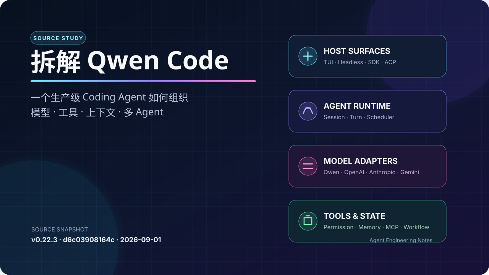
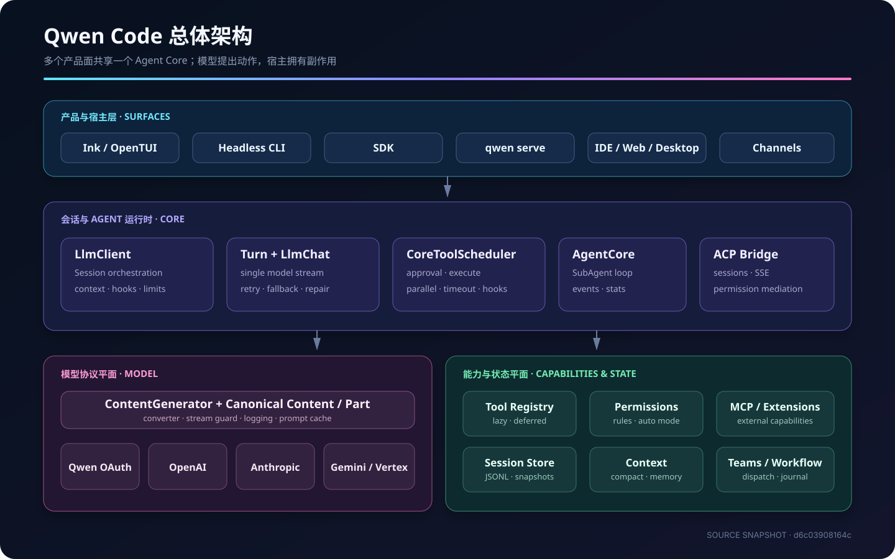
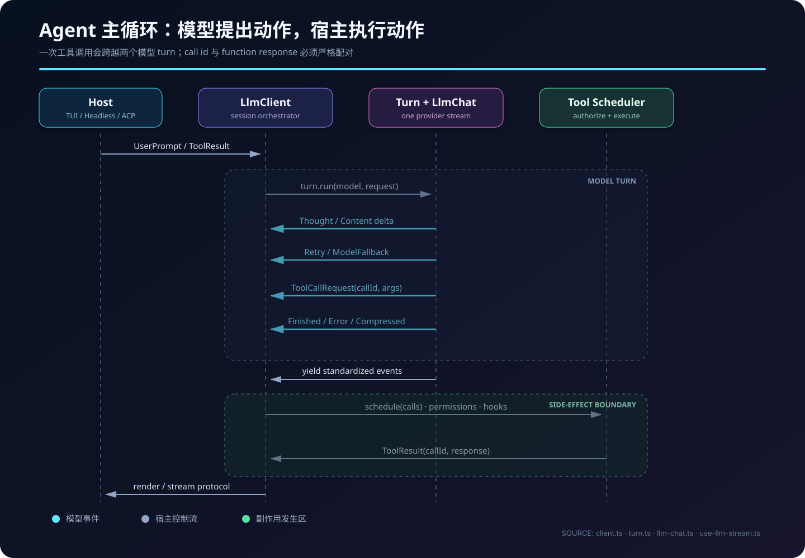
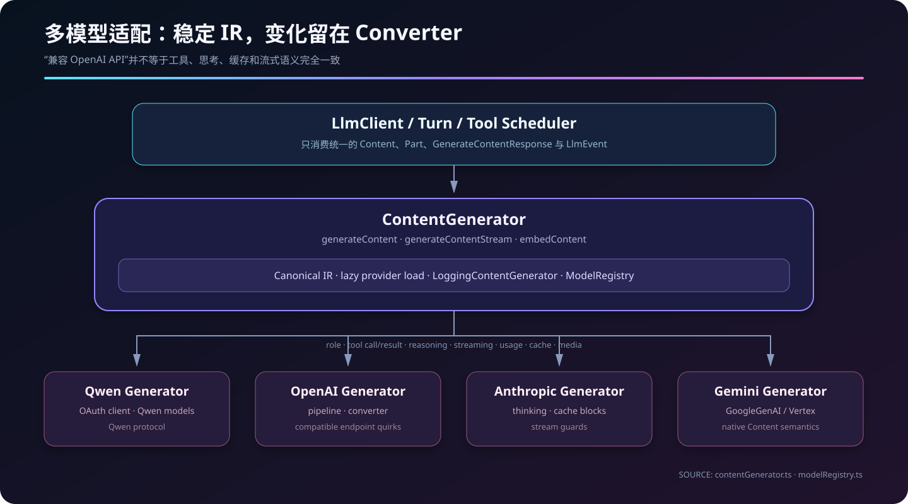
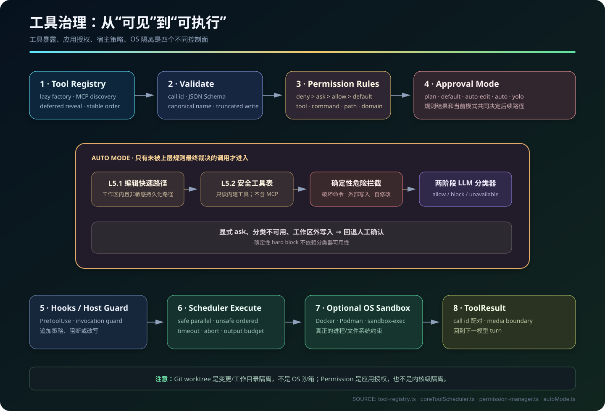
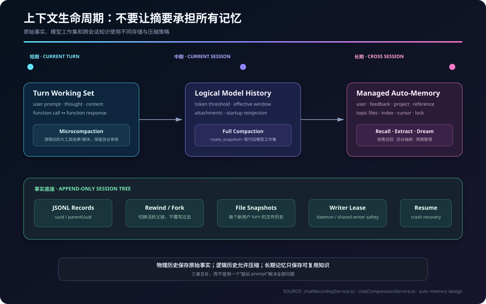
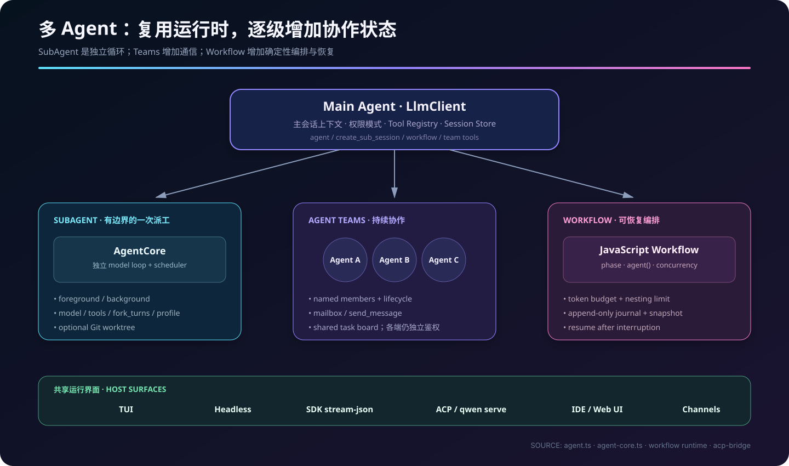

# 拆解 Qwen Code：一个生产级 Coding Agent 如何组织模型、工具、上下文与多 Agent



> 本文从大模型 Agent 工程视角阅读 [QwenLM/qwen-code](https://github.com/QwenLM/qwen-code)，重点回答：它怎样把一次模型生成变成可恢复、可授权、可扩展的工程任务执行；多模型兼容、工具调用、上下文压缩、Auto-Memory、SubAgent、MCP 与 daemon 又分别落在哪一层。

## 调研基线与方法

| 项目 | 本文基线 |
|---|---|
| 仓库 | `QwenLM/qwen-code` |
| 分支 / Commit | `main` / [`d6c03908164c`](https://github.com/QwenLM/qwen-code/commit/d6c03908164dcb2704b2252b69b244be9be5c09a) |
| Commit 时间 | 2026-09-01 14:37:22 UTC |
| 根包版本 | `0.22.3` |
| 运行时 | Node.js `>= 22`，ESM + TypeScript |
| 许可证 | Apache-2.0 |
| 规模感知 | 34 个 package manifest；约 27 万行已跟踪的 TS/TSX/JS/Python/Java（含测试、SDK 与脚本）；超过 2,100 个 TS/TSX 测试文件 |

调研采用“固定 commit 的源码追踪 + 官方设计文档交叉验证”。所有源码链接都固定到上述 commit，避免 `main` 后续变化让结论漂移。这里的规模数字只用于建立量级感，不等同于有效业务代码行数。

Qwen Code 最早基于 Google Gemini CLI v0.8.2；项目 README 明确说明，从 Qwen Code v0.1.0 起不再与上游同步，而是独立演进。今天还能在 `Content`、`Part` 以及少量历史命名中看到血缘，但权限、Auto Mode、多模型适配、Agent Teams、Workflow、daemon、SDK 等已经形成自己的体系。

## 结论先行

如果只把 Qwen Code 理解成“LLM + Shell”，会漏掉它真正有价值的部分。它更接近一个本地 Agent 运行时：

1. **模型只提出意图，宿主拥有副作用。** 核心会话把模型流标准化为文本、思考、工具请求、完成、压缩、重试等事件；CLI、SDK/ACP 宿主或 SubAgent runtime 再调度工具，并把结果作为下一轮 `ToolResult` 回送。
2. **内部协议稳定，外部模型可替换。** `ContentGenerator` 屏蔽 OpenAI、Anthropic、Gemini、Qwen OAuth 等协议差异，内部仍使用统一的 `Content / Part / GenerateContentResponse` 语义。
3. **工具不是函数表，而是治理平面。** `ToolRegistry` 管发现与延迟暴露；`CoreToolScheduler` 管状态机、并发、超时与 Hook；`PermissionManager` 管规则；Auto Mode 再增加确定性拦截和 LLM 分类器。
4. **长任务靠状态管理，而不只靠上下文窗口。** JSONL 会话树、文件快照、microcompaction、摘要压缩、启动上下文重注入、Auto-Memory 各自解决不同时间尺度的问题。
5. **多 Agent 是同一运行时的递归复用。** SubAgent 有独立模型循环和工具调度；Teams 增加身份、消息与任务板；Workflow 再把调度逻辑固化为可恢复脚本。
6. **安全不是一个开关。** Folder Trust、应用权限、Auto Mode、Hook、工具参数验证、可选容器/`sandbox-exec`、worktree 隔离分别约束不同风险；其中 worktree 不是文件系统沙箱。



## 一、仓库不是一个 CLI，而是一组共用 Core 的产品面

仓库采用 npm workspaces。最重要的层次可以压缩成下表：

| 层 | 关键包 / 目录 | 职责 |
|---|---|---|
| 入口与交互 | `packages/cli` | 参数与设置合并、交互 TUI、headless、`qwen serve`、MCP 管理命令 |
| Agent 内核 | `packages/core` | 会话循环、模型协议、工具、权限、上下文、压缩、记忆、SubAgent、Workflow |
| 远程宿主 | `packages/acp-bridge` | ACP session/channel、HTTP/SSE 事件桥、权限仲裁、重连与回放 |
| 编程接口 | `packages/sdk-typescript`、`sdk-python`、`sdk-java` | 子进程 `stream-json` SDK，以及 daemon REST/SSE 客户端 |
| UI 与终端 | `web-shell`、`webui`、`desktop-shell` | Web/桌面交互壳与协议适配 |
| 外部通道 | `channels/*` | Telegram、钉钉、飞书、企业微信、GitHub/GitLab 等通道 |
| IDE / 设备 | VS Code、Zed、Chrome Extension、CUA、mobile MCP | IDE 上下文、浏览器/计算机操作、移动端能力 |

因此同一个 Core 可以被不同宿主复用：终端里是交互 Agent，CI 中是 headless，一台常驻机器上可以是 daemon，SDK 中则是受调用方控制的生成器。这里的 **ACP（Agent Client Protocol）解决 Agent 与宿主/IDE 的会话通信**；**MCP（Model Context Protocol）解决 Agent 如何接入外部工具、资源和 prompt**，两者不要混为一谈。

### 启动链路：先走快路径，再组装重运行时

入口 [`packages/cli/index.ts`](https://github.com/QwenLM/qwen-code/blob/d6c03908164dcb2704b2252b69b244be9be5c09a/packages/cli/index.ts) 很薄，实际启动在 [`cli.ts`](https://github.com/QwenLM/qwen-code/blob/d6c03908164dcb2704b2252b69b244be9be5c09a/packages/cli/src/cli.ts)：

```text
qwen
  └─ runCliEntryPoint()
      ├─ 初始化启动/CPU profiler
      ├─ 清理敏感环境变量，固定当前 CLI build
      ├─ help / version / mcp / serve 快路径
      └─ 动态导入 llm.tsx
          ├─ 加载 settings + CLI args + trust + provider
          ├─ 构造 Config（composition root）
          ├─ interactive → Ink/React TUI
          └─ headless    → nonInteractiveCli
```

这个“轻入口 + 动态导入”的选择很实际：`--help`、`--version`、daemon 等路径不需要把整个 React TUI 和 Agent 内核都拉进来。真正的依赖组装中心是 [`loadCliConfig`](https://github.com/QwenLM/qwen-code/blob/d6c03908164dcb2704b2252b69b244be9be5c09a/packages/cli/src/config/config.ts)，它把模型、认证、MCP、权限、工具、存储、遥测、技能、SubAgent 等设置压成一个 `Config`。

当前默认交互 UI 仍是 Ink/React，入口是 [`startInteractiveUI.tsx`](https://github.com/QwenLM/qwen-code/blob/d6c03908164dcb2704b2252b69b244be9be5c09a/packages/cli/src/ui/startInteractiveUI.tsx)。仓库已经出现 OpenTUI 后端组合根，但源码将其明确标为 experimental，并写明 legacy Ink TUI 在迁移完成前仍是默认实现。恰好本文基线 commit 的主题也是 OpenTUI backend composition root；这说明 UI 层正在换代，不能把实验代码误写成当前默认架构。

## 二、Agent Loop：模型流和副作用执行被刻意拆开

Agent 的主会话编排器是 [`LlmClient`](https://github.com/QwenLM/qwen-code/blob/d6c03908164dcb2704b2252b69b244be9be5c09a/packages/core/src/core/client.ts)。一次对话大致经过两段：

- `startChat()`：预热 Tool Registry、恢复历史中曾暴露的延迟工具、装载技能快照、生成 system prompt、创建 `LlmChat`、修复孤立工具调用、触发 `SessionStart` Hook。
- `sendMessageStream()`：执行 prompt Hook、记会话、召回记忆、创建文件快照、检查 turn/token 限额、做 microcompaction、拼每轮提醒，再交给一个 `Turn`。

[`Turn.run()`](https://github.com/QwenLM/qwen-code/blob/d6c03908164dcb2704b2252b69b244be9be5c09a/packages/core/src/core/turn.ts) 只负责“一次模型流”，把 provider 返回统一成 `Content`、`Thought`、`ToolCallRequest`、`Citation`、`Retry`、`ModelFallback`、`ChatCompressed`、`Finished`、`Error` 等事件。更底层的 [`LlmChat`](https://github.com/QwenLM/qwen-code/blob/d6c03908164dcb2704b2252b69b244be9be5c09a/packages/core/src/core/llm-chat.ts) 管历史、provider stream、重试/回退、自动压缩、prompt cache，以及残缺工具调用修复。



这里有一个很重要的实现细节：**主会话的 `sendMessageStream()` 不直接执行工具**。交互模式由 [`use-llm-stream.ts`](https://github.com/QwenLM/qwen-code/blob/d6c03908164dcb2704b2252b69b244be9be5c09a/packages/cli/src/ui/hooks/use-llm-stream.ts) 收集 `ToolCallRequest`，再由 [`useReactToolScheduler.ts`](https://github.com/QwenLM/qwen-code/blob/d6c03908164dcb2704b2252b69b244be9be5c09a/packages/cli/src/ui/hooks/useReactToolScheduler.ts) 驱动调度器；headless 模式则在 [`nonInteractiveCli.ts`](https://github.com/QwenLM/qwen-code/blob/d6c03908164dcb2704b2252b69b244be9be5c09a/packages/cli/src/nonInteractiveCli.ts) 中完成同样的闭环。工具完成后，宿主把 function response 作为 `ToolResult` 再调用会话。

用接近源码职责、但省略 UI 与遥测细节的伪代码表示：

```ts
let request: UserPrompt | ToolResult = initialPrompt;

while (!signal.aborted) {
  const calls: ToolCallRequest[] = [];

  for await (const event of llmClient.sendMessageStream(request, signal)) {
    renderTextOrThought(event);
    if (event.type === 'ToolCallRequest') calls.push(event.value);
  }

  if (calls.length === 0) break;

  const results = await scheduler.schedule(calls, signal);
  request = toStrictlyPairedFunctionResponses(results);
}
```

为什么要多这一层？因为决定“是否执行、在哪执行、怎样展示确认、如何取消”的是宿主，不应该是模型传输层。相同模型循环才得以运行在 TUI、JSON 流、ACP、SDK 或 SubAgent 中。

### 这个循环怎样避免越跑越坏

Qwen Code 在循环外围加入了多道故障控制：

- 请求级重试与 fallback model；输出窗口会按模型能力钳制。
- 发送前修复 orphan function call/response，必要时兼容 XML 工具调用。
- 工具结果保持严格邻接，避免在 function call 与 response 中间插入普通消息。
- 检测连续相同调用、Shell 原地检查、单 turn 工具数上限；启发式 loop detector 可独立配置。
- `maxSessionTurns`、session token limit、工具超时、工具输出预算分别限制不同资源。
- 压缩发生后重注入启动上下文，因为摘要已经替换了原始 system/startup 信息。
- Stop Hook、steering input、next-speaker check 可以让宿主在“模型看似结束”时决定继续或停止。

这比一个简单的 `while(toolCalls.length)` 更接近生产系统：模型错误、协议错误、长上下文、重复动作和工具卡死被视作不同故障域。

## 三、多模型层：真正难的是语义归一化

模型抽象的窄腰是 [`ContentGenerator`](https://github.com/QwenLM/qwen-code/blob/d6c03908164dcb2704b2252b69b244be9be5c09a/packages/core/src/core/contentGenerator.ts)：

```ts
interface ContentGenerator {
  generateContent(request, userPromptId): Promise<GenerateContentResponse>;
  generateContentStream(request, userPromptId): Promise<AsyncGenerator<...>>;
  embedContent(request): Promise<EmbedContentResponse>;
}
```

`createContentGenerator()` 按 `AuthType` 延迟加载对应实现：OpenAI、Qwen OAuth、Anthropic、Gemini/Vertex。外层再包一层 `LoggingContentGenerator`。延迟加载既减少无关 SDK 的启动成本，也让 provider 依赖留在适配层。



内部统一消息目前沿用 `@google/genai` 的 `Content`、`Part`、`GenerateContentResponse`。这是一种历史兼容形成的 canonical IR，并不意味着只能用 Gemini。OpenAI 与 Anthropic converter 会负责：

- system instruction、role 与 tool call/result 的双向映射；
- reasoning/thinking 方言与 effort/budget；
- 流式增量、结束原因、usage 与 citation 归一化；
- prompt cache 控制；
- 严格 OpenAI-compatible 后端要求的工具媒体拆分、字符串化 tool result；
- 截断、残缺 JSON 工具参数和 provider 特有行为的防御。

[`ModelRegistry`](https://github.com/QwenLM/qwen-code/blob/d6c03908164dcb2704b2252b69b244be9be5c09a/packages/core/src/models/modelRegistry.ts) 又把“模型身份/能力”与“协议”分开。模型键包含 `id + baseUrl`，所以相同模型名在不同 endpoint 上不会被误认为同一实例；注册信息还包含 context window、输入输出 modality 与 capability。Provider preset 则负责常见厂商的 base URL、认证和默认值。

工程上最值得借鉴的一点是：**多模型不是把 `baseURL` 换掉，而是先定义稳定 IR，再把每家协议的不一致收敛在 converter 和 stream guard 中。** 否则所有上层逻辑都会充斥 `if (provider === ...)`。

## 四、工具系统：Registry、Scheduler、Permission 各司其职

### 4.1 Tool Registry：管理“模型现在看得见什么”

[`ToolRegistry`](https://github.com/QwenLM/qwen-code/blob/d6c03908164dcb2704b2252b69b244be9be5c09a/packages/core/src/tools/tool-registry.ts) 同时维护已实例化工具和 lazy factory：

- 并发 `ensureTool()` 共用同一个加载 Promise；`warmAll()` 可主动预热。
- deferred 工具先不出现在 model schema 中，只有 `tool_search` 找到后才 reveal，以降低 token 与选择噪声。
- `settings.tools.eager` 控制 schema 暴露，并不等于授权。
- MCP 重名工具会得到 `mcp__server__tool` 形式的全限定名。
- 工具声明按稳定字母序输出，尽量维持 prompt cache 前缀。
- 除内建工具、MCP 外，也支持项目配置的 discovery/call subprocess 工具。

内建能力已覆盖文件读写、grep/glob、Shell、LSP、网页搜索、MCP、skills、memory、plan、cron、notebook、worktree、SubAgent、Teams、Workflow、image generation、artifact 和 structured output。这些能力不是在启动时全量塞给模型，而是按配置、模式与搜索结果渐进暴露。

### 4.2 Scheduler：执行状态机与并发背压

[`CoreToolScheduler`](https://github.com/QwenLM/qwen-code/blob/d6c03908164dcb2704b2252b69b244be9be5c09a/packages/core/src/core/coreToolScheduler.ts) 是副作用执行的统一入口：

```text
validating
   │  schema、截断写入保护、规范化工具名
   ▼
awaiting_approval ── 用户/宿主拒绝 ──> cancelled/error
   │  Permission + Auto Mode + PreToolUse Hook
   ▼
scheduled ──> executing ──> success | error | cancelled
                 │
                 └─ 增量 output update、timeout、abort、PostToolUse Hook
```

调度器会去重 call id，并把连续的并发安全调用成批运行；存在副作用的调用保持顺序。只读 Shell 可被判断为并发安全，默认最大并发为 10。最终结果还会经过输出预算和媒体边界处理，防止一个工具把上下文直接淹没。

### 4.3 Permission：规则优先级与 Auto Mode

[`PermissionManager`](https://github.com/QwenLM/qwen-code/blob/d6c03908164dcb2704b2252b69b244be9be5c09a/packages/core/src/permissions/permission-manager.ts) 解析 session 与持久规则，优先级是 `deny > ask > allow > default`。规则既能匹配工具，也能匹配命令、路径、域名；Shell 命令还会被拆成语义操作，例如 `cat` 映射到 Read，`curl` 映射到 WebFetch，复合命令逐段评估。



五种 approval mode 的意图如下：

| 模式 | 行为重点 |
|---|---|
| `plan` | 聚焦规划，限制有副作用的执行 |
| `default` | 按规则与工具默认策略请求人工确认 |
| `auto-edit` | 工作区编辑快速放行，其他风险操作仍走确认 |
| `auto` | 工作区编辑、安全只读工具走快速路径，其余进入确定性保护与两阶段 LLM 分类器；无法分类时回退人工 |
| `yolo` | 广泛自动批准，风险由操作者承担 |

Auto Mode 的源码 [`autoMode.ts`](https://github.com/QwenLM/qwen-code/blob/d6c03908164dcb2704b2252b69b244be9be5c09a/packages/core/src/permissions/autoMode.ts) 并非“让另一个模型随便判断”，而是分层过滤：

1. 工作区内普通 Edit/Write 快速放行，但 `.git`、CI、package scripts、Qwen 配置/skills/hooks 等持久化或自修改路径被排除。
2. 纯只读、元数据类内建工具进入硬编码 allowlist；MCP 不会因为名字像只读工具就被信任。
3. Shell 先经过确定性的 destructive-command guard。
4. 工作区外写入强制回到人工；显式 `ask` 规则优先于自动化。
5. 剩余调用才进入两阶段 LLM classifier；连续拒绝、分类器不可用等情况都有 fallback。

这里必须分清四层边界：

- Permission/Auto Mode 是**应用层授权**，决定工具调用是否被 Qwen Code 放行。
- Hook 和 host invocation guard 是**策略扩展点**，可以进一步阻断或改写执行。
- [`sandboxConfig.ts`](https://github.com/QwenLM/qwen-code/blob/d6c03908164dcb2704b2252b69b244be9be5c09a/packages/cli/src/config/sandboxConfig.ts) 配置的 Docker、Podman 或 macOS `sandbox-exec` 才是可选的**进程/OS 隔离**。
- SubAgent 的 Git worktree 只隔离工作目录与变更分支，源码明确提醒绝对路径仍可能访问 worktree 外部；它**不是文件系统安全沙箱**。

## 五、Prompt 与上下文：稳定前缀和易变尾部

核心 prompt 在 [`prompts.ts`](https://github.com/QwenLM/qwen-code/blob/d6c03908164dcb2704b2252b69b244be9be5c09a/packages/core/src/core/prompts.ts) 中按层组装：

```text
稳定层        base identity + core mandates + tool guidance
上下文层      QWEN.md/AGENTS.md 层级规则 + append prompt + Git snapshot
易变层        managed auto-memory（始终最后）
每轮提醒      日期/环境变化、技能/工具/MCP delta、plan、style、memory 等
```

`assembleSystemPrompt()` 只有一个稳定排序入口。Auto-Memory 放在最后，是为了保存记忆时只失效最短的 prompt cache 后缀；工具 schema 采用稳定顺序也是同一思路。交互、headless、ACP 会得到不同的问题处理指令：headless 明确要求不能等待回复，ACP 则允许通过宿主转交 `ask_user_question`。

用户可以通过 `QWEN_SYSTEM_MD` 完整替换 base prompt，也可以设置 identity 或 append prompt。完整覆盖意味着交互模式提示等也由用户负责；这是强扩展能力，同时也是需要治理的自修改面，因此 Auto Mode 会特别保护 `QWEN.md`、`AGENTS.md`、`.qwen/settings*`、skills、hooks、MCP 配置等路径。

## 六、长上下文：记录、压缩和记忆是三个不同问题



### 6.1 JSONL 会话树：保存事实与分支

[`ChatRecordingService`](https://github.com/QwenLM/qwen-code/blob/d6c03908164dcb2704b2252b69b244be9be5c09a/packages/core/src/services/chatRecordingService.ts) 以 append-only JSONL 保存 user、assistant、tool result、system 等记录。每条记录带 `uuid / parentUuid`，所以 rewind 或 fork 不是覆写过去，而是改变活跃父链。追加写适合崩溃恢复，writer lease 则防止 daemon/共享场景下同时写坏同一会话。

新用户 turn 还会创建文件历史快照，支持对 Agent 编辑过的文件做 rewind。它与 Git 提交不是同一机制，也不要求用户把每个 turn 都提交。

### 6.2 Microcompaction：先清理低价值负载

[`microcompact.ts`](https://github.com/QwenLM/qwen-code/blob/d6c03908164dcb2704b2252b69b244be9be5c09a/packages/core/src/services/microcompaction/microcompact.ts) 会优先清理旧的大型工具结果与媒体，但保留 function call/response 的协议骨架。它的目标不是理解历史，而是在不破坏工具配对的前提下回收低价值 token。

### 6.3 Full compaction：把历史改写成状态快照

[`ChatCompressionService`](https://github.com/QwenLM/qwen-code/blob/d6c03908164dcb2704b2252b69b244be9be5c09a/packages/core/src/services/chatCompressionService.ts) 根据有效 context window 计算告警、自动压缩和硬阈值。默认百分比阈值为 85%，同时预留摘要和生成 buffer；压缩输出上限 20k token。

摘要不是普通聊天总结，而是要求生成 `<state_snapshot>`：用户目标、技术概念、文件与代码、错误修复、未完成任务、当前工作和下一步等。模型的分析草稿会被剥离。压缩后，系统会恢复必要附件、SubAgent/Todo 状态，并重新注入启动上下文。

关键区别是：**物理 JSONL 保留原始事实，模型看到的逻辑历史可以被压成 checkpoint。** 这样可恢复性不依赖模型摘要的完整度。

### 6.4 Auto-Memory：跨会话沉淀长期信息

官方设计文档 [`memory-system.md`](https://github.com/QwenLM/qwen-code/blob/d6c03908164dcb2704b2252b69b244be9be5c09a/docs/design/auto-memory/memory-system.md) 把记忆拆成：

- **Recall**：turn 前按当前任务召回相关 user/feedback/project/reference 主题；模型召回失败时有启发式 fallback。
- **Extract**：response 后在后台抽取值得长期保存的信息，避免阻塞前台生成。
- **Dream**：按时间与会话门槛做去重、合并、遗忘和重组，并用锁避免并发整理。
- **Forget**：用户显式删除或修正记忆。

记忆被注入在最近 prompt 附近；如果当前消息是工具结果，则排在 function responses 之后，继续保证协议邻接。由此形成三个时间尺度：本轮用 tool result，当前会话靠 compaction，跨会话靠 Auto-Memory。

Skills 也使用相似的渐进加载策略。[`skill-manager.ts`](https://github.com/QwenLM/qwen-code/blob/d6c03908164dcb2704b2252b69b244be9be5c09a/packages/core/src/skills/skill-manager.ts) 维护技能目录与增量；`skill` 工具的 schema 保持稳定，模型需要时才加载正文。带 `paths:` 条件的技能还会在相关文件被工具访问后激活。

## 七、SubAgent、Teams 与 Workflow：从递归调用到持久编排

[`agent` 工具](https://github.com/QwenLM/qwen-code/blob/d6c03908164dcb2704b2252b69b244be9be5c09a/packages/core/src/tools/agent/agent.ts) 能指定 prompt、SubAgent 类型、模型、继承 turn 数、工具/Profile、foreground/background、只读、工作目录以及 worktree 隔离。

SubAgent 并不是一次普通 completion。[`AgentCore`](https://github.com/QwenLM/qwen-code/blob/d6c03908164dcb2704b2252b69b244be9be5c09a/packages/core/src/agents/runtime/agent-core.ts) 拥有独立的模型循环、`CoreToolScheduler`、事件与统计；它等待一批工具调用完成，再把 function responses 喂回自己的下一轮。也就是说，主 Agent 与 SubAgent 复用了同一“模型提出动作—宿主执行—结果回流”的结构。



能力从弱到强可以看成三级：

| 机制 | 适合场景 | 状态与协作 |
|---|---|---|
| SubAgent | 一次有边界的检索、实现或验证 | 独立上下文/模型/工具，可前台或后台返回结果 |
| Agent Teams | 多个具名 Agent 长时间协作 | mailbox、任务板、消息、成员生命周期；权限仍在各自执行端检查 |
| Workflow | 重复执行的确定性编排 | JavaScript workflow、阶段/并发/token budget、journal、恢复与嵌套限制 |

worktree 模式会创建临时 Git worktree：无变更可自动清理，有变更则保留路径/分支供用户处理。它很适合降低并行 Agent 相互覆盖代码的概率，但仍要配合权限或真正沙箱控制安全边界。

Workflow 的意义则是把“每次都让模型临场决定如何派工”变成可审计脚本。运行器提供受限的 workflow 环境、`agent()` 派发、并发上限、token budget 和追加 journal；失败后可根据快照恢复。这使 Agent 调度从 prompt 技巧上升为有状态的应用逻辑。

## 八、MCP、Extensions、daemon 与 SDK：扩展和部署边界

### MCP

[`McpClientManager`](https://github.com/QwenLM/qwen-code/blob/d6c03908164dcb2704b2252b69b244be9be5c09a/packages/core/src/tools/mcp-client-manager.ts) 管 server discovery、连接健康、重连与共享 transport。当前实际覆盖 stdio、Streamable HTTP、SSE 和 SDK transport；声明中出现的其他 transport 不应在未实现构造路径时当作已可用能力宣传。

MCP tool 会被包装成普通 Tool Registry 条目，MCP resource 通过 `read_mcp_resource` 暴露，server prompt 可转成模型可调用的命令/技能。include/exclude、trust、permission rule 仍然生效；daemon 场景还有 client budget 和共享连接池。

### Extensions

Extension Manager 能从本地、GitHub/npm 包等来源安装扩展，并导入 MCP、skills、commands/settings 等能力。仓库包含 Gemini/Claude/Qoder 等格式转换器、归档安全解压和网络策略。它解决的是“如何打包、安装和升级一组 Agent 能力”，MCP 只是其中可能的一部分。

### daemon / ACP

[`acp-bridge`](https://github.com/QwenLM/qwen-code/blob/d6c03908164dcb2704b2252b69b244be9be5c09a/packages/acp-bridge/README.md) 是 `qwen serve`、IDE、channels、Web UI 和远程控制的共享桥。典型链路是：

```text
Web / IDE / Channel / SDK
      │ REST command + SSE event
      ▼
 qwen serve / ACP bridge
      │ session、workspace、permission mediation
      ▼
   qwen --acp child channel
      │
      ▼
      Core
```

事件总线为每个 session 保存有界 ring buffer，SSE 可用 `Last-Event-ID` 回放；慢客户端会收到警告并被淘汰。Bridge 还处理多 workspace、子进程环境清理、级联终止和权限仲裁。服务端的安全重点包括 Bearer auth、CORS/Host allowlist、loopback trust、工作区路径 canonicalization 与文件代理边界。README 仍将 `qwen serve` 标为 experimental，生产接入应锁版本并做独立威胁建模。

### SDK

TypeScript/Python/Java 的本地 SDK 默认不是把 Core 作为库直接塞进同一进程，而是启动 Qwen CLI，以双向 `stream-json` 通信。TypeScript 的 [`ProcessTransport`](https://github.com/QwenLM/qwen-code/blob/d6c03908164dcb2704b2252b69b244be9be5c09a/packages/sdk-typescript/src/transport/ProcessTransport.ts) 会设置 `--input-format stream-json --output-format stream-json --channel=SDK`；[`query()`](https://github.com/QwenLM/qwen-code/blob/d6c03908164dcb2704b2252b69b244be9be5c09a/packages/sdk-typescript/src/query/createQuery.ts) 则管理 session id、resume/fork、权限模式、工具白名单、sandbox、模型和取消。

这种子进程边界换来三点：CLI 与 SDK 行为一致、Node 模块状态不污染宿主、进程终止是明确的取消边界。另一条 daemon SDK 路径则使用 REST 下命令、SSE 接事件，更适合多客户端和长驻服务。

## 九、从 Agent 工程视角评价这套实现

### 做得好的地方

- **职责边界清楚。** Provider、会话、单轮生成、宿主、工具调度、权限和持久化不是揉在一个循环里。
- **失败是第一等公民。** 重试、模型回退、协议修复、工具超时、循环检测、压缩失败、SSE 回放都能找到明确处理层。
- **缓存意识贯穿设计。** 稳定 system prompt 层次、固定工具顺序、deferred tool、memory 尾置都在保护 prompt cache。
- **从单机 CLI 向运行时演化。** Headless、ACP、daemon、SDK、Channels 共用 Core，产品面扩张没有复制 Agent 逻辑。
- **安全是组合式的。** 规则、确定性检查、LLM classifier、Hook、Folder Trust、可选沙箱能独立升级。
- **恢复能力扎实。** Append-only session tree、文件快照、压缩 checkpoint、workflow journal 共同覆盖不同故障。

### 需要警惕的代价

- **`LlmClient` 与 scheduler 已非常庞大。** 功能密度高会增加修改时的隐式耦合，需要靠测试与模块化继续压制复杂度。
- **内部 IR 仍带历史协议色彩。** 以 `@google/genai` 类型为 canonical form 很务实，但新 provider 的非对称能力会持续考验 converter。
- **Auto Mode 不是安全证明。** 分类器可能不可用或误判；源码通过硬拦截和人工 fallback 降风险，但生产环境仍应使用最小权限与 OS 沙箱。
- **实验能力变化快。** OpenTUI、daemon、Teams/Workflow 等边界在当前 commit 仍有演进痕迹，插件或二次开发不能只跟 `main`。
- **扩展面也是攻击面。** Skills、Hooks、MCP、Extensions、上下文文件都能改变 Agent 行为，因此安装来源、版本和配置写权限必须治理。

## 十、复刻一个同类 Agent，应该按什么顺序实现

不要第一天就实现 Teams、记忆和十种 provider。Qwen Code 源码给出的合理演进顺序是：

1. 定义 provider-neutral message/event IR，以及一个只负责单轮流式生成的 `Turn`。
2. 把工具执行放到宿主，用严格的 call-id 配对回送结果；先支持取消、超时、schema validation。
3. 在工具前增加可解释的 permission rule，默认人工确认；Shell 参数必须做语义拆分。
4. 用 append-only 日志持久化原始事实，再加入恢复和 fork；不要把 UI transcript 当唯一状态。
5. 加 token 预算与 microcompaction，最后才做模型摘要压缩；摘要不能覆盖原始日志。
6. 将 tool schema 稳定排序并支持 deferred reveal，随后优化 prompt cache。
7. 把同一 loop 封装成 SubAgent runtime；先做有界 foreground task，再做 background/team/workflow。
8. 最后开放 MCP/Extensions/daemon，并为每个外部边界补认证、授权、重连、预算和审计。

一个可维护的最小边界可以抽象为：

```ts
type AgentEvent =
  | { type: 'text'; delta: string }
  | { type: 'tool_request'; call: ToolCall }
  | { type: 'retry'; attempt: number }
  | { type: 'done'; usage: Usage };

interface ModelAdapter {
  stream(history: Message[], tools: ToolSchema[], signal: AbortSignal):
    AsyncIterable<AgentEvent>;
}

interface ToolHost {
  authorize(call: ToolCall, context: PermissionContext): Promise<Decision>;
  execute(call: ToolCall, signal: AbortSignal): Promise<ToolResult>;
}

interface SessionStore {
  append(record: SessionRecord): Promise<void>;
  activeBranch(): Promise<SessionRecord[]>;
  checkpoint(summary: StateSnapshot): Promise<void>;
}
```

真正决定系统能不能生产化的，不是再加一个 `while`，而是这三个接口之间的控制权：模型只能生成 `tool_request`；`ToolHost` 才能授权和产生副作用；`SessionStore` 保存未经摘要篡改的事实。Qwen Code 的绝大多数复杂度，都是在守住并扩展这三个边界。

## 源码阅读地图

建议按以下顺序阅读，能最快建立从入口到副作用的完整心智模型：

| 顺序 | 文件 | 观察重点 |
|---:|---|---|
| 1 | [`packages/cli/src/cli.ts`](https://github.com/QwenLM/qwen-code/blob/d6c03908164dcb2704b2252b69b244be9be5c09a/packages/cli/src/cli.ts) | 启动快路径与运行模式路由 |
| 2 | [`packages/cli/src/config/config.ts`](https://github.com/QwenLM/qwen-code/blob/d6c03908164dcb2704b2252b69b244be9be5c09a/packages/cli/src/config/config.ts) | composition root 与配置合并 |
| 3 | [`packages/core/src/core/client.ts`](https://github.com/QwenLM/qwen-code/blob/d6c03908164dcb2704b2252b69b244be9be5c09a/packages/core/src/core/client.ts) | 会话编排、上下文与递归续跑 |
| 4 | [`packages/core/src/core/turn.ts`](https://github.com/QwenLM/qwen-code/blob/d6c03908164dcb2704b2252b69b244be9be5c09a/packages/core/src/core/turn.ts) | 单次模型流到统一事件 |
| 5 | [`packages/core/src/core/contentGenerator.ts`](https://github.com/QwenLM/qwen-code/blob/d6c03908164dcb2704b2252b69b244be9be5c09a/packages/core/src/core/contentGenerator.ts) | provider 抽象与延迟加载 |
| 6 | [`packages/core/src/tools/tool-registry.ts`](https://github.com/QwenLM/qwen-code/blob/d6c03908164dcb2704b2252b69b244be9be5c09a/packages/core/src/tools/tool-registry.ts) | 工具注册、发现和渐进暴露 |
| 7 | [`packages/core/src/core/coreToolScheduler.ts`](https://github.com/QwenLM/qwen-code/blob/d6c03908164dcb2704b2252b69b244be9be5c09a/packages/core/src/core/coreToolScheduler.ts) | 工具状态机、并发与 Hook |
| 8 | [`packages/core/src/permissions/permission-manager.ts`](https://github.com/QwenLM/qwen-code/blob/d6c03908164dcb2704b2252b69b244be9be5c09a/packages/core/src/permissions/permission-manager.ts) | 授权规则与 Shell 语义 |
| 9 | [`packages/core/src/services/chatCompressionService.ts`](https://github.com/QwenLM/qwen-code/blob/d6c03908164dcb2704b2252b69b244be9be5c09a/packages/core/src/services/chatCompressionService.ts) | token 阈值、摘要 checkpoint |
| 10 | [`packages/core/src/agents/runtime/agent-core.ts`](https://github.com/QwenLM/qwen-code/blob/d6c03908164dcb2704b2252b69b244be9be5c09a/packages/core/src/agents/runtime/agent-core.ts) | SubAgent 如何复用主循环思想 |

---

**最终判断：** Qwen Code 的核心竞争力不在某一个 Qwen 模型调用，而在它把不稳定的概率模型包进了一个有事件协议、有副作用控制、有持久状态、有恢复路径的运行时。对 Agent 工程师而言，最值得抄的不是 prompt 文案，而是它围绕“模型无权直接行动”建立的分层，以及为长任务补齐的状态、权限和故障闭环。
