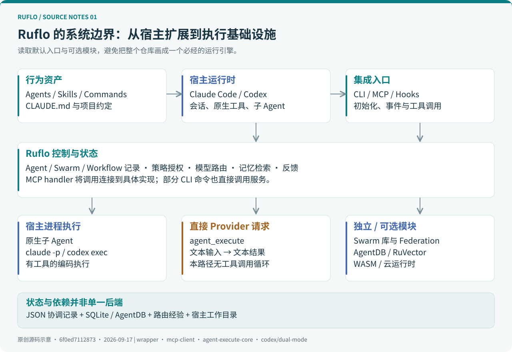
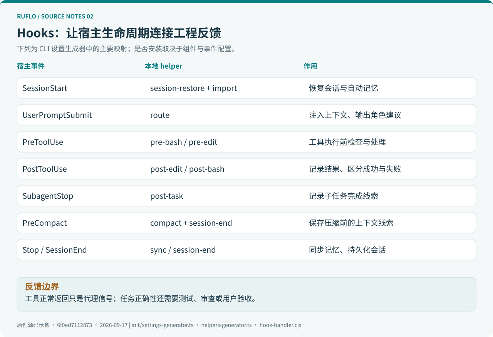
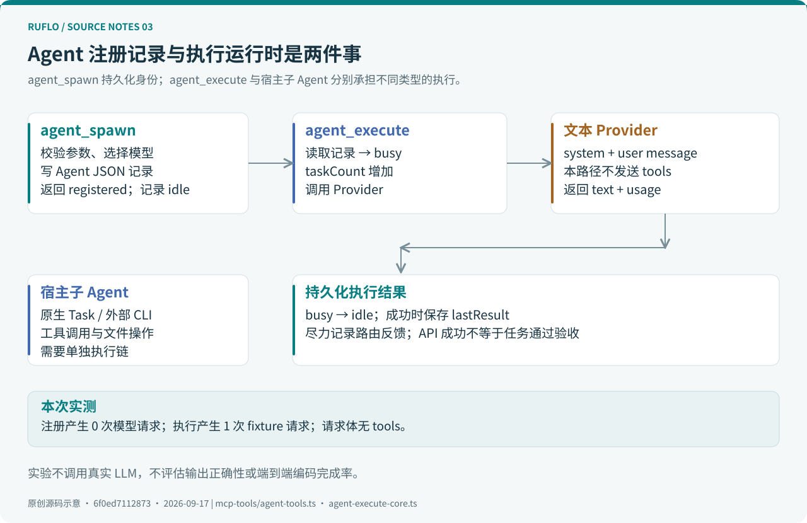
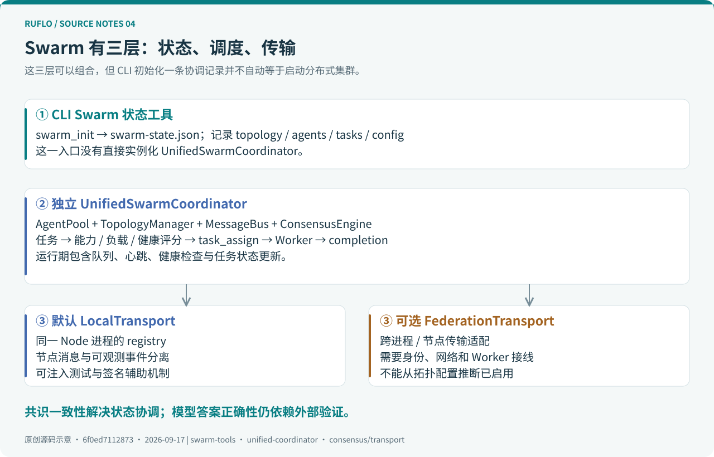
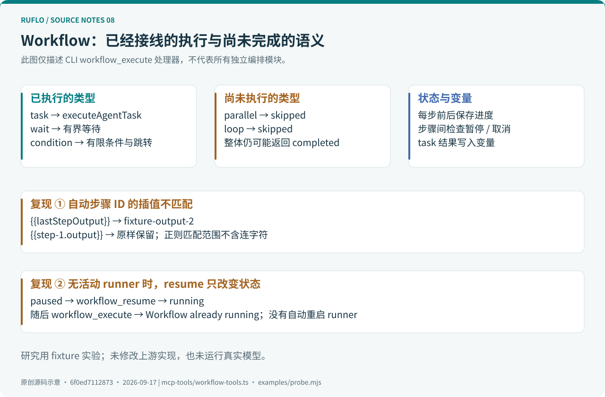
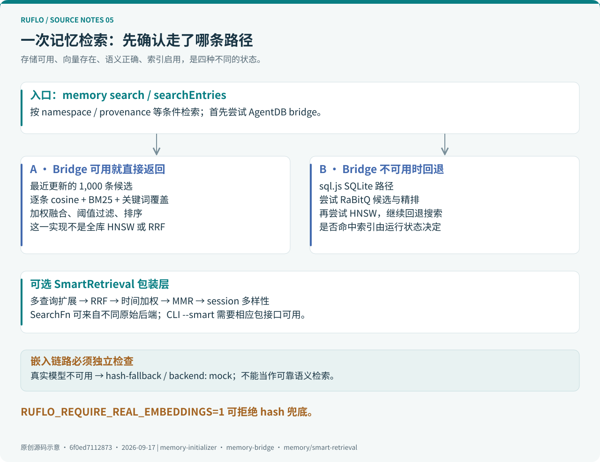
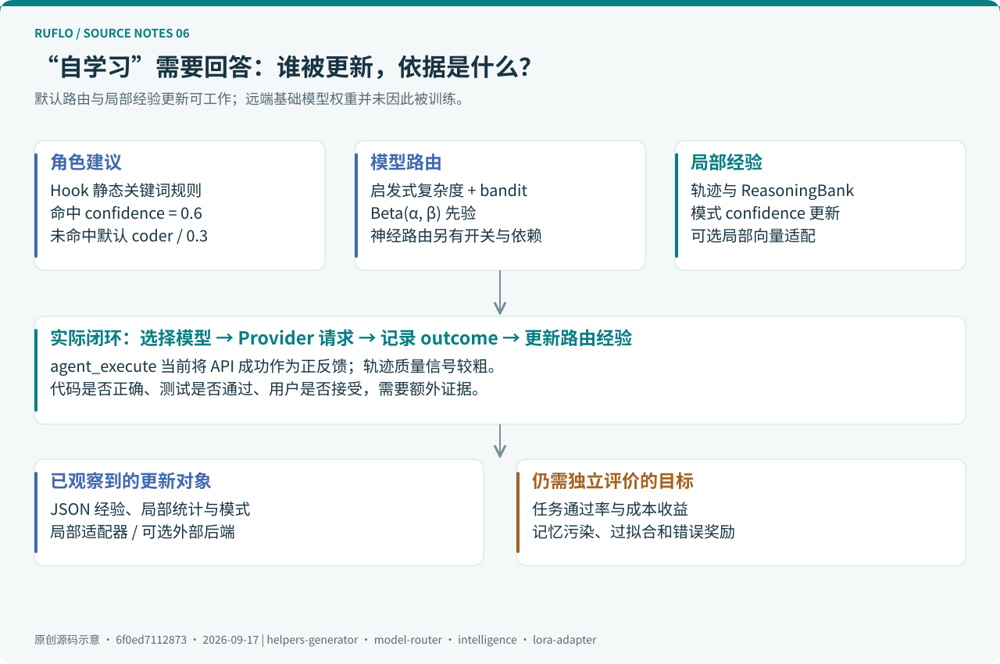
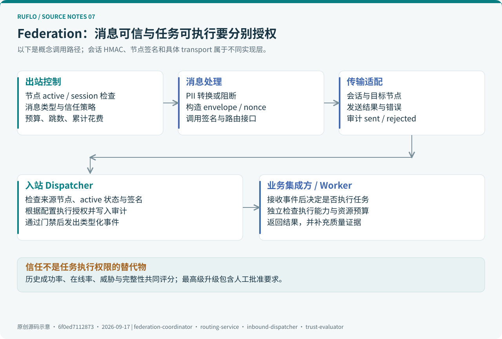

# Ruflo 源码深度解读：从 Agent 编排、记忆检索到自学习的真实执行链

> 调研日期：2026-09-17，Asia/Shanghai。源码锁定 [`6f0ed7112873`](https://github.com/ruvnet/ruflo/tree/6f0ed7112873eedc7cfe17281a2585188190b790)，提交时间为 2026-09-16 16:36:46 UTC。根包、Ruflo 包与 CLI 包均为 `3.42.0`。本文的实现结论针对这个提交，不将浮动的 `latest` 或 npm 发布产物视为同一个对象。
>
> 方法：阅读入口与调用链，交叉核对生成器、处理器和测试，运行 7 组源码实验及 4 组上游检查。模型响应使用明确标识的固定数据；没有调用真实大模型、启动跨机器集群或测量生产性能。架构图均为本次调研原创。



Ruflo 最有价值的地方，是把 Coding Agent 周围零散的角色定义、任务协调、记忆检索和反馈机制整理成可安装的工程系统。理解它的关键，是沿着“**谁发起调用、谁实际执行、状态存在哪里、结果怎样得到验证**”这四个问题读代码。

从这个角度看，它既有成熟的配置与集成代码，也有多个独立演化的执行模块。一个模块存在于仓库、一个工具被 MCP 列出、一次任务真正执行成功，是三个不同层次的证据。

配套阅读：[离线网页版](index.html) · [源码实验](examples/README.md) · [验证记录](research/verification.md) · [52 个源码入口](research/sources.md) · [版本与统计](research/snapshot.json)。

## 阅读导航

| 你关心的问题 | 章节 |
| --- | --- |
| 它处于 Agent 系统的哪一层？ | [1. 定位](#position)、[2. 源码地图](#map) |
| 安装后到底增加了什么？ | [3. 初始化](#init)、[4. Hooks](#hooks) |
| MCP 如何把模型决策接到业务代码？ | [5. 工具调度](#mcp) |
| Agent 是否真的启动、如何运行？ | [6. 执行链](#execution)、[7. Swarm](#swarm)、[8. Workflow](#workflow) |
| 记忆与自学习如何实现？ | [9. 检索](#memory)、[10. 路由与学习](#learning) |
| 分布式、宿主适配与权限边界是什么？ | [11. Federation](#federation)、[12. Codex 与其他运行时](#hosts)、[13. 安全](#security) |
| 怎样复现、评估、借鉴？ | [14. 实验](#experiments)、[15. 实践](#practice)、[16. 工程判断](#judgment) |

<a id="position"></a>
## 1. 定位：一个围绕 Coding Agent 的 meta-harness

项目由 Claude Flow 更名而来，仓库名是 `ruflo`，但根 npm 包仍叫 `claude-flow`，内部包继续采用 `@claude-flow/*`。因此，在文件、环境变量和工具命名中看到 Claude Flow，并不代表找错了仓库。[根包定义][package] · [Ruflo 包定义][ruflo-package]

所谓 **harness**，可以理解为模型工作的运行支架：给它工具、上下文、反馈、权限边界和停止条件。Ruflo 的常见接入方式是在 Claude Code 等既有宿主外再加一层能力，因此称为 **meta-harness** 比“一个新的大模型”更准确。[项目定位][readme]

专业工程视角下，可以把它拆成四层：

| 层次 | 主要内容 | 直接作用 |
| --- | --- | --- |
| 行为资产 | Agent Markdown、Skills、Commands、`CLAUDE.md` | 向宿主描述角色、工作方法和任务约定 |
| 宿主集成 | 初始化器、Hooks、MCP 配置、Codex 适配 | 把能力安装到工作目录和事件生命周期 |
| 控制与状态 | Agent/Swarm/Workflow 记录、路由、记忆、策略与审计 | 管理跨调用状态、资源选择与可追溯性 |
| 执行基础设施 | 宿主子 Agent、Provider 请求、外部 CLI 进程、可选 WASM/云运行时 | 真正进行推理、读写文件或执行工具 |

这四层并不总是经过同一个中心引擎。通过宿主子 Agent 编码，与调用 `agent_execute` 获取一段文本，走的是不同的执行链。后文也会区分“CLI 中的 Swarm 状态工具”与“独立 Swarm 协调库”。

### 1.1 技术栈与版本需要分开读

主控制代码是 TypeScript/Node.js。原生计算、向量库、嵌入与某些运行时来自可选 npm 依赖及 Rust/WASM 组件。根 `Cargo.toml` 本身也说明仓库以 TypeScript 为主，其 workspace 包含 Federation peer 和 AGNTCY 相关 Rust crate。[Rust workspace][cargo] · [CLI 依赖][cli-package]

主包 `3.42.0` 与内部 `3.0.0-alpha.*` 包同时存在。例如 Swarm 为 `3.0.0-alpha.7`，Memory 为 `3.0.0-alpha.23`，Federation 插件为 `1.0.0-alpha.18`。主版本号不能替代对子系统接口稳定性和部署行为的检查。

<a id="map"></a>
## 2. 源码地图：从可执行入口往下追

```text
ruflo/
├── bin/cli.js                       claude-flow 根命令的转发入口
├── ruflo/bin/ruflo.js                Ruflo 品牌入口，定位并调用 CLI
├── .claude/                         仓库自身使用的角色、技能与 helpers
├── plugins/                         Claude Code 插件目录
├── v3/@claude-flow/
│   ├── cli/
│   │   ├── bin/cli.js               CLI / stdio MCP 分流
│   │   ├── .claude/                 随 CLI 携带的配置资产
│   │   └── src/
│   │       ├── init/                配置生成、资产复制、升级
│   │       ├── mcp-client.ts        本地工具注册与调度
│   │       ├── mcp-tools/           agent / swarm / workflow / memory 等
│   │       ├── memory/              数据库、桥接、嵌入与检索
│   │       ├── ruvector/            模型路由、适配器与原生组件桥接
│   │       └── services/            策略运行时等应用服务
│   ├── cli-core/                    工具类型、项目路径和输入校验
│   ├── mcp/                         通用 MCP 服务、注册器与传输
│   ├── swarm/                       协调器、拓扑、消息总线、共识
│   ├── memory/                      ControllerRegistry、存储与 SmartRetrieval
│   ├── neural/                      SONA、轨迹与学习算法模块
│   ├── security/                    策略、能力授权与输出防护
│   ├── codex/                       配置生成、双宿主执行和循环运行
│   └── plugin-agent-federation/     发现、身份、路由、信任与入站分发
└── scripts/ tests/                  构建、回归检查与研究性验证
```

在固定提交上，本地统计得到 24 个 `v3/@claude-flow/*/package.json`、378 个 CLI `src/**/*.ts` 文件，以及 42 个 `plugins/*/.claude-plugin/plugin.json`。顶层 `.claude/agents/**/*.md` 为 108 个，CLI 内置副本为 89 个；这些是**目录文件数**，包含说明材料，也不等于安装后实际加载的角色数。两份目录不能相加后宣称支持了更多 Agent。[统计口径](research/snapshot.json)

推荐的阅读顺序是：

1. `ruflo/bin/ruflo.js`：理解包解析、品牌入口与版本快速返回。
2. `cli/bin/cli.js`：确认当前调用走普通命令还是 stdio MCP。
3. `mcp-client.ts`：找到工具名字对应的处理器及策略入口。
4. 对应 `mcp-tools/*.ts`：检查状态变化、外部调用与实际返回值。
5. 向下追数据库、Provider、进程与传输，最后用测试验证边界。

这比从 README 中挑最复杂的术语开始，更容易建立可靠的实现模型。

<a id="init"></a>
## 3. `init`：把一套工程约定安装进项目

Ruflo 包的 `ruflo/bin/ruflo.js` 先向父目录查找 `node_modules/@claude-flow/cli`；在源码目录下可以回退到相邻的 `v3/@claude-flow/cli`。普通命令加载编译后的 CLI，MCP 模式转交 CLI 的 `bin/cli.js`。[入口实现][wrapper]

这里存在一个复现细节：Ruflo 包对 `@claude-flow/cli` 使用 semver 范围依赖。即使安装时写了一个固定的 Ruflo 版本，也应检查最终解析出的 CLI 和传递依赖，并保留锁文件。本文锁定的是 Git 提交，而不是声称 `npx ruflo@3.42.0` 在所有日期都解析成同一棵依赖树。[依赖范围][ruflo-package]

`executeInit()` 根据组件选项依次完成以下工作：[初始化执行器][init]

| 初始化对象 | 产物与作用 |
| --- | --- |
| 目录 | `.claude/` 与 `.claude-flow/` 下的配置、状态和日志目录 |
| 宿主设置 | `.claude/settings.json`，注册 Hooks 等配置 |
| MCP | `.mcp.json`，描述服务器启动命令和运行参数 |
| 行为资产 | 复制 Skills、Commands、Agents，生成 `CLAUDE.md` |
| 辅助脚本 | 本地 Node helpers，避免每次事件都启动一整套 `npx` 命令 |
| 运行配置 | 拓扑、Agent 数量、记忆后端等参数 |
| 记忆初始化 | 默认持久化配置下尝试创建 `.swarm/memory.db`；已有库尝试修复必要结构 |
| 可见性 | 状态栏及其初始指标文件 |

记忆初始化是 best-effort：失败不会必然使整个 `init` 失败。因此“初始化完成”不能单独证明数据库已经正常写入。需要继续执行存储、检索和后端状态检查。

### 3.1 插件安装与完整 CLI 初始化的覆盖面不同

原生 Claude Code 插件可以提供命令、技能和角色；`ruflo-core` 还声明了自己的 MCP 服务。完整 `init` 则生成项目设置、helpers、MCP 配置等，覆盖更完整的生命周期。[插件 MCP 声明][plugin-mcp] · [初始化执行器][init]

CLI 生成器有意保留 MCP 注册键 `claude-flow`，实际执行程序使用 `ruflo@latest`；`ruflo-core` 插件内的注册键是 `ruflo`。因此，宿主展示的工具命名空间随接入方式变化，不能把某一条文档里的全限定工具名机械地复制到另一种安装方式。[MCP 生成器][mcp-config]

<a id="hooks"></a>
## 4. Hooks：连接每次会话、提示词和工具结果



`settings-generator.ts` 将宿主事件映射为本地脚本命令。下面是生成器中的核心映射，而非假设所有插件安装都会自动获得这些 Hook：[事件注册][settings]

| 宿主事件 | 主要脚本动作 | 工程目的 |
| --- | --- | --- |
| `SessionStart` | `session-restore`、auto-memory `import` | 恢复会话，导入记忆 |
| `UserPromptSubmit` | `route` | 输出角色建议与相关上下文 |
| `PreToolUse`：Bash | `pre-bash` | 检查命令输入 |
| `PreToolUse`：Write/Edit/MultiEdit | `pre-edit` | 编辑前处理 |
| `PostToolUse` | `post-edit`、`post-bash` | 记录执行结果和指标 |
| `SubagentStart` / `SubagentStop` | `status` / `post-task` | 更新子任务相关状态 |
| `PreCompact` | compact 处理与 `session-end` | 在压缩前保存上下文线索 |
| `Stop` / `SessionEnd` | auto-memory `sync` / `session-end` | 同步记忆和会话记录 |

### 4.1 路由建议与确定性调度不同

生成的 `agent-router.cjs` 是一个静态关键词表：按规则顺序匹配，命中返回角色及固定 `0.6`，未命中回退到 coder 和 `0.3`。例如 `write a unit test` 返回 tester。它不是学习分类器，`0.6` 也不是经过校准的正确概率。[生成器][helpers] · [实验结果](research/probe-results.json)

Hook 输出建议后，宿主模型仍需要使用它。**写出推荐角色，不等于已经创建并运行这个角色。** 这也不同于后文在 `agent_spawn` 中使用的模型路由器。

### 4.2 反馈记录需要区分成功与失败

仓库 Hook 会检查 `tool_response`、`toolResponse` 或 `result` 中的错误标记与退出码，再调用 `recordEdit(file, success)` 等记录函数。这个设计的关键是：失败不能因为经过了 `PostToolUse` 就被写成成功经验。[Hook 处理器][hook]

这些判断仍是代理信号。例如工具正常退出，不能证明生成代码符合需求；一次异常也可能只是基础设施临时故障。更有价值的反馈是测试通过、审查通过或用户接受结果，应该作为单独字段记录。

### 4.3 生成器、内置副本与仓库自用副本需要区分

Ruflo 同时维护 helpers 生成器、CLI 内置 `.claude` 文件和顶层自用 `.claude` 文件。它们承担的部署角色不同，功能细节也可能不同。例如顶层 `intelligence.cjs` 的上下文评分混合 token trigram 的 Jaccard 相似度与 PageRank，取前 5 条，并跟踪被命中的模式；不能仅凭这个文件就认定每个新安装项目都执行完全相同的算法。[仓库自用记忆上下文][dogfood-intelligence]

这是扩展型 Agent 系统常见的维护难点：**真正的安装产物应该成为回归测试对象。** 上游的路由测试会读取生成器，命令检查测试则覆盖两个 handler 副本，本次均已运行。

<a id="mcp"></a>
## 5. MCP：工具描述如何连接到实际处理器

Ruflo 的 MCP 层让宿主能够调用记忆、任务、Agent 和协调能力。读取这部分代码时，需要区分两条入口。

### 5.1 常用 stdio 快速入口

当标准输入为管道，且参数为空或为 `mcp start`，`cli/bin/cli.js` 可以进入 stdio MCP 分支；显式指定非 stdio transport 时会交给普通解析路径。该分支读取换行分隔的 JSON，处理 `initialize`、`tools/list`、`tools/call` 和 `ping`，再调用 `mcp-client.ts`。[stdio 实现][mcp-entry]

调用链可以缩写为：

```text
宿主模型选择工具
  → 宿主发送 tools/call
  → cli/bin/cli.js 解析 JSON-RPC
  → callMCPTool(name, arguments, context)
  → authorizeMcpTool(...) 策略决策
  → 对应 tool.handler(...)
  → 可选工具结果防护
  → JSON 文本形式的 MCP 结果
```

`mcp-client.ts` 维护一个 `Map<string, MCPTool>`。工具对象包括名字、描述、`inputSchema` 和 `handler`。这个文件虽然叫 client，但它的核心行为是**进程内直接调用处理器**，并不意味着每次 CLI 调用都要经过一次网络请求。[工具调度][mcp-client]

### 5.2 通用 MCP 包是另一个实现层

`@claude-flow/mcp` 提供独立的服务器、transport、连接/会话管理和 `ToolRegistry`。它的注册器有 schema 验证、分类与标签索引、执行统计及授权接口。不能把这些属性全部直接套到上面那个手写 stdio 分支；应检查当前入口究竟调用了哪个注册器。[通用注册器][tool-registry] · [CLI MCP Server][mcp-server]

同理，工具公布了 JSON Schema，不等于所有路径都统一执行完整的 schema 校验。常见业务处理器还会调用 `validateIdentifier`、`validateText`、`validateAgentSpawn` 等函数。审查一个工具的输入边界，应跟到它实际经过的验证函数。[输入验证][validation]

### 5.3 工具目录、授权和业务成功是三个维度

`CLAUDE_FLOW_MCP_TOOLS` 或 `--tools` 可以筛选向宿主公布的工具，减少工具说明占用的上下文。该快速入口的 `tools/call` 仍检查全局注册表中的名字，因此**展示过滤不应作为权限隔离机制**。真正的限制应该放在策略授权和执行器能力边界上。[展示过滤与调用分支][mcp-entry]

还有一个容易漏掉的细节：处理器返回 `{ success: false }` 之类的普通对象时，stdio 分支仍可能把它作为正常 MCP text content 返回；只有抛异常才进入该分支的错误处理。调用方必须解析业务结果，不能只看 JSON-RPC 是否成功。

从工程设计上看，一个完整的工具结果最好明确区分：协议失败、参数拒绝、权限拒绝、基础设施失败、业务执行失败，以及执行成功但尚未验证。

<a id="execution"></a>
## 6. Agent 生命周期：从注册记录到真实执行



### 6.1 `agent_spawn` 做了什么？

当前处理器主要执行以下步骤：[Agent 工具][agent-tools]

1. 验证 `agentType` 等输入。
2. 决定模型层级及可选的具体模型 ID、Provider。
3. 在 `.claude-flow/agents/store.json` 写入 Agent 记录。
4. 将 Agent ID 加入指定 Swarm；未指定时尝试最近创建的 Swarm。
5. 尝试更新图节点；按需创建可选的 COW 记忆分支。
6. 返回 `status: "registered"`。

持久化记录中的状态最初是 `idle`，`taskCount` 为 0。返回说明也明确提示：之后可以调用 `agent_execute`，或使用宿主 Task 子 Agent，或启动 `claude -p`。[源码实验](research/probe-results.json)

这里的“Agent”首先是一条可追踪的角色与配置记录。它具有跨调用身份，但注册时没有必然创建一个操作系统进程，也没有必然消耗模型 token。

### 6.2 `agent_execute`：当前主路径是一次文本请求

`executeAgentTask()` 读取 Agent 记录，拒绝不存在或已终止的 Agent，决定模型与系统提示词，然后将状态写为 `busy`、增加 `taskCount`，再调用 Provider。[执行核心][agent-execute]

关键逻辑可概括为以下**解释性伪代码**：

```typescript
const agent = loadRecord(agentId);
agent.status = 'busy';
agent.taskCount += 1;
persist(agent);

const result = await callProvider({ model, systemPrompt, prompt });
// 某些条件下尝试有界的备用模型；记录反馈。

agent.status = 'idle';
if (result.success) agent.lastResult = result;
persist(agent);
return result;
```

Provider 分流函数沿用了 `callAnthropicMessages` 这个名字，但已包含 Anthropic、OpenRouter 和 Ollama/OpenAI-compatible 路径。其选择依赖 Agent/provider 参数、环境变量、凭据和部分持久化配置；实际优先级要以分支条件为准，不应只依据函数名或旧工具描述。[Provider 请求代码][provider-call]

对直接 Anthropic 路径，本次读取到的请求体包含 system 和一条 user message，**没有传入 tools，也没有围绕 `tool_use` 进行反复调用的执行循环**。结果会提取 text blocks，带回 token 使用量等信息。固定响应实验确认：调用一次该路径产生一次请求，Agent 最终回到 idle，`taskCount` 变为 1。

因此，把它用于分析、摘要、判断或工作流中的文本步骤是合理的；期望它仅凭一个“修改仓库”的 prompt 就像 Claude Code 一样读文件、编辑、执行测试，需要额外的工具执行运行时。

### 6.3 有生命周期状态，不等于有强并发保证

核心 Agent 存储使用 JSON 文件读写。执行前读取整个 store，调用模型之后再次保存。由这个结构可以推断：多个进程同时修改不同 Agent，也可能遇到旧快照覆盖、最后写入者覆盖等问题。本文没有进行并发压测，因此将其列为**代码结构推导出的验收风险**，不声称已复现数据丢失。[状态读写][agent-execute]

此外，`taskCount` 在调用前增加，失败尝试也会计数；它更接近调用尝试数，而非已通过验收的任务数。监控系统应该另外统计成功、失败、取消和验证通过。

<a id="swarm"></a>
## 7. Swarm：状态控制、调度引擎与共识传输



### 7.1 CLI Swarm 工具先管理协调状态

`swarm_init` 在 `.claude-flow/swarm/swarm-state.json` 写入拓扑、最大 Agent 数、Agent/Task ID 列表和运行状态；处理器支持配置校验，文件存储还有锁文件与临时文件替换等逻辑。[Swarm 工具][swarm-tools]

这条 `swarm_init` 路径没有直接实例化 `UnifiedSwarmCoordinator`。将 `consensusMechanism` 存入配置，也不能单独证明已经启动了多个 Raft 节点。它首先提供的是一个可被后续工具共享的协调记录。

### 7.2 独立 `UnifiedSwarmCoordinator` 才承担运行中的调度

`@claude-flow/swarm` 内的协调器维护 Agent、任务、AgentPool、领域队列、拓扑、MessageBus 和 ConsensusEngine；初始化后启动心跳与健康检查等后台过程。[协调器][coordinator]

对一项任务，`assignTask()` 找出可用 Agent，根据类型、负载、健康和历史指标打分；没有可用 Agent 就进入队列。打分逻辑可以写成：

```text
score = (100 + 类型匹配奖励 - 20 × workload) × health
        + 10 × successRate
        - 5 × (averageExecutionTime / 60000)
```

其中类型匹配奖励为 50。选中 Agent 后，系统标记任务为 assigned、Agent 为 busy，并通过消息总线发送 `task_assign`，要求确认并设置 TTL。[任务分配][assignment]

这是一套调度机制。真正完成任务还需要 Worker 消费消息并返回结果。**消息总线发出任务，是执行的开始条件；并非任务已经完成的证据。**

### 7.3 Queen 的任务拆分包含确定性模板

`QueenCoordinator.analyzeTask()` 会拆任务、推断能力、估计复杂度与资源，再检索匹配模式。它的 `decomposeTask()` 按任务类型选择模板：例如复杂 coding 任务拆为设计、实现、测试三个阶段；短描述或特定类型则视为简单任务。[Queen 分析与拆分][queen]

因此 Queen 并非在所有场景下都让一个更强 LLM 自由生成计划。固定模板的优点是可预测、可测试，缺点是对真实仓库约束、非线性依赖和异常恢复的表达能力有限。工程上可以保留确定性骨架，再让模型填写有限的结构化参数。

### 7.4 共识协议解决的是协调一致性

仓库包含 Raft、Byzantine 和 Gossip 实现，并引入 `ConsensusTransport`，将节点间消息与本地可观测事件分开。默认 `LocalTransport` 在同一个 Node 进程的 registry 中传递消息；跨进程路径由单独的 Federation transport 承担。[共识传输接口][transport] · [Federation transport][federation-transport]

这一拆分允许在不改协议逻辑的情况下换传输层，也便于注入丢包、超时、重放等故障。本文实验只验证了签名辅助函数：原消息验签成功，修改 payload 后验签失败。

需要注意：即使分布式状态达成一致，也不能证明模型生成的答案是正确的。若多个 Agent 共享相同上下文与偏差，多数投票可能只是重复同一种错误。代码任务仍需要测试、静态检查、约束验证或人工审查作为外部判据。

<a id="workflow"></a>
## 8. Workflow：顺序执行已接线，部分类型仍有边界



`workflow_create` 将工作流及步骤写入 `.claude-flow/workflows/store.json`。`workflow_execute` 按顺序遍历步骤，每步前后保存状态，并在步骤之间读取外部 pause/cancel 信号。[Workflow 实现][workflow]

| 步骤类型 | 当前 `workflow_execute` 的行为 |
| --- | --- |
| `task` | 调用 `executeAgentTask`，将文本结果存入变量 |
| `wait` | 等待指定毫秒数，上限 60,000 ms |
| `condition` | 解析有限的相等条件，并按配置跳到目标步骤 |
| `parallel` | 标记 skipped，记录未实现说明 |
| `loop` | 标记 skipped，记录未实现说明 |

它有真实的步骤执行与持久化，不应简单称为“全是假实现”；但也不应从工具描述里的 DAG、retry、resume 字样，推断已经具备通用的持久化 DAG 调度器。

### 8.1 实验发现：自动 step ID 与插值规则不一致

创建器生成 `step-1`、`step-2` 这样的 ID。执行器替换模板时使用的 key 匹配范围包含字母、数字、下划线和点，却不包含连字符。结果是：

```text
输入模板：Seen={{lastStepOutput}}; direct={{step-1.output}}
实验结果：Seen=fixture-output-2; direct={{step-1.output}}
```

这说明上一项输出确实产生并可通过 `lastStepOutput` 获取，但带自动 step ID 的写法会保持原样。实践中不能只阅读变量引用的注释，应该对实际模板做一次小型集成检查。[固定响应实验](research/probe-results.json)

### 8.2 实验发现：resume 状态不等于重新调度

`workflow_resume` 将 paused 改为 running，并返回剩余步骤信息；它没有启动 runner。若旧 runner 已不存在，随后直接调用 `workflow_execute` 又会得到 `Workflow already running`。[恢复处理器][workflow-resume]

本次通过构造持久化 paused 状态，调用这两个真实处理器复现了这一行为。实验没有覆盖一个仍活着的执行器在步骤之间观察恢复状态的情形，因此结论限于“单独调用恢复接口不能保证重启执行”。

更完整的实现需要把**状态跃迁、执行器所有权、租约、checkpoint 和幂等重试**作为同一份契约设计。任务有外部副作用时，还要考虑“副作用已发生，但完成状态尚未落盘”的窗口。

<a id="memory"></a>
## 9. 记忆系统：先区分存储、嵌入、索引与检索策略



Agent 记忆至少包含四件不同的事：保存原文与元数据，将文本编码成向量，建立候选索引，以及为当前任务选择合适的信息。Ruflo 的实现覆盖了这些层次，但不同入口和后端的路径并不相同。

### 9.1 一个“记忆系统”背后有多种状态文件

| 状态 | 典型位置 | 内容 |
| --- | --- | --- |
| CLI 通用记忆 | `.swarm/memory.db` | key、namespace、content、embedding、状态和来源类型等 |
| AgentDB 原生桥接库 | 同目录 `agentdb-memory.db` | ControllerRegistry/AgentDB 使用的独立原生数据库 |
| Agent / Workflow / Swarm | `.claude-flow/` 下各自 JSON 文件 | 协调状态，不是统一向量库 |
| 模型路由经验 | `.swarm/model-router-state.json` | bandit 先验等路由状态 |
| Hook 上下文与经验 | helpers 对应的 JSON/JSONL 数据 | 会话线索、编辑反馈、排序模式 |

`memory-bridge.ts` 特意把 AgentDB 原生库与可能经过文件加密的 `memory.db` 分开。这个隔离解决的是后端格式和访问路径问题，并不能推断两个库的所有内容自动获得同样的加密保护。[桥接实现][memory-bridge]

因此，备份与迁移应先列清楚实际启用的后端、数据库和辅助文件。只复制一个名字里带 memory 的文件，可能遗漏 Agent 身份、工作流进度和学习状态。

### 9.2 存储：优先 bridge，兼容 sql.js

`memory-initializer.ts` 对外提供初始化、增删查改和嵌入等函数。它尝试使用 AgentDB bridge，必要时回到 sql.js 的 SQLite WASM 路径。若 sql.js 也不可用，初始化逻辑甚至可能只写 schema 文件用于后续初始化。[数据库初始化][memory-init]

原生 SQLite 与 sql.js 的持久化语义不同。后者的整库导出写回不能假设看见原生连接尚在 WAL 中的数据，所以实现中有针对 `-wal` / `-shm` 的保护，拒绝某些不安全的覆盖写入。这属于重要的数据库正确性处理，而不是单纯的“兼容更多平台”。

### 9.3 嵌入：必须观察真实后端

本地嵌入路径尝试可用模型，失败后可能产生确定性的 hash 向量，返回 `backend: "mock"`、`model: "hash-fallback"`。这样的向量可供演示和测试使用，但不能被当作可靠的自然语言语义编码。[嵌入实现][embedding]

`RUFLO_REQUIRE_REAL_EMBEDDINGS=1` 可以把 hash 兜底改为硬错误。生产语义检索应观察实际返回的 backend、维度与模型来源，并在更换 embedding 模型时明确重建策略。[嵌入策略][embedding-policy]

一个关键工程经验是：**“数据库里有向量”与“向量具有所需语义”是两种不同的健康状态。** 索引存在、查询有分数、延迟很低，都不能弥补错误的编码器。

### 9.4 标准搜索的第一条路并不是全库 HNSW

`searchEntries()` 首先调用 `bridgeSearchEntries()`，成功就直接返回。当前 bridge 中的查询流程是：[标准入口][memory-search] · [Bridge 搜索][memory-bridge]

1. 按 namespace、来源类型与 active 状态过滤。
2. `ORDER BY updated_at DESC LIMIT 1000`，先获取最近 1,000 条候选。
3. 尝试生成查询向量，对候选逐条计算 cosine。
4. 计算 BM25，并加入关键词覆盖率作为词法评分下限。
5. 混合评分、阈值过滤、排序返回。

具体融合近似为：

```text
lexical = max(min(BM25 / 10, 1), query_term_coverage)
blended = 0.6 × max(0, cosine) + 0.4 × lexical
score   = max(blended, cosine)
```

这是加权与取最大值的融合，**不是 RRF**。代码附近还保留了 RRF 相关注释，本文以实际公式为准。

这条路径的成本近似随候选数和向量维度增长。预先限制 1,000 条带来可控的计算规模，但也意味着更老的高相关记忆可能进不了候选集。它更适合较小或强调近期状态的语料；长期知识检索需要实测覆盖范围，不能仅依据项目支持 HNSW 就忽略这个窗口。

### 9.5 回退搜索与 SmartRetrieval 是不同的层

bridge 无法服务时，sql.js 路径会尝试 RaBitQ 候选与精排，再尝试 HNSW，最后继续回退检索。具体是否命中快速路径，依赖组件可用性、索引状态、阈值和来源过滤。[回退链][memory-search]

另一套 `@claude-flow/memory` 的 `SmartRetrieval` 是包装原始 `SearchFn` 的后处理流水线：[SmartRetrieval][smart]

```text
模板式查询扩展（不调用 LLM）
  → 多查询召回
  → RRF 融合
  → 时间新近性加权
  → MMR 多样性重排
  → 按 session 轮转，增加跨会话覆盖
```

RRF 把多份排名合成 `Σ 1 / (k + rank)`，默认 k 为 60；MMR 平衡相关性与重复性，默认 λ 为 0.7，有向量时用 cosine，否则可以使用 token Jaccard 近似。CLI 的 `memory search --smart` 需要安装的 Memory 包暴露对应接口；不可用时会提示并回退。[CLI 接线][memory-command]

### 9.6 中文任务要单独评估分词

独立 `hybrid-retrieval.ts` 的 tokenizer 只保留 ASCII 字母、数字与少数符号。源码实验中，`tokenize("修复登录认证错误")` 返回空数组。[混合检索辅助函数][hybrid] · [实验结果](research/probe-results.json)

这个结论针对该函数，不能泛化成“Ruflo 所有中文搜索失效”：bridge 使用另一套分词方式，稠密嵌入也是独立信号。但它足以说明，多语言场景应分别评估词法与语义通道，加入中文、混合语言、代码标识符、错误码等样本。

<a id="learning"></a>
## 10. 模型路由与自学习：更新的究竟是什么？



“自学习”最容易让读者误以为系统在持续微调所调用的大模型。Ruflo 的实现需要拆成几种不同机制。

### 10.1 角色路由、模型路由、语义路由各有职责

前面介绍的 Hook 关键词路由决定“建议哪个角色”。`ruvector/model-router.ts` 则决定模型层级，默认组合词法复杂度等启发式与 Thompson sampling 的 Beta-Bernoulli bandit。[模型路由][router]

它按复杂度分桶，为模型层级维护 `Beta(α, β)` 先验。简化理解是：成功增加 α，失败增加 β；采样用于在探索与利用之间取得平衡。还包括不确定性、升级和故障相关逻辑。

可选神经路由不是默认总会执行。源码说明它受到 `CLAUDE_FLOW_ROUTER_NEURAL=1`、任务 embedding 和可加载 corpus/artifact 等条件约束，后端还可能依赖 MetaHarness 等外部包。使用者应记录返回的 `routedBy`，才能知道运行的是启发式、回退还是某个可选后端。

### 10.2 执行反馈已经接线，但质量信号较粗

`executeAgentTask()` 会在结果返回后尝试调用 `recordModelOutcome()`，更新模型路由经验。该路径当前把“API 成功返回”视为 success；相关轨迹可以将 quality 写为 1 或 0。[反馈接线][agent-execute]

这可以帮助系统学习可用性，却不能直接等价为任务质量。例如一个模型稳定返回错误答案，仍可能在这个反馈层得到正信号。

对于真实代码任务，建议把反馈拆为：

| 信号 | 回答的问题 |
| --- | --- |
| API 成功 | 请求与基础设施是否工作？ |
| 工具成功 | 操作是否执行，退出码是否正常？ |
| 验证成功 | 测试、类型检查、业务断言是否通过？ |
| 结果接受 | 审查者或用户是否接受交付？ |
| 资源成本 | 为这个结果花了多少 token、时间和重试？ |

再依据任务选择 reward。避免让模型通过低质量短答案获取“便宜且成功”的错误奖励。

### 10.3 SONA/ReasoningBank：局部轨迹与模式更新

CLI 的 `LocalSonaCoordinator` 使用环形缓冲记录信号，并保存轨迹。`endTrajectory()` 根据 verdict 映射 reward：success 为 1、partial 为 0.5、failure 为 -0.5；检索相似模式后，以 reward 的一部分调整 confidence，并裁剪到 0～1。[本地 Intelligence][intelligence]

这是一种外部经验与选择偏好的更新。它可以影响以后检索哪些经验、对模式有多大信心，但不能据此说 Anthropic 或其他远端 Provider 的基础模型参数被改写了。

仓库也有 LoRA 形式的矩阵适配代码，默认输入和输出维度为 384，权重保存到 `.swarm/lora-weights.json`。它处理的是局部向量适配等对象；矩阵公式 `W' = W + BA` 的存在，不意味着已拥有远端闭源 LLM 的权重或训练权限。[局部 LoRA 实现][lora]

### 10.4 评价自学习，应测最终任务而非单次内部操作

代码注释中出现的亚毫秒目标可能对应环形缓冲写入、局部评分或小向量运算，不能推广成一次 Agent 任务的学习成本或端到端响应时间。

有意义的验证应固定任务集与预算，对比关闭/开启记忆、关闭/开启路由学习后的任务通过率、错误复发率、成本和延迟，同时将训练轨迹与测试任务隔离。本文没有执行此类质量或性能基准，也不将项目宣传中的加速倍数作为实测结论。

<a id="federation"></a>
## 11. Federation：跨节点协作需要身份、预算与授权



`@claude-flow/plugin-agent-federation` 将 FederationNode、Session、Envelope、TrustLevel 建模为独立对象。应用层协调器连接发现、握手、路由、审计、PII、信任评估与可选断路器。[Federation 协调器][federation]

### 11.1 出站链路

`sendMessage()` 先检查节点是否被暂停/驱逐，再找有效会话，按消息类型、信任级别和大小执行策略，并检查预算、跳数和累计花费；通过后交给 `routing.send()`。[出站控制][federation]

RoutingService 对 payload 进行 PII 处理，可以按策略阻止发送；随后构造 envelope，并调用注入的签名和 transport 接口。这里的签名、会话与握手有不同层次：RoutingService 中有会话 token 相关的 HMAC 抽象，其他 transport/入站层包含 Ed25519 验证，不能把它们写成一条完全相同的密码协议。[消息路由][federation-route]

### 11.2 入站只在通过门禁后交给业务

`inbound-dispatcher.ts` 检查来源节点、节点状态、签名及授权等，再向 event bus 发出类型化事件。它明确不直接执行收到的 task；执行属于集成方的职责。[入站分发][inbound]

这是合理的隔离点：一个远程消息能通过真实性验证，并不代表它有权限执行本机命令。后续执行器仍要检查任务权限、沙箱与资源预算。

### 11.3 信任评分是策略输入

TrustEvaluator 的评分为：

```text
trust = 0.4 × successRate
      + 0.2 × uptime
      + 0.2 × (1 - threatPenalty)
      + 0.2 × dataIntegrityScore
```

结果限制在 0～1，升级还需满足交互历史等条件；最高权限级别的升级会标记需要人工批准，严重异常可触发即时降级。[信任评估][trust]

这一机制可以辅助动态授权，但分数本身不是安全证明。生产验收还需覆盖假冒节点、payload 篡改、重放、失效会话、预算耗尽、网络分区与节点重启。本文未进行这些多机实验，不能据源码存在就宣称系统已获得某种合规认证或生产级容错保证。

<a id="hosts"></a>
## 12. Codex、双宿主与其他运行时：执行边界不同

### 12.1 Codex 接入包含配置与真正的进程管理

CodexInitializer 生成 `AGENTS.md`、Skills 和相关配置。它还区分“能力目录里有名字”与“包里真正带了完整 Skill”，默认安装会过滤缺少 canonical 资产的条目。[Codex 初始化][codex-init]

独立的 DualModeOrchestrator 则会真正 spawn `claude -p` 或 `codex exec` 进程，管理 Worker 依赖、并发、输出和超时，并支持 worktree 隔离及写入者限制。这条路径具有真实子进程，与前面的 `agent_spawn` 注册行为不同。[双宿主执行][dual]

本文只据此说明 Ruflo 的适配实现，没有实测当前 Claude Code/Codex 客户端的兼容性。开发自己的适配层时，也应以安装的客户端版本测试命令参数和事件契约。

### 12.2 Loop 是外层反复调用

Codex Loop 维护状态文件、停止/完成标记、迭代次数与超时，每轮启动 `codex exec` 或配置的命令。它调用的是宿主运行时；一轮内部怎样进行模型与工具交互，仍由宿主管理。[Loop 实现][codex-loop]

这是典型的双层循环：外层决定任务是否继续，内层完成一次 Agent 工作。应同时定义两层的预算和停止条件，避免内层失败被外层无限重试。

### 12.3 WASM Agent 与 Managed Agent 是额外入口

`wasm_agent_*` 工具通过桥接模块使用可选的 `@ruvector/rvagent-wasm`，并包含允许暴露的 MCP 工具集合和破坏性工具筛选。另有 Managed Agent 工具负责云运行时集成。[WASM 工具][wasm] · [Managed Agent 工具][managed]

这些能力拓宽了执行选择，但不应倒推“默认 init 已经在 WASM 沙箱中运行所有 Agent”。本次没有安装、运行这些外部运行时，也没有验证其隔离强度。

<a id="security"></a>
## 13. 安全实现：检查开关、调用位置与失败方式

### 13.1 统一策略入口已经接入 MCP 调度

`callMCPTool()` 在运行 handler 前调用 `authorizeMcpTool()`，不允许的 `enforcedOutcome` 会阻止调用。Policy runtime 对状态写入采用锁、原子替换，并引入项目外的信任锚等机制，以检测部分策略状态篡改。[MCP 授权][mcp-client] · [Policy runtime][policy]

但策略引擎存在 `legacy`、`observe`、`enforce` 等模式，默认兼容状态为 legacy。配置里有拒绝规则，不代表所有模式都会执行拒绝。监控和验收必须同时记录策略的逻辑 decision 与实际 enforced outcome。[策略模式][policy-engine]

### 13.2 结果防护在该路径上是可选的

`mcp-client.ts` 的工具结果扫描受 `CLAUDE_FLOW_STRICT_GUARDRAIL=true` 控制。当前实现主要扫描结果对象第一层的字符串字段；加载失败时会返回原始结果。因此不能把该开关当成所有嵌套工具输出、附件和代码块都已被完整检查的保证。[结果边界实现][mcp-client]

对于 RAG 与外部工具，至少应将来源、信任等级和执行权限分开：低信任文本可以作为待分析数据，不应自动获得修改策略、运行命令或覆盖高信任记忆的权力。

### 13.3 Hook 命令检查是局部防线

当前 `pre-bash` 检查部分危险字符串，命中时输出 BLOCKED 并以非零状态退出。本次回归测试只验证脚本输入输出与退出码；**没有连接真实宿主验证阻止执行的完整协议行为**，更没有证明字符串检查能覆盖等价命令、间接执行和所有 shell 语法。[Hook 源码][hook] · [测试日志](research/logs/smoke-pre-bash-hook.mjs.txt)

安全边界应由最小权限的执行器、文件系统与网络隔离、明确授权和审计共同承担。提示词、角色名、工具目录过滤以及单个正则表达式，都不应被单独用作强隔离。

<a id="experiments"></a>
## 14. 可复现实验：验证了什么，没有验证什么

配套 [probe.mjs](examples/probe.mjs) 通过一个很小的 Node loader 直接加载固定提交中的 TypeScript。loader 只处理源码模块解析和类型转换，不替换 Ruflo 的业务算法。对 Provider 的 `fetch` 边界使用固定响应，状态文件全部写入临时工作目录。

本次 Node 版本为 `v24.18.0`，实验要求 Node 24 或更新版本；这是源码加载实验的要求，不能与 Ruflo 包声明的 Node 最低版本混淆。

| 实验 | 实际结果 | 结论边界 |
| --- | --- | --- |
| Swarm + Agent 注册 | 返回 registered，记录 idle，模型请求为 0 | 证明测试入口的注册语义 |
| Agent 执行 | 1 次固定响应请求，无 tools 字段，taskCount 增为 1 | 证明请求结构与状态变化，不证明模型任务质量 |
| Workflow 步骤与插值 | 3 个完成、2 个跳过；lastStepOutput 生效 | parallel/loop 被跳过，自动 step ID 插值问题可复现 |
| 独立恢复接口 | resume 后为 running，execute 拒绝重复运行 | 构造 paused 状态；没有活动 runner 的恢复链路 |
| BM25 与分词 | 英文关键词命中文档得分高于无关文档；纯中文为空 token | 仅针对独立 hybrid helper |
| 消息签名 | 原文验证成功，篡改 payload 后失败 | 仅验证签名辅助函数 |
| 生成的 Hook 路由 | 测试任务路由到 tester，固定 confidence 0.6 | 关键词启发式，不是模型质量评估 |

7 组实验全部通过。“通过”指实际行为符合记录的断言，其中也包括对已发现限制的复现，并不意味着这些限制已经被修复。[机器可读结果](research/probe-results.json)

上游选定检查的结果：

| 检查 | 结果 | 类型 |
| --- | --- | --- |
| Hook `runWithTimeout` | 5/5 通过 | 行为单元测试 |
| `smoke-pre-bash-hook` | 两份 handler、共 14 个输入场景通过 | 子进程脚本行为检查 |
| `smoke-router-regex` | 11/11 场景通过，边界锚点检查通过 | 生成器输出检查 |
| `smoke-agent-execute-providers` | 5 项断言通过 | 源码静态接线检查 |

最后一个脚本的头部提到行为验证，但当前脚本实际使用源码字符串检查，因此本文将其归为静态检查。原始输出保存在 [验证目录](research/verification.md)。没有运行整个 monorepo 测试集、npm 打包安装测试、真实 Provider 请求、ONNX 语义效果基准或多机故障注入。

复现方式：

```bash
git clone https://github.com/ruvnet/ruflo.git /tmp/ruflo-source
git -C /tmp/ruflo-source checkout 6f0ed7112873eedc7cfe17281a2585188190b790

# 在本博客目录运行；模型响应被 fixture 替换，不消耗 API token。
RUFLO_SOURCE=/tmp/ruflo-source node \
  --import ./examples/source-loader.mjs ./examples/probe.mjs

python3 research/run_upstream_checks.py /tmp/ruflo-source
```

<a id="practice"></a>
## 15. 实践：从一个可解释的小闭环开始

以下命令根据本次源码接口编写，作为接入步骤参考；**本次没有执行 npm 安装或真实模型任务**。建议在独立试验目录运行，并记录最终安装的 CLI、插件和依赖版本。

### 15.1 安装与最小记忆验证

```bash
mkdir ruflo-lab
cd ruflo-lab
npx ruflo@3.42.0 init
npx ruflo@3.42.0 doctor

npx ruflo@3.42.0 memory store \
  -k auth-decision -v "Refresh tokens rotate after each use." -n decisions
npx ruflo@3.42.0 memory search -q "refresh token" -n decisions
npx ruflo@3.42.0 memory stats
```

之后检查实际 `.mcp.json`。默认生成器引用 `ruflo@latest`，若要维持一致的实验环境，需要将其改为经过验证的版本或本地已锁定依赖的启动命令，并保存安装锁文件。[生成配置][mcp-config]

对于依赖语义的环境，可开启 `RUFLO_REQUIRE_REAL_EMBEDDINGS=1`，确认缺少真实嵌入时明确失败，再检查真实后端能否正常启动。不要把 hash 降级时的搜索结果拿来评估模型语义能力。

### 15.2 设计一个三阶段代码任务

以“为登录接口加入刷新令牌轮换”为例，可以划分为：

| 阶段 | 输入 | 实际执行者 | 验收产物 |
| --- | --- | --- | --- |
| 分析 | 需求、现有认证代码、历史决策 | 宿主 research/architect 子 Agent | 数据流、失效条件、受影响文件 |
| 实现 | 已认可方案与任务范围 | 有文件和测试工具的 Coding Agent | 代码 diff、迁移说明、测试 |
| 验证 | diff、可执行测试、验收标准 | 独立 reviewer/tester | 测试结果、风险和失败案例 |

Ruflo 可以提供协调记录、共享记忆与上下文支持。对需要实际修改文件的阶段，应选用具有工具执行能力的宿主子 Agent 或明确的外部 Worker；不要把直接文本 Provider 步骤当成完整编码执行器。

### 15.3 通过 MCP 建立可追踪身份

宿主工具前缀随安装方式变化，下列使用 Ruflo 内部工具名表示逻辑调用顺序：

```json
{
  "name": "swarm_init",
  "arguments": { "topology": "hierarchical", "maxAgents": 3 }
}
```

从结果中取得真实 `swarmId`，再调用：

```json
{
  "name": "agent_spawn",
  "arguments": {
    "agentType": "researcher",
    "model": "haiku",
    "swarmId": "替换为上一步返回的 ID"
  }
}
```

如果这个阶段只需要文本分析，可以用返回的 `agentId` 调用 `agent_execute`，并明确提供输入材料与期望输出；如果需要读写仓库，则连接对应宿主 Worker。将 Agent 身份、真实执行进程、任务 ID、模型调用和最终 artifact 关联起来，才能形成完整追踪。

### 15.4 最低限度的验收指标

| 维度 | 建议记录 |
| --- | --- |
| 任务质量 | 验收通过率、错误复发率、人工返工次数 |
| 成本 | 实际输入/输出 token、重试费用、每个通过任务的成本 |
| 检索 | Recall@k、错误记忆命中率、过期数据占比、中文覆盖 |
| 执行 | 超时、取消传播、并发冲突、进程残留、重复副作用 |
| 状态 | 进程重启后能否继续，任务是否仍有唯一 owner |
| 权限 | 真实拒绝结果，低信任输入是否能越过工具边界 |
| 学习 | 使用外部验收作为 reward 后是否优于固定路由基线 |

这些是本文给出的工程建议，不是项目已经达到的指标或保证。应先用一个小型固定任务集建立基线，再决定是否增加多 Agent、神经路由或跨机器 Federation。

<a id="judgment"></a>
## 16. 哪些设计值得借鉴，哪些需要继续补齐？

### 16.1 值得借鉴的实现思路

**把扩展能力安装到宿主已有生命周期。** 初始化器、配置生成与本地 helpers 将“建议怎么做”变成可执行的接入点，能复用宿主的交互和工具生态。

**为 Agent 引入持久身份与外部状态。** 注册、执行、记忆和反馈的分离，有利于追踪成本与经验；同一个 Agent ID 可以跨多个调用继续使用。

**将传输与共识算法分开。** `ConsensusTransport` 让本地测试和远端消息共用接口，为故障注入与传输替换提供了清楚的边界。

**让检索策略包装底层 SearchFn。** SmartRetrieval 不强制绑定单一存储，适合逐步替换索引、评估 RRF/MMR 收益，并保留稳定调用契约。

**显式标记降级状态。** `backend: mock`、degraded 结果、跳过尚未实现的步骤，都比假装成功更有利于定位问题；调用方也必须真正消费这些字段。

### 16.2 需要优先验收的工程缺口

| 观察 | 对实际使用的影响 | 可借鉴的改进方向 |
| --- | --- | --- |
| 多套入口和多个相似名字的实现并存 | 很容易把库能力当成默认 CLI 能力 | 用入口到处理器的契约测试维护能力矩阵 |
| Agent/Workflow 部分状态使用整体 JSON 快照 | 并发、崩溃恢复需要额外验证 | 事务化存储、版本号、租约与幂等键 |
| 注册与真正执行分开 | UI 显示 Agent 存在但没有工作进程 | 将 registered、scheduled、running、verified 分成明确状态 |
| Workflow 运行类型与描述存在差距 | 并行、循环、恢复可能不符合预期 | 启动前校验支持的类型；恢复接口实际调度 runner |
| 检索存在 1,000 条预选窗口及 hash 降级 | 召回范围和语义质量可能与预期不同 | 返回检索计划、候选覆盖与 embedding provenance |
| API 成功被作为学习正反馈 | 可能优化可用性而非答案正确性 | 接入测试、审查与结果接受信号 |
| 部分安全机制为 opt-in 或 fail-open | 功能存在并不意味着默认强制执行 | 清楚展示有效模式，验证真实执行边界 |

从 Agent 工程角度，我会把 Ruflo 看作一个**覆盖面很广、持续演进的 Agent 工程集成与协调系统**。它提供了大量值得阅读和复用的机制，但采用时应按具体调用路径验收：真正的工程价值来自可追踪的执行、可靠状态、合适记忆和外部验证，而不是角色、工具或算法名称的数量。

## 源码与复现资料

所有源码引用均锁定同一提交，避免链接随 main 变化而失效。完整索引、文件哈希和运行记录见：

- [源码证据索引](research/sources.md)、[文件与 SHA-256 清单](research/source-inventory.json)。
- [版本及目录统计](research/snapshot.json)、[源码实验结果](research/probe-results.json)。
- [运行与限制说明](research/verification.md)、[实验使用方式](examples/README.md)。
- [图与离线网页生成器](research/build_blog.py)、[产物检查结果](research/artifact-checks.json)。

<!-- SOURCE_LINKS -->
[readme]: https://github.com/ruvnet/ruflo/blob/6f0ed7112873eedc7cfe17281a2585188190b790/README.md#L20
[package]: https://github.com/ruvnet/ruflo/blob/6f0ed7112873eedc7cfe17281a2585188190b790/package.json#L2
[wrapper]: https://github.com/ruvnet/ruflo/blob/6f0ed7112873eedc7cfe17281a2585188190b790/ruflo/bin/ruflo.js#L30
[ruflo-package]: https://github.com/ruvnet/ruflo/blob/6f0ed7112873eedc7cfe17281a2585188190b790/ruflo/package.json#L42
[cli-package]: https://github.com/ruvnet/ruflo/blob/6f0ed7112873eedc7cfe17281a2585188190b790/v3/@claude-flow/cli/package.json#L2
[cargo]: https://github.com/ruvnet/ruflo/blob/6f0ed7112873eedc7cfe17281a2585188190b790/Cargo.toml#L1
[init]: https://github.com/ruvnet/ruflo/blob/6f0ed7112873eedc7cfe17281a2585188190b790/v3/@claude-flow/cli/src/init/executor.ts#L174
[settings]: https://github.com/ruvnet/ruflo/blob/6f0ed7112873eedc7cfe17281a2585188190b790/v3/@claude-flow/cli/src/init/settings-generator.ts#L288
[helpers]: https://github.com/ruvnet/ruflo/blob/6f0ed7112873eedc7cfe17281a2585188190b790/v3/@claude-flow/cli/src/init/helpers-generator.ts#L260
[hook]: https://github.com/ruvnet/ruflo/blob/6f0ed7112873eedc7cfe17281a2585188190b790/v3/@claude-flow/cli/.claude/helpers/hook-handler.cjs#L366
[dogfood-intelligence]: https://github.com/ruvnet/ruflo/blob/6f0ed7112873eedc7cfe17281a2585188190b790/.claude/helpers/intelligence.cjs#L602
[agent-definition]: https://github.com/ruvnet/ruflo/blob/6f0ed7112873eedc7cfe17281a2585188190b790/.claude/agents/core/coder.md#L2
[mcp-config]: https://github.com/ruvnet/ruflo/blob/6f0ed7112873eedc7cfe17281a2585188190b790/v3/@claude-flow/cli/src/init/mcp-generator.ts#L47
[plugin-mcp]: https://github.com/ruvnet/ruflo/blob/6f0ed7112873eedc7cfe17281a2585188190b790/plugins/ruflo-core/.mcp.json#L2
[mcp-entry]: https://github.com/ruvnet/ruflo/blob/6f0ed7112873eedc7cfe17281a2585188190b790/v3/@claude-flow/cli/bin/cli.js#L160
[mcp-client]: https://github.com/ruvnet/ruflo/blob/6f0ed7112873eedc7cfe17281a2585188190b790/v3/@claude-flow/cli/src/mcp-client.ts#L244
[tool-registry]: https://github.com/ruvnet/ruflo/blob/6f0ed7112873eedc7cfe17281a2585188190b790/v3/@claude-flow/mcp/src/tool-registry.ts#L48
[mcp-server]: https://github.com/ruvnet/ruflo/blob/6f0ed7112873eedc7cfe17281a2585188190b790/v3/@claude-flow/cli/src/mcp-server.ts#L20
[validation]: https://github.com/ruvnet/ruflo/blob/6f0ed7112873eedc7cfe17281a2585188190b790/v3/@claude-flow/cli-core/src/mcp-tools/validate-input.ts#L27
[agent-tools]: https://github.com/ruvnet/ruflo/blob/6f0ed7112873eedc7cfe17281a2585188190b790/v3/@claude-flow/cli/src/mcp-tools/agent-tools.ts#L289
[agent-execute]: https://github.com/ruvnet/ruflo/blob/6f0ed7112873eedc7cfe17281a2585188190b790/v3/@claude-flow/cli/src/mcp-tools/agent-execute-core.ts#L555
[provider-call]: https://github.com/ruvnet/ruflo/blob/6f0ed7112873eedc7cfe17281a2585188190b790/v3/@claude-flow/cli/src/mcp-tools/agent-execute-core.ts#L169
[swarm-tools]: https://github.com/ruvnet/ruflo/blob/6f0ed7112873eedc7cfe17281a2585188190b790/v3/@claude-flow/cli/src/mcp-tools/swarm-tools.ts#L249
[coordinator]: https://github.com/ruvnet/ruflo/blob/6f0ed7112873eedc7cfe17281a2585188190b790/v3/@claude-flow/swarm/src/unified-coordinator.ts#L136
[assignment]: https://github.com/ruvnet/ruflo/blob/6f0ed7112873eedc7cfe17281a2585188190b790/v3/@claude-flow/swarm/src/unified-coordinator.ts#L745
[queen]: https://github.com/ruvnet/ruflo/blob/6f0ed7112873eedc7cfe17281a2585188190b790/v3/@claude-flow/swarm/src/queen-coordinator.ts#L664
[transport]: https://github.com/ruvnet/ruflo/blob/6f0ed7112873eedc7cfe17281a2585188190b790/v3/@claude-flow/swarm/src/consensus/transport.ts#L63
[federation-transport]: https://github.com/ruvnet/ruflo/blob/6f0ed7112873eedc7cfe17281a2585188190b790/v3/@claude-flow/swarm/src/consensus/federation-transport.ts#L25
[workflow]: https://github.com/ruvnet/ruflo/blob/6f0ed7112873eedc7cfe17281a2585188190b790/v3/@claude-flow/cli/src/mcp-tools/workflow-tools.ts#L264
[workflow-resume]: https://github.com/ruvnet/ruflo/blob/6f0ed7112873eedc7cfe17281a2585188190b790/v3/@claude-flow/cli/src/mcp-tools/workflow-tools.ts#L597
[memory-init]: https://github.com/ruvnet/ruflo/blob/6f0ed7112873eedc7cfe17281a2585188190b790/v3/@claude-flow/cli/src/memory/memory-initializer.ts#L1840
[memory-search]: https://github.com/ruvnet/ruflo/blob/6f0ed7112873eedc7cfe17281a2585188190b790/v3/@claude-flow/cli/src/memory/memory-initializer.ts#L3054
[memory-bridge]: https://github.com/ruvnet/ruflo/blob/6f0ed7112873eedc7cfe17281a2585188190b790/v3/@claude-flow/cli/src/memory/memory-bridge.ts#L1126
[embedding]: https://github.com/ruvnet/ruflo/blob/6f0ed7112873eedc7cfe17281a2585188190b790/v3/@claude-flow/cli/src/memory/memory-initializer.ts#L2477
[embedding-policy]: https://github.com/ruvnet/ruflo/blob/6f0ed7112873eedc7cfe17281a2585188190b790/v3/@claude-flow/cli/src/memory/embedding-policy.ts#L18
[hybrid]: https://github.com/ruvnet/ruflo/blob/6f0ed7112873eedc7cfe17281a2585188190b790/v3/@claude-flow/cli/src/memory/hybrid-retrieval.ts#L21
[smart]: https://github.com/ruvnet/ruflo/blob/6f0ed7112873eedc7cfe17281a2585188190b790/v3/@claude-flow/memory/src/smart-retrieval.ts#L21
[memory-command]: https://github.com/ruvnet/ruflo/blob/6f0ed7112873eedc7cfe17281a2585188190b790/v3/@claude-flow/cli/src/commands/memory.ts#L611
[router]: https://github.com/ruvnet/ruflo/blob/6f0ed7112873eedc7cfe17281a2585188190b790/v3/@claude-flow/cli/src/ruvector/model-router.ts#L2
[intelligence]: https://github.com/ruvnet/ruflo/blob/6f0ed7112873eedc7cfe17281a2585188190b790/v3/@claude-flow/cli/src/memory/intelligence.ts#L157
[lora]: https://github.com/ruvnet/ruflo/blob/6f0ed7112873eedc7cfe17281a2585188190b790/v3/@claude-flow/cli/src/ruvector/lora-adapter.ts#L37
[federation]: https://github.com/ruvnet/ruflo/blob/6f0ed7112873eedc7cfe17281a2585188190b790/v3/@claude-flow/plugin-agent-federation/src/application/federation-coordinator.ts#L241
[federation-route]: https://github.com/ruvnet/ruflo/blob/6f0ed7112873eedc7cfe17281a2585188190b790/v3/@claude-flow/plugin-agent-federation/src/domain/services/routing-service.ts#L61
[inbound]: https://github.com/ruvnet/ruflo/blob/6f0ed7112873eedc7cfe17281a2585188190b790/v3/@claude-flow/plugin-agent-federation/src/application/inbound-dispatcher.ts#L32
[trust]: https://github.com/ruvnet/ruflo/blob/6f0ed7112873eedc7cfe17281a2585188190b790/v3/@claude-flow/plugin-agent-federation/src/application/trust-evaluator.ts#L67
[policy]: https://github.com/ruvnet/ruflo/blob/6f0ed7112873eedc7cfe17281a2585188190b790/v3/@claude-flow/cli/src/services/policy-runtime.ts#L376
[policy-engine]: https://github.com/ruvnet/ruflo/blob/6f0ed7112873eedc7cfe17281a2585188190b790/v3/@claude-flow/security/src/policy/engine.ts#L287
[codex-init]: https://github.com/ruvnet/ruflo/blob/6f0ed7112873eedc7cfe17281a2585188190b790/v3/@claude-flow/codex/src/initializer.ts#L38
[dual]: https://github.com/ruvnet/ruflo/blob/6f0ed7112873eedc7cfe17281a2585188190b790/v3/@claude-flow/codex/src/dual-mode/orchestrator.ts#L156
[codex-loop]: https://github.com/ruvnet/ruflo/blob/6f0ed7112873eedc7cfe17281a2585188190b790/v3/@claude-flow/codex/src/loop/index.ts#L218
[wasm]: https://github.com/ruvnet/ruflo/blob/6f0ed7112873eedc7cfe17281a2585188190b790/v3/@claude-flow/cli/src/mcp-tools/wasm-agent-tools.ts#L41
[managed]: https://github.com/ruvnet/ruflo/blob/6f0ed7112873eedc7cfe17281a2585188190b790/v3/@claude-flow/cli/src/mcp-tools/managed-agent-tools.ts#L21
